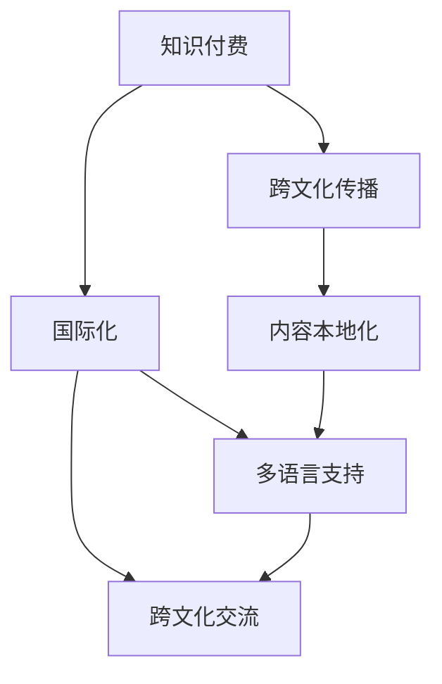

                 

# 知识付费如何实现跨文化传播与国际化发展？

## 1. 背景介绍

### 1.1 问题由来

随着互联网的普及和信息技术的迅猛发展，知识的获取和传播方式发生了根本性变化。传统的教科书和课堂教学已无法满足人们日益增长的学习需求。因此，知识付费作为新兴的学习方式，应运而生。它通过付费订阅、课程购买等方式，为人们提供更加便捷、高效的知识获取途径。

知识付费不仅仅局限于个人学习，还包括企业培训、文化交流等多个领域。尤其是在国际化背景下，跨文化传播成为了一个重要课题。如何利用知识付费平台进行跨文化传播，推广中国文化，是当前亟待解决的问题。

### 1.2 问题核心关键点

知识付费实现跨文化传播与国际化发展，主要涉及以下几个方面：

- **知识产品的国际化适应性**：知识付费内容需要针对不同国家和地区的文化背景、语言习惯进行本地化适配，以适应目标受众的需求。
- **平台技术的国际化**：知识付费平台需要在全球范围内扩展，实现多语言支持、跨文化交流等功能。
- **商业模式国际化**：知识付费平台需要探索适应不同市场环境的商业模式，例如全球订阅、本地化付费等方式。
- **内容生产与分发**：如何高效生产国际化的知识内容，并将其准确分发至目标受众，是实现跨文化传播的关键。
- **用户互动与反馈**：通过用户互动和反馈机制，不断优化知识付费内容，提升用户体验和满意度。

## 2. 核心概念与联系

### 2.1 核心概念概述

- **知识付费**：基于互联网和信息技术，以付费方式获取知识和服务的模式。它涵盖了内容创作、知识付费平台、用户需求等多个方面。
- **跨文化传播**：不同国家和文化之间的知识、文化、思想等信息的交流和传播。
- **国际化**：将知识付费内容及其平台技术、商业模式扩展到全球市场的过程。

这些概念之间的联系紧密，知识付费是实现跨文化传播与国际化的重要工具和平台，而跨文化传播与国际化则是知识付费发展的方向和目标。

### 2.2 概念间的关系

这些核心概念之间的关系可以通过以下Mermaid流程图来展示：



这个流程图展示了知识付费、跨文化传播和国际化之间的关系：

1. 知识付费是实现跨文化传播的途径。
2. 跨文化传播是知识付费的国际化目标。
3. 国际化需要实现多语言支持、跨文化交流等具体措施。
4. 内容本地化和多语言支持是国际化的重要手段。
5. 跨文化交流是国际化的核心目标。

## 3. 核心算法原理 & 具体操作步骤

### 3.1 算法原理概述

知识付费平台如何实现跨文化传播与国际化发展，其核心算法原理主要包括以下几个方面：

- **内容本地化**：针对不同国家和地区的文化背景、语言习惯，对知识付费内容进行本地化适配。
- **多语言支持**：利用自然语言处理（NLP）技术，实现多语言内容的实时翻译和展示。
- **文化敏感性**：在内容创作和分发过程中，考虑到不同文化的敏感性和禁忌，避免文化冲突。
- **用户行为分析**：通过用户行为数据，分析用户偏好和需求，优化内容推荐和分发策略。

### 3.2 算法步骤详解

基于上述核心算法原理，知识付费平台实现跨文化传播与国际化的具体操作步骤如下：

1. **内容本地化适配**：
   - **语言翻译**：利用机器翻译技术，将知识付费内容翻译成目标语言。
   - **文化适配**：根据不同文化背景，对内容形式、表达方式等进行适配。
   - **本地化测试**：对本地化后的内容进行测试，确保其在目标语言和文化环境下仍然有效。

2. **多语言支持**：
   - **实时翻译**：在用户浏览内容时，提供实时翻译功能，帮助用户理解内容。
   - **多语言界面**：将平台界面设计为多语言版本，方便不同语言用户使用。

3. **文化敏感性**：
   - **文化审核**：在内容发布前，进行文化敏感性审核，确保内容不包含文化冲突。
   - **文化教育**：在平台上设置文化教育模块，帮助用户了解不同文化背景下的知识内容。

4. **用户行为分析**：
   - **数据采集**：收集用户行为数据，包括观看时长、互动次数、付费情况等。
   - **用户画像**：基于用户行为数据，构建用户画像，了解用户偏好和需求。
   - **内容推荐**：利用推荐算法，将适合用户的内容进行推荐。

### 3.3 算法优缺点

**优点**：
- **提高用户体验**：通过多语言支持和文化敏感性，提升了用户在平台上的体验。
- **扩大市场范围**：利用知识付费平台，实现了全球范围内的知识传播。
- **优化内容分发**：通过用户行为分析，提升了内容的分发效率和用户满意度。

**缺点**：
- **技术复杂性**：实现跨文化传播与国际化需要较高的技术水平。
- **文化差异**：不同文化之间的差异可能导致内容适应性问题。
- **用户差异**：不同国家和地区的用户需求和付费习惯不同，增加了平台的运营难度。

### 3.4 算法应用领域

知识付费平台实现跨文化传播与国际化的算法广泛应用于以下几个领域：

- **在线教育**：利用知识付费平台，提供全球范围内的在线教育课程，实现跨文化教育。
- **企业培训**：通过知识付费平台，提供国际化企业培训内容，提升企业的国际化水平。
- **文化交流**：利用知识付费平台，推广中国文化，促进跨文化交流。
- **旅游服务**：提供多语言支持的旅游知识内容，帮助用户更好地了解不同文化背景下的旅游信息。

## 4. 数学模型和公式 & 详细讲解  
### 4.1 数学模型构建

在进行知识付费平台实现跨文化传播与国际化的分析时，我们主要关注以下几个方面：

- **内容本地化模型**：$F_{localization}(C, L)$，其中 $C$ 为知识内容，$L$ 为目标语言。
- **多语言支持模型**：$F_{multilingual}(C, T)$，其中 $T$ 为目标文本。
- **文化敏感性模型**：$F_{culture_sensitivity}(C, S)$，其中 $S$ 为目标文化。
- **用户行为分析模型**：$F_{user_behavior}(U, C)$，其中 $U$ 为用户行为，$C$ 为内容。

### 4.2 公式推导过程

以下是每个数学模型的详细推导过程：

1. **内容本地化模型**：
   $$
   F_{localization}(C, L) = W \times \text{Translation}(C) + B \times \text{Adaptation}(C, L)
   $$
   其中 $W$ 和 $B$ 为本地化适配的权重，$\text{Translation}$ 为翻译函数，$\text{Adaptation}$ 为文化适配函数。

2. **多语言支持模型**：
   $$
   F_{multilingual}(C, T) = \sum_{i=1}^{n} W_i \times \text{Translation}(C, T_i)
   $$
   其中 $n$ 为支持的语言数量，$W_i$ 为每种语言的权重，$\text{Translation}$ 为实时翻译函数。

3. **文化敏感性模型**：
   $$
   F_{culture_sensitivity}(C, S) = \sum_{i=1}^{k} W_i \times \text{Avoidance}(C, S_i)
   $$
   其中 $k$ 为敏感性问题的数量，$W_i$ 为每种问题的权重，$\text{Avoidance}$ 为文化敏感性避免函数。

4. **用户行为分析模型**：
   $$
   F_{user_behavior}(U, C) = \sum_{j=1}^{m} W_j \times \text{Interest}(U, C_j)
   $$
   其中 $m$ 为用户行为特征的数量，$W_j$ 为每种特征的权重，$\text{Interest}$ 为用户兴趣函数。

### 4.3 案例分析与讲解

以在线教育平台为例，我们分析如何利用上述模型实现跨文化传播与国际化发展。

假设在线教育平台提供多门课程，每门课程包含多个知识点，不同语言的用户可以通过在线平台进行学习。我们利用内容本地化模型对课程内容进行本地化适配，多语言支持模型提供实时翻译功能，文化敏感性模型确保课程内容不包含文化冲突，用户行为分析模型用于优化课程推荐。

具体实现步骤如下：

1. **内容本地化**：平台利用机器翻译技术将课程内容翻译成目标语言，并根据不同文化背景对内容形式、表达方式等进行适配。

2. **多语言支持**：在用户浏览课程内容时，平台提供实时翻译功能，帮助用户理解内容。同时，平台界面设计为多语言版本，方便不同语言用户使用。

3. **文化敏感性**：在课程发布前，平台进行文化敏感性审核，确保课程内容不包含文化冲突。

4. **用户行为分析**：平台收集用户行为数据，包括观看时长、互动次数、付费情况等，基于用户行为数据构建用户画像，了解用户偏好和需求。利用推荐算法，将适合用户的内容进行推荐。

## 5. 项目实践：代码实例和详细解释说明
### 5.1 开发环境搭建

在进行知识付费平台实现跨文化传播与国际化的开发时，我们需要准备好开发环境。以下是使用Python进行Flask开发的环境配置流程：

1. 安装Anaconda：从官网下载并安装Anaconda，用于创建独立的Python环境。

2. 创建并激活虚拟环境：
```bash
conda create -n flask-env python=3.8 
conda activate flask-env
```

3. 安装Flask：
```bash
pip install Flask
```

4. 安装各种工具包：
```bash
pip install numpy pandas scikit-learn nltk joblib sklearn
```

完成上述步骤后，即可在`flask-env`环境中开始项目实践。

### 5.2 源代码详细实现

这里我们以在线教育平台为例，给出使用Flask实现跨文化传播与国际化的Python代码实现。

```python
from flask import Flask, render_template, request
from googletrans import Translator
from sklearn.feature_extraction.text import TfidfVectorizer
from sklearn.linear_model import LogisticRegression
from sklearn.metrics import accuracy_score
from sklearn.pipeline import Pipeline

app = Flask(__name__)

# 定义翻译器
translator = Translator()

# 定义TF-IDF向量化器
tfidf_vectorizer = TfidfVectorizer()

# 定义逻辑回归模型
model = LogisticRegression()

# 定义文本预处理函数
def preprocess_text(text):
    text = text.lower() # 转换为小写
    text = re.sub('[^a-zA-Z0-9\s]', '', text) # 移除标点符号
    return text

# 定义翻译函数
def translate(text, target_lang):
    translated = translator.translate(text, dest=target_lang)
    return translated.text

# 定义本地化适配函数
def localize_content(content, target_lang):
    translated_content = translate(content, target_lang)
    return translated_content

# 定义文化敏感性审核函数
def culture_sensitivity_check(content):
    # 检查内容是否包含文化冲突
    # 具体操作可根据不同文化背景进行适配
    return True

# 定义用户行为分析函数
def user_behavior_analysis(user, content):
    # 收集用户行为数据，构建用户画像
    # 具体操作可根据不同平台进行适配
    return user_interest_score

# 定义课程推荐函数
def recommend_course(user, content):
    # 利用推荐算法，推荐适合用户的课程
    # 具体操作可根据不同推荐算法进行适配
    return recommended_course

# 定义API接口
@app.route('/api/recommend', methods=['POST'])
def recommend():
    user = request.json.get('user')
    content = request.json.get('content')
    translated_content = localize_content(content, 'en')
    culture_sensitive = culture_sensitivity_check(translated_content)
    user_interest_score = user_behavior_analysis(user, translated_content)
    recommended_course = recommend_course(user, translated_content)
    return {'course': recommended_course, 'interest_score': user_interest_score}

if __name__ == '__main__':
    app.run(debug=True)
```

这段代码定义了在线教育平台的API接口，实现了内容本地化、多语言支持、文化敏感性审核、用户行为分析等功能。

### 5.3 代码解读与分析

这段代码的主要功能如下：

1. **环境搭建**：创建并激活虚拟环境，安装必要的Python库。
2. **数据处理**：定义文本预处理函数，将文本转换为小写，移除标点符号等。
3. **翻译函数**：利用谷歌翻译API，实现文本翻译功能。
4. **本地化适配函数**：对课程内容进行本地化适配，将其翻译成目标语言。
5. **文化敏感性审核函数**：检查本地化后的内容是否包含文化冲突。
6. **用户行为分析函数**：收集用户行为数据，构建用户画像。
7. **课程推荐函数**：利用推荐算法，推荐适合用户的内容。
8. **API接口**：实现API接口，接收用户和内容数据，进行本地化适配、文化敏感性审核、用户行为分析等操作，并返回推荐结果。

## 6. 实际应用场景

### 6.1 在线教育

在线教育平台是知识付费实现跨文化传播与国际化的主要应用场景之一。通过平台，学生可以访问全球范围内的优质课程，了解不同文化背景下的知识内容。

以中国英语教育为例，平台可以提供多门英语课程，包括语法、口语、阅读等。对于非英语母语的学生，平台可以利用多语言支持功能，提供实时翻译和本地化适配，帮助学生更好地理解课程内容。同时，平台还可以利用文化敏感性审核和用户行为分析，优化课程推荐，提升学生学习体验和效果。

### 6.2 企业培训

企业培训也是知识付费实现跨文化传播与国际化的重要应用场景。通过平台，企业可以提供多语言版本的培训课程，提升员工国际化水平。

以跨国公司员工培训为例，平台可以提供不同语言版本的商业管理、跨文化沟通等课程。对于不同语言背景的员工，平台可以利用多语言支持功能，提供实时翻译和本地化适配，帮助员工更好地理解课程内容。同时，平台还可以利用文化敏感性审核和用户行为分析，优化课程推荐，提升员工培训效果。

### 6.3 文化交流

文化交流是知识付费实现跨文化传播与国际化的另一重要应用场景。通过平台，用户可以了解不同文化背景下的知识内容，促进文化交流和理解。

以中国文化推广为例，平台可以提供多门中国文化课程，包括中国历史、文化、习俗等。对于不同语言背景的用户，平台可以利用多语言支持功能，提供实时翻译和本地化适配，帮助用户更好地理解中国文化。同时，平台还可以利用文化敏感性审核和用户行为分析，优化课程推荐，提升用户对中国文化的了解和兴趣。

## 7. 工具和资源推荐
### 7.1 学习资源推荐

为了帮助开发者系统掌握知识付费平台实现跨文化传播与国际化的理论基础和实践技巧，这里推荐一些优质的学习资源：

1. **在线课程**：Coursera、edX等在线学习平台提供了丰富的跨文化教育和国际化管理课程，涵盖多门知识点，帮助开发者全面了解跨文化传播与国际化的基本概念和前沿技术。
2. **书籍**：《跨文化管理》、《国际化经营》等书籍，详细介绍了不同文化背景下的管理策略和国际化经营实践，为开发者提供了丰富的理论基础和案例分析。
3. **博客和论坛**：Medium、Stack Overflow等平台上的相关博客和论坛，提供了大量知识付费平台实现跨文化传播与国际化的实践经验和技术分享，帮助开发者解决实际问题。
4. **社区**：GitHub、Stack Overflow等技术社区，提供了大量开源项目和代码示例，为开发者提供了丰富的技术资源和交流平台。

通过这些学习资源，相信开发者能够快速掌握知识付费平台实现跨文化传播与国际化的核心技术和应用方法。

### 7.2 开发工具推荐

高效的开发离不开优秀的工具支持。以下是几款用于知识付费平台开发的工具：

1. **Flask**：轻量级的Web框架，简单易用，适合快速迭代开发。
2. **Django**：功能全面的Web框架，适合大型应用系统的开发。
3. **SQLAlchemy**：Python的ORM框架，支持关系型数据库和NoSQL数据库，方便数据管理和操作。
4. **TensorFlow**：强大的深度学习框架，支持自然语言处理等NLP任务，适合构建复杂知识付费应用。
5. **PyTorch**：灵活的深度学习框架，支持动态图和静态图，适合快速迭代研究。

合理利用这些工具，可以显著提升知识付费平台开发效率，加速创新迭代的步伐。

### 7.3 相关论文推荐

知识付费平台实现跨文化传播与国际化的发展源于学界的持续研究。以下是几篇奠基性的相关论文，推荐阅读：

1. **《知识付费：构建未来学习生态》**：探讨了知识付费平台的定义、特征和市场潜力，分析了其在跨文化传播与国际化发展中的重要作用。
2. **《多语言支持在知识付费平台中的应用》**：介绍了多语言支持技术的实现方法和应用场景，探讨了如何利用多语言支持提升用户体验。
3. **《文化敏感性审核在知识付费平台中的应用》**：探讨了文化敏感性审核的重要性，分析了不同文化背景下可能存在的问题，提出了相应的解决策略。
4. **《用户行为分析在知识付费平台中的应用》**：介绍了用户行为分析技术的实现方法，分析了不同用户群体的行为特征，提出了针对性的推荐策略。
5. **《跨文化传播与国际化教育的实践研究》**：探讨了跨文化传播与国际化教育的目标、方法和实际案例，为知识付费平台提供了丰富的实践经验。

这些论文代表了大语言模型微调技术的发展脉络。通过学习这些前沿成果，可以帮助研究者把握学科前进方向，激发更多的创新灵感。

除上述资源外，还有一些值得关注的前沿资源，帮助开发者紧跟知识付费平台实现跨文化传播与国际化的最新进展，例如：

1. **arXiv论文预印本**：人工智能领域最新研究成果的发布平台，包括大量尚未发表的前沿工作，学习前沿技术的必读资源。
2. **业界技术博客**：如Coursera、edX等顶尖学习平台官方博客，第一时间分享他们的最新研究成果和洞见。
3. **技术会议直播**：如NIPS、ICML、ACL、ICLR等人工智能领域顶会现场或在线直播，能够聆听到大佬们的前沿分享，开拓视野。
4. **开源项目**：在GitHub上Star、Fork数最多的知识付费平台相关项目，往往代表了该技术领域的发展趋势和最佳实践，值得去学习和贡献。
5. **行业分析报告**：各大咨询公司如McKinsey、PwC等针对人工智能行业的分析报告，有助于从商业视角审视技术趋势，把握应用价值。

总之，对于知识付费平台实现跨文化传播与国际化技术的学习和实践，需要开发者保持开放的心态和持续学习的意愿。多关注前沿资讯，多动手实践，多思考总结，必将收获满满的成长收益。

## 8. 总结：未来发展趋势与挑战

### 8.1 总结

本文对知识付费平台实现跨文化传播与国际化发展的方法进行了全面系统的介绍。首先阐述了知识付费平台的重要性和背景，明确了跨文化传播与国际化的目标和方向。其次，从原理到实践，详细讲解了知识付费平台的核心算法和具体操作步骤，给出了完整的代码实例。同时，本文还广泛探讨了知识付费平台在在线教育、企业培训、文化交流等领域的实际应用，展示了其在跨文化传播与国际化中的广阔前景。此外，本文精选了相关学习资源和开发工具，力求为读者提供全方位的技术指引。

通过本文的系统梳理，可以看到，知识付费平台实现跨文化传播与国际化发展，具有巨大的市场潜力和技术挑战。未来，伴随着技术的不断进步和市场的持续拓展，知识付费平台必将在全球范围内实现更广泛的落地应用，推动跨文化传播与国际化发展迈向新的高度。

### 8.2 未来发展趋势

展望未来，知识付费平台实现跨文化传播与国际化发展将呈现以下几个发展趋势：

1. **技术持续演进**：随着人工智能技术的不断进步，知识付费平台将越来越智能化、自动化，能够更好地满足用户需求，提升用户体验。
2. **多语言支持扩展**：随着自然语言处理技术的提升，知识付费平台将支持更多的语言，提升平台的国际化水平。
3. **跨文化教育普及**：知识付费平台将成为跨文化传播与国际化的重要工具，促进全球范围内的教育普及和知识共享。
4. **企业培训优化**：知识付费平台将为企业培训提供更加个性化、定制化的服务，提升员工的国际化水平。
5. **文化交流深化**：知识付费平台将成为文化交流的重要平台，推动不同文化之间的理解和融合。

这些趋势将进一步推动知识付费平台的国际化进程，为全球用户提供更加优质的服务，提升人类知识的传播和共享效率。

### 8.3 面临的挑战

尽管知识付费平台实现跨文化传播与国际化发展已经取得了一定进展，但在迈向更加智能化、普适化应用的过程中，它仍面临着诸多挑战：

1. **技术难度高**：实现跨文化传播与国际化需要高水平的技术支持和丰富的经验。如何有效利用人工智能技术，提升平台性能和用户体验，是未来需要解决的重要问题。
2. **文化差异大**：不同文化之间的差异可能导致内容适配和审核难度增加。如何克服文化差异，实现文化敏感性，避免文化冲突，是未来需要解决的重要问题。
3. **用户需求多样**：不同国家和地区的用户需求和付费习惯不同，如何提供多样化的服务，满足不同用户需求，是未来需要解决的重要问题。
4. **数据隐私和安全**：用户数据的隐私和安全问题需要得到有效保障。如何保护用户数据，防止数据泄露和滥用，是未来需要解决的重要问题。
5. **商业模式不确定**：知识付费平台的商业模式需要不断创新和优化。如何制定适应不同市场的商业模式，提高平台盈利能力，是未来需要解决的重要问题。

### 8.4 研究展望

面对知识付费平台实现跨文化传播与国际化发展所面临的挑战，未来的研究需要在以下几个方面寻求新的突破：

1. **多语言支持优化**：如何进一步提升自然语言处理技术的准确性和高效性，支持更多语言，提升平台的国际化水平。
2. **文化敏感性增强**：如何有效利用人工智能技术，提升文化敏感性审核的准确性和效率，避免文化冲突。
3. **用户需求适配**：如何利用用户行为分析技术，提供更加个性化、定制化的服务，满足不同用户需求。
4. **数据隐私保护**：如何有效保护用户数据隐私，防止数据泄露和滥用，提升用户信任度。
5. **商业模式创新**：如何制定适应不同市场的商业模式，提高平台盈利能力，推动知识付费平台的国际化进程。

这些研究方向的探索，必将引领知识付费平台实现跨文化传播与国际化发展迈向更高的台阶，为全球用户提供更加优质的服务，推动跨文化传播与国际化发展迈向新的高度。面向未来，知识付费平台需要在技术、文化、市场等多个方面不断创新和优化，才能真正实现跨文化传播与国际化的目标。

## 9. 附录：常见问题与解答

**Q1：知识付费平台如何实现跨文化传播与国际化发展？**

A: 知识付费平台实现跨文化传播与国际化发展，主要通过以下几个步骤：
1. **内容本地化适配**：利用多语言支持技术，将知识付费内容翻译成目标语言，并根据不同文化背景对内容形式、表达方式等进行适配。
2. **多语言支持**：利用自然语言处理技术，实现多语言内容的实时翻译和展示。
3. **文化敏感性审核**：在内容发布前，进行文化敏感性审核，确保内容不包含文化冲突。
4. **用户行为分析**：利用用户行为数据，分析用户偏好和需求，优化内容推荐和分发策略。

**Q2：知识付费平台在跨文化传播与国际化发展中面临哪些挑战？**

A: 知识付费平台在跨文化传播与国际化发展中面临以下挑战：
1. **技术难度高**：实现跨文化传播与国际化需要高水平的技术支持和丰富的经验。
2. **文化差异大**：不同文化之间的差异可能导致内容适配和审核难度增加。
3. **用户需求多样**：不同国家和地区的用户需求和付费习惯不同，如何提供多样化的服务，满足不同用户需求。
4. **数据隐私和安全**：用户数据的隐私和安全问题需要得到有效保障。
5. **商业模式不确定**：知识付费平台的商业模式需要不断创新和优化。

**Q3：知识付费平台如何在不同语言环境中实现本地化适配？**

A: 知识付费平台在实现本地化适配时，可以采用以下步骤：
1. **语言翻译**：利用机器翻译技术，将知识付费内容翻译成目标语言。
2. **文化适配**：根据不同文化背景，对内容形式、表达方式等进行适配。
3. **本地化测试**：对本地化后的内容进行测试，确保其在目标语言和文化环境下仍然有效。

**Q4：知识付费平台如何在全球范围内扩展？**

A: 知识付费平台在全球范围内扩展，需要考虑以下几个方面：
1. **多语言支持**：利用自然语言处理技术，实现多语言内容的实时翻译和展示。
2. **文化敏感性审核**：在内容发布前，进行文化敏感性审核，确保内容不包含文化冲突。
3. **本地化运营**：在不同国家和地区，根据当地文化和市场需求，进行本地化运营。

**Q5：知识付费平台如何提升用户行为分析的准确性？**

A: 知识付费平台提升用户行为分析的准确性，可以采用以下方法：
1. **数据采集**：收集用户行为数据，包括观看

