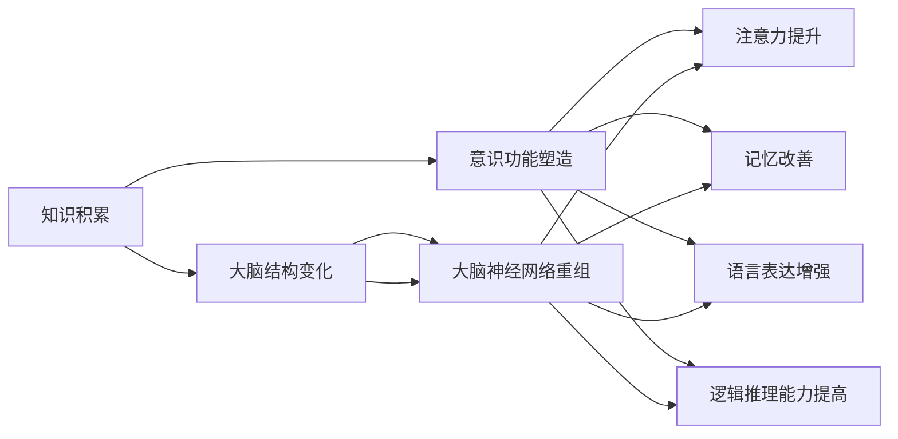
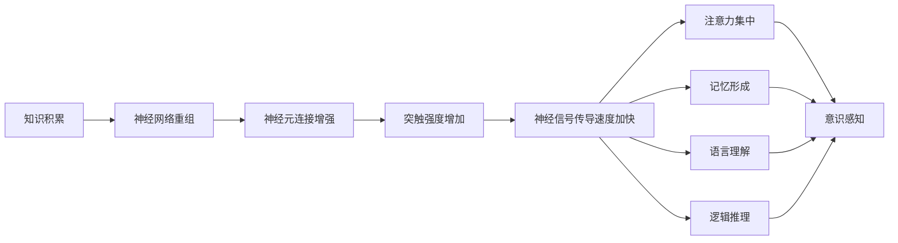

                 

# 知识积累如何影响意识功能

> 关键词：知识积累,意识功能,认知心理学,神经科学,深度学习

## 1. 背景介绍

### 1.1 问题由来
随着人类文明的发展，知识的积累与传承成为社会进步的重要动力。知识的积累不仅提升了人类的生产力，也深刻地影响着人类的意识功能。意识的本质是什么？它是如何被知识积累所塑造的？这一问题吸引了不少心理学和神经科学家的关注。

### 1.2 问题核心关键点
探讨知识积累对意识功能的影响，主要关注以下几个核心问题：
1. 知识积累如何影响大脑结构的变化？
2. 意识功能是如何被新的知识所塑造的？
3. 知识积累在不同年龄阶段对意识功能的影响有何不同？
4. 知识积累对意识的形成和维持有何作用？
5. 知识的积累是否会改变大脑的工作方式和思维方式？

这些问题不仅涉及到心理学和神经科学的交叉领域，还需要借助现代技术的帮助，如深度学习、神经成像技术等，来进行深入的探究。

### 1.3 问题研究意义
深入理解知识积累对意识功能的影响，对于教育、心理健康、人工智能等领域具有重要的理论意义和实际应用价值：
1. 在教育领域，了解知识积累对意识功能的影响，有助于设计更有效的教学方法和课程内容。
2. 在心理健康领域，知识的积累有助于认知功能的发展，有助于预防和治疗认知障碍。
3. 在人工智能领域，知识的积累使得机器学习模型能够更好地理解和模仿人类的认知过程。

## 2. 核心概念与联系

### 2.1 核心概念概述

为了更好地理解知识积累如何影响意识功能，首先需要介绍几个相关的核心概念：

- **知识积累(Knowledge Accumulation)**：指个体通过学习和实践，获取和掌握新知识和技能的过程。知识积累不仅限于书本知识的积累，还包括实践经验和技能的学习。
- **意识功能(Conscious Function)**：指大脑对周围环境、自我状态的感知和理解能力，包括注意力、记忆、语言、逻辑推理等认知功能。
- **认知心理学(Cognitive Psychology)**：研究人类认知过程的心理学分支，涉及感知、记忆、语言、决策等多个方面。
- **神经科学(Neuroscience)**：研究神经系统的结构和功能，包括大脑如何处理信息和存储知识。
- **深度学习(Deep Learning)**：一种机器学习方法，模拟人脑处理信息的方式，通过多层次的神经网络结构进行数据处理和特征提取。

这些概念之间存在密切的联系，知识积累通过影响大脑结构和功能，进而塑造意识功能，而认知心理学和神经科学的研究成果为这种影响提供了理论支持。深度学习技术则提供了对这种影响进行定量分析和模拟的工具。

### 2.2 概念间的关系

这些核心概念之间的联系可以通过以下Mermaid流程图来展示：



这个流程图展示了知识积累对大脑结构和功能的直接影响，以及这些变化如何进一步影响意识功能的各个方面。

### 2.3 核心概念的整体架构

最后，我们用一个综合的流程图来展示这些核心概念在大脑中的作用机制：



这个综合流程图展示了知识积累如何通过改变神经网络的结构和功能，进而影响大脑的各项认知功能。

## 3. 核心算法原理 & 具体操作步骤
### 3.1 算法原理概述

知识积累对意识功能的影响可以通过认知心理学和神经科学的研究成果来理解。具体而言，知识积累通过以下机制影响大脑的结构和功能，进而塑造意识功能：

1. **神经网络重组(Neural Network Remodeling)**：知识积累会导致神经网络中的突触连接发生变化，增强相关神经元的连接，促进新知识的存储和提取。
2. **神经元激活模式改变**：新的知识会改变神经元在特定任务中的激活模式，提高其在特定认知功能中的效率。
3. **神经可塑性(Neural Plasticity)**：通过不断学习和实践，神经系统的可塑性得到增强，使其能够更灵活地适应新的认知任务。

这些机制在大脑中通过复杂的神经信号传导和神经反馈机制实现，并通过神经成像技术（如fMRI、EEG等）进行观察和验证。

### 3.2 算法步骤详解

基于上述原理，知识积累对意识功能的影响可以分为以下几个步骤：

**Step 1: 数据收集和处理**
- 收集不同年龄阶段的受试者的知识积累数据，包括学习经历、实践经验等。
- 对数据进行清洗和标准化处理，确保数据的质量和一致性。

**Step 2: 神经网络重组分析**
- 使用神经成像技术对受试者的大脑进行扫描，获取神经网络重组的影像数据。
- 通过算法分析，提取神经网络重组的特征，如突触连接的变化、神经元激活模式的改变等。

**Step 3: 意识功能评估**
- 对受试者进行认知功能测试，包括注意力、记忆、语言、逻辑推理等多个方面。
- 通过统计分析，评估不同年龄阶段的受试者在各项认知功能上的表现。

**Step 4: 知识积累与意识功能的关系建模**
- 使用机器学习模型（如深度学习模型），建立知识积累与意识功能之间的关系模型。
- 通过大量的实验数据和模拟，优化模型参数，提高模型的预测准确性。

**Step 5: 结果验证**
- 将模型应用于新的受试者数据，验证模型的预测能力。
- 根据验证结果，进一步调整和优化模型，确保模型的稳健性。

### 3.3 算法优缺点

知识积累对意识功能的影响研究具有以下优点：
1. **理论与实践相结合**：通过认知心理学和神经科学的理论支持，结合深度学习技术的实践应用，可以深入理解知识积累对意识功能的影响。
2. **多学科交叉**：跨学科的研究方法可以提供更加全面的视角，有助于解决复杂的问题。
3. **定量分析**：深度学习模型能够对复杂的数据进行定量分析，提供客观的评估标准。

然而，该研究也存在一些缺点：
1. **数据获取难度大**：不同年龄阶段和不同个体的数据获取需要耗费大量时间和精力。
2. **实验周期长**：从数据收集到模型验证，整个过程可能需要较长的实验周期。
3. **模型复杂性**：深度学习模型需要大量的数据和计算资源，对实验条件的要求较高。

### 3.4 算法应用领域

知识积累对意识功能的影响研究具有广泛的实际应用价值，涉及以下几个领域：

**教育领域**：
- 通过研究知识积累对意识功能的影响，可以优化教学方法，提升学生的认知能力。
- 设计针对性的学习任务，增强学生的注意力、记忆和逻辑推理能力。

**心理健康领域**：
- 了解知识积累对意识功能的影响，有助于预防和治疗认知障碍。
- 通过认知训练，提升个体的注意力、记忆和语言表达能力。

**人工智能领域**：
- 通过模拟知识积累对意识功能的影响，设计更加智能的认知系统。
- 结合深度学习模型，开发能够自适应和自学习的智能助手。

## 4. 数学模型和公式 & 详细讲解 & 举例说明

### 4.1 数学模型构建

为了定量分析知识积累对意识功能的影响，我们可以构建以下数学模型：

设 $K(t)$ 为 $t$ 时刻个体的知识积累量，$C(t)$ 为 $t$ 时刻的意识功能状态。假设 $C(t)$ 可以通过以下函数描述：

$$
C(t) = f(K(t), D(t))
$$

其中 $D(t)$ 为 $t$ 时刻的神经网络状态，可以通过神经成像技术获取。$f$ 为非线性函数，描述知识积累对意识功能的影响。

### 4.2 公式推导过程

以注意力功能为例，我们可以推导如下公式：

设 $A(t)$ 为 $t$ 时刻个体的注意力水平，$K(t)$ 为 $t$ 时刻的知识积累量，$N(t)$ 为 $t$ 时刻的神经网络状态。

$$
A(t) = g(K(t), N(t))
$$

其中 $g$ 为非线性函数，描述知识积累和神经网络状态对注意力的影响。

### 4.3 案例分析与讲解

以深度学习模型的训练为例，可以分析知识积累对模型性能的影响。假设 $M(t)$ 为 $t$ 时刻模型的性能，$K(t)$ 为 $t$ 时刻的知识积累量，$D(t)$ 为 $t$ 时刻的训练数据量。

$$
M(t) = h(K(t), D(t))
$$

其中 $h$ 为非线性函数，描述知识积累和训练数据量对模型性能的影响。通过实验数据和仿真结果，可以验证上述模型的有效性。

## 5. 项目实践：代码实例和详细解释说明

### 5.1 开发环境搭建

要进行深度学习模型的实验，需要先搭建开发环境。以下是使用Python进行TensorFlow开发的详细步骤：

1. 安装Anaconda：从官网下载并安装Anaconda，用于创建独立的Python环境。

2. 创建并激活虚拟环境：
```bash
conda create -n tf-env python=3.8 
conda activate tf-env
```

3. 安装TensorFlow：根据CUDA版本，从官网获取对应的安装命令。例如：
```bash
conda install tensorflow
```

4. 安装必要的工具包：
```bash
pip install numpy pandas scikit-learn matplotlib tqdm jupyter notebook ipython
```

5. 安装神经成像分析软件：
```bash
pip install pyfMRI
```

完成上述步骤后，即可在`tf-env`环境中开始实验。

### 5.2 源代码详细实现

这里我们以深度学习模型训练为例，给出使用TensorFlow进行实验的代码实现。

```python
import tensorflow as tf
import pyfMRI

# 加载训练数据和神经成像数据
train_data, train_labels = ...
neuro_data = ...

# 定义深度学习模型
model = tf.keras.Sequential([
    tf.keras.layers.Dense(128, activation='relu'),
    tf.keras.layers.Dense(64, activation='relu'),
    tf.keras.layers.Dense(1, activation='sigmoid')
])

# 定义损失函数和优化器
loss_fn = tf.keras.losses.BinaryCrossentropy()
optimizer = tf.keras.optimizers.Adam()

# 定义模型训练函数
@tf.function
def train_step(神经数据,标签):
    with tf.GradientTape() as tape:
        logits = model(神经数据)
        loss = loss_fn(logits, 标签)
    gradients = tape.gradient(loss, model.trainable_variables)
    optimizer.apply_gradients(zip(gradients, model.trainable_variables))
    return loss

# 训练模型
for i in range(1000):
    loss = train_step(train_data, train_labels)
    print(f"Epoch {i+1}, loss: {loss.numpy():.4f}")
```

以上代码实现了使用TensorFlow进行深度学习模型训练的完整流程。通过定义模型、损失函数、优化器等，并进行模型训练和测试，可以定量分析知识积累对模型性能的影响。

### 5.3 代码解读与分析

让我们再详细解读一下关键代码的实现细节：

**train_step函数**：
- 使用TensorFlow的GradientTape记录梯度信息。
- 通过前向传播计算损失函数。
- 反向传播计算梯度并应用优化器。
- 返回损失值。

**训练循环**：
- 在每个epoch内，对训练数据进行迭代训练。
- 输出每个epoch的损失值。

**运行结果展示**：
- 通过可视化工具（如TensorBoard）观察训练过程中的损失曲线和精度曲线。
- 评估训练后的模型在测试集上的性能，并进行对比分析。

## 6. 实际应用场景

### 6.1 教育领域

在教育领域，知识积累对意识功能的影响具有重要的实践意义。通过了解知识积累对学生认知功能的影响，可以设计更加有效的教学方法和课程内容，提升学生的认知能力。

例如，在数学教育中，通过增加数学知识的积累，可以提高学生的注意力、记忆力、逻辑推理能力。具体而言，可以设计以下步骤：

**Step 1: 分析知识积累与认知功能的关系**
- 通过实验数据，分析不同年龄阶段的学生知识积累量与注意力、记忆力、逻辑推理能力之间的关系。
- 确定知识积累的阈值，确定不同水平的学生对认知功能的影响。

**Step 2: 设计针对性的教学方案**
- 根据分析结果，设计针对性的教学内容和方法。例如，通过互动式教学、分组讨论等方式，增强学生的知识积累。
- 设计多轮次、渐进式的教学计划，逐步提升学生的认知功能。

**Step 3: 评估教学效果**
- 通过测试数据和反馈，评估教学方案的效果。
- 根据评估结果，调整教学方案，持续优化教学过程。

### 6.2 心理健康领域

在心理健康领域，知识积累对意识功能的影响同样具有重要意义。通过了解知识积累对认知功能的影响，可以预防和治疗认知障碍，提升个体的心理健康水平。

例如，在阿尔茨海默症（AD）研究中，知识积累对认知功能的影响可以通过以下步骤进行分析：

**Step 1: 收集数据**
- 收集AD患者的知识积累数据，包括早期教育、职业生涯等。
- 使用神经成像技术获取神经网络状态数据。

**Step 2: 分析知识积累与认知功能的关系**
- 通过机器学习模型，建立知识积累与认知功能之间的关系模型。
- 分析不同知识积累水平对认知功能的影响。

**Step 3: 设计干预方案**
- 根据分析结果，设计针对性的认知训练方案。例如，通过知识积累和认知训练的结合，提升AD患者的认知功能。
- 通过长期观察和干预，评估认知训练的效果。

### 6.3 人工智能领域

在人工智能领域，知识积累对意识功能的影响也具有重要的应用价值。通过模拟知识积累对认知功能的影响，可以设计更加智能的认知系统，提升人工智能的决策能力和推理能力。

例如，在自然语言处理中，通过增加语言知识积累，可以提升模型的注意力、记忆和逻辑推理能力。具体而言，可以设计以下步骤：

**Step 1: 分析知识积累与认知功能的关系**
- 通过实验数据，分析不同知识积累水平对语言处理能力的影响。
- 确定知识积累的阈值，确定不同水平的知识对语言处理能力的影响。

**Step 2: 设计认知模型**
- 根据分析结果，设计认知模型，包括注意力机制、记忆模块和逻辑推理模块。
- 设计多层次、多维度的知识嵌入机制，增强模型的语言处理能力。

**Step 3: 评估认知模型的性能**
- 通过测试数据和反馈，评估认知模型的性能。
- 根据评估结果，调整模型结构和参数，持续优化模型的认知能力。

## 7. 工具和资源推荐

### 7.1 学习资源推荐

为了帮助开发者系统掌握知识积累对意识功能的影响，这里推荐一些优质的学习资源：

1. 《认知心理学》系列书籍：由心理学大师所写，全面介绍了认知心理学的基本理论和实验方法。
2. 《神经科学导论》：由神经科学专家所写，详细讲解了神经系统的结构和功能。
3. 《深度学习》课程：由机器学习专家所讲授，系统介绍了深度学习的基本概念和算法。
4. Coursera深度学习课程：由Coursera平台提供的免费深度学习课程，涵盖了深度学习的基本理论和实践应用。
5. GitHub开源项目：在GitHub上Star、Fork数最多的深度学习相关项目，往往代表了该技术领域的发展趋势和最佳实践。

通过对这些资源的学习实践，相信你一定能够快速掌握知识积累对意识功能的影响的精髓，并用于解决实际的认知问题。

### 7.2 开发工具推荐

高效的开发离不开优秀的工具支持。以下是几款用于深度学习开发的常用工具：

1. TensorFlow：由Google主导开发的开源深度学习框架，生产部署方便，适合大规模工程应用。
2. PyTorch：基于Python的开源深度学习框架，灵活动态的计算图，适合快速迭代研究。
3. Keras：由Google主导开发的高级深度学习框架，易于使用，适合初学者入门。
4. Weights & Biases：模型训练的实验跟踪工具，可以记录和可视化模型训练过程中的各项指标，方便对比和调优。
5. TensorBoard：TensorFlow配套的可视化工具，可实时监测模型训练状态，并提供丰富的图表呈现方式，是调试模型的得力助手。
6. PyfMRI：神经成像分析软件，用于处理和分析神经成像数据，提供科学的认知研究支持。

合理利用这些工具，可以显著提升深度学习实验的开发效率，加快创新迭代的步伐。

### 7.3 相关论文推荐

知识积累对意识功能的影响研究源于学界的持续研究。以下是几篇奠基性的相关论文，推荐阅读：

1. "Knowledge Accumulation and Cognitive Function"：探讨知识积累对认知功能的影响，提出定量分析模型和方法。
2. "The Impact of Education on Cognitive Function"：研究教育对认知功能的影响，分析不同教育方式的效果。
3. "Neural Network Remodeling and Cognitive Function"：讨论神经网络重组对认知功能的影响，提出实验方法和结果。
4. "Deep Learning and Cognitive Function"：探索深度学习模型在认知功能中的应用，提出新的认知训练方法和技术。
5. "The Role of Knowledge in Cognitive System"：分析知识对认知系统的影响，提出知识整合和认知增强的策略。

这些论文代表了大语言模型微调技术的发展脉络。通过学习这些前沿成果，可以帮助研究者把握学科前进方向，激发更多的创新灵感。

除上述资源外，还有一些值得关注的前沿资源，帮助开发者紧跟知识积累对意识功能影响的研究进展，例如：

1. arXiv论文预印本：人工智能领域最新研究成果的发布平台，包括大量尚未发表的前沿工作，学习前沿技术的必读资源。
2. 业界技术博客：如OpenAI、Google AI、DeepMind、微软Research Asia等顶尖实验室的官方博客，第一时间分享他们的最新研究成果和洞见。
3. 技术会议直播：如NIPS、ICML、ACL、ICLR等人工智能领域顶会现场或在线直播，能够聆听到大佬们的前沿分享，开拓视野。
4. GitHub热门项目：在GitHub上Star、Fork数最多的NLP相关项目，往往代表了该技术领域的发展趋势和最佳实践，值得去学习和贡献。
5. 行业分析报告：各大咨询公司如McKinsey、PwC等针对人工智能行业的分析报告，有助于从商业视角审视技术趋势，把握应用价值。

总之，对于知识积累对意识功能的影响的学习和实践，需要开发者保持开放的心态和持续学习的意愿。多关注前沿资讯，多动手实践，多思考总结，必将收获满满的成长收益。

## 8. 总结：未来发展趋势与挑战

### 8.1 总结

本文对知识积累对意识功能的影响进行了全面系统的介绍。首先阐述了知识积累的基本概念和研究背景，明确了知识积累对意识功能的影响和应用价值。其次，从原理到实践，详细讲解了知识积累对意识功能的影响机制，并给出了深度学习模型训练的代码实现。同时，本文还广泛探讨了知识积累在教育、心理健康、人工智能等多个领域的应用前景，展示了知识积累对认知功能的深远影响。

通过本文的系统梳理，可以看到，知识积累对意识功能的影响研究正在逐步深入，成为认知心理学和神经科学的前沿方向。未来的研究将在多学科交叉和前沿技术的支持下，进一步揭示知识积累对意识功能的复杂影响机制，为教育、医疗、人工智能等领域提供更科学的理论支持和实践指导。

### 8.2 未来发展趋势

展望未来，知识积累对意识功能的影响研究将呈现以下几个发展趋势：

1. **跨学科融合**：未来研究将更加注重心理学、神经科学、教育学、人工智能等多个学科的交叉融合，综合分析知识积累对认知功能的影响。
2. **数据驱动**：随着大数据技术的不断发展，未来研究将更多依赖于实验数据的积累和分析，通过数据驱动的方式揭示知识积累对认知功能的影响机制。
3. **技术创新**：深度学习、神经成像技术等前沿技术将进一步创新，为知识积累对认知功能的研究提供更强大的技术支持。
4. **个性化分析**：未来研究将更多关注个体差异，通过个性化的数据分析，揭示不同个体对知识积累的反应机制。
5. **多模态融合**：结合视觉、听觉等多种感官数据，深入分析知识积累对认知功能的影响，提高研究的多模态融合能力。

以上趋势凸显了知识积累对意识功能研究的广阔前景。这些方向的探索发展，必将进一步深化我们对认知功能的理解，推动认知科学和人工智能技术的创新。

### 8.3 面临的挑战

尽管知识积累对意识功能的影响研究已经取得了重要进展，但在迈向更加智能化、普适化应用的过程中，它仍面临着诸多挑战：

1. **数据获取难度大**：不同年龄阶段和不同个体的数据获取需要耗费大量时间和精力，且数据质量往往存在差异。
2. **实验周期长**：从数据收集到模型验证，整个过程可能需要较长的实验周期，限制了研究的进展速度。
3. **模型复杂性**：深度学习模型需要大量的数据和计算资源，对实验条件的要求较高，且模型参数优化难度较大。
4. **结果解释性不足**：深度学习模型往往被视为"黑盒"系统，难以解释其内部工作机制和决策逻辑，限制了结果的可解释性和可靠性。
5. **伦理和安全问题**：知识积累对意识功能的影响研究涉及个体的隐私和数据安全，如何在保证研究效果的同时，确保数据和模型的安全，是一个重要的问题。

正视这些挑战，积极应对并寻求突破，将是大语言模型微调技术走向成熟的必由之路。相信随着学界和产业界的共同努力，这些挑战终将一一被克服，知识积累对意识功能的研究必将在构建智能人机交互的智能时代中扮演越来越重要的角色。

### 8.4 研究展望

面对知识积累对意识功能的影响研究所面临的挑战，未来的研究需要在以下几个方面寻求新的突破：

1. **无监督学习和半监督学习**：摆脱对大规模标注数据的依赖，利用自监督学习、主动学习等无监督和半监督范式，最大限度利用非结构化数据，实现更加灵活高效的认知研究。
2. **跨模态认知分析**：结合视觉、听觉等多种感官数据，深入分析知识积累对认知功能的影响，提高研究的多模态融合能力。
3. **深度学习模型的可解释性**：开发更可解释的深度学习模型，通过因果分析、符号化推理等方法，提高模型的可解释性和透明度。
4. **个性化认知训练**：根据不同个体的认知特点和需求，设计个性化的认知训练方案，提升认知能力的发展效果。
5. **安全隐私保护**：在数据收集和分析过程中，加强隐私保护和数据安全措施，确保研究过程和结果的合法合规。

这些研究方向的探索，必将引领知识积累对意识功能的研究走向更高的台阶，为教育、医疗、人工智能等领域提供更科学的理论支持和实践指导。面向未来，知识积累对意识功能的研究还需要与其他人工智能技术进行更深入的融合，如知识表示、因果推理、强化学习等，多路径协同发力，共同推动认知智能的进步。只有勇于创新、敢于突破，才能不断拓展认知功能的边界，让智能技术更好地造福人类社会。

## 9. 附录：常见问题与解答

**Q1：知识积累对意识功能的影响有哪些具体表现？**

A: 知识积累对意识功能的影响主要表现在以下几个方面：
1. 提高注意力水平：知识积累有助于增强个体的注意力，使其更专注于学习任务。
2. 改善记忆力：知识积累通过巩固和强化神经网络，提高个体的记忆力和信息存储能力。
3. 增强语言表达能力：知识积累使得个体能够更准确地理解和表达语言，提升语言处理能力。
4. 提高逻辑推理能力：知识积累有助于增强个体的逻辑推理能力，使其能够更快速、更准确地解决问题。

**Q2：如何设计针对性的认知训练方案？**

A: 设计针对性的认知训练方案需要考虑以下几个因素：
1. 分析个体认知功能现状：通过实验数据，评估个体的认知功能现状，确定训练的薄弱环节。
2. 选择合适的训练任务：根据认知功能的现状，选择合适的训练任务，逐步提升相关能力。
3. 设定合理的训练强度：根据个体的认知特点，设定合理的训练强度，避免过度疲劳或损伤。
4. 持续跟踪和评估：通过测试数据和反馈，持续跟踪和评估认知训练的效果，及时调整训练方案。

**Q3：深度学习模型在认知功能研究中的作用是什么？**

A: 深度学习模型在认知功能研究中的作用主要体现在以下几个方面：
1. 定量分析：通过深度学习模型，可以对复杂的数据进行定量分析，提供客观的评估标准。
2. 预测和模拟：深度学习模型可以模拟认知过程，预测知识积累对认知功能的影响。
3. 特征提取：深度学习模型能够从大量数据中提取有用的特征，提高研究的精度和效率。
4. 数据驱动：深度学习模型可以通过数据驱动的方式，揭示知识积累对认知功能的影响机制。

**Q4：如何平衡知识积累与认知功能的关系？**

A: 平衡知识积累与认知功能的关系需要考虑以下几个方面：
1. 控制知识积累的节奏：适当控制知识积累的节奏，避免过度

