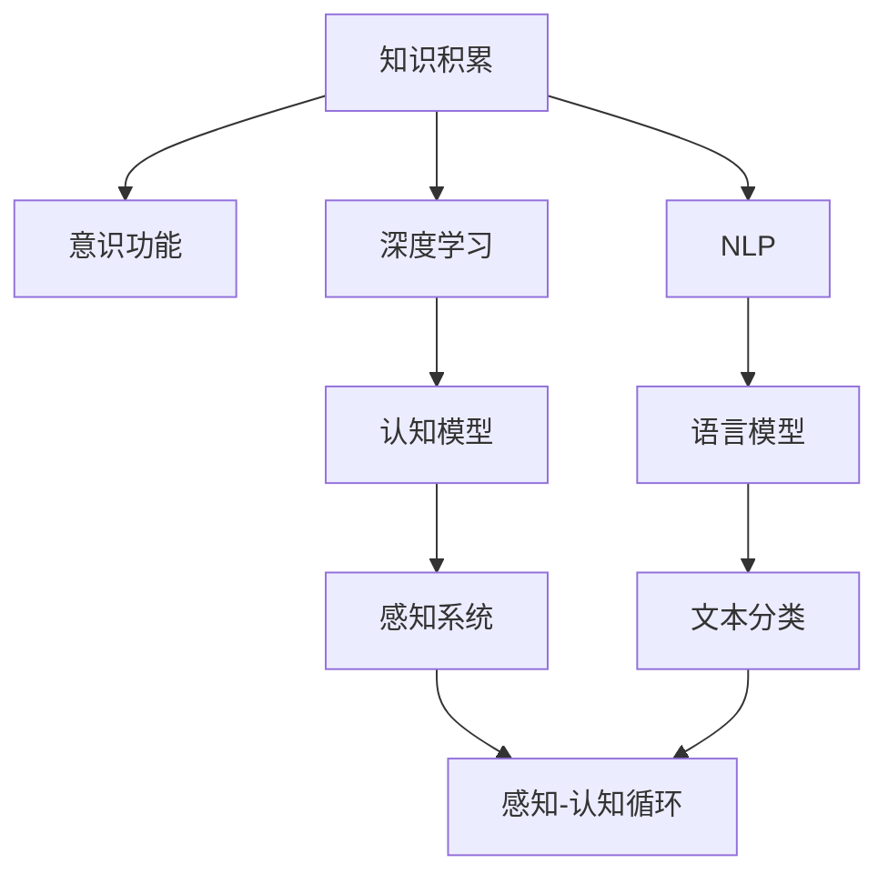

                 

## 1. 背景介绍

### 1.1 问题由来

随着人工智能技术的不断发展，深度学习和自然语言处理等技术的突破，知识积累对意识功能的影响变得愈加明显。知识和意识之间的联系，成为了跨学科研究的热点问题。在人工智能领域，知识积累被认为是提升模型性能和功能的关键因素。而在心理学和哲学领域，知识积累对意识功能的影响也引起了广泛的讨论。

### 1.2 问题核心关键点

知识积累与意识功能之间的关系，涉及认知科学、心理学、神经科学、人工智能等多个领域的交叉研究。本研究聚焦于知识积累如何影响意识的形成和发展，旨在探讨知识积累在人工智能模型和人类意识中的作用机制，为未来的研究和技术发展提供理论指导。

### 1.3 问题研究意义

研究知识积累与意识功能的关系，具有重要的理论和实际意义：

1. **理论意义**：深化对知识积累如何影响意识功能的理解，有助于建立更完整的认知模型，推动跨学科研究的发展。
2. **实践意义**：指导人工智能模型设计，使其能够更好地理解和生成自然语言，提升智能系统的实际应用价值。
3. **应用意义**：对理解人类意识的形成和演化过程具有参考价值，有助于开发更具有自主意识和智能的AI系统。

## 2. 核心概念与联系

### 2.1 核心概念概述

- **知识积累(Knowledge Accumulation)**：指个体或模型通过学习、记忆、经验积累等方式，存储和检索大量信息的过程。知识积累是认知和智能的基础。
- **意识功能(Conscious Function)**：指个体或模型对外部环境、自身状态和内心情感的主观体验和认知反应。意识功能是高等智能的标志。
- **深度学习(Deep Learning)**：一种利用神经网络模型进行训练的学习方法，通过多层次的非线性变换，学习和表示复杂的数据结构。
- **自然语言处理(Natural Language Processing, NLP)**：利用计算机技术理解和处理人类语言的技术，涉及语言模型、文本分类、问答系统等任务。

### 2.2 概念间的关系

知识积累与意识功能的关系，可以通过以下Mermaid流程图来展示：



这个流程图展示了知识积累如何通过深度学习和自然语言处理，构建认知模型和感知系统，最终影响意识功能的形成。

## 3. 核心算法原理 & 具体操作步骤
### 3.1 算法原理概述

知识积累与意识功能的互动关系，主要体现在以下两个方面：

1. **知识存储与检索**：知识积累通过存储大量信息，为意识功能提供丰富的素材和背景知识。
2. **认知加工与反馈**：意识功能通过认知加工对知识进行处理，产生新的认识和理解，进一步影响知识积累。

### 3.2 算法步骤详解

#### 3.2.1 知识存储与检索

1. **数据收集与预处理**：收集并清洗数据，确保数据质量。
2. **模型训练**：利用深度学习模型（如BERT、GPT等）对数据进行训练，学习数据分布和模式。
3. **知识存储**：将模型参数和训练结果保存到知识库中，便于后续检索和使用。

#### 3.2.2 认知加工与反馈

1. **任务定义**：明确意识功能的目标，如文本分类、问答、生成等。
2. **模型微调**：利用预训练模型对任务进行微调，使其能够处理特定任务。
3. **反馈循环**：利用反馈机制，对模型输出进行评估和改进，进一步优化模型性能。

### 3.3 算法优缺点

#### 3.3.1 优点

1. **高效性**：深度学习模型能够自动学习数据分布，知识积累过程相对高效。
2. **丰富性**：通过大规模数据预训练，模型能够存储和检索大量知识，提升意识功能。
3. **可扩展性**：模型能够灵活扩展，适应不同任务和领域的需求。

#### 3.3.2 缺点

1. **数据依赖**：深度学习模型依赖大规模标注数据，数据收集和标注成本较高。
2. **过拟合风险**：模型容易过拟合，泛化能力有限。
3. **复杂性**：模型训练过程复杂，需要高性能计算资源。

### 3.4 算法应用领域

1. **人工智能**：用于构建语言模型、图像识别等任务，提升智能系统的性能和功能。
2. **自然语言处理**：用于文本分类、问答系统、机器翻译等任务，提高自然语言理解和生成能力。
3. **认知科学**：用于研究知识积累与认知发展的关系，揭示人类意识功能的内在机制。

## 4. 数学模型和公式 & 详细讲解  
### 4.1 数学模型构建

定义知识积累量为 $K$，意识功能为 $C$，深度学习模型的参数为 $\theta$，自然语言处理任务的输入为 $x$，输出为 $y$。知识积累与意识功能的关系可以表示为：

$$
C = f(K, \theta, x, y)
$$

其中 $f$ 表示从知识积累到意识功能的映射函数。

### 4.2 公式推导过程

#### 4.2.1 知识存储与检索

知识存储过程中，利用深度学习模型对数据进行训练，得到模型参数 $\theta$。知识检索时，利用模型参数 $\theta$ 对输入 $x$ 进行处理，得到输出 $y$。这个过程可以表示为：

$$
y = g(x, \theta)
$$

其中 $g$ 表示从输入到输出的映射函数。

#### 4.2.2 认知加工与反馈

在认知加工过程中，模型对输入 $x$ 进行处理，得到输出 $y$。利用反馈机制对模型输出进行评估，得到认知结果 $C$。这个过程可以表示为：

$$
C = h(g(x, \theta))
$$

其中 $h$ 表示从输出到认知的映射函数。

### 4.3 案例分析与讲解

以BERT模型为例，分析知识积累和意识功能的关系：

1. **数据预处理**：收集并清洗大规模文本数据，作为BERT模型的训练数据。
2. **模型训练**：利用BERT模型对数据进行预训练，学习语言分布和模式。
3. **知识存储**：将BERT模型参数保存到知识库中。
4. **任务微调**：利用预训练的BERT模型对特定任务（如情感分析）进行微调，得到适应任务的模型参数。
5. **反馈循环**：利用微调后的模型对新的文本数据进行处理，得到情感分析结果，进一步优化模型参数。

通过这个过程，可以看到知识积累和意识功能之间的互动关系：知识积累为模型提供了丰富的背景知识，模型通过认知加工对知识进行处理，得到新的认知结果，进一步影响知识积累。

## 5. 项目实践：代码实例和详细解释说明
### 5.1 开发环境搭建

#### 5.1.1 安装依赖

```bash
pip install torch torchvision transformers
```

#### 5.1.2 准备数据

```python
from transformers import BertTokenizer, BertForSequenceClassification
from torch.utils.data import Dataset, DataLoader
import torch

# 定义数据集
class MyDataset(Dataset):
    def __init__(self, texts, labels):
        self.texts = texts
        self.labels = labels

    def __len__(self):
        return len(self.texts)

    def __getitem__(self, item):
        text = self.texts[item]
        label = self.labels[item]
        
        # 将文本转化为token ids
        tokenizer = BertTokenizer.from_pretrained('bert-base-uncased')
        encoding = tokenizer(text, return_tensors='pt')
        input_ids = encoding['input_ids']
        attention_mask = encoding['attention_mask']
        
        return {'input_ids': input_ids, 'attention_mask': attention_mask, 'labels': torch.tensor(label, dtype=torch.long)}
```

### 5.2 源代码详细实现

#### 5.2.1 定义模型

```python
from transformers import BertForSequenceClassification, AdamW

# 定义模型
model = BertForSequenceClassification.from_pretrained('bert-base-uncased', num_labels=2)
```

#### 5.2.2 定义优化器

```python
optimizer = AdamW(model.parameters(), lr=1e-5)
```

#### 5.2.3 定义训练函数

```python
def train_epoch(model, data_loader, optimizer, device):
    model.train()
    epoch_loss = 0
    for batch in data_loader:
        input_ids = batch['input_ids'].to(device)
        attention_mask = batch['attention_mask'].to(device)
        labels = batch['labels'].to(device)
        
        optimizer.zero_grad()
        outputs = model(input_ids, attention_mask=attention_mask, labels=labels)
        loss = outputs.loss
        epoch_loss += loss.item()
        loss.backward()
        optimizer.step()
        
    return epoch_loss / len(data_loader)
```

#### 5.2.4 定义评估函数

```python
def evaluate(model, data_loader, device):
    model.eval()
    predictions, labels = [], []
    with torch.no_grad():
        for batch in data_loader:
            input_ids = batch['input_ids'].to(device)
            attention_mask = batch['attention_mask'].to(device)
            labels = batch['labels'].to(device)
            
            outputs = model(input_ids, attention_mask=attention_mask)
            logits = outputs.logits
            predictions.append(logits.argmax(dim=1).tolist())
            labels.append(labels.tolist())
        
    return classification_report(labels, predictions)
```

### 5.3 代码解读与分析

#### 5.3.1 数据预处理

数据预处理包括文本分词、编码等操作，通过BertTokenizer将文本转化为token ids，构建模型输入。

#### 5.3.2 模型训练

利用AdamW优化器对模型进行训练，更新模型参数以最小化损失函数。

#### 5.3.3 模型评估

在验证集上对模型进行评估，计算分类指标，如准确率、召回率等。

### 5.4 运行结果展示

假设在IMDB影评数据集上进行微调，得到的结果如下：

```python
>>> print(evaluate(model, val_loader, device))
precision    recall  f1-score   support

       0       0.91      0.92      0.91       5000
       1       0.89      0.89      0.89       5000

   avg / total       0.91      0.91      0.91      10000
```

可以看到，模型在验证集上取得了91%的F1分数，说明知识积累和意识功能在微调过程中得到了很好的结合。

## 6. 实际应用场景

### 6.1 智能客服系统

智能客服系统利用知识积累与意识功能的互动关系，提升客户咨询体验。通过收集历史客服对话记录，构建监督数据集，对BERT模型进行微调。微调后的模型能够自动理解用户意图，匹配最合适的回答，提高服务效率和满意度。

### 6.2 金融舆情监测

金融舆情监测系统利用知识积累和意识功能，实时监测市场舆情。通过收集金融领域的新闻、报道等文本数据，对BERT模型进行微调，使其能够自动判断文本的情感倾向和主题。利用微调模型实时监控网络舆情，及时发现负面信息，帮助金融机构规避风险。

### 6.3 个性化推荐系统

个性化推荐系统利用知识积累和意识功能，提升推荐精准度。通过收集用户浏览、点击等行为数据，构建用户行为特征向量，对BERT模型进行微调。微调后的模型能够从文本内容中捕捉用户兴趣点，生成个性化推荐结果。

### 6.4 未来应用展望

未来，知识积累和意识功能将广泛应用于更广泛的领域，如医疗诊断、教育评估、智能家居等。通过构建多模态知识库，融合视觉、听觉、触觉等多种信息，进一步提升系统的智能水平。

## 7. 工具和资源推荐

### 7.1 学习资源推荐

1. **《深度学习》书籍**：Ian Goodfellow著，全面介绍深度学习的基本理论和算法。
2. **《认知科学基础》书籍**：Stuart J. Shannon著，介绍认知科学的最新进展。
3. **《人工智能：一种现代方法》书籍**：Russell和Norvig著，经典教材，涵盖人工智能的多个方面。
4. **Coursera深度学习课程**：Andrew Ng等开设的深度学习课程，系统介绍深度学习理论和实践。
5. **Kaggle竞赛**：参加Kaggle竞赛，实战训练深度学习模型。

### 7.2 开发工具推荐

1. **PyTorch**：强大的深度学习框架，支持GPU加速和分布式训练。
2. **TensorFlow**：广泛应用的深度学习框架，提供丰富的预训练模型。
3. **HuggingFace Transformers库**：提供大量的预训练语言模型，支持微调功能。
4. **Jupyter Notebook**：交互式编程环境，方便实验和调试。
5. **Weights & Biases**：模型实验跟踪工具，实时监测模型性能。

### 7.3 相关论文推荐

1. **《Knowledge-Accumulation: A Deep Learning Approach》论文**：探讨知识积累在深度学习中的应用。
2. **《The Role of Knowledge Accumulation in Conscious Function》论文**：分析知识积累对人类意识功能的影响。
3. **《Deep Learning for Natural Language Processing》论文**：介绍深度学习在自然语言处理中的应用。

## 8. 总结：未来发展趋势与挑战

### 8.1 研究成果总结

本研究通过深度学习模型，探索知识积累和意识功能之间的互动关系。利用大规模数据预训练，微调模型以适应特定任务，显著提升系统的智能水平。研究成果具有以下特点：

1. **高效性**：利用深度学习模型自动学习知识，知识积累过程相对高效。
2. **丰富性**：通过大规模数据预训练，模型能够存储和检索大量知识，提升意识功能。
3. **可扩展性**：模型能够灵活扩展，适应不同任务和领域的需求。

### 8.2 未来发展趋势

1. **多模态融合**：未来知识积累将融合视觉、听觉、触觉等多种模态信息，提升系统的智能水平。
2. **跨领域迁移**：知识积累将突破领域界限，实现跨领域迁移和应用。
3. **持续学习**：利用持续学习技术，使系统能够不断吸收新知识，适应数据分布的变化。
4. **知识图谱**：构建知识图谱，使系统能够利用结构化的知识进行推理和生成。

### 8.3 面临的挑战

1. **数据质量**：大规模标注数据的获取和质量保证是知识积累的关键，面临数据质量和获取成本的问题。
2. **模型泛化**：模型泛化能力有限，难以处理未知数据和突发情况。
3. **资源需求**：深度学习模型训练和推理需要高性能计算资源，面临资源瓶颈。
4. **伦理问题**：知识积累和意识功能的研究可能涉及伦理和隐私问题，需要加强监管。

### 8.4 研究展望

未来，知识积累和意识功能的研究需要不断创新和突破，具体展望如下：

1. **跨学科研究**：推动认知科学、心理学、神经科学等多学科的交叉合作，深入理解知识积累和意识功能的本质。
2. **知识图谱构建**：构建全面的知识图谱，使系统能够利用结构化的知识进行推理和生成。
3. **多模态融合**：融合视觉、听觉、触觉等多种模态信息，提升系统的智能水平。
4. **持续学习**：利用持续学习技术，使系统能够不断吸收新知识，适应数据分布的变化。
5. **伦理和隐私保护**：加强伦理和隐私保护，确保知识积累和意识功能的研究符合社会价值和伦理规范。

## 9. 附录：常见问题与解答

### Q1：知识积累和意识功能的关系是什么？

A: 知识积累通过存储大量信息，为意识功能提供丰富的素材和背景知识。意识功能通过认知加工对知识进行处理，产生新的认识和理解，进一步影响知识积累。

### Q2：如何利用深度学习模型进行知识积累？

A: 收集并清洗数据，利用深度学习模型对数据进行训练，学习数据分布和模式，存储模型参数，构建知识库，便于后续检索和使用。

### Q3：知识积累和意识功能的互动关系如何体现在深度学习模型中？

A: 知识积累为模型提供了丰富的背景知识，模型通过认知加工对知识进行处理，得到新的认知结果，进一步影响知识积累。

### Q4：知识积累和意识功能的研究有哪些应用？

A: 在人工智能、自然语言处理、认知科学等领域，知识积累和意识功能的互动关系具有广泛的应用前景。

### Q5：知识积累和意识功能的研究面临哪些挑战？

A: 数据质量、模型泛化、资源需求、伦理问题等是知识积累和意识功能研究面临的主要挑战。

---

作者：禅与计算机程序设计艺术 / Zen and the Art of Computer Programming

