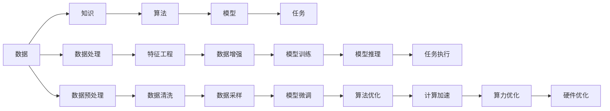

                 

# 知识、算法、算力在第一代AI中的作用

## 1. 背景介绍

在人工智能(AI)的发展历程中，知识、算法和算力三者相辅相成，共同推动了AI技术的不断进步。第一代AI以数据驱动的机器学习模型为代表，其核心在于从数据中提取模式，实现对特定任务的有效解决。本文将详细探讨知识、算法和算力在第一代AI中的作用，并结合实际案例，说明这三者如何共同推动AI技术的演进。

## 2. 核心概念与联系

### 2.1 核心概念概述

- **知识(Knowledge)**：指对特定领域或任务所掌握的信息、规则和经验，通常以数据或结构化的知识库形式存在。在AI中，知识是模型学习的重要基础，提供了模型完成任务所需的重要信息。

- **算法(Algorithm)**：指解决问题的步骤和规则，通常以代码形式实现。在AI中，算法是实现模型学习与推理的核心工具，负责从数据中提取模式、执行推理和决策。

- **算力(Computational Power)**：指执行计算的能力，通常以计算资源（如CPU、GPU等）为载体。算力是模型训练和推理的保障，决定了AI模型能够在多长时间内完成特定任务。

### 2.2 核心概念原理和架构的 Mermaid 流程图



这个流程图展示了知识、算法和算力在AI系统中的作用和相互关系：

1. **数据**：AI系统基于数据进行训练和推理，数据是知识的基础。
2. **知识**：通过特征工程和数据增强，提取数据中的知识，构建模型的输入。
3. **算法**：设计并实现算法，从输入数据中提取模式，构建模型。
4. **模型**：通过训练算法构建的模型，对输入数据进行推理。
5. **任务**：模型执行具体的任务，如分类、生成、预测等。
6. **数据处理**：包括数据预处理、清洗和采样，确保数据质量。
7. **特征工程**：通过数据转换和特征选择，提取对模型有用的信息。
8. **模型训练**：使用算法在数据上训练模型。
9. **模型推理**：使用训练好的模型对新数据进行推理。
10. **任务执行**：模型执行具体任务。
11. **算法优化**：通过算法改进，提高模型性能。
12. **计算加速**：通过算力优化，提高模型训练和推理效率。
13. **硬件优化**：通过硬件升级，进一步提升算力。

### 2.3 核心概念间的关系

这些核心概念通过相互配合，共同支撑AI系统的运作。知识提供了任务解决的基础，算法设计了模型的实现方式，而算力保障了模型训练和推理的效率。随着技术的不断进步，这三者在AI系统中的作用和重要性也在不断演变。

## 3. 核心算法原理 & 具体操作步骤

### 3.1 算法原理概述

在第一代AI中，算法设计通常基于统计学习理论，通过从数据中提取模式，实现对特定任务的求解。常见的算法包括监督学习、无监督学习和半监督学习等。这些算法在数据上训练模型，并通过测试集评估模型性能。

### 3.2 算法步骤详解

1. **数据准备**：收集和预处理数据，确保数据的质量和一致性。
2. **特征工程**：选择和提取对模型有用的特征，构建模型的输入。
3. **模型训练**：使用算法在数据上训练模型，调整模型参数以最小化损失函数。
4. **模型评估**：使用测试集评估模型性能，选择最优模型。
5. **模型微调**：在特定任务上微调模型，调整模型的参数，提高模型性能。
6. **模型推理**：使用训练好的模型对新数据进行推理，执行具体任务。

### 3.3 算法优缺点

- **优点**：
  - 数据驱动，模型能够从数据中学习，具有较强的泛化能力。
  - 算法简单，易于实现和部署。
  - 能够处理多种类型的数据，如文本、图像、音频等。

- **缺点**：
  - 需要大量标注数据，数据获取和标注成本较高。
  - 模型依赖于数据质量，低质量数据可能导致模型性能下降。
  - 缺乏对数据的深度理解，难以处理复杂任务。

### 3.4 算法应用领域

基于统计学习的算法在多个领域得到了广泛应用，如自然语言处理(NLP)、计算机视觉(CV)、语音识别(SR)等。这些算法通过从数据中提取模式，实现对特定任务的求解，展示了强大的实用价值。

## 4. 数学模型和公式 & 详细讲解

### 4.1 数学模型构建

在第一代AI中，常用的数学模型包括线性回归、逻辑回归、决策树、随机森林、支持向量机(SVM)等。以线性回归为例，其数学模型为：

$$y = w_0 + w_1x_1 + w_2x_2 + \cdots + w_nx_n + \epsilon$$

其中，$y$ 为输出，$x_1, x_2, \cdots, x_n$ 为输入特征，$w_0, w_1, w_2, \cdots, w_n$ 为模型参数，$\epsilon$ 为噪声。

### 4.2 公式推导过程

线性回归的目标是最小化预测值和实际值之间的平方误差，即：

$$\min_{\theta} \frac{1}{2m} \sum_{i=1}^m(y_i - \theta^T x_i)^2$$

其中，$\theta = [w_0, w_1, w_2, \cdots, w_n]^T$。

通过梯度下降算法，求解上述最小化问题，得到最优参数 $\theta$：

$$\theta = (X^TX)^{-1}X^Ty$$

其中，$X = [x_1, x_2, \cdots, x_n]$。

### 4.3 案例分析与讲解

以手写数字识别为例，使用线性回归模型。收集手写数字图片，将其转化为像素值矩阵，作为输入特征 $x_1, x_2, \cdots, x_n$。将数字标签作为输出 $y$。

训练模型时，使用梯度下降算法最小化平方误差，求解最优参数 $\theta$。在测试集上评估模型性能，计算准确率、召回率和F1分数等指标。

## 5. 项目实践：代码实例和详细解释说明

### 5.1 开发环境搭建

首先，安装Python环境，并确保Python版本在3.6及以上。然后，安装必要的库，如Numpy、Scikit-learn、Matplotlib等。

### 5.2 源代码详细实现

以手写数字识别为例，使用线性回归模型。代码如下：

```python
import numpy as np
from sklearn.linear_model import LinearRegression
from sklearn.datasets import load_digits
from sklearn.model_selection import train_test_split
from sklearn.metrics import classification_report

# 加载数据集
digits = load_digits()
X = digits.data
y = digits.target

# 划分训练集和测试集
X_train, X_test, y_train, y_test = train_test_split(X, y, test_size=0.2, random_state=42)

# 训练模型
model = LinearRegression()
model.fit(X_train, y_train)

# 预测并评估模型
y_pred = model.predict(X_test)
print(classification_report(y_test, y_pred))
```

### 5.3 代码解读与分析

上述代码中，首先加载手写数字数据集，将其划分为训练集和测试集。然后使用线性回归模型在训练集上进行训练，最后使用测试集进行评估，输出分类报告。

## 6. 实际应用场景

### 6.1 文本分类

在文本分类任务中，算法通过从文本中提取特征，构建文本-类别映射模型。常见的算法包括朴素贝叶斯、支持向量机、逻辑回归等。

### 6.2 图像识别

在图像识别任务中，算法通过从图像中提取特征，构建图像-类别映射模型。常见的算法包括卷积神经网络(CNN)、深度学习等。

### 6.3 推荐系统

在推荐系统中，算法通过从用户行为数据中提取特征，构建用户-物品评分模型。常见的算法包括协同过滤、基于内容的推荐等。

### 6.4 未来应用展望

未来，随着算法的不断进步和算力的不断提升，基于统计学习的算法将在更多领域得到应用，为各行各业带来变革性影响。

## 7. 工具和资源推荐

### 7.1 学习资源推荐

- Coursera《机器学习》课程：由斯坦福大学Andrew Ng教授开设，系统讲解机器学习理论和算法。
- Kaggle：数据科学竞赛平台，提供丰富的数据集和模型评估工具。
- TensorFlow官方文档：提供TensorFlow框架的详细文档和示例代码，适合深度学习初学者。

### 7.2 开发工具推荐

- Jupyter Notebook：免费开源的交互式编程环境，支持Python、R等语言，适合数据科学和机器学习开发。
- PyCharm：强大的Python IDE，支持多种框架和库，适合开发和调试复杂项目。
- Anaconda：数据科学和机器学习的全面开发环境，提供丰富的科学计算库和工具。

### 7.3 相关论文推荐

- 《Pattern Recognition and Machine Learning》：Christopher M. Bishop的著作，系统讲解机器学习和模式识别理论。
- 《Deep Learning》：Ian Goodfellow等人的著作，全面介绍深度学习理论和实践。
- 《Machine Learning Yearning》：Andrew Ng的著作，介绍机器学习的实践经验和最佳实践。

## 8. 总结：未来发展趋势与挑战

### 8.1 研究成果总结

第一代AI中，知识、算法和算力共同推动了机器学习模型的发展。统计学习算法在多个领域得到了广泛应用，展示了强大的实用价值。

### 8.2 未来发展趋势

未来，随着算法的不断进步和算力的不断提升，基于统计学习的算法将在更多领域得到应用，为各行各业带来变革性影响。

### 8.3 面临的挑战

尽管统计学习算法取得了显著成果，但在实际应用中也面临诸多挑战，如数据质量、模型复杂度、计算效率等。

### 8.4 研究展望

未来，需要通过更多的算法创新和算力优化，提升机器学习模型的性能和效率。同时，还需要加强数据管理和模型解释性，确保AI系统的安全性和可靠性。

## 9. 附录：常见问题与解答

**Q1：什么是特征工程？**

A: 特征工程是数据预处理中的一个重要步骤，通过选择和提取对模型有用的特征，构建模型的输入。特征工程的好坏直接影响到模型的性能。

**Q2：什么是梯度下降算法？**

A: 梯度下降算法是机器学习中常用的优化算法，通过计算损失函数对模型参数的梯度，迭代调整参数，使得损失函数最小化。

**Q3：什么是正则化？**

A: 正则化是一种常用的防止过拟合的方法，通过在损失函数中加入正则项，限制模型参数的大小，防止模型过度复杂。

**Q4：什么是数据增强？**

A: 数据增强是通过对原始数据进行变换，扩充训练集样本数量的方法。常见的数据增强包括回译、近义替换等。

**Q5：什么是模型微调？**

A: 模型微调是在特定任务上调整模型参数，优化模型在特定任务上的性能。常见的微调方法包括参数共享、参数冻结、参数细化等。

---

作者：禅与计算机程序设计艺术 / Zen and the Art of Computer Programming

