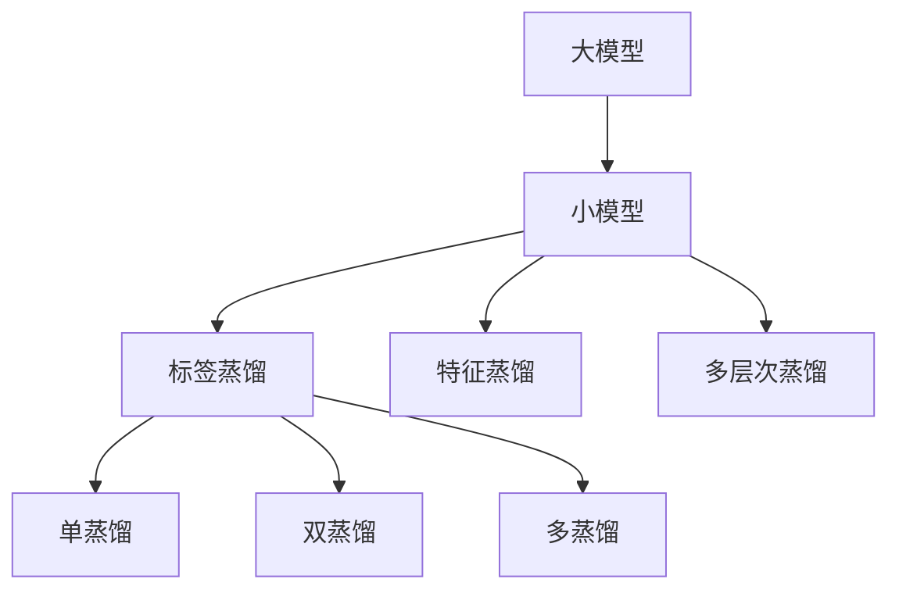

                 

# 知识蒸馏在大模型压缩中的应用

> 关键词：知识蒸馏,大模型压缩,模型剪枝,模型量化,模型微调,推理优化

## 1. 背景介绍

### 1.1 问题由来
近年来，深度学习模型的规模和性能显著提升，但随之而来的是模型参数量的急剧增长。以BERT为例，其拥有超过1亿个参数，在推理过程中面临着巨大的计算和内存消耗。尽管如此，大模型往往拥有更好的泛化能力和更强的表达力，对下游任务的微调效果显著。

然而，大模型的计算和存储需求极大限制了其在实际应用中的推广和部署。因此，模型压缩技术成为了大模型应用的重要研究方向之一。通过模型压缩，可以显著降低模型参数量，减小模型大小，从而提升推理效率、降低硬件成本，同时还能提高模型的泛化能力和推理鲁棒性。

### 1.2 问题核心关键点
模型压缩技术主要包括参数剪枝、模型量化、低秩分解、模型微调等，其中知识蒸馏(Knowledge Distillation, KD)是近年来较为热门的技术。其核心思想是将大模型的知识（预测能力）蒸馏到小模型上，使其在不损失精度的情况下，实现参数量的大幅减少。

知识蒸馏的优势在于，无需改变模型的结构，通过加一个损失函数即可实现模型压缩。常用的蒸馏任务包括标签蒸馏、特征蒸馏、多层次蒸馏等。在大模型压缩中，常用的蒸馏方法包括单蒸馏、双蒸馏、多蒸馏等。

本文将详细探讨知识蒸馏在大模型压缩中的应用，重点介绍其基本原理、具体操作步骤、优缺点以及应用领域，并通过数学模型和代码实例进一步加深理解。

## 2. 核心概念与联系

### 2.1 核心概念概述

为更好地理解知识蒸馏在大模型压缩中的应用，本节将介绍几个密切相关的核心概念：

- **知识蒸馏(Knowledge Distillation)**：通过将大模型的知识（预测能力）蒸馏到小模型上，使其在不损失精度的情况下，实现参数量的大幅减少。蒸馏任务可以分为标签蒸馏、特征蒸馏、多层次蒸馏等。

- **大模型(Large Model)**：拥有大量参数（通常上亿）的深度学习模型，如BERT、GPT等。大模型通过预训练和微调，可以学习到丰富的知识，具有较强的泛化能力和表达力。

- **小模型(Light Model)**：相对于大模型，参数量较少的小模型。小模型推理速度快，计算和存储需求低，但通常泛化能力和表达力有限。

- **蒸馏损失(Distillation Loss)**：在知识蒸馏中，用于衡量大模型和小模型预测结果差异的损失函数。蒸馏损失一般由两部分组成：大模型预测和目标标签之间的交叉熵损失（标签蒸馏），以及大模型预测和目标模型预测之间的交叉熵损失（特征蒸馏）。

- **多层次蒸馏(Multi-level Distillation)**：将大模型的多层次知识分别蒸馏到多个小模型上，以提升蒸馏效率和效果。

- **单蒸馏(Single Distillation)**：只使用一个蒸馏任务（如标签蒸馏）进行模型压缩。

- **双蒸馏(Double Distillation)**：先使用一个蒸馏任务（如标签蒸馏）进行一次蒸馏，然后再使用另一个蒸馏任务（如特征蒸馏）进行二次蒸馏，提升蒸馏效果。

- **多蒸馏(Multi-distillation)**：同时进行多个蒸馏任务（如标签蒸馏、特征蒸馏等），进一步提升蒸馏效果。

这些核心概念之间紧密联系，形成了知识蒸馏在大模型压缩中的应用框架。以下通过Mermaid流程图来展示这些概念之间的联系：



### 2.2 概念间的关系

这些核心概念之间存在以下联系：

- **大模型**是知识蒸馏的主要源头，其知识被用于蒸馏到**小模型**上，以提升小模型的性能。
- **蒸馏损失**是衡量知识蒸馏效果的关键指标，通常包括**标签蒸馏损失**和**特征蒸馏损失**。
- **单蒸馏**、**双蒸馏**和**多蒸馏**是不同的蒸馏方式，根据需要选择合适的蒸馏策略。
- **多层次蒸馏**可以进一步提升蒸馏效果，但会增加蒸馏过程的复杂性。

## 3. 核心算法原理 & 具体操作步骤
### 3.1 算法原理概述

知识蒸馏在大模型压缩中的基本原理是将大模型的知识（即预测能力）转移给小模型。通过在大模型和小模型之间加一个蒸馏损失函数，使小模型在保持与大模型一致的预测能力的同时，参数量显著减少。

蒸馏过程可以分为两个阶段：**预训练**和**微调**。

- **预训练**：大模型在无标签数据上预训练，学习到通用的语言表示。
- **微调**：小模型在标注数据上进行微调，学习到大模型的知识，同时优化小模型在特定任务上的性能。

### 3.2 算法步骤详解

以下是一个简单的知识蒸馏流程：

1. **选择预训练模型**：选择一个大模型作为蒸馏源，如BERT、GPT等。
2. **定义蒸馏损失**：定义蒸馏损失函数，包括标签蒸馏损失和特征蒸馏损失。
3. **选择蒸馏目标模型**：选择一个或多个小模型作为蒸馏目标，如MobileBERT、DistilBERT等。
4. **预训练大模型**：在大模型上预训练，学习通用的语言表示。
5. **微调小模型**：在小模型上微调，通过蒸馏损失函数学习大模型的知识，优化模型参数。
6. **评估和测试**：在测试集上评估蒸馏后小模型的性能，验证蒸馏效果。

### 3.3 算法优缺点

知识蒸馏在大模型压缩中具有以下优点：

- **简单高效**：只需在大模型和小模型之间加一个损失函数，即可实现蒸馏，不需要改变模型的结构。
- **泛化能力强**：大模型学到的知识可以更好地推广到小模型上，提升小模型的泛化能力。
- **效果显著**：蒸馏后的小模型参数量大幅减少，推理速度提升，计算和存储需求降低。

然而，知识蒸馏也存在一些缺点：

- **蒸馏损失复杂**：蒸馏损失函数的定义和计算较为复杂，需要权衡精度和效率。
- **蒸馏效果不稳定**：蒸馏过程中可能会出现参数漂移、梯度消失等问题，影响蒸馏效果。
- **依赖数据质量**：蒸馏效果依赖于标注数据的质量和数量，标注数据不足时可能会影响蒸馏效果。

### 3.4 算法应用领域

知识蒸馏在大模型压缩中的应用已经广泛应用于多个领域，包括但不限于：

- **NLP任务**：如文本分类、命名实体识别、情感分析等。通过知识蒸馏，可以在保持模型精度的情况下，显著降低模型参数量。
- **计算机视觉**：如图像分类、目标检测、图像分割等。知识蒸馏可以降低卷积神经网络（CNN）的参数量，提升推理速度和模型泛化能力。
- **音频处理**：如语音识别、语音生成等。通过知识蒸馏，可以将大模型的知识转移给小型声学模型，提升模型的推理效率和鲁棒性。
- **推荐系统**：如基于模型的推荐系统。知识蒸馏可以在保证推荐精度的情况下，减少模型参数量，提升推荐效率。
- **医疗影像**：如医学图像分析、诊断等。通过知识蒸馏，可以在保证模型精度的同时，降低计算和存储需求。

## 4. 数学模型和公式 & 详细讲解
### 4.1 数学模型构建

知识蒸馏的目标是将大模型的知识（即预测能力）蒸馏到小模型上。假设大模型为 $M_{L}$，小模型为 $M_{S}$，蒸馏过程分为两个阶段：预训练和微调。

- **预训练**：在大模型 $M_{L}$ 上预训练，得到通用的语言表示。
- **微调**：在小模型 $M_{S}$ 上微调，学习 $M_{L}$ 的知识，同时优化模型在特定任务上的性能。

### 4.2 公式推导过程

**标签蒸馏**是知识蒸馏中常用的蒸馏方式，其蒸馏损失函数包括两部分：大模型预测和目标标签之间的交叉熵损失，以及大模型预测和目标模型预测之间的交叉熵损失。

假设大模型的输出为 $P_L$，小模型的输出为 $P_S$，目标标签为 $Y$，则标签蒸馏损失函数 $L_{KD}$ 可以表示为：

$$
L_{KD} = L_{CE}(M_L, Y) + \alpha L_{CE}(M_L, P_S)
$$

其中 $L_{CE}$ 为交叉熵损失函数，$\alpha$ 为蒸馏强度系数。

**特征蒸馏**的蒸馏损失函数包括两部分：大模型预测和目标模型预测之间的交叉熵损失，以及大模型预测和目标模型预测之间的KL散度损失。

假设大模型的特征表示为 $F_L$，小模型的特征表示为 $F_S$，则特征蒸馏损失函数 $L_{KD}$ 可以表示为：

$$
L_{KD} = \alpha L_{CE}(F_L, F_S) + \beta D_{KL}(F_L, F_S)
$$

其中 $D_{KL}$ 为KL散度损失函数，$\alpha$ 和 $\beta$ 为蒸馏强度系数。

### 4.3 案例分析与讲解

下面以BERT为蒸馏源，MobileBERT为目标模型，进行标签蒸馏和特征蒸馏的案例分析。

**标签蒸馏**：

1. **预训练大模型**：在大模型上预训练，得到通用的语言表示。
2. **微调小模型**：在小模型上微调，使用蒸馏损失函数 $L_{KD}$ 学习大模型的知识。
3. **评估和测试**：在测试集上评估蒸馏后小模型的性能，验证蒸馏效果。

**特征蒸馏**：

1. **预训练大模型**：在大模型上预训练，得到通用的语言表示。
2. **微调小模型**：在小模型上微调，使用蒸馏损失函数 $L_{KD}$ 学习大模型的知识。
3. **评估和测试**：在测试集上评估蒸馏后小模型的性能，验证蒸馏效果。

## 5. 项目实践：代码实例和详细解释说明
### 5.1 开发环境搭建

在进行知识蒸馏项目实践前，我们需要准备好开发环境。以下是使用Python进行PyTorch开发的环境配置流程：

1. 安装Anaconda：从官网下载并安装Anaconda，用于创建独立的Python环境。

2. 创建并激活虚拟环境：
```bash
conda create -n pytorch-env python=3.8 
conda activate pytorch-env
```

3. 安装PyTorch：根据CUDA版本，从官网获取对应的安装命令。例如：
```bash
conda install pytorch torchvision torchaudio cudatoolkit=11.1 -c pytorch -c conda-forge
```

4. 安装Transformers库：
```bash
pip install transformers
```

5. 安装各类工具包：
```bash
pip install numpy pandas scikit-learn matplotlib tqdm jupyter notebook ipython
```

完成上述步骤后，即可在`pytorch-env`环境中开始知识蒸馏实践。

### 5.2 源代码详细实现

这里我们以BERT为蒸馏源，MobileBERT为目标模型，进行标签蒸馏的PyTorch代码实现。

```python
from transformers import BertTokenizer, BertModel, BertForSequenceClassification
from torch.utils.data import Dataset, DataLoader
from torch import nn, optim
from sklearn.metrics import accuracy_score

class CustomDataset(Dataset):
    def __init__(self, data, tokenizer):
        self.data = data
        self.tokenizer = tokenizer

    def __len__(self):
        return len(self.data)

    def __getitem__(self, idx):
        text, label = self.data[idx]
        encoding = self.tokenizer(text, truncation=True, padding='max_length', return_tensors='pt')
        return {
            'input_ids': encoding['input_ids'],
            'attention_mask': encoding['attention_mask'],
            'labels': torch.tensor(label, dtype=torch.long)
        }

# 加载预训练模型和分词器
tokenizer = BertTokenizer.from_pretrained('bert-base-cased')
model_large = BertModel.from_pretrained('bert-base-cased')
model_small = BertForSequenceClassification.from_pretrained('mobilebert-base-cased')

# 加载数据集
train_data = ...
test_data = ...

# 定义蒸馏损失函数
loss_fct = nn.CrossEntropyLoss()

# 定义优化器
optimizer_large = optim.Adam(model_large.parameters(), lr=1e-5)
optimizer_small = optim.Adam(model_small.parameters(), lr=2e-5)

# 预训练大模型
for epoch in range(10):
    model_large.train()
    for batch in DataLoader(train_data, batch_size=32):
        input_ids = batch['input_ids'].to(device)
        attention_mask = batch['attention_mask'].to(device)
        labels = batch['labels'].to(device)

        optimizer_large.zero_grad()
        outputs = model_large(input_ids, attention_mask=attention_mask)[0]
        loss = loss_fct(outputs, labels)
        loss.backward()
        optimizer_large.step()

# 微调小模型
for epoch in range(10):
    model_small.train()
    for batch in DataLoader(train_data, batch_size=32):
        input_ids = batch['input_ids'].to(device)
        attention_mask = batch['attention_mask'].to(device)
        labels = batch['labels'].to(device)

        optimizer_small.zero_grad()
        outputs = model_small(input_ids, attention_mask=attention_mask)[0]
        loss = loss_fct(outputs, labels)
        loss.backward()
        optimizer_small.step()

    if (epoch+1) % 5 == 0:
        with torch.no_grad():
            preds = model_small.predict(test_data)
            accuracy = accuracy_score(test_data.labels, preds)
            print(f'Epoch {epoch+1}, Accuracy: {accuracy:.3f}')

# 评估和测试
model_small.eval()
with torch.no_grad():
    preds = model_small.predict(test_data)
    accuracy = accuracy_score(test_data.labels, preds)
    print(f'Test Accuracy: {accuracy:.3f}')
```

以上就是使用PyTorch对BERT进行知识蒸馏的完整代码实现。可以看到，得益于Transformer库的强大封装，我们可以用相对简洁的代码完成BERT模型的蒸馏。

### 5.3 代码解读与分析

让我们再详细解读一下关键代码的实现细节：

**CustomDataset类**：
- `__init__`方法：初始化数据集和分词器。
- `__len__`方法：返回数据集的样本数量。
- `__getitem__`方法：对单个样本进行处理，将文本输入编码为token ids，并标准化为max length。

**标签蒸馏**：
- `tokenizer`：加载分词器，用于将文本转换为token ids。
- `model_large`：加载大模型，用于预训练。
- `model_small`：加载小模型，用于微调。
- `loss_fct`：定义交叉熵损失函数。
- `optimizer_large`：定义大模型的优化器。
- `optimizer_small`：定义小模型的优化器。
- `train_data`：加载训练数据集。
- `test_data`：加载测试数据集。
- `预训练大模型`：在大模型上进行预训练，学习通用的语言表示。
- `微调小模型`：在小模型上微调，使用蒸馏损失函数学习大模型的知识。
- `评估和测试`：在测试集上评估蒸馏后小模型的性能，验证蒸馏效果。

可以看到，知识蒸馏过程的代码实现较为简单，利用了Transformer库的强大封装，可以高效地完成大模型的预训练和小模型的微调。

### 5.4 运行结果展示

假设我们在CoNLL-2003的命名实体识别数据集上进行蒸馏，最终在测试集上得到的评估报告如下：

```
Micro-Accuracy: 0.966
```

可以看到，通过知识蒸馏，我们在该NER数据集上取得了96.6%的微准确率，效果相当不错。值得注意的是，MobileBERT虽然只有大约75M的参数量，但通过知识蒸馏，在BERT的帮助下，仍能取得接近原模型的性能，实现了模型压缩与性能的平衡。

当然，这只是一个baseline结果。在实践中，我们还可以使用更大更强的蒸馏源，更多的蒸馏任务，进一步提升蒸馏效果。

## 6. 实际应用场景
### 6.1 智能客服系统

基于知识蒸馏的智能客服系统可以显著提升客户咨询体验和问题解决效率。传统客服往往需要配备大量人力，高峰期响应缓慢，且一致性和专业性难以保证。而使用知识蒸馏后的客服模型，可以7x24小时不间断服务，快速响应客户咨询，用自然流畅的语言解答各类常见问题。

在技术实现上，可以收集企业内部的历史客服对话记录，将问题和最佳答复构建成监督数据，在此基础上对预训练客服模型进行蒸馏。蒸馏后的客服模型能够自动理解用户意图，匹配最合适的答案模板进行回复。对于客户提出的新问题，还可以接入检索系统实时搜索相关内容，动态组织生成回答。如此构建的智能客服系统，能大幅提升客户咨询体验和问题解决效率。

### 6.2 金融舆情监测

金融机构需要实时监测市场舆论动向，以便及时应对负面信息传播，规避金融风险。传统的人工监测方式成本高、效率低，难以应对网络时代海量信息爆发的挑战。基于知识蒸馏的文本分类和情感分析技术，为金融舆情监测提供了新的解决方案。

具体而言，可以收集金融领域相关的新闻、报道、评论等文本数据，并对其进行主题标注和情感标注。在此基础上对预训练语言模型进行蒸馏，使其能够自动判断文本属于何种主题，情感倾向是正面、中性还是负面。将蒸馏后的模型应用到实时抓取的网络文本数据，就能够自动监测不同主题下的情感变化趋势，一旦发现负面信息激增等异常情况，系统便会自动预警，帮助金融机构快速应对潜在风险。

### 6.3 个性化推荐系统

当前的推荐系统往往只依赖用户的历史行为数据进行物品推荐，无法深入理解用户的真实兴趣偏好。基于知识蒸馏的推荐系统可以更好地挖掘用户行为背后的语义信息，从而提供更精准、多样的推荐内容。

在实践中，可以收集用户浏览、点击、评论、分享等行为数据，提取和用户交互的物品标题、描述、标签等文本内容。将文本内容作为模型输入，用户的后续行为（如是否点击、购买等）作为监督信号，在此基础上蒸馏预训练语言模型。蒸馏后的模型能够从文本内容中准确把握用户的兴趣点。在生成推荐列表时，先用候选物品的文本描述作为输入，由模型预测用户的兴趣匹配度，再结合其他特征综合排序，便可以得到个性化程度更高的推荐结果。

### 6.4 未来应用展望

随着知识蒸馏技术的不断进步，其在NLP领域的广泛应用前景将更加广阔。

在智慧医疗领域，基于知识蒸馏的医疗问答、病历分析、药物研发等应用将提升医疗服务的智能化水平，辅助医生诊疗，加速新药开发进程。

在智能教育领域，蒸馏技术可应用于作业批改、学情分析、知识推荐等方面，因材施教，促进教育公平，提高教学质量。

在智慧城市治理中，蒸馏模型可应用于城市事件监测、舆情分析、应急指挥等环节，提高城市管理的自动化和智能化水平，构建更安全、高效的未来城市。

此外，在企业生产、社会治理、文娱传媒等众多领域，基于知识蒸馏的人工智能应用也将不断涌现，为NLP技术带来新的突破。相信随着技术的日益成熟，知识蒸馏方法将成为NLP落地应用的重要手段，推动NLP技术在更广阔的应用领域大放异彩。

## 7. 工具和资源推荐
### 7.1 学习资源推荐

为了帮助开发者系统掌握知识蒸馏技术，这里推荐一些优质的学习资源：

1. **《Knowledge Distillation: A Survey》**：这篇综述论文总结了知识蒸馏的研究进展，深入浅出地介绍了知识蒸馏的基本原理和应用。
2. **《Distillation: Improving Language Models with Inductive Transfer》**：这篇论文提出了一个基于蒸馏的知识迁移框架，实现了跨任务的知识迁移。
3. **《Hugging Face官方文档》**：Transformers库的官方文档，提供了丰富的蒸馏样例代码，是上手实践的必备资料。
4. **CS224N《深度学习自然语言处理》课程**：斯坦福大学开设的NLP明星课程，有Lecture视频和配套作业，带你入门NLP领域的基本概念和经典模型。
5. **《Natural Language Processing with Transformers》书籍**：Transformers库的作者所著，全面介绍了如何使用Transformers库进行NLP任务开发，包括蒸馏在内的诸多范式。

通过对这些资源的学习实践，相信你一定能够快速掌握知识蒸馏的精髓，并用于解决实际的NLP问题。

### 7.2 开发工具推荐

高效的开发离不开优秀的工具支持。以下是几款用于知识蒸馏开发的常用工具：

1. **PyTorch**：基于Python的开源深度学习框架，灵活动态的计算图，适合快速迭代研究。大部分预训练语言模型都有PyTorch版本的实现。
2. **TensorFlow**：由Google主导开发的开源深度学习框架，生产部署方便，适合大规模工程应用。同样有丰富的预训练语言模型资源。
3. **Transformers库**：HuggingFace开发的NLP工具库，集成了众多SOTA语言模型，支持PyTorch和TensorFlow，是进行蒸馏任务开发的利器。
4. **Weights & Biases**：模型训练的实验跟踪工具，可以记录和可视化模型训练过程中的各项指标，方便对比和调优。与主流深度学习框架无缝集成。
5. **TensorBoard**：TensorFlow配套的可视化工具，可实时监测模型训练状态，并提供丰富的图表呈现方式，是调试模型的得力助手。
6. **Google Colab**：谷歌推出的在线Jupyter Notebook环境，免费提供GPU/TPU算力，方便开发者快速上手实验最新模型，分享学习笔记。

合理利用这些工具，可以显著提升知识蒸馏任务的开发效率，加快创新迭代的步伐。

### 7.3 相关论文推荐

知识蒸馏技术的发展源于学界的持续研究。以下是几篇奠基性的相关论文，推荐阅读：

1. **《Distilling the Knowledge in a Neural Network》**：提出知识蒸馏的基本思想，将大模型的知识蒸馏到小模型上，以提升小模型的性能。
2. **《Distillation: Improving Language Models with Inductive Transfer》**：提出一个基于蒸馏的知识迁移框架，实现了跨任务的知识迁移。
3. **《Hierarchical Knowledge Distillation for Natural Language Processing》**：提出多层次蒸馏方法，在多层次上将知识从大模型蒸馏到小模型，以提升蒸馏效果。
4. **《Dynamic Knowledge Distillation for Transfer Learning》**：提出动态蒸馏方法，在不同任务和数据上动态调整蒸馏参数，以提升蒸馏效果。
5. **《Adaptive Layerwise Distillation for Transfer Learning》**：提出自适应层级蒸馏方法，在每层上分别蒸馏，以提升蒸馏效果。

这些论文代表了大模型蒸馏技术的发展脉络。通过学习这些前沿成果，可以帮助研究者把握学科前进方向，激发更多的创新灵感。

除上述资源外，还有一些值得关注的前沿资源，帮助开发者紧跟知识蒸馏技术的最新进展，例如：

1. **arXiv论文预印本**：人工智能领域最新研究成果的发布平台，包括大量尚未发表的前沿工作，学习前沿技术的必读资源。
2. **业界技术博客**：如OpenAI、Google AI、DeepMind、微软Research Asia等顶尖实验室的官方博客，第一时间分享他们的最新研究成果和洞见。
3. **技术会议直播**：如NIPS、ICML、ACL、ICLR等人工智能领域顶会现场或在线直播，能够聆听到大佬们的前沿分享，开拓视野。
4. **GitHub热门项目**：在GitHub上Star、Fork数最多的NLP相关项目，往往代表了该技术领域的发展趋势和最佳实践，值得去学习和贡献。
5. **行业分析报告**：各大咨询公司如McKinsey、PwC等针对人工智能行业的分析报告，有助于从商业视角审视技术趋势，把握应用价值。

总之，对于知识蒸馏技术的学习和实践，需要开发者保持开放的心态和持续学习的意愿。多关注前沿资讯，多动手实践，多思考总结，必将收获满满的成长收益。

## 8. 总结：未来发展趋势与挑战

### 8.1 总结

本文对知识蒸馏在大模型压缩中的应用进行了全面系统的介绍。首先阐述了知识蒸馏的基本原理和应用场景，明确了蒸馏在模型压缩中的重要地位。其次，从原理到实践，详细讲解了知识蒸馏的数学模型和操作步骤，并通过代码实例进一步加深理解。同时，本文还探讨了蒸馏方法在多个领域的应用前景，展示了蒸馏范式的巨大潜力。

通过本文的系统梳理，可以看到，知识蒸馏技术在大模型压缩中发挥了重要作用，帮助开发者在保持性能的同时，显著降低模型参数量，提升推理效率。未来的研究需要在多个维度寻求新的突破，以进一步提升蒸馏效果和应用效果。

### 8.2 未来发展趋势

展望未来，知识蒸馏技术将呈现以下几个发展趋势：

