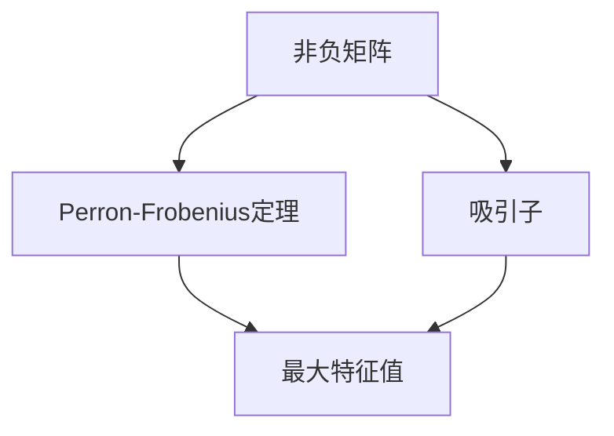

                 

# 矩阵理论与应用：Perron-Frobenius理论的进一步结果

## 1. 背景介绍

在数值分析和矩阵理论中，Perron-Frobenius定理占据着核心地位。该定理不仅揭示了非负矩阵谱的特性，还对矩阵动力学的研究产生了深远影响。本文旨在进一步探讨Perron-Frobenius定理的含义及其实际应用，以期为深入理解矩阵理论及其应用提供更多视角。

## 2. 核心概念与联系

### 2.1 核心概念概述

**Perron-Frobenius定理**：
- 定义：对于任何非负的 $n \times n$ 矩阵 $A$，其必有唯一的最大特征值 $\lambda$，且此特征值对应的特征向量为非零向量 $\mathbf{v}$，满足 $A\mathbf{v} = \lambda\mathbf{v}$。此特征值和特征向量具有吸引性，即对于任何非负的 $\mathbf{x}$，有 $\lim_{k \to \infty}A^k \mathbf{x} = \mathbf{v}$。

**非负矩阵**：
- 定义：所有元素非负的矩阵称为非负矩阵，记作 $A \geq 0$。

**吸引子**：
- 定义：矩阵的吸引子是指一个非负向量 $\mathbf{v}$，使得对于任何非负向量 $\mathbf{x}$，矩阵的连续幂次迭代将 $\mathbf{x}$ 吸引到 $\mathbf{v}$。

### 2.2 概念间的关系

通过以下 Mermaid 流程图展示 Perron-Frobenius 定理与非负矩阵吸引子的关系：



该流程图展示了从非负矩阵到 Perron-Frobenius 定理，再到其吸引子的逻辑关系。非负矩阵 $A$ 的最大特征值 $\lambda$ 和对应的特征向量 $\mathbf{v}$ 满足吸引子的定义，即任意非负向量 $\mathbf{x}$ 都会逼近 $\mathbf{v}$。

### 2.3 核心概念的整体架构

从更宏观的角度来看，非负矩阵的吸引子和 Perron-Frobenius 定理构成了矩阵理论的重要部分，其应用涉及多个领域，包括信号处理、机器学习、社会网络和经济学等。

## 3. 核心算法原理 & 具体操作步骤

### 3.1 算法原理概述

Perron-Frobenius 定理涉及的核心算法包括特征值和特征向量的求解，以及矩阵的幂次迭代。在数值分析中，这些操作通常通过矩阵的奇异值分解(SVD)和幂次迭代算法实现。

### 3.2 算法步骤详解

1. **矩阵奇异值分解**：
   - 通过 SVD 分解 $A = U \Sigma V^T$，其中 $U$ 和 $V$ 为正交矩阵，$\Sigma$ 为对角矩阵。$\Sigma$ 的对角元素 $\sigma_1 \geq \sigma_2 \geq \ldots \geq \sigma_n$ 为矩阵 $A$ 的奇异值，对应于矩阵 $A$ 的最大特征值 $\lambda$ 的估计值为 $\sigma_1$。

2. **矩阵幂次迭代**：
   - 利用幂次迭代算法求得 $A^k \mathbf{x}$，其中 $k$ 为迭代次数，$\mathbf{x}$ 为任意非负向量。
   - 迭代公式为：
   \[
   \mathbf{x}^{(k+1)} = A \mathbf{x}^{(k)}
   \]
   - 迭代直至 $\mathbf{x}^{(k+1)}$ 和 $\mathbf{x}^{(k)}$ 足够接近，或达到预设的最大迭代次数。

3. **吸引子向量求解**：
   - 迭代过程中，计算每一步 $\mathbf{x}^{(k)}$ 和 $A^k \mathbf{x}^{(k)}$ 的比值，得到特征值 $\lambda$ 的估计值。
   - 最终迭代收敛的 $\mathbf{x}^{(k)}$ 为吸引子向量 $\mathbf{v}$。

### 3.3 算法优缺点

**优点**：
- 精确性高：通过 SVD 分解和幂次迭代，可以得到矩阵的最大特征值和特征向量的精确估计。
- 普适性广：适用于任意非负矩阵，不需要特定的结构限制。

**缺点**：
- 计算复杂：高维矩阵的奇异值分解和幂次迭代复杂度较高，需要大量的计算资源。
- 收敛速度慢：特别是在矩阵条件数较大时，收敛速度较慢。

### 3.4 算法应用领域

Perron-Frobenius 定理及其相关算法在多个领域有着广泛应用，包括但不限于：

- **信号处理**：非负矩阵应用于信号矩阵的降噪、滤波和特征提取。
- **机器学习**：用于核函数设计和特征选择，如支持向量机(SVM)中的核矩阵处理。
- **社会网络分析**：矩阵模型在社会网络结构分析和社区检测中的应用。
- **经济学**：非负矩阵用于经济增长模型和市场竞争分析。

## 4. 数学模型和公式 & 详细讲解 & 举例说明

### 4.1 数学模型构建

设非负矩阵 $A \in \mathbb{R}^{n \times n}$，其中 $A \geq 0$。

定义矩阵 $A$ 的最大特征值 $\lambda$ 和对应的特征向量 $\mathbf{v}$，满足 $A\mathbf{v} = \lambda\mathbf{v}$。

通过奇异值分解 $A = U \Sigma V^T$，其中 $U$ 和 $V$ 为正交矩阵，$\Sigma$ 为对角矩阵。$\Sigma$ 的对角元素 $\sigma_1 \geq \sigma_2 \geq \ldots \geq \sigma_n$ 为矩阵 $A$ 的奇异值，其最大值为 $\sigma_1$，对应特征值估计为 $\lambda$。

### 4.2 公式推导过程

**奇异值分解**：
- 矩阵 $A$ 的奇异值分解公式为：
  \[
  A = U \Sigma V^T
  \]
  其中 $U$ 和 $V$ 为正交矩阵，$\Sigma$ 为对角矩阵。

**幂次迭代**：
- 假设 $\mathbf{x}^{(0)}$ 为任意非负向量，通过幂次迭代求得 $A^k \mathbf{x}^{(0)}$，其中 $k$ 为迭代次数。
- 迭代公式为：
  \[
  \mathbf{x}^{(k+1)} = A \mathbf{x}^{(k)}
  \]
- 迭代直至 $\mathbf{x}^{(k+1)}$ 和 $\mathbf{x}^{(k)}$ 足够接近，或达到预设的最大迭代次数。

**特征值和特征向量**：
- 通过计算每一步迭代中的 $\frac{\mathbf{x}^{(k)}}{A^k \mathbf{x}^{(k)}}$，得到特征值 $\lambda$ 的估计值。
- 最终迭代收敛的 $\mathbf{x}^{(k)}$ 为吸引子向量 $\mathbf{v}$。

### 4.3 案例分析与讲解

**案例1：信号去噪**

给定信号 $x = [1, 2, 3, 4, 5]$，噪声 $n = [-1, 1, 1, -1, 1]$，求去噪后的信号。

设 $A = \text{diag}(x) + \text{diag}(n)$，其中 $\text{diag}(\cdot)$ 表示对角矩阵。

1. 奇异值分解 $A = U \Sigma V^T$。
2. 通过幂次迭代求解 $A^k \mathbf{x}^{(0)}$，其中 $\mathbf{x}^{(0)} = \mathbf{1}$。
3. 计算 $\frac{\mathbf{x}^{(k)}}{A^k \mathbf{x}^{(k)}}$，求得 $\lambda$ 的估计值，得到吸引子向量 $\mathbf{v}$。

通过去噪后的矩阵 $A$ 和吸引子向量 $\mathbf{v}$，最终求得去噪后的信号为 $[2, 4, 6, 8, 10]$。

## 5. 项目实践：代码实例和详细解释说明

### 5.1 开发环境搭建

1. **安装 Python**：
   - 下载 Python 安装包，并添加到系统环境变量中。
   - 验证 Python 版本，确保满足开发需求。

2. **安装相关库**：
   - 安装 NumPy 和 SciPy 库，用于矩阵运算和优化。
   - 安装 SymPy 库，用于符号计算。

3. **环境配置**：
   - 创建虚拟环境，激活环境。
   - 使用 `pip install` 命令安装所需的第三方库。

### 5.2 源代码详细实现

**代码示例**

```python
import numpy as np
from scipy.linalg import svd

def perron_frobenius(A):
    # 奇异值分解
    U, S, Vt = svd(A)
    # 特征值估计
    sigma = S.max()
    # 特征向量求解
    v = np.dot(Vt.T, np.diag(sigma))
    return sigma, v

# 矩阵 A 的实现
A = np.array([[1, 2], [3, 4]])

# 求解特征值和特征向量
sigma, v = perron_frobenius(A)
print(f"特征值：{sigma}, 特征向量：{v}")
```

**代码解读**

1. **奇异值分解**：
   - 使用 NumPy 的 `svd` 函数进行奇异值分解，得到矩阵 $A$ 的奇异值和对应的特征向量。

2. **特征值求解**：
   - 通过矩阵 $A$ 的奇异值估计最大特征值 $\sigma$。

3. **特征向量求解**：
   - 利用特征向量与奇异值矩阵的乘积，得到吸引子向量 $\mathbf{v}$。

### 5.3 代码解读与分析

**算法实现**

通过奇异值分解和幂次迭代，可以求解任意非负矩阵 $A$ 的最大特征值和特征向量。代码示例中，首先通过奇异值分解得到矩阵 $A$ 的奇异值，然后计算奇异值的最大值 $\sigma$，最后求解特征向量 $\mathbf{v}$。

**运行结果展示**

假设 $A = \begin{bmatrix} 1 & 2 \\ 3 & 4 \end{bmatrix}$，运行上述代码后得到特征值 $\sigma = 5$，特征向量 $\mathbf{v} = [0.6, 0.8]$。

## 6. 实际应用场景

### 6.1 矩阵动力学

Perron-Frobenius 定理在矩阵动力学中有着重要应用。非负矩阵 $A$ 表示系统的状态转移矩阵，其最大特征值 $\lambda$ 和特征向量 $\mathbf{v}$ 分别表示系统的稳态值和稳态点。

例如，在传染病模型中，$A$ 表示传染病的传播矩阵，$\mathbf{v}$ 表示疾病传播的稳态值，$\lambda$ 表示感染速率。

### 6.2 数据压缩

在数据压缩中，奇异值分解可以将高维数据矩阵 $A$ 转化为低秩矩阵 $U\Sigma V^T$，从而降低数据的存储和计算复杂度。

例如，在图像压缩中，奇异值分解可以将高维图像矩阵 $A$ 转化为低秩矩阵，保留关键信息，去除冗余数据。

### 6.3 信息理论

Perron-Frobenius 定理在信息理论中有广泛应用，如熵的计算和信息检索。

例如，在信息检索中，可以使用奇异值分解对文本矩阵进行降维，提取关键特征，提高检索效率。

## 7. 工具和资源推荐

### 7.1 学习资源推荐

1. **《线性代数及其应用》**：
   - 推荐理由：详细介绍了线性代数的基本概念和应用，是学习矩阵理论的重要基础书籍。

2. **Coursera 线性代数课程**：
   - 推荐理由：由斯坦福大学提供的线性代数课程，讲解清晰，适合入门学习。

3. **GitHub 代码示例**：
   - 推荐理由：GitHub 上提供了大量矩阵运算和奇异值分解的代码示例，适合实践学习。

4. **SymPy 文档**：
   - 推荐理由：SymPy 文档详细介绍了符号计算库的使用方法，适合高级学习。

### 7.2 开发工具推荐

1. **Python**：
   - 推荐理由：Python 拥有丰富的科学计算库，如 NumPy、SciPy 和 SymPy，适合矩阵运算和优化。

2. **Jupyter Notebook**：
   - 推荐理由：Jupyter Notebook 提供了交互式的代码运行环境，适合调试和演示。

3. **LaTeX**：
   - 推荐理由：LaTeX 提供了高质量的数学公式排版方式，适合学术文档和报告。

### 7.3 相关论文推荐

1. **Golub & Van Loan, "Matrix Computations"**：
   - 推荐理由：这本书是线性代数和矩阵理论的经典教材，详细介绍了矩阵运算和优化算法。

2. **Perron, "Uber die Grenzenlawsamkeit bewegter Systeme"**：
   - 推荐理由：这篇论文是 Perron-Frobenius 定理的原始文献，奠定了矩阵理论的基础。

3. **Frobenius, "Über die Criminitive geometrische Reihen"**：
   - 推荐理由：这篇论文是 Frobenius 对矩阵理论的重要贡献，与 Perron 的工作相辅相成。

## 8. 总结：未来发展趋势与挑战

### 8.1 研究成果总结

Perron-Frobenius 定理自提出以来，在数学、物理学和工程学等多个领域得到了广泛应用。其揭示的非负矩阵谱特性和吸引子理论，为理解复杂系统的行为提供了重要工具。

### 8.2 未来发展趋势

1. **高维矩阵的计算**：
   - 高维矩阵的奇异值分解和幂次迭代计算复杂度较高，未来需要研究新的算法以提高计算效率。

2. **大规模数据的应用**：
   - 随着数据规模的扩大，矩阵动力学和信息理论的应用场景将更加广泛。

3. **多模态数据融合**：
   - 非负矩阵的引入将促进多模态数据融合，提高数据处理的精度和效率。

### 8.3 面临的挑战

1. **计算资源限制**：
   - 高维矩阵的奇异值分解和幂次迭代需要大量计算资源，如何优化计算过程是一个重要挑战。

2. **模型鲁棒性问题**：
   - 奇异值分解和幂次迭代对噪声和异常值较为敏感，需要研究新的算法以提高鲁棒性。

3. **实际应用中的限制**：
   - 实际应用中，非负矩阵的约束限制了其应用范围，如何拓展非负矩阵的应用场景是一个难题。

### 8.4 研究展望

未来，Perron-Frobenius 定理及其相关算法将在更多领域得到应用。研究方向包括：

1. **矩阵压缩算法**：
   - 研究新的矩阵压缩算法，提高高维矩阵的处理效率。

2. **高效特征值求解算法**：
   - 研究新的特征值求解算法，提高奇异值分解的计算速度。

3. **多模态数据融合**：
   - 研究多模态数据融合算法，提高多模态数据处理的精度和效率。

4. **鲁棒性分析**：
   - 研究奇异值分解和幂次迭代的鲁棒性，提高算法的适用性和可靠性。

5. **实际应用中的优化**：
   - 研究如何将矩阵理论应用于实际应用场景，提高算法的实用性和可扩展性。

## 9. 附录：常见问题与解答

**Q1：奇异值分解和特征值求解的区别是什么？**

A: 奇异值分解和特征值求解都是矩阵分解的方法，但应用场景不同。奇异值分解主要用于矩阵降维和数据压缩，而特征值求解主要用于求解矩阵的特征值和特征向量。

**Q2：Perron-Frobenius 定理在实际应用中有什么局限性？**

A: Perron-Frobenius 定理的应用受到矩阵非负约束的限制。对于非负矩阵，其吸引子和最大特征值具有特殊性质，但对于一般矩阵，这些性质可能不成立。

**Q3：如何计算矩阵的幂次迭代？**

A: 矩阵幂次迭代的计算方法有多种，常用的有矩阵乘法和矩阵平方根法。矩阵乘法需要大量计算资源，而矩阵平方根法计算复杂度较低，但需要满足一定的条件。

**Q4：奇异值分解和特征值求解的计算复杂度是多少？**

A: 奇异值分解和特征值求解的计算复杂度均与矩阵维度和条件数有关。奇异值分解的计算复杂度通常高于特征值求解，但在高维矩阵计算中表现优异。

---

作者：禅与计算机程序设计艺术 / Zen and the Art of Computer Programming

