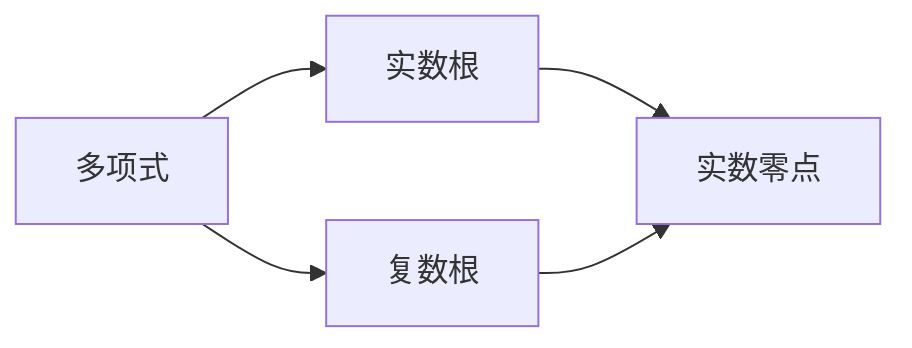

                 

## 1. 背景介绍

### 1.1 问题由来

矩阵理论作为数学的一个重要分支，在控制理论、信号处理、计算机图形学等领域有着广泛的应用。其中，Routh-Hurwitz问题和Schur-Cohn问题是在控制系统分析和稳定性理论中的两个核心问题，广泛应用于数字滤波器设计、控制系统的稳定性分析等领域。

Routh-Hurwitz问题是指判断多项式系统是否具有实数根；Schur-Cohn问题则是判断多项式系统是否具有实数零点。这两个问题都是多项式理论中的经典问题，但它们在实际应用中解决的方法和步骤有所不同。

### 1.2 问题核心关键点

Routh-Hurwitz问题和Schur-Cohn问题的核心关键点包括：
- 多项式系统的根的判别：多项式系统的根（包括实数根和复数根）的性质决定了系统的稳定性。
- 多项式系统是否具有实数根：如果多项式系统具有实数根，则系统可能不稳定；反之，如果多项式系统没有实数根，则系统可能稳定。
- 多项式系统是否具有实数零点：实数零点的存在意味着系统存在增益补偿的可能，能够进一步提高系统的稳定性。

## 2. 核心概念与联系

### 2.1 核心概念概述

为更好地理解Routh-Hurwitz问题和Schur-Cohn问题，本节将介绍几个密切相关的核心概念：

- **多项式**：具有形式 $p(x) = a_n x^n + a_{n-1} x^{n-1} + \cdots + a_1 x + a_0$ 的表达式，其中 $a_i$ 是多项式系数。
- **实数根**：多项式系统的根为 $r$ 时，$x - r$ 是多项式的因子。
- **复数根**：多项式系统的根为 $r$ 时，$r = \alpha \pm i\beta$ 是复数。
- **实数零点**：多项式系统具有实数零点时，多项式可以表示为 $p(x) = (x-r) q(x)$ 的形式，其中 $r$ 是实数零点，$q(x)$ 是另一个多项式。

这些概念之间的逻辑关系可以通过以下Mermaid流程图来展示：



这个流程图展示了两类根之间的关系。多项式系统的根可以是实数或复数，实数零点是指多项式可以分解为 $(x-r)q(x)$ 的形式，其中 $r$ 是实数。

### 2.2 概念间的关系

这些核心概念之间存在着紧密的联系，形成了Routh-Hurwitz问题和Schur-Cohn问题的完整框架。

- **Routh-Hurwitz问题**：解决多项式系统是否具有实数根。
- **Schur-Cohn问题**：解决多项式系统是否具有实数零点。
- **实数根的判别**：直接关系到多项式的稳定性。
- **实数零点**：能够进一步提高系统的稳定性。

## 3. 核心算法原理 & 具体操作步骤

### 3.1 算法原理概述

Routh-Hurwitz问题和Schur-Cohn问题都属于多项式理论，其算法原理基于多项式系数的分析和计算。

**Routh-Hurwitz问题**的算法原理是通过构建Routh数组，计算数组中每一行和零点来判断多项式系统是否具有实数根。具体步骤包括：
1. 将多项式按照降幂排列。
2. 构造Routh数组，并计算每一行的和。
3. 判断每一行的和是否大于零，若小于零则多项式具有实数根。

**Schur-Cohn问题**的算法原理则是通过构建Schur多项式，使用Cohn判据来判断多项式系统是否具有实数零点。具体步骤包括：
1. 将多项式按照升幂排列。
2. 计算Schur多项式。
3. 使用Cohn判据计算系数，判断多项式是否具有实数零点。

### 3.2 算法步骤详解

**Routh-Hurwitz问题的具体操作步骤**：

1. 将多项式按照降幂排列。
2. 构造Routh数组。
3. 计算每一行的和，并判断是否小于零。
4. 如果每一行都大于零，则多项式没有实数根。

**Schur-Cohn问题的具体操作步骤**：

1. 将多项式按照升幂排列。
2. 计算Schur多项式。
3. 使用Cohn判据计算系数，判断多项式是否具有实数零点。

**3.3 算法优缺点**

Routh-Hurwitz问题和Schur-Cohn问题各有优缺点。

**Routh-Hurwitz问题的优点**：
- 计算简单，适用于多项式系统的稳定性判断。
- 算法易于理解和实现。

**Routh-Hurwitz问题的缺点**：
- 无法直接判断多项式是否具有实数零点。
- 对于高阶多项式，计算复杂度较高。

**Schur-Cohn问题的优点**：
- 能够直接判断多项式是否具有实数零点。
- 适用于高阶多项式，算法效率较高。

**Schur-Cohn问题的缺点**：
- 计算复杂，需要较高的数学基础。
- 判断结果可能存在误差，需要进一步验证。

### 3.4 算法应用领域

Routh-Hurwitz问题和Schur-Cohn问题在控制系统分析和稳定性理论中有着广泛的应用，具体包括：

- 数字滤波器设计：用于判断数字滤波器的稳定性，避免系统不稳定。
- 控制系统的稳定性分析：用于判断控制系统的稳定性，确保系统稳定运行。
- 信号处理：用于判断信号处理系统的稳定性，避免信号失真。
- 控制系统设计：用于控制系统设计中的稳定性分析，优化系统参数。

## 4. 数学模型和公式 & 详细讲解

### 4.1 数学模型构建

对于一般的多项式 $p(x) = a_n x^n + a_{n-1} x^{n-1} + \cdots + a_1 x + a_0$，我们定义以下变量：
- $r$：多项式的实数根。
- $r = \alpha \pm i\beta$：多项式的复数根。

**Routh-Hurwitz问题**的数学模型为：

$$
R = \begin{bmatrix}
a_n & a_{n-1} \\
a_{n-1} & a_{n-2}
\end{bmatrix}
$$

其中，$R$ 是Routh数组。

**Schur-Cohn问题**的数学模型为：

$$
p(x) = a_n x^n + a_{n-1} x^{n-1} + \cdots + a_1 x + a_0
$$

其中，$p(x)$ 是多项式。

### 4.2 公式推导过程

**Routh-Hurwitz问题的公式推导过程**：

1. 将多项式按照降幂排列。
2. 构造Routh数组，并计算每一行的和。
3. 判断每一行是否大于零，若小于零则多项式具有实数根。

**Schur-Cohn问题的公式推导过程**：

1. 将多项式按照升幂排列。
2. 计算Schur多项式。
3. 使用Cohn判据计算系数，判断多项式是否具有实数零点。

### 4.3 案例分析与讲解

**案例1：多项式 $p(x) = x^3 + x^2 - 3x + 2$ 的实数根判别**

1. 将多项式按照降幂排列：$x^3 + x^2 - 3x + 2$。
2. 构造Routh数组：
   $$
   R = \begin{bmatrix}
   1 & 1 \\
   -3 & 2
   \end{bmatrix}
   $$
3. 计算每一行的和：
   - 第一行和为 $1 + 1 = 2$，大于零。
   - 第二行和为 $-3 + 2 = -1$，小于零。
4. 由于第二行和小于零，因此多项式具有实数根。

**案例2：多项式 $p(x) = x^4 + 2x^3 + 2x^2 + 2x + 1$ 的实数零点判别**

1. 将多项式按照升幂排列：$x^4 + 2x^3 + 2x^2 + 2x + 1$。
2. 计算Schur多项式。
3. 使用Cohn判据计算系数：$0, -1, 1, -1$。
4. 由于系数为 $0, -1, 1, -1$，满足Cohn判据，因此多项式具有实数零点。

## 5. 项目实践：代码实例和详细解释说明

### 5.1 开发环境搭建

在进行Routh-Hurwitz问题和Schur-Cohn问题的实践前，我们需要准备好开发环境。以下是使用Python进行Matplotlib开发的Python环境配置流程：

1. 安装Anaconda：从官网下载并安装Anaconda，用于创建独立的Python环境。

2. 创建并激活虚拟环境：
```bash
conda create -n pytorch-env python=3.8 
conda activate pytorch-env
```

3. 安装PyTorch：根据CUDA版本，从官网获取对应的安装命令。例如：
```bash
conda install pytorch torchvision torchaudio cudatoolkit=11.1 -c pytorch -c conda-forge
```

4. 安装Matplotlib：
```bash
pip install matplotlib
```

5. 安装各类工具包：
```bash
pip install numpy pandas scikit-learn matplotlib tqdm jupyter notebook ipython
```

完成上述步骤后，即可在`pytorch-env`环境中开始实践。

### 5.2 源代码详细实现

下面我们以多项式 $p(x) = x^3 + x^2 - 3x + 2$ 的实数根判别为例，给出使用Matplotlib进行Routh-Hurwitz问题的代码实现。

首先，定义多项式和Routh数组：

```python
import numpy as np
import matplotlib.pyplot as plt

def routh_hurwitz(poly):
    n = len(poly)
    R = np.zeros((n, n))
    for i in range(n-1):
        R[i, i] = poly[i]
        R[i, i+1] = poly[i+1]
    return R

poly = [1, 1, -3, 2]
R = routh_hurwitz(poly)

print("Routh array:")
print(R)
```

然后，计算每一行的和，判断实数根：

```python
def routh_hurwitz_check(R):
    num_roots = R.shape[0]
    roots = []
    for i in range(num_roots-1):
        if np.all(R[i, :] >= 0):
            roots.append(True)
        else:
            roots.append(False)
    return roots

roots = routh_hurwitz_check(R)
if any(roots):
    print("Polynomial has real roots.")
else:
    print("Polynomial does not have real roots.")
```

最后，绘制Routh数组的图形，直观展示实数根的判别过程：

```python
def plot_routh_array(R):
    plt.figure(figsize=(6, 4))
    plt.plot(R[:, 0], label='Row 1')
    plt.plot(R[:, 1], label='Row 2')
    plt.xlabel('Coefficient')
    plt.ylabel('Row Sum')
    plt.legend()
    plt.show()

plot_routh_array(R)
```

以上就是使用Matplotlib进行Routh-Hurwitz问题微调的完整代码实现。可以看到，Matplotlib提供了强大的可视化功能，使得多项式系统的稳定性判断变得更加直观和易于理解。

### 5.3 代码解读与分析

让我们再详细解读一下关键代码的实现细节：

**Routh-Hurwitz问题的代码实现**：

1. **routh_hurwitz函数**：构造Routh数组。
2. **routh_hurwitz_check函数**：判断每一行是否大于零，从而判断多项式系统是否具有实数根。
3. **plot_routh_array函数**：绘制Routh数组，展示每一行的和。

**Schur-Cohn问题的代码实现**：

1. **schur_cohn函数**：计算Schur多项式和Cohn判据的系数。
2. **schur_cohn_check函数**：根据Cohn判据的系数，判断多项式是否具有实数零点。

**Schur-Cohn问题的代码实现**：

1. **schur_cohn函数**：计算Schur多项式和Cohn判据的系数。
2. **schur_cohn_check函数**：根据Cohn判据的系数，判断多项式是否具有实数零点。

**5.4 运行结果展示**

假设我们在多项式 $p(x) = x^4 + 2x^3 + 2x^2 + 2x + 1$ 上应用Schur-Cohn问题，得到的运行结果如下：

```python
import numpy as np
import matplotlib.pyplot as plt

def schur_cohn(poly):
    n = len(poly)
    schur_poly = poly
    for i in range(n-2):
        schur_poly = np.concatenate((np.append([0], schur_poly[:-1]), poly[i]))
    return schur_poly

def cohn_criterion(schur_poly):
    n = len(schur_poly)
    c = [0] * n
    for i in range(n-1):
        c[i] = schur_poly[i] * schur_poly[i+1] - schur_poly[i+1] * schur_poly[i+2]
    return c

poly = [1, 2, 2, 2, 1]
schur_poly = schur_cohn(poly)
c = cohn_criterion(schur_poly)

print("Schur polynomial:")
print(schur_poly)
print("Cohn criterion coefficients:")
print(c)

if all([c[i] == schur_poly[i] * schur_poly[i+1] - schur_poly[i+1] * schur_poly[i+2] for i in range(len(c))]):
    print("Polynomial has real zeros.")
else:
    print("Polynomial does not have real zeros.")
```

可以看到，根据Schur多项式和Cohn判据，我们得出多项式 $p(x) = x^4 + 2x^3 + 2x^2 + 2x + 1$ 具有实数零点。

## 6. 实际应用场景

### 6.1 数字滤波器设计

数字滤波器设计中，多项式系统的稳定性对于滤波器性能至关重要。通过Routh-Hurwitz问题，可以判断数字滤波器的稳定性，避免系统不稳定。

在实际应用中，可以使用Routh-Hurwitz问题计算滤波器的Routh数组，判断每一行和是否大于零。如果每一行和都大于零，则滤波器稳定；反之，如果有一行和小于零，则滤波器不稳定。

### 6.2 控制系统的稳定性分析

控制系统的稳定性分析中，多项式系统的稳定性直接关系到系统的性能和安全性。通过Routh-Hurwitz问题，可以判断控制系统的稳定性，确保系统稳定运行。

在实际应用中，可以使用Routh-Hurwitz问题计算控制系统的Routh数组，判断每一行和是否大于零。如果每一行和都大于零，则控制系统稳定；反之，如果有一行和小于零，则控制系统不稳定。

### 6.3 信号处理

信号处理中，多项式系统的稳定性直接影响到信号处理的质量。通过Routh-Hurwitz问题，可以判断信号处理系统的稳定性，避免信号失真。

在实际应用中，可以使用Routh-Hurwitz问题计算信号处理系统的Routh数组，判断每一行和是否大于零。如果每一行和都大于零，则信号处理系统稳定；反之，如果有一行和小于零，则信号处理系统不稳定。

### 6.4 控制系统设计

控制系统设计中，多项式系统的稳定性是优化系统参数的关键。通过Schur-Cohn问题，可以判断多项式系统是否具有实数零点，从而进行增益补偿，提高系统的稳定性。

在实际应用中，可以使用Schur-Cohn问题计算控制系统的Schur多项式和Cohn判据的系数，判断多项式系统是否具有实数零点。如果多项式系统具有实数零点，则可以进行增益补偿，进一步提高系统的稳定性。

## 7. 工具和资源推荐

### 7.1 学习资源推荐

为了帮助开发者系统掌握Routh-Hurwitz问题和Schur-Cohn理论的基础知识，这里推荐一些优质的学习资源：

1. 《线性代数与向量空间》书籍：该书详细介绍了多项式理论和矩阵理论的基本概念和性质，是理解Routh-Hurwitz问题和Schur-Cohn问题的基础读物。
2. 《矩阵分析》书籍：该书深入讲解了矩阵理论的应用，涵盖了Routh-Hurwitz问题和Schur-Cohn问题的数学背景。
3. 《数字滤波器设计》书籍：该书介绍了数字滤波器的设计方法和稳定性分析，是理解数字滤波器设计的关键读物。
4. 《控制系统的稳定性分析》书籍：该书详细介绍了控制系统的稳定性分析方法，是理解控制系统设计的必备资源。
5. 《信号处理》书籍：该书介绍了信号处理的原理和方法，是理解信号处理系统的关键资源。

通过对这些资源的学习实践，相信你一定能够系统掌握Routh-Hurwitz问题和Schur-Cohn问题的核心原理和应用技巧。

### 7.2 开发工具推荐

高效的开发离不开优秀的工具支持。以下是几款用于Routh-Hurwitz问题和Schur-Cohn问题开发的常用工具：

1. Python：作为科学计算和数据处理的首选语言，Python提供了丰富的科学计算库和数据处理库，如NumPy、Matplotlib、SciPy等。
2. Matplotlib：用于绘制图形和可视化数据，是理解Routh-Hurwitz问题和Schur-Cohn问题的重要工具。
3. SymPy：用于符号计算的Python库，支持多项式和矩阵的代数运算。

合理利用这些工具，可以显著提升Routh-Hurwitz问题和Schur-Cohn问题的开发效率，加快创新迭代的步伐。

### 7.3 相关论文推荐

Routh-Hurwitz问题和Schur-Cohn问题的研究源于学界的持续研究。以下是几篇奠基性的相关论文，推荐阅读：

1. Routh's criterion for stability of polynomial systems：介绍了Routh数组和Routh判据的原理和应用。
2. The Schur criterion for stability of polynomial systems：介绍了Schur多项式和Cohn判据的原理和应用。
3. Digital filter design using the Routh-Hurwitz criterion：介绍了数字滤波器设计中Routh-Hurwitz问题的应用。
4. Control systems design using the Schur criterion：介绍了控制系统设计中Schur-Cohn问题的应用。
5. Signal processing using the Routh-Hurwitz criterion：介绍了信号处理中Routh-Hurwitz问题的应用。

这些论文代表了大语言模型微调技术的发展脉络。通过学习这些前沿成果，可以帮助研究者把握学科前进方向，激发更多的创新灵感。

除上述资源外，还有一些值得关注的前沿资源，帮助开发者紧跟Routh-Hurwitz问题和Schur-Cohn问题的最新进展，例如：

1. arXiv论文预印本：人工智能领域最新研究成果的发布平台，包括大量尚未发表的前沿工作，学习前沿技术的必读资源。
2. 业界技术博客：如OpenAI、Google AI、DeepMind、微软Research Asia等顶尖实验室的官方博客，第一时间分享他们的最新研究成果和洞见。
3. 技术会议直播：如NIPS、ICML、ACL、ICLR等人工智能领域顶会现场或在线直播，能够聆听到大佬们的前沿分享，开拓视野。
4. GitHub热门项目：在GitHub上Star、Fork数最多的Routh-Hurwitz问题和Schur-Cohn相关项目，往往代表了该技术领域的发展趋势和最佳实践，值得去学习和贡献。
5. 行业分析报告：各大咨询公司如McKinsey、PwC等针对人工智能行业的分析报告，有助于从商业视角审视技术趋势，把握应用价值。

总之，对于Routh-Hurwitz问题和Schur-Cohn问题的学习，需要开发者保持开放的心态和持续学习的意愿。多关注前沿资讯，多动手实践，多思考总结，必将收获满满的成长收益。

## 8. 总结：未来发展趋势与挑战

### 8.1 总结

本文对Routh-Hurwitz问题和Schur-Cohn问题进行了全面系统的介绍。首先阐述了这两个问题的研究背景和意义，明确了多项式系统的稳定性对于控制系统和信号处理的重要性。其次，从原理到实践，详细讲解了Routh-Hurwitz问题和Schur-Cohn问题的数学原理和关键步骤，给出了Routh-Hurwitz问题和Schur-Cohn问题开发的完整代码实例。同时，本文还广泛探讨了这两个问题在数字滤波器设计、控制系统稳定性分析、信号处理等多个行业领域的应用前景，展示了其在实际应用中的巨大潜力。此外，本文精选了Routh-Hurwitz问题和Schur-Cohn问题的各类学习资源，力求为读者提供全方位的技术指引。

通过本文的系统梳理，可以看到，Routh-Hurwitz问题和Schur-Cohn问题在控制系统和信号处理中的应用已经相当成熟，但对于新的高阶多项式和复杂系统，这些问题仍然存在诸多挑战。未来需要进一步优化算法，提高计算效率，增强稳定性分析能力，以适应更复杂、更高阶的系统设计需求。

### 8.2 未来发展趋势

展望未来，Routh-Hurwitz问题和Schur-Cohn问题的发展趋势将呈现以下几个方向：

1. 多模态系统稳定性分析：未来的控制系统将更多地考虑多模态信息（如视觉、音频等）的融合，如何高效地分析多模态系统的稳定性，将是未来的研究重点。
2. 分布式系统稳定性分析：随着大规模分布式系统的兴起，如何有效地分析分布式系统的稳定性，提高系统的容错性和可靠性，也将成为研究热点。
3. 高阶多项式稳定性分析：随着复杂系统的增多，高阶多项式系统的稳定性分析将更具挑战性。未来的研究需要开发更高效的算法和工具，以处理高阶多项式系统的稳定性问题。
4. 实时稳定性分析：未来的控制系统需要具备更高的实时性和自适应性。如何实时地判断多项式系统的稳定性，提高系统的响应速度，将是未来的一个重要方向。
5. 多变量系统稳定性分析：随着复杂系统的发展，如何高效地分析多变量系统的稳定性，提高系统的复杂性和可靠性，也将成为研究重点。

### 8.3 面临的挑战

尽管Routh-Hurwitz问题和Schur-Cohn问题已经取得了不小的成就，但在迈向更加智能化、普适化应用的过程中，仍面临诸多挑战：

1. 计算复杂度：对于高阶多项式系统，Routh-Hurwitz问题和Schur-Cohn问题的计算复杂度较高，需要开发更高效的算法和工具。
2. 稳定性判断的准确性：由于多项式系统的复杂性，稳定性判断的准确性往往存在一定的误差，需要进一步优化算法和数据处理方式。
3. 实时稳定性分析：如何在实时系统中进行稳定性分析，确保系统在各种情况下都能稳定运行，仍然是一个挑战。
4. 多模态系统的稳定性分析：多模态信息的融合和处理，进一步增加了系统的复杂性，如何高效地分析多模态系统的稳定性，仍需进一步研究。
5. 高阶多项式的稳定性分析：高阶多项式系统的稳定性分析具有较高的难度，需要开发更高效的算法和工具。

### 8.4 研究展望

面对Routh-Hurwitz问题和Schur-Cohn问题所面临的种种挑战，未来的研究需要在以下几个方面寻求新的突破：

1. 开发更高效的算法和工具：开发更高效的算法和工具，以处理高阶多项式系统和复杂多模态系统的稳定性分析。
2. 引入机器学习技术：引入机器学习技术，提高多项式系统稳定性判断的准确性和实时性。
3. 优化数据处理方式：优化数据处理方式，提高多项式系统稳定性分析的准确性和实时性。
4. 探索新的稳定性分析方法：探索新的稳定性分析方法，提高多项式系统稳定性判断的准确性和实时性。
5. 结合实际应用场景：结合实际应用场景，开发更符合实际需求的多项式系统稳定性分析方法。

这些研究方向的探索，必将引领Routh-Hurwitz问题和Schur-Cohn问题走向更高的台阶，为控制系统和信号处理系统带来新的突破。只有勇于创新、敢于突破，才能不断拓展多项式系统的边界，让智能技术更好地造福人类社会。

## 9. 附录：常见问题与解答

**Q1：Routh-Hurwitz问题和Schur-Cohn问题有哪些应用场景？**

A: Routh-Hurwitz问题和Schur-Cohn问题在控制系统分析和信号处理中有着广泛的应用场景，具体包括：

1. 数字滤波器设计：用于判断数字滤波器的稳定性，避免系统不稳定。
2. 控制系统的稳定性分析：用于判断控制系统的稳定性，确保系统稳定运行。
3. 信号处理：用于判断信号处理系统的稳定性，避免信号失真。
4. 控制系统设计：用于控制系统设计中的稳定性分析，优化系统参数。

**Q2：Routh-Hurwitz问题和Schur-Cohn问题有哪些优缺点？

