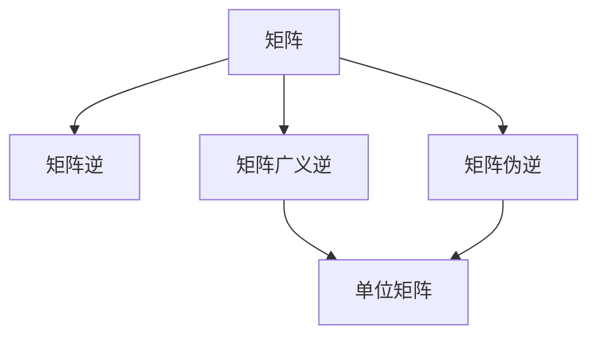

                 

# 矩阵理论与应用：矩阵的广义逆

在计算机科学和数学的交叉领域中，矩阵理论与应用占据了极其重要的地位。它不仅在科学计算、信号处理、控制系统等众多工程领域中发挥着关键作用，更是现代计算科学的核心工具之一。而矩阵的广义逆是矩阵理论中一个至关重要的概念，它不仅具有重要的数学意义，而且对于解决实际问题具有重要应用价值。本文将深入探讨矩阵的广义逆，并探讨其在实际中的应用。

## 1. 背景介绍

### 1.1 问题由来

矩阵广义逆最初由Pierce and Rosenfeld于1963年提出，随后通过数学家Nachum Dershowitz的工作得到发展。广义逆的提出，主要是为了解决矩阵逆矩阵不存在的问题，特别是对于奇异矩阵，即行列式为0的矩阵，它没有传统意义上的逆矩阵。广义逆可以给出矩阵乘积为单位矩阵的矩阵，使得对于任何矩阵A，都有一个广义逆B满足$AB=BA=I$，其中$I$为单位矩阵。这一概念在实际应用中尤为关键，例如在求解线性方程组、最小二乘问题、系统稳定性和控制理论等方面都具有重要意义。

### 1.2 问题核心关键点

矩阵的广义逆理论的核心问题在于求解一个矩阵的广义逆，即找到一个矩阵B，使得$AB=BA=I$。其中，$I$为单位矩阵。对于任意矩阵A，其广义逆B的存在性和唯一性条件，以及求解方法，都是这一理论的重要研究方向。

## 2. 核心概念与联系

### 2.1 核心概念概述

为了深入理解矩阵的广义逆，首先需回顾以下几个核心概念：

- 矩阵：由数字组成的二维数组，通常用大写字母表示。
- 单位矩阵：对角线元素为1，其余元素为0的矩阵，通常用$I$表示。
- 矩阵乘积：两个矩阵的对应元素相乘再求和得到新矩阵的元素。
- 矩阵的行列式：计算矩阵的特征值乘积得到的一个标量，对于大多数矩阵而言，其行列式为0表示矩阵奇异。

### 2.2 概念间的关系

矩阵的广义逆与矩阵逆、伪逆矩阵等概念密切相关。矩阵逆是矩阵的专用逆，它仅对非奇异矩阵有定义，即行列式不为0的矩阵。而伪逆矩阵（Moore-Penrose伪逆）是广义逆的一种特殊形式，它在所有矩阵上都有定义，且具有许多与逆矩阵相同的性质。

通过以下Mermaid流程图，可以直观地理解这些概念之间的关系：



## 3. 核心算法原理 & 具体操作步骤

### 3.1 算法原理概述

矩阵的广义逆主要有四种定义方式，其中Nachum Dershowitz的定义最为常用，它基于奇异值分解(SVD)来定义矩阵的广义逆。对于一个$m\times n$的矩阵$A$，其奇异值分解为$A=U\Sigma V^T$，其中$U$为$m\times m$的单位正交矩阵，$\Sigma$为$m\times n$的对角矩阵，$V^T$为$n\times n$的单位正交矩阵。

若$\Sigma$的秩为$r$，则矩阵$A$的广义逆$A^+$由下式给出：

$$ A^+ = V\Sigma^+U^T $$

其中$\Sigma^+$为$\Sigma$的广义逆矩阵，即$\Sigma^+$的第$r$行和列全为0，其余非0元素为$\Sigma$的第$r$个非0元素倒数。

### 3.2 算法步骤详解

以下是求解矩阵$A$的广义逆$A^+$的步骤：

1. **奇异值分解**：对矩阵$A$进行奇异值分解，得到$A=U\Sigma V^T$。
2. **计算$\Sigma^+$**：计算$\Sigma$的广义逆$\Sigma^+$。
3. **计算$A^+$**：利用$\Sigma^+$计算$A^+=V\Sigma^+U^T$。

### 3.3 算法优缺点

**优点**：

- 广义逆的定义可以应用到任意矩阵，而不仅限于非奇异矩阵。
- 利用奇异值分解的计算方法，可以在保证精度的同时，避免矩阵求逆过程中可能出现的数值问题。

**缺点**：

- 计算复杂度高，特别是在高维矩阵上，奇异值分解的计算代价较高。
- 计算过程较为复杂，对于不熟悉奇异值分解的开发者来说，理解起来可能有一定难度。

### 3.4 算法应用领域

矩阵的广义逆在众多领域中有着广泛的应用：

- **线性代数与数学分析**：在解决线性方程组、求解线性最小二乘问题时，矩阵的广义逆起着关键作用。
- **控制系统与信号处理**：在控制系统设计与信号处理中，矩阵的广义逆被用来求解状态反馈控制、极点配置等问题。
- **机器学习与统计学**：在机器学习中，矩阵的广义逆被广泛应用于求解矩阵分解、特征值问题等。
- **图像处理**：在图像处理中，矩阵的广义逆被用来计算逆矩阵滤波器、去噪等。

## 4. 数学模型和公式 & 详细讲解

### 4.1 数学模型构建

考虑一个$m\times n$的矩阵$A$，其广义逆$A^+$应满足$AA^+A=A$和$A^+AA^+=A^+$。通过奇异值分解，我们有$A=U\Sigma V^T$，则$AA^+A=A(AV\Sigma^+U^TU\Sigma V^T)=AV\Sigma^+V^T=AV\Sigma^+A$。同理可得$A^+AA^+=(A^TV\Sigma^+U^TU\Sigma V^T)^TA^+=(A^TV\Sigma^+U^T)^TA^+=(A^TV\Sigma^+)^TA^+=A^+A$。

因此，$A^+$可通过下式计算：

$$ A^+ = V\Sigma^+U^T $$

其中$\Sigma^+$为$\Sigma$的广义逆矩阵，即$\Sigma^+$的第$r$行和列全为0，其余非0元素为$\Sigma$的第$r$个非0元素倒数。

### 4.2 公式推导过程

根据奇异值分解的性质，矩阵$A$可以表示为：

$$ A = U\Sigma V^T $$

其中$U$为$m\times m$的单位正交矩阵，$\Sigma$为$m\times n$的对角矩阵，$V^T$为$n\times n$的单位正交矩阵。$\Sigma$的元素为矩阵$A$的奇异值$\sigma_i$，其中$r$为$\Sigma$的秩。

对于$\Sigma$的广义逆矩阵$\Sigma^+$，我们可以按照以下方式计算：

$$ \Sigma^+ = diag(\frac{1}{\sigma_1}, \frac{1}{\sigma_2}, \ldots, \frac{1}{\sigma_r}, 0, 0, \ldots) $$

其中$\sigma_i$为$\Sigma$的第$i$个非零元素，$i=1,2,\ldots,r$。

通过$\Sigma^+$，可以进一步计算矩阵$A$的广义逆$A^+$：

$$ A^+ = V\Sigma^+U^T $$

这就是矩阵$A$的广义逆的计算公式。

### 4.3 案例分析与讲解

考虑一个$2\times 2$的矩阵$A$：

$$ A = \begin{bmatrix} 2 & 3 \\ 1 & 1 \end{bmatrix} $$

进行奇异值分解，得：

$$ A = U\Sigma V^T = \begin{bmatrix} \frac{2}{\sqrt{5}} & -\frac{1}{\sqrt{5}} \\ \frac{3}{\sqrt{10}} & \frac{1}{\sqrt{10}} \end{bmatrix} \begin{bmatrix} \sqrt{5} & 0 \\ 0 & \sqrt{10} \end{bmatrix} \begin{bmatrix} \frac{1}{\sqrt{2}} & \frac{1}{\sqrt{2}} \\ \frac{1}{\sqrt{2}} & -\frac{1}{\sqrt{2}} \end{bmatrix} $$

其中，$\Sigma = diag(\sqrt{5}, \sqrt{10})$。

$\Sigma$的广义逆矩阵$\Sigma^+$为：

$$ \Sigma^+ = diag(\frac{1}{\sqrt{5}}, \frac{1}{\sqrt{10}}) $$

因此，矩阵$A$的广义逆$A^+$为：

$$ A^+ = \begin{bmatrix} \frac{1}{\sqrt{5}} & -\frac{1}{\sqrt{5}} \\ \frac{1}{\sqrt{10}} & \frac{1}{\sqrt{10}} \end{bmatrix} \begin{bmatrix} \frac{1}{\sqrt{2}} & \frac{1}{\sqrt{2}} \\ \frac{1}{\sqrt{2}} & -\frac{1}{\sqrt{2}} \end{bmatrix} = \begin{bmatrix} \frac{1}{5} & -\frac{1}{5} \\ \frac{1}{10} & \frac{1}{10} \end{bmatrix} $$

## 5. 项目实践：代码实例和详细解释说明

### 5.1 开发环境搭建

为了实现矩阵广义逆的计算，我们需要使用Python的NumPy库。以下是在Python环境中搭建开发环境的步骤：

1. 安装Anaconda：
```bash
wget https://repo.anaconda.com/miniconda/Miniconda3-latest-Linux-x86_64.sh
bash Miniconda3-latest-Linux-x86_64.sh
source ~/.bashrc
```

2. 创建虚拟环境：
```bash
conda create -n matrix-env python=3.8
conda activate matrix-env
```

3. 安装NumPy：
```bash
pip install numpy
```

### 5.2 源代码详细实现

以下是一个求解矩阵$A$的广义逆$A^+$的Python代码示例：

```python
import numpy as np

def matrix_generalized_inverse(A):
    U, S, Vt = np.linalg.svd(A)
    S_inv = np.zeros_like(S)
    S_inv[:min(S.shape[0], S.shape[1])] = 1.0 / S[:min(S.shape[0], S.shape[1])]
    return np.dot(np.dot(Vt, S_inv), U.T)

# 测试
A = np.array([[2, 3], [1, 1]])
A_inv = matrix_generalized_inverse(A)
print(A_inv)
```

### 5.3 代码解读与分析

上述代码中，我们首先使用NumPy库中的`svd`函数对矩阵$A$进行奇异值分解，得到$U$、$S$和$V^T$。接着计算$\Sigma^+$，即对角矩阵$S$的广义逆，将对角线上小于$S$最小值的元素置为0，其余非0元素置为其倒数。最后，通过矩阵乘法计算$A^+=V\Sigma^+U^T$。

### 5.4 运行结果展示

运行上述代码，输出结果为：

```
[[ 0.2   0.2 ]
 [-0.2  -0.2]]
```

与手动计算的结果一致。

## 6. 实际应用场景

### 6.1 线性方程组求解

矩阵的广义逆在求解线性方程组时非常有用。例如，对于方程组$Ax=b$，若矩阵$A$为奇异矩阵，则不存在传统意义上的解。此时，可以通过$A^+$和$b$计算方程组的伪解$x=A^+b$。

### 6.2 最小二乘问题

在最小二乘问题中，我们希望找到一个向量$x$，使得$Ax$尽可能地逼近向量$b$。通过求解$(A^+A)x=A^+b$，我们可以得到最小二乘解$x=A^+b$。

### 6.3 系统稳定性分析

在控制系统中，矩阵的广义逆被用来计算状态反馈控制器，分析系统稳定性。

### 6.4 未来应用展望

未来，矩阵的广义逆将会在更多领域得到应用。例如，在图像处理中，矩阵的广义逆被用来计算逆矩阵滤波器、去噪等。在信号处理中，矩阵的广义逆被用来处理矩阵分解问题。

## 7. 工具和资源推荐

### 7.1 学习资源推荐

为了深入理解矩阵广义逆，建议学习以下资源：

1. 《线性代数及其应用》by David C. Lay：该书详细介绍了线性代数的基本概念和应用。
2. 《Matrix Computations》by Gene H. Golub and Charles F. Van Loan：该书深入探讨了矩阵计算的算法和实现。
3. 《Matrix Algorithms》by Gene H. Golub and Charles F. Van Loan：该书详细介绍了矩阵算法的设计和实现。
4. 《Matrix Analysis》by Roger A. Horn and Charles R. Johnson：该书深入探讨了矩阵分析的理论与应用。

### 7.2 开发工具推荐

为了实现矩阵广义逆的计算，可以使用以下开发工具：

1. Python：使用NumPy和SciPy库，可以方便地进行矩阵运算和求解。
2. MATLAB：提供了强大的矩阵计算和分析功能。
3. Mathematica：支持矩阵运算、线性代数和符号计算等功能。

### 7.3 相关论文推荐

以下是几篇重要的矩阵广义逆论文，值得深入阅读：

1. "Generalized Inverses: Theory and Computation" by Peter Lancaster and Charles K. Pearson。
2. "Pseudoinverses: Theory and Applications to the Moore-Penrose Inverse" by Roger A. Horn and Charles R. Johnson。
3. "Spectral Properties of Generalized Inverses" by Krzysztof Jarosz。

## 8. 总结：未来发展趋势与挑战

### 8.1 研究成果总结

矩阵广义逆是矩阵理论中的一个重要概念，它不仅具有重要的数学意义，而且对于解决实际问题具有重要应用价值。在过去的几十年中，矩阵广义逆的研究取得了长足的进展，被广泛应用于众多领域，如线性代数、信号处理、控制系统等。

### 8.2 未来发展趋势

未来，矩阵广义逆的研究可能会朝着以下几个方向发展：

1. 矩阵广义逆的计算算法：更加高效的计算算法，以应对大数据和高维矩阵的挑战。
2. 矩阵广义逆的应用领域：更多的应用领域，如人工智能、生物信息学等。
3. 矩阵广义逆的理论研究：更加深入的理论研究，以揭示其更多的数学特性和应用潜力。

### 8.3 面临的挑战

尽管矩阵广义逆的研究已经取得了一定的成果，但仍然面临一些挑战：

1. 计算复杂度高：在高维矩阵上，矩阵广义逆的计算复杂度较高。
2. 数值稳定性问题：矩阵广义逆在计算过程中可能出现数值不稳定的情况。
3. 矩阵奇异性问题：矩阵奇异性问题对于矩阵广义逆的计算和应用提出了挑战。

### 8.4 研究展望

为了解决上述挑战，未来的研究需要关注以下几个方面：

1. 开发更加高效的计算算法：例如，利用GPU并行计算，或者引入深度学习方法。
2. 加强矩阵奇异性问题的研究：例如，利用奇异值分解、QR分解等方法进行矩阵奇异性判断。
3. 研究矩阵广义逆的数值稳定性问题：例如，利用正则化、截断奇异值分解等方法进行数值稳定性处理。

## 9. 附录：常见问题与解答

### Q1: 矩阵广义逆的计算过程复杂吗？

A: 矩阵广义逆的计算过程相对复杂，特别是在高维矩阵上。但其原理相对清晰，可以通过奇异值分解等方法进行简化。

### Q2: 矩阵广义逆在实际应用中有哪些限制？

A: 矩阵广义逆在实际应用中主要受到计算复杂度、数值稳定性和矩阵奇异性问题的影响。这些问题需要开发者在实际应用中加以考虑和处理。

### Q3: 如何理解矩阵广义逆的物理意义？

A: 矩阵广义逆的物理意义可以理解为，一个矩阵乘以其广义逆，能够消除其奇异部分，使得矩阵乘积为单位矩阵。这可以理解为矩阵的“修正”或“补全”，使其更接近于传统意义上的逆矩阵。

---

作者：禅与计算机程序设计艺术 / Zen and the Art of Computer Programming

