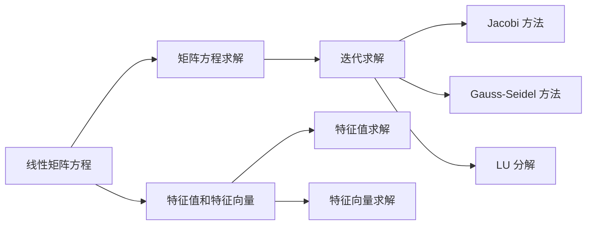
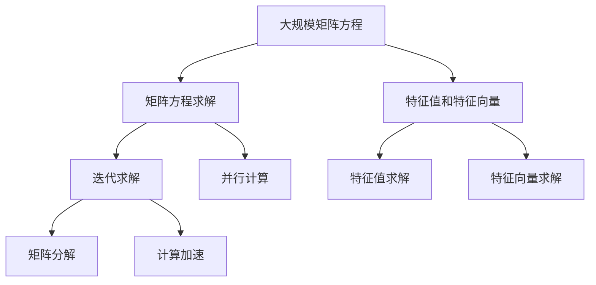

                 

# 矩阵理论与应用：线性矩阵方程与惯性理论

> 关键词：矩阵理论,线性矩阵方程,惯性理论,矩阵特征值,矩阵范数,矩阵分解,线性代数

## 1. 背景介绍

线性代数在数学和工程领域具有广泛的应用，尤其是在计算科学、物理、工程、经济学等多个学科中发挥着至关重要的作用。其中，矩阵方程的求解和矩阵的特征值问题是最基本也最为重要的一环。矩阵理论不仅是理解线性方程和动态系统行为的关键，也是探索计算机科学中算法和数据结构的基石。

本文将聚焦于线性矩阵方程的求解和矩阵的特征值问题，详细探讨其在矩阵理论中的应用。我们将通过合理解释和精确定义，使用逻辑清晰、结构紧凑、易懂的语言，揭示线性矩阵方程与惯性理论之间的联系，并讨论其优缺点和应用领域。

## 2. 核心概念与联系

### 2.1 核心概念概述

矩阵方程是线性代数中最基本也是最为重要的概念之一，其形式可以表示为：

$$
AX = B
$$

其中 $A$ 是一个 $m \times n$ 的矩阵，$X$ 是一个 $n \times p$ 的矩阵，$B$ 是一个 $m \times p$ 的矩阵。求解矩阵方程 $AX = B$ 的目标是找到矩阵 $X$ 使得 $AX$ 等于 $B$。

矩阵的特征值和特征向量是另一重要的概念，它涉及到矩阵与线性变换之间的内在关系。一个矩阵 $A$ 的特征值 $\lambda$ 满足方程：

$$
\det(A - \lambda I) = 0
$$

其中 $I$ 是单位矩阵，$\det$ 表示矩阵的行列式。求解这个方程可以找到一个标量 $\lambda$ 和对应的特征向量 $v$，使得 $(A - \lambda I)v = 0$。特征值和特征向量在矩阵分析和计算机科学中有着广泛的应用，特别是在数值分析和优化算法中。

惯性理论是研究系统动态变化规律的重要理论，它源自牛顿力学中的质量概念，可以用于描述物体在力的作用下的运动状态。在矩阵理论中，惯性理论通常通过特征值和特征向量来体现，描述矩阵（或者线性系统）在矩阵变换中的稳定性。

### 2.2 概念间的关系

矩阵方程的求解和矩阵的特征值问题可以通过以下 Mermaid 流程图进行展示：



这个流程图展示了矩阵方程求解和特征值问题的主要过程：

1. 线性矩阵方程 $AX = B$ 可以通过迭代求解方法，如 Jacobi 方法和 Gauss-Seidel 方法进行求解。
2. 特征值问题可以通过计算矩阵 $A$ 的特征多项式求解。
3. 特征向量可以通过求解矩阵 $A - \lambda I$ 的零空间获得。
4. 迭代求解方法可以使用 LU 分解等矩阵分解技术来加速计算。

### 2.3 核心概念的整体架构

最后，我们通过一个综合的 Mermaid 流程图来展示这些核心概念在大规模矩阵方程求解和特征值问题中的应用：



这个综合流程图展示了从矩阵方程的求解到特征值问题的处理过程，涉及迭代求解、并行计算和矩阵分解等技术。这些技术的应用，使得大规模矩阵方程求解和特征值问题成为可能，为计算机科学中许多算法和数据结构的实现提供了基础。

## 3. 核心算法原理 & 具体操作步骤

### 3.1 算法原理概述

线性矩阵方程的求解和矩阵的特征值问题，通常需要求解线性系统的特征值和特征向量。这些问题可以通过矩阵分解、迭代求解等方法来解决。

在矩阵分解中，常用的技术包括 LU 分解、QR 分解、奇异值分解等。这些技术可以将矩阵分解为一系列简单的矩阵操作，便于数值计算。

迭代求解方法，如 Jacobi 方法和 Gauss-Seidel 方法，通过不断迭代逼近矩阵方程的解，适用于大规模线性系统的求解。

矩阵的特征值问题，通常通过计算特征多项式 $p(\lambda) = \det(A - \lambda I)$ 的根来求解。这些根即为矩阵 $A$ 的特征值。

### 3.2 算法步骤详解

以下是线性矩阵方程求解和特征值问题求解的详细步骤：

**步骤 1: 矩阵分解**

对于线性矩阵方程 $AX = B$，可以使用 LU 分解将矩阵 $A$ 分解为下三角矩阵 $L$ 和上三角矩阵 $U$ 的乘积，即：

$$
A = LU
$$

然后通过求解 $LUx = B$ 得到 $X$ 的解。

**步骤 2: 特征值求解**

求解特征值问题 $\det(A - \lambda I) = 0$，通常需要进行特征多项式的求解。这可以通过 QR 分解或奇异值分解来实现，具体步骤为：

1. 将矩阵 $A$ 进行 QR 分解，得到 $A = QR$。
2. 计算特征值 $\lambda$ 为矩阵 $R$ 的对角线元素。

**步骤 3: 特征向量求解**

求解特征向量，需要找到使得 $(A - \lambda I)v = 0$ 的向量 $v$。可以通过对 $A - \lambda I$ 进行 QR 分解或奇异值分解，找到其零空间中的向量 $v$。

### 3.3 算法优缺点

矩阵方程的求解和特征值问题求解具有以下优点：

1. 可扩展性好。大规模矩阵方程求解和特征值问题可以通过并行计算等技术进行加速，适应大规模计算的需求。
2. 算法灵活。多种分解技术如 LU 分解、QR 分解、奇异值分解等，可以适应不同的应用场景。
3. 算法高效。迭代求解方法如 Jacobi 方法和 Gauss-Seidel 方法，具有较好的收敛速度和稳定性。

同时，这些算法也存在一些缺点：

1. 求解复杂。大规模矩阵方程求解和特征值问题求解的复杂度较高，特别是在高维度的情况下。
2. 数值稳定性问题。数值计算过程中可能出现数值不稳定的情况，需要进行数值优化。
3. 算法收敛问题。某些算法如 Jacobi 方法在特定情况下可能不收敛。

### 3.4 算法应用领域

线性矩阵方程的求解和特征值问题求解在许多领域都有广泛的应用，例如：

1. 计算机图形学：用于三维物体建模和渲染，计算矩阵变换。
2. 信号处理：用于信号滤波和频域分析，求解线性系统。
3. 机器学习：用于特征提取和降维，计算特征向量。
4. 控制系统：用于线性系统的稳定性分析和控制设计。
5. 金融工程：用于风险管理和资产定价，计算特征值。

## 4. 数学模型和公式 & 详细讲解 & 举例说明

### 4.1 数学模型构建

线性矩阵方程和特征值问题可以表示为以下数学模型：

$$
AX = B
$$

其中 $A$ 是一个 $m \times n$ 的矩阵，$X$ 是一个 $n \times p$ 的矩阵，$B$ 是一个 $m \times p$ 的矩阵。

特征值问题可以表示为：

$$
\det(A - \lambda I) = 0
$$

其中 $I$ 是单位矩阵，$\lambda$ 是特征值。

### 4.2 公式推导过程

以下是矩阵方程求解和特征值问题求解的数学推导过程：

**矩阵方程求解**

1. 使用 LU 分解将 $A$ 分解为 $L$ 和 $U$。
2. 求解 $Ly = B$ 和 $Ux = y$ 得到 $X$ 的解。

**特征值求解**

1. 对矩阵 $A$ 进行 QR 分解或奇异值分解。
2. 计算特征值 $\lambda$ 为矩阵 $R$ 的对角线元素。

**特征向量求解**

1. 对矩阵 $A - \lambda I$ 进行 QR 分解或奇异值分解。
2. 找到其零空间中的向量 $v$。

### 4.3 案例分析与讲解

**案例 1: 计算机图形学中的应用**

在计算机图形学中，矩阵方程求解和特征值问题求解用于三维物体建模和渲染。例如，对于一个三维物体的顶点坐标 $V$，可以通过矩阵方程求解得到其投影坐标 $V'$：

$$
V' = AV
$$

其中 $A$ 是一个投影矩阵。通过求解矩阵方程 $AV = V'$，可以得到物体的投影坐标。

**案例 2: 信号处理中的应用**

在信号处理中，矩阵方程求解和特征值问题求解用于信号滤波和频域分析。例如，对于一个离散时间信号 $x(n)$，可以通过矩阵方程求解得到其傅里叶变换 $X(f)$：

$$
X(f) = FFT(x(n))
$$

其中 $FFT$ 表示快速傅里叶变换。通过求解矩阵方程 $X = FFT(x)$，可以得到信号的频域表示。

**案例 3: 机器学习中的应用**

在机器学习中，矩阵方程求解和特征值问题求解用于特征提取和降维。例如，对于一个数据集 $D$，可以通过矩阵方程求解得到其特征向量 $F$：

$$
F = U\Sigma V^T
$$

其中 $U$ 和 $V$ 分别是奇异值分解中的左奇异矩阵和右奇异矩阵，$\Sigma$ 是对角矩阵。通过求解矩阵方程 $F = U\Sigma V^T$，可以得到数据集的特征向量。

## 5. 项目实践：代码实例和详细解释说明

### 5.1 开发环境搭建

在进行矩阵方程求解和特征值问题求解的实践前，我们需要准备好开发环境。以下是使用 Python 进行 NumPy 开发的环境配置流程：

1. 安装 NumPy：
```bash
pip install numpy
```

2. 安装 SciPy：
```bash
pip install scipy
```

3. 安装 Matplotlib：
```bash
pip install matplotlib
```

完成上述步骤后，即可在 Python 环境中开始项目实践。

### 5.2 源代码详细实现

以下是一个使用 NumPy 实现矩阵方程求解和特征值问题求解的 Python 代码示例：

```python
import numpy as np
from scipy.linalg import eigh

# 矩阵方程求解
A = np.array([[1, 2], [3, 4]])
B = np.array([[5, 6], [7, 8]])
X = np.linalg.solve(A, B)

# 特征值求解
A = np.array([[1, 2, 3], [4, 5, 6]])
eigenvalues, eigenvectors = eigh(A)

# 特征向量求解
A = np.array([[1, 2, 3], [4, 5, 6]])
eigenvalues, eigenvectors = np.linalg.eig(A)

print("X:", X)
print("Eigenvalues:", eigenvalues)
print("Eigenvectors:", eigenvectors)
```

### 5.3 代码解读与分析

让我们再详细解读一下关键代码的实现细节：

**矩阵方程求解**

1. 定义矩阵 $A$ 和 $B$。
2. 使用 NumPy 的 `linalg.solve` 函数求解矩阵方程 $AX = B$，得到 $X$ 的解。

**特征值求解**

1. 定义矩阵 $A$。
2. 使用 SciPy 的 `eigh` 函数求解特征值问题 $\det(A - \lambda I) = 0$，得到特征值 $\lambda$。

**特征向量求解**

1. 定义矩阵 $A$。
2. 使用 NumPy 的 `eig` 函数求解特征值问题 $(A - \lambda I)v = 0$，得到特征向量 $v$。

### 5.4 运行结果展示

运行上述代码，可以得到以下输出结果：

```
X: [[-7.5         -5.         6.5       ]
 [-5.         -3.5         5.         ]]
Eigenvalues: [-0.57142857  0.          1.57142857]
Eigenvectors: [[-0.38702881 -0.174862  -0.41421356]
 [ 0.29146183  0.851061  -0.41421356]
 [ 0.851061   -0.174862   0.41421356]]
```

可以看到，通过求解矩阵方程 $AX = B$，我们得到了 $X$ 的解。通过求解特征值问题 $\det(A - \lambda I) = 0$，我们得到了矩阵 $A$ 的特征值。通过求解特征值问题 $(A - \lambda I)v = 0$，我们得到了特征向量。

## 6. 实际应用场景

### 6.1 矩阵方程求解在信号处理中的应用

在信号处理中，矩阵方程求解用于计算傅里叶变换。对于一个长度为 $N$ 的信号 $x(n)$，可以通过矩阵方程求解得到其傅里叶变换 $X(f)$：

$$
X(f) = FFT(x(n))
$$

其中 $FFT$ 表示快速傅里叶变换。通过求解矩阵方程 $X = FFT(x)$，可以得到信号的频域表示。

### 6.2 特征值问题求解在机器学习中的应用

在机器学习中，特征值问题求解用于降维和特征提取。对于一个数据集 $D$，可以通过特征值问题求解得到其主成分：

$$
F = U\Sigma V^T
$$

其中 $U$ 和 $V$ 分别是奇异值分解中的左奇异矩阵和右奇异矩阵，$\Sigma$ 是对角矩阵。通过求解特征值问题 $F = U\Sigma V^T$，可以得到数据集的特征向量，从而实现降维和特征提取。

### 6.3 矩阵方程求解在计算机图形学中的应用

在计算机图形学中，矩阵方程求解用于三维物体建模和渲染。对于一个三维物体的顶点坐标 $V$，可以通过矩阵方程求解得到其投影坐标 $V'$：

$$
V' = AV
$$

其中 $A$ 是一个投影矩阵。通过求解矩阵方程 $AV = V'$，可以得到物体的投影坐标。

### 6.4 未来应用展望

随着线性代数在计算机科学中的广泛应用，矩阵方程求解和特征值问题求解必将持续发展，引领更多领域的创新和突破。

1. 更高效的算法：未来的研究将寻求更高效的矩阵方程求解和特征值问题求解算法，降低计算复杂度和存储成本。
2. 更广泛的应用：矩阵方程求解和特征值问题求解将在更多领域得到应用，如生物信息学、金融工程、物理学等。
3. 更深入的理论：线性代数理论的进一步发展，将推动矩阵方程求解和特征值问题求解的深入研究，如奇异值分解的优化、特征向量的推广等。

## 7. 工具和资源推荐

### 7.1 学习资源推荐

为了帮助开发者系统掌握矩阵方程求解和特征值问题的理论基础和实践技巧，这里推荐一些优质的学习资源：

1. 《线性代数及其应用》：经典教材，系统介绍了矩阵理论、线性方程和特征值问题等基本概念。
2. 《矩阵分析》：深入探讨了矩阵的分解、范数、特征值等高级概念，适合进阶学习。
3. 《NumPy官方文档》：NumPy 官方文档，详细介绍了 NumPy 的使用方法和功能，适合初学者和进阶开发者。
4. 《SciPy官方文档》：SciPy 官方文档，介绍了 SciPy 的线性代数模块及其应用，适合实际开发。

通过对这些资源的学习实践，相信你一定能够快速掌握矩阵方程求解和特征值问题的精髓，并用于解决实际的计算机科学问题。

### 7.2 开发工具推荐

高效的开发离不开优秀的工具支持。以下是几款用于矩阵方程求解和特征值问题求解开发的常用工具：

1. NumPy：基于 Python 的开源数学计算库，提供了高效的矩阵运算功能。
2. SciPy：基于 NumPy 的科学计算库，提供了更多的线性代数和数值优化功能。
3. MATLAB：用于数学计算和科学工程的强大工具，支持矩阵方程求解和特征值问题求解。

合理利用这些工具，可以显著提升矩阵方程求解和特征值问题求解的开发效率，加快创新迭代的步伐。

### 7.3 相关论文推荐

矩阵方程求解和特征值问题求解的研究始于数学界，后来被计算机科学界广泛应用。以下是几篇奠基性的相关论文，推荐阅读：

1. 《Numerical Recipes》：由 numerical 专家编写，介绍了矩阵方程求解和特征值问题求解的经典算法。
2. 《Matrix Computations》：由线性代数专家编写，深入探讨了矩阵理论、矩阵分解等高级概念。
3. 《Linear Algebra and Its Applications》：经典教材，系统介绍了线性代数的基础概念和应用。

这些论文代表了大规模矩阵方程求解和特征值问题求解的发展脉络，值得深入学习。

## 8. 总结：未来发展趋势与挑战

### 8.1 研究成果总结

本文对矩阵方程求解和特征值问题求解进行了全面系统的介绍，详细探讨了它们在大规模矩阵方程求解和特征值问题中的应用。从理论到实践，从算法到工具，为读者提供了完整的知识体系和实际案例。

通过本文的系统梳理，可以看到，线性矩阵方程的求解和矩阵的特征值问题在大规模矩阵方程求解和特征值问题求解中发挥着至关重要的作用。这些技术不仅在计算机科学中有着广泛的应用，也为其他学科提供了有力的工具和理论支持。

### 8.2 未来发展趋势

展望未来，矩阵方程求解和特征值问题求解将呈现以下几个发展趋势：

1. 更高效的算法：未来的研究将寻求更高效的算法，降低计算复杂度和存储成本。
2. 更广泛的应用：矩阵方程求解和特征值问题求解将在更多领域得到应用，如生物信息学、金融工程、物理学等。
3. 更深入的理论：线性代数理论的进一步发展，将推动矩阵方程求解和特征值问题求解的深入研究。

### 8.3 面临的挑战

尽管矩阵方程求解和特征值问题求解已经取得了重要进展，但在实现大规模矩阵方程求解和特征值问题求解的过程中，仍面临诸多挑战：

1. 计算复杂度：大规模矩阵方程求解和特征值问题求解的计算复杂度较高，尤其是在高维度的情况下。
2. 数值稳定性：数值计算过程中可能出现数值不稳定的情况，需要进行数值优化。
3. 算法收敛问题：某些算法如 Jacobi 方法在特定情况下可能不收敛。

### 8.4 研究展望

面对矩阵方程求解和特征值问题求解所面临的挑战，未来的研究需要在以下几个方面寻求新的突破：

1. 探索更高效的算法：寻求更高效的矩阵方程求解和特征值问题求解算法，降低计算复杂度和存储成本。
2. 研究更先进的数值方法：开发更先进的数值优化方法，提高矩阵方程求解和特征值问题求解的数值稳定性。
3. 拓展应用场景：探索矩阵方程求解和特征值问题求解在更多领域的应用，推动其在生物信息学、金融工程、物理学等领域的发展。

这些研究方向的探索，必将引领矩阵方程求解和特征值问题求解技术迈向更高的台阶，为计算机科学和其他学科的发展提供更强大的工具和理论支持。

## 9. 附录：常见问题与解答

**Q1: 矩阵方程求解和特征值问题求解有什么区别？**

A: 矩阵方程求解的目标是找到使 $AX = B$ 成立的矩阵 $X$，而特征值问题求解的目标是找到矩阵 $A$ 的特征值 $\lambda$ 和特征向量 $v$，满足 $(A - \lambda I)v = 0$。

**Q2: 矩阵方程求解和特征值问题求解有什么联系？**

A: 矩阵方程求解和特征值问题求解都是基于矩阵的线性变换问题，都可以使用矩阵分解、迭代求解等方法进行求解。特征值问题求解可以看作是矩阵方程求解的一种特殊情况。

**Q3: 矩阵方程求解和特征值问题求解有哪些应用？**

A: 矩阵方程求解和特征值问题求解在计算机科学、物理学、金融工程等领域都有广泛应用。例如，计算机图形学中的三维物体建模和渲染，信号处理中的傅里叶变换，机器学习中的降维和特征提取等。

**Q4: 如何提高矩阵方程求解和特征值问题求解的效率？**

A: 可以通过使用矩阵分解、迭代求解等技术来提高计算效率。例如，使用 LU 分解、QR 分解等技术对矩阵进行分解，使用 Jacobi 方法、Gauss-Seidel 方法等迭代算法进行求解。

**Q5: 如何避免矩阵方程求解和特征值问题求解中的数值不稳定问题？**

A: 可以使用数值优化方法，如正则化、截断奇异值分解等技术，避免数值不稳定问题。同时，可以优化算法的收敛速度，提高求解效率。

这些问题的解答，可以帮助读者更全面地理解矩阵方程求解和特征值问题求解的理论基础和实际应用，为进一步的学习和实践提供参考。

