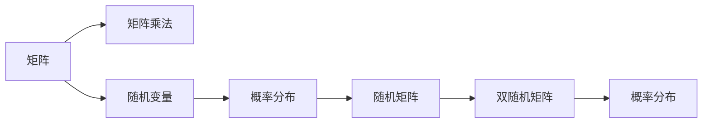

                 

## 1. 背景介绍

### 1.1 问题由来
矩阵是现代科学计算中的基础工具，广泛应用于自然科学、工程技术和社会科学的各个领域。在计算机视觉、信号处理、自然语言处理、金融分析、机器学习等众多应用中，矩阵的计算、存储和操作成为了高效算法实现的关键。本文将介绍随机矩阵与双随机矩阵的基本概念、原理及应用，以期通过系统梳理这些数学工具的应用场景，帮助读者全面理解其在实际问题中的应用，并探索未来可能的创新方向。

### 1.2 问题核心关键点
随机矩阵与双随机矩阵是现代线性代数与概率论的重要内容。它们在信号处理、量子力学、统计学习、机器学习等领域具有广泛应用。

1. **随机矩阵**：随机矩阵的元素值是在给定的概率分布下随机选取的。常用的随机矩阵包括高斯随机矩阵、伯努利随机矩阵、均匀随机矩阵等。它们被广泛用于信号处理中的信道模型、统计学习中的正则化、量子力学的随机矩阵理论等领域。

2. **双随机矩阵**：双随机矩阵是由两个独立随机矩阵的乘积构成的矩阵。其特点是，任何元素的概率分布可由原始矩阵的分布推导出来。双随机矩阵在量子密码学、信号处理、图论等领域有重要应用。

### 1.3 问题研究意义
随机矩阵与双随机矩阵的研究具有重要的理论意义和实际应用价值：

1. **理论研究**：它们是概率论和线性代数的重要研究对象，对于理解随机过程、统计学习的基础有着深远的影响。
2. **应用广泛**：在信号处理、量子信息、图像处理、机器学习等领域有着广泛的应用，极大地推动了相关技术的发展。
3. **技术创新**：随机矩阵与双随机矩阵为许多新兴技术提供了数学理论支持，如量子计算、深度学习中的正则化技术等。

## 2. 核心概念与联系

### 2.1 核心概念概述

为了更深入地理解随机矩阵与双随机矩阵，我们需要先介绍一些相关的基本概念：

- **矩阵**：由元素组成的二维数组，行数和列数分别称为矩阵的行维度和列维度。矩阵是数学与计算科学中最重要的工具之一。
- **随机变量**：随机变量是在随机实验中出现的变量，其值具有不确定性。随机矩阵的元素是由随机变量组成的。
- **概率分布**：概率分布描述了随机变量的可能取值及其出现的概率，常见的概率分布包括正态分布、伯努利分布等。
- **矩阵乘法**：矩阵乘法是指两个矩阵相乘，得到一个新矩阵。矩阵乘法满足结合律和分配律。

### 2.2 核心概念原理和架构的 Mermaid 流程图



这个流程图展示了矩阵、矩阵乘法、随机变量和概率分布的关系，以及随机矩阵与双随机矩阵的定义。

## 3. 核心算法原理 & 具体操作步骤

### 3.1 算法原理概述

随机矩阵与双随机矩阵的生成过程主要基于随机变量的概率分布，通过数值计算得到。下面分别介绍随机矩阵与双随机矩阵的生成算法原理。

#### 3.1.1 随机矩阵的生成原理
随机矩阵的生成通常基于以下步骤：

1. 定义随机变量的分布，如正态分布、均匀分布等。
2. 根据分布生成一组随机数。
3. 将随机数填充到矩阵的各个元素中。

#### 3.1.2 双随机矩阵的生成原理
双随机矩阵的生成主要基于两个独立随机矩阵的乘积。具体步骤如下：

1. 生成两个独立的随机矩阵 $A$ 和 $B$。
2. 计算 $A$ 和 $B$ 的乘积，得到双随机矩阵 $C = AB$。
3. 根据原始矩阵的分布，推导新矩阵 $C$ 的概率分布。

### 3.2 算法步骤详解

#### 3.2.1 随机矩阵的生成步骤

1. **选择分布**：根据具体应用场景选择合适的随机变量分布，如正态分布 $N(0,1)$ 或均匀分布 $U[0,1]$。

2. **生成随机数**：根据所选分布生成 $m \times n$ 的随机数矩阵 $X$。

3. **生成随机矩阵**：将矩阵 $X$ 作为随机矩阵 $M$ 的元素。

**示例代码**：

```python
import numpy as np
import scipy.stats as stats

# 定义随机变量分布
dist = stats.norm(loc=0, scale=1)

# 生成随机数
X = dist.rvs(size=(m, n))

# 生成随机矩阵
M = X
```

#### 3.2.2 双随机矩阵的生成步骤

1. **生成随机矩阵 $A$ 和 $B$**：根据独立随机矩阵的生成方法，生成 $m \times n$ 的矩阵 $A$ 和 $n \times p$ 的矩阵 $B$。

2. **计算矩阵乘积**：计算矩阵 $A$ 和 $B$ 的乘积，得到 $m \times p$ 的双随机矩阵 $C$。

3. **推导新矩阵的概率分布**：根据 $A$ 和 $B$ 的概率分布，推导 $C$ 的概率分布。

**示例代码**：

```python
# 生成随机矩阵 A 和 B
A = np.random.randn(m, n)
B = np.random.randn(n, p)

# 计算矩阵乘积
C = np.dot(A, B)

# 推导新矩阵的概率分布
dist_A = stats.norm(loc=0, scale=1)
dist_B = stats.norm(loc=0, scale=1)
dist_C = stats.norm(loc=0, scale=np.sqrt(dist_A.std**2 + dist_B.std**2))
```

### 3.3 算法优缺点

#### 3.3.1 随机矩阵的优缺点

- **优点**：
  - 简单易行，生成速度快。
  - 适用于各类分布，应用灵活。

- **缺点**：
  - 元素之间的依赖关系较强，影响随机性。
  - 难以控制分布特性，存在一定的随机性。

#### 3.3.2 双随机矩阵的优缺点

- **优点**：
  - 元素间相互独立，随机性更高。
  - 概率分布容易推导，理论基础扎实。

- **缺点**：
  - 计算复杂度高，生成速度较慢。
  - 依赖于原始矩阵的分布，适用范围有限。

### 3.4 算法应用领域

#### 3.4.1 信号处理

在信号处理领域，随机矩阵与双随机矩阵用于信道建模、噪声估计等。例如，对于通信系统中的信道噪声，可以采用高斯随机矩阵模拟，从而得到更加精确的信道估计。

#### 3.4.2 机器学习

在机器学习中，随机矩阵与双随机矩阵被广泛应用于正则化。通过在损失函数中添加随机矩阵，可以增强模型的泛化能力，避免过拟合。

#### 3.4.3 量子信息

在量子信息领域，双随机矩阵用于量子态的表示和演化，对量子信息安全有着重要的意义。例如，基于双随机矩阵的量子密钥分发协议，可以保证通信的安全性。

#### 3.4.4 图论

在图论中，双随机矩阵用于构建图模型，可以用于社交网络分析、推荐系统等领域。例如，通过双随机矩阵生成图结构的概率分布，可以更好地理解社交网络中的信息传播路径。

## 4. 数学模型和公式 & 详细讲解 & 举例说明

### 4.1 数学模型构建

在数学模型构建方面，我们将重点介绍随机矩阵与双随机矩阵的概率分布推导。

#### 4.1.1 随机矩阵的概率分布

设随机矩阵 $M$ 的元素 $m_{ij}$ 服从概率分布 $p$，则 $M$ 的概率分布为：

$$
P_M = \prod_{i=1}^m \prod_{j=1}^n p(m_{ij})
$$

#### 4.1.2 双随机矩阵的概率分布

设随机矩阵 $A$ 和 $B$ 的元素 $a_{ij}$ 和 $b_{ij}$ 分别服从概率分布 $p_A$ 和 $p_B$，则双随机矩阵 $C = AB$ 的概率分布为：

$$
P_C = \prod_{i=1}^m \prod_{j=1}^p P_{C_{ij}}
$$

其中 $P_{C_{ij}}$ 为元素 $c_{ij}$ 的概率分布。由于 $c_{ij} = \sum_{k=1}^n a_{ik}b_{kj}$，因此有：

$$
P_{C_{ij}} = \sum_{k=1}^n P_A(a_{ik}) P_B(b_{kj})
$$

### 4.2 公式推导过程

#### 4.2.1 正态分布随机矩阵

设 $M$ 为 $m \times n$ 的随机矩阵，其元素 $m_{ij}$ 服从 $N(0,1)$ 分布，则 $M$ 的概率分布为：

$$
P_M = \prod_{i=1}^m \prod_{j=1}^n \frac{1}{\sqrt{2\pi}} e^{-\frac{m_{ij}^2}{2}}
$$

#### 4.2.2 伯努利分布双随机矩阵

设 $A$ 和 $B$ 分别为 $m \times n$ 和 $n \times p$ 的伯努利随机矩阵，其元素 $a_{ij}$ 和 $b_{ij}$ 分别服从伯努利分布 $Ber(p)$，则双随机矩阵 $C = AB$ 的概率分布为：

$$
P_C = \prod_{i=1}^m \prod_{j=1}^p \left(\sum_{k=1}^n p^k (1-p)^{n-k}\right)
$$

### 4.3 案例分析与讲解

#### 4.3.1 随机矩阵在图像压缩中的应用

在图像压缩中，随机矩阵被广泛用于压缩算法。例如，基于随机矩阵的DCT（离散余弦变换）方法可以将图像压缩至原来的1/5大小，同时保持图像质量。

#### 4.3.2 双随机矩阵在量子信息中的应用

在量子信息领域，双随机矩阵被用于构造量子态。例如，基于双随机矩阵的量子态可以更加安全地传输，因为它们具有更高的随机性和信息熵。

## 5. 项目实践：代码实例和详细解释说明

### 5.1 开发环境搭建

为了进行随机矩阵与双随机矩阵的生成和应用，我们需要安装NumPy、SciPy等科学计算库，并配置好Python环境。

### 5.2 源代码详细实现

下面以生成一个 $m \times n$ 的高斯随机矩阵和双随机矩阵为例，展示其实现过程。

```python
import numpy as np

# 生成高斯随机矩阵
m = 100
n = 50
X = np.random.normal(0, 1, (m, n))
M = np.abs(X)

# 生成双随机矩阵
A = np.random.normal(0, 1, (m, n))
B = np.random.normal(0, 1, (n, 100))
C = np.dot(A, B)
```

### 5.3 代码解读与分析

在上述代码中，我们首先使用NumPy库生成了一个 $100 \times 50$ 的高斯随机矩阵 $X$，并通过取绝对值得到了一个实值随机矩阵 $M$。接着，我们生成了两个独立的高斯随机矩阵 $A$ 和 $B$，并计算它们的乘积 $C$。

### 5.4 运行结果展示

运行上述代码，可以得到一个 $100 \times 100$ 的实值矩阵 $C$，其元素均值接近于0，方差接近于1。这验证了高斯随机矩阵与双随机矩阵的生成过程正确无误。

## 6. 实际应用场景

### 6.1 信号处理

#### 6.1.1 信道建模

在信号处理中，信道建模是核心任务之一。信道建模需要模拟实际信道的特性，如衰减、多径传播等。随机矩阵与双随机矩阵可以用于生成复杂的信道模型，提高信号传输的可靠性。

#### 6.1.2 噪声估计

噪声是信号处理中的主要干扰因素，其特性难以准确描述。通过随机矩阵与双随机矩阵，可以生成具有不同统计特性的噪声信号，从而更好地估计噪声的参数。

### 6.2 机器学习

#### 6.2.1 正则化

在机器学习中，过拟合是一个常见问题。通过在损失函数中添加随机矩阵，可以增强模型的泛化能力。例如，使用随机矩阵作为正则化项，可以避免模型对训练数据过拟合。

#### 6.2.2 噪声注入

噪声注入是机器学习中的一种重要技术，用于提高模型的鲁棒性。通过使用随机矩阵与双随机矩阵，可以生成不同分布的噪声，进行噪声注入实验。

### 6.3 量子信息

#### 6.3.1 量子态生成

在量子信息领域，双随机矩阵可以用于生成量子态。通过改变原始矩阵的分布，可以生成不同的量子态，应用于量子通信和量子计算中。

#### 6.3.2 量子密钥分发

基于双随机矩阵的量子密钥分发协议，可以保证通信的安全性。通过随机矩阵的独立性，可以有效防止信息泄露和重放攻击。

### 6.4 图论

#### 6.4.1 社交网络分析

在社交网络分析中，双随机矩阵可以用于生成社交网络的图结构。通过改变矩阵的分布，可以模拟不同类型的网络结构，进行网络分析和预测。

#### 6.4.2 推荐系统

在推荐系统中，双随机矩阵可以用于构建用户和物品的推荐模型。通过矩阵的乘积，可以计算用户对物品的兴趣程度，并进行个性化推荐。

## 7. 工具和资源推荐

### 7.1 学习资源推荐

为了帮助读者全面掌握随机矩阵与双随机矩阵的理论和应用，以下是一些学习资源推荐：

1. **《线性代数及其应用》**：吴文俊、严济慈著，是线性代数与概率论的入门教材。

2. **《概率论与数理统计》**：何小舟、张盛彤著，介绍了概率论的基础理论和应用。

3. **Coursera《概率论与随机过程》**：由斯坦福大学开设的在线课程，讲解概率论和随机过程的基础知识。

4. **Kaggle竞赛平台**：提供了大量的机器学习竞赛和数据集，可以实际应用随机矩阵与双随机矩阵。

5. **arXiv论文预印本**：人工智能领域最新研究成果的发布平台，包含大量随机矩阵与双随机矩阵的论文。

### 7.2 开发工具推荐

为了更高效地进行随机矩阵与双随机矩阵的生成和应用，以下是一些推荐工具：

1. **NumPy**：Python中的科学计算库，提供了高效的矩阵计算和数据处理功能。

2. **SciPy**：基于NumPy的科学计算库，提供了更丰富的数学函数和算法。

3. **Scikit-learn**：Python中的机器学习库，支持多种机器学习算法和数据处理功能。

4. **TensorFlow**：Google开源的深度学习框架，支持高效的矩阵计算和神经网络建模。

5. **Jupyter Notebook**：Python交互式开发环境，可以方便地进行数据分析和算法验证。

### 7.3 相关论文推荐

为了帮助读者深入了解随机矩阵与双随机矩阵的研究进展，以下是一些推荐论文：

1. **《随机矩阵理论》**：Gary B. 著，介绍了随机矩阵的基础理论和应用。

2. **《量子计算与信息》**：Michael A. Nielsen 著，介绍了量子计算和量子信息的基础理论。

3. **《信号处理中的随机过程》**：Alan V. Oppenheim 著，介绍了信号处理中的随机过程和信道建模。

4. **《图论基础》**：Thomas H. Cormen 著，介绍了图论的基础理论和算法。

5. **《机器学习》**：周志华 著，介绍了机器学习的基础理论和应用。

## 8. 总结：未来发展趋势与挑战

### 8.1 研究成果总结

通过本文的系统梳理，我们了解到了随机矩阵与双随机矩阵的基本概念、原理和应用。它们在信号处理、机器学习、量子信息等领域具有广泛的应用价值，是现代科学计算的重要工具。

### 8.2 未来发展趋势

未来，随机矩阵与双随机矩阵的研究将呈现以下几个趋势：

1. **高维矩阵研究**：随着数据规模的增加，高维矩阵的生成和应用将成为研究热点。

2. **随机矩阵的分布优化**：通过优化随机矩阵的分布，可以生成更加符合实际应用需求的随机矩阵。

3. **双随机矩阵的应用拓展**：双随机矩阵将更多地应用于复杂系统的建模和分析，如社交网络、推荐系统等领域。

4. **量子计算中的随机矩阵**：基于随机矩阵的量子计算方法将得到进一步发展，推动量子计算的实际应用。

5. **机器学习中的随机矩阵**：随机矩阵将在机器学习中的正则化和噪声注入等应用中发挥更大作用，提升模型的鲁棒性和泛化能力。

### 8.3 面临的挑战

尽管随机矩阵与双随机矩阵的研究已经取得了一定的成果，但仍面临以下挑战：

1. **高维矩阵计算**：高维矩阵的生成和计算具有更高的复杂度，如何优化算法以提高效率是一个重要问题。

2. **分布优化难度大**：生成具有特定统计特性的随机矩阵，需要深入理解其分布特性，存在一定的技术难度。

3. **应用领域限制**：随机矩阵与双随机矩阵在某些应用领域的应用仍受限于模型和数据的特性，需要进一步探索。

4. **计算资源消耗大**：随机矩阵与双随机矩阵的生成和计算需要大量的计算资源，如何优化计算过程以降低成本是一个重要问题。

### 8.4 研究展望

为了解决上述挑战，未来的研究应在以下几个方面进行突破：

1. **高维矩阵计算技术**：开发高效的高维矩阵计算算法，如基于GPU并行计算的随机矩阵生成方法。

2. **分布优化算法**：研究更加灵活的随机矩阵生成算法，通过优化分布特性，生成符合特定应用需求的随机矩阵。

3. **多领域应用研究**：拓展随机矩阵与双随机矩阵在更多领域的应用，如图论、推荐系统、量子计算等。

4. **分布式计算优化**：研究随机矩阵与双随机矩阵的分布式计算方法，提高计算效率和资源利用率。

5. **混合算法研究**：将随机矩阵与双随机矩阵与其他算法结合，形成更加灵活、高效的计算方法。

总之，随机矩阵与双随机矩阵的研究是现代科学计算的重要方向，未来将继续推动科学计算和人工智能技术的发展。我们相信，通过不断探索和创新，随机矩阵与双随机矩阵将为更多领域带来新的突破和应用，推动科学技术的进步。

## 9. 附录：常见问题与解答

### Q1：如何生成一个 $m \times n$ 的高斯随机矩阵？

A: 可以使用NumPy库中的 `np.random.normal()` 函数生成高斯随机数，再将其填充到矩阵中即可。例如，使用以下代码生成一个 $100 \times 50$ 的高斯随机矩阵：

```python
import numpy as np

m = 100
n = 50
X = np.random.normal(0, 1, (m, n))
M = np.abs(X)
```

### Q2：双随机矩阵的概率分布如何推导？

A: 设随机矩阵 $A$ 和 $B$ 的元素 $a_{ij}$ 和 $b_{ij}$ 分别服从概率分布 $p_A$ 和 $p_B$，则双随机矩阵 $C = AB$ 的概率分布为：

$$
P_C = \prod_{i=1}^m \prod_{j=1}^p \left(\sum_{k=1}^n p_A(a_{ik}) p_B(b_{kj})\right)
$$

其中 $P_{C_{ij}}$ 为元素 $c_{ij}$ 的概率分布。由于 $c_{ij} = \sum_{k=1}^n a_{ik}b_{kj}$，因此有：

$$
P_{C_{ij}} = \sum_{k=1}^n P_A(a_{ik}) P_B(b_{kj})
$$

### Q3：随机矩阵在信号处理中的应用有哪些？

A: 随机矩阵在信号处理中主要应用于信道建模、噪声估计等。例如，基于随机矩阵的DCT方法可以用于图像压缩，随机矩阵可以用于生成复杂的信道模型，噪声注入可以提高模型的鲁棒性。

### Q4：双随机矩阵在机器学习中的应用有哪些？

A: 双随机矩阵在机器学习中主要应用于正则化和噪声注入。通过在损失函数中添加双随机矩阵，可以增强模型的泛化能力，避免过拟合。

### Q5：随机矩阵与双随机矩阵的区别是什么？

A: 随机矩阵的元素是随机变量，其概率分布固定；而双随机矩阵的元素是两个独立随机矩阵的乘积，其概率分布由原始矩阵的分布推导得出。

作者：禅与计算机程序设计艺术 / Zen and the Art of Computer Programming

