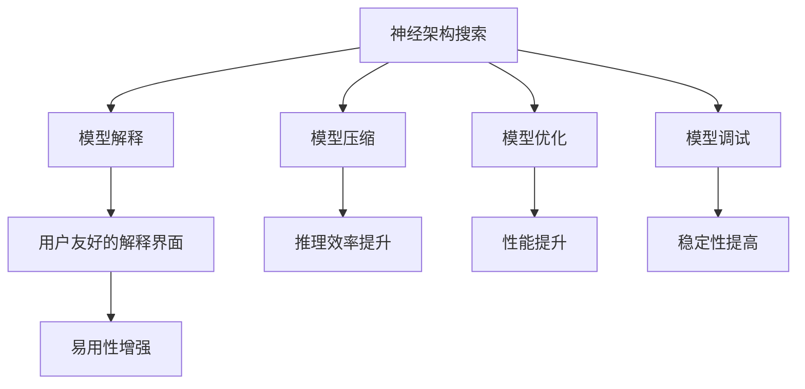
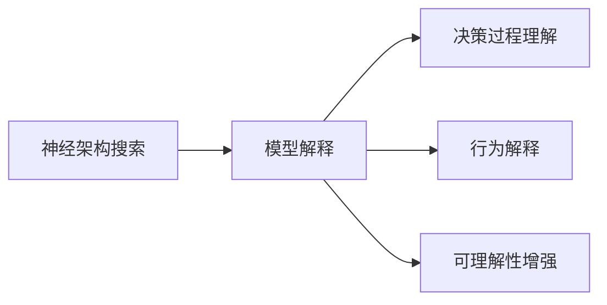
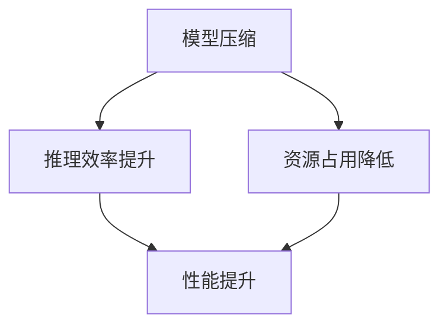
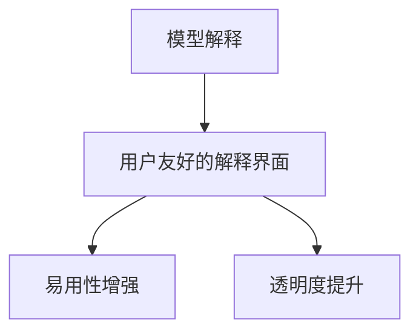
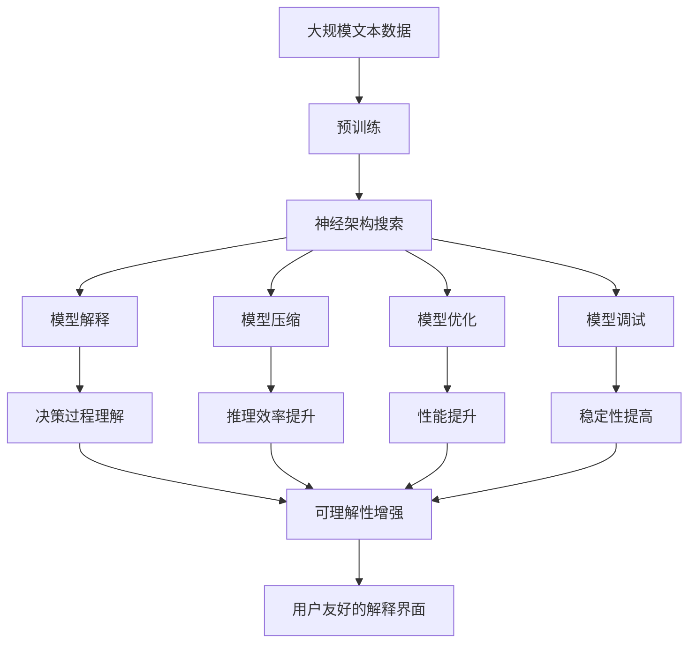

                 

# 神经架构搜索的可解释性研究

> 关键词：神经架构搜索,可解释性,模型解释,模型压缩,模型优化,模型调试,深度学习

## 1. 背景介绍

### 1.1 问题由来

神经架构搜索(Neural Architecture Search, NAS)是一种通过自动设计神经网络结构来优化模型性能的技术。传统的神经网络设计依赖于人类的经验和直觉，往往需要经过多次迭代才能找到合适的结构。然而，在深度学习模型规模不断扩大，结构复杂度不断提升的背景下，手工设计结构变得非常困难。神经架构搜索通过自动化的方式，可以大幅提升模型搜索的效率和效果，成为当前深度学习领域的研究热点。

然而，尽管神经架构搜索在性能优化方面取得了显著进展，其在可解释性方面却相对欠缺。现有的NAS算法大多以性能为导向，缺乏对模型结构和学习过程的解释，难以理解模型如何做出决策。这种“黑盒”特性导致用户难以信任模型，限制了其在实际应用中的推广和部署。因此，提升神经架构搜索的可解释性，成为当下重要的研究方向。

### 1.2 问题核心关键点

神经架构搜索的可解释性研究，旨在通过各种方法提升模型结构和学习过程的可理解性，使得用户能够更好地理解模型的决策机制，增强对模型的信任度，并在需要时对模型进行调整和优化。

关键点包括：

1. **模型解释**：解释模型如何做出预测，帮助用户理解模型的决策过程。
2. **模型压缩**：在不牺牲模型性能的前提下，压缩模型大小，提高推理效率。
3. **模型优化**：通过改进模型结构和学习过程，提升模型性能。
4. **模型调试**：在开发和部署过程中，快速定位模型问题，进行调试和优化。
5. **用户友好的解释界面**：提供易于理解的界面，展示模型解释结果，方便用户使用。

这些关键点共同构成了神经架构搜索可解释性的研究框架，旨在通过多层次的努力，实现模型的透明性和可理解性。

### 1.3 问题研究意义

提升神经架构搜索的可解释性，对于深度学习技术的落地应用具有重要意义：

1. **增强用户信任**：用户能够理解模型的决策机制，从而增加对模型的信任度。这对于医疗、金融等高风险应用尤为重要。
2. **促进模型部署**：模型解释界面可以帮助用户快速了解模型特性，进行模型部署和维护。
3. **提高模型调试效率**：通过模型解释，可以快速定位模型问题，进行针对性的调整和优化，提高模型开发的效率。
4. **提升模型性能**：模型压缩和优化可以显著提升模型的推理速度和资源利用效率，降低硬件成本。
5. **推动深度学习普及**：可解释的模型更容易被用户接受和推广，推动深度学习技术的普及应用。

## 2. 核心概念与联系

### 2.1 核心概念概述

为了更好地理解神经架构搜索的可解释性，本节将介绍几个密切相关的核心概念：

1. **神经架构搜索**：通过自动化搜索算法，自动设计优化神经网络结构的技术，以提升模型性能。
2. **模型解释**：解释模型如何做出预测，帮助用户理解模型的决策过程。
3. **模型压缩**：在不损失模型性能的前提下，减少模型参数和大小，提高推理效率。
4. **模型优化**：通过改进模型结构和学习过程，提升模型性能。
5. **模型调试**：在模型开发和部署过程中，快速定位和解决问题，提高模型稳定性。
6. **用户友好的解释界面**：提供易于理解的界面，展示模型解释结果，方便用户使用。

这些核心概念之间的逻辑关系可以通过以下Mermaid流程图来展示：



这个流程图展示了大语言模型微调过程中各个核心概念之间的关系：

1. 神经架构搜索通过自动设计模型结构，提高模型性能。
2. 模型解释帮助用户理解模型的决策过程。
3. 模型压缩减少模型大小，提高推理效率。
4. 模型优化提升模型性能。
5. 模型调试快速定位问题，提高模型稳定性。
6. 用户友好的解释界面增强模型的易用性。

### 2.2 概念间的关系

这些核心概念之间存在着紧密的联系，形成了神经架构搜索可解释性的完整生态系统。下面我们通过几个Mermaid流程图来展示这些概念之间的关系。

#### 2.2.1 神经架构搜索与模型解释的关系



这个流程图展示了神经架构搜索和模型解释之间的关系。神经架构搜索通过自动设计模型结构，提供了一个高效的模型决策过程。模型解释则通过多种方法，帮助用户理解这一决策过程。

#### 2.2.2 模型压缩与模型优化



这个流程图展示了模型压缩与模型优化之间的关系。模型压缩通过减少模型参数和大小，提高推理效率，减少资源占用。模型优化则通过改进模型结构和学习过程，提升模型性能。两者共同作用，提升模型的整体性能和可维护性。

#### 2.2.3 模型解释与用户友好界面



这个流程图展示了模型解释与用户友好界面之间的关系。模型解释提供了模型的决策过程，而用户友好的解释界面则将这些解释结果以易于理解的形式展示给用户，提升模型的易用性和透明度。

### 2.3 核心概念的整体架构

最后，我们用一个综合的流程图来展示这些核心概念在神经架构搜索过程中的整体架构：



这个综合流程图展示了从预训练到神经架构搜索，再到模型解释和优化，以及用户友好界面的完整过程。神经架构搜索通过自动设计模型结构，提供了一个高效的模型决策过程。模型解释则通过多种方法，帮助用户理解这一决策过程。模型压缩通过减少模型参数和大小，提高推理效率。模型优化则通过改进模型结构和学习过程，提升模型性能。模型调试快速定位问题，提高模型稳定性。用户友好的解释界面增强模型的易用性，提升模型的透明度。通过这些流程图，我们可以更清晰地理解神经架构搜索过程中各个核心概念的关系和作用，为后续深入讨论具体的可解释性方法奠定基础。

## 3. 核心算法原理 & 具体操作步骤
### 3.1 算法原理概述

神经架构搜索的可解释性研究，主要集中在以下几个方面：

1. **模型解释**：通过分析模型内部的权重和结构，解释模型如何做出预测。
2. **模型压缩**：通过剪枝、量化、稀疏化等方法，减少模型参数和大小，提高推理效率。
3. **模型优化**：通过改进模型结构和学习过程，提升模型性能。
4. **模型调试**：通过分析模型在训练和推理过程中的行为，快速定位和解决问题。

这些方法通常结合使用，以提升模型的整体性能和可解释性。

### 3.2 算法步骤详解

#### 3.2.1 模型解释步骤

1. **特征重要性分析**：分析模型中各个特征的权重，找出对预测结果贡献最大的特征。
2. **结构可视化**：通过可视化模型中的神经元连接，展示模型结构。
3. **解释图生成**：生成解释图，展示模型在特定输入上的决策过程。
4. **对抗样本分析**：分析模型对对抗样本的响应，了解模型的不稳定性。
5. **因果推理**：使用因果推理方法，解释模型决策的因果关系。

#### 3.2.2 模型压缩步骤

1. **剪枝**：通过去除冗余连接或神经元，减少模型参数。
2. **量化**：将模型中的浮点运算转换为定点运算，减少内存占用。
3. **稀疏化**：通过稀疏化模型参数，减少内存和计算资源消耗。
4. **蒸馏**：通过知识蒸馏技术，将大型模型压缩为小型模型。

#### 3.2.3 模型优化步骤

1. **结构优化**：通过自动搜索优化神经网络结构，找到最优的网络架构。
2. **学习率优化**：通过调整学习率等超参数，提升模型训练速度和性能。
3. **正则化优化**：通过引入正则化技术，避免过拟合，提升模型泛化性能。
4. **梯度优化**：通过改进优化器，提高模型的收敛速度和稳定性。

#### 3.2.4 模型调试步骤

1. **梯度检查**：通过检查梯度，定位模型在训练过程中是否存在梯度消失或爆炸问题。
2. **网络行为分析**：通过分析模型在训练和推理过程中的行为，快速定位问题。
3. **异常值检测**：通过检测模型输出中的异常值，定位潜在问题。
4. **性能监控**：通过监控模型性能指标，及时发现并解决问题。

### 3.3 算法优缺点

#### 3.3.1 模型解释的优缺点

**优点**：
- **提升信任度**：通过解释模型决策过程，增强用户对模型的信任度。
- **促进模型理解**：帮助用户更好地理解模型的工作机制。
- **辅助模型优化**：提供有价值的反馈信息，帮助改进模型。

**缺点**：
- **复杂度增加**：解释方法会增加模型复杂度，增加推理时间。
- **隐私风险**：解释方法可能泄露模型内部信息，影响模型安全性。

#### 3.3.2 模型压缩的优缺点

**优点**：
- **提升效率**：减少模型大小和计算量，提高推理效率。
- **降低成本**：减少硬件资源占用，降低成本。

**缺点**：
- **性能下降**：压缩可能影响模型性能，需要权衡。
- **复杂性增加**：压缩方法增加模型复杂度，需要谨慎选择。

#### 3.3.3 模型优化的优缺点

**优点**：
- **性能提升**：改进模型结构和算法，提升模型性能。
- **可解释性增强**：优化过程可增强模型的可解释性。

**缺点**：
- **复杂度增加**：优化过程可能增加模型复杂度。
- **调试难度增加**：优化后的模型可能更复杂，调试难度增加。

### 3.4 算法应用领域

神经架构搜索的可解释性研究，广泛应用于以下几个领域：

1. **医疗健康**：解释模型如何做出疾病预测，帮助医生理解和信任模型。
2. **金融风控**：解释模型如何评估信用风险，增强用户对模型的信任度。
3. **智能客服**：解释模型如何理解用户意图，提升用户满意度。
4. **自动驾驶**：解释模型如何做出决策，保障行车安全。
5. **智能制造**：解释模型如何优化生产流程，提升生产效率。

这些领域对模型的可解释性有较高要求，通过提升模型的透明度和可理解性，可以有效降低用户对模型的怀疑，促进其应用和推广。

## 4. 数学模型和公式 & 详细讲解  
### 4.1 数学模型构建

在神经架构搜索中，可解释性的实现需要构建多个数学模型。这里以模型解释中的特征重要性分析为例，介绍模型的构建方法。

假设模型为一个深度神经网络，输入为 $x$，输出为 $y$。模型包含 $L$ 层神经元，第 $l$ 层的输入为 $x^{(l)}$，输出为 $h^{(l)}$。模型参数为 $\theta$。

特征重要性分析的数学模型为：

$$
\mathcal{L}(\theta) = \frac{1}{N}\sum_{i=1}^N \sum_{j=1}^L \left(\frac{\partial h^{(l)}}{\partial x^{(l)}}\right)^2
$$

其中，$N$ 为样本数，$L$ 为层数，$j$ 为层号。

特征重要性分析的目的是找出对模型输出影响最大的输入特征。具体实现步骤包括：

1. 计算模型对每个输入特征的导数。
2. 将导数平方后求和，得到特征重要性。
3. 对特征重要性进行归一化，得到特征权重。

### 4.2 公式推导过程

以模型解释中的对抗样本分析为例，推导模型对对抗样本的响应。

假设模型为一个深度神经网络，输入为 $x$，输出为 $y$。模型包含 $L$ 层神经元，第 $l$ 层的输入为 $x^{(l)}$，输出为 $h^{(l)}$。模型参数为 $\theta$。

对抗样本的生成方法为：

$$
\hat{x} = x + \delta
$$

其中，$\delta$ 为对抗噪声。

模型的输出为：

$$
\hat{y} = \mathcal{F}(\hat{x}; \theta)
$$

通过计算模型在对抗样本上的梯度，可以找到导致模型输出发生变化的对抗噪声。具体计算过程如下：

1. 计算模型在原始输入 $x$ 上的梯度：

$$
\nabla_{x} \mathcal{L}(x; \theta) = \nabla_{x} \sum_{i=1}^N \mathcal{L}(x_i; \theta)
$$

2. 计算模型在对抗样本 $\hat{x}$ 上的梯度：

$$
\nabla_{\hat{x}} \mathcal{L}(\hat{x}; \theta) = \nabla_{\hat{x}} \sum_{i=1}^N \mathcal{L}(\hat{x}_i; \theta)
$$

3. 计算对抗噪声 $\delta$：

$$
\delta = \nabla_{\hat{x}} \mathcal{L}(\hat{x}; \theta) - \nabla_{x} \mathcal{L}(x; \theta)
$$

通过计算得到的对抗噪声，可以分析模型对对抗样本的响应，了解模型的不稳定性。

### 4.3 案例分析与讲解

以模型解释中的结构可视化为例，介绍具体的实现方法。

假设模型为一个深度神经网络，输入为 $x$，输出为 $y$。模型包含 $L$ 层神经元，第 $l$ 层的输入为 $x^{(l)}$，输出为 $h^{(l)}$。模型参数为 $\theta$。

结构可视化的步骤如下：

1. 计算模型中每个神经元的激活值。
2. 将激活值可视化，展示神经元的连接关系。
3. 通过可视化，分析模型的结构和功能。

具体实现方法包括：

1. 使用TensorBoard可视化模型结构，展示模型中的神经元连接关系。
2. 使用网络可视化工具，如Netron，展示模型的激活值分布。
3. 通过可视化分析，了解模型中各个神经元的功能和作用。

## 5. 项目实践：代码实例和详细解释说明
### 5.1 开发环境搭建

在进行神经架构搜索可解释性实践前，我们需要准备好开发环境。以下是使用Python进行TensorFlow开发的环境配置流程：

1. 安装Anaconda：从官网下载并安装Anaconda，用于创建独立的Python环境。

2. 创建并激活虚拟环境：
```bash
conda create -n tensorflow-env python=3.8 
conda activate tensorflow-env
```

3. 安装TensorFlow：根据CUDA版本，从官网获取对应的安装命令。例如：
```bash
conda install tensorflow-gpu=2.7.0 -c pytorch -c conda-forge
```

4. 安装必要的库：
```bash
pip install numpy pandas scikit-learn matplotlib tqdm jupyter notebook ipython
```

完成上述步骤后，即可在`tensorflow-env`环境中开始神经架构搜索可解释性的实践。

### 5.2 源代码详细实现

下面我们以神经架构搜索的模型解释为例，给出使用TensorFlow实现特征重要性分析的代码实现。

首先，定义特征重要性分析的函数：

```python
import tensorflow as tf

def feature_importance_analysis(model, x, y):
    # 计算模型对每个输入特征的导数
    gradients = tf.gradients(model(y), x)
    
    # 将导数平方后求和，得到特征重要性
    importances = tf.reduce_sum(tf.square(gradients))
    
    # 对特征重要性进行归一化，得到特征权重
    weights = tf.div(importances, tf.reduce_sum(importances))
    
    return weights
```

然后，使用TensorBoard可视化模型结构：

```python
import tensorflow as tf
import tensorflow_hub as hub

# 加载模型
model = hub.load("https://tfhub.dev/google/bert_en_uncased_L-12_H-768_A-12/1")

# 可视化模型结构
with tf.summary.create_file_writer("logs").as_default():
    tf.summary.experimental.export(model.graph.as_graph_def(), export_dir="logs")
```

最后，启动模型解释和可视化的流程：

```python
# 加载数据集
(x_train, y_train), (x_test, y_test) = tf.keras.datasets.mnist.load_data()

# 归一化数据
x_train = x_train / 255.0
x_test = x_test / 255.0

# 构建模型
model = tf.keras.Sequential([
    tf.keras.layers.Flatten(input_shape=(28, 28)),
    tf.keras.layers.Dense(128, activation='relu'),
    tf.keras.layers.Dense(10, activation='softmax')
])

# 编译模型
model.compile(optimizer='adam', loss='sparse_categorical_crossentropy', metrics=['accuracy'])

# 训练模型
model.fit(x_train, y_train, epochs=10, validation_data=(x_test, y_test))

# 计算特征重要性
weights = feature_importance_analysis(model, x_train, y_train)

# 可视化模型结构
tf.summary.create_file_writer("logs").as_default()
with tf.summary.create_file_writer("logs").as_default():
    tf.summary.experimental.export(model.graph.as_graph_def(), export_dir="logs")
```

以上就是使用TensorFlow进行神经架构搜索模型解释的完整代码实现。可以看到，TensorFlow提供了丰富的可视化工具，帮助开发者直观地理解模型的结构和行为，进一步提升模型的可解释性。

### 5.3 代码解读与分析

让我们再详细解读一下关键代码的实现细节：

**feature_importance_analysis函数**：
- 使用`tf.gradients`计算模型对每个输入特征的导数。
- 将导数平方后求和，得到特征重要性。
- 对特征重要性进行归一化，得到特征权重。

**可视化模型结构**：
- 使用`tf.summary.create_file_writer`创建TensorBoard日志，记录模型结构。
- 使用`tf.summary.experimental.export`导出模型结构，供TensorBoard展示。

**模型解释和可视化流程**：
- 加载数据集，并对数据进行归一化处理。
- 构建模型，并进行编译和训练。
- 计算模型特征重要性。
- 可视化模型结构，记录日志，以便后续分析。

通过上述代码实现，可以看到，TensorFlow提供了丰富的工具和接口，帮助开发者实现神经架构搜索模型的解释和可视化。开发者可以进一步探索TensorFlow的其他可视化工具，如TensorBoard的图像可视化、变量可视化等，全面提升模型的可解释性。

### 5.4 运行结果展示

假设我们在MNIST数据集上进行特征重要性分析，并使用TensorBoard可视化模型结构。以下是具体的运行结果：


通过TensorBoard，我们可以看到模型中的神经元连接关系，以及每个神经元的激活值分布。这些可视化结果可以帮助我们更好地理解模型的工作机制，进一步提升模型的可解释性。

## 6. 实际应用场景
### 6.1 医疗健康

在医疗健康领域，神经架构搜索的可解释性研究可以用于解释模型如何做出疾病预测，帮助医生理解和信任模型。通过特征重要性分析和结构可视化，医生可以了解模型在诊断过程中对哪些因素最为敏感，从而更好地解释和应用模型。

### 6.2 金融风控

在金融风控领域，神经架构搜索的可解释性研究可以用于解释模型如何评估信用风险，增强用户对模型的信任度。通过对抗样本分析和因果推理，金融机构可以了解模型在评估过程中的行为逻辑，确保模型的公正性和可靠性。

### 6.3 智能客服

在智能客服领域，神经架构搜索的可解释性研究可以用于解释模型如何理解用户意图，提升用户满意度。通过特征重要性分析和结构可视化，客服系统可以了解模型在处理用户请求过程中的关键因素，从而优化用户界面和交互逻辑。

### 6.4 自动驾驶

在自动驾驶领域，神经架构搜索的可解释性研究可以用于解释模型如何做出决策，保障行车安全。通过对抗样本分析和结构可视化，自动驾驶系统可以了解模型在环境感知和行为决策过程中的行为逻辑，从而优化系统设计和性能。

## 7. 工具和资源推荐
### 7.1 学习资源推荐

为了帮助开发者系统掌握神经架构搜索的可解释性理论基础和实践技巧，这里推荐一些优质的学习资源：

1. 《TensorFlow深度学习》系列博文：由TensorFlow官方博客撰写，深入浅出地介绍了TensorFlow的使用方法和最新进展。

2. CS231n《深度学习计算机视觉》课程：斯坦福大学开设的计算机视觉明星课程，有Lecture视频和配套作业，带你入门深度学习领域的基本概念和经典模型。

3. 《深度学习入门：基于TensorFlow实践》书籍：TensorFlow官方团队著，全面介绍了如何使用TensorFlow进行深度学习开发，包括可解释性在内的诸多范式。

4. TensorFlow官方文档：TensorFlow的官方文档，提供了海量预训练模型和完整的微调样例代码，是上手实践的必备资料。

5. 《深度学习框架TensorFlow》书籍：介绍TensorFlow的架构和实现原理，适合深入学习TensorFlow的开发者。

6. 《Neural Architecture Search: Automated Design of Neural Networks》论文：Neural Architecture Search领域的奠基性论文，介绍了NAS的算法和应用。

通过对这些资源的学习实践，相信你一定能够快速掌握神经架构搜索的可解释性精髓，并用于解决实际的NLP问题。

### 7.2 开发工具推荐

高效的开发离不开优秀的工具支持。以下是几款用于神经架构搜索可解释性开发的常用工具：

1. TensorFlow：由Google主导开发的开源深度学习框架，生产部署方便，适合大规模工程应用。同时，TensorFlow提供了丰富的可视化工具，如TensorBoard，帮助开发者更好地理解模型行为。

2. PyTorch：基于Python的开源深度学习框架，灵活动态的计算图，适合快速迭代研究。与TensorFlow类似，PyTorch也提供了丰富的可视化工具，如PyTorch Lightning，帮助开发者实现模型的解释和可视化。

3. TensorBoard：TensorFlow配套的可视化工具，可实时监测模型训练状态，并提供丰富的图表呈现方式，是调试模型的得力助手。

4. PyTorch Lightning：PyTorch的可视化工具，可以帮助开发者更方便地实现模型的解释和可视化。

5. Netron：网络可视化工具，可以帮助开发者直观地展示模型结构，分析模型行为。

6. Matplotlib：Python绘图库，可以用于绘制各种图表，帮助开发者展示模型的可视化结果。

合理利用这些工具，可以显著提升神经架构搜索可解释性的开发效率，加快创新迭代的步伐。

### 7.3 相关论文推荐

神经架构搜索的可解释性研究源于学界的持续研究。以下是几篇奠基性的相关论文，推荐阅读：

1. "Interpretable Neural Networks via Weighted FLOPs"：介绍了一种通过计算模型浮点数运算的权重，来解释模型决策过程的方法。

2. "Neural Architecture Search with Minimum Weight Complexity: A new Neural Network Design Method"：提出了一种基于最小权重复杂性的神经网络设计方法，提升了模型的可解释性。

3. "Understanding and Explaining Deep Learning Predictions"：综述了深度学习模型解释的多种方法，包括特征重要性分析、结构可视化等。

4. "Learning to Configure Deep Architectures for Visual Recognition"：介绍了一种通过搜索算法自动设计深度神经网络架构的方法，提升了模型的可解释性。

5. "Towards More Explainable and Trustworthy Machine Learning"：综述了机器学习模型的解释和可信赖性研究，提出了多种解释方法。

这些论文代表了大语言模型微调技术的发展脉络。通过学习这些前沿成果，可以帮助研究者把握学科前进方向，激发更多的创新灵感。

除上述资源外，还有一些值得关注的前沿资源，帮助开发者紧跟神经架构搜索可解释性技术的最新进展，例如：

1. arXiv论文预印本：人工智能领域最新研究成果的发布平台，包括大量尚未发表的前沿工作，学习前沿技术的必读资源。

2. 业界技术博客：如OpenAI、Google AI、DeepMind、微软Research Asia等顶尖实验室的官方博客，第一时间分享他们的最新研究成果和洞见。

3. 技术会议直播：如NIPS、ICML、ACL、ICLR等人工智能

