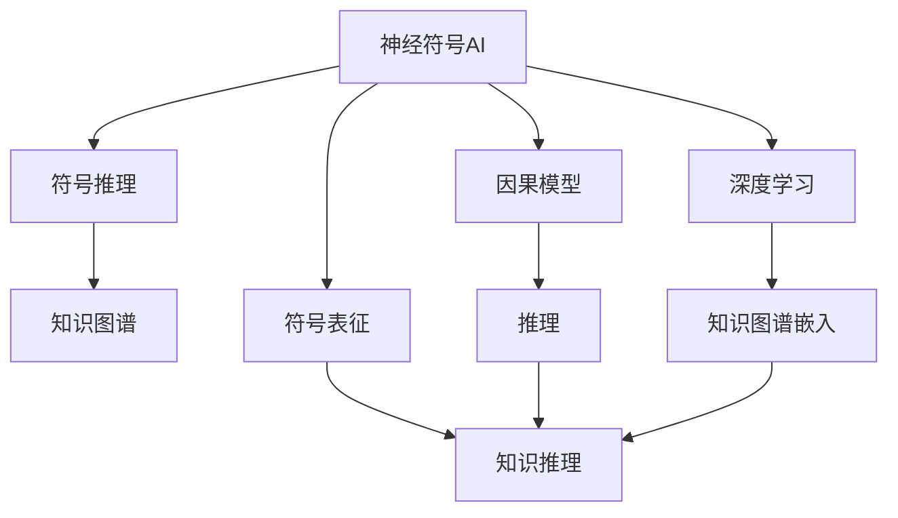
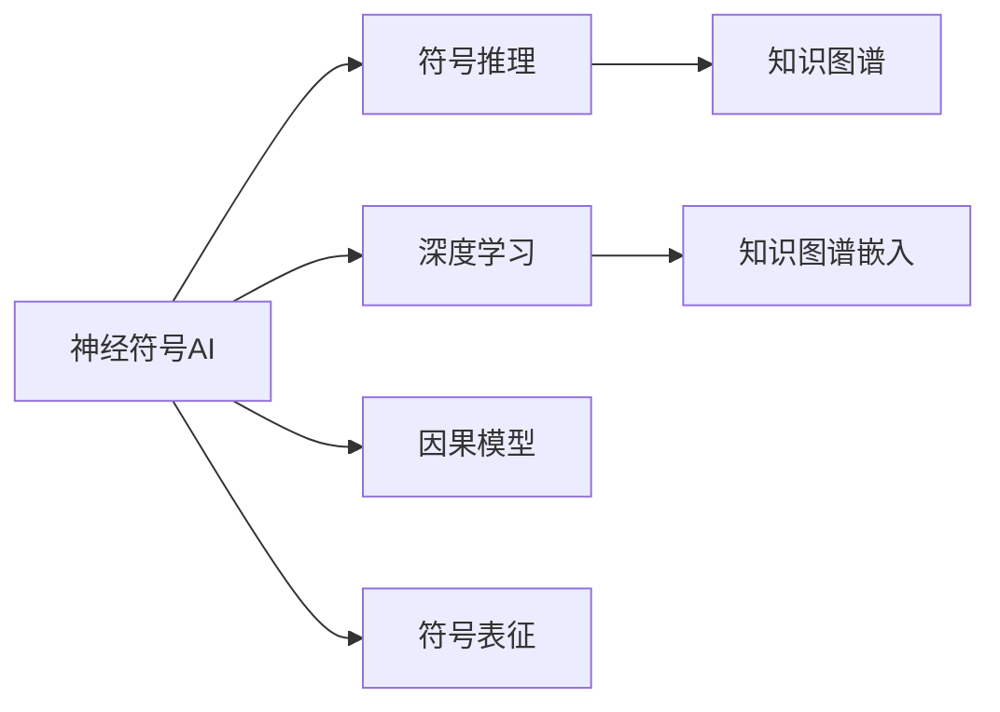
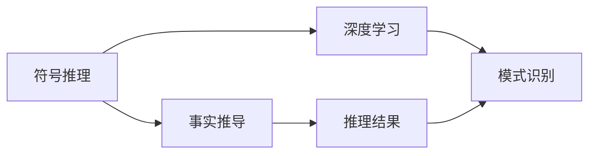
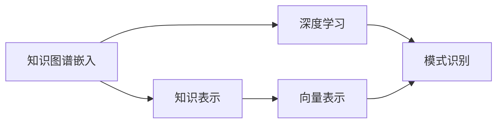
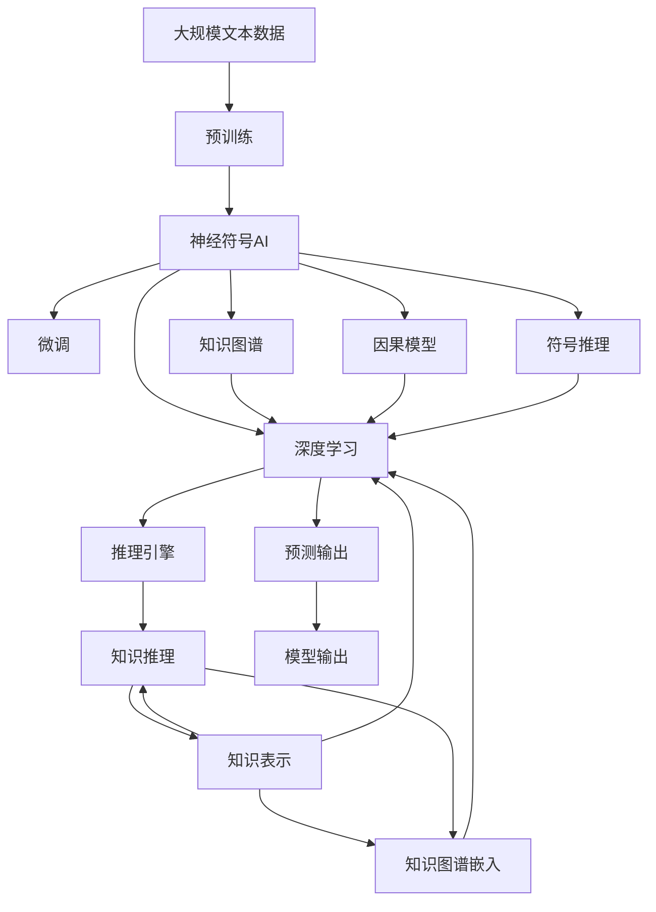

                 

# 神经符号AI:结合符号推理与深度学习

> 关键词：神经符号AI,符号推理,深度学习,知识图谱,知识图谱嵌入,因果模型,符号表征,AI与符号AI融合,符号计算

## 1. 背景介绍

### 1.1 问题由来
近年来，人工智能(AI)技术在诸多领域取得了显著进展，尤其是深度学习(Deep Learning, DL)的迅猛发展，推动了图像识别、语音识别、自然语言处理(Natural Language Processing, NLP)等领域的突破性进展。然而，深度学习模型在处理复杂、高层次的推理任务时仍显不足。这些任务通常需要具备形式化推理、知识表达和因果推理等能力，而这正是符号人工智能(Symbolic AI)的强项。

因此，神经符号AI(Neural Symbolic AI, NeurAx)成为当前AI研究的热点之一。它通过结合符号推理与深度学习的优势，旨在构建既具有高度灵活性，又具备丰富知识表示能力的智能系统。神经符号AI不仅继承了深度学习的强大模式识别能力，还利用符号推理的严谨性和可解释性，对AI技术进行深层次的改造和升级。

### 1.2 问题核心关键点
神经符号AI的核心在于如何整合符号推理与深度学习技术，构建具有逻辑推理和知识表达能力的智能系统。其关键在于：

- 知识表示：如何将复杂知识以结构化、形式化的方式编码，使其易于被机器处理。
- 推理机制：如何设计高效的推理引擎，自动执行逻辑推理和知识推导。
- 知识融合：如何将符号知识与深度学习的模式识别能力相结合，形成综合性智能系统。

这些关键点涉及符号AI、深度学习和神经网络等多个领域的知识，需要综合运用符号逻辑、自然语言处理、计算机视觉等多方面的技术。

### 1.3 问题研究意义
神经符号AI的研究，对于构建更加智能、灵活和可解释的AI系统，具有重要意义：

- 提升复杂推理任务性能：符号推理擅长处理高层次、结构化的任务，能够显著提升复杂推理任务的性能。
- 增强知识表达和重用：符号表征具有可解释性，便于知识的表达和重用，推动知识图谱的构建。
- 促进跨领域知识应用：符号AI能够整合多种领域知识，推动AI技术在更多垂直领域的落地应用。
- 提升AI系统的透明性和可解释性：符号表征和推理机制有助于理解模型的决策过程，提高系统的透明性和可解释性。
- 促进AI技术的普及和应用：神经符号AI结合了深度学习的强大模式识别能力和符号推理的严谨性，能够满足不同场景的需求，推动AI技术的普及应用。

## 2. 核心概念与联系

### 2.1 核心概念概述

为更好地理解神经符号AI的核心概念，本节将介绍几个密切相关的核心概念：

- 神经符号AI（Neural Symbolic AI, NeurAx）：结合符号推理与深度学习技术，构建具有逻辑推理和知识表达能力的智能系统。
- 符号推理（Symbolic Reasoning）：通过符号逻辑系统，自动执行事实推导和逻辑推理，解决知识图谱和规则系统中的推理任务。
- 深度学习（Deep Learning）：通过神经网络模型，学习输入数据中的隐含模式和规律，实现模式识别和预测任务。
- 知识图谱（Knowledge Graph）：以结构化方式表示实体、属性和关系的图数据结构，用于存储和推理大量结构化知识。
- 知识图谱嵌入（Knowledge Graph Embedding）：将知识图谱中的实体和关系映射到低维向量空间，以供机器学习模型处理。
- 因果模型（Causal Model）：用于表示事件之间的因果关系，帮助智能系统在复杂环境下进行合理推断。
- 符号表征（Symbolic Representation）：将实体、属性和关系等知识以符号形式表示，便于机器理解和处理。
- AI与符号AI融合（AI and Symbolic AI Integration）：将符号推理与深度学习技术结合，形成既具备模式识别能力，又具备逻辑推理能力的智能系统。

这些核心概念之间的逻辑关系可以通过以下Mermaid流程图来展示：



这个流程图展示了大语言模型微调过程中各个核心概念之间的关系：

1. 神经符号AI（NeurAx）作为整体系统，结合符号推理与深度学习。
2. 符号推理与深度学习分别执行推理与模式识别任务。
3. 知识图谱和知识图谱嵌入用于存储和表示知识。
4. 因果模型和符号表征用于增强推理能力。

### 2.2 概念间的关系

这些核心概念之间存在着紧密的联系，形成了神经符号AI的整体架构。下面我们通过几个Mermaid流程图来展示这些概念之间的关系。

#### 2.2.1 神经符号AI的核心架构



这个流程图展示了神经符号AI的核心架构：

1. 符号推理与深度学习是神经符号AI的两个主要组件，分别负责推理和模式识别任务。
2. 知识图谱和知识图谱嵌入用于知识表示和存储。
3. 因果模型和符号表征用于增强推理和知识推理能力。

#### 2.2.2 符号推理与深度学习的协同



这个流程图展示了符号推理与深度学习协同工作的方式：

1. 符号推理通过事实推导，生成推理结果。
2. 深度学习模型在推理结果的指导下，进行模式识别和预测。
3. 符号推理与深度学习的结果相互补充，提升系统的整体性能。

#### 2.2.3 知识图谱嵌入与深度学习的结合



这个流程图展示了知识图谱嵌入与深度学习的结合方式：

1. 知识图谱嵌入将知识图谱中的实体和关系映射到向量空间。
2. 深度学习模型在向量表示的指导下，进行模式识别和预测。
3. 知识图谱嵌入与深度学习相互补充，提升系统对知识的理解和处理能力。

#### 2.2.4 因果模型与符号推理的融合


这个流程图展示了因果模型与符号推理的融合方式：

1. 因果模型用于表示事件之间的因果关系。
2. 符号推理在因果关系指导下，生成推理结果。
3. 因果模型与符号推理相互补充，提升系统在复杂环境下的推理能力。

### 2.3 核心概念的整体架构

最后，我们用一个综合的流程图来展示这些核心概念在大语言模型微调过程中的整体架构：



这个综合流程图展示了从预训练到微调，再到推理的完整过程。神经符号AI首先在大规模文本数据上进行预训练，然后通过微调（包括符号推理与深度学习的协同），构建出具备逻辑推理和知识表达能力的智能系统。最终，系统在推理引擎的指导下，生成预测输出。 通过这些流程图，我们可以更清晰地理解神经符号AI的核心概念及其关系，为后续深入讨论具体的微调方法和技术奠定基础。

## 3. 核心算法原理 & 具体操作步骤
### 3.1 算法原理概述

神经符号AI的核心算法原理，是将符号推理与深度学习技术相结合，构建具备逻辑推理和知识表达能力的智能系统。其核心思想是：通过符号逻辑系统，自动执行事实推导和逻辑推理，结合深度学习模型，学习输入数据中的隐含模式和规律，形成具有逻辑推理和知识表达能力的综合性智能系统。

### 3.2 算法步骤详解

神经符号AI的微调过程，一般包括以下几个关键步骤：

**Step 1: 准备符号推理模型和数据集**
- 选择合适的符号推理模型，如Prolog、OWL等，作为推理引擎。
- 准备符号知识库，包括规则、事实和推理关系等，并将其转换为符号推理模型的知识库。
- 准备符号推理任务的训练集和测试集，划分训练集和验证集。

**Step 2: 设计知识图谱**
- 根据任务需求，设计知识图谱，包括实体、属性和关系等。
- 将知识图谱嵌入到向量空间，用于后续深度学习模型的训练。

**Step 3: 构建深度学习模型**
- 设计合适的深度学习模型结构，如卷积神经网络(CNN)、循环神经网络(RNN)、Transformer等。
- 选择合适的损失函数和优化器，如交叉熵损失、Adam等。

**Step 4: 结合符号推理与深度学习**
- 将深度学习模型与符号推理模型结合，形成综合性智能系统。
- 设计符号推理与深度学习的协同机制，如基于注意力机制的符号推理，将符号推理结果作为深度学习模型的输入。

**Step 5: 执行梯度训练**
- 将训练集数据分批次输入符号推理与深度学习模型，前向传播计算损失函数。
- 反向传播计算符号推理与深度学习模型的参数梯度，根据设定的优化算法和学习率更新模型参数。
- 周期性在验证集上评估模型性能，根据性能指标决定是否触发Early Stopping。
- 重复上述步骤直到满足预设的迭代轮数或Early Stopping条件。

**Step 6: 测试和部署**
- 在测试集上评估符号推理与深度学习结合的模型性能，对比微调前后的精度提升。
- 使用微调后的模型对新样本进行推理预测，集成到实际的应用系统中。
- 持续收集新的数据，定期重新微调模型，以适应数据分布的变化。

以上是神经符号AI的微调过程的一般流程。在实际应用中，还需要针对具体任务的特点，对微调过程的各个环节进行优化设计，如改进推理引擎、优化知识图谱设计、搜索最优的超参数组合等，以进一步提升模型性能。

### 3.3 算法优缺点

神经符号AI的微调方法具有以下优点：

1. 强推理能力：结合符号推理与深度学习，使得系统具备强大的逻辑推理能力，能够在复杂环境中进行合理的推断。
2. 高可解释性：符号表征和推理过程具有可解释性，便于理解模型的决策逻辑。
3. 知识复用：符号推理系统能够复用已有的知识库，减少知识构建的难度和成本。
4. 动态更新：符号推理系统能够动态更新知识图谱，保持知识的最新性。

同时，该方法也存在一些局限性：

1. 推理速度慢：符号推理系统需要大量计算，推理速度较慢，限制了实时应用。
2. 知识复杂：符号推理系统需要构建复杂的知识图谱，知识表示和构建难度较大。
3. 数据依赖：符号推理系统依赖于高质量的知识库和推理规则，对于新任务和新数据，需要重新构建知识图谱。
4. 集成难度：符号推理系统与深度学习模型的结合，需要考虑二者的协同机制，集成难度较大。

尽管存在这些局限性，但就目前而言，神经符号AI仍是大语言模型微调的重要方向之一。未来相关研究的重点在于如何进一步降低知识构建的难度，提高推理速度，优化知识图谱设计，以及提高集成效率，以实现更加灵活高效的神经符号AI应用。

### 3.4 算法应用领域

神经符号AI的微调方法在多个领域都得到了广泛应用，覆盖了从自然语言处理到计算机视觉，从医疗到金融等多个垂直领域。

#### 自然语言处理(NLP)
在自然语言处理领域，神经符号AI广泛应用于机器翻译、问答系统、情感分析、文本摘要等任务。结合符号推理与深度学习，能够提升系统的推理能力和知识表达能力，使得系统更加智能和灵活。

#### 计算机视觉(CV)
在计算机视觉领域，神经符号AI结合符号推理与深度学习，应用于图像分类、目标检测、图像分割等任务。通过构建知识图谱，融合多模态信息，能够提升系统的识别精度和鲁棒性。

#### 医疗领域
在医疗领域，神经符号AI结合符号推理与深度学习，应用于疾病诊断、药物研发、电子病历分析等任务。通过知识图谱的构建和融合，能够提升系统的诊断精度和效率，为医疗决策提供科学依据。

#### 金融领域
在金融领域，神经符号AI结合符号推理与深度学习，应用于舆情分析、股票预测、风险评估等任务。通过知识图谱的构建和推理，能够提升系统的预测能力和风险控制能力，保障金融安全。

#### 推荐系统
在推荐系统领域，神经符号AI结合符号推理与深度学习，应用于个性化推荐、商品匹配等任务。通过知识图谱的构建和融合，能够提升系统的推荐精度和用户满意度。

#### 智慧城市
在智慧城市领域，神经符号AI结合符号推理与深度学习，应用于城市事件监测、应急指挥、智能交通等任务。通过知识图谱的构建和推理，能够提升系统的智能化水平，构建更安全、高效的未来城市。

## 4. 数学模型和公式 & 详细讲解

### 4.1 数学模型构建

本节将使用数学语言对神经符号AI的微调过程进行更加严格的刻画。

记符号推理模型为 $R_{\theta}:\mathcal{E} \rightarrow \mathcal{O}$，其中 $\mathcal{E}$ 为符号推理规则，$\mathcal{O}$ 为推理结果。假设神经符号AI的深度学习模型为 $M_{\phi}:\mathcal{X} \rightarrow \mathcal{Y}$，其中 $\mathcal{X}$ 为输入空间，$\mathcal{Y}$ 为输出空间，$\phi$ 为模型参数。

定义符号推理模型 $R_{\theta}$ 在数据样本 $(x,y)$ 上的损失函数为 $\ell(R_{\theta}(x),y)$，则在数据集 $D$ 上的经验风险为：

$$
\mathcal{L}(\theta) = \frac{1}{N} \sum_{i=1}^N \ell(R_{\theta}(x_i),y_i)
$$

其中 $\ell$ 为符号推理模型的损失函数，用于衡量推理结果与真实标签之间的差异。常见的损失函数包括交叉熵损失、均方误差损失等。

定义深度学习模型 $M_{\phi}$ 在输入 $x$ 上的输出为 $\hat{y}=M_{\phi}(x) \in [0,1]$，表示样本属于正类的概率。真实标签 $y \in \{0,1\}$。则二分类交叉熵损失函数定义为：

$$
\ell(M_{\phi}(x),y) = -[y\log \hat{y} + (1-y)\log (1-\hat{y})]
$$

将符号推理结果作为深度学习模型的输入，得到联合损失函数：

$$
\mathcal{L}_{joint}(\theta,\phi) = \mathcal{L}(\theta) + \mathcal{L}(\phi) + \mathcal{L}_{syb}(\theta,\phi)
$$

其中 $\mathcal{L}_{joint}$ 为联合损失函数，$\mathcal{L}_{syb}(\theta,\phi)$ 为符号推理与深度学习的协同损失函数。

### 4.2 公式推导过程

以下我们以二分类任务为例，推导联合损失函数及其梯度的计算公式。

假设符号推理模型 $R_{\theta}$ 在输入 $x$ 上的推理结果为 $y'=R_{\theta}(x) \in \{0,1\}$，表示样本属于正类的概率。真实标签 $y \in \{0,1\}$。则二分类交叉熵损失函数定义为：

$$
\ell(R_{\theta}(x),y) = -[y'\log y' + (1-y')\log (1-y')]
$$

将其代入联合损失函数，得：

$$
\mathcal{L}_{joint}(\theta,\phi) = -\frac{1}{N}\sum_{i=1}^N [y'\log y' + (1-y')\log (1-y')] + \mathcal{L}(\phi)
$$

根据链式法则，联合损失函数对符号推理模型和深度学习模型的参数 $\theta$ 和 $\phi$ 的梯度为：

$$
\frac{\partial \mathcal{L}_{joint}(\theta,\phi)}{\partial \theta} = -\frac{1}{N}\sum_{i=1}^N (\frac{y'}{y'}-\frac{1-y'}{1-y'}) \frac{\partial R_{\theta}(x_i)}{\partial \theta} + \frac{\partial \mathcal{L}(\phi)}{\partial \phi}
$$

其中 $\frac{\partial R_{\theta}(x_i)}{\partial \theta}$ 可进一步递归展开，利用符号推理系统的自动微分技术完成计算。

在得到联合损失函数的梯度后，即可带入符号推理模型和深度学习模型的参数更新公式，完成模型的迭代优化。重复上述过程直至收敛，最终得到适应下游任务的最优模型参数 $\theta^*$ 和 $\phi^*$。

## 5. 项目实践：代码实例和详细解释说明

### 5.1 开发环境搭建

在进行神经符号AI的微调实践前，我们需要准备好开发环境。以下是使用Python进行PyTorch开发的环境配置流程：

1. 安装Anaconda：从官网下载并安装Anaconda，用于创建独立的Python环境。

2. 创建并激活虚拟环境：
```bash
conda create -n pytorch-env python=3.8 
conda activate pytorch-env
```

3. 安装PyTorch：根据CUDA版本，从官网获取对应的安装命令。例如：
```bash
conda install pytorch torchvision torchaudio cudatoolkit=11.1 -c pytorch -c conda-forge
```

4. 安装Transformers库：
```bash
pip install transformers
```

5. 安装各类工具包：
```bash
pip install numpy pandas scikit-learn matplotlib tqdm jupyter notebook ipython
```

完成上述步骤后，即可在`pytorch-env`环境中开始微调实践。

### 5.2 源代码详细实现

这里我们以知识图谱嵌入与深度学习结合的推荐系统为例，给出使用Transformers库对BERT模型进行微调的PyTorch代码实现。

首先，定义推荐系统任务的数据处理函数：

```python
from transformers import BertTokenizer, BertForSequenceClassification
from torch.utils.data import Dataset
import torch

class RecommendationDataset(Dataset):
    def __init__(self, items, tags, tokenizer, max_len=128):
        self.items = items
        self.tags = tags
        self.tokenizer = tokenizer
        self.max_len = max_len
        
    def __len__(self):
        return len(self.items)
    
    def __getitem__(self, item):
        item_id = self.items[item]
        tag = self.tags[item]
        
        encoding = self.tokenizer(item_id, return_tensors='pt', max_length=self.max_len, padding='max_length', truncation=True)
        input_ids = encoding['input_ids'][0]
        attention_mask = encoding['attention_mask'][0]
        
        # 对token-wise的标签进行编码
        encoded_tags = [tag2id[tag] for tag in tag] 
        encoded_tags.extend([tag2id['O']] * (self.max_len - len(encoded_tags)))
        labels = torch.tensor(encoded_tags, dtype=torch.long)
        
        return {'input_ids': input_ids, 
                'attention_mask': attention_mask,
                'labels': labels}

# 标签与id的映射
tag2id = {'O': 0, 'positive': 1, 'negative': 2}
id2tag = {v: k for k, v in tag2id.items()}

# 创建dataset
tokenizer = BertTokenizer.from_pretrained('bert-base-cased')

train_dataset = RecommendationDataset(train_items, train_tags, tokenizer)
dev_dataset = RecommendationDataset(dev_items, dev_tags, tokenizer)
test_dataset = RecommendationDataset(test_items, test_tags, tokenizer)
```

然后，定义模型和优化器：

```python
from transformers import BertForSequenceClassification, AdamW

model = BertForSequenceClassification.from_pretrained('bert-base-cased', num_labels=len(tag2id))

optimizer = AdamW(model.parameters(), lr=2e-5)
```

接着，定义训练和评估函数：

```python
from torch.utils.data import DataLoader
from tqdm import tqdm
from sklearn.metrics import classification_report

device = torch.device('cuda') if torch.cuda.is_available() else torch.device('cpu')
model.to(device)

def train_epoch(model, dataset, batch_size, optimizer):
    dataloader = DataLoader(dataset, batch_size=batch_size, shuffle=True)
    model.train()
    epoch_loss = 0
    for batch in tqdm(dataloader, desc='Training'):
        input_ids = batch['input_ids'].to(device)
        attention_mask = batch['attention_mask'].to(device)
        labels = batch['labels'].to(device)
        model.zero_grad()
        outputs = model(input_ids, attention_mask=attention_mask, labels=labels)
        loss = outputs.loss
        epoch_loss += loss.item()
        loss.backward()
        optimizer.step()
    return epoch_loss / len(dataloader)

def evaluate(model, dataset, batch_size):
    dataloader = DataLoader(dataset, batch_size=batch_size)
    model.eval()
    preds, labels = [], []
    with torch.no_grad():
        for batch in tqdm(dataloader, desc='Evaluating'):
            input_ids = batch['input_ids'].to(device)
            attention_mask = batch['attention_mask'].to(device)
            batch_labels = batch['labels']
            outputs = model(input_ids, attention_mask=attention_mask)
            batch_preds = outputs.logits.argmax(dim=2).to('cpu').tolist()
            batch_labels = batch_labels.to('cpu').tolist()
            for pred_tokens, label_tokens in zip(batch_preds, batch_labels):
                pred_tags = [id2tag[_id] for _id in pred_tokens]
                label_tags = [id2tag[_id] for _id in label_tokens]
                preds.append(pred_tags[:len(label_tokens)])
                labels.append(label_tags)
                
    print(classification_report(labels, preds))
```

最后，启动训练流程并在测试集上评估：

```python
epochs = 5
batch_size = 16

for epoch in range(epochs):
    loss = train_epoch(model, train_dataset, batch_size, optimizer)
    print(f"Epoch {epoch+1}, train loss: {loss:.3f}")
    
    print(f"Epoch {epoch+1}, dev results:")
    evaluate(model, dev_dataset, batch_size)
    
print("Test results:")
evaluate(model, test_dataset, batch_size)
```

以上就是使用PyTorch对BERT模型进行推荐系统任务微调的完整代码实现。可以看到，得益于Transformers库的强大封装，我们可以用相对简洁的代码完成BERT模型的加载和微调。

### 5.3 代码解读与分析

让我们再详细解读一下关键代码的实现细节：

**RecommendationDataset类**：
- `__init__`方法：初始化训练集、测试集、标签、分词器等关键组件。
- `__len__`方法：返回数据集的样本数量。
- `__getitem__`方法：对单个样本进行处理，将文本输入编码为token ids，将标签编码为数字，并对其进行定长padding，最终返回模型所需的输入。

**tag2id和id2tag字典**：
- 定义了标签与数字id之间的映射关系，用于将token-wise的预测结果解码回真实的标签。

**训练和评估函数**：
- 使用PyTorch的DataLoader对数据集进行批次化加载，供模型训练和推理使用。
- 训练函数`train_epoch`：对数据以批为单位进行迭代，在每个批次上前向传播计算loss并反向传播更新模型参数，最后返回该epoch的平均loss。
- 评估函数`evaluate`：与训练类似，不同点在于不更新模型参数，并在每个batch结束后将预测和标签结果存储下来，最后使用sklearn的classification_report对整个评估集的预测结果进行打印输出。

**训练流程**：
- 定义总的epoch数和batch size，开始循环迭代
- 每个epoch内，先在训练集上训练，输出平均loss
- 在验证集上评估，输出分类指标
- 所有epoch结束后，在测试集上评估

