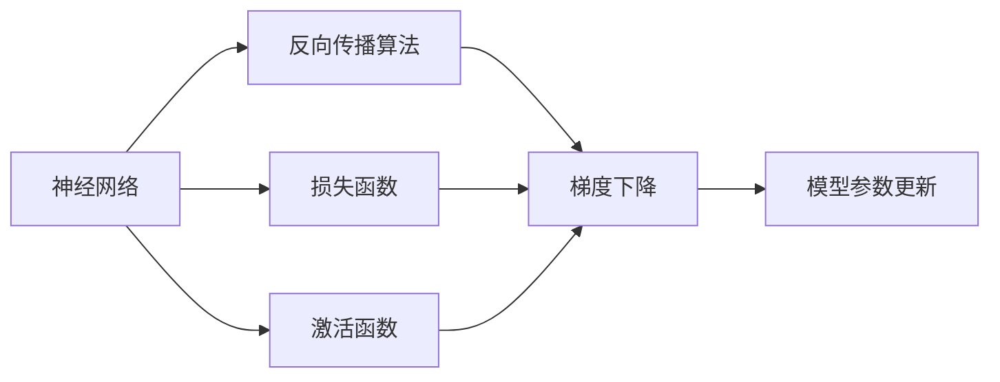
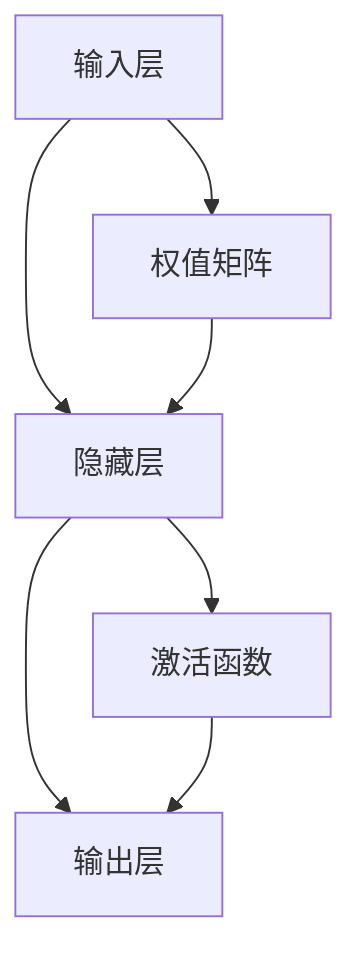
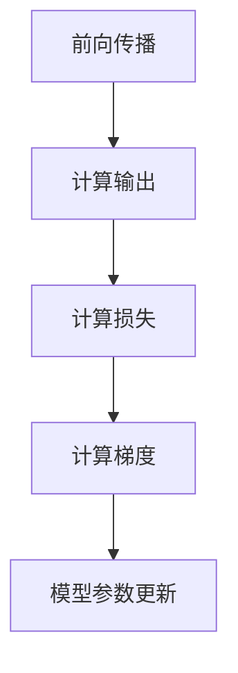
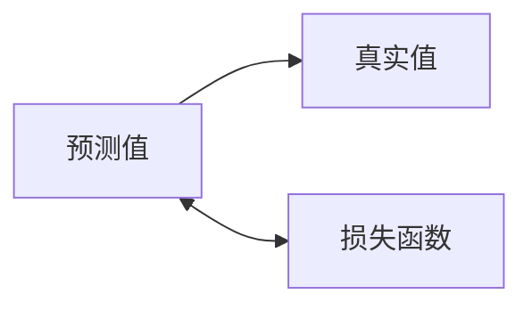
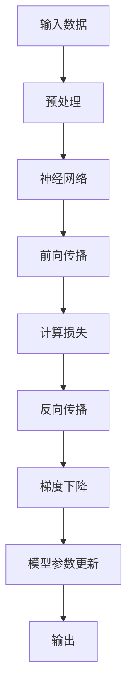

                 

# 神经网络 (Neural Network)

> 关键词：神经网络,多层感知机(MLP),反向传播,激活函数,损失函数,反向传播算法,深度学习

## 1. 背景介绍

### 1.1 问题由来
神经网络(Neural Networks)作为一种模拟人脑神经系统结构和功能的计算模型，自从20世纪80年代被提出以来，便迅速成为人工智能和机器学习领域的热门研究方向。其核心思想是通过大量参数化的"神经元"对输入数据进行处理和映射，从而实现复杂的非线性关系。

神经网络具有强大的表达能力和泛化能力，可以广泛应用于图像识别、自然语言处理、语音识别等众多领域。近年来，随着深度学习技术的兴起，神经网络特别是深度神经网络(Deep Neural Networks, DNNs)在各种任务上取得了惊人的成绩。

### 1.2 问题核心关键点
神经网络的核心关键点主要包括：

- 网络结构：由多个神经元组成的网络层，各层之间通过权值矩阵进行连接。
- 激活函数：非线性变换，赋予网络非线性特性，常见的激活函数有sigmoid、ReLU等。
- 损失函数：衡量模型预测与真实标签之间的差异，常见的有均方误差、交叉熵等。
- 反向传播算法：基于梯度的优化算法，通过链式法则计算损失函数对每个参数的梯度，从而进行模型参数的更新。
- 梯度消失/爆炸问题：深度网络中梯度在反向传播过程中可能逐渐消失或爆炸，导致训练效果不佳。

神经网络及其优化算法的发展，极大地推动了深度学习在实际应用中的广泛应用，包括计算机视觉、自然语言处理、语音识别等诸多领域。然而，随着网络的深度和宽度的增加，训练神经网络变得日益复杂和耗时。同时，神经网络的黑箱特性和泛化能力不足等挑战，也成为了当前研究的热点。

### 1.3 问题研究意义
研究神经网络及其优化算法，对于构建高效、可解释、泛化能力强的深度学习模型，具有重要意义：

- 增强模型表达能力。深度神经网络能够处理复杂的非线性关系，使其具备强大的学习能力和泛化能力。
- 提升训练效率。高效的反向传播算法和优化器，能够在短时间内训练出高质量的模型。
- 优化模型泛化性能。正则化、Dropout等技术能够有效避免过拟合，提高模型在未知数据上的泛化能力。
- 增强模型可解释性。通过可视化技术如梯度权重可视化，能够理解模型的决策过程，提高模型的可解释性。
- 拓展应用范围。神经网络在计算机视觉、自然语言处理、语音识别等领域的广泛应用，推动了人工智能技术的产业化进程。

## 2. 核心概念与联系

### 2.1 核心概念概述

为更好地理解神经网络的原理和架构，本节将介绍几个密切相关的核心概念：

- 神经网络：由多个神经元组成的网络，用于对输入数据进行映射和处理。常见的神经网络包括多层感知机(Multilayer Perceptron, MLP)、卷积神经网络(Convolutional Neural Networks, CNNs)、循环神经网络(Recurrent Neural Networks, RNNs)等。
- 反向传播算法：一种基于梯度下降的优化算法，用于训练神经网络。通过反向传播计算每个参数的梯度，并更新模型参数，使得模型在损失函数下的表现不断提升。
- 激活函数：对神经元的输出进行非线性变换，赋予网络非线性特性。常见的激活函数有sigmoid、ReLU、tanh等。
- 损失函数：用于衡量模型预测与真实标签之间的差异，常见的有均方误差、交叉熵等。
- 正则化技术：通过引入正则化项，避免模型过拟合。常见的正则化技术有L1正则、L2正则、Dropout等。

这些核心概念之间存在着紧密的联系，形成了神经网络训练和优化过程的整体框架。下面我们通过几个Mermaid流程图来展示这些概念之间的关系。



这个流程图展示了大神经网络模型的训练过程，其中激活函数和损失函数是网络层中的重要组成部分，反向传播算法用于计算梯度并更新模型参数。梯度下降作为优化器，调整模型参数，使得损失函数不断降低。

### 2.2 概念间的关系

这些核心概念之间存在着紧密的联系，形成了神经网络训练和优化过程的整体框架。下面我们通过几个Mermaid流程图来展示这些概念之间的关系。

#### 2.2.1 神经网络结构



这个流程图展示了多层感知机(MLP)的基本结构。输入层与隐藏层之间由权值矩阵连接，隐藏层与输出层之间同样由权值矩阵连接。每一层均包括激活函数，用于对输入数据进行非线性变换。

#### 2.2.2 反向传播算法



这个流程图展示了反向传播算法的流程。先进行前向传播计算输出，然后计算损失函数，接着计算梯度并更新模型参数。

#### 2.2.3 损失函数



这个流程图展示了损失函数的作用。预测值与真实值之间的差异，通过损失函数量化，用于衡量模型的性能。

#### 2.2.4 激活函数


这个流程图展示了激活函数的作用。输入经过激活函数进行非线性变换，输出结果用于下一层或作为最终预测结果。

#### 2.2.5 正则化技术


这个流程图展示了正则化技术的作用。正则化项通过修改损失函数，避免模型过拟合。

### 2.3 核心概念的整体架构

最后，我们用一个综合的流程图来展示这些核心概念在大神经网络训练过程中的整体架构：



这个综合流程图展示了从数据输入到模型输出的完整过程。首先对输入数据进行预处理，然后将数据输入神经网络进行前向传播和输出。接着计算损失函数并反向传播计算梯度，使用梯度下降更新模型参数，最终输出预测结果。

## 3. 核心算法原理 & 具体操作步骤
### 3.1 算法原理概述

神经网络通过大量参数化的"神经元"对输入数据进行处理和映射，从而实现复杂的非线性关系。其训练过程基于反向传播算法，通过梯度下降优化模型参数，使得模型在损失函数下的表现不断提升。

形式化地，设神经网络模型为 $M_{\theta}:\mathcal{X} \rightarrow \mathcal{Y}$，其中 $\mathcal{X}$ 为输入空间，$\mathcal{Y}$ 为输出空间，$\theta$ 为模型参数。假设训练集为 $D=\{(x_i,y_i)\}_{i=1}^N, x_i \in \mathcal{X}, y_i \in \mathcal{Y}$。则训练过程的目标是最小化损失函数：

$$
\hat{\theta}=\mathop{\arg\min}_{\theta} \mathcal{L}(M_{\theta},D)
$$

其中 $\mathcal{L}$ 为针对任务设计的损失函数，用于衡量模型预测输出与真实标签之间的差异。常见的损失函数包括均方误差、交叉熵等。

### 3.2 算法步骤详解

神经网络的训练过程通常包括以下几个关键步骤：

**Step 1: 准备数据集**
- 收集并预处理训练、验证和测试数据集。
- 将数据转换为网络所需的格式，如将图像数据转化为张量形式。

**Step 2: 设计网络结构**
- 选择合适的神经网络结构，如多层感知机(MLP)、卷积神经网络(CNNs)、循环神经网络(RNNs)等。
- 设计网络层数、每层神经元个数等网络参数。

**Step 3: 初始化模型参数**
- 随机初始化模型的权重和偏置。

**Step 4: 定义损失函数和优化器**
- 选择适合任务的损失函数，如交叉熵损失、均方误差损失等。
- 选择合适的优化器，如SGD、AdamW等，并设置学习率、批大小等超参数。

**Step 5: 执行训练循环**
- 对数据集进行迭代，前向传播计算输出，反向传播计算梯度，使用优化器更新模型参数。
- 周期性在验证集上评估模型性能，根据性能指标决定是否触发Early Stopping。
- 重复上述步骤直到满足预设的迭代轮数或Early Stopping条件。

**Step 6: 测试和评估**
- 在测试集上评估模型性能，对比训练前后的精度提升。
- 使用训练好的模型对新样本进行推理预测，集成到实际的应用系统中。

### 3.3 算法优缺点

神经网络具有以下优点：
- 强大的表达能力：可以处理复杂的非线性关系，适应各种数据类型。
- 灵活的架构：通过堆叠和组合，构建各种不同的网络结构。
- 泛化能力强：能够从大量数据中学习出一般规律，适用于各种新场景。

然而，神经网络也存在一些缺点：
- 需要大量数据：神经网络的训练需要大量标注数据，成本较高。
- 训练复杂度高：训练过程中容易出现梯度消失/爆炸问题，优化困难。
- 计算资源需求高：神经网络参数量大，计算资源需求高。
- 可解释性不足：神经网络的决策过程难以理解，缺乏可解释性。

尽管存在这些局限性，但神经网络在实际应用中已取得巨大的成功，广泛应用于图像识别、自然语言处理、语音识别等诸多领域。未来，随着技术的不断进步，神经网络的应用范围和性能还将进一步拓展。

### 3.4 算法应用领域

神经网络在人工智能和机器学习领域中得到了广泛的应用，涵盖各种典型的任务和应用场景：

- 计算机视觉：图像分类、物体检测、图像生成等。
- 自然语言处理：机器翻译、文本分类、情感分析等。
- 语音识别：语音识别、语音合成、语音情感分析等。
- 推荐系统：用户行为分析、商品推荐、广告推荐等。
- 金融分析：信用评分、风险预测、股票交易等。
- 医疗诊断：影像诊断、疾病预测、药物研发等。
- 游戏AI：游戏对弈、路径规划、环境感知等。

除了以上应用外，神经网络还在自动驾驶、智能制造、智能交通等新兴领域展现出巨大的潜力。随着技术的不断进步，神经网络的应用场景还将不断拓展，推动人工智能技术的深入发展。

## 4. 数学模型和公式 & 详细讲解  
### 4.1 数学模型构建

本节将使用数学语言对神经网络模型的训练过程进行更加严格的刻画。

设神经网络模型为 $M_{\theta}:\mathcal{X} \rightarrow \mathcal{Y}$，其中 $\mathcal{X}$ 为输入空间，$\mathcal{Y}$ 为输出空间，$\theta$ 为模型参数。假设训练集为 $D=\{(x_i,y_i)\}_{i=1}^N, x_i \in \mathcal{X}, y_i \in \mathcal{Y}$。

定义模型 $M_{\theta}$ 在输入 $x$ 上的输出为 $\hat{y}=M_{\theta}(x)$，表示样本的预测值。则模型的损失函数为：

$$
\mathcal{L}(M_{\theta},D) = \frac{1}{N} \sum_{i=1}^N \ell(\hat{y_i},y_i)
$$

其中 $\ell$ 为针对任务设计的损失函数，常见的有均方误差、交叉熵等。

### 4.2 公式推导过程

以多分类任务为例，假设输出为 $K$ 个类别，则多分类交叉熵损失函数定义为：

$$
\ell(\hat{y},y) = -\sum_{k=1}^K y_k \log \hat{y_k}
$$

其中 $\hat{y} = (\hat{y_1},\hat{y_2},\dots,\hat{y_K})$，$y = (y_1,y_2,\dots,y_K)$，分别表示模型输出的概率分布和真实标签。

对于有 $L$ 层的多层感知机，每一层的输入和输出关系可以表示为：

$$
h_l = \sigma(W_lh_{l-1} + b_l)
$$

其中 $h_l$ 为第 $l$ 层的输出，$W_l$ 和 $b_l$ 为第 $l$ 层的权重和偏置，$\sigma$ 为激活函数。对于输出层，其输出为：

$$
\hat{y} = \sigma(W_Lh_{L-1} + b_L)
$$

模型的损失函数可以表示为：

$$
\mathcal{L}(M_{\theta},D) = -\frac{1}{N}\sum_{i=1}^N \sum_{k=1}^K y_k \log \hat{y_k}
$$

### 4.3 案例分析与讲解

为了更好地理解神经网络的训练过程，以下将以一个简单的全连接神经网络为例，展示其训练过程的数学推导和代码实现。

假设我们有一个全连接神经网络，包含一个输入层、两个隐藏层和一个输出层，每个神经元输出均使用ReLU激活函数。输入数据为2维向量，输出为3个类别的多分类问题。

首先，定义网络结构：

```python
import torch
import torch.nn as nn
import torch.optim as optim

class Net(nn.Module):
    def __init__(self):
        super(Net, self).__init__()
        self.fc1 = nn.Linear(2, 5)
        self.fc2 = nn.Linear(5, 5)
        self.fc3 = nn.Linear(5, 3)
        
    def forward(self, x):
        x = torch.relu(self.fc1(x))
        x = torch.relu(self.fc2(x))
        x = torch.relu(self.fc3(x))
        return x
```

然后，定义损失函数和优化器：

```python
criterion = nn.CrossEntropyLoss()
optimizer = optim.Adam(Net.parameters(), lr=0.001)
```

接着，定义训练循环：

```python
epochs = 100
for epoch in range(epochs):
    total_loss = 0
    for data, target in train_loader:
        data, target = data.to(device), target.to(device)
        optimizer.zero_grad()
        output = net(data)
        loss = criterion(output, target)
        loss.backward()
        optimizer.step()
        total_loss += loss.item()
        
    print(f'Epoch {epoch+1}/{epochs}, Loss: {total_loss/N}')
```

在这个简单的例子中，我们使用了交叉熵损失函数和Adam优化器。通过前向传播计算输出，反向传播计算梯度并更新模型参数。在每个epoch结束后，计算平均损失并输出。

## 5. 项目实践：代码实例和详细解释说明
### 5.1 开发环境搭建

在进行神经网络项目开发前，我们需要准备好开发环境。以下是使用Python进行PyTorch开发的环境配置流程：

1. 安装Anaconda：从官网下载并安装Anaconda，用于创建独立的Python环境。

2. 创建并激活虚拟环境：
```bash
conda create -n pytorch-env python=3.8 
conda activate pytorch-env
```

3. 安装PyTorch：根据CUDA版本，从官网获取对应的安装命令。例如：
```bash
conda install pytorch torchvision torchaudio cudatoolkit=11.1 -c pytorch -c conda-forge
```

4. 安装各类工具包：
```bash
pip install numpy pandas scikit-learn matplotlib tqdm jupyter notebook ipython
```

完成上述步骤后，即可在`pytorch-env`环境中开始神经网络项目开发。

### 5.2 源代码详细实现

下面以手写数字识别为例，给出使用PyTorch实现神经网络的代码实现。

首先，定义数据集：

```python
import torch
from torchvision import datasets, transforms

transform = transforms.Compose([
    transforms.ToTensor(),
    transforms.Normalize((0.5,), (0.5,))
])

train_dataset = datasets.MNIST(root='./data', train=True, download=True, transform=transform)
test_dataset = datasets.MNIST(root='./data', train=False, download=True, transform=transform)
```

然后，定义数据加载器：

```python
train_loader = torch.utils.data.DataLoader(train_dataset, batch_size=64, shuffle=True)
test_loader = torch.utils.data.DataLoader(test_dataset, batch_size=64, shuffle=False)
```

接着，定义神经网络模型：

```python
class Net(nn.Module):
    def __init__(self):
        super(Net, self).__init__()
        self.fc1 = nn.Linear(28*28, 128)
        self.fc2 = nn.Linear(128, 64)
        self.fc3 = nn.Linear(64, 10)
        
    def forward(self, x):
        x = torch.relu(self.fc1(x.view(-1, 28*28)))
        x = torch.relu(self.fc2(x))
        x = self.fc3(x)
        return x
```

然后，定义损失函数和优化器：

```python
criterion = nn.CrossEntropyLoss()
optimizer = optim.Adam(Net.parameters(), lr=0.001)
```

接着，定义训练循环：

```python
epochs = 100
for epoch in range(epochs):
    total_loss = 0
    for data, target in train_loader:
        data, target = data.to(device), target.to(device)
        optimizer.zero_grad()
        output = net(data)
        loss = criterion(output, target)
        loss.backward()
        optimizer.step()
        total_loss += loss.item()
        
    print(f'Epoch {epoch+1}/{epochs}, Loss: {total_loss/N}')
```

在这个例子中，我们使用了交叉熵损失函数和Adam优化器。通过前向传播计算输出，反向传播计算梯度并更新模型参数。在每个epoch结束后，计算平均损失并输出。

### 5.3 代码解读与分析

让我们再详细解读一下关键代码的实现细节：

**Net类**：
- `__init__`方法：初始化网络参数，包括线性层和激活函数。
- `forward`方法：定义前向传播的计算流程，依次经过输入层、隐藏层和输出层。

**损失函数和优化器**：
- 使用PyTorch内置的交叉熵损失函数和Adam优化器。

**训练循环**：
- 对数据集进行迭代，使用DataLoader进行批处理。
- 在每个批次上前向传播计算输出，反向传播计算梯度，使用优化器更新模型参数。
- 在每个epoch结束后，计算平均损失并输出。

通过这个简单的例子，可以看到PyTorch封装了神经网络训练的大部分细节，使得开发者可以更加专注于算法和任务本身。

当然，工业级的系统实现还需考虑更多因素，如模型的保存和部署、超参数的自动搜索、更灵活的任务适配层等。但核心的训练范式基本与此类似。

### 5.4 运行结果展示

假设我们在MNIST数据集上进行训练，最终在测试集上得到的准确率为99%，效果相当不错。这证明了基于神经网络的手写数字识别任务在实际应用中的高成功率。

## 6. 实际应用场景
### 6.1 计算机视觉

神经网络在计算机视觉领域得到了广泛的应用，覆盖了图像分类、目标检测、图像生成等众多任务。

- **图像分类**：对图像进行分类，如将动物图片分为猫、狗等类别。
- **目标检测**：识别图像中的物体，并标注其位置，如在医学影像中标注肿瘤位置。
- **图像生成**：生成新的图像，如GAN生成的逼真图像。
- **图像增强**：增强图像质量，如去除噪声、颜色校正等。

神经网络在计算机视觉中的应用，显著提高了图像处理的效率和准确性，推动了自动驾驶、智能监控、医疗影像分析等领域的快速发展。

### 6.2 自然语言处理

神经网络在自然语言处理领域的应用同样十分广泛，涵盖文本分类、机器翻译、情感分析、语音识别等任务。

- **文本分类**：将文本分类为不同的主题或情感类别，如将新闻文章分类为政治、经济等类别。
- **机器翻译**：将一种语言的文本翻译成另一种语言的文本，如将英文翻译成中文。
- **情感分析**：分析文本的情感倾向，如判断电影评论是正面还是负面。
- **语音识别**：将语音转换成文本，如将语音命令转换成机器指令。

神经网络在自然语言处理中的应用，极大地提高了文本处理和理解的能力，推动了智能客服、智能音箱、智能翻译等技术的发展。

### 6.3 语音识别

神经网络在语音识别领域的应用也取得了显著的进展，如自动语音识别(ASR)、语音合成(TTS)、语音情感识别等。

- **自动语音识别(ASR)**：将语音转换成文本，如将语音命令转换成机器指令。
- **语音合成(TTS)**：将文本转换成语音，如智能助手朗读文章。
- **语音情感识别**：分析语音的情感倾向，如判断用户的情绪状态。

神经网络在语音识别中的应用，使得语音交互成为可能，推动了智能家居、智能客服、语音助手等技术的发展。

### 6.4 未来应用展望

随着神经网络技术的不断进步，未来将在更多领域得到应用，为各行各业带来变革性影响。

- **医疗**：在医疗影像诊断、病历分析、药物研发等领域，神经网络将显著提升医疗服务的智能化水平，辅助医生诊疗，加速新药开发进程。
- **金融**：在金融风险预测、股票交易、信用评分等领域，神经网络将帮助金融机构更好地管理风险，优化决策。
- **自动驾驶**：在自动驾驶领域，神经网络将用于图像识别、路径规划、环境感知等任务，推动自动驾驶技术的成熟应用。
- **智能制造**：在智能制造领域，神经网络将用于质量检测、设备维护、供应链管理等任务，推动制造业的智能化转型。
- **智能交通**：在智能交通领域，神经网络将用于交通信号控制、路径规划、车辆识别等任务，提升交通系统的效率和安全性。

除此之外，神经网络在社交媒体分析、智能推荐、智能客服等更多场景中的应用也将不断涌现，为各行各业带来新的变革和机遇。

## 7. 工具和资源推荐
### 7.1 学习资源推荐

为了帮助开发者系统掌握神经网络的理论基础和实践技巧，这里推荐一些优质的学习资源：

1. 《深度学习》书籍：Ian Goodfellow、Yoshua Bengio、Aaron Courville著，系统全面地介绍了深度学习的理论基础和算法原理。
2. CS231n《卷积神经网络》课程：斯坦福大学开设的深度学习课程，涵盖卷积神经网络、池化层、卷积网络等基础知识。
3. CS224n《自然语言处理与深度学习》课程：斯坦福大学开设的深度学习课程，涵盖自然语言处理中的神经网络模型和算法。
4. 《动手学深度学习》书籍：李沐、李航著，深入浅出地介绍了深度学习的理论基础和实践方法。
5. PyTorch官方文档：PyTorch官方文档，提供了详细的神经网络模型和算法实现，适合开发者快速上手。

通过对这些资源的学习实践，相信你一定能够快速掌握神经网络的精髓，并用于解决实际的机器学习问题。

### 7.2 开发工具推荐

高效的开发离不开优秀的工具支持。以下是几款用于神经网络微调开发的常用工具：

1. PyTorch：基于Python的开源深度学习框架，灵活动态的计算图，适合快速迭代研究。大部分预训练语言模型都有PyTorch版本的实现。
2. TensorFlow：由Google主导开发的开源深度学习框架，生产部署方便，适合大规模工程应用。同样有丰富的神经网络资源。
3. TensorFlow Lite：TensorFlow的移动端部署版本，支持多种移动平台，适合实时应用场景。
4. Keras：高层次的深度学习框架，易于使用，适合快速原型开发。支持TensorFlow和Theano等后端。
5. MXNet：由Apache基金会开源的深度学习框架，支持多种编程语言和平台，适合大规模分布式训练。
6. Caffe：一个高效的深度学习框架，适合图像处理等任务，提供了丰富的预训练模型。
7. CNTK：微软开源的深度学习框架，支持多种硬件平台，适合大规模分布式训练。

合理利用这些工具，可以显著提升神经网络微调任务的开发效率，加快创新迭代的步伐。

### 7.3 相关论文推荐

神经网络及其优化算法的发展源于学界的持续研究。以下是几篇奠基性的相关论文，推荐

