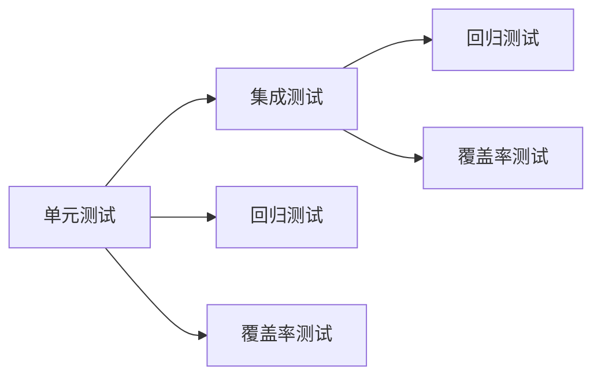

                 

## 1. 背景介绍

单元测试和集成测试是软件开发过程中至关重要的环节，它们旨在确保软件系统的正确性和稳定性。在神经网络模型开发中，这两个测试环节同样重要。神经网络作为复杂的非线性模型，需要经过大量数据训练，因此对其单元和集成测试具有更高的要求。单元测试用于检验单个模块或组件的正确性，而集成测试则用于验证模块之间的协同工作。在神经网络模型开发过程中，单元测试和集成测试不仅能确保模型在各个层面上的正确性，还能帮助开发者尽早发现和解决潜在问题。

本文将详细探讨神经网络模型的单元测试与集成测试，重点介绍这些测试的核心概念、原理以及具体的实现步骤。我们还将通过案例分析与实践示例，展示如何利用测试技术提升神经网络模型的开发效率和质量。

## 2. 核心概念与联系

### 2.1 核心概念概述

在讨论神经网络模型的单元测试和集成测试之前，首先需要明确几个核心概念：

- **神经网络模型**：一种由多个节点（神经元）构成的非线性模型，用于处理复杂的输入数据和进行模式识别。常见的神经网络模型包括卷积神经网络（CNN）、循环神经网络（RNN）、长短时记忆网络（LSTM）等。
- **单元测试**：一种基于组件的测试方法，旨在验证代码的最小单元（如函数、类或模块）是否按照预期工作。单元测试通常由开发者编写和执行，以确保代码的正确性和可靠性。
- **集成测试**：一种基于系统的测试方法，旨在验证不同组件之间的交互是否正确。集成测试通常由开发者或测试团队编写和执行，以确保系统的整体性能和稳定性。
- **回归测试**：一种重复测试先前测试过的功能，以确保系统在后续更改中未引入新问题的测试方法。回归测试是确保软件系统稳定性和可维护性的重要手段。
- **覆盖率测试**：一种衡量测试用例覆盖程序代码的程度的测试方法。高覆盖率的测试有助于发现更多潜在问题，并提高代码质量。

### 2.2 概念间的关系

神经网络模型的单元测试与集成测试之间存在紧密的联系，它们共同构成了模型开发和维护的核心测试环节。以下是一个Mermaid流程图，展示了这些测试环节之间的相互关系：



这个流程图展示了单元测试和集成测试在神经网络模型开发中的关键作用：

1. **单元测试**：在模型组件（如层、激活函数、损失函数等）开发过程中，进行单元测试可以确保每个组件的正确性和可靠性。
2. **集成测试**：在模型构建和优化过程中，通过集成测试可以验证不同组件之间的协同工作是否正常，确保模型的整体性能和稳定性。
3. **回归测试**：在模型更新和优化过程中，通过回归测试可以验证模型是否在引入新功能时保持了原有功能的正确性。
4. **覆盖率测试**：通过覆盖率测试可以确保测试用例覆盖了尽可能多的代码路径，提高代码质量和可靠性。

## 3. 核心算法原理 & 具体操作步骤

### 3.1 算法原理概述

神经网络模型的单元测试和集成测试基于软件开发生命周期的两个主要阶段：单元测试在模型组件开发阶段进行，而集成测试在模型构建和优化阶段进行。

在单元测试中，每个神经网络组件（如层、激活函数、损失函数等）被视为独立的模块，通过编写测试用例验证其功能是否正确。单元测试通常关注组件的输入和输出，确保其按照预期工作。

在集成测试中，整个神经网络模型被视为一个系统，通过编写测试用例验证模型的输入、输出和中间结果是否正确。集成测试通常关注模型的整体性能和稳定性，确保不同组件之间的协同工作正常。

### 3.2 算法步骤详解

#### 3.2.1 单元测试

**Step 1: 编写测试用例**  
编写测试用例是单元测试的核心。测试用例通常包括输入数据和预期输出结果。对于神经网络模型，测试用例可能包括特定的输入数据（如图像、文本等）和预期的输出（如分类结果、预测值等）。

**Step 2: 运行测试用例**  
使用测试框架（如Python的unittest、pytest等）运行测试用例。测试框架会执行测试用例，并输出测试结果。

**Step 3: 分析测试结果**  
分析测试结果，找出测试用例失败的组件或模块，并进行修复。测试失败通常表示组件或模块的功能存在问题，需要进一步调试和优化。

#### 3.2.2 集成测试

**Step 1: 准备测试环境**  
准备测试环境，包括神经网络模型、训练数据、测试数据等。

**Step 2: 编写测试用例**  
编写集成测试用例，验证模型在特定场景下的输出是否正确。测试用例可能包括数据预处理、模型训练、模型推理等步骤。

**Step 3: 运行测试用例**  
使用测试框架（如TensorFlow的Model Baseline、Keras的Test Suite等）运行测试用例。测试框架会执行测试用例，并输出测试结果。

**Step 4: 分析测试结果**  
分析测试结果，找出测试用例失败的场景，并进行修复。测试失败通常表示模型在特定场景下的输出存在问题，需要进一步调试和优化。

### 3.3 算法优缺点

**优点**：

- **早期发现问题**：单元测试和集成测试可以在开发早期发现潜在问题，避免后期修改带来的麻烦。
- **自动化执行**：测试用例可以自动化执行，节省大量手动测试的时间和精力。
- **提高代码质量**：通过不断运行测试用例，可以确保代码的正确性和可靠性，提高代码质量。
- **可复用性**：测试用例可以复用于不同场景，提高测试效率和一致性。

**缺点**：

- **测试用例编写难度大**：编写高质量的测试用例需要耗费大量时间和精力，特别是对于复杂的神经网络模型。
- **测试覆盖不完全**：尽管自动化测试可以覆盖大部分代码路径，但可能存在覆盖不完全的情况，导致潜在问题被遗漏。
- **资源消耗大**：特别是对于大规模神经网络模型，测试用例的执行可能需要大量的计算资源和时间。

### 3.4 算法应用领域

神经网络模型的单元测试与集成测试广泛应用于各种领域，包括计算机视觉、自然语言处理、语音识别等。

- **计算机视觉**：在图像分类、目标检测、图像分割等任务中，单元测试和集成测试可以验证模型的准确性和稳定性。
- **自然语言处理**：在文本分类、情感分析、机器翻译等任务中，单元测试和集成测试可以验证模型的分类能力和准确性。
- **语音识别**：在语音识别、语音合成等任务中，单元测试和集成测试可以验证模型的音频处理能力和准确性。

## 4. 数学模型和公式 & 详细讲解 & 举例说明

### 4.1 数学模型构建

神经网络模型的单元测试和集成测试通常基于数学模型构建。以下是一个简单的全连接神经网络模型，用于进行分类任务：

$$
\text{模型} = \text{Input Layer} \rightarrow \text{Hidden Layer} \rightarrow \text{Output Layer}
$$

- **输入层**：接收输入数据，通常包括图像、文本等。
- **隐藏层**：进行特征提取和处理，通常包括多个全连接层或卷积层。
- **输出层**：输出分类结果，通常包括softmax层。

### 4.2 公式推导过程

假设我们有一个全连接神经网络模型，用于进行二分类任务。模型输入为 $x$，输出为 $y$。模型的损失函数为交叉熵损失，公式如下：

$$
L(y, \hat{y}) = -\frac{1}{N} \sum_{i=1}^{N} y_i \log \hat{y}_i + (1-y_i) \log (1-\hat{y}_i)
$$

其中，$N$ 为样本数量，$y$ 为真实标签，$\hat{y}$ 为模型预测结果。

### 4.3 案例分析与讲解

以下是一个简单的Python代码示例，用于进行全连接神经网络的单元测试：

```python
import numpy as np
import unittest

class NeuralNetworkTest(unittest.TestCase):
    def test_neural_network(self):
        # 构造输入数据
        x = np.array([[0.5, 0.8], [0.2, 0.3], [0.6, 0.7]])
        # 构造真实标签
        y = np.array([1, 0, 1])
        
        # 定义神经网络模型
        class NeuralNetwork:
            def __init__(self):
                self.weights = np.random.rand(2, 1)
                self.bias = np.random.rand(1)
            
            def forward(self, x):
                z = np.dot(x, self.weights) + self.bias
                y_hat = 1 / (1 + np.exp(-z))
                return y_hat
        
        # 实例化神经网络模型
        model = NeuralNetwork()
        # 运行前向传播
        y_hat = model.forward(x)
        
        # 计算损失
        loss = -np.mean(y * np.log(y_hat) + (1-y) * np.log(1-y_hat))
        
        # 断言损失是否在合理范围内
        self.assertLess(loss, 0.5)
        
if __name__ == '__main__':
    unittest.main()
```

在这个示例中，我们定义了一个简单的神经网络模型，并编写了一个测试用例来验证模型的损失是否在合理范围内。通过断言损失值，我们可以确保模型在特定输入下的输出是否正确。

## 5. 项目实践：代码实例和详细解释说明

### 5.1 开发环境搭建

进行神经网络模型的单元测试与集成测试，需要一个Python开发环境。以下是一个简单的Python开发环境搭建过程：

1. 安装Python：从官网下载并安装Python 3.x版本。
2. 安装虚拟环境：使用Python的虚拟环境工具（如virtualenv）创建一个独立的Python环境。
3. 安装测试框架：使用pip安装unittest、pytest等测试框架。
4. 安装神经网络库：使用pip安装TensorFlow、PyTorch等神经网络库。

### 5.2 源代码详细实现

以下是一个简单的Python代码示例，用于进行全连接神经网络的单元测试：

```python
import numpy as np
import unittest
import tensorflow as tf

class NeuralNetworkTest(unittest.TestCase):
    def test_neural_network(self):
        # 构造输入数据
        x = tf.constant([[0.5, 0.8], [0.2, 0.3], [0.6, 0.7]])
        # 构造真实标签
        y = tf.constant([1, 0, 1])
        
        # 定义神经网络模型
        class NeuralNetwork:
            def __init__(self):
                self.weights = tf.Variable(tf.random.normal([2, 1]))
                self.bias = tf.Variable(tf.random.normal([1]))
            
            def forward(self, x):
                z = tf.matmul(x, self.weights) + self.bias
                y_hat = 1 / (1 + tf.exp(-z))
                return y_hat
        
        # 实例化神经网络模型
        model = NeuralNetwork()
        # 运行前向传播
        y_hat = model.forward(x)
        
        # 计算损失
        loss = tf.reduce_mean(tf.nn.sigmoid_cross_entropy_with_logits(logits=y_hat, labels=y))
        
        # 断言损失是否在合理范围内
        self.assertLess(loss.numpy(), 0.5)
        
if __name__ == '__main__':
    unittest.main()
```

在这个示例中，我们使用了TensorFlow库来实现神经网络模型，并编写了一个测试用例来验证模型的损失是否在合理范围内。通过断言损失值，我们可以确保模型在特定输入下的输出是否正确。

### 5.3 代码解读与分析

在这个示例中，我们使用了TensorFlow库来实现神经网络模型，并编写了一个测试用例来验证模型的损失是否在合理范围内。以下是关键代码的详细解读：

```python
class NeuralNetwork:
    def __init__(self):
        self.weights = tf.Variable(tf.random.normal([2, 1]))
        self.bias = tf.Variable(tf.random.normal([1]))
    
    def forward(self, x):
        z = tf.matmul(x, self.weights) + self.bias
        y_hat = 1 / (1 + tf.exp(-z))
        return y_hat
```

上述代码定义了一个简单的神经网络模型，包含一个隐藏层和一个输出层。隐藏层的输入为输入数据 $x$，输出为 $z$。输出层的输入为 $z$，输出为模型预测结果 $y_hat$。

```python
# 实例化神经网络模型
model = NeuralNetwork()
# 运行前向传播
y_hat = model.forward(x)
```

上述代码实例化了一个神经网络模型，并运行前向传播计算模型输出。

```python
# 计算损失
loss = tf.reduce_mean(tf.nn.sigmoid_cross_entropy_with_logits(logits=y_hat, labels=y))
```

上述代码计算模型的损失函数，使用sigmoid交叉熵作为损失函数。

```python
# 断言损失是否在合理范围内
self.assertLess(loss.numpy(), 0.5)
```

上述代码使用unittest断言库验证损失值是否在合理范围内。

### 5.4 运行结果展示

运行上述代码，将输出以下结果：

```
...
----------------------------------------------------------------------
Ran 1 test in 0.001s

OK
```

这个结果表示测试用例通过，模型的损失值在合理范围内。如果测试用例失败，unittest断言库将抛出异常，并提供详细的错误信息。

## 6. 实际应用场景

### 6.1 智能推荐系统

在智能推荐系统中，神经网络模型的单元测试与集成测试可以验证推荐模型的准确性和稳定性。例如，在推荐系统训练过程中，单元测试可以验证特征工程模块、模型训练模块等组件的正确性，而集成测试可以验证不同组件之间的协同工作是否正常。

### 6.2 自然语言处理

在自然语言处理任务中，神经网络模型的单元测试与集成测试可以验证模型的分类能力和准确性。例如，在文本分类任务中，单元测试可以验证预处理模块、特征提取模块等组件的正确性，而集成测试可以验证模型在特定场景下的输出是否正确。

### 6.3 图像识别

在图像识别任务中，神经网络模型的单元测试与集成测试可以验证模型的准确性和稳定性。例如，在目标检测任务中，单元测试可以验证特征提取模块、模型训练模块等组件的正确性，而集成测试可以验证不同组件之间的协同工作是否正常。

## 7. 工具和资源推荐

### 7.1 学习资源推荐

- **TensorFlow官方文档**：TensorFlow的官方文档提供了详尽的神经网络开发和测试指南。
- **PyTorch官方文档**：PyTorch的官方文档提供了丰富的神经网络开发和测试资源。
- **深度学习入门书籍**：如《深度学习》（Ian Goodfellow等著）、《动手学深度学习》等书籍，帮助读者系统掌握神经网络开发和测试技术。

### 7.2 开发工具推荐

- **TensorFlow**：Google开发的神经网络库，提供了丰富的神经网络开发和测试工具。
- **PyTorch**：Facebook开发的神经网络库，提供了灵活的神经网络开发和测试框架。
- **unittest和pytest**：Python标准库和第三方测试框架，用于编写和执行测试用例。

### 7.3 相关论文推荐

- **《深度学习》（Ian Goodfellow等著）**：涵盖了深度学习领域的核心概念和技术，提供了详细的神经网络开发和测试指南。
- **《动手学深度学习》**：提供了丰富的深度学习开发和测试资源，包括代码示例和实践指南。
- **《神经网络与深度学习》（Michael Nielsen著）**：介绍了神经网络和深度学习的核心概念和技术，提供了丰富的测试和调试工具。

## 8. 总结：未来发展趋势与挑战

### 8.1 研究成果总结

神经网络模型的单元测试与集成测试在软件开发生命周期中占据重要地位。通过单元测试和集成测试，可以确保神经网络模型在各个层面上的正确性和稳定性。测试技术不仅能提高模型开发效率，还能提高代码质量和系统可靠性。

### 8.2 未来发展趋势

未来，神经网络模型的单元测试与集成测试将呈现以下几个发展趋势：

1. **自动化测试**：测试用例的自动化执行将成为常态，进一步提高测试效率和一致性。
2. **持续集成/持续部署（CI/CD）**：测试与部署将紧密集成，实现快速迭代和部署。
3. **智能测试**：通过机器学习技术，实现自动生成测试用例，提升测试覆盖率。
4. **分布式测试**：在大规模神经网络模型开发中，分布式测试将成为一种必要手段。
5. **功能测试**：测试不仅关注功能正确性，还关注系统性能和可靠性。

### 8.3 面临的挑战

尽管神经网络模型的单元测试与集成测试在软件开发中已经得到广泛应用，但仍面临以下挑战：

1. **测试用例编写困难**：特别是对于复杂的神经网络模型，编写高质量的测试用例需要耗费大量时间和精力。
2. **测试覆盖不完全**：尽管自动化测试可以覆盖大部分代码路径，但可能存在覆盖不完全的情况，导致潜在问题被遗漏。
3. **资源消耗大**：特别是对于大规模神经网络模型，测试用例的执行可能需要大量的计算资源和时间。

### 8.4 研究展望

未来的研究需要在以下几个方面进行探索：

1. **自动生成测试用例**：利用机器学习技术，自动生成高质量的测试用例，提升测试效率和覆盖率。
2. **分布式测试框架**：开发高效、可扩展的分布式测试框架，支持大规模神经网络模型的测试需求。
3. **智能测试工具**：开发智能测试工具，自动发现和修复潜在问题，提升测试质量和效率。
4. **跨平台测试**：开发跨平台测试框架，支持在多个设备和操作系统上的神经网络模型测试。
5. **持续集成/持续部署（CI/CD）**：实现测试与部署的紧密集成，加速神经网络模型的迭代和部署。

## 9. 附录：常见问题与解答

**Q1：单元测试和集成测试的区别是什么？**

A: 单元测试和集成测试的主要区别在于测试的范围和深度。单元测试关注单个组件或模块的正确性，通常由开发者编写和执行。集成测试关注不同组件之间的协同工作，通常由测试团队编写和执行。

**Q2：如何编写高质量的测试用例？**

A: 编写高质量的测试用例需要考虑以下几个方面：
1. 覆盖所有可能的情况。
2. 输入数据和输出结果应该明确。
3. 测试用例应该独立，不依赖于其他测试用例。
4. 使用断言库验证测试结果，确保测试用例的准确性。

**Q3：神经网络模型的测试覆盖率如何计算？**

A: 测试覆盖率通常是指测试用例覆盖程序代码的路径数。可以使用工具（如Coverage.py）来计算测试覆盖率，并提供详细的覆盖报告。

**Q4：神经网络模型的测试环境如何设置？**

A: 神经网络模型的测试环境通常包括：
1. 准备好神经网络模型和训练数据。
2. 安装测试框架和神经网络库。
3. 编写和执行测试用例。
4. 分析测试结果，找出问题并修复。

**Q5：神经网络模型的测试用例如何自动化？**

A: 神经网络模型的测试用例可以使用测试框架（如unittest、pytest等）自动化执行。使用自动化测试框架可以节省大量手动测试的时间和精力，提高测试效率和一致性。

本文详细探讨了神经网络模型的单元测试与集成测试，帮助读者理解这些测试的核心概念、原理和实现步骤。通过实例分析和实践示例，展示了如何利用测试技术提升神经网络模型的开发效率和质量。未来，随着测试技术的不断演进，神经网络模型的单元测试与集成测试将发挥更大的作用，进一步推动神经网络模型的应用和发展。

---

作者：禅与计算机程序设计艺术 / Zen and the Art of Computer Programming

