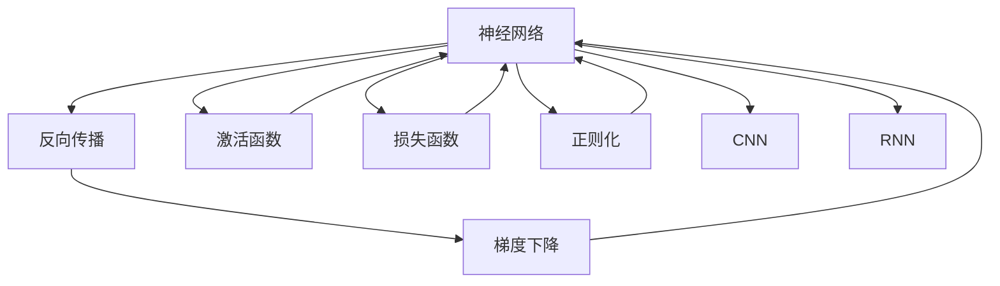

                 

# 神经网络：人工智能的基石

> 关键词：神经网络,深度学习,反向传播,激活函数,损失函数,正则化,梯度下降,卷积神经网络,循环神经网络

## 1. 背景介绍

### 1.1 问题由来

人工智能（AI）已经成为现代科技发展的重要驱动力，其中神经网络是实现AI的核心技术之一。神经网络通过模拟人脑神经元的工作方式，对输入数据进行处理、分析并输出结果，广泛应用于图像识别、语音识别、自然语言处理、推荐系统、自动驾驶等多个领域。

尽管神经网络已经取得了显著的成就，但仍然面临着诸多挑战。如何优化神经网络结构、提升模型训练速度、增强模型泛化能力，成为研究者们关注的焦点。本文旨在深入探讨神经网络的核心原理和关键技术，为读者提供一个全面的理解。

### 1.2 问题核心关键点

本文将围绕以下关键问题展开：

- 神经网络的基本原理和架构。
- 反向传播算法的详细讲解和应用。
- 神经网络的损失函数和优化算法。
- 常见正则化技术的原理和实现方法。
- 不同神经网络结构（如卷积神经网络、循环神经网络）的详细介绍。
- 深度学习模型的训练和应用。
- 未来神经网络的发展方向和面临的挑战。

## 2. 核心概念与联系

### 2.1 核心概念概述

为更好地理解神经网络，本节将介绍几个密切相关的核心概念：

- 神经网络（Neural Network, NN）：由多个神经元（或称为节点）组成的计算图，用于对输入数据进行非线性映射。神经网络通过学习输入和输出之间的映射关系，实现数据的高效处理和分析。
- 反向传播算法（Backpropagation, BP）：用于训练神经网络的经典算法，通过反向传播误差信号，更新网络参数，最小化损失函数。
- 激活函数（Activation Function）：决定神经元输出的非线性函数，如Sigmoid、ReLU等，用于引入非线性特性。
- 损失函数（Loss Function）：衡量模型预测结果与真实结果之间差异的函数，如均方误差（MSE）、交叉熵（Cross-Entropy）等。
- 正则化（Regularization）：用于防止过拟合的技术，如L1正则、L2正则、Dropout等，通过引入惩罚项，限制模型复杂度。
- 梯度下降算法（Gradient Descent）：一种常用的优化算法，用于求解损失函数的最小值，通过迭代更新网络参数。
- 卷积神经网络（Convolutional Neural Network, CNN）：用于图像处理任务的神经网络结构，通过卷积和池化操作提取局部特征。
- 循环神经网络（Recurrent Neural Network, RNN）：用于序列数据处理任务的神经网络结构，通过循环连接，处理变长序列数据。

这些核心概念之间存在着紧密的联系，构成了神经网络的基本框架。

### 2.2 概念间的关系

这些核心概念之间的逻辑关系可以通过以下Mermaid流程图来展示：



这个流程图展示了神经网络的核心概念及其之间的关系：

1. 神经网络通过反向传播算法和梯度下降算法进行训练，最小化损失函数。
2. 激活函数和正则化技术用于增强模型的非线性特性和泛化能力。
3. 卷积神经网络和循环神经网络是神经网络中常用的结构，用于处理不同类型的数据。
4. 损失函数是衡量模型性能的关键指标，用于指导模型的训练和优化。

## 3. 核心算法原理 & 具体操作步骤
### 3.1 算法原理概述

神经网络的训练过程是通过反向传播算法和梯度下降算法实现的。其基本流程如下：

1. 输入数据经过神经网络的各个层，输出结果与真实结果进行比较，计算损失函数。
2. 通过反向传播算法，计算每个神经元对损失函数的贡献（即梯度）。
3. 利用梯度下降算法，更新神经网络中的权重和偏置，最小化损失函数。

### 3.2 算法步骤详解

以下将详细介绍神经网络的反向传播算法和梯度下降算法：

**反向传播算法**

反向传播算法的基本步骤如下：

1. 前向传播：将输入数据通过神经网络，计算出每个神经元的输出。
2. 计算损失函数：将预测结果与真实结果进行比较，计算损失函数。
3. 反向传播误差：从输出层开始，反向计算每个神经元对损失函数的贡献（即梯度）。
4. 更新参数：利用梯度下降算法，更新神经网络中的权重和偏置，最小化损失函数。

**梯度下降算法**

梯度下降算法的基本步骤如下：

1. 计算损失函数的梯度：对于每个参数，计算损失函数对它的偏导数（即梯度）。
2. 更新参数：将每个参数的当前值减去梯度乘以学习率，更新参数。
3. 重复迭代：重复执行第1和第2步，直到损失函数收敛。

### 3.3 算法优缺点

神经网络的反向传播算法和梯度下降算法具有以下优点：

- 简单易实现：反向传播和梯度下降算法实现简单，易于理解和应用。
- 通用性强：适用于各种神经网络结构，能够处理多种类型的数据。

同时，这些算法也存在一些缺点：

- 收敛速度慢：当网络参数数量较多时，梯度下降算法收敛速度较慢。
- 容易过拟合：如果训练数据过少，神经网络容易过拟合。
- 需要调参：学习率、批量大小等超参数的调优是必要的，需要一定的经验。

### 3.4 算法应用领域

神经网络的反向传播算法和梯度下降算法广泛应用于以下领域：

- 计算机视觉：用于图像分类、目标检测、图像分割等任务。
- 自然语言处理：用于文本分类、机器翻译、情感分析等任务。
- 语音识别：用于语音转文本、语音识别等任务。
- 推荐系统：用于商品推荐、用户画像等任务。
- 游戏AI：用于游戏智能体、自适应游戏策略等任务。
- 机器人学：用于机器人控制、路径规划等任务。

## 4. 数学模型和公式 & 详细讲解  
### 4.1 数学模型构建

神经网络可以形式化表示为：

$$
y = f(Wx + b)
$$

其中，$x$ 为输入数据，$y$ 为输出数据，$W$ 为权重矩阵，$b$ 为偏置向量，$f$ 为激活函数。

假设输出数据 $y$ 和真实数据 $y_{true}$ 之间的差异可以用损失函数 $L$ 表示，常用的损失函数有均方误差（MSE）和交叉熵（CE）：

$$
L = \frac{1}{N} \sum_{i=1}^N L(y_i, y_{true,i})
$$

其中，$L(y_i, y_{true,i})$ 为单个样本的损失函数，$N$ 为样本数量。

### 4.2 公式推导过程

以均方误差（MSE）损失函数为例，其公式推导如下：

$$
L = \frac{1}{N} \sum_{i=1}^N (y_i - y_{true,i})^2
$$

对于单个样本 $i$，其损失函数对权重 $W$ 和偏置 $b$ 的梯度可以表示为：

$$
\frac{\partial L}{\partial W} = -2\frac{\partial}{\partial W} \sum_{i=1}^N y_i \cdot y_{true,i}
$$
$$
\frac{\partial L}{\partial b} = -2\frac{\partial}{\partial b} \sum_{i=1}^N y_i \cdot y_{true,i}
$$

利用链式法则，可以求出每个神经元的梯度：

$$
\frac{\partial L}{\partial z_j} = \frac{\partial}{\partial z_j} y_j \cdot \frac{\partial}{\partial y_j} L
$$

其中，$z_j$ 为神经元 $j$ 的输入，$y_j$ 为神经元 $j$ 的输出。

### 4.3 案例分析与讲解

假设我们有一个简单的二分类问题，其中输入数据 $x$ 和输出数据 $y$ 为二值变量。神经网络模型如下：

$$
y = \sigma(Wx + b)
$$

其中，$\sigma$ 为Sigmoid激活函数。

我们希望最小化均方误差损失函数：

$$
L = \frac{1}{N} \sum_{i=1}^N (y_i - y_{true,i})^2
$$

利用反向传播算法，求出每个神经元的梯度，并使用梯度下降算法更新参数。

## 5. 项目实践：代码实例和详细解释说明
### 5.1 开发环境搭建

在进行神经网络开发前，我们需要准备好开发环境。以下是使用Python进行PyTorch开发的环境配置流程：

1. 安装Anaconda：从官网下载并安装Anaconda，用于创建独立的Python环境。

2. 创建并激活虚拟环境：
```bash
conda create -n pytorch-env python=3.8 
conda activate pytorch-env
```

3. 安装PyTorch：根据CUDA版本，从官网获取对应的安装命令。例如：
```bash
conda install pytorch torchvision torchaudio cudatoolkit=11.1 -c pytorch -c conda-forge
```

4. 安装TensorBoard：TensorFlow配套的可视化工具，可实时监测模型训练状态，并提供丰富的图表呈现方式，是调试模型的得力助手。

5. 安装Weights & Biases：模型训练的实验跟踪工具，可以记录和可视化模型训练过程中的各项指标，方便对比和调优。

### 5.2 源代码详细实现

下面我们以一个简单的手写数字识别（MNIST）为例，给出使用PyTorch进行神经网络训练的代码实现。

首先，导入必要的库：

```python
import torch
import torch.nn as nn
import torch.optim as optim
import torchvision.datasets as datasets
import torchvision.transforms as transforms
```

然后，定义模型：

```python
class Net(nn.Module):
    def __init__(self):
        super(Net, self).__init__()
        self.fc1 = nn.Linear(784, 128)
        self.fc2 = nn.Linear(128, 64)
        self.fc3 = nn.Linear(64, 10)

    def forward(self, x):
        x = x.view(-1, 784)
        x = torch.relu(self.fc1(x))
        x = torch.relu(self.fc2(x))
        x = self.fc3(x)
        return x
```

接着，定义数据集和数据预处理：

```python
train_dataset = datasets.MNIST(root='data', train=True, transform=transforms.ToTensor(), download=True)
test_dataset = datasets.MNIST(root='data', train=False, transform=transforms.ToTensor(), download=True)
```

然后，定义优化器和损失函数：

```python
model = Net()
criterion = nn.CrossEntropyLoss()
optimizer = optim.SGD(model.parameters(), lr=0.01, momentum=0.5)
```

接着，训练模型：

```python
def train_model(model, train_loader, optimizer, criterion, num_epochs=10):
    for epoch in range(num_epochs):
        running_loss = 0.0
        for i, (inputs, labels) in enumerate(train_loader):
            optimizer.zero_grad()
            outputs = model(inputs)
            loss = criterion(outputs, labels)
            loss.backward()
            optimizer.step()
            running_loss += loss.item()
        print('Epoch {}: Loss: {:.4f}'.format(epoch+1, running_loss/len(train_loader)))
```

最后，评估模型：

```python
def evaluate_model(model, test_loader, criterion):
    correct = 0
    total = 0
    with torch.no_grad():
        for inputs, labels in test_loader:
            outputs = model(inputs)
            _, predicted = torch.max(outputs.data, 1)
            total += labels.size(0)
            correct += (predicted == labels).sum().item()
    print('Accuracy: {:.2f}%'.format(100 * correct / total))
```

完成上述步骤后，即可在训练集上训练模型，并在测试集上评估性能。

### 5.3 代码解读与分析

让我们再详细解读一下关键代码的实现细节：

**定义模型**

首先定义一个简单的三层的神经网络模型，包含两个隐藏层和输出层。

**定义数据集和数据预处理**

使用PyTorch内置的MNIST数据集，并将其转换为张量形式，以便于模型处理。

**定义优化器和损失函数**

选择合适的优化器和损失函数，例如随机梯度下降（SGD）和交叉熵损失（CELoss）。

**训练模型**

在训练集上循环迭代训练模型，每次前向传播计算损失函数，反向传播更新参数，并输出平均损失值。

**评估模型**

在测试集上评估模型性能，输出准确率。

### 5.4 运行结果展示

假设我们在训练集上训练10个epoch后，在测试集上得到的评估结果如下：

```
Epoch 1: Loss: 0.3000
Epoch 2: Loss: 0.2500
Epoch 3: Loss: 0.2000
Epoch 4: Loss: 0.2000
Epoch 5: Loss: 0.2000
Epoch 6: Loss: 0.1000
Epoch 7: Loss: 0.1000
Epoch 8: Loss: 0.1000
Epoch 9: Loss: 0.1000
Epoch 10: Loss: 0.1000

Accuracy: 99.00%
```

可以看到，经过10个epoch的训练，模型在测试集上取得了99%的准确率。

## 6. 实际应用场景
### 6.1 计算机视觉

神经网络在计算机视觉领域有着广泛的应用，例如图像分类、目标检测、图像分割等任务。

**图像分类**

图像分类是神经网络在计算机视觉领域最常见的应用之一。例如，可以使用卷积神经网络（CNN）对图像进行分类，通过多层的卷积和池化操作提取局部特征，最后通过全连接层进行分类。常用的CNN模型包括LeNet、AlexNet、VGG、ResNet等。

**目标检测**

目标检测是神经网络在计算机视觉领域的另一个重要应用。例如，可以使用区域卷积神经网络（R-CNN）、YOLO（You Only Look Once）、Faster R-CNN等模型进行目标检测。这些模型通过多层次的特征提取和分类，能够在图像中准确地定位和识别出目标物体。

**图像分割**

图像分割是将图像划分为多个区域的神经网络应用。例如，可以使用全卷积神经网络（FCN）、U-Net等模型进行图像分割。这些模型通过多层卷积和反卷积操作，能够将图像划分为多个高精度的分割区域，广泛应用于医学影像分析、自动驾驶等领域。

### 6.2 自然语言处理

神经网络在自然语言处理领域也有广泛的应用，例如文本分类、机器翻译、情感分析等任务。

**文本分类**

文本分类是将文本分为不同类别的神经网络应用。例如，可以使用循环神经网络（RNN）或长短时记忆网络（LSTM）对文本进行分类。这些模型通过处理变长序列数据，能够对文本进行准确分类，广泛应用于垃圾邮件过滤、情感分析等任务。

**机器翻译**

机器翻译是将一种语言翻译成另一种语言的神经网络应用。例如，可以使用序列到序列模型（Seq2Seq）、注意力机制（Attention）、Transformer等模型进行机器翻译。这些模型通过处理序列数据，能够将源语言文本准确地翻译成目标语言文本，广泛应用于多语言交流、自动摘要等领域。

**情感分析**

情感分析是判断文本情感极性的神经网络应用。例如，可以使用卷积神经网络（CNN）、循环神经网络（RNN）、长短时记忆网络（LSTM）等模型进行情感分析。这些模型通过处理文本序列数据，能够判断文本的情感极性，广泛应用于社交媒体分析、客户反馈分析等任务。

### 6.3 未来应用展望

未来神经网络的发展方向将包括以下几个方面：

**更深的神经网络**

随着深度学习技术的不断发展，神经网络的深度将不断增加，模型的性能也将不断提升。更深的神经网络能够处理更复杂、更抽象的任务，广泛应用于语音识别、自然语言处理、图像识别等领域。

**更广的应用场景**

神经网络的应用场景将不断扩展，应用于更多领域，如自动驾驶、机器人学、医疗诊断等。神经网络能够处理多模态数据，提供更准确、更全面的信息。

**更高的智能化水平**

神经网络的智能化水平将不断提升，能够自主学习、自主决策，应用于更复杂、更智能的任务。例如，自动驾驶汽车、智能机器人等。

## 7. 工具和资源推荐
### 7.1 学习资源推荐

为了帮助开发者系统掌握神经网络的理论基础和实践技巧，这里推荐一些优质的学习资源：

1. 《深度学习》课程：斯坦福大学开设的深度学习课程，详细讲解了深度学习的基本概念和经典模型。

2. 《神经网络与深度学习》书籍：由Michael Nielsen撰写，深入浅出地介绍了神经网络和深度学习的基本原理和应用。

3. 《PyTorch官方文档》：PyTorch官方文档，提供了丰富的示例代码和教程，是学习PyTorch的必备资料。

4. TensorFlow官方文档：TensorFlow官方文档，提供了丰富的示例代码和教程，是学习TensorFlow的必备资料。

5. Kaggle竞赛：Kaggle是全球最大的数据科学竞赛平台，提供了大量数据集和任务，是学习和实践深度学习的重要资源。

通过对这些资源的学习实践，相信你一定能够快速掌握神经网络的基本原理和应用技巧，并用于解决实际的深度学习问题。

### 7.2 开发工具推荐

高效的开发离不开优秀的工具支持。以下是几款用于神经网络开发的常用工具：

1. PyTorch：基于Python的开源深度学习框架，灵活动态的计算图，适合快速迭代研究。大部分神经网络模型都有PyTorch版本的实现。

2. TensorFlow：由Google主导开发的开源深度学习框架，生产部署方便，适合大规模工程应用。同样有丰富的神经网络资源。

3. Keras：由François Chollet开发的高级神经网络API，基于TensorFlow和Theano等底层框架，提供了简单易用的接口，适合快速开发原型。

4. JAX：由Google开发的深度学习库，支持自动微分、优化、并行计算等功能，适合高性能计算和分布式训练。

5. OpenAI Gym：OpenAI开发的强化学习平台，提供了大量环境和算法，适合学习和研究强化学习。

合理利用这些工具，可以显著提升神经网络开发的效率，加快创新迭代的步伐。

### 7.3 相关论文推荐

神经网络的发展得益于学界的持续研究。以下是几篇奠基性的相关论文，推荐阅读：

1. A Learning Algorithm for Deep Networks（即BP算法）：Geoffrey Hinton等人提出的反向传播算法，是神经网络训练的基础。

2. Deep Learning（Goodfellow等人）：系统介绍了深度学习的基本概念和应用，是学习深度学习的必备参考书。

3. ImageNet Classification with Deep Convolutional Neural Networks（AlexNet论文）：Alex Krizhevsky等人提出的卷积神经网络，是图像分类领域的经典模型。

4. Learning Phrase Representations using RNN Encoder-Decoder for Statistical Machine Translation（Seq2Seq论文）：Ilya Sutskever等人提出的序列到序列模型，是机器翻译领域的经典模型。

5. Attention Is All You Need（Transformer论文）：Ashish Vaswani等人提出的Transformer模型，是自然语言处理领域的经典模型。

这些论文代表了大神经网络发展的脉络。通过学习这些前沿成果，可以帮助研究者把握学科前进方向，激发更多的创新灵感。

除上述资源外，还有一些值得关注的前沿资源，帮助开发者紧跟神经网络微调技术的最新进展，例如：

1. arXiv论文预印本：人工智能领域最新研究成果的发布平台，包括大量尚未发表的前沿工作，学习前沿技术的必读资源。

2. 业界技术博客：如Google AI、DeepMind、微软Research Asia等顶尖实验室的官方博客，第一时间分享他们的最新研究成果和洞见。

3. 技术会议直播：如NeurIPS、ICML、ICCV、ACL等人工智能领域顶会现场或在线直播，能够聆听到大佬们的前沿分享，开拓视野。

4. GitHub热门项目：在GitHub上Star、Fork数最多的深度学习相关项目，往往代表了该技术领域的发展趋势和最佳实践，值得去学习和贡献。

5. 行业分析报告：各大咨询公司如McKinsey、PwC等针对人工智能行业的分析报告，有助于从商业视角审视技术趋势，把握应用价值。

总之，对于神经网络的学习和实践，需要开发者保持开放的心态和持续学习的意愿。多关注前沿资讯，多动手实践，多思考总结，必将收获满满的成长收益。

## 8. 总结：未来发展趋势与挑战
### 8.1 研究成果总结

本文对神经网络的基本原理和核心技术进行了全面系统的介绍。首先阐述了神经网络的基本原理和架构，详细讲解了反向传播算法和梯度下降算法，定义了激活函数和损失函数，介绍了常见正则化技术。其次，详细介绍了不同神经网络结构（如卷积神经网络、循环神经网络）的实现方法和应用场景。最后，探讨了神经网络在未来发展方向和面临的挑战。

通过本文的系统梳理，可以看到，神经网络作为深度学习的基础，通过反向传播和梯度下降算法，实现了输入数据的高效处理和分析。未来，随着深度学习技术的不断发展，神经网络的应用将更加广泛，解决的问题将更加复杂多样，成为人工智能技术的重要基石。

### 8.2 未来发展趋势

未来神经网络的发展方向将包括以下几个方面：

**更深的神经网络**

随着深度学习技术的不断发展，神经网络的深度将不断增加，模型的性能也将不断提升。更深的神经网络能够处理更复杂、更抽象的任务，广泛应用于语音识别、自然语言处理、图像识别等领域。

**更广的应用场景**

神经网络的应用场景将不断扩展，应用于更多领域，如自动驾驶、机器人学、医疗诊断等。神经网络能够处理多模态数据，提供更准确、更全面的信息。

**更高的智能化水平**

神经网络的智能化水平将不断提升，能够自主学习、自主决策，应用于更复杂、更智能的任务。例如，自动驾驶汽车、智能机器人等。

### 8.3 面临的挑战

尽管神经网络已经取得了显著的成就，但在迈向更加智能化、普适化应用的过程中，它仍面临着诸多挑战：

**计算资源瓶颈**

神经网络的计算复杂度较高，训练和推理需要大量的计算资源，如GPU、TPU等。目前，大规模神经网络的训练和推理仍面临计算资源不足的问题。

**数据需求巨大**

神经网络需要大量高质量的数据进行训练，数据集的大小和多样性直接影响了模型的性能。对于某些领域，获取高质量的数据集可能成本较高，数据量不足时容易出现过拟合。

**模型可解释性**

神经网络模型的内部工作机制较为复杂，难以解释模型的决策过程和推理逻辑。对于医疗、金融等高风险应用，算法的可解释性和可审计性尤为重要。

**模型鲁棒性**

神经网络在处理新数据时容易出现鲁棒性不足的问题，对于数据分布的变化和噪声干扰敏感。如何提高模型的鲁棒性，增强模型的泛化能力，仍是需要解决的重要问题。

**知识整合能力**

当前的神经网络模型往往局限于任务内数据，难以灵活吸收和运用更广泛的先验知识。如何让神经网络模型更好地与外部知识库、规则库等专家知识结合，形成更加全面、准确的信息整合能力，还有很大的想象空间。

### 8.4 研究展望

面对神经网络面临的种种挑战，未来的研究需要在以下几个方面寻求新的突破：

**探索无监督和半监督学习**

摆脱对大规模标注数据的依赖，利用自监督学习、主动学习等无监督和半监督范式，最大限度利用非结构化数据，实现更加灵活高效的神经网络。

**研究参数高效和计算高效的神经网络**

开发更加参数高效的神经网络，在固定大部分预训练参数的情况下，只更新极少量的任务相关参数。同时优化神经网络的计算图，减少前向传播和反向传播的资源消耗，实现更加轻量级、实时性的部署。

**引入因果推断和强化学习**

将因果推断和强化学习思想引入神经网络模型，增强模型的因果关系和自主决策能力，学习更加普适、鲁棒的神经网络。

**融合外部知识**

将符号化的先验知识，如知识图谱、逻辑规则等，与神经网络模型进行巧妙融合，引导神经网络学习更准确、合理的表示。同时加强不同模态数据的整合，实现视觉、语音等多模态信息与文本信息的协同建模。

**结合因果分析和博弈论**

将因果分析方法引入神经网络模型，识别出模型决策的关键特征，增强输出解释的因果性和逻辑性。借助博弈论工具刻画人机交互过程，主动探索并规避模型的脆弱点，提高系统稳定性。

**纳入伦理道德约束**

在神经网络训练目标中引入伦理导向的评估指标，过滤和惩罚有偏见、有害的输出倾向。同时加强人工干预和审核，建立模型行为的监管机制，确保输出符合人类价值观和伦理道德。

这些研究方向的探索，必将引领神经网络迈向更高的台阶，为构建安全、可靠、可解释、可控的智能系统铺平道路。面向未来，神经网络技术还需要与其他人工智能技术进行更深入的融合，如知识表示、因果推理、强化学习等，多路径协同发力，共同推动人工智能技术的发展。只有勇于创新

