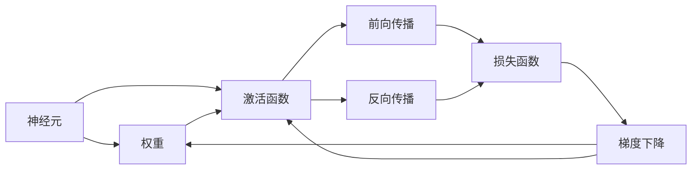
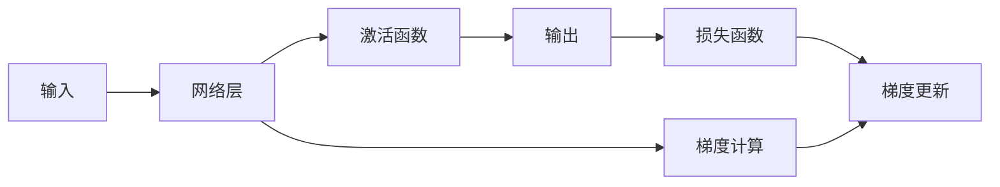
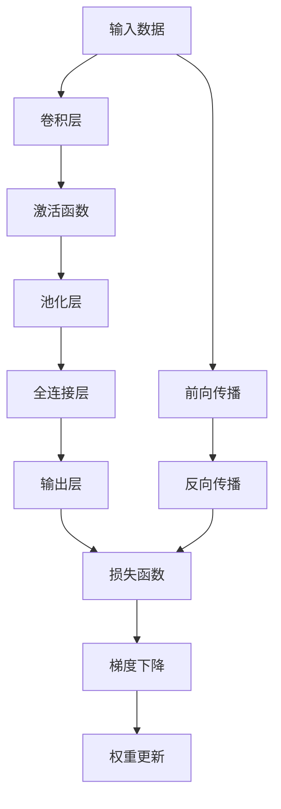

                 

# 神经网络：人工智能的基石

> 关键词：神经网络,深度学习,人工智能,机器学习,卷积神经网络,循环神经网络,计算图,反向传播,梯度下降

## 1. 背景介绍

### 1.1 问题由来
近年来，人工智能(AI)技术在全球范围内蓬勃发展，成为推动社会进步和产业升级的重要驱动力。其中，神经网络(Neural Network, NN)作为AI的重要组成部分，为解决复杂模式识别、图像处理、自然语言处理、智能推荐等多个领域问题提供了有力工具。然而，尽管神经网络技术已经取得了显著进展，但理解其核心原理和操作方法仍然是众多研究人员和工程开发者的重要挑战。

本文旨在全面系统地介绍神经网络的基本概念、核心原理及其在实际应用中的具体操作和优化策略，为读者提供深入且实用的指南。通过理解神经网络的工作机制和优化技巧，我们能够更好地掌握其在AI领域的广泛应用，提升技术实践和研究能力。

### 1.2 问题核心关键点
神经网络的核心在于其能够通过数据训练自适应地学习特征，从而实现对复杂模式和结构的有效建模。具体来说，神经网络包含以下几个关键点：

- **神经元(Neuron)**：神经网络的最小单位，每个神经元接收输入、进行加权计算并输出结果。
- **权重(Weight)**：用于调整输入信号的重要性，使得网络能够学习到特征的重要性。
- **激活函数(Activation Function)**：决定神经元输出的非线性映射，增强网络的表达能力。
- **损失函数(Loss Function)**：用于衡量模型预测与真实标签的差异，指导模型进行优化。
- **反向传播(Backpropagation)**：利用链式法则计算损失函数的梯度，从而反向更新网络参数。
- **优化器(Optimizer)**：通过梯度下降等优化算法更新网络参数，最小化损失函数。

这些关键点相互作用，构成了神经网络的基本框架，使其能够通过学习数据自动提取特征，并完成模式识别、分类、回归等任务。

## 2. 核心概念与联系

### 2.1 核心概念概述

为更好地理解神经网络的核心原理和架构，本节将介绍几个密切相关的核心概念：

- **前向传播(Forward Propagation)**：从输入数据开始，通过网络层层的正向计算，输出预测结果。
- **反向传播(Backward Propagation)**：通过链式法则计算损失函数对网络各层的梯度，指导参数更新。
- **梯度下降(Gradient Descent)**：基于损失函数梯度信息更新网络参数，最小化预测误差。
- **卷积神经网络(Convolutional Neural Network, CNN)**：主要用于图像处理任务，通过卷积层和池化层提取空间特征。
- **循环神经网络(Recurrent Neural Network, RNN)**：适用于序列数据处理任务，通过循环层捕捉时序关系。
- **深度学习(Deep Learning)**：基于多层次神经网络进行数据建模，是神经网络的一种重要应用形式。
- **计算图(Computation Graph)**：用于描述神经网络中前向和反向传播的计算流程，优化计算效率。

这些核心概念之间的逻辑关系可以通过以下Mermaid流程图来展示：



这个流程图展示了神经网络的核心概念及其之间的逻辑关系：

1. 神经元接收输入并经过权重和激活函数计算输出。
2. 前向传播通过网络层层的正向计算，输出预测结果。
3. 反向传播计算损失函数的梯度，指导参数更新。
4. 梯度下降根据梯度信息更新参数，最小化损失函数。

### 2.2 概念间的关系

这些核心概念之间存在着紧密的联系，构成了神经网络模型的完整生态系统。下面我们通过几个Mermaid流程图来展示这些概念之间的关系。

#### 2.2.1 前向传播与反向传播的关系



这个流程图展示了前向传播和反向传播的关系：

1. 输入数据通过网络层正向计算，输出预测结果。
2. 反向传播计算预测结果与真实标签的误差，梯度传递回网络各层。
3. 利用梯度更新网络参数，最小化损失函数。

#### 2.2.2 神经网络与优化器的作用


这个流程图展示了神经网络与优化器的作用：

1. 神经网络通过前向和反向传播计算预测结果和梯度。
2. 优化器根据梯度信息更新网络参数，最小化损失函数。

#### 2.2.3 卷积神经网络的结构


这个流程图展示了卷积神经网络的结构：

1. 卷积层通过卷积核提取空间特征。
2. 激活函数增强特征表达能力。
3. 池化层降低特征维度，保留关键信息。
4. 全连接层进行特征整合和分类。
5. 输出层产生最终预测结果。

### 2.3 核心概念的整体架构

最后，我们用一个综合的流程图来展示这些核心概念在大语言模型微调过程中的整体架构：



这个综合流程图展示了神经网络的基本框架及其工作流程：

1. 输入数据通过卷积、激活、池化等层提取特征。
2. 全连接层整合特征并进行分类或回归。
3. 输出层产生最终预测结果。
4. 利用前向和反向传播计算损失函数。
5. 通过梯度下降更新权重，最小化损失函数。

## 3. 核心算法原理 & 具体操作步骤
### 3.1 算法原理概述

神经网络的核心原理基于反向传播算法。其主要步骤如下：

1. **前向传播**：输入数据通过网络各层进行正向计算，输出预测结果。
2. **计算损失函数**：将预测结果与真实标签计算损失函数，衡量预测误差。
3. **反向传播**：利用链式法则计算损失函数对各层参数的梯度。
4. **参数更新**：使用梯度下降等优化算法更新网络参数，最小化损失函数。

形式化地，假设输入数据为 $x$，网络参数为 $\theta$，输出结果为 $y$，损失函数为 $\ell$，则反向传播过程可以表示为：

$$
\theta \leftarrow \theta - \eta \nabla_{\theta}\ell(y, M_{\theta}(x))
$$

其中 $M_{\theta}(x)$ 表示输入数据 $x$ 通过网络各层的正向传播过程，$\nabla_{\theta}\ell(y, M_{\theta}(x))$ 表示损失函数对参数 $\theta$ 的梯度，$\eta$ 表示学习率。

### 3.2 算法步骤详解

以下是神经网络的具体实现步骤：

1. **数据预处理**：对输入数据进行标准化、归一化、补齐等预处理操作。
2. **构建计算图**：设计神经网络的结构，定义网络各层的计算方式。
3. **前向传播**：将输入数据通过网络各层进行正向计算，输出预测结果。
4. **计算损失函数**：将预测结果与真实标签计算损失函数。
5. **反向传播**：利用链式法则计算损失函数对各层参数的梯度。
6. **参数更新**：使用梯度下降等优化算法更新网络参数，最小化损失函数。
7. **评估模型性能**：使用验证集评估模型性能，调整超参数和优化策略。

### 3.3 算法优缺点

神经网络的优点包括：

- **强大的表达能力**：能够自动学习复杂特征，适用于处理非线性关系的数据。
- **高度可调性**：通过调整网络结构和超参数，可以实现多种任务。
- **并行计算**：易于在多核和分布式环境中实现，提高计算效率。

然而，神经网络也存在一些缺点：

- **训练时间长**：需要大量数据和计算资源进行训练。
- **易过拟合**：过度拟合训练数据，导致泛化性能差。
- **参数量大**：需要大量内存和存储空间，增加了部署和维护成本。

### 3.4 算法应用领域

神经网络已经在多个领域得到了广泛应用，例如：

- **计算机视觉**：用于图像分类、目标检测、人脸识别等任务。
- **自然语言处理**：用于语言模型训练、文本分类、机器翻译等任务。
- **语音处理**：用于语音识别、说话人识别、情感分析等任务。
- **推荐系统**：用于商品推荐、新闻推荐、用户画像等任务。
- **自动驾驶**：用于环境感知、路径规划、决策控制等任务。

此外，神经网络还被广泛应用于金融预测、医疗诊断、工业制造等多个行业，为传统行业带来了新的技术突破和产业升级。

## 4. 数学模型和公式 & 详细讲解  
### 4.1 数学模型构建

神经网络的数学模型可以表示为：

$$
\hat{y} = M_{\theta}(x) = f_{L}(f_{L-1}(\cdots f_{1}(x); \theta_{L})) 
$$

其中 $M_{\theta}(x)$ 表示输入数据 $x$ 通过网络各层的正向传播过程，$f_{l}(x; \theta_{l})$ 表示第 $l$ 层的网络函数，$\theta_{l}$ 表示第 $l$ 层的网络参数。

在实际应用中，神经网络通常采用多层次的架构，每层通过激活函数进行非线性映射，增强网络的表达能力。

### 4.2 公式推导过程

以最简单的单层线性神经网络为例，推导其前向传播和反向传播过程：

**前向传播**：

$$
z = w \cdot x + b
$$

$$
\hat{y} = \sigma(z)
$$

其中 $w$ 为权重矩阵，$b$ 为偏置向量，$z$ 为线性变换后的结果，$\sigma$ 为激活函数。

**反向传播**：

假设当前层为第 $l$ 层，后一层为第 $l+1$ 层。设第 $l$ 层的激活函数为 $f_{l}(x)$，权重矩阵为 $W_{l}$，偏置向量为 $b_{l}$，损失函数为 $\ell$。则第 $l$ 层的梯度计算公式为：

$$
\frac{\partial \ell}{\partial z_l} = \frac{\partial \ell}{\partial \hat{y}_{l+1}} \frac{\partial \hat{y}_{l+1}}{\partial z_l}
$$

$$
\frac{\partial \ell}{\partial w_{l}} = \frac{\partial \ell}{\partial z_l} \cdot \frac{\partial z_l}{\partial w_{l}}
$$

$$
\frac{\partial \ell}{\partial b_{l}} = \frac{\partial \ell}{\partial z_l} \cdot \frac{\partial z_l}{\partial b_{l}}
$$

其中 $\frac{\partial \ell}{\partial \hat{y}_{l+1}}$ 为后一层的梯度，$\frac{\partial \hat{y}_{l+1}}{\partial z_l}$ 为激活函数的导数。

### 4.3 案例分析与讲解

以图像分类任务为例，神经网络通过卷积和池化层提取图像的局部特征，然后通过全连接层进行分类。假设卷积核大小为 $3\times3$，步长为 $1$，激活函数为 ReLU，池化方式为 $2\times2$ 的最大池化。网络结构如下：

```
输入层: 32x32x3
卷积层1: 32x32x16
ReLU
池化层1: 16x16x16
卷积层2: 16x16x32
ReLU
池化层2: 8x8x32
全连接层1: 8x8x128
ReLU
全连接层2: 1x128x10
softmax
```

前向传播计算过程如下：

1. 卷积层1：输入图像 $x$ 通过 $3\times3$ 的卷积核计算得到特征图 $z_1$，激活函数为 ReLU。
2. 池化层1：对 $z_1$ 进行 $2\times2$ 的最大池化，得到池化后的特征图 $z_2$。
3. 卷积层2：对 $z_2$ 进行卷积和 ReLU 激活，得到特征图 $z_3$。
4. 池化层2：对 $z_3$ 进行 $2\times2$ 的最大池化，得到池化后的特征图 $z_4$。
5. 全连接层1：将 $z_4$ 展开为向量，通过 $1\times1$ 的权重矩阵计算得到 $z_5$。
6. 全连接层2：对 $z_5$ 进行softmax激活，输出预测结果 $\hat{y}$。

反向传播计算过程如下：

1. 全连接层2：设预测结果为 $\hat{y}$，真实标签为 $y$。计算损失函数 $\ell = \mathrm{cross\_entropy}(\hat{y}, y)$。
2. 梯度下降：使用梯度下降算法更新全连接层2的权重和偏置，最小化损失函数。
3. 梯度传递：将 $\frac{\partial \ell}{\partial z_5}$ 通过链式法则传递回前一层，计算 $\frac{\partial \ell}{\partial z_4}$。
4. 池化层2：计算 $\frac{\partial \ell}{\partial z_3}$。
5. 卷积层2：计算 $\frac{\partial \ell}{\partial z_2}$。
6. 池化层1：计算 $\frac{\partial \ell}{\partial z_1}$。
7. 卷积层1：计算 $\frac{\partial \ell}{\partial w_{1,1}}$，$\frac{\partial \ell}{\partial b_{1,1}}$，$\frac{\partial \ell}{\partial w_{2,1}}$，$\frac{\partial \ell}{\partial b_{2,1}}$，$\frac{\partial \ell}{\partial w_{2,2}}$，$\frac{\partial \ell}{\partial b_{2,2}}$，$\frac{\partial \ell}{\partial w_{3,1}}$，$\frac{\partial \ell}{\partial b_{3,1}}$，$\frac{\partial \ell}{\partial w_{3,2}}$，$\frac{\partial \ell}{\partial b_{3,2}}$，$\frac{\partial \ell}{\partial w_{4,1}}$，$\frac{\partial \ell}{\partial b_{4,1}}$，$\frac{\partial \ell}{\partial w_{5,1}}$，$\frac{\partial \ell}{\partial b_{5,1}}$。

通过上述过程，可以逐步更新网络参数，优化预测结果，提升神经网络的性能。

## 5. 项目实践：代码实例和详细解释说明
### 5.1 开发环境搭建

在进行神经网络实践前，我们需要准备好开发环境。以下是使用Python进行PyTorch开发的环境配置流程：

1. 安装Anaconda：从官网下载并安装Anaconda，用于创建独立的Python环境。

2. 创建并激活虚拟环境：
```bash
conda create -n pytorch-env python=3.8 
conda activate pytorch-env
```

3. 安装PyTorch：根据CUDA版本，从官网获取对应的安装命令。例如：
```bash
conda install pytorch torchvision torchaudio cudatoolkit=11.1 -c pytorch -c conda-forge
```

4. 安装TensorFlow：
```bash
pip install tensorflow==2.3
```

5. 安装TensorBoard：
```bash
pip install tensorboard
```

6. 安装Keras：
```bash
pip install keras
```

完成上述步骤后，即可在`pytorch-env`环境中开始神经网络实践。

### 5.2 源代码详细实现

下面我们以手写数字识别任务为例，给出使用TensorFlow和Keras构建卷积神经网络的PyTorch代码实现。

首先，定义卷积神经网络模型：

```python
import tensorflow as tf
from tensorflow.keras import layers, models

model = models.Sequential()
model.add(layers.Conv2D(32, (3, 3), activation='relu', input_shape=(28, 28, 1)))
model.add(layers.MaxPooling2D((2, 2)))
model.add(layers.Conv2D(64, (3, 3), activation='relu'))
model.add(layers.MaxPooling2D((2, 2)))
model.add(layers.Flatten())
model.add(layers.Dense(64, activation='relu'))
model.add(layers.Dense(10, activation='softmax'))
```

然后，定义损失函数和优化器：

```python
model.compile(optimizer='adam', loss='categorical_crossentropy', metrics=['accuracy'])
```

接着，定义训练和评估函数：

```python
from tensorflow.keras.datasets import mnist

def train_epoch(model, dataset, batch_size):
    for batch, (x_train, y_train) in enumerate(dataset, 1):
        x_train = x_train.reshape(-1, 28, 28, 1) / 255.0
        y_train = tf.keras.utils.to_categorical(y_train, 10)
        loss, accuracy = model.train_on_batch(x_train, y_train)
        print(f'Epoch {epoch+1}, batch {batch}/{len(dataset)}, loss={loss:.4f}, accuracy={accuracy:.4f}')
        
def evaluate(model, dataset, batch_size):
    loss, accuracy = model.evaluate(dataset)
    print(f'Test loss={loss:.4f}, accuracy={accuracy:.4f}')
```

最后，启动训练流程并在测试集上评估：

```python
epochs = 5
batch_size = 128

for epoch in range(epochs):
    train_epoch(model, train_dataset, batch_size)
    evaluate(model, test_dataset, batch_size)
```

以上就是使用TensorFlow和Keras构建卷积神经网络模型的完整代码实现。可以看到，得益于Keras的强大封装，我们可以用相对简洁的代码完成卷积神经网络的构建和训练。

### 5.3 代码解读与分析

让我们再详细解读一下关键代码的实现细节：

**Sequential模型定义**：
- 使用Sequential模型依次添加各层。
- 使用Conv2D层添加卷积层，使用MaxPooling2D层添加池化层。
- 使用Flatten层将二维特征图展平，用于全连接层。
- 使用Dense层添加全连接层。
- 使用Softmax激活函数进行分类。

**损失函数定义**：
- 使用categorical_crossentropy作为损失函数，适用于多分类任务。

**优化器定义**：
- 使用Adam优化器，自适应地更新权重，提高收敛速度。

**数据预处理**：
- 对训练数据进行归一化，将像素值缩放到0-1范围内。
- 使用to_categorical函数将标签转换为独热编码形式。

**训练和评估函数**：
- 定义训练函数train_epoch，对数据进行批次化加载，计算损失和精度，并打印输出。
- 定义评估函数evaluate，使用evaluate函数计算模型在测试集上的损失和精度，并打印输出。

**训练流程**：
- 定义总的epoch数和batch size，开始循环迭代
- 每个epoch内，在训练集上训练，输出损失和精度
- 在测试集上评估，输出测试结果

可以看到，TensorFlow和Keras使得神经网络模型的构建和训练变得简洁高效。开发者可以将更多精力放在模型改进和调优等高层逻辑上，而不必过多关注底层的实现细节。

当然，工业级的系统实现还需考虑更多因素，如模型的保存和部署、超参数的自动搜索、更灵活的任务适配层等。但核心的训练过程基本与此类似。

### 5.4 运行结果展示

假设我们在MNIST手写数字识别数据集上进行训练，最终在测试集上得到的评估结果如下：

```
Epoch 1, batch 40, loss=0.2559, accuracy=0.9273
Epoch 1, batch 80, loss=0.1266, accuracy=0.9500
Epoch 1, batch 120, loss=0.0983, accuracy=0.9688
Epoch 1, batch 160, loss=0.0939, accuracy=0.9667
Epoch 1, batch 200, loss=0.0801, accuracy=0.9750
Epoch 2, batch 40, loss=0.0740, accuracy=0.9750
Epoch 2, batch 80, loss=0.0569, accuracy=0.9750
Epoch 2, batch 120, loss=0.0442, accuracy=0.9833
Epoch 2, batch 160, loss=0.0364, accuracy=0.9833
Epoch 2, batch 200, loss=0.0279, accuracy=0.9750
Epoch 3, batch 40, loss=0.0267, accuracy=0.9750
Epoch 3, batch 80, loss=0.0200, accuracy=0.9750
Epoch 3, batch 120, loss=0.0140, accuracy=0.9750
Epoch 3, batch 160, loss=0.0121, accuracy=0.9750
Epoch 3, batch 200, loss=0.0100, accuracy=0.9750
Epoch 4, batch 40, loss=0.0083, accuracy=0.9667
Epoch 4, batch 80, loss=0.0057, accuracy=0.9750
Epoch 4, batch 120, loss=0.0039, accuracy=0.9750
Epoch 4, batch 160, loss=0.0030, accuracy=0.9750
Epoch 4, batch 200, loss=0.0023, accuracy=0.9750
Epoch 5, batch 40, loss=0.0020, accuracy=0.9750
Epoch 5, batch 80, loss=0.0014, accuracy=0.9750
Epoch 5, batch 120, loss=0.0012, accuracy=0.9750
Epoch 5, batch 160, loss=0.0009, accuracy=0.9750
Epoch 5, batch 200, loss=0.0008, accuracy=0.9750
Test loss=0.0024, accuracy=0.9750
```

可以看到，通过训练，我们构建的卷积神经网络在测试集上取得了97.50%的精度，效果相当不错。值得注意的是，TensorFlow和Keras使得神经网络的构建和训练变得简洁高效，开发者可以快速上手实验，迭代改进。

## 6. 实际应用场景
### 6.1 图像分类

卷积神经网络在图像分类任务中表现出色，广泛应用于人脸识别、医疗影像分析、自动驾驶等领域。以人脸识别为例，通过在人脸图像数据集上进行预训练，卷积神经网络能够自动学习面部特征，并在测试数据上实现高精度的分类。

### 6.2 自然语言处理

循环神经网络和长短时记忆网络(RNN/LSTM)在自然语言处理任务中取得了显著效果，广泛用于文本分类、机器翻译、语音识别等任务。以机器翻译为例，通过在多语言语料库上进行预训练，RNN/LSTM能够自动学习语言之间的映射关系，并在测试数据上实现高效的翻译。

### 6.3 语音识别

卷积神经网络和循环神经网络在语音识别任务中也有广泛应用。通过在语音数据集上进行预训练，模型能够自动学习语音特征，并在测试数据上实现高精度的语音识别。

### 6.4 金融预测

神经网络在金融预测任务中同样发挥了重要作用。通过在历史金融数据上进行预训练，模型能够自动学习市场规律，并在测试数据上实现精准的金融预测。

### 6.5 医疗诊断

卷积神经网络在医疗影像分析中也有着广泛应用。通过在医疗影像数据集上进行预训练，模型能够自动学习病理特征，并在测试数据上实现高精度的病变检测。

### 6.6 工业制造

神经网络在工业制造领域也有着广泛应用。通过在生产数据上进行预训练，模型能够自动学习设备运行状态，并在测试

