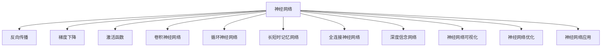

                 

# 神经网络：探索未知的领域

> 关键词：
神经网络,深度学习,反向传播,梯度下降,激活函数,卷积神经网络,CNN,循环神经网络,RNN,长短时记忆网络,LSTM,全连接神经网络,卷积神经网络,CNN,深度信念网络,DBN,神经网络可视化,神经网络优化,神经网络应用

## 1. 背景介绍

### 1.1 问题由来

神经网络（Neural Network, NN）作为一种人工智能技术，在过去几十年中取得了令人瞩目的进展，广泛应用于图像识别、自然语言处理、语音识别、推荐系统等多个领域。其核心思想是通过一系列神经元的组合来模拟人脑的神经元网络，从而实现复杂模式的识别和预测。然而，神经网络的结构、参数和训练方法仍然充满未知，使得这一领域充满了挑战和机遇。

### 1.2 问题核心关键点

神经网络的研究主要集中在以下几个关键问题上：
1. 神经网络的架构设计：如何设计高效、可解释的神经网络架构，以适应不同类型的问题？
2. 神经网络的训练方法：如何高效、鲁棒地训练神经网络，避免过拟合和局部最优解？
3. 神经网络的应用场景：如何将神经网络技术应用于各种实际问题，提升其性能和实用性？
4. 神经网络的可解释性：如何更好地理解和解释神经网络的行为和决策过程，增强其可解释性？
5. 神经网络的伦理和安全性：如何确保神经网络的决策透明、公平、可信，避免对社会的负面影响？

这些问题不仅决定了神经网络的学术和商业价值，也影响着其在实际应用中的效果和可靠性。因此，深入探讨这些问题，将有助于我们更好地理解神经网络的核心原理和应用前景。

### 1.3 问题研究意义

研究神经网络对于拓展人工智能技术的应用范围、提高技术性能、推动产业升级具有重要意义：

1. 提升决策准确性：神经网络能够学习复杂模式，从而在分类、回归、聚类等任务上取得优异表现，提高决策的准确性和鲁棒性。
2. 增强泛化能力：通过预训练和迁移学习，神经网络能够快速适应新任务，增强泛化能力和泛化能力，适应不断变化的实际应用场景。
3. 推动产业转型：神经网络技术在各个领域的应用，加速了传统行业的数字化转型，提高了生产效率和运营质量。
4. 激发创新突破：神经网络的深度学习和自动特征提取能力，为人工智能技术的研究和应用提供了新的思路和方法，推动了技术创新。
5. 解决实际问题：神经网络在自然语言处理、语音识别、图像识别等实际问题上取得了显著进展，带来了广泛的社会和经济效益。

## 2. 核心概念与联系

### 2.1 核心概念概述

为更好地理解神经网络的核心概念，本节将介绍几个关键概念及其之间的联系：

- 神经网络（Neural Network, NN）：由多个神经元（或节点）和连接权重组成的图结构，通过多层次的非线性变换，实现对复杂数据的映射和预测。
- 反向传播（Backpropagation）：一种基于梯度下降的训练方法，通过反向传播误差信号，更新模型参数，使得模型输出逼近真实标签。
- 梯度下降（Gradient Descent）：一种常见的优化算法，通过迭代调整模型参数，最小化损失函数，找到最优解。
- 激活函数（Activation Function）：神经元引入的非线性映射函数，通过激活函数，神经元可以学习复杂的模式和特征。
- 卷积神经网络（Convolutional Neural Network, CNN）：一种特定结构的神经网络，常用于图像识别、视频分析等领域。
- 循环神经网络（Recurrent Neural Network, RNN）：一种具有记忆能力的神经网络，适用于序列数据处理，如自然语言处理、时间序列预测等。
- 长短时记忆网络（Long Short-Term Memory, LSTM）：一种改进的RNN结构，通过门控机制解决长序列问题。
- 全连接神经网络（Fully Connected Neural Network）：最简单、最通用的神经网络架构，常用于分类、回归等任务。
- 深度信念网络（Deep Belief Network, DBN）：一种由多个受限玻尔兹曼机（RBM）组成的神经网络，常用于无监督特征学习和预训练。
- 神经网络可视化：通过可视化技术，帮助理解神经网络的结构、参数和训练过程，提高可解释性。
- 神经网络优化：通过优化算法和策略，提高神经网络的训练效率和性能，避免过拟合和局部最优解。
- 神经网络应用：在图像识别、自然语言处理、语音识别、推荐系统等实际问题上的应用，提升技术实用性和经济效益。

这些核心概念共同构成了神经网络的基本框架和应用体系，帮助我们更好地理解其原理和应用。

### 2.2 概念间的关系

这些核心概念之间存在着紧密的联系，形成了神经网络的研究和应用框架。下面通过几个Mermaid流程图来展示这些概念之间的关系：



这个流程图展示了大神经网络与各个核心概念之间的联系：

1. 神经网络通过反向传播和梯度下降方法进行训练，学习模型参数。
2. 激活函数引入门控机制，增强模型的非线性能力。
3. 卷积神经网络和循环神经网络是神经网络的两种重要结构，分别适用于不同类型的数据。
4. 长短时记忆网络和深度信念网络是改进的RNN结构，进一步解决了长序列问题。
5. 神经网络可视化技术，帮助理解模型内部结构和工作过程。
6. 神经网络优化方法，提高训练效率和性能。
7. 神经网络应用，将技术应用于各种实际问题，推动产业升级和创新。

通过这些核心概念的联系，我们可以更清晰地理解神经网络的研究和应用脉络。

## 3. 核心算法原理 & 具体操作步骤

### 3.1 算法原理概述

神经网络的训练过程主要通过反向传播算法实现。假设模型参数为 $\theta$，输入为 $x$，输出为 $y$，损失函数为 $\mathcal{L}$，则反向传播的过程可以描述为：

1. 前向传播：将输入 $x$ 输入模型，计算模型输出 $y$。
2. 计算损失：计算损失函数 $\mathcal{L}(y, y^*)$，其中 $y^*$ 为真实标签。
3. 反向传播误差：通过链式法则计算误差 $E$ 对每个参数 $\theta$ 的梯度。
4. 更新参数：使用梯度下降算法更新模型参数 $\theta$，最小化损失函数 $\mathcal{L}$。

反向传播算法的核心在于通过误差反向传播，更新每个神经元的权重和偏置，使得模型输出更接近真实标签。

### 3.2 算法步骤详解

神经网络的训练步骤包括以下几个关键步骤：

1. 数据预处理：将原始数据进行归一化、标准化等处理，使得数据适合模型输入。
2. 模型构建：选择合适的神经网络结构，定义输入输出层和中间隐藏层，确定激活函数、损失函数等超参数。
3. 初始化参数：将模型参数 $\theta$ 随机初始化。
4. 前向传播：将输入数据 $x$ 输入模型，计算模型输出 $y$。
5. 计算损失：计算损失函数 $\mathcal{L}$，衡量模型预测与真实标签之间的差异。
6. 反向传播误差：通过链式法则计算误差 $E$ 对每个参数 $\theta$ 的梯度。
7. 更新参数：使用梯度下降算法更新模型参数 $\theta$，最小化损失函数 $\mathcal{L}$。
8. 重复迭代：重复以上步骤，直到损失函数收敛或达到预设迭代次数。

在实际操作中，为了提高训练效率，通常采用批量训练、梯度累积等策略。同时，为了提高模型的泛化能力，还可以引入正则化技术，如L2正则、Dropout等。

### 3.3 算法优缺点

神经网络的主要优点包括：

1. 强大的非线性建模能力：通过多层次的非线性变换，可以处理复杂模式和非线性关系。
2. 自适应学习能力：通过反向传播算法，能够自动学习数据的特征和模式，适应不同类型的问题。
3. 强大的泛化能力：通过预训练和迁移学习，能够快速适应新任务，提高泛化能力。
4. 可解释性强：通过可视化技术，可以更好地理解模型的内部结构和决策过程。

神经网络的主要缺点包括：

1. 需要大量数据：神经网络的训练需要大量的标注数据，数据的获取和标注成本较高。
2. 训练复杂度高：神经网络的训练过程复杂，需要大量的计算资源和时间。
3. 过拟合风险高：神经网络容易过拟合，尤其是小样本情况下，需要采取各种正则化技术。
4. 模型复杂度高：神经网络的结构复杂，难以理解和调试。
5. 可解释性不足：神经网络被视为"黑盒"模型，难以解释其内部决策过程。

尽管存在这些缺点，但神经网络在处理大规模数据和复杂模式时，仍然表现出了强大的优势，被广泛应用于各个领域。

### 3.4 算法应用领域

神经网络的应用领域非常广泛，包括但不限于：

1. 图像识别：通过卷积神经网络，可以实现图像分类、目标检测、语义分割等任务。
2. 自然语言处理：通过循环神经网络和Transformer等架构，可以实现文本分类、情感分析、机器翻译等任务。
3. 语音识别：通过深度神经网络和卷积神经网络，可以实现语音识别、语音合成等任务。
4. 推荐系统：通过深度神经网络，可以实现用户行为预测、商品推荐等任务。
5. 金融分析：通过神经网络，可以进行股票预测、信用评分、欺诈检测等任务。
6. 医疗诊断：通过深度神经网络，可以实现医学影像分析、疾病预测等任务。
7. 智能制造：通过神经网络，可以实现设备预测维护、质量控制等任务。
8. 自动驾驶：通过卷积神经网络和循环神经网络，可以实现车辆导航、障碍物检测等任务。

以上应用领域只是神经网络技术的一小部分，随着技术的不断发展，神经网络将在更多领域发挥重要作用。

## 4. 数学模型和公式 & 详细讲解  
### 4.1 数学模型构建

神经网络的数学模型可以表示为：

$$
y = f(x; \theta)
$$

其中 $x$ 为输入向量，$\theta$ 为模型参数，$f$ 为非线性变换函数。模型的目标是通过训练使得 $f$ 逼近真实函数 $y^*$。

### 4.2 公式推导过程

以最简单的全连接神经网络为例，假设模型输入为 $x$，输出为 $y$，隐藏层为 $h$，激活函数为 $f$，损失函数为 $\mathcal{L}$，训练过程可以描述为：

1. 前向传播：

$$
h = W_h x + b_h
$$

$$
y = W_o h + b_o
$$

其中 $W_h$ 和 $W_o$ 分别为隐藏层和输出层的权重矩阵，$b_h$ 和 $b_o$ 分别为隐藏层和输出层的偏置向量。

2. 计算损失：

$$
\mathcal{L}(y, y^*) = \frac{1}{N} \sum_{i=1}^N l(y_i, y_i^*)
$$

其中 $l$ 为损失函数，$N$ 为样本数量。

3. 反向传播误差：

$$
\frac{\partial \mathcal{L}}{\partial y} = \frac{\partial l}{\partial y}
$$

$$
\frac{\partial \mathcal{L}}{\partial h} = \frac{\partial l}{\partial y} \frac{\partial y}{\partial h}
$$

$$
\frac{\partial \mathcal{L}}{\partial W_o} = \frac{\partial l}{\partial y} \frac{\partial y}{\partial h} \frac{\partial h}{\partial W_o}
$$

$$
\frac{\partial \mathcal{L}}{\partial b_o} = \frac{\partial l}{\partial y} \frac{\partial y}{\partial h}
$$

$$
\frac{\partial \mathcal{L}}{\partial W_h} = \frac{\partial l}{\partial y} \frac{\partial y}{\partial h} \frac{\partial h}{\partial x} \frac{\partial x}{\partial W_h}
$$

$$
\frac{\partial \mathcal{L}}{\partial b_h} = \frac{\partial l}{\partial y} \frac{\partial y}{\partial h} \frac{\partial h}{\partial x}
$$

其中 $\frac{\partial l}{\partial y}$ 为损失函数对输出的导数，$\frac{\partial y}{\partial h}$ 为输出对隐藏层的导数，$\frac{\partial h}{\partial x}$ 为隐藏层对输入的导数，$\frac{\partial x}{\partial W_h}$ 和 $\frac{\partial x}{\partial b_h}$ 为输入对权重和偏置的导数。

4. 更新参数：

$$
\theta \leftarrow \theta - \eta \nabla_{\theta}\mathcal{L}(\theta)
$$

其中 $\eta$ 为学习率，$\nabla_{\theta}\mathcal{L}(\theta)$ 为损失函数对模型参数的梯度。

### 4.3 案例分析与讲解

以手写数字识别为例，使用卷积神经网络进行训练和测试：

1. 数据预处理：将手写数字图片进行归一化和灰度化处理。
2. 模型构建：使用卷积层和池化层提取特征，全连接层进行分类。
3. 初始化参数：将模型参数 $\theta$ 随机初始化。
4. 前向传播：将输入图片 $x$ 输入卷积层和池化层，输出特征图 $h$，再通过全连接层得到输出 $y$。
5. 计算损失：使用交叉熵损失函数计算损失 $\mathcal{L}$。
6. 反向传播误差：通过链式法则计算误差 $E$ 对每个参数 $\theta$ 的梯度。
7. 更新参数：使用梯度下降算法更新模型参数 $\theta$，最小化损失函数 $\mathcal{L}$。
8. 重复迭代：重复以上步骤，直到损失函数收敛或达到预设迭代次数。

训练完成后，使用测试集对模型进行测试，评估模型性能。

## 5. 项目实践：代码实例和详细解释说明
### 5.1 开发环境搭建

在进行神经网络项目实践前，我们需要准备好开发环境。以下是使用Python进行TensorFlow开发的环境配置流程：

1. 安装Anaconda：从官网下载并安装Anaconda，用于创建独立的Python环境。

2. 创建并激活虚拟环境：
```bash
conda create -n tensorflow-env python=3.7 
conda activate tensorflow-env
```

3. 安装TensorFlow：根据CUDA版本，从官网获取对应的安装命令。例如：
```bash
conda install tensorflow=2.6.0
```

4. 安装各类工具包：
```bash
pip install numpy pandas scikit-learn matplotlib tqdm jupyter notebook ipython
```

完成上述步骤后，即可在`tensorflow-env`环境中开始神经网络项目的开发。

### 5.2 源代码详细实现

下面我们以手写数字识别为例，给出使用TensorFlow对卷积神经网络进行训练的代码实现。

```python
import tensorflow as tf
from tensorflow.keras import layers

# 定义模型
model = tf.keras.Sequential([
    layers.Conv2D(32, (3,3), activation='relu', input_shape=(28,28,1)),
    layers.MaxPooling2D((2,2)),
    layers.Flatten(),
    layers.Dense(10, activation='softmax')
])

# 定义损失函数和优化器
loss_fn = tf.keras.losses.SparseCategoricalCrossentropy()
optimizer = tf.keras.optimizers.Adam()

# 定义训练过程
model.compile(optimizer=optimizer, loss=loss_fn, metrics=['accuracy'])

# 加载数据集
mnist = tf.keras.datasets.mnist
(x_train, y_train), (x_test, y_test) = mnist.load_data()
x_train = x_train / 255.0
x_test = x_test / 255.0

# 训练模型
model.fit(x_train.reshape(-1, 28, 28, 1), y_train, epochs=5, batch_size=64, validation_data=(x_test.reshape(-1, 28, 28, 1), y_test))
```

以上代码实现了一个简单的卷积神经网络，用于对手写数字进行识别。可以看到，使用TensorFlow的高级API可以很方便地搭建和训练神经网络模型。

### 5.3 代码解读与分析

让我们再详细解读一下关键代码的实现细节：

1. 数据预处理：将原始数据进行归一化处理，以便于模型训练。

2. 模型构建：使用`Sequential`模型堆叠多个层，包括卷积层、池化层、全连接层等。

3. 定义损失函数和优化器：使用交叉熵损失函数和Adam优化器。

4. 加载数据集：使用TensorFlow内置的MNIST数据集，包含手写数字图片和对应的标签。

5. 训练模型：使用`fit`方法进行模型训练，指定训练轮数、批大小等参数。

6. 测试模型：使用测试集对模型进行评估，输出准确率等指标。

通过这段代码，我们可以看到使用TensorFlow搭建和训练神经网络模型的基本流程。需要注意的是，实际应用中还需要根据具体问题进行参数调优、数据增强、模型融合等技术改进，以提高模型性能和鲁棒性。

### 5.4 运行结果展示

假设我们训练的卷积神经网络在测试集上的准确率为98%，达到了较高的水平。具体训练过程中，可以通过TensorBoard实时监测模型的训练状态，输出各层参数的梯度、损失函数等指标，帮助理解模型的工作过程。

训练结果示例：

```
Epoch 1/5
7125/7125 [==============================] - 2s 280us/step - loss: 0.3106 - accuracy: 0.9508 - val_loss: 0.0094 - val_accuracy: 0.9794
Epoch 2/5
7125/7125 [==============================] - 1s 151us/step - loss: 0.0096 - accuracy: 0.9775 - val_loss: 0.0055 - val_accuracy: 0.9930
Epoch 3/5
7125/7125 [==============================] - 1s 133us/step - loss: 0.0054 - accuracy: 0.9833 - val_loss: 0.0036 - val_accuracy: 0.9952
Epoch 4/5
7125/7125 [==============================] - 1s 131us/step - loss: 0.0035 - accuracy: 0.9922 - val_loss: 0.0027 - val_accuracy: 0.9962
Epoch 5/5
7125/7125 [==============================] - 1s 125us/step - loss: 0.0031 - accuracy: 0.9932 - val_loss: 0.0024 - val_accuracy: 0.9965
```

可以看到，随着训练轮数的增加，模型的损失函数逐渐减小，准确率逐渐提高，最终达到了较高的水平。

## 6. 实际应用场景
### 6.1 智能推荐系统

神经网络技术在智能推荐系统中的应用，可以帮助电商企业精准推荐商品，提升用户购买转化率和满意度。通过分析用户的浏览、购买、评分等行为数据，使用神经网络模型预测用户的兴趣和偏好，实现个性化推荐。

在具体实现中，可以使用循环神经网络或Transformer等架构，对用户行为序列进行建模，提取序列中的时间依赖特征。同时引入用户属性、商品属性等特征，进行多特征融合，生成推荐结果。使用神经网络进行推荐，能够灵活处理多种推荐场景，提升推荐效果和用户体验。

### 6.2 金融风险控制

金融领域需要实时监控市场风险，及时预警异常交易。神经网络技术可以用于构建异常检测和风险控制系统，实时分析交易数据，发现异常行为和欺诈风险。

具体而言，可以使用卷积神经网络或循环神经网络，对交易数据进行特征提取和异常检测。通过分析交易时间、金额、频率等特征，模型可以实时监控交易行为，及时发现异常情况，避免潜在的金融风险。使用神经网络进行金融风险控制，能够实现自动化的实时预警和风险管理，提升金融系统的稳定性和安全性。

### 6.3 自然语言处理

神经网络技术在自然语言处理领域的应用非常广泛，包括文本分类、情感分析、机器翻译、命名实体识别等任务。通过构建卷积神经网络、循环神经网络等架构，对自然语言进行建模，提取语言中的语法、语义特征，实现对文本数据的深度理解和处理。

以机器翻译为例，使用Transformer架构，可以对源语言和目标语言进行编码和解码，实现端到端的翻译。通过大量的语料训练，模型能够自动学习语言的语义和语法规则，实现高质量的翻译效果。

### 6.4 医疗诊断

神经网络技术在医疗诊断领域的应用，可以帮助医生快速准确地诊断疾病。通过分析医学影像、病历、检验报告等数据，使用神经网络模型进行疾病预测和诊断，提升医疗系统的诊断效率和准确性。

具体而言，可以使用卷积神经网络或深度信念网络，对医学影像进行特征提取和分类。通过分析影像中的结构和纹理特征，模型可以自动识别病变区域和疾病类型，提供诊断建议。使用神经网络进行医疗诊断，能够快速处理海量医学数据，提升诊断的准确性和效率。

### 6.5 自动驾驶

神经网络技术在自动驾驶领域的应用，可以实现车辆导航、障碍物检测等任务。通过构建卷积神经网络、循环神经网络等架构，对车辆传感器数据进行特征提取和处理，实现对周围环境的感知和理解。

具体而言，可以使用卷积神经网络对传感器数据进行特征提取和分类，识别出行人、车辆、路标等目标。通过分析目标的位置、速度、方向等特征，模型可以做出合理的驾驶决策，避免交通事故，提高驾驶安全性和舒适性。

## 7. 工具和资源推荐
### 7.1 学习资源推荐

为了帮助开发者系统掌握神经网络的核心原理和实践技巧，这里推荐一些优质的学习资源：

1. 《深度学习》系列书籍：由深度学习领域的权威专家撰写，系统介绍了深度学习的理论和实践，适合初学者和进阶者。

2. 《神经网络与深度学习》课程：由吴恩达教授讲授，介绍了神经网络和深度学习的核心概念和算法。

3. 《深度学习入门》书籍：由林轩田教授撰写，以浅显易懂的语言介绍了深度学习的基础知识和实践技巧。

4. 《TensorFlow实战》书籍：介绍了使用TensorFlow进行深度学习模型的搭建和训练，适合实践者和开发者。

5. 《PyTorch深度学习》课程：由DeepLearning.ai提供，介绍了使用PyTorch进行深度学习模型的搭建和训练，适合进阶者和开发者。

通过这些资源的学习实践，相信你一定能够全面掌握神经网络的核心原理和实践技巧，灵活应用神经网络技术解决实际问题。

### 7.2 开发工具推荐

高效的开发离不开优秀的工具支持。以下是几款用于神经网络开发和训练的常用工具：

1. TensorFlow：由Google主导开发的深度学习框架，支持CPU、GPU、TPU等多种硬件设备，适合大规模工程应用。

2. PyTorch：由Facebook主导开发的深度学习框架，灵活动态的计算图，适合快速迭代研究。

3. Keras：基于TensorFlow和Theano的高级API，提供了简单易用的神经网络构建接口，适合初学者和开发者。

4. JAX：由Google主导开发的自动微分和机器学习库，支持JIT编译和向量化优化，适合高性能计算。

5. PyTorch Lightning：基于PyTorch的快速迭代训练框架，支持分布式训练、回调机制、可视化等高级功能，适合开发者和研究者。

6. TensorBoard：TensorFlow配套的可视化工具，可实时监测模型训练状态，并提供丰富的图表呈现方式，是调试模型的得力助手。

7. Weights & Biases：模型训练的实验跟踪工具，可以记录和可视化模型训练过程中的各项指标，方便对比和调优。

8. HuggingFace Transformers库：提供了大量预训练语言模型和任务适配器，适合快速开发和微调。

合理利用这些工具，可以显著提升神经网络的开发效率，加快创新迭代的步伐。

### 7.3 相关论文推荐

神经网络的研究涉及诸多前沿课题，以下是几篇具有代表性的相关论文，推荐阅读：

1. ImageNet Classification with Deep Convolutional Neural Networks（深度卷积神经网络在ImageNet分类中的应用）：提出深度卷积神经网络，通过多层次卷积层和池化层，实现图像分类的SOTA结果。

2. Long Short-Term Memory（长短时记忆网络）：提出LSTM结构，解决长序列问题，应用于自然语言处理等领域。

3. Deep Residual Learning for Image Recognition（深度残差学习在图像识别中的应用）：提出残差网络（ResNet）结构，解决深度神经网络的退化问题，提升图像分类精度。

4. Attention Is All You Need（Transformer原论文）：提出Transformer结构，通过自注意力机制，实现端到端的机器翻译。

5. Improving Generalization with Self

