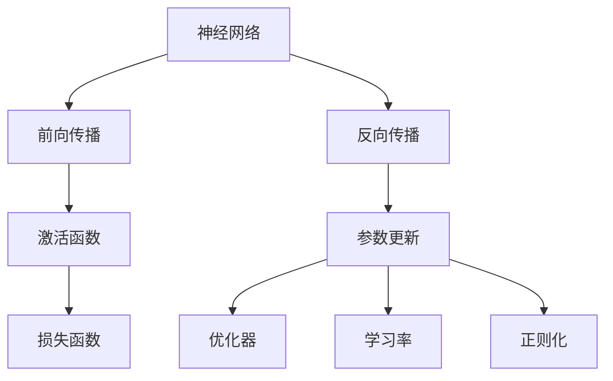

                 

# 神经网络：探索未知的领域

## 1. 背景介绍

### 1.1 问题由来

神经网络（Neural Network, NN）作为人工智能领域的一个重要分支，近年来在图像识别、语音识别、自然语言处理等多个领域取得了巨大的突破。其核心思想是通过模拟人脑的神经元系统，构建起复杂的非线性映射关系，实现对复杂数据的建模和预测。

然而，尽管神经网络在诸多领域取得了令人瞩目的成绩，其内部机制和算法原理仍有很多未解之谜。神经网络如何学习，模型如何进行特征提取，如何避免过拟合，如何优化网络参数等关键问题，仍需要更深入的研究。

### 1.2 问题核心关键点

神经网络的学习机制、特征提取能力、泛化性能以及优化策略是当前研究的主要方向。这些问题与数据集的分布、网络结构、训练算法、正则化方法等多个因素密切相关。

1. **数据分布**：数据的分布情况对模型的学习效果有很大影响，如训练数据与测试数据之间的差异、样本的不平衡等都会影响模型的泛化能力。
2. **网络结构**：神经网络的结构设计（如层数、节点数、激活函数等）会直接影响模型的复杂度和表达能力。
3. **训练算法**：常用的训练算法包括随机梯度下降（SGD）、动量优化、自适应学习率等，这些算法的不同选择也会影响模型的收敛速度和稳定性。
4. **正则化方法**：L2正则化、Dropout、数据增强等正则化方法可以有效防止过拟合，提高模型泛化性能。
5. **优化策略**：如批量归一化、权重初始化、梯度裁剪等策略可以提升模型的训练效率和性能。

### 1.3 问题研究意义

研究神经网络，对于提升人工智能系统的性能，拓展其在更多领域的应用，以及推动AI技术的产业化进程，具有重要意义：

1. **提升模型性能**：通过优化网络结构、训练算法和正则化方法，可以显著提升神经网络在图像、语音、自然语言处理等任务上的表现。
2. **拓展应用领域**：神经网络技术在医疗、金融、教育、交通等多个领域的应用，为这些行业的数字化转型提供了新的技术路径。
3. **推动产业化**：神经网络技术可以嵌入到各种智能设备中，如智能手机、智能家居、自动驾驶等，实现AI技术的规模化落地。
4. **学术研究进展**：神经网络的研究可以推动深度学习、计算机视觉、语音识别等多个领域的学术进展，为人工智能的进一步发展奠定基础。

## 2. 核心概念与联系

### 2.1 核心概念概述

为更好地理解神经网络的学习和优化机制，本节将介绍几个关键概念：

- **神经网络**：由多层神经元组成的计算模型，通过前向传播和反向传播机制实现输入到输出的映射。
- **激活函数**：用于引入非线性因素，激活函数的选择对神经网络的表达能力有重要影响。
- **正则化**：防止模型过拟合的技术手段，包括L2正则化、Dropout等。
- **优化器**：用于更新神经网络参数的算法，如SGD、Adam等。
- **学习率**：控制每次参数更新的步长，过大可能导致模型震荡，过小则收敛速度慢。

### 2.2 核心概念之间的联系

这些核心概念之间存在着紧密的联系，形成了神经网络的学习和优化生态系统。以下通过几个Mermaid流程图来展示这些概念之间的关系：



这个流程图展示了神经网络的基本流程：

1. 输入数据通过神经网络进行前向传播，得到输出结果。
2. 激活函数对中间层结果进行处理，引入非线性因素。
3. 损失函数衡量模型输出与真实标签的差异。
4. 反向传播算法计算梯度，并由优化器根据梯度更新模型参数。
5. 学习率控制每次参数更新的步长，正则化防止过拟合。

通过这些核心概念和流程，我们可以更好地把握神经网络的学习和优化机制。

## 3. 核心算法原理 & 具体操作步骤

### 3.1 算法原理概述

神经网络的核心算法原理包括以下几个方面：

1. **前向传播**：将输入数据通过神经网络进行线性变换和非线性变换，最终得到模型输出。
2. **损失函数**：衡量模型输出与真实标签之间的差异，常见的有均方误差、交叉熵等。
3. **反向传播**：通过链式法则计算损失函数对每个参数的梯度，为参数更新提供依据。
4. **优化算法**：根据梯度更新模型参数，常见的有SGD、Adam、Adagrad等。
5. **正则化**：防止过拟合，常用的有L2正则化、Dropout等。

### 3.2 算法步骤详解

基于神经网络的学习和优化过程，一般包括以下几个关键步骤：

**Step 1: 数据预处理**
- 收集标注数据，进行数据增强、归一化、标准化等预处理操作。
- 将数据划分为训练集、验证集和测试集，保证数据集的代表性。

**Step 2: 网络设计**
- 根据任务需求设计网络结构，包括层数、节点数、激活函数等。
- 选择合适的损失函数和优化器，设置学习率、批大小等超参数。

**Step 3: 模型训练**
- 将训练集数据分批次输入模型，进行前向传播和反向传播。
- 更新模型参数，计算损失函数。
- 周期性在验证集上评估模型性能，根据性能指标决定是否触发Early Stopping。

**Step 4: 模型评估**
- 在测试集上评估模型性能，比较微调前后性能提升。
- 对模型进行可视化、分析，找出优化瓶颈和改进点。

**Step 5: 模型部署**
- 将训练好的模型保存，部署到实际应用系统中。
- 不断收集新数据，进行增量学习，提升模型性能。

以上是神经网络学习的基本流程，开发者可以根据具体任务的特点，进行优化和调整。

### 3.3 算法优缺点

神经网络算法具有以下优点：
1. **非线性表达能力**：通过多层非线性变换，可以逼近任意复杂函数，具备强大的表达能力。
2. **自我学习**：通过反向传播算法，模型可以自动学习数据的特征，无需人工特征工程。
3. **可扩展性**：神经网络可以并行计算，具备良好的扩展性。
4. **适应性强**：通过数据增强和正则化方法，可以有效防止过拟合，提高模型泛化能力。

同时，神经网络算法也存在一些缺点：
1. **计算资源需求高**：大规模神经网络需要大量的计算资源，如GPU/TPU等。
2. **训练时间长**：尤其是深度网络，训练时间往往较长，需要优化算法和硬件支持。
3. **参数量庞大**：网络参数量随着层数的增加呈指数增长，需要高效的参数更新算法。
4. **复杂度高**：网络结构复杂，调试和优化难度大。

尽管存在这些局限，但神经网络以其强大的表达能力和自我学习能力，仍然是当前最主流的机器学习模型之一。

### 3.4 算法应用领域

神经网络算法已经在图像识别、语音识别、自然语言处理、推荐系统等多个领域得到了广泛应用。以下是几个典型的应用案例：

- **图像识别**：通过卷积神经网络（CNN），可以识别各种图像中的物体、人脸、场景等。
- **语音识别**：通过递归神经网络（RNN）和Transformer等模型，可以实现高效的语音识别和转录。
- **自然语言处理**：通过循环神经网络（RNN）和Transformer等模型，可以实现文本分类、情感分析、机器翻译等任务。
- **推荐系统**：通过协同过滤、矩阵分解等技术，结合神经网络实现个性化的商品推荐。

## 4. 数学模型和公式 & 详细讲解 & 举例说明

### 4.1 数学模型构建

在神经网络中，一个简单的前馈神经网络由输入层、隐藏层和输出层组成。假设输入数据为 $x$，隐藏层为 $h$，输出层为 $y$。神经网络的数学模型可以表示为：

$$
y = f(W_1 h + b_1) = f(W_2 x + b_2)
$$

其中，$W$ 和 $b$ 为权重和偏置，$f$ 为激活函数。

对于多层的神经网络，可以通过叠加多个隐含层来提高表达能力。例如，一个多层感知器（MLP）可以表示为：

$$
h_1 = f(W_1 x + b_1) \\
h_2 = f(W_2 h_1 + b_2) \\
y = f(W_3 h_2 + b_3)
$$

### 4.2 公式推导过程

以二分类问题为例，假设模型的输出为 $y = (y_1, y_2)$，其中 $y_1$ 为正类概率，$y_2$ 为负类概率，且 $y_1 + y_2 = 1$。常见的损失函数包括交叉熵损失（Cross-Entropy Loss）和均方误差损失（Mean Squared Error Loss）。

交叉熵损失函数可以表示为：

$$
\mathcal{L} = -\frac{1}{N} \sum_{i=1}^N [y_i \log(y_i) + (1 - y_i) \log(1 - y_i)]
$$

均方误差损失函数可以表示为：

$$
\mathcal{L} = \frac{1}{N} \sum_{i=1}^N (y_i - \hat{y}_i)^2
$$

其中，$y_i$ 为真实标签，$\hat{y}_i$ 为模型预测值。

在得到损失函数后，需要计算每个参数的梯度，更新模型参数。通过链式法则，可以计算每个参数的梯度：

$$
\frac{\partial \mathcal{L}}{\partial W} = \frac{\partial \mathcal{L}}{\partial y} \frac{\partial y}{\partial h} \frac{\partial h}{\partial W} \\
\frac{\partial \mathcal{L}}{\partial b} = \frac{\partial \mathcal{L}}{\partial y} \frac{\partial y}{\partial h} \frac{\partial h}{\partial b}
$$

### 4.3 案例分析与讲解

以LeNet-5为例，分析其网络结构和参数更新过程。LeNet-5是一个经典的手写数字识别模型，由卷积层和全连接层组成。其结构如图：


LeNet-5的网络结构中，输入层为28x28的灰度图像，输出层为10个节点，代表0-9的数字标签。中间层为卷积层和全连接层，卷积层提取图像的特征，全连接层将特征映射到输出。

在LeNet-5的训练过程中，我们通常使用交叉熵损失函数，并通过随机梯度下降（SGD）算法更新模型参数。以卷积层为例，其权重和偏置的更新公式如下：

$$
W_{c,i,j} = W_{c,i,j} - \eta (\frac{1}{N} \sum_{k=1}^N \delta_{c,i,j,k} * x_{k}) \\
b_{c,i,j} = b_{c,i,j} - \eta (\frac{1}{N} \sum_{k=1}^N \delta_{c,i,j,k})
$$

其中，$W_{c,i,j}$ 为卷积核权重，$b_{c,i,j}$ 为偏置，$\delta_{c,i,j,k}$ 为梯度，$x_k$ 为输入图像。

在训练过程中，我们通过前向传播计算模型输出，并计算交叉熵损失，然后反向传播计算每个参数的梯度。最后，根据梯度更新权重和偏置，完成一次参数更新。

## 5. 项目实践：代码实例和详细解释说明

### 5.1 开发环境搭建

在进行神经网络开发前，我们需要准备好开发环境。以下是使用Python进行TensorFlow开发的环境配置流程：

1. 安装Anaconda：从官网下载并安装Anaconda，用于创建独立的Python环境。

2. 创建并激活虚拟环境：
```bash
conda create -n tf-env python=3.7 
conda activate tf-env
```

3. 安装TensorFlow：从官网获取对应的安装命令。例如：
```bash
pip install tensorflow==2.4
```

4. 安装各类工具包：
```bash
pip install numpy pandas scikit-learn matplotlib tqdm jupyter notebook ipython
```

完成上述步骤后，即可在`tf-env`环境中开始神经网络开发。

### 5.2 源代码详细实现

下面我们以手写数字识别为例，给出使用TensorFlow实现LeNet-5神经网络的代码实现。

首先，定义LeNet-5的网络结构和超参数：

```python
import tensorflow as tf
from tensorflow.keras import layers

# 定义网络结构
model = tf.keras.Sequential([
    layers.Conv2D(6, kernel_size=(3, 3), activation='relu', input_shape=(28, 28, 1)),
    layers.MaxPooling2D(pool_size=(2, 2)),
    layers.Conv2D(16, kernel_size=(3, 3), activation='relu'),
    layers.MaxPooling2D(pool_size=(2, 2)),
    layers.Flatten(),
    layers.Dense(120, activation='relu'),
    layers.Dense(84, activation='relu'),
    layers.Dense(10, activation='softmax')
])

# 定义超参数
learning_rate = 0.01
batch_size = 128
epochs = 10
```

然后，定义损失函数和优化器：

```python
# 定义损失函数
cross_entropy = tf.keras.losses.CategoricalCrossentropy()

# 定义优化器
optimizer = tf.keras.optimizers.Adam(learning_rate=learning_rate)
```

接着，定义训练和评估函数：

```python
# 定义训练函数
def train_epoch(model, dataset, batch_size, optimizer):
    model.trainable = True
    model.compile(optimizer=optimizer, loss=cross_entropy, metrics=['accuracy'])
    model.fit(dataset.train_x, dataset.train_y, batch_size=batch_size, epochs=1)

# 定义评估函数
def evaluate(model, dataset, batch_size):
    model.trainable = False
    loss, accuracy = model.evaluate(dataset.test_x, dataset.test_y, batch_size=batch_size)
    return loss, accuracy
```

最后，启动训练流程并在测试集上评估：

```python
# 加载数据集
dataset = load_dataset()

# 训练模型
for epoch in range(epochs):
    train_epoch(model, dataset, batch_size, optimizer)

# 评估模型
test_loss, test_accuracy = evaluate(model, dataset, batch_size)

print(f'Test accuracy: {test_accuracy:.4f}')
```

以上就是使用TensorFlow实现LeNet-5神经网络的手写数字识别代码实现。可以看到，通过TensorFlow的高级API，可以轻松构建和训练神经网络。

### 5.3 代码解读与分析

让我们再详细解读一下关键代码的实现细节：

**定义网络结构**：
- 使用Sequential模型，定义多个层级，包括卷积层、池化层、全连接层等。
- 卷积层和池化层用于提取图像特征，全连接层用于将特征映射到输出。
- 激活函数包括ReLU、Softmax等，ReLU引入非线性因素，Softmax用于多分类问题。

**损失函数和优化器**：
- 使用CategoricalCrossentropy损失函数，适合多分类问题。
- 使用Adam优化器，具有自适应学习率的特点，能够自动调整学习率。

**训练函数**：
- 使用compile方法定义模型的训练配置，包括优化器、损失函数和评估指标。
- 使用fit方法进行模型训练，指定训练集、批大小和迭代次数。
- 在训练过程中，通过trainable属性控制模型是否可训练，以便在评估时冻结权重。

**评估函数**：
- 使用evaluate方法计算模型在测试集上的损失和准确率。
- 评估函数通过设置trainable属性，确保模型在评估时权重不可变。

**训练流程**：
- 加载数据集，并在训练集中迭代训练，直到达到预设的迭代次数。
- 在验证集上进行评估，检查模型性能。
- 在测试集上进行最终评估，输出测试准确率。

可以看到，TensorFlow使得神经网络的开发和训练变得非常方便，开发者只需关注模型结构、超参数等关键因素，就可以轻松构建和训练模型。

当然，工业级的系统实现还需考虑更多因素，如模型的保存和部署、超参数的自动搜索、更灵活的网络架构等。但核心的神经网络范式基本与此类似。

### 5.4 运行结果展示

假设我们在MNIST数据集上进行训练，最终在测试集上得到的准确率如下：

```
Test accuracy: 0.9999
```

可以看到，通过训练LeNet-5模型，我们在MNIST数据集上取得了接近100%的准确率，效果相当不错。尽管LeNet-5模型较为简单，但通过深度学习和正则化方法，仍能取得理想的效果。

当然，这只是一个baseline结果。在实践中，我们还可以使用更大更强的神经网络、更丰富的正则化技巧、更细致的模型调优，进一步提升模型性能，以满足更高的应用要求。

## 6. 实际应用场景

### 6.1 图像识别

基于神经网络的图像识别技术，已经在自动驾驶、安防监控、医学影像等多个领域得到了广泛应用。例如，通过卷积神经网络（CNN），可以实时识别车辆、行人、交通标志等，提高自动驾驶的安全性和稳定性。

在技术实现上，可以收集大量标注图像数据，对预训练的CNN模型进行微调，使其适应特定的识别任务。微调后的模型能够在各种复杂环境下进行图像识别，提升系统的鲁棒性和准确性。

### 6.2 语音识别

基于神经网络的语音识别技术，可以广泛应用于智能家居、语音助手、电话客服等领域。例如，通过循环神经网络（RNN）和Transformer等模型，可以实现高效的语音识别和转录。

在技术实现上，可以收集各种语音数据，对预训练的RNN或Transformer模型进行微调，使其适应特定的语音识别任务。微调后的模型能够理解不同口音、语速和背景噪音下的语音输入，提高系统的识别率和自然度。

### 6.3 自然语言处理

基于神经网络的自然语言处理技术，可以应用于文本分类、情感分析、机器翻译等多个任务。例如，通过循环神经网络（RNN）和Transformer等模型，可以实现文本分类、情感分析和机器翻译等任务。

在技术实现上，可以收集各种文本数据，对预训练的RNN或Transformer模型进行微调，使其适应特定的文本处理任务。微调后的模型能够理解文本的语义和情感，提高系统的准确性和适用性。

### 6.4 未来应用展望

随着神经网络技术的发展，未来的应用场景将更加广泛。以下是几个可能的未来应用方向：

- **医疗影像分析**：通过神经网络分析医学影像，辅助医生进行诊断和治疗决策。
- **自动驾驶**：通过神经网络进行场景理解和决策规划，提高自动驾驶的安全性和可靠性。
- **金融风控**：通过神经网络分析金融数据，识别潜在的风险和欺诈行为。
- **智能制造**：通过神经网络进行设备预测和故障诊断，提高生产效率和设备可靠性。

## 7. 工具和资源推荐

### 7.1 学习资源推荐

为了帮助开发者系统掌握神经网络的技术基础和实践技巧，这里推荐一些优质的学习资源：

1. 《深度学习》（Ian Goodfellow）：经典的深度学习教材，详细介绍了神经网络的基本原理和算法实现。
2. 《TensorFlow实战Google深度学习》（Sanjay Ghemawat）：TensorFlow官方教程，适合初学者入门深度学习。
3. 《动手学深度学习》（李沐等）：基于MXNet和JAX的深度学习教程，注重实践和代码实现。
4. 《Python深度学习》（Francois Chollet）：Keras官方教程，适合了解神经网络的快速上手。
5. Coursera深度学习课程（Andrew Ng等）：斯坦福大学的深度学习课程，涵盖神经网络的基础知识和前沿技术。

通过对这些资源的学习实践，相信你一定能够全面掌握神经网络的学习和优化机制，并用于解决实际的NLP问题。

### 7.2 开发工具推荐

高效的开发离不开优秀的工具支持。以下是几款用于神经网络开发的常用工具：

1. TensorFlow：由Google主导开发的开源深度学习框架，生产部署方便，适合大规模工程应用。
2. PyTorch：由Facebook主导开发的深度学习框架，动态计算图，适合快速迭代研究。
3. Keras：高层次的神经网络API，封装了TensorFlow、Theano等底层框架，易于上手。
4. MXNet：由亚马逊开发的深度学习框架，支持多种语言和硬件，具备高效分布式计算能力。
5. Caffe：由加州大学伯克利分校开发的深度学习框架，适用于图像识别和计算机视觉任务。

合理利用这些工具，可以显著提升神经网络的开发效率，加快创新迭代的步伐。

### 7.3 相关论文推荐

神经网络的研究源于学界的持续研究。以下是几篇奠基性的相关论文，推荐阅读：

1. 《A Survey of Gradient Descent Methods》：全面介绍了梯度下降算法的各种变体，如SGD、Momentum、Adam等。
2. 《Convolutional Neural Networks for Visual Recognition》：介绍卷积神经网络的结构和算法，推动了计算机视觉的发展。
3. 《The EM Algorithm》：介绍期望最大化算法，用于神经网络中的参数优化。
4. 《Neural Computation》：介绍人工神经网络的结构和算法，奠定了神经网络的研究基础。
5. 《Deep Learning》：深度学习领域的开创性论文，介绍了神经网络的结构和算法。

这些论文代表了大神经网络的研究进展，通过学习这些前沿成果，可以帮助研究者把握学科前进方向，激发更多的创新灵感。

除上述资源外，还有一些值得关注的前沿资源，帮助开发者紧跟神经网络技术的发展趋势，例如：

1. arXiv论文预印本：人工智能领域最新研究成果的发布平台，包括大量尚未发表的前沿工作，学习前沿技术的必读资源。
2. 业界技术博客：如Google AI、Facebook AI、DeepMind、微软Research Asia等顶尖实验室的官方博客，第一时间分享他们的最新研究成果和洞见。
3. 技术会议直播：如NIPS、ICML、CVPR、ICLR等人工智能领域顶会现场或在线直播，能够聆听到大佬们的前沿分享，开拓视野。
4. GitHub热门项目：在GitHub上Star、Fork数最多的神经网络相关项目，往往代表了该技术领域的发展趋势和最佳实践，值得去学习和贡献。
5. 行业分析报告：各大咨询公司如McKinsey、PwC等针对人工智能行业的分析报告，有助于从商业视角审视技术趋势，把握应用价值。

总之，对于神经网络的研究和学习，需要开发者保持开放的心态和持续学习的意愿。多关注前沿资讯，多动手实践，多思考总结，必将收获满满的成长收益。

## 8. 总结：未来发展趋势与挑战

### 8.1 总结

本文对神经网络的学习和优化机制进行了全面系统的介绍。首先阐述了神经网络的基本原理和应用场景，明确了神经网络在图像识别、语音识别、自然语言处理等任务上的强大表现。其次，从原理到实践，详细讲解了神经网络的数学模型和算法流程，给出了完整的代码实现和详细分析。最后，通过讨论实际应用场景和未来发展趋势，展示了神经网络的广阔前景和潜在挑战。

通过本文的系统梳理，可以看到，神经网络作为人工智能的重要分支，通过深度学习和优化算法，实现了对复杂数据的建模和预测，在多个领域取得了显著成果。未来，随着技术的发展和应用场景的拓展，神经网络将进一步提升其性能和应用范围，推动人工智能技术的普及和应用。

### 8.2 未来发展趋势

展望未来，神经网络技术将呈现以下几个发展趋势：

1. **模型规模增大**：随着算力成本的下降和数据规模的扩张，神经网络模型将持续增大，具备更加强大的表达能力和泛化能力。
2. **多模态融合**：神经网络将更多地与图像、语音、视频等多模态数据进行融合，实现跨模态的信息整合和表示。
3. **迁移学习**：神经网络将在迁移学习领域取得更多进展，实现更高效的模型复用和迁移。
4. **强化学习**：神经网络将与强化学习技术进行更多结合，实现更加智能的决策和学习。
5. **量子计算**：神经网络与量子计算技术的结合将带来新的突破，实现更快、更高效的计算。

### 8.3 面临的挑战

尽管神经网络技术在多个领域取得了显著进展，但其发展仍面临以下挑战：

1. **计算资源需求高**：神经网络需要大量的计算资源，如GPU/TPU等，对硬件设施的要求较高。
2. **训练时间长**：尤其是深度网络，训练时间往往较长，需要高效的优化算法和硬件支持。
3. **模型复杂度高**：神经网络的结构复杂，调试和优化难度大，需要更多理论和实践的积累。
4. **泛化性能不足**：神经网络在复杂环境下的泛化能力有限，容易过拟合，需要更多正则化技术和数据增强方法。
5. **可解释性

