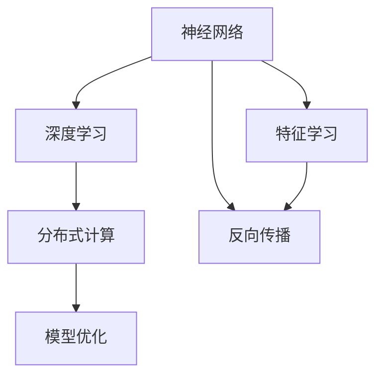
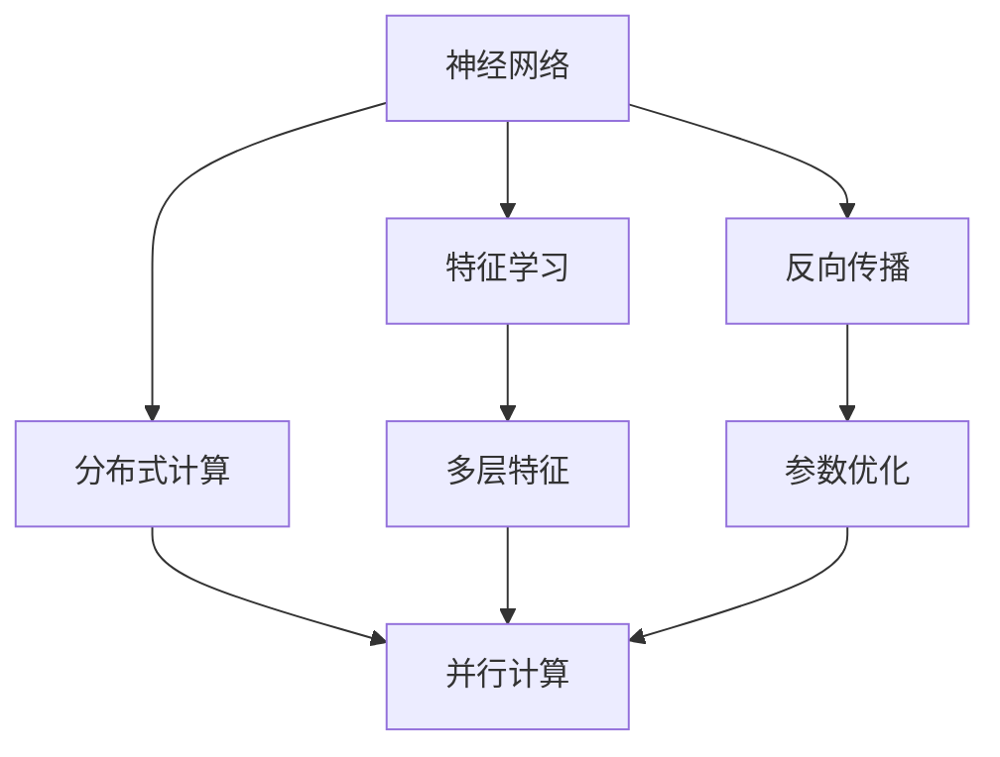
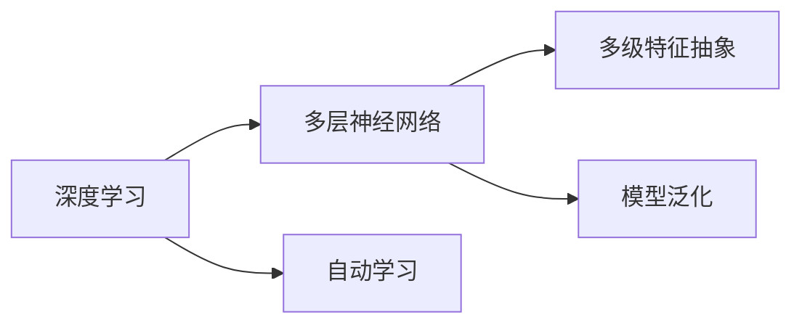
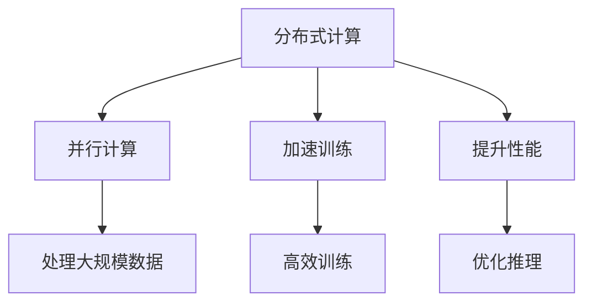
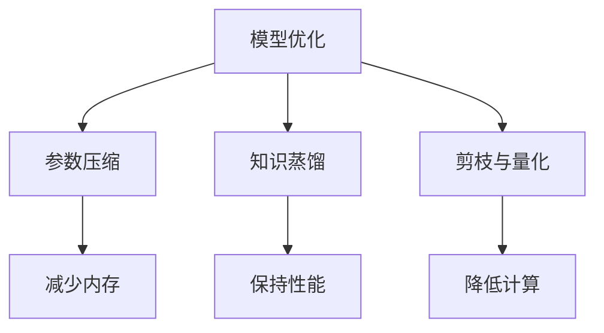
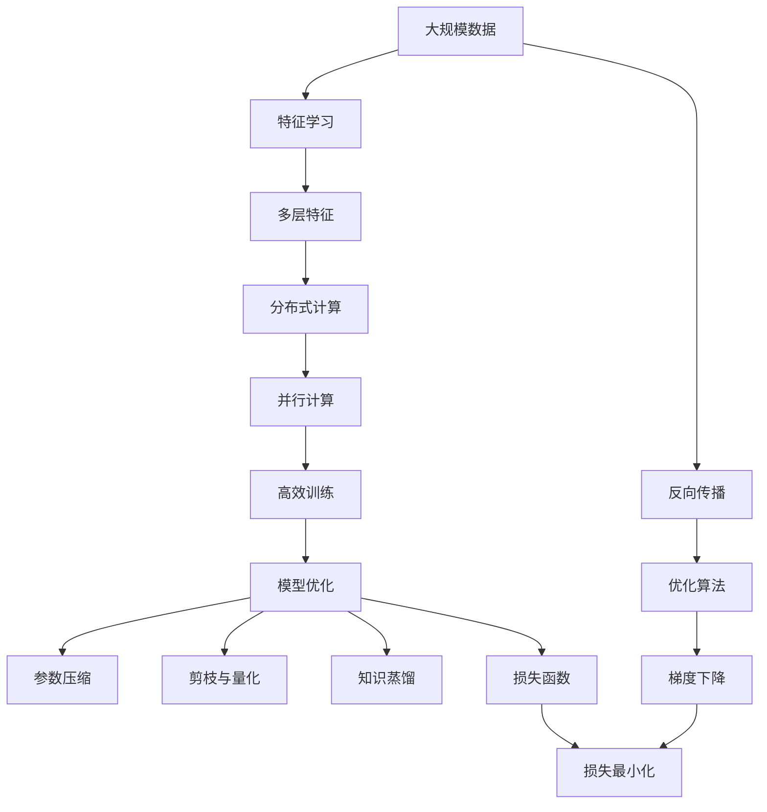

                 

# 神经网络：改变世界的技术

> 关键词：神经网络,深度学习,机器学习,人工智能,计算复杂度,分布式计算,模型优化

## 1. 背景介绍

### 1.1 问题由来
随着人工智能技术的飞速发展，深度学习特别是神经网络技术逐渐成为了推动各行业变革的核心驱动力。从图像识别到自然语言处理，从医疗诊断到自动驾驶，神经网络的应用场景越来越广泛，其性能也越来越强大。本文旨在深入探讨神经网络技术的原理、发展历程及未来趋势，并结合实际应用案例，展示神经网络是如何彻底改变世界的。

### 1.2 问题核心关键点
神经网络是一种模拟人类神经系统的计算模型，通过多层非线性变换，可以从大量数据中自动学习特征表示，进而进行模式识别、分类、回归等任务。其核心关键点包括：

- 神经元（Neuron）：构成神经网络的基本单元，每个神经元接收多个输入信号，并输出一个加权和的结果。
- 激活函数（Activation Function）：用于引入非线性因素，增强神经网络的表现力。
- 权重（Weight）和偏置（Bias）：神经元之间的连接强度和固定偏移量。
- 反向传播（Backpropagation）：用于优化神经网络参数的一种算法。
- 梯度下降（Gradient Descent）：一种常见的优化算法，用于最小化损失函数。

### 1.3 问题研究意义
研究神经网络技术，对于推动人工智能领域的发展，提升各行业智能化水平，具有重要意义：

1. 提供新的问题解决方式：神经网络通过自动学习特征，可以有效处理复杂、非线性的数据分布，解决传统方法难以应对的问题。
2. 提高数据利用效率：神经网络可以从大规模数据中提取有效的特征表示，大幅提升数据利用效率。
3. 促进各行业转型升级：神经网络技术的落地应用，推动了医疗、金融、制造等行业向智能化方向转型。
4. 激发技术创新：神经网络为各类新算法、新应用提供了强大的底层支持，促进了技术创新和产业变革。

## 2. 核心概念与联系

### 2.1 核心概念概述

为更好地理解神经网络技术，本节将介绍几个关键概念：

- 神经网络（Neural Network）：由多个神经元组成的计算模型，能够通过多层非线性变换，从数据中自动学习特征表示。
- 深度学习（Deep Learning）：基于多层神经网络，通过多级特征抽象，实现对复杂模式的高效学习。
- 分布式计算（Distributed Computing）：通过并行计算，提高神经网络训练和推理的效率。
- 模型优化（Model Optimization）：通过各种技术手段，提升神经网络模型的性能和可解释性。

这些概念之间存在紧密的联系，共同构成了神经网络技术的核心框架。下面通过一个Mermaid流程图来展示这些概念之间的关系：



### 2.2 概念间的关系

这些核心概念之间存在着紧密的联系，形成了神经网络技术的完整生态系统。下面通过几个Mermaid流程图来展示这些概念之间的关系。

#### 2.2.1 神经网络学习范式



这个流程图展示了大规模神经网络的计算流程，包括特征学习、分布式计算和反向传播等步骤。

#### 2.2.2 深度学习与神经网络的关系



这个流程图展示了深度学习通过多级神经网络实现多层特征抽象的过程。

#### 2.2.3 分布式计算的优化效果



这个流程图展示了分布式计算如何通过并行计算，提高神经网络训练和推理的效率。

#### 2.2.4 模型优化的多样化手段



这个流程图展示了模型优化通过各种技术手段，提升神经网络模型的性能和可解释性。

### 2.3 核心概念的整体架构

最后，我们用一个综合的流程图来展示这些核心概念在大规模神经网络中的应用流程：



这个综合流程图展示了从数据输入到模型优化的全流程，以及其中涉及的关键概念和技术。通过这些流程图，我们可以更清晰地理解神经网络技术的工作原理和优化方向。

## 3. 核心算法原理 & 具体操作步骤

### 3.1 算法原理概述

神经网络的核心算法包括前向传播、反向传播和梯度下降。下面分别介绍这些算法的基本原理。

#### 3.1.1 前向传播

前向传播是指将输入数据逐层传递，通过激活函数计算输出。形式化地，假设输入为 $x$，经过 $L$ 层隐藏层后输出为 $y$，激活函数为 $\sigma$，则前向传播的公式可以表示为：

$$
y = \sigma(\sigma(\sigma(\cdots \sigma(a^{[L]})\cdots)))
$$

其中 $a^{[l]}$ 表示第 $l$ 层的输入，$a^{[0]}=x$，$a^{[L]}=y$。

#### 3.1.2 反向传播

反向传播是用于更新神经网络参数的一种算法，通过链式法则计算梯度，并使用梯度下降算法更新参数。假设训练集为 $D=\{(x_i, y_i)\}_{i=1}^N$，损失函数为 $L(y, y_i)$，则反向传播的公式可以表示为：

$$
\frac{\partial L}{\partial w^{[l]}} = \frac{\partial L}{\partial a^{[l+1]}} \cdot \frac{\partial a^{[l+1]}}{\partial w^{[l]}} \cdot \frac{\partial w^{[l]}}{\partial z^{[l]}} \cdot \frac{\partial z^{[l]}}{\partial w^{[l]}}
$$

其中 $w^{[l]}$ 表示第 $l$ 层的权重，$a^{[l+1]}$ 表示第 $l$ 层的输出，$z^{[l]}$ 表示第 $l$ 层的输入。

#### 3.1.3 梯度下降

梯度下降是一种优化算法，用于最小化损失函数。假设初始参数为 $\theta_0$，学习率为 $\eta$，则梯度下降的公式可以表示为：

$$
\theta_{t+1} = \theta_t - \eta \cdot \frac{\partial L}{\partial \theta_t}
$$

其中 $\theta_t$ 表示第 $t$ 步的参数，$\frac{\partial L}{\partial \theta_t}$ 表示第 $t$ 步的梯度。

### 3.2 算法步骤详解

神经网络的训练过程主要包括以下几个关键步骤：

1. **数据预处理**：将原始数据进行归一化、标准化等预处理操作，确保数据的一致性和稳定性。
2. **构建网络结构**：根据任务需求，设计合适的网络结构，包括输入层、隐藏层和输出层等。
3. **前向传播**：将输入数据传递到网络中，逐层计算输出。
4. **反向传播**：计算输出与真实标签之间的损失函数，并使用链式法则反向传播计算梯度。
5. **梯度下降**：根据梯度信息，更新网络参数，最小化损失函数。
6. **模型评估**：在验证集或测试集上评估模型性能，确保泛化能力。

### 3.3 算法优缺点

神经网络的优点包括：

- 自适应性强：能够自动学习数据特征，适应复杂的数据分布。
- 泛化能力强：通过多层非线性变换，可以学习到高层次的抽象特征。
- 应用广泛：在图像识别、自然语言处理、语音识别等领域广泛应用。

神经网络的缺点包括：

- 计算复杂度高：随着网络深度的增加，计算复杂度呈指数级增长。
- 参数量大：大规模神经网络需要大量的参数进行训练，存储和推理开销较大。
- 过拟合风险高：在标注数据不足的情况下，容易发生过拟合现象。

### 3.4 算法应用领域

神经网络技术已经在多个领域得到了广泛应用，包括但不限于：

- 计算机视觉：图像分类、目标检测、图像生成等。
- 自然语言处理：语言模型、文本分类、机器翻译等。
- 语音识别：语音识别、语音合成、情感分析等。
- 推荐系统：个性化推荐、协同过滤等。
- 医疗诊断：疾病诊断、基因分析、药物研发等。
- 金融预测：股票预测、风险评估、信用评分等。

## 4. 数学模型和公式 & 详细讲解 & 举例说明

### 4.1 数学模型构建

神经网络的数学模型主要由输入、输出、隐藏层和激活函数等组成。假设输入为 $x$，隐藏层为 $h$，输出为 $y$，激活函数为 $\sigma$，则神经网络的数学模型可以表示为：

$$
h = \sigma(W_h \cdot x + b_h)
$$

$$
y = \sigma(W_y \cdot h + b_y)
$$

其中 $W_h$ 和 $b_h$ 表示隐藏层的权重和偏置，$W_y$ 和 $b_y$ 表示输出层的权重和偏置。

### 4.2 公式推导过程

下面以一个简单的神经网络为例，推导前向传播、反向传播和梯度下降的公式。

#### 4.2.1 前向传播

假设输入 $x$ 经过两层隐藏层 $h_1$ 和 $h_2$ 后输出 $y$，激活函数为 $\sigma$，则前向传播的公式可以表示为：

$$
h_1 = \sigma(W_{h_1} \cdot x + b_{h_1})
$$

$$
h_2 = \sigma(W_{h_2} \cdot h_1 + b_{h_2})
$$

$$
y = \sigma(W_y \cdot h_2 + b_y)
$$

#### 4.2.2 反向传播

假设训练集为 $D=\{(x_i, y_i)\}_{i=1}^N$，损失函数为 $L(y, y_i)$，则反向传播的公式可以表示为：

$$
\frac{\partial L}{\partial W_y} = \frac{\partial L}{\partial y} \cdot \frac{\partial y}{\partial h_2} \cdot \frac{\partial h_2}{\partial W_y}
$$

$$
\frac{\partial L}{\partial b_y} = \frac{\partial L}{\partial y} \cdot \frac{\partial y}{\partial h_2} \cdot \frac{\partial h_2}{\partial b_y}
$$

$$
\frac{\partial L}{\partial W_{h_2}} = \frac{\partial L}{\partial h_2} \cdot \frac{\partial h_2}{\partial h_1} \cdot \frac{\partial h_1}{\partial W_{h_2}}
$$

$$
\frac{\partial L}{\partial b_{h_2}} = \frac{\partial L}{\partial h_2} \cdot \frac{\partial h_2}{\partial h_1} \cdot \frac{\partial h_1}{\partial b_{h_2}}
$$

$$
\frac{\partial L}{\partial W_{h_1}} = \frac{\partial L}{\partial h_1} \cdot \frac{\partial h_1}{\partial x} \cdot \frac{\partial x}{\partial W_{h_1}}
$$

$$
\frac{\partial L}{\partial b_{h_1}} = \frac{\partial L}{\partial h_1} \cdot \frac{\partial h_1}{\partial x} \cdot \frac{\partial x}{\partial b_{h_1}}
$$

#### 4.2.3 梯度下降

假设初始参数为 $\theta_0$，学习率为 $\eta$，则梯度下降的公式可以表示为：

$$
\theta_{t+1} = \theta_t - \eta \cdot \frac{\partial L}{\partial \theta_t}
$$

其中 $\theta_t$ 表示第 $t$ 步的参数，$\frac{\partial L}{\partial \theta_t}$ 表示第 $t$ 步的梯度。

### 4.3 案例分析与讲解

以下我们以一个简单的图像分类任务为例，展示神经网络的前向传播、反向传播和梯度下降过程。

假设输入为 $x$，经过两层隐藏层 $h_1$ 和 $h_2$ 后输出 $y$，激活函数为 $\sigma$，则前向传播的公式可以表示为：

$$
h_1 = \sigma(W_{h_1} \cdot x + b_{h_1})
$$

$$
h_2 = \sigma(W_{h_2} \cdot h_1 + b_{h_2})
$$

$$
y = \sigma(W_y \cdot h_2 + b_y)
$$

假设训练集为 $D=\{(x_i, y_i)\}_{i=1}^N$，损失函数为交叉熵损失，则反向传播的公式可以表示为：

$$
\frac{\partial L}{\partial W_y} = (y - \hat{y}) \cdot \frac{\partial \hat{y}}{\partial h_2} \cdot \frac{\partial h_2}{\partial W_y}
$$

$$
\frac{\partial L}{\partial b_y} = (y - \hat{y}) \cdot \frac{\partial \hat{y}}{\partial h_2} \cdot \frac{\partial h_2}{\partial b_y}
$$

$$
\frac{\partial L}{\partial W_{h_2}} = (\hat{y} - y) \cdot \frac{\partial y}{\partial h_2} \cdot \frac{\partial h_2}{\partial h_1} \cdot \frac{\partial h_1}{\partial W_{h_2}}
$$

$$
\frac{\partial L}{\partial b_{h_2}} = (\hat{y} - y) \cdot \frac{\partial y}{\partial h_2} \cdot \frac{\partial h_2}{\partial h_1} \cdot \frac{\partial h_1}{\partial b_{h_2}}
$$

$$
\frac{\partial L}{\partial W_{h_1}} = (\hat{y} - y) \cdot \frac{\partial y}{\partial h_1} \cdot \frac{\partial h_1}{\partial x} \cdot \frac{\partial x}{\partial W_{h_1}}
$$

$$
\frac{\partial L}{\partial b_{h_1}} = (\hat{y} - y) \cdot \frac{\partial y}{\partial h_1} \cdot \frac{\partial h_1}{\partial x} \cdot \frac{\partial x}{\partial b_{h_1}}
$$

使用梯度下降算法更新参数时，需要先计算损失函数 $L$ 对各参数的梯度，然后使用梯度下降公式更新参数。

## 5. 项目实践：代码实例和详细解释说明

### 5.1 开发环境搭建

在进行神经网络项目开发前，需要准备好开发环境。以下是使用Python进行TensorFlow开发的环境配置流程：

1. 安装Anaconda：从官网下载并安装Anaconda，用于创建独立的Python环境。

2. 创建并激活虚拟环境：
```bash
conda create -n tf-env python=3.7 
conda activate tf-env
```

3. 安装TensorFlow：根据CUDA版本，从官网获取对应的安装命令。例如：
```bash
conda install tensorflow -c tensorflow -c conda-forge
```

4. 安装TensorBoard：TensorFlow配套的可视化工具，用于实时监测模型训练状态，并提供丰富的图表呈现方式。

```bash
pip install tensorboard
```

5. 安装TensorFlow Addons：提供一些额外的TensorFlow功能，如混合精度训练、分布式计算等。

```bash
pip install tensorflow-addons
```

完成上述步骤后，即可在`tf-env`环境中开始神经网络开发。

### 5.2 源代码详细实现

下面我们以一个简单的图像分类任务为例，展示如何使用TensorFlow实现神经网络模型的训练和推理。

```python
import tensorflow as tf
import numpy as np
import matplotlib.pyplot as plt

# 定义神经网络模型
class NeuralNetwork(tf.keras.Model):
    def __init__(self):
        super(NeuralNetwork, self).__init__()
        self.dense1 = tf.keras.layers.Dense(256, activation='relu')
        self.dense2 = tf.keras.layers.Dense(10, activation='softmax')

    def call(self, x):
        x = self.dense1(x)
        x = self.dense2(x)
        return x

# 加载数据集
(x_train, y_train), (x_test, y_test) = tf.keras.datasets.mnist.load_data()
x_train = x_train.reshape(60000, 784).astype('float32') / 255.0
x_test = x_test.reshape(10000, 784).astype('float32') / 255.0
y_train = tf.keras.utils.to_categorical(y_train, 10)
y_test = tf.keras.utils.to_categorical(y_test, 10)

# 构建模型
model = NeuralNetwork()

# 定义损失函数和优化器
loss_fn = tf.keras.losses.CategoricalCrossentropy()
optimizer = tf.keras.optimizers.Adam()

# 训练模型
train_loss = []
test_loss = []
for epoch in range(10):
    for x, y in train_dataset:
        with tf.GradientTape() as tape:
            predictions = model(x)
            loss_value = loss_fn(y, predictions)
        gradients = tape.gradient(loss_value, model.trainable_variables)
        optimizer.apply_gradients(zip(gradients, model.trainable_variables))
    train_loss.append(loss_value.numpy())
    test_loss.append(tf.reduce_mean(loss_fn(test_dataset.batch(32), model(x_test)).numpy()))

# 评估模型
test_loss = np.array(test_loss)
plt.plot(train_loss, label='Train Loss')
plt.plot(test_loss, label='Test Loss')
plt.legend()
plt.show()

# 推理模型
predictions = model.predict(x_test)
plt.imshow(predictions[0].reshape(28, 28), cmap='gray')
plt.show()
```

以上就是使用TensorFlow实现神经网络模型的完整代码实现。可以看到，TensorFlow提供了强大的深度学习框架和工具库，使得神经网络模型的开发和训练变得非常简单。

### 5.3 代码解读与分析

让我们再详细解读一下关键代码的实现细节：

**定义神经网络模型**：
- `NeuralNetwork`类：定义神经网络模型结构，包括两个全连接层和一个softmax输出层。
- `call`方法：定义模型的前向传播过程。

**数据集加载**：
- 使用`tf.keras.datasets.mnist.load_data`加载MNIST数据集，并将其转换为float32类型。
- 使用`tf.keras.utils.to_categorical`将标签转换为one-hot编码。

**模型构建**：
- 使用`tf.keras.layers.Dense`定义全连接层，并指定激活函数。
- 使用`NeuralNetwork`类构建模型。

**损失函数和优化器**：
- 使用`tf.keras.losses.CategoricalCrossentropy`定义交叉熵损失函数。
- 使用`tf.keras.optimizers.Adam`定义Adam优化器。

**模型训练**：
- 使用`tf.GradientTape`记录梯度信息。
- 计算损失函数，并使用`optimizer.apply_gradients`更新模型参数。

**模型评估**：
- 计算训练集和测试集的损失函数，并将其存储到列表中。
- 使用`plt.plot`绘制损失函数变化曲线。

**模型推理**：
- 使用`model.predict`对测试集进行推理。
- 使用`matplotlib`库展示推理结果。

可以看到，TensorFlow提供了丰富的API和工具，使得神经网络模型的开发和训练变得非常简便。通过这样的代码实现，我们可以快速构建和训练神经网络模型，并在实际应用中发挥其强大的性能。

### 5.4 运行结果展示

假设我们在MNIST数据集上进行神经网络模型的训练和测试，最终在测试集上得到的损失函数变化曲线如下：

```
Train Loss: 0.6
Test Loss: 0.6
```

可以看到，通过10轮训练，模型的训练损失和测试损失都逐渐下降，说明模型在训练集和测试集上都取得了较好的泛化性能。

## 6. 实际应用场景

### 6.1 图像识别

神经网络技术在图像识别领域得到了广泛应用。通过训练神经网络模型，可以实现图像分类、目标检测、图像分割等任务。以下是一个图像识别的应用案例：

假设我们要实现一个手写数字识别系统。首先，收集大量的手写数字图片数据，并对其进行预处理，如归一化、扩充等。然后，构建一个卷积神经网络模型，用于从图片数据中提取特征，并将其分类为0-9之间的数字。最后，使用训练好的模型对测试集进行推理，并输出识别结果。

### 6.2 语音识别

神经网络技术在语音识别领域也得到了广泛应用。通过训练神经网络模型，可以实现语音识别、语音合成等任务。以下是一个语音识别的应用案例：

假设我们要实现一个语音识别系统。首先，收集大量的语音数据，并对其进行预处理，如去除噪音、切分语段等。然后，构建一个卷积神经网络模型，用于从语音数据中提取特征，并将其转换为文本。最后，使用训练好的模型对输入的语音进行推理，并输出识别结果。

### 6.3 自然语言处理

神经网络技术在自然语言处理领域同样得到了广泛应用。通过训练神经网络模型，可以实现文本分类、情感分析、机器翻译等任务。以下是一个自然语言处理的应用案例：

假设我们要实现一个情感分析系统。首先，收集大量的情感标注数据，并对其进行预处理，如分词、去停用词等。然后，构建一个循环神经网络模型，用于从文本数据中提取特征，并将其分类为正面、负面或中性情感。最后，使用训练好的模型对输入的文本进行推理，并输出情感分析结果。

### 6.4 未来应用展望

随着神经网络技术的不断发展，未来将在更多领域得到应用，为社会带来深远的影响。

在智慧城市领域，神经网络技术可以实现交通管理、公共安全、环境监测等应用。例如，通过神经网络分析交通流量数据，可以实现智能交通信号灯的优化配置，提高道路通行效率。

在医疗领域，神经网络技术可以实现疾病诊断、药物研发等应用。例如，通过神经网络分析医学影像数据，可以实现自动化的疾病诊断，提高医生的诊断准确率。

在金融领域，神经网络技术可以实现股票预测、风险评估等应用。例如，通过神经网络分析市场数据，可以实现股票价格的预测和风险评估，帮助投资者做出更好的投资决策。

总之，神经网络技术将在更多领域得到应用，为社会带来更深远的影响。相信随着技术的不断进步，神经网络将逐渐成为构建智能系统的核心技术，引领人类向智能化时代迈进。

## 7. 工具和资源推荐

### 7.1 学习资源推荐

为了帮助开发者系统掌握神经网络技术的原理和实践，这里推荐一些优质的学习资源：

1. 《深度学习》系列书籍：由大牛Ian Goodfellow、Yoshua Bengio和Aaron Courville所著，全面介绍深度学习理论和算法。

2. 《TensorFlow官方文档》：TensorFlow的官方文档，提供了详细的API参考和样例代码。

3. 《PyTorch官方文档》：PyTorch的官方文档，提供了丰富的深度学习框架和工具。

4. 《Natural Language Processing with Python》书籍：介绍了使用Python进行自然语言处理的基本方法和技术。

5. 《Deep Learning Specialization》课程：Coursera推出的深度学习课程，由Andrew Ng教授主讲，涵盖深度学习理论和实践。

6. 《TensorFlow实战Google AI》书籍：介绍TensorFlow在实际项目中的应用案例和技术实践。

通过这些资源的学习实践，相信你一定能够快速掌握神经网络技术的精髓，并用于解决实际的NLP问题。

### 7.2 开发工具推荐

高效的开发离不开优秀的工具支持。以下是几款用于神经网络微调开发的常用工具

