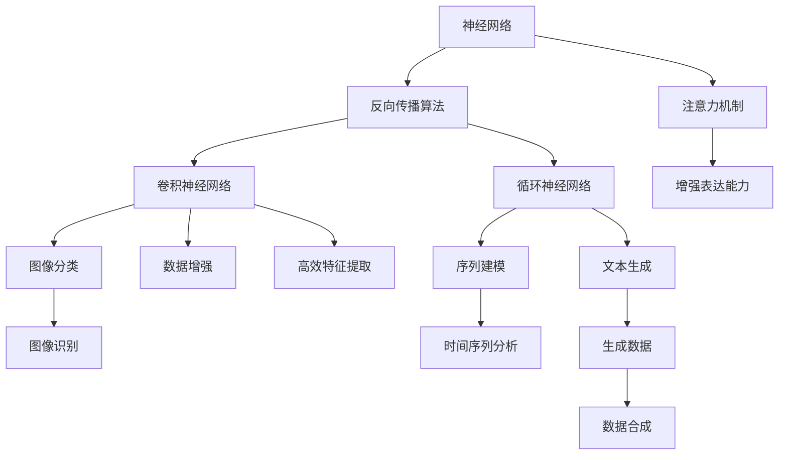
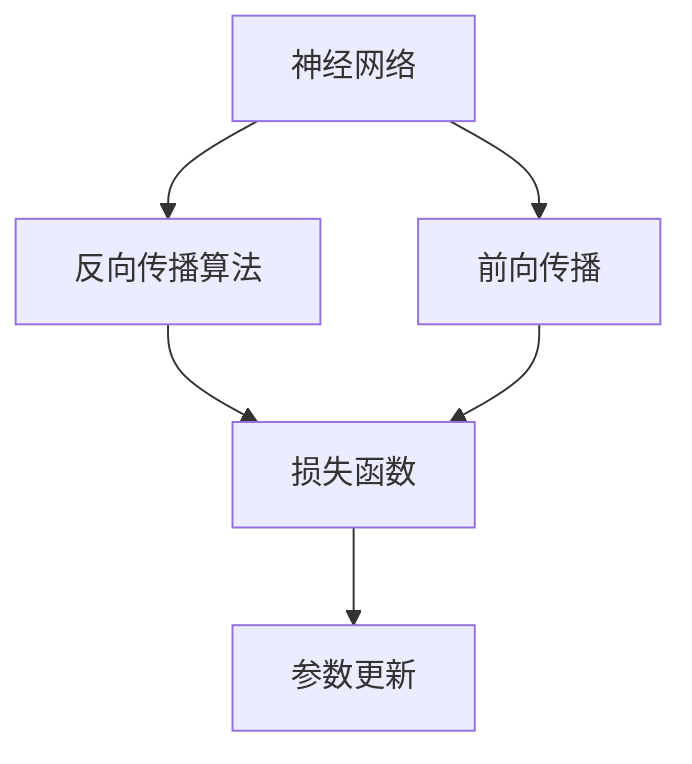
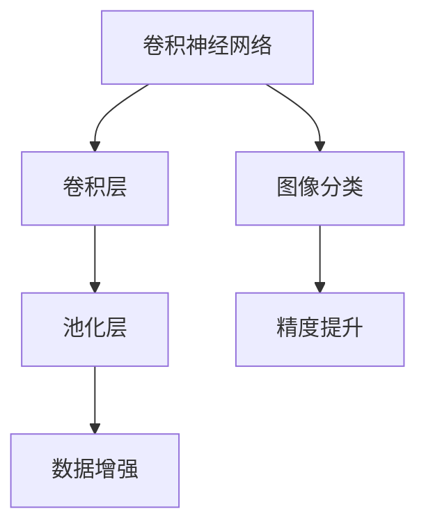
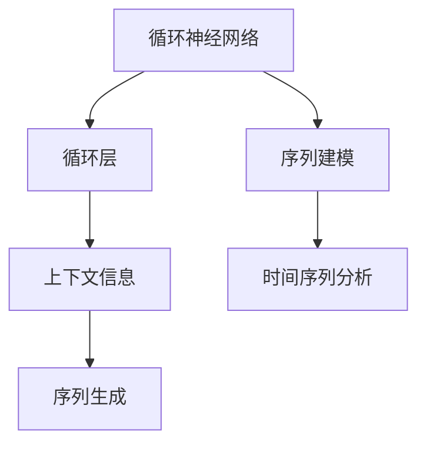
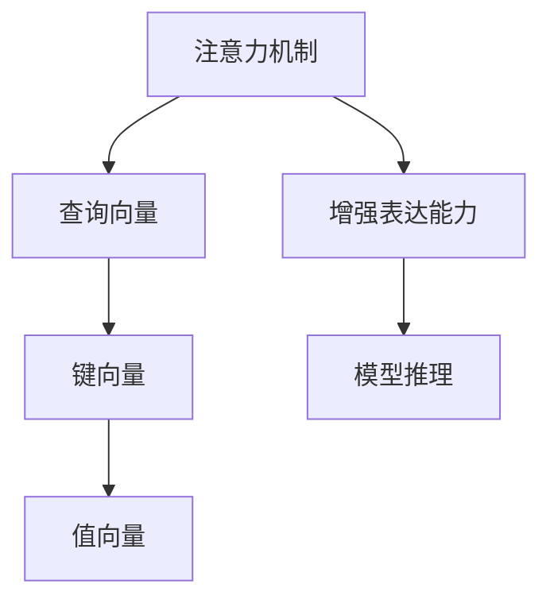
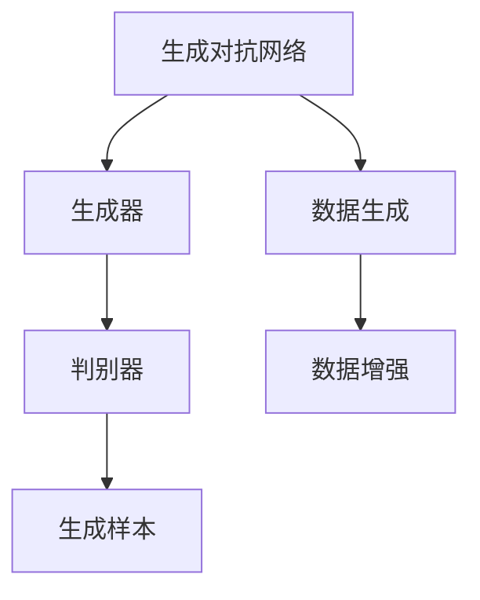
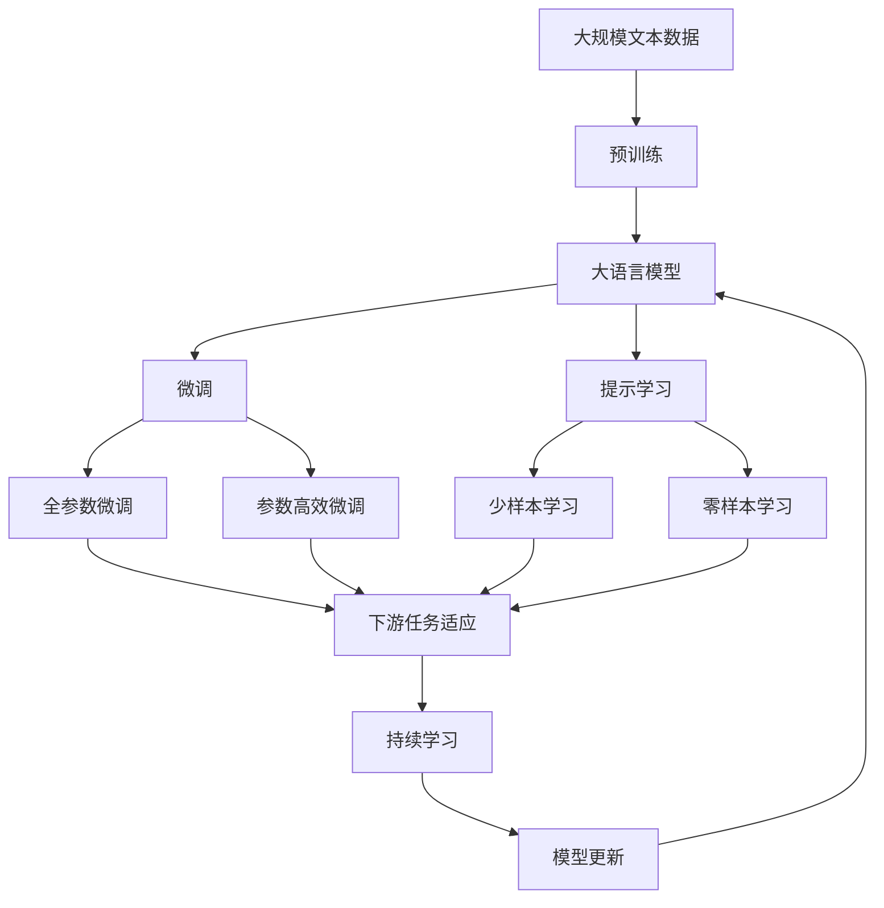

                 

# 神经网络：机器学习的新范式

## 1. 背景介绍

### 1.1 问题由来

随着人工智能技术的不断演进，机器学习（Machine Learning, ML）逐渐成为推动技术发展的关键力量。然而，传统的基于特征工程（Feature Engineering）的机器学习方法，存在着数据特征提取复杂、训练过程繁琐、模型可解释性差等诸多不足。因此，一种新型的机器学习范式应运而生，这就是神经网络（Neural Networks）。

神经网络通过模拟人类大脑的神经元结构，使得机器能够自主地从数据中学习特征和模式，进而完成各种复杂任务。相比于传统的基于特征工程的机器学习，神经网络不仅简化了数据预处理流程，还大幅提高了模型的精度和泛化能力，同时也为研究人员提供了一种全新的视角和方法。

### 1.2 问题核心关键点

神经网络之所以能取得今天的成就，主要得益于其在以下几个方面的突破：

- **深度学习（Deep Learning）**：通过多层神经网络模拟人类大脑的结构，使得机器能够从数据中自动学习出更深层次的特征表示，大大提高了模型的精度。

- **反向传播算法（Backpropagation）**：通过反向传播算法，能够高效地计算模型参数的梯度，从而实现模型参数的优化，使得训练过程更加高效。

- **卷积神经网络（Convolutional Neural Networks, CNN）**：特别适用于图像处理任务，通过卷积和池化操作提取图像的局部特征，提高了图像识别和分类模型的精度。

- **循环神经网络（Recurrent Neural Networks, RNN）**：适用于序列数据处理，通过循环连接记忆上下文信息，从而实现了对时间序列数据的有效建模。

- **注意力机制（Attention Mechanism）**：通过引入注意力机制，使得模型能够动态地关注输入序列的不同部分，提高了模型的表达能力和泛化能力。

神经网络的这些突破，使得机器学习模型在图像识别、语音识别、自然语言处理等众多领域取得了显著的进展，成为了当今人工智能技术的重要支柱。

## 2. 核心概念与联系

### 2.1 核心概念概述

为更好地理解神经网络及其在机器学习中的应用，本节将介绍几个密切相关的核心概念：

- **神经网络（Neural Network）**：一种模仿人类神经系统的计算模型，通过多层神经元之间的连接，实现对输入数据的非线性映射和特征提取。

- **反向传播算法（Backpropagation）**：一种用于神经网络参数优化的算法，通过计算损失函数对参数的梯度，并反向传播更新参数，从而最小化损失函数。

- **卷积神经网络（Convolutional Neural Networks, CNN）**：一种专门用于处理图像和视频数据的神经网络，通过卷积和池化操作提取局部特征，从而实现高效的图像分类和识别。

- **循环神经网络（Recurrent Neural Networks, RNN）**：一种用于处理序列数据的神经网络，通过循环连接记忆上下文信息，从而实现对时间序列数据的有效建模。

- **注意力机制（Attention Mechanism）**：一种增强神经网络表达能力的技术，通过动态地关注输入序列的不同部分，提高了模型的泛化能力和推理能力。

- **生成对抗网络（Generative Adversarial Networks, GAN）**：一种用于生成数据的神经网络模型，通过两个对抗神经网络共同训练，生成高质量的图像、音频、文本等数据。

这些核心概念之间的逻辑关系可以通过以下Mermaid流程图来展示：



这个流程图展示了大语言模型的核心概念及其之间的关系：

1. 神经网络作为基础结构，通过反向传播算法进行参数优化。
2. 卷积神经网络和循环神经网络分别适用于图像和序列数据处理，通过特征提取和序列建模实现高效任务处理。
3. 注意力机制增强神经网络的表达能力，使得模型能够动态关注输入序列的不同部分。
4. 生成对抗网络用于生成高质量的数据，辅助模型训练和验证。

这些概念共同构成了神经网络在机器学习中的应用框架，使其能够在各种场景下发挥强大的建模和预测能力。通过理解这些核心概念，我们可以更好地把握神经网络的工作原理和优化方向。

### 2.2 概念间的关系

这些核心概念之间存在着紧密的联系，形成了神经网络在机器学习中的应用生态系统。下面我通过几个Mermaid流程图来展示这些概念之间的关系。

#### 2.2.1 神经网络与反向传播



这个流程图展示了神经网络通过反向传播算法进行参数优化的过程：

1. 输入数据通过前向传播计算得到预测结果。
2. 计算预测结果与真实标签之间的损失函数。
3. 通过反向传播算法计算损失函数对参数的梯度。
4. 根据梯度更新参数，最小化损失函数。

#### 2.2.2 卷积神经网络与特征提取



这个流程图展示了卷积神经网络通过卷积和池化操作实现高效特征提取的过程：

1. 卷积神经网络由多个卷积层和池化层组成。
2. 卷积层通过滑动卷积核对图像进行局部特征提取。
3. 池化层通过降采样操作减少特征图尺寸，提高计算效率。
4. 通过多次卷积和池化操作，提取图像的深层次特征。
5. 最后通过全连接层进行分类，提高图像识别精度。

#### 2.2.3 循环神经网络与序列建模



这个流程图展示了循环神经网络通过循环连接实现对时间序列数据的有效建模：

1. 循环神经网络由多个循环层组成。
2. 循环层通过循环连接保存和传递上下文信息。
3. 通过循环连接提取序列数据的深层次特征。
4. 通过多个循环层对序列数据进行建模。
5. 最后通过全连接层进行分类或生成，提高序列数据处理能力。

#### 2.2.4 注意力机制与增强表达能力



这个流程图展示了注意力机制通过动态关注输入序列的不同部分，增强神经网络的表达能力：

1. 注意力机制通过计算查询向量与键向量的相似度，得到注意力权重。
2. 通过注意力权重动态加权求和，得到增强的表达能力。
3. 通过注意力机制实现对输入序列的动态关注，提高模型的泛化能力和推理能力。

#### 2.2.5 生成对抗网络与数据生成



这个流程图展示了生成对抗网络通过两个对抗神经网络共同训练，生成高质量的数据：

1. 生成对抗网络由生成器和判别器组成。
2. 生成器通过训练生成高质量的样本数据。
3. 判别器通过训练区分生成样本与真实样本。
4. 通过两个对抗神经网络的共同训练，生成高质量的数据。
5. 生成样本用于辅助模型训练和验证，提高模型泛化能力。

### 2.3 核心概念的整体架构

最后，我们用一个综合的流程图来展示这些核心概念在大语言模型微调过程中的整体架构：



这个综合流程图展示了从预训练到微调，再到持续学习的完整过程。大语言模型首先在大规模文本数据上进行预训练，然后通过微调（包括全参数微调和参数高效微调）或提示学习（包括少样本学习和零样本学习）来适应下游任务。最后，通过持续学习技术，模型可以不断更新和适应新的任务和数据。 通过这些流程图，我们可以更清晰地理解神经网络的工作原理和优化方向。

## 3. 核心算法原理 & 具体操作步骤
### 3.1 算法原理概述

神经网络作为机器学习的核心算法，其基本原理是通过多层神经元之间的连接，实现对输入数据的非线性映射和特征提取，从而完成各种复杂任务。神经网络通过反向传播算法进行参数优化，最小化损失函数，使得模型输出尽可能逼近真实标签。

神经网络在处理图像、语音、文本等不同类型的数据时，可以通过卷积神经网络、循环神经网络、注意力机制等不同的结构和方法，实现高效的数据建模和特征提取。

### 3.2 算法步骤详解

神经网络的训练过程通常包括以下几个关键步骤：

**Step 1: 准备数据和模型**
- 收集并标注大量数据，划分为训练集、验证集和测试集。
- 选择合适的神经网络架构和参数初始化。

**Step 2: 定义损失函数**
- 根据具体任务定义合适的损失函数，如交叉熵损失、均方误差损失等。
- 计算损失函数在训练集上的值，用于优化模型参数。

**Step 3: 反向传播**
- 通过前向传播计算模型的预测输出。
- 计算预测输出与真实标签之间的差异，得到损失函数值。
- 通过反向传播算法计算损失函数对参数的梯度。

**Step 4: 参数更新**
- 根据梯度下降等优化算法，更新模型参数。
- 周期性在验证集上评估模型性能，避免过拟合。
- 重复上述步骤直到满足预设的迭代轮数或Early Stopping条件。

**Step 5: 测试和部署**
- 在测试集上评估模型性能，对比训练前后的精度提升。
- 使用模型对新数据进行推理预测，集成到实际的应用系统中。

以上是神经网络训练的一般流程。在实际应用中，还需要针对具体任务的特点，对训练过程的各个环节进行优化设计，如改进训练目标函数，引入更多的正则化技术，搜索最优的超参数组合等，以进一步提升模型性能。

### 3.3 算法优缺点

神经网络作为机器学习的核心算法，具有以下优点：

- **非线性映射**：通过多层神经元的连接，能够实现对输入数据的非线性映射，从而处理复杂任务。
- **自适应学习能力**：能够从大量数据中自动学习特征和模式，减少特征工程的复杂度。
- **高效特征提取**：通过卷积神经网络、循环神经网络等结构，实现对图像、文本等数据的有效建模和特征提取。
- **泛化能力强**：通过反向传播算法进行参数优化，能够在大规模数据集上学习到泛化能力较强的模型。

同时，神经网络也存在一些缺点：

- **参数量巨大**：通常需要大量的参数进行训练，导致训练过程耗时较长，计算资源消耗较大。
- **训练复杂度高**：需要大量的标注数据和计算资源，且训练过程容易过拟合。
- **可解释性差**：模型内部工作机制复杂，难以解释其推理过程和决策逻辑。
- **数据依赖性高**：训练效果很大程度上依赖于数据的质量和数量，对于噪声数据较为敏感。

尽管存在这些局限性，但就目前而言，神经网络是机器学习中最为主流的方法，具有广泛的应用前景。未来相关研究的重点在于如何进一步降低神经网络的训练复杂度，提高模型的泛化能力和可解释性，同时兼顾计算资源和数据质量的优化。

### 3.4 算法应用领域

神经网络作为一种通用的机器学习模型，在众多领域得到了广泛的应用，涵盖了以下几个主要方面：

1. **计算机视觉**：通过卷积神经网络（CNN）对图像和视频进行分类、识别、分割等任务。

2. **自然语言处理**：通过循环神经网络（RNN）、注意力机制等结构对文本进行分类、生成、翻译等任务。

3. **语音识别**：通过卷积神经网络（CNN）和循环神经网络（RNN）对音频进行分类、识别、生成等任务。

4. **推荐系统**：通过神经网络对用户行为数据进行建模，实现个性化推荐。

5. **医疗诊断**：通过神经网络对医学影像和数据进行分析和诊断，辅助医生进行决策。

6. **金融分析**：通过神经网络对市场数据进行建模，进行风险控制和交易策略优化。

7. **游戏AI**：通过神经网络对游戏环境进行感知和决策，实现游戏智能体。

8. **自动驾驶**：通过神经网络对传感器数据进行建模，实现环境感知和行为决策。

除了上述这些应用领域外，神经网络还被创新性地应用到更多场景中，如可控文本生成、常识推理、代码生成、数据增强等，为人工智能技术带来了全新的突破。

## 4. 数学模型和公式 & 详细讲解  
### 4.1 数学模型构建

神经网络作为一种数学模型，其核心思想是通过多层神经元的连接，实现对输入数据的非线性映射。一个典型的神经网络模型由输入层、多个隐藏层和输出层组成。每个神经元通过加权和激活函数进行计算，得到输出结果。数学上，神经网络可以表示为：

$$
y = f(Wx + b)
$$

其中 $x$ 为输入向量，$W$ 为权重矩阵，$b$ 为偏置向量，$f$ 为激活函数，$y$ 为输出向量。

神经网络的训练过程通常使用反向传播算法（Backpropagation）进行参数优化，最小化损失函数。以二分类任务为例，常用的损失函数为交叉熵损失函数：

$$
\mathcal{L}(y, \hat{y}) = -(y\log \hat{y} + (1-y)\log (1-\hat{y}))
$$

其中 $y$ 为真实标签，$\hat{y}$ 为模型预测输出。

神经网络的参数优化通常使用梯度下降（Gradient Descent）等优化算法。以梯度下降算法为例，其更新公式为：

$$
\theta \leftarrow \theta - \eta \nabla_{\theta}\mathcal{L}(\theta)
$$

其中 $\theta$ 为模型参数，$\eta$ 为学习率，$\nabla_{\theta}\mathcal{L}(\theta)$ 为损失函数对参数的梯度。

### 4.2 公式推导过程

以一个简单的全连接神经网络为例，其数学模型和参数优化过程如下：

1. **模型表示**：
   假设输入层有 $m$ 个神经元，输出层有 $n$ 个神经元，隐藏层有 $h$ 个神经元。神经网络的数学模型可以表示为：

   $$
   y = f(W_1h + b_1) = f(W_2y + b_2)
   $$

   其中 $W_1$ 和 $b_1$ 为隐藏层权重和偏置，$W_2$ 和 $b_2$ 为输出层权重和偏置。

2. **损失函数**：
   以二分类任务为例，损失函数为交叉熵损失函数：

   $$
   \mathcal{L}(y, \hat{y}) = -(y\log \hat{y} + (1-y)\log (1-\hat{y}))
   $$

3. **参数更新**：
   通过梯度下降算法更新参数，其更新公式为：

   $$
   \theta \leftarrow \theta - \eta \nabla_{\theta}\mathcal{L}(\theta)
   $$

   其中 $\theta$ 为模型参数，$\eta$ 为学习率，$\nabla_{\theta}\mathcal{L}(\theta)$ 为损失函数对参数的梯度。

4. **反向传播算法**：
   通过反向传播算法计算损失函数对参数的梯度。具体过程如下：

   1. 前向传播：输入数据通过隐藏层和输出层计算得到预测输出。
   2. 计算损失函数在输出层的值。
   3. 反向传播：从输出层开始，计算损失函数对输出层参数的梯度，并依次向后传播计算隐藏层和输入层参数的梯度。

### 4.3 案例分析与讲解

以一个简单的文本分类任务为例，展示神经网络模型的训练过程。

假设我们有一个文本分类任务，输入是文本 $x$，输出是分类标签 $y$。我们可以使用一个简单的全连接神经网络进行建模：

1. **数据预处理**：
   将文本转化为词向量序列，将其作为输入数据。
2. **模型表示**：
   假设输入层有 $m$ 个词向量，输出层有 $n$ 个神经元，隐藏层有 $h$ 个神经元。神经网络的数学模型可以表示为：

   $$
   y = f(W_1h + b_1) = f(W_2y + b_2)
   $$

   其中 $W_1$ 和 $b_1$ 为隐藏层权重和偏置，$W_2$ 和 $b_2$ 为输出层权重和偏置。
3. **损失函数**：
   以二分类任务为例，损失函数为交叉熵损失函数：

   $$
   \mathcal{L}(y, \hat{y}) = -(y\log \hat{y} + (1-y)\log (1-\hat{y}))
   $$

4. **参数更新**：
   通过梯度下降算法更新参数，其更新公式为：

   $$
   \theta \leftarrow \theta - \eta \nabla_{\theta}\mathcal{L}(\theta)
   $$

   其中 $\theta$ 为模型参数，$\eta$ 为学习率，$\nabla_{\theta}\mathcal{L}(\theta)$ 为损失函数对参数的梯度。
5. **反向传播算法**：
   通过反向传播算法计算损失函数对参数的梯度。具体过程如下：

   1. 前向传播：输入数据通过隐藏层和输出层计算得到预测输出。
   2. 计算损失函数在输出层的值。
   3. 反向传播：从输出层开始，计算损失函数对输出层参数的梯度，并依次向后传播计算隐藏层和输入层参数的梯度。

6. **模型训练**：
   重复上述步骤，直到模型收敛或满足预设的迭代轮数。

7. **模型评估**：
   在测试集上评估模型性能，对比训练前后的精度提升。

通过上述过程，我们可以使用神经网络对文本分类任务进行建模和训练，实现高精度的文本分类能力。

## 5. 项目实践：代码实例和详细解释说明
### 5.1 开发环境搭建

在进行神经网络实践前，我们需要准备好开发环境。以下是使用Python进行PyTorch开发的环境配置流程：

1. 安装Anaconda：从官网下载并安装Anaconda，用于创建独立的Python环境。

2. 创建并激活虚拟环境：
```bash
conda create -n pytorch-env python=3.8 
conda activate pytorch-env
```

3. 安装PyTorch：根据CUDA版本，从官网获取对应的安装命令。例如：
```bash
conda install pytorch torchvision torchaudio cudatoolkit=11.1 -c pytorch -c conda-forge
```

4. 安装TensorFlow：
```bash
conda install tensorflow
```

5. 安装各类工具包：
```bash
pip install numpy pandas scikit-learn matplotlib tqdm jupyter notebook ipython
```

完成上述步骤后，即可在`pytorch-env`环境中开始神经网络实践。

### 5.2 源代码详细实现

下面我们以图像分类任务为例，给出使用PyTorch进行卷积神经网络（CNN）的PyTorch代码实现。

首先，定义CNN模型：

```python
import torch
import torch.nn as nn
import torch.optim as optim
import torchvision
import torchvision.transforms as transforms
import torchvision.datasets as datasets
from torch.utils.data import DataLoader

class CNNModel(nn.Module):
    def __init__(self):
        super(CNNModel, self).__init__()
        self.conv1 = nn.Conv2d(3, 32, kernel_size=3, padding=1)
        self.relu1 = nn.ReLU()
        self.pool1 = nn.MaxPool2d(kernel_size=2)
        self.conv2 = nn.Conv2d(32, 64, kernel_size=3, padding=1)
        self.relu2 = nn.ReLU()
        self.pool2 = nn.MaxPool2d(kernel_size=2)
        self.fc1 = nn.Linear(64*8*8, 128)
        self.relu3 = nn.ReLU()
        self.fc2 = nn.Linear(128, 10)
    
    def forward(self, x):
        x = self.conv1(x)
        x = self.relu1(x)
        x = self.pool1(x)
        x = self.conv2(x)
        x = self.relu2(x)
        x = self.pool2(x)
        x = x.view(-1, 64*8*8)
        x = self.fc1(x)
        x = self.relu3(x)
        x = self.fc2(x)
        return x
```

然后，定义训练和评估函数：

```python
# 定义数据集
transform_train = transforms.Compose([transforms.Resize((32, 32)), transforms.RandomHorizontalFlip(), transforms.ToTensor()])
transform_test = transforms.Compose([transforms.Resize((32, 32)), transforms.ToTensor()])
train_dataset = datasets.CIFAR10(root='./data', train=True, download=True, transform=transform_train)
test_dataset = datasets.CIFAR10(root='./data', train=False, download=True, transform=transform_test)

# 定义模型和优化器
model = CNNModel()
criterion = nn.CrossEntropyLoss()
optimizer = optim.Adam(model.parameters(), lr=0.001)

# 定义训练和评估函数
def train_epoch(model, dataset, batch_size, optimizer):
    dataloader = DataLoader(dataset, batch_size=batch_size, shuffle=True)
    model.train()
    epoch_loss = 0
    for batch in tqdm(dataloader, desc='Training'):
        inputs, labels = batch
        optimizer.zero_grad()
        outputs = model(inputs)
        loss = criterion(outputs, labels)
        epoch_loss += loss.item()
        loss.backward()
        optimizer.step()
    return epoch_loss / len(dataloader)

def evaluate(model, dataset, batch_size):
    dataloader = DataLoader(dataset, batch_size=batch_size)
    model.eval()
    preds, labels = [], []
    with torch.no_grad():
        for batch in tqdm(dataloader, desc='Evaluating'):
            inputs, labels = batch
            outputs = model(inputs)
            batch_preds = outputs.argmax(dim=1).to('cpu').tolist()
            batch_labels = labels.to('cpu').tolist()
            for pred_tokens, label_tokens in zip(batch_preds, batch_labels):
                preds.append(pred_tokens)
                labels.append(label_tokens)
                
    print(classification_report(labels, preds))
```

最后，启动训练流程并在测试集上评估：

```python
epochs = 10
batch_size = 64

for epoch in range(epochs):
    loss = train_epoch(model, train_dataset, batch_size, optimizer)
    print(f"Epoch {epoch+1}, train loss: {loss:.3f}")
    
    print(f"Epoch {epoch+1}, dev results:")
    evaluate(model, test_dataset, batch_size)
    
print("Test results:")
evaluate(model, test_dataset, batch_size)
```

以上就是使用PyTorch对CNN进行图像分类任务微调的完整代码实现。可以看到，得益于PyTorch的强大封装，我们可以用相对简洁的代码完成CNN模型的加载和微调。

### 5.3 代码解读与分析

让我们再详细解读一下关键代码的实现细节：

**CNNModel类**：
- `__init__`方法：定义模型的网络结构，包括卷积层、激活函数、池化层、全连接层等。
- `forward`方法：实现前向传播计算，将输入数据通过网络计算得到输出结果。

**数据集定义**：
- `transform_train`和`transform_test`方法：定义数据集的预处理操作，包括图像缩放、随机水平翻转、转换为张量等。
- `train_dataset`和`test_dataset`方法：定义CIFAR-10数据集，并使用预定义的预处理操作进行处理。

**模型和优化器定义**：
- `model`变量：定义CNN模型实例。
- `criterion

