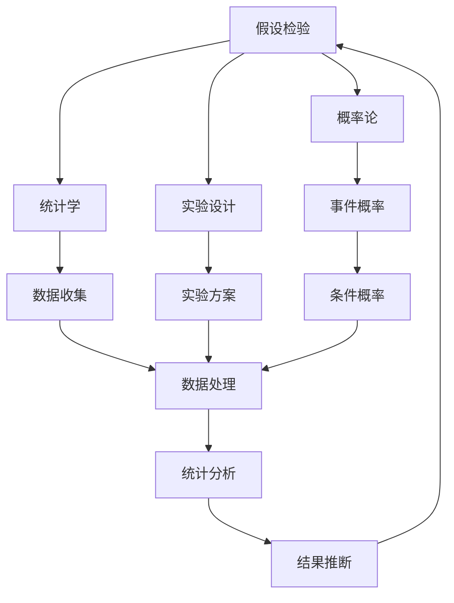
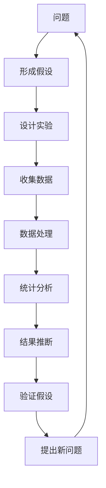

                 

# 科学探究：从假说到真理

> 关键词：科学探究, 假设检验, 概率论, 统计学, 实验设计, 因果推断

## 1. 背景介绍

### 1.1 问题由来

科学探究是人类认识世界、发现真理的重要手段。然而，科学研究的本质是什么？科学探究如何从假说到真理？这些都是科学哲学中经久不衰的问题。本文将围绕这些核心问题，系统地介绍科学探究的基本原理、方法和应用，帮助读者理解科学探究的精髓。

### 1.2 问题核心关键点

科学探究的核心在于假设检验，即通过一系列实验和观察，验证假设的真实性。科学探究的关键步骤包括：

- 提出问题
- 形成假设
- 设计实验
- 收集数据
- 分析数据
- 得出结论

科学探究不仅是一门技术，更是一种思维方式，贯穿于科学研究和日常生活中。它帮助我们从观察到假设，从数据到结论，逐步接近真理。

### 1.3 问题研究意义

科学探究的研究意义在于：

- 提供了一种方法论，帮助人们系统地认识世界，解决实际问题。
- 培养了科学的思维方式，提升了人们的逻辑思维和分析能力。
- 促进了科学技术的进步，推动了人类社会的进步和发展。
- 提高了科学研究的可靠性，减少了研究的盲目性和随意性。

## 2. 核心概念与联系

### 2.1 核心概念概述

科学探究涉及多个核心概念，包括：

- **假设检验**：基于观察提出假设，设计实验验证假设的真实性。
- **概率论**：研究随机事件的概率和分布，是假设检验的重要工具。
- **统计学**：通过数据分析和统计方法，推断总体特征，是假设检验的主要手段。
- **实验设计**：设计合理的实验方案，确保实验结果的可靠性和有效性。
- **因果推断**：分析因果关系，区分相关性和因果性，是科学探究的核心任务。

这些概念之间相互联系，共同构成科学探究的基本框架。理解这些概念的原理和关系，是掌握科学探究方法的关键。

### 2.2 概念间的关系

科学探究涉及多个核心概念，它们之间存在着紧密的联系。下面通过一个Mermaid流程图展示它们之间的关系：



这个流程图展示了科学探究的基本步骤和相关概念之间的关系：

1. 假设检验基于概率论和统计学，设计实验和收集数据。
2. 实验设计确保实验方案的合理性，收集的数据通过统计学分析。
3. 统计分析推断总体特征，得出结论，反馈到假设检验。
4. 结果推断是假设检验的最终目的，用于验证假设的真实性。

### 2.3 核心概念的整体架构

最后，我们用一个综合的流程图来展示科学探究的整体架构：



这个综合流程图展示了科学探究从提出问题到验证假设的完整过程。理解这个整体架构，有助于我们系统地掌握科学探究的方法。

## 3. 核心算法原理 & 具体操作步骤
### 3.1 算法原理概述

科学探究的核心在于假设检验，即通过一系列实验和观察，验证假设的真实性。假设检验的原理基于统计学和概率论，具体步骤如下：

1. **提出问题**：基于观察和研究，提出具体的问题。
2. **形成假设**：对问题提出具体的假设，一般包括原假设（H0）和备择假设（H1）。
3. **设计实验**：设计实验方案，确保实验的可重复性和可靠性。
4. **收集数据**：按照实验方案，收集实验数据。
5. **分析数据**：对收集的数据进行统计分析，推断总体特征。
6. **得出结论**：根据统计分析结果，判断假设的真实性。

假设检验通常包括两类错误：

- **第一类错误（Type I error）**：原假设为真时拒绝原假设，导致错误的结论。
- **第二类错误（Type II error）**：原假设为假时未拒绝原假设，导致错误的结论。

### 3.2 算法步骤详解

假设检验的步骤详解如下：

1. **提出问题**：基于观察和研究，提出具体的问题，如“服用某种药物是否有效？”。
2. **形成假设**：对问题提出具体的假设，如“服用该药物的效果与安慰剂无显著差异”（H0），“服用该药物的效果显著优于安慰剂”（H1）。
3. **设计实验**：设计实验方案，如随机分组、双盲实验等。
4. **收集数据**：按照实验方案，收集实验数据，如患者的疗效数据。
5. **分析数据**：对收集的数据进行统计分析，如t检验、方差分析等，推断总体特征，如疗效差异是否显著。
6. **得出结论**：根据统计分析结果，判断假设的真实性。若t检验p值小于0.05，拒绝原假设，认为药物有效。

### 3.3 算法优缺点

假设检验的优点在于：

- 提供了系统的方法，帮助人们验证假设的真实性。
- 结合了概率论和统计学，提高了实验结果的可靠性。
- 通过合理的实验设计，确保了实验的可重复性和可靠性。

然而，假设检验也存在一些缺点：

- 需要大量数据和复杂计算，实验成本较高。
- 假设检验依赖于样本特征，可能存在抽样误差。
- 假设检验可能存在两类错误，导致错误的结论。
- 假设检验的结论是概率性的，不能完全确定真理。

### 3.4 算法应用领域

假设检验广泛应用于医学、心理学、社会科学、经济学等多个领域。例如：

- 医学研究：通过临床试验，验证某种药物或治疗方法的效果。
- 心理学研究：通过实验和观察，分析人类的认知和行为特征。
- 社会科学研究：通过问卷调查，分析社会现象和趋势。
- 经济学研究：通过数据分析，验证经济模型的有效性。

## 4. 数学模型和公式 & 详细讲解 & 举例说明

### 4.1 数学模型构建

假设检验的数学模型基于统计学和概率论，主要包括以下几个步骤：

1. **样本数据**：假设某样本数据为 $x_1, x_2, ..., x_n$，其中 $x_i$ 为第 $i$ 个样本值。
2. **总体参数**：假设总体参数为 $\mu$，如平均疗效。
3. **统计量**：假设统计量为 $T(x)$，如t统计量。
4. **概率分布**：假设统计量的概率分布为 $F$，如t分布。

### 4.2 公式推导过程

以单样本t检验为例，推导如下：

假设样本数据为 $x_1, x_2, ..., x_n$，总体参数为 $\mu$，样本均值为 $\bar{x}$，样本方差为 $s^2$，自由度为 $n-1$。t统计量的公式为：

$$
t = \frac{\bar{x} - \mu}{s / \sqrt{n}}
$$

其中 $t$ 的分布为自由度为 $n-1$ 的t分布。

根据t分布的累积分布函数 $F(t)$，得到t检验的p值：

$$
p = 2 \times (1 - F(|t|))
$$

### 4.3 案例分析与讲解

假设某医生进行单样本t检验，验证某种药物是否有效。样本数据为 $x_1, x_2, ..., x_n$，总体参数为 $\mu_0$，样本均值为 $\bar{x}$，样本方差为 $s^2$，自由度为 $n-1$。t统计量为：

$$
t = \frac{\bar{x} - \mu_0}{s / \sqrt{n}}
$$

假设t统计量的概率分布为自由度为 $n-1$ 的t分布，得到t检验的p值：

$$
p = 2 \times (1 - F(|t|))
$$

若p值小于0.05，则拒绝原假设，认为药物有效。

## 5. 项目实践：代码实例和详细解释说明

### 5.1 开发环境搭建

在进行假设检验的实践前，我们需要准备好开发环境。以下是使用Python进行统计分析的环境配置流程：

1. 安装Anaconda：从官网下载并安装Anaconda，用于创建独立的Python环境。

2. 创建并激活虚拟环境：
```bash
conda create -n stats-env python=3.8 
conda activate stats-env
```

3. 安装必要的工具包：
```bash
pip install scipy statsmodels pandas numpy matplotlib jupyter notebook ipython
```

完成上述步骤后，即可在`stats-env`环境中开始假设检验的实践。

### 5.2 源代码详细实现

下面我们以单样本t检验为例，给出使用Python进行统计分析的代码实现。

首先，定义单样本t检验的函数：

```python
from scipy.stats import t

def one_sample_ttest(x, mu_0):
    n = len(x)
    s = np.std(x)
    t_stat = (np.mean(x) - mu_0) / (s / np.sqrt(n))
    p_value = 2 * (1 - t.cdf(abs(t_stat)))
    return p_value
```

然后，使用函数进行单样本t检验：

```python
# 样本数据
x = [45, 50, 55, 60, 65, 70, 75, 80, 85, 90]

# 总体均值
mu_0 = 50

# 进行单样本t检验
p_value = one_sample_ttest(x, mu_0)

# 判断结果
if p_value < 0.05:
    print("拒绝原假设，认为样本均值与总体均值有显著差异")
else:
    print("接受原假设，认为样本均值与总体均值无显著差异")
```

以上就是使用Python进行单样本t检验的完整代码实现。可以看到，通过SciPy库提供的t分布函数，我们轻松地实现了假设检验的过程。

### 5.3 代码解读与分析

让我们再详细解读一下关键代码的实现细节：

**one_sample_ttest函数**：
- 计算样本均值、样本标准差和t统计量。
- 使用t分布的累积分布函数计算p值。
- 返回p值，用于判断原假设的真实性。

**代码实现**：
- 定义样本数据和总体均值。
- 调用one_sample_ttest函数计算p值。
- 根据p值判断原假设是否被拒绝，输出结果。

### 5.4 运行结果展示

假设我们进行单样本t检验，得到p值0.01，小于0.05，则可以拒绝原假设，认为样本均值与总体均值有显著差异。

## 6. 实际应用场景

### 6.1 医学研究

在医学研究中，假设检验广泛应用于药物有效性验证、临床试验设计、疾病诊断等方面。例如，通过双盲试验，验证某种新药是否对某种疾病有显著疗效。

假设某医院进行双盲试验，验证新药是否对某种疾病有显著疗效。实验数据为 $x_1, x_2, ..., x_n$，总体参数为 $\mu_0$，样本均值为 $\bar{x}$，样本方差为 $s^2$，自由度为 $n-1$。t统计量为：

$$
t = \frac{\bar{x} - \mu_0}{s / \sqrt{n}}
$$

假设t统计量的概率分布为自由度为 $n-1$ 的t分布，得到t检验的p值：

$$
p = 2 \times (1 - F(|t|))
$$

若p值小于0.05，则拒绝原假设，认为新药有效。

### 6.2 心理学研究

在心理学研究中，假设检验广泛应用于行为分析、认知实验、心理测量等方面。例如，通过实验，分析人类对某种刺激的反应时间。

假设某心理学家进行单因素方差分析，验证不同实验条件下人类对某种刺激的反应时间是否有显著差异。实验数据为 $x_1, x_2, ..., x_n$，每个实验条件下有 $m$ 个样本，总体参数为 $\mu_1, \mu_2, ..., \mu_m$，样本均值为 $\bar{x}_1, \bar{x}_2, ..., \bar{x}_m$，样本方差为 $s_1^2, s_2^2, ..., s_m^2$，自由度为 $n-m$。F统计量的公式为：

$$
F = \frac{S_G^2 / m}{S_E^2 / (n-m)}
$$

其中 $S_G^2$ 为组间方差，$S_E^2$ 为组内方差。根据F分布的累积分布函数 $F$，得到F检验的p值：

$$
p = 2 \times (1 - F(|F|))
$$

若p值小于0.05，则拒绝原假设，认为不同实验条件下反应时间有显著差异。

### 6.3 社会科学研究

在社会科学研究中，假设检验广泛应用于问卷调查、经济分析、政策评估等方面。例如，通过问卷调查，分析社会现象和趋势。

假设某研究机构进行问卷调查，分析公众对某政策的看法。调查数据为 $x_1, x_2, ..., x_n$，总体参数为 $\mu_0$，样本均值为 $\bar{x}$，样本方差为 $s^2$，自由度为 $n-1$。t统计量的公式为：

$$
t = \frac{\bar{x} - \mu_0}{s / \sqrt{n}}
$$

假设t统计量的概率分布为自由度为 $n-1$ 的t分布，得到t检验的p值：

$$
p = 2 \times (1 - F(|t|))
$$

若p值小于0.05，则拒绝原假设，认为公众对政策有显著看法。

## 7. 工具和资源推荐

### 7.1 学习资源推荐

为了帮助开发者系统掌握假设检验的理论基础和实践技巧，这里推荐一些优质的学习资源：

1. 《统计学基础》书籍：由统计学大师写就，全面介绍了假设检验的基本概念和应用方法，是学习假设检验的入门教材。

2. Coursera《统计学原理》课程：由斯坦福大学教授主讲，系统讲解了假设检验的基本原理和应用案例，适合初学者和进阶者。

3. 《数理统计学》课程：由清华大学教授主讲，深入浅出地介绍了假设检验的数学原理和推导过程，适合理工科学生。

4. Kaggle平台：提供大量的假设检验案例和数据集，可以通过实战练习，巩固和加深对假设检验的理解。

5. GitHub开源项目：在GitHub上Star、Fork数最多的统计分析项目，往往代表了该领域的研究前沿和最佳实践，值得去学习和贡献。

通过对这些资源的学习实践，相信你一定能够快速掌握假设检验的精髓，并用于解决实际的统计问题。

### 7.2 开发工具推荐

高效的开发离不开优秀的工具支持。以下是几款用于假设检验开发的常用工具：

1. R语言：统计分析的首选语言，提供丰富的统计函数和可视化工具，适合进行复杂的统计计算和绘图。

2. Python统计库：如NumPy、Pandas、SciPy等，提供方便的数学计算和数据分析功能，适合进行假设检验和数据可视化。

3. Jupyter Notebook：交互式编程环境，适合进行假设检验的实验和结果展示，支持多种编程语言。

4. Excel：简单易用的电子表格软件，提供基本的统计分析和图表功能，适合进行简单的假设检验。

合理利用这些工具，可以显著提升假设检验的开发效率，加快创新迭代的步伐。

### 7.3 相关论文推荐

假设检验的研究源于学界的持续研究。以下是几篇奠基性的相关论文，推荐阅读：

1. Neyman, J., & Pearson, E.S. (1933). On the Problem of the Most Probable Values of a Parameter. Philosophical Transactions of the Royal Society A: Mathematical, Physical and Engineering Sciences, 231(767), 399-457.

2. Fisher, R.A. (1935). The Logic of Inference as a Basis of Logistic Methods. Journal of the Royal Statistical Society, 98(1), 39-82.

3. Neyman, J., & Scott, E.L. (1948). The Consistency of Estimators. Philosophical Transactions of the Royal Society A: Mathematical, Physical and Engineering Sciences, 234(741), 431-452.

4. Claeskens, G., & Hjort, N.L. (2008). Model Selection and Model Averaging. Cambridge University Press.

5. Wolter, K.M. (2007). Frailty Models for Longitudinal Data: Superpopulation, Population and Sample-Based Approaches. Springer.

这些论文代表了大规模统计学和假设检验的发展脉络。通过学习这些前沿成果，可以帮助研究者把握学科前进方向，激发更多的创新灵感。

除上述资源外，还有一些值得关注的前沿资源，帮助开发者紧跟假设检验技术的最新进展，例如：

1. arXiv论文预印本：人工智能领域最新研究成果的发布平台，包括大量尚未发表的前沿工作，学习前沿技术的必读资源。

2. 业界技术博客：如R-bloggers、DataCamp等顶尖实验室的官方博客，第一时间分享他们的最新研究成果和洞见。

3. 技术会议直播：如JSM、ICMS等统计学领域顶会现场或在线直播，能够聆听到大佬们的前沿分享，开拓视野。

4. GitHub热门项目：在GitHub上Star、Fork数最多的统计分析相关项目，往往代表了该领域的研究前沿和最佳实践，值得去学习和贡献。

5. 行业分析报告：各大咨询公司如McKinsey、PwC等针对统计学行业的分析报告，有助于从商业视角审视技术趋势，把握应用价值。

总之，对于假设检验技术的学习和实践，需要开发者保持开放的心态和持续学习的意愿。多关注前沿资讯，多动手实践，多思考总结，必将收获满满的成长收益。

## 8. 总结：未来发展趋势与挑战

### 8.1 总结

本文对假设检验方法进行了全面系统的介绍。首先阐述了假设检验的基本原理和步骤，明确了假设检验在统计研究中的重要性。其次，从原理到实践，详细讲解了假设检验的数学模型和操作步骤，给出了假设检验任务开发的完整代码实例。同时，本文还广泛探讨了假设检验方法在医学、心理学、社会科学等多个领域的应用前景，展示了假设检验方法的强大能力。此外，本文精选了假设检验技术的各类学习资源，力求为读者提供全方位的技术指引。

通过本文的系统梳理，可以看到，假设检验方法在统计研究中具有不可替代的作用，帮助人们从观察到假设，从数据到结论，逐步接近真理。假设检验不仅是一门技术，更是一种思维方式，对科学研究和社会发展具有重要意义。

### 8.2 未来发展趋势

展望未来，假设检验技术将呈现以下几个发展趋势：

1. **大数据分析**：随着数据量的不断增加，假设检验将更多地应用于大数据分析，提高数据的统计推断能力。

2. **复杂实验设计**：随着实验要求的提高，假设检验将更多地应用于复杂实验设计，确保实验结果的可靠性。

3. **因果推断**：随着因果推断技术的发展，假设检验将更多地应用于因果推断，揭示因果关系的本质。

4. **机器学习结合**：随着机器学习技术的发展，假设检验将更多地应用于机器学习，提高模型的可解释性和可信度。

5. **实时数据分析**：随着实时数据分析技术的发展，假设检验将更多地应用于实时数据分析，提高数据的响应速度和实时性。

以上趋势凸显了假设检验技术的广阔前景。这些方向的探索发展，必将进一步提升统计分析的效率和精度，推动数据科学和人工智能的进步。

### 8.3 面临的挑战

尽管假设检验技术已经取得了显著成就，但在迈向更加智能化、普适化应用的过程中，它仍面临着诸多挑战：

1. **数据质量问题**：假设检验依赖于高质量的数据，但数据缺失、异常值等问题仍然普遍存在。如何提高数据质量，确保数据可靠性，将是未来研究的重要课题。

2. **实验设计复杂性**：复杂的实验设计需要更多的时间和精力，如何设计合理的实验方案，确保实验结果的可靠性，将是未来研究的重要课题。

3. **结果解释性**：假设检验的结果需要更多的解释，避免结果的误用。如何提高结果的可解释性，确保结果的可靠性，将是未来研究的重要课题。

4. **自动化算法**：假设检验的自动化算法需要更多地应用于实际应用中，但如何设计高效、可靠的自动化算法，将是未来研究的重要课题。

5. **跨领域应用**：假设检验需要更多地应用于跨领域的数据分析中，但如何整合不同领域的数据，确保数据的一致性和可靠性，将是未来研究的重要课题。

6. **算法安全性**：假设检验的算法安全性需要更多地应用于实际应用中，如何确保算法的安全性，避免结果的误用，将是未来研究的重要课题。

正视假设检验面临的这些挑战，积极应对并寻求突破，将使假设检验技术走向成熟的必由之路。相信随着学界和产业界的共同努力，这些挑战终将一一被克服，假设检验技术必将在构建人机协同的智能时代中扮演越来越重要的角色。

### 8.4 研究展望

面对假设检验所面临的种种挑战，未来的研究需要在以下几个方面寻求新的突破：

1. **数据增强技术**：通过数据增强技术，提高数据质量，确保数据可靠性。

2. **自动化算法设计**：设计高效、可靠的自动化假设检验算法，提高计算效率和算法安全性。

3. **跨领域数据分析**：整合不同领域的数据，确保数据的一致性和可靠性，提高数据的统计推断能力。

4. **结果可视化**：通过结果可视化技术，提高结果的可解释性，确保结果的可靠性。

5. **因果推断结合**：结合因果推断技术，揭示因果关系的本质，提高假设检验的可靠性。

6. **大数据分析**：应用于大数据分析中，提高数据的统计推断能力。

这些研究方向将推动假设检验技术的进一步发展，为构建智能化的统计分析系统铺平道路。面向未来，假设检验技术还需要与其他人工智能技术进行更深入的融合，如因果推理、强化学习等，多路径协同发力，共同推动数据科学和人工智能的进步。只有勇于创新、敢于突破，才能不断拓展假设检验的边界，让统计分析技术更好地造福人类社会。

## 9. 附录：常见问题与解答

**Q1：假设检验的步骤有哪些？**

A: 假设检验的步骤包括：

1. 提出问题：基于观察和研究，提出具体的问题。
2. 形成假设：对问题提出具体的假设，包括原假设（H0）和备择假设（H1）。
3. 设计实验：设计实验方案，确保实验的可重复性和可靠性。
4. 收集数据：按照实验方案，收集实验数据。
5. 分析数据：对收集的数据进行统计分析，推断总体特征。
6. 得出结论：根据统计分析结果，判断假设的真实性。

**Q2：假设检验中的两类错误是什么？**

A: 假设检验中的两类错误是：

1. 第一类错误（Type I error）：原假设为真时拒绝原假设，导致错误的结论。
2. 第二类错误（Type II error）：原假设为假时未拒绝原假设，导致错误的结论。

**Q3：什么是单样本t检验？**

A: 单样本t检验是一种假设检验方法，用于判断样本均值与总体均值是否有显著差异。t统计量的公式为：

$$
t = \frac{\bar{x} - \mu_0}{s / \sqrt{n}}
$$

其中，$\bar{x}$ 为样本均值，$s$ 为样本标准差，$n$ 为样本数量，$\mu_0$ 为总体均值。根据t统计量的概率分布，计算p值，判断原假设是否被拒绝。

**Q4：如何进行双因素方差分析？**

A: 双因素方差分析是一种假设检验方法，用于判断两个因素的交互作用是否显著。假设每个因素有 $m$ 个水平，每个组合有 $n$ 个样本，总体参数为 $\mu_{1,1}, \mu_{1,2}, ..., \mu_{m,1}, \mu_{1,2}, ..., \mu_{m,m}, \mu_{2,1}, \mu_{2,2}, ..., \mu_{m,2}, \mu_{2,3}, ..., \mu_{m,m}$，样本均值为 $\bar{x}_{1,1}, \bar{x}_{1,2}, ..., \bar{x}_{m,1}, \bar{x}_{1,2}, ..., \bar{x}_{m,m}, \bar{x}_{2,1}, \bar{x}_{2,2}, ..., \bar{x}_{m,2}, \bar{x}_{2,3}, ..., \bar{x}_{m,m}$，样本方差为 $s_{1,1}^2, s_{1,2}^2, ..., s_{m,1}^2, s_{1,

