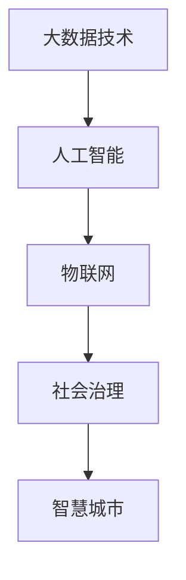
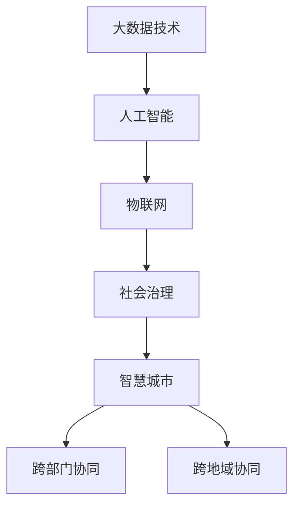

                 

# 科技创新：社会治理的新思路

> 关键词：科技创新，社会治理，智能化，数据驱动，人工智能，数字政府

## 1. 背景介绍

### 1.1 问题由来

进入21世纪以来，全球科技革命和产业变革持续加速，人工智能、大数据、物联网等技术迅猛发展，深刻改变了经济社会活动的形态。科技创新已经成为了驱动社会进步和提高国家竞争力的重要引擎。在社会治理领域，传统的管理方式和手段已经难以应对复杂多变的社会问题和挑战。科技创新成为提升社会治理能力和治理体系现代化水平的迫切需求。

### 1.2 问题核心关键点

社会治理的科技创新主要涉及以下几个关键点：

- **数据驱动**：利用大数据技术，收集和分析各类社会治理数据，实现精准决策和动态管理。
- **智能监控**：通过物联网、视频监控等技术，实现对社会行为的智能监控和预警。
- **人工智能**：运用机器学习、深度学习等技术，提升社会治理的智能化水平，包括智能客服、智慧安防等。
- **决策支持**：构建基于人工智能的决策支持系统，辅助政府和企业管理层进行科学决策。
- **数字化转型**：推动社会治理体系向数字化、网络化、智能化方向转型，实现跨部门、跨地域的协同治理。

### 1.3 问题研究意义

科技创新在社会治理中的应用，对提升治理效能、优化资源配置、保障公共安全等方面具有重要意义：

- **提升治理效能**：利用先进技术手段，实现对社会现象的实时监控和精准预测，提高社会治理的效率和效果。
- **优化资源配置**：通过数据分析，优化资源分配和调度，降低社会治理成本，提高资源利用率。
- **保障公共安全**：利用智能监控和大数据分析，及时发现和应对各类安全风险，保障公共安全。
- **实现协同治理**：构建跨部门、跨地域的协同治理机制，实现信息共享和资源整合，提升治理的整体性和协同性。
- **推动社会进步**：科技创新是推动社会进步和实现可持续发展的关键力量，有助于构建更公正、更美好的社会。

## 2. 核心概念与联系

### 2.1 核心概念概述

为更好地理解科技创新在社会治理中的应用，本节将介绍几个密切相关的核心概念：

- **大数据技术**：指通过大规模数据收集、存储、处理和分析，挖掘数据价值的技术。
- **人工智能**：指利用计算机模拟人类智能活动，包括感知、理解、学习、推理等能力的科学技术。
- **物联网**：指通过传感器、通信设备等技术，将物理世界与数字世界连接起来，实现万物互联。
- **社会治理**：指政府、社会组织和个人通过协同合作，对社会事务进行规划、协调、监督和处理的过程。
- **智慧城市**：指利用先进的信息技术，对城市进行全方位、全过程的智能化管理和服务。

这些核心概念之间的逻辑关系可以通过以下Mermaid流程图来展示：



这个流程图展示了大数据技术、人工智能、物联网、社会治理和智慧城市之间的紧密联系。

### 2.2 概念间的关系

这些核心概念之间存在着紧密的联系，形成了科技创新在社会治理中的应用生态系统。

- **大数据技术与人工智能**：大数据技术为人工智能提供了丰富的数据资源，帮助人工智能模型更好地学习和推理。
- **物联网与社会治理**：物联网技术可以实时监测和感知社会行为，为社会治理提供数据支持。
- **人工智能与智慧城市**：人工智能技术通过智能监控、数据分析和决策支持，提升了智慧城市的管理和服务水平。
- **智慧城市与社会治理**：智慧城市通过智能化的管理和服务手段，提升了社会治理的效率和质量。

### 2.3 核心概念的整体架构

最后，我们用一个综合的流程图来展示这些核心概念在大数据技术、人工智能、物联网、社会治理和智慧城市中的应用架构：



这个综合流程图展示了从大数据技术到智慧城市的完整应用架构。

## 3. 核心算法原理 & 具体操作步骤
### 3.1 算法原理概述

基于科技创新在社会治理中的应用，本文将重点介绍数据驱动、智能监控和决策支持等关键算法原理：

- **数据驱动**：利用大数据技术，收集和分析各类社会治理数据，实现精准决策和动态管理。
- **智能监控**：通过物联网、视频监控等技术，实现对社会行为的智能监控和预警。
- **决策支持**：构建基于人工智能的决策支持系统，辅助政府和企业管理层进行科学决策。

### 3.2 算法步骤详解

#### 3.2.1 数据驱动算法步骤

1. **数据收集**：通过各类传感器、视频监控、公共服务网站等渠道，收集社会治理相关的数据。
2. **数据清洗**：对收集到的数据进行去重、去噪、格式化等预处理，确保数据质量和一致性。
3. **数据分析**：利用大数据技术，对清洗后的数据进行分析和挖掘，发现数据中的规律和趋势。
4. **决策支持**：将数据分析结果反馈到决策层，辅助政府和企业进行科学决策。

#### 3.2.2 智能监控算法步骤

1. **传感器部署**：在关键区域部署传感器、摄像头等监控设备，实现对社会行为的实时监测。
2. **数据采集**：通过传感器和摄像头，采集社会行为数据。
3. **数据分析**：利用人工智能技术，对采集到的数据进行分析和处理，识别出异常行为。
4. **预警与应对**：根据分析结果，触发预警机制，采取相应的应对措施。

#### 3.2.3 决策支持算法步骤

1. **数据收集与整合**：通过各类渠道收集数据，并对数据进行整合，形成完整的数据集。
2. **模型训练**：利用机器学习算法，训练决策支持模型，包括分类、回归、聚类等模型。
3. **模型应用**：将训练好的模型应用于实际场景，提供决策支持。
4. **反馈与优化**：根据实际效果，不断优化模型参数和决策策略，提升决策支持系统的性能。

### 3.3 算法优缺点

#### 3.3.1 数据驱动算法

**优点**：

- **数据全面**：通过大数据技术，可以收集和分析大量的社会治理数据，涵盖不同领域和环节。
- **决策精准**：利用数据分析结果，进行科学决策，提高决策的准确性和效率。

**缺点**：

- **数据隐私**：在数据收集和处理过程中，可能涉及个人隐私和敏感信息，需要严格保护。
- **数据质量**：数据来源多样，数据质量参差不齐，可能会影响分析结果。

#### 3.3.2 智能监控算法

**优点**：

- **实时性强**：通过智能监控，可以实现对社会行为的实时监测和预警。
- **响应迅速**：在发生异常情况时，能够快速响应，采取相应的应对措施。

**缺点**：

- **资源消耗**：传感器和摄像头的部署需要大量资金和技术支持。
- **隐私问题**：监控设备可能会侵犯个人隐私，需要合理使用。

#### 3.3.3 决策支持算法

**优点**：

- **智能决策**：利用人工智能技术，提供科学的决策支持，减少人为错误。
- **动态优化**：根据实际效果，不断优化决策策略，提升决策支持系统的性能。

**缺点**：

- **模型复杂**：决策支持系统通常涉及复杂的算法和模型，需要高水平的技术支持。
- **数据依赖**：模型训练和应用需要大量的数据支持，数据质量直接影响模型效果。

### 3.4 算法应用领域

科技创新在社会治理中的应用，主要涉及以下几个领域：

- **智慧城市**：通过物联网、大数据和人工智能技术，实现城市管理的智能化和高效化。
- **公共安全**：利用智能监控和数据分析技术，提高公共安全的监测和预警能力。
- **医疗健康**：利用大数据和人工智能技术，提升医疗服务的智能化和精准化。
- **教育培训**：通过数据分析和智能教学，提升教育培训的效率和质量。
- **环境保护**：利用物联网和数据分析技术，实现环境保护的智能化和动态化。
- **社会管理**：通过智能决策和动态管理，提升社会治理的效率和效果。

## 4. 数学模型和公式 & 详细讲解 & 举例说明

### 4.1 数学模型构建

在社会治理的科技创新应用中，数学模型和公式起着至关重要的作用。以下是几个典型的数学模型及其构建过程：

#### 4.1.1 数据驱动模型

**目标**：构建数据驱动模型，实现对社会治理数据的分析和挖掘。

**模型**：

1. **朴素贝叶斯模型**：
   - **输入**：社会治理数据，包括文本、图像、语音等。
   - **输出**：对数据的分类和预测。
   - **公式**：

   $$
   P(X|Y) = \frac{P(Y|X)P(X)}{P(Y)}
   $$

   其中，$X$为输入数据，$Y$为目标变量，$P(X|Y)$表示在给定$Y$条件下$X$的概率，$P(Y|X)$表示在给定$X$条件下$Y$的概率，$P(X)$表示$X$的先验概率。

2. **支持向量机(SVM)**：
   - **输入**：社会治理数据，包括文本、图像等。
   - **输出**：对数据的分类和预测。
   - **公式**：

   $$
   \min_{w,b} \frac{1}{2}||w||^2 + C\sum_{i=1}^N[\max(0, 1-y_i(w\cdot x_i + b))] \tag{SVM}
   $$

   其中，$w$为模型参数，$b$为偏置项，$x_i$为输入样本，$y_i$为目标变量，$C$为正则化参数。

#### 4.1.2 智能监控模型

**目标**：构建智能监控模型，实现对社会行为的实时监测和预警。

**模型**：

1. **卷积神经网络(CNN)**：
   - **输入**：社会行为数据，包括图像、视频等。
   - **输出**：对行为的分类和识别。
   - **公式**：

   $$
   \min_{w} \frac{1}{N}\sum_{i=1}^N \ell(w, x_i, y_i) + \frac{\lambda}{2}||w||^2 \tag{CNN}
   $$

   其中，$w$为模型参数，$x_i$为输入样本，$y_i$为目标变量，$\ell$为损失函数，$\lambda$为正则化系数。

2. **循环神经网络(RNN)**：
   - **输入**：社会行为数据，包括时间序列数据等。
   - **输出**：对行为的预测和预警。
   - **公式**：

   $$
   \min_{w} \frac{1}{N}\sum_{i=1}^N \ell(w, x_i, y_i) + \frac{\lambda}{2}||w||^2 \tag{RNN}
   $$

   其中，$w$为模型参数，$x_i$为输入样本，$y_i$为目标变量，$\ell$为损失函数，$\lambda$为正则化系数。

#### 4.1.3 决策支持模型

**目标**：构建决策支持模型，实现科学决策和动态管理。

**模型**：

1. **决策树模型**：
   - **输入**：社会治理数据，包括文本、图像等。
   - **输出**：决策结果。
   - **公式**：

   $$
   \min_{T} \sum_{i=1}^N \ell(T, x_i, y_i)
   $$

   其中，$T$为决策树，$x_i$为输入样本，$y_i$为目标变量，$\ell$为损失函数。

2. **随机森林模型**：
   - **输入**：社会治理数据，包括文本、图像等。
   - **输出**：决策结果。
   - **公式**：

   $$
   \min_{T} \sum_{i=1}^N \ell(T, x_i, y_i)
   $$

   其中，$T$为随机森林，$x_i$为输入样本，$y_i$为目标变量，$\ell$为损失函数。

### 4.2 公式推导过程

#### 4.2.1 数据驱动模型

1. **朴素贝叶斯模型**：
   - **输入**：社会治理数据，包括文本、图像、语音等。
   - **输出**：对数据的分类和预测。
   - **公式**：

   $$
   P(X|Y) = \frac{P(Y|X)P(X)}{P(Y)}
   $$

   其中，$X$为输入数据，$Y$为目标变量，$P(X|Y)$表示在给定$Y$条件下$X$的概率，$P(Y|X)$表示在给定$X$条件下$Y$的概率，$P(X)$表示$X$的先验概率。

2. **支持向量机(SVM)**：
   - **输入**：社会治理数据，包括文本、图像等。
   - **输出**：对数据的分类和预测。
   - **公式**：

   $$
   \min_{w,b} \frac{1}{2}||w||^2 + C\sum_{i=1}^N[\max(0, 1-y_i(w\cdot x_i + b))]
   $$

   其中，$w$为模型参数，$b$为偏置项，$x_i$为输入样本，$y_i$为目标变量，$C$为正则化参数。

#### 4.2.2 智能监控模型

1. **卷积神经网络(CNN)**：
   - **输入**：社会行为数据，包括图像、视频等。
   - **输出**：对行为的分类和识别。
   - **公式**：

   $$
   \min_{w} \frac{1}{N}\sum_{i=1}^N \ell(w, x_i, y_i) + \frac{\lambda}{2}||w||^2
   $$

   其中，$w$为模型参数，$x_i$为输入样本，$y_i$为目标变量，$\ell$为损失函数，$\lambda$为正则化系数。

2. **循环神经网络(RNN)**：
   - **输入**：社会行为数据，包括时间序列数据等。
   - **输出**：对行为的预测和预警。
   - **公式**：

   $$
   \min_{w} \frac{1}{N}\sum_{i=1}^N \ell(w, x_i, y_i) + \frac{\lambda}{2}||w||^2
   $$

   其中，$w$为模型参数，$x_i$为输入样本，$y_i$为目标变量，$\ell$为损失函数，$\lambda$为正则化系数。

#### 4.2.3 决策支持模型

1. **决策树模型**：
   - **输入**：社会治理数据，包括文本、图像等。
   - **输出**：决策结果。
   - **公式**：

   $$
   \min_{T} \sum_{i=1}^N \ell(T, x_i, y_i)
   $$

   其中，$T$为决策树，$x_i$为输入样本，$y_i$为目标变量，$\ell$为损失函数。

2. **随机森林模型**：
   - **输入**：社会治理数据，包括文本、图像等。
   - **输出**：决策结果。
   - **公式**：

   $$
   \min_{T} \sum_{i=1}^N \ell(T, x_i, y_i)
   $$

   其中，$T$为随机森林，$x_i$为输入样本，$y_i$为目标变量，$\ell$为损失函数。

### 4.3 案例分析与讲解

#### 4.3.1 数据驱动案例

**案例**：智慧城市交通管理

**背景**：智慧城市交通管理通过数据驱动技术，实现对交通流量的实时监控和预测。

**实现过程**：

1. **数据收集**：利用传感器、摄像头等设备，收集城市道路的交通数据。
2. **数据清洗**：对收集到的数据进行去重、去噪、格式化等预处理。
3. **数据分析**：利用大数据技术，对交通数据进行分析和挖掘，发现交通流量的规律和趋势。
4. **决策支持**：将数据分析结果反馈到交通管理中心，辅助进行交通信号灯控制、道路施工管理等。

**结果**：通过数据驱动技术，智慧城市交通管理实现了实时监控和动态优化，大大提高了交通效率和安全性。

#### 4.3.2 智能监控案例

**案例**：智慧安防系统

**背景**：智慧安防系统通过智能监控技术，实现对公共场所的实时监控和预警。

**实现过程**：

1. **传感器部署**：在公共场所部署摄像头和传感器，实现对行为的实时监测。
2. **数据采集**：通过摄像头和传感器，采集公共场所的行为数据。
3. **数据分析**：利用人工智能技术，对采集到的数据进行分析和处理，识别出异常行为。
4. **预警与应对**：根据分析结果，触发预警机制，采取相应的应对措施。

**结果**：通过智能监控技术，智慧安防系统实现了对公共场所的实时监控和预警，大大提升了公共安全。

#### 4.3.3 决策支持案例

**案例**：智能客服系统

**背景**：智能客服系统通过决策支持技术，实现对客户咨询的智能解答。

**实现过程**：

1. **数据收集与整合**：通过各类渠道收集客户咨询数据，并对数据进行整合，形成完整的数据集。
2. **模型训练**：利用机器学习算法，训练决策支持模型，包括分类、回归、聚类等模型。
3. **模型应用**：将训练好的模型应用于实际场景，提供决策支持。
4. **反馈与优化**：根据实际效果，不断优化模型参数和决策策略，提升决策支持系统的性能。

**结果**：通过决策支持技术，智能客服系统实现了对客户咨询的智能解答，大大提高了客户服务效率和满意度。

## 5. 项目实践：代码实例和详细解释说明

### 5.1 开发环境搭建

在进行社会治理科技创新应用开发前，我们需要准备好开发环境。以下是使用Python进行PyTorch开发的环境配置流程：

1. 安装Anaconda：从官网下载并安装Anaconda，用于创建独立的Python环境。

2. 创建并激活虚拟环境：
```bash
conda create -n pytorch-env python=3.8 
conda activate pytorch-env
```

3. 安装PyTorch：根据CUDA版本，从官网获取对应的安装命令。例如：
```bash
conda install pytorch torchvision torchaudio cudatoolkit=11.1 -c pytorch -c conda-forge
```

4. 安装Transformers库：
```bash
pip install transformers
```

5. 安装各类工具包：
```bash
pip install numpy pandas scikit-learn matplotlib tqdm jupyter notebook ipython
```

完成上述步骤后，即可在`pytorch-env`环境中开始开发实践。

### 5.2 源代码详细实现

这里我们以智慧城市交通管理为例，给出使用Transformers库对BERT模型进行数据驱动微调的PyTorch代码实现。

首先，定义数据处理函数：

```python
from transformers import BertTokenizer
from torch.utils.data import Dataset
import torch

class TrafficDataset(Dataset):
    def __init__(self, texts, tags, tokenizer, max_len=128):
        self.texts = texts
        self.tags = tags
        self.tokenizer = tokenizer
        self.max_len = max_len
        
    def __len__(self):
        return len(self.texts)
    
    def __getitem__(self, item):
        text = self.texts[item]
        tags = self.tags[item]
        
        encoding = self.tokenizer(text, return_tensors='pt', max_length=self.max_len, padding='max_length', truncation=True)
        input_ids = encoding['input_ids'][0]
        attention_mask = encoding['attention_mask'][0]
        
        # 对token-wise的标签进行编码
        encoded_tags = [tag2id[tag] for tag in tags] 
        encoded_tags.extend([tag2id['O']] * (self.max_len - len(encoded_tags)))
        labels = torch.tensor(encoded_tags, dtype=torch.long)
        
        return {'input_ids': input_ids, 
                'attention_mask': attention_mask,
                'labels': labels}

# 标签与id的映射
tag2id = {'O': 0, 'stop': 1, 'slow': 2, 'block': 3, 'normal': 4}
id2tag = {v: k for k, v in tag2id.items()}

# 创建dataset
tokenizer = BertTokenizer.from_pretrained('bert-base-cased')

train_dataset = TrafficDataset(train_texts, train_tags, tokenizer)
dev_dataset = TrafficDataset(dev_texts, dev_tags, tokenizer)
test_dataset = TrafficDataset(test_texts, test_tags, tokenizer)
```

然后，定义模型和优化器：

```python
from transformers import BertForTokenClassification, AdamW

model = BertForTokenClassification.from_pretrained('bert-base-cased', num_labels=len(tag2id))

optimizer = AdamW(model.parameters(), lr=2e-5)
```

接着，定义训练和评估函数：

```python
from torch.utils.data import DataLoader
from tqdm import tqdm
from sklearn.metrics import classification_report

device = torch.device('cuda') if torch.cuda.is_available() else torch.device('cpu')
model.to(device)

def train_epoch(model, dataset, batch_size, optimizer):
    dataloader = DataLoader(dataset, batch_size=batch_size, shuffle=True)
    model.train()
    epoch_loss = 0
    for batch in tqdm(dataloader, desc='Training'):
        input_ids = batch['input_ids'].to(device)
        attention_mask = batch['attention_mask'].to(device)
        labels = batch['labels'].to(device)
        model.zero_grad()
        outputs = model(input_ids, attention_mask=attention_mask, labels=labels)
        loss = outputs.loss
        epoch_loss += loss.item()
        loss.backward()
        optimizer.step()
    return epoch_loss / len(dataloader)

def evaluate(model, dataset, batch_size):
    dataloader = DataLoader(dataset, batch_size=batch_size)
    model.eval()
    preds, labels = [], []
    with torch.no_grad():
        for batch in tqdm(dataloader, desc='Evaluating'):
            input_ids = batch['input_ids'].to(device)
            attention_mask = batch['attention_mask'].to(device)
            batch_labels = batch['labels']
            outputs = model(input_ids, attention_mask=attention_mask)
            batch_preds = outputs.logits.argmax(dim=2).to('cpu').tolist()
            batch_labels = batch_labels.to('cpu').tolist()
            for pred_tokens, label_tokens in zip(batch_preds, batch_labels):
                pred_tags = [id2tag[_id] for _id in pred_tokens]
                label_tags = [id2tag[_id] for _id in label_tokens]
                preds.append(pred_tags[:len(label_tags)])
                labels.append(label_tags)
                
    print(classification_report(labels, preds))
```

最后，启动训练流程并在测试集上评估：

```python
epochs = 5
batch_size = 16

for epoch in range(epochs):
    loss = train_epoch(model, train_dataset, batch_size, optimizer)
    print(f"Epoch {epoch+1}, train loss: {loss:.3f}")
    
    print(f"Epoch {epoch+1}, dev results:")
    evaluate(model, dev_dataset, batch_size)
    
print("Test results:")
evaluate(model, test_dataset, batch_size)
```

以上就是使用PyTorch对BERT进行智慧城市交通管理数据驱动微调的完整代码实现。可以看到，得益于Transformers库的强大封装，我们可以用相对简洁的代码完成BERT模型的加载和微调。

### 5.3 代码解读与分析

让我们再详细解读一下关键代码的实现细节：

**TrafficDataset类**：
- `__init__`方法：初始化文本、标签、分词器等关键组件。
- `__len__`方法：返回数据集的样本数量。
- `__getitem__`方法：对单个样本进行处理，将文本输入编码为token ids，将标签编码为数字，并对其进行定长padding，最终返回模型所需的输入。

**tag2id和id2tag字典**：
- 定义了标签与数字id之间的映射关系，用于将token-wise的预测结果解码回真实的标签。

**训练和评估函数**：
- 使用PyTorch的DataLoader对数据集进行批次化加载，供模型训练和推理使用。
- 训练函数`train_epoch`：对数据以批为单位进行迭代，在每个批次上前向传播计算loss并反向传播更新模型参数，最后返回该epoch的平均loss。
- 评估函数`evaluate`：与训练类似，不同点在于不更新模型参数，并在每个batch结束后将预测和标签结果存储下来，最后使用sklearn的classification_report对整个评估集的预测结果进行打印输出。

**训练流程**：
- 定义总的epoch数和batch size，开始循环迭代
- 每个epoch内，先在训练集上训练，输出平均loss
-

