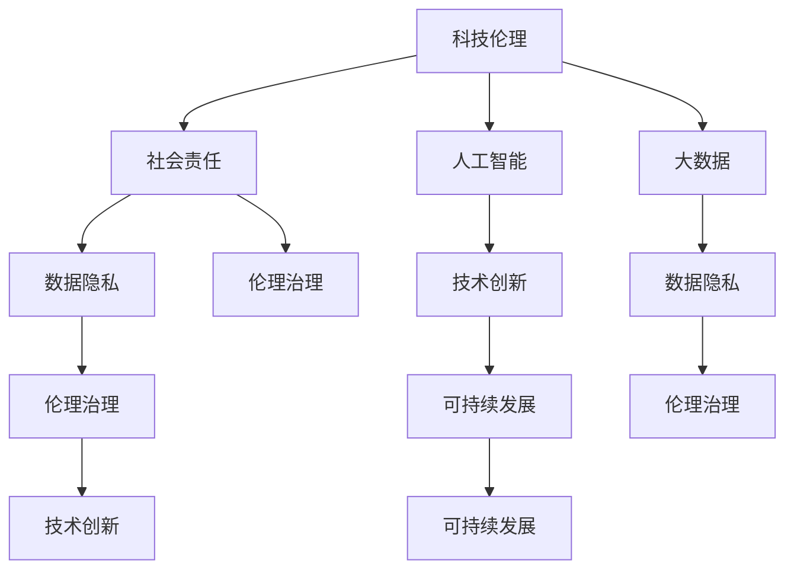

                 

# 科技向善：用科技的力量解决社会问题

> 关键词：科技向善,社会责任,人工智能,大数据,数据隐私,伦理治理,技术创新,可持续发展

## 1. 背景介绍

在数字化时代，科技迅猛发展，带来了前所未有的机遇与挑战。一方面，科技正改变着人们的生活、工作和社会交往方式，为社会发展注入新的活力；另一方面，技术的不当应用也可能带来新的社会问题，如数据隐私泄露、算法偏见、数字鸿沟等。如何在追求技术进步的同时，坚守伦理道德底线，让科技向善，成为当代科技工作者和全社会共同面临的重要课题。本文将从科技伦理的视角，探讨如何用科技的力量解决社会问题，并提出一些可行的策略。

## 2. 核心概念与联系

### 2.1 核心概念概述

为更好地理解科技向善的实践路径，本节将介绍几个关键概念：

- **科技伦理**：涉及科技发展的道德和伦理问题，强调科技应用应符合社会公正、隐私保护、环境可持续等基本原则。

- **社会责任**：指企业、组织和个人在追求经济效益的同时，应对社会、环境和伦理问题承担起责任。

- **人工智能**：一种模拟人类智能的计算机技术，通过算法和大数据实现决策和预测。

- **大数据**：指海量的、多样化、高速率的结构化和非结构化数据，是数据分析和决策的重要支撑。

- **数据隐私**：指个人和组织对其数据的所有权、使用权、控制权等权利的保护。

- **伦理治理**：指通过伦理原则和法律规则，对科技应用进行规范和约束的过程。

- **技术创新**：指在现有技术基础上，通过研发和应用新技术，推动社会发展进步。

- **可持续发展**：指满足当代需求的同时，不损害后代满足其需求的能力的发展模式。

这些概念紧密联系，共同构成了科技向善的生态系统。科技伦理是基础，社会责任是目标，人工智能和大数据是手段，数据隐私是保障，伦理治理是规范，技术创新是路径，可持续发展是最终目标。只有在这几方面协同发力，才能实现科技的真正向善。

### 2.2 概念间的关系

通过以下Mermaid流程图，我们可以更加清晰地理解这些核心概念之间的关系：



这个流程图展示了科技伦理与其他概念之间的紧密联系：

1. **科技伦理**为**社会责任**提供基础原则，指导科技应用的道德方向。
2. **社会责任**要求科技应用应符合伦理规范，实现公平、公正、可控的社会目标。
3. **人工智能**和**大数据**是实现科技伦理和社会责任的重要工具，通过数据驱动和算法优化，提升科技应用的精准性和效率。
4. **数据隐私**是科技伦理的核心内容之一，强调在数据收集和处理过程中保护个人隐私权益。
5. **伦理治理**则是通过法律法规和道德规范，对科技应用进行规范，确保科技应用的合法性和道德性。
6. **技术创新**是推动科技向善的驱动力，不断探索新技术、新方法，提升科技应用的实际效果。
7. **可持续发展**是科技向善的最终目标，要求科技应用不仅要解决当前问题，还要考虑长远影响，实现人与自然的和谐共生。

## 3. 核心算法原理 & 具体操作步骤
### 3.1 算法原理概述

科技向善的核心在于通过科技手段解决社会问题，实现技术应用的伦理化和可持续化。基于此，我们可以将科技向善的过程大致分为以下几步：

1. **数据采集与清洗**：收集和处理相关数据，确保数据的质量和隐私性。
2. **模型训练与优化**：训练和优化模型，提升模型的准确性和泛化能力。
3. **决策与干预**：将模型应用于实际决策，采取干预措施解决问题。
4. **评估与反馈**：评估模型效果，收集反馈信息，不断优化模型。

这些步骤可以通过一系列算法和技术实现。以下是详细描述。

### 3.2 算法步骤详解

#### 步骤1：数据采集与清洗

数据是科技向善的基础。在数据采集和清洗过程中，需注意以下几个关键点：

1. **数据来源的多样性**：采集多源数据，确保数据的全面性和代表性。
2. **数据隐私保护**：使用匿名化和加密技术，保护数据隐私权益。
3. **数据质量控制**：清洗缺失值、异常值等数据质量问题，确保数据的准确性和一致性。
4. **数据格式统一**：将不同来源的数据转换为统一格式，方便后续处理。

#### 步骤2：模型训练与优化

模型训练是科技向善的核心环节。通过大数据和人工智能技术，训练和优化模型，实现精准预测和决策。

1. **选择合适的算法和模型**：根据具体任务选择合适的算法和模型，如分类算法、回归算法、深度学习模型等。
2. **数据增强和迁移学习**：通过数据增强和迁移学习技术，提升模型的泛化能力。
3. **正则化和模型压缩**：使用正则化和模型压缩技术，控制模型的复杂度，避免过拟合。
4. **超参数调优**：通过超参数调优，找到最优的模型参数，提高模型的预测性能。

#### 步骤3：决策与干预

决策与干预是将模型应用于实际问题的关键步骤。需要确保模型的决策过程符合伦理规范，并在必要时刻进行干预。

1. **决策规则设计**：设计合理的决策规则，确保模型输出符合伦理原则和社会责任。
2. **人工干预机制**：建立人工干预机制，对模型的输出进行监控和调整，确保决策的公正性和透明性。
3. **透明化决策过程**：使用可解释性技术，使决策过程透明化，便于审查和监督。

#### 步骤4：评估与反馈

评估与反馈是持续优化模型的重要环节。通过持续评估和反馈，不断提高模型的准确性和社会适应性。

1. **性能评估指标**：根据具体任务选择合适的评估指标，如准确率、召回率、F1分数等。
2. **效果评估**：对模型在实际应用中的效果进行评估，发现和解决潜在问题。
3. **用户反馈收集**：收集用户和利益相关者的反馈信息，持续优化模型和应用。

### 3.3 算法优缺点

科技向善的算法具有以下优点：

1. **精准预测**：通过大数据和人工智能技术，能够实现精准的预测和决策，提升解决问题的效果。
2. **可扩展性强**：算法可以应用于多个领域，解决不同类型的问题，具有较强的泛化能力。
3. **透明化决策**：通过可解释性技术，使决策过程透明化，便于审查和监督，增强社会信任。

但同时也存在一些缺点：

1. **数据隐私问题**：在数据采集和处理过程中，可能面临数据隐私泄露的风险。
2. **模型偏见**：模型可能会受到训练数据偏见的影响，导致决策的偏差。
3. **资源消耗高**：大数据和人工智能技术的实现需要大量计算资源和存储空间。

### 3.4 算法应用领域

科技向善的算法已经广泛应用于多个领域，取得了显著的效果。以下是几个典型应用场景：

1. **医疗健康**：通过大数据分析和机器学习技术，预测疾病风险，辅助医生诊断和治疗，提升医疗服务水平。
2. **环境保护**：使用数据分析和模型预测，评估环境污染程度，制定科学的环境保护政策。
3. **公共安全**：通过人工智能技术，监测和预测自然灾害、犯罪行为等，保障公共安全。
4. **教育培训**：利用人工智能技术，提供个性化的学习推荐和评估，提升教育效果。
5. **金融风控**：应用机器学习模型，分析金融风险，提高金融产品的风险控制能力。

## 4. 数学模型和公式 & 详细讲解 & 举例说明

### 4.1 数学模型构建

在科技向善的算法中，数学模型是不可或缺的工具。本文以一个简单的分类问题为例，构建一个二分类模型。

设输入数据为 $(x_1, x_2, \ldots, x_n)$，其中 $x_i \in \mathbb{R}^d$ 为第 $i$ 个样本的特征向量。模型输出为 $y \in \{0, 1\}$，表示样本属于正类的概率。模型的目标是最小化损失函数：

$$
L(y) = -\log P(y|x) = -\log \sigma(\mathbf{w} \cdot \mathbf{x} + b)
$$

其中 $\sigma(z) = \frac{1}{1+\exp(-z)}$ 为sigmoid函数，$\mathbf{w}$ 为模型权重，$b$ 为偏置项。

### 4.2 公式推导过程

上述损失函数的梯度公式为：

$$
\frac{\partial L(y)}{\partial \mathbf{w}} = \frac{1-y}{\sigma(\mathbf{w} \cdot \mathbf{x} + b)} \cdot \mathbf{x}
$$

$$
\frac{\partial L(y)}{\partial b} = \frac{1-y}{\sigma(\mathbf{w} \cdot \mathbf{x} + b)}
$$

通过反向传播算法，可以更新模型权重 $\mathbf{w}$ 和偏置项 $b$，实现模型的优化。

### 4.3 案例分析与讲解

以一个简单的欺诈检测问题为例，展示如何使用科技向善的算法。

假设一个银行需要识别客户的欺诈行为。银行收集了大量的客户交易数据，将其分为训练集和测试集。通过机器学习算法，训练一个二分类模型，预测客户是否存在欺诈行为。在训练过程中，需要注意以下几点：

1. **数据采集**：从银行内部系统、外部数据源等收集客户交易数据，确保数据的全面性和多样性。
2. **数据清洗**：清洗缺失值、异常值等数据质量问题，确保数据的准确性和一致性。
3. **模型训练**：选择适当的算法和模型，如逻辑回归、支持向量机、决策树等，训练二分类模型。
4. **评估与优化**：使用准确率、召回率、F1分数等指标评估模型效果，对模型进行优化。
5. **决策与干预**：根据模型的输出结果，采取相应的干预措施，如报警、联系客户等。
6. **反馈与改进**：收集用户和利益相关者的反馈信息，持续优化模型和应用。

## 5. 项目实践：代码实例和详细解释说明

### 5.1 开发环境搭建

在进行科技向善的项目实践前，我们需要准备好开发环境。以下是使用Python进行Scikit-learn开发的Python环境配置流程：

1. 安装Anaconda：从官网下载并安装Anaconda，用于创建独立的Python环境。

2. 创建并激活虚拟环境：
```bash
conda create -n sklearn-env python=3.8 
conda activate sklearn-env
```

3. 安装Scikit-learn：
```bash
pip install scikit-learn
```

4. 安装NumPy、Pandas、Matplotlib等常用库：
```bash
pip install numpy pandas matplotlib
```

5. 安装SciPy、Seaborn等进阶库：
```bash
pip install scipy seaborn
```

完成上述步骤后，即可在`sklearn-env`环境中开始项目实践。

### 5.2 源代码详细实现

下面我们以一个简单的二分类问题为例，展示如何使用Scikit-learn实现科技向善的算法。

首先，导入所需的库：

```python
import numpy as np
import pandas as pd
from sklearn.model_selection import train_test_split
from sklearn.linear_model import LogisticRegression
from sklearn.metrics import accuracy_score, confusion_matrix
```

然后，准备数据集：

```python
# 读取数据集
data = pd.read_csv('data.csv')

# 将数据集分为特征和标签
X = data.drop('label', axis=1)
y = data['label']

# 数据预处理
X = (X - X.mean()) / X.std()  # 标准化
```

接着，划分训练集和测试集：

```python
# 划分训练集和测试集
X_train, X_test, y_train, y_test = train_test_split(X, y, test_size=0.2, random_state=42)
```

然后，训练模型：

```python
# 初始化模型
model = LogisticRegression()

# 训练模型
model.fit(X_train, y_train)
```

最后，评估模型：

```python
# 预测测试集结果
y_pred = model.predict(X_test)

# 计算模型准确率
accuracy = accuracy_score(y_test, y_pred)

# 输出混淆矩阵
confusion_mat = confusion_matrix(y_test, y_pred)
print(confusion_mat)
print(f'Accuracy: {accuracy:.2f}')
```

以上就是使用Scikit-learn进行科技向善项目实践的完整代码实现。可以看到，Scikit-learn提供了简单易用的接口，可以快速实现模型训练和评估，便于进一步的优化和改进。

### 5.3 代码解读与分析

让我们再详细解读一下关键代码的实现细节：

**数据准备**：
- 读取数据集：使用Pandas库的`read_csv`函数读取数据集。
- 数据预处理：将数据进行标准化，确保特征值在相同的尺度上。

**模型训练**：
- 初始化模型：使用Scikit-learn的`LogisticRegression`类初始化二分类模型。
- 训练模型：使用`fit`函数对模型进行训练，根据训练数据和标签更新模型参数。

**模型评估**：
- 预测测试集结果：使用训练好的模型对测试集进行预测。
- 计算模型准确率：使用`accuracy_score`函数计算模型在测试集上的准确率。
- 输出混淆矩阵：使用`confusion_matrix`函数计算模型的混淆矩阵，展示模型的预测结果。

**代码优化**：
- 数据划分：使用`train_test_split`函数将数据集随机划分为训练集和测试集，确保模型评估的公平性。
- 模型优化：可以在模型训练过程中使用正则化、交叉验证等技术，进一步提升模型的性能。

## 6. 实际应用场景

### 6.1 医疗健康

在医疗健康领域，科技向善的应用非常广泛。通过大数据和人工智能技术，可以实现精准医疗、健康管理、疾病预测等。

例如，利用机器学习算法，分析病人的电子健康记录（EHR），预测患者的疾病风险，制定个性化的治疗方案。可以采用以下步骤：

1. **数据采集**：从医院信息系统、医疗设备、穿戴设备等收集患者数据。
2. **数据清洗**：清洗缺失值、异常值等数据质量问题，确保数据的准确性和一致性。
3. **模型训练**：选择适当的算法和模型，如随机森林、支持向量机、神经网络等，训练疾病预测模型。
4. **评估与优化**：使用准确率、召回率、F1分数等指标评估模型效果，对模型进行优化。
5. **决策与干预**：根据模型的输出结果，制定个性化的治疗方案，并在必要时进行人工干预。
6. **反馈与改进**：收集医生和患者反馈信息，持续优化模型和应用。

### 6.2 环境保护

环境保护是科技向善的重要领域之一。通过大数据和人工智能技术，可以实现环境监测、污染预测、资源管理等。

例如，利用机器学习算法，分析环境监测数据，预测空气质量、水质等指标的变化趋势，制定科学的环境保护政策。可以采用以下步骤：

1. **数据采集**：从环境监测站、卫星、无人机等收集环境数据。
2. **数据清洗**：清洗缺失值、异常值等数据质量问题，确保数据的准确性和一致性。
3. **模型训练**：选择适当的算法和模型，如时间序列分析、回归模型等，训练环境预测模型。
4. **评估与优化**：使用均方误差、相关系数等指标评估模型效果，对模型进行优化。
5. **决策与干预**：根据模型的输出结果，制定环境保护政策，并在必要时进行人工干预。
6. **反馈与改进**：收集专家和公众反馈信息，持续优化模型和应用。

### 6.3 公共安全

公共安全是科技向善的重要应用之一。通过大数据和人工智能技术，可以实现犯罪预测、灾害预警、应急管理等。

例如，利用机器学习算法，分析犯罪数据、气象数据、交通数据等，预测犯罪行为、自然灾害的发生，制定科学的应急预案。可以采用以下步骤：

1. **数据采集**：从警察局、气象局、交通局等收集公共安全数据。
2. **数据清洗**：清洗缺失值、异常值等数据质量问题，确保数据的准确性和一致性。
3. **模型训练**：选择适当的算法和模型，如随机森林、支持向量机、神经网络等，训练安全预测模型。
4. **评估与优化**：使用准确率、召回率、F1分数等指标评估模型效果，对模型进行优化。
5. **决策与干预**：根据模型的输出结果，制定应急预案，并在必要时进行人工干预。
6. **反馈与改进**：收集应急管理者反馈信息，持续优化模型和应用。

## 7. 工具和资源推荐

### 7.1 学习资源推荐

为了帮助开发者系统掌握科技向善的理论基础和实践技巧，这里推荐一些优质的学习资源：

1. **《人工智能伦理》课程**：斯坦福大学开设的AI伦理课程，深入探讨AI技术的伦理问题，提供理论知识和实践案例。
2. **《人工智能伦理指南》书籍**：详细阐述AI伦理的基本原则和应用场景，提供实际案例和政策建议。
3. **《数据科学与伦理》课程**：北京大学开设的数据科学与伦理课程，涵盖数据隐私、算法偏见、数据治理等前沿话题。
4. **《AI伦理与社会》书籍**：探讨AI技术在社会中的应用，关注伦理、法律、政策等重要问题。
5. **Google AI博客**：Google AI团队定期发布的AI伦理相关文章，提供前沿资讯和创新实践。

通过对这些资源的学习实践，相信你一定能够快速掌握科技向善的精髓，并用于解决实际的伦理问题。

### 7.2 开发工具推荐

高效的开发离不开优秀的工具支持。以下是几款用于科技向善开发的常用工具：

1. **Jupyter Notebook**：Python数据分析与机器学习的首选开发环境，支持代码编写、数据可视化、交互式计算等。
2. **TensorFlow**：由Google主导开发的开源深度学习框架，生产部署方便，适合大规模工程应用。
3. **PyTorch**：基于Python的开源深度学习框架，灵活动态的计算图，适合快速迭代研究。
4. **Scikit-learn**：Python数据科学库，提供简单易用的机器学习算法和工具，适合快速开发模型。
5. **Seaborn**：基于Matplotlib的数据可视化库，支持高级统计图表绘制，方便数据分析和展示。
6. **D3.js**：一个JavaScript数据可视化库，支持交互式数据图表绘制，适合网页数据展示。

合理利用这些工具，可以显著提升科技向善项目的开发效率，加快创新迭代的步伐。

### 7.3 相关论文推荐

科技向善的研究源于学界的持续探索。以下是几篇奠基性的相关论文，推荐阅读：

1. **《人工智能的伦理问题》**：探讨AI技术在社会中的应用，关注伦理、法律、政策等重要问题。
2. **《数据隐私保护》**：介绍数据隐私保护的基本概念和前沿技术，提供实践指南和案例分析。
3. **《机器学习算法的公平性研究》**：探讨机器学习算法的偏见问题，提出解决策略和优化方法。
4. **《伦理治理在人工智能中的应用》**：探讨伦理治理在AI应用中的重要作用，提出规范和约束措施。
5. **《人工智能的可持续发展研究》**：探讨AI技术对环境、社会和经济的影响，提出可持续发展的策略和路径。

这些论文代表了大数据和人工智能技术的伦理和可持续发展研究的发展脉络，通过学习这些前沿成果，可以帮助研究者把握学科前进方向，激发更多的创新灵感。

除上述资源外，还有一些值得关注的前沿资源，帮助开发者紧跟科技向善技术的最新进展，例如：

1. **arXiv论文预印本**：人工智能领域最新研究成果的发布平台，包括大量尚未发表的前沿工作，学习前沿技术的必读资源。
2. **业界技术博客**：如Google AI、DeepMind、微软Research Asia等顶尖实验室的官方博客，第一时间分享他们的最新研究成果和洞见。
3. **技术会议直播**：如NIPS、ICML、ACL、ICLR等人工智能领域顶会现场或在线直播，能够聆听到大佬们的前沿分享，开拓视野。
4. **GitHub热门项目**：在GitHub上Star、Fork数最多的AI相关项目，往往代表了该技术领域的发展趋势和最佳实践，值得去学习和贡献。
5. **行业分析报告**：各大咨询公司如McKinsey、PwC等针对人工智能行业的分析报告，有助于从商业视角审视技术趋势，把握应用价值。

总之，对于科技向善技术的学习和实践，需要开发者保持开放的心态和持续学习的意愿。多关注前沿资讯，多动手实践，多思考总结，必将收获满满的成长收益。

## 8. 总结：未来发展趋势与挑战

### 8.1 总结

本文对科技向善的算法进行了全面系统的介绍。首先阐述了科技向善的伦理基础和社会责任，明确了科技向善在实现技术进步的同时，应符合伦理规范和社会目标。其次，从算法原理到实际操作，详细讲解了科技向善的数学模型和关键步骤，给出了科技向善任务开发的完整代码实例。同时，本文还广泛探讨了科技向善在医疗健康、环境保护、公共安全等多个领域的应用前景，展示了科技向善的广阔前景。此外，本文精选了科技向善技术的各类学习资源，力求为读者提供全方位的技术指引。

通过本文的系统梳理，可以看到，科技向善的算法不仅具备强大的预测和决策能力，更承载着社会责任和伦理使命。科技向善的实施需要多学科协同发力，共同推动科技与社会的和谐发展。

### 8.2 未来发展趋势

展望未来，科技向善的算法将呈现以下几个发展趋势：

1. **数据隐私保护加强**：随着数据隐私保护法规的不断完善，科技向善的应用将更加注重保护个人和组织的数据隐私权益。
2. **算法公平性和透明性提升**：通过引入可解释性技术，提升算法的公平性和透明性，增强社会信任和接受度。
3. **跨领域应用的普及**：科技向善的算法将拓展到更多领域，如农业、教育、金融等，实现技术应用的全面覆盖。
4. **可持续发展的推动**：科技向善的算法将更加注重环境保护、资源管理、社会福祉等可持续发展目标，实现技术与社会的共赢。
5. **伦理治理的规范化**：科技向善的实施将更加依赖伦理治理机制，建立健全的法律法规和道德规范，确保技术应用的合法性和道德性。

### 8.3 面临的挑战

尽管科技向善的算法已经取得了显著成就，但在实现科技向善的过程中，仍面临诸多挑战：

1. **数据隐私问题**：在数据采集和处理过程中，可能面临数据隐私泄露的风险，如何保护用户隐私权益是一个重要挑战。
2. **算法偏见问题**：模型可能会受到训练数据偏见的影响，导致决策的偏差，如何在模型训练过程中避免偏见是一个重要问题。
3. **资源消耗高**：大数据和人工智能技术的实现需要大量计算资源和存储空间，如何提高资源利用效率是一个重要课题。
4. **技术伦理问题**：科技向善的实施需要多学科协同，如何平衡技术进步和伦理道德是一个重要问题。
5. **公众接受度**：科技向善的推广需要公众的理解和支持，如何提高公众的接受度和信任度是一个重要课题。

### 8.4 研究展望

面对科技向善面临的种种挑战，未来的研究需要在以下几个方面寻求新的突破：

1. **数据隐私保护技术**：开发更加高效的数据隐私保护技术，如差分隐私、联邦学习等，确保数据隐私权益。
2. **算法公平性和透明性技术**：引入可解释性技术，提升算法的公平性和透明性，增强社会信任和接受度。
3. **跨领域应用技术**：拓展科技向善的应用领域，开发跨领域应用技术，实现技术应用的全面覆盖。
4. **可持续发展的技术**：开发支持环境保护、资源管理、社会福祉等可持续发展目标的技术，实现技术与社会的共赢。
5. **伦理治理技术**：建立健全的法律法规和道德规范，确保技术应用的合法性和道德性，促进科技向善的规范化实施。

这些研究方向的探索，必将引领科技向善技术迈向更高的台阶，为构建安全、可靠、可解释、可控的智能系统铺平道路。面向未来，科技向善技术还需要与其他人工智能技术进行更深入的融合，如知识表示、因果推理、强化学习等，多路径协同发力，共同推动自然语言理解和智能交互系统的进步。只有勇于创新、敢于突破，才能不断拓展语言模型的边界，让智能技术更好地造福人类社会。

## 9. 附录：常见问题与解答

**Q1：如何理解科技向善的内涵？**

A: 科技向善的内涵在于通过科技手段解决社会问题，实现技术应用的伦理化和可持续化。科技向善不仅要追求技术进步，更要注重伦理道德和社会责任，确保科技应用的合法性和道德性。

**Q2：科技向善的算法如何保证数据隐私？**

A: 保护数据隐私是科技向善的重要环节。在数据采集和处理过程中，可以采用以下措施：
1. 数据

