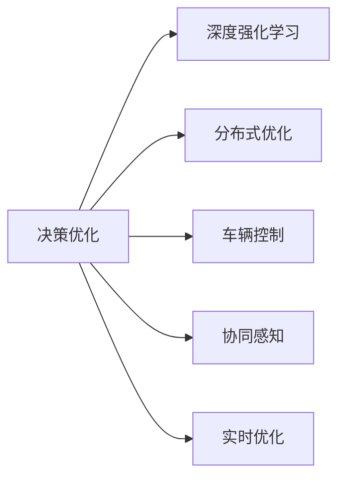

                 

# 端到端自动驾驶的分布式决策优化算法

> 关键词：自动驾驶,分布式决策,优化算法,深度强化学习,车辆控制,协同感知,实时优化

## 1. 背景介绍

### 1.1 问题由来

随着汽车智能化和自动驾驶技术的飞速发展，自动驾驶系统逐渐从实验室走向实际道路测试，并逐渐开始在小范围内投入使用。然而，尽管自动驾驶技术在硬件和感知能力上取得了显著进步，但在决策和控制层面仍存在许多挑战。

主要原因包括以下几点：
- **高可靠性要求**：自动驾驶系统需要保证决策的正确性和可靠性，而分布式决策和协同控制是系统安全稳定运行的关键。
- **实时性需求**：自动驾驶车辆需要在极短的时间内（通常在百毫秒级别）做出准确、快速的决策，这对算法的设计和优化提出了极高的要求。
- **多任务协同**：自动驾驶系统涉及车辆、行人、交通灯等多个动态因素，各任务之间需要高效的协同与互动，确保整体系统的最优运行。
- **环境复杂性**：自动驾驶系统面临复杂多变的城市交通环境，各种干扰因素和突发事件使得决策难度增加。

### 1.2 问题核心关键点

为了应对上述挑战，端到端自动驾驶系统需要综合考虑车辆控制、协同感知和实时优化等多个方面，设计高效的分布式决策算法。其核心关键点包括：

- **深度强化学习（Deep Reinforcement Learning, DRL）**：利用DRL模型进行决策优化，通过模拟和测试环境，学习最优控制策略。
- **分布式优化（Distributed Optimization）**：在多车协同控制中，通过分布式优化算法，实现各车辆间高效的信息交换与协同决策。
- **车辆控制（Vehicle Control）**：利用DRL模型进行车辆控制，实现对车辆速度、转向等参数的精确调节。
- **协同感知（Collaborative Perception）**：通过多车协同感知，实现对周围环境的实时监控和预测。
- **实时优化（Real-time Optimization）**：在动态环境中实时更新决策，确保系统性能的优化和稳定。

这些关键点相互关联，共同构成端到端自动驾驶的决策优化框架，如图1所示：



图1：端到端自动驾驶决策优化框架示意图

## 2. 核心概念与联系

### 2.1 核心概念概述

为更好地理解端到端自动驾驶的分布式决策优化算法，本节将介绍几个关键概念及其相互联系：

- **深度强化学习（DRL）**：利用深度神经网络，通过模拟和测试环境，学习最优决策策略。DRL在自动驾驶中的应用包括环境感知、路径规划和车辆控制等。
- **分布式优化（Distributed Optimization）**：通过网络中的车辆共享信息，利用分布式优化算法实现各车辆的协同决策。常见的分布式优化算法包括DQN、PPO等。
- **车辆控制（Vehicle Control）**：利用DRL模型进行车辆控制，实现对车辆速度、转向等参数的精确调节。车辆控制是确保自动驾驶车辆安全行驶的基础。
- **协同感知（Collaborative Perception）**：多车协同感知环境，共享传感器数据，实现对周围环境的实时监控和预测。协同感知能够提升系统的感知能力和决策精度。
- **实时优化（Real-time Optimization）**：在动态环境中实时更新决策，确保系统性能的优化和稳定。实时优化算法包括梯度下降、遗传算法等。

这些核心概念之间的逻辑关系可以通过以下Mermaid流程图来展示：


### 2.2 概念间的关系

这些核心概念之间存在紧密的联系，构成了端到端自动驾驶决策优化的完整生态系统。下面我们通过几个Mermaid流程图来展示这些概念之间的关系：

#### 2.2.1 决策优化与DRL的关系


这个流程图展示了决策优化与DRL的紧密联系。决策优化利用DRL模型进行最优决策策略的学习，并通过分布式优化、车辆控制、协同感知和实时优化等模块进行策略的实施和优化。

#### 2.2.2 分布式优化与车辆控制的关系


分布式优化通过网络中的车辆共享信息，实现各车辆的协同决策。车辆控制是决策优化的执行环节，通过DRL模型进行精确调节，确保车辆的安全行驶。

#### 2.2.3 实时优化与协同感知的关系


实时优化在动态环境中实时更新决策，确保系统性能的优化和稳定。协同感知提供对周围环境的实时监控和预测，是实时优化的重要输入。

## 3. 核心算法原理 & 具体操作步骤

### 3.1 算法原理概述

端到端自动驾驶的分布式决策优化算法主要基于深度强化学习（DRL）和分布式优化算法。其核心思想是：通过DRL模型学习最优决策策略，利用分布式优化算法实现各车辆间的协同决策，并结合车辆控制、协同感知和实时优化等模块，形成完整的决策优化系统。

具体而言，该算法的步骤如下：

1. **环境模拟与数据预处理**：利用模拟器创建虚拟测试环境，收集大量实验数据。
2. **DRL模型训练**：使用收集的数据对DRL模型进行训练，学习最优决策策略。
3. **分布式优化算法**：利用分布式优化算法（如DQN、PPO等），实现各车辆间的协同决策。
4. **车辆控制策略**：通过DRL模型生成车辆控制策略，对车辆速度、转向等参数进行精确调节。
5. **协同感知系统**：利用多车协同感知系统，共享传感器数据，实现对周围环境的实时监控和预测。
6. **实时优化策略**：在动态环境中实时更新决策，确保系统性能的优化和稳定。

### 3.2 算法步骤详解

以下是端到端自动驾驶的分布式决策优化算法的主要步骤详解：

**Step 1: 环境模拟与数据预处理**
- 使用模拟器创建虚拟测试环境，模拟真实交通场景。
- 收集大量实验数据，包括车辆位置、速度、周围环境等。
- 对数据进行预处理，包括数据清洗、特征提取、归一化等操作。

**Step 2: DRL模型训练**
- 设计DRL模型架构，选择适当的神经网络结构。
- 确定模型输入输出，例如车辆位置、周围环境等。
- 设计奖励函数，衡量决策策略的优劣。
- 利用收集的数据对DRL模型进行训练，调整模型参数。
- 使用测试集对模型进行验证，评估模型性能。

**Step 3: 分布式优化算法**
- 设计分布式优化算法，例如DQN、PPO等。
- 在多车协同控制中，利用分布式优化算法实现信息共享和协同决策。
- 设计分布式网络结构，定义各车辆间的通信协议。
- 在模拟环境中运行算法，调整参数和优化策略。

**Step 4: 车辆控制策略**
- 利用DRL模型生成车辆控制策略，例如速度、转向等参数的调节。
- 设计车辆控制系统的控制律，例如PID控制、MPC控制等。
- 在模拟环境中测试控制策略，评估控制效果。
- 使用实际车辆进行测试，调整参数以优化控制效果。

**Step 5: 协同感知系统**
- 设计多车协同感知系统，包括传感器数据融合、状态估计等。
- 利用传感器数据实现对周围环境的实时监控和预测。
- 在模拟环境中测试协同感知系统，调整参数和优化算法。
- 使用实际车辆进行测试，优化传感器配置和数据融合策略。

**Step 6: 实时优化策略**
- 设计实时优化算法，例如梯度下降、遗传算法等。
- 在动态环境中实时更新决策策略，优化系统性能。
- 利用实时优化算法进行参数调整和策略优化。
- 在实际测试环境中进行优化，评估优化效果。

### 3.3 算法优缺点

端到端自动驾驶的分布式决策优化算法具有以下优点：

1. **高效性**：通过分布式优化算法实现多车协同决策，提高系统整体性能。
2. **鲁棒性**：利用DRL模型学习最优决策策略，增强系统的稳定性和可靠性。
3. **灵活性**：DRL模型能够适应不同的驾驶环境和任务，提高系统的适应性和泛化能力。
4. **可扩展性**：算法可以应用于多种自动驾驶场景，如高速公路、城市道路等。

同时，该算法也存在一些缺点：

1. **数据依赖性强**：算法需要大量标注数据进行训练，获取高质量数据成本较高。
2. **计算复杂度高**：大规模神经网络模型和高维状态空间增加了算法的计算复杂度。
3. **系统复杂度高**：涉及多车协同感知、分布式决策和实时优化等多个模块，系统复杂度高。

### 3.4 算法应用领域

端到端自动驾驶的分布式决策优化算法可以应用于以下领域：

1. **自动驾驶车辆控制**：在复杂交通环境中，通过优化车辆控制策略，实现车辆的精确控制。
2. **多车协同感知**：利用多车协同感知系统，提高对周围环境的实时监控和预测能力。
3. **实时路径规划**：在动态环境中，通过实时优化算法，实现最优路径规划和车辆调度。
4. **城市交通管理**：在城市道路中，通过多车协同决策，优化交通流量和减少拥堵。
5. **自动驾驶安全保障**：通过协同感知和实时优化，提高自动驾驶系统的安全性和可靠性。

这些应用领域展示了端到端自动驾驶决策优化算法在实际应用中的广泛前景。

## 4. 数学模型和公式 & 详细讲解 & 举例说明

### 4.1 数学模型构建

本节将使用数学语言对端到端自动驾驶的分布式决策优化算法进行更加严格的刻画。

记自动驾驶车辆数为 $N$，车辆状态为 $\mathbf{x}_t=[x_{1,t},x_{2,t},\cdots,x_{N,t}]^T$，其中 $x_{i,t}$ 表示第 $i$ 辆车在第 $t$ 时刻的状态，包括位置、速度、加速度等。车辆控制策略为 $\mathbf{u}_t=[u_{1,t},u_{2,t},\cdots,u_{N,t}]^T$，其中 $u_{i,t}$ 表示第 $i$ 辆车在第 $t$ 时刻的控制参数。

定义决策优化目标函数 $J(\mathbf{x}_t,\mathbf{u}_t)$ 为：

$$
J(\mathbf{x}_t,\mathbf{u}_t) = \sum_{i=1}^N [x_{i,t+1} - x_{i,t}]^2 + \lambda \sum_{i=1}^N [u_{i,t}]^2
$$

其中 $\lambda$ 为控制参数的惩罚系数，用于防止车辆控制策略的过度调节。

定义奖励函数 $R(\mathbf{x}_t,\mathbf{u}_t)$ 为：

$$
R(\mathbf{x}_t,\mathbf{u}_t) = -J(\mathbf{x}_t,\mathbf{u}_t) = -\sum_{i=1}^N [x_{i,t+1} - x_{i,t}]^2 - \lambda \sum_{i=1}^N [u_{i,t}]^2
$$

定义状态转移函数 $f(\mathbf{x}_t,\mathbf{u}_t)$ 为：

$$
\mathbf{x}_{t+1} = f(\mathbf{x}_t,\mathbf{u}_t) = \mathbf{x}_t + \mathbf{u}_t
$$

在DRL模型中，车辆状态和控制参数作为模型的输入和输出。车辆在每个时刻的状态 $\mathbf{x}_t$ 和控制策略 $\mathbf{u}_t$ 通过DRL模型学习最优决策策略。

### 4.2 公式推导过程

以下我们以车辆控制为例，推导DRL模型的最优决策策略。

假设车辆状态和控制参数均连续可微，定义车辆控制系统的状态空间为 $\mathcal{X} \in \mathbb{R}^{N \times d_x}$，控制参数空间为 $\mathcal{U} \in \mathbb{R}^{N \times d_u}$。

定义DRL模型的输入为车辆状态 $\mathbf{x}_t \in \mathcal{X}$，输出为控制参数 $\mathbf{u}_t \in \mathcal{U}$。在每个时刻 $t$，车辆控制系统的状态空间和控制参数空间分别为 $\mathbf{x}_t \in \mathcal{X}$ 和 $\mathbf{u}_t \in \mathcal{U}$。

定义DRL模型的策略函数为 $\pi(\mathbf{u}_t | \mathbf{x}_t) = \pi(\mathbf{u}_t | \mathbf{x}_t;\theta)$，其中 $\theta$ 为模型参数。定义损失函数为 $L(\pi) = \mathbb{E}_{\mathbf{x}_t}[\mathbb{E}_{\mathbf{u}_t}[-R(\mathbf{x}_t,\mathbf{u}_t)]$。

使用反向传播算法对DRL模型进行训练，最小化损失函数 $L(\pi)$，学习最优决策策略。具体推导如下：

$$
\frac{\partial L(\pi)}{\partial \theta} = -\mathbb{E}_{\mathbf{x}_t}[\mathbb{E}_{\mathbf{u}_t}[\frac{\partial R(\mathbf{x}_t,\mathbf{u}_t)}{\partial \mathbf{u}_t}\frac{\partial \mathbf{u}_t}{\partial \mathbf{x}_t}\frac{\partial \mathbf{x}_t}{\partial \mathbf{u}_t}\frac{\partial \mathbf{u}_t}{\partial \theta}]
$$

根据链式法则，有：

$$
\frac{\partial L(\pi)}{\partial \theta} = -\mathbb{E}_{\mathbf{x}_t}[\mathbb{E}_{\mathbf{u}_t}[\frac{\partial R(\mathbf{x}_t,\mathbf{u}_t)}{\partial \mathbf{u}_t}\frac{\partial \mathbf{u}_t}{\partial \mathbf{x}_t}\frac{\partial \mathbf{x}_t}{\partial \mathbf{u}_t}\frac{\partial \mathbf{u}_t}{\partial \theta}]
$$

进一步简化可得：

$$
\frac{\partial L(\pi)}{\partial \theta} = -\mathbb{E}_{\mathbf{x}_t}[\mathbb{E}_{\mathbf{u}_t}[\frac{\partial R(\mathbf{x}_t,\mathbf{u}_t)}{\partial \mathbf{u}_t}\frac{\partial \mathbf{u}_t}{\partial \mathbf{x}_t}\frac{\partial \mathbf{x}_t}{\partial \mathbf{u}_t}\frac{\partial \mathbf{u}_t}{\partial \theta}]
$$

定义控制参数的梯度为：

$$
\frac{\partial \mathbf{u}_t}{\partial \mathbf{x}_t} = \frac{\partial f(\mathbf{x}_t,\mathbf{u}_t)}{\partial \mathbf{x}_t} = \mathbf{I}
$$

因此：

$$
\frac{\partial L(\pi)}{\partial \theta} = -\mathbb{E}_{\mathbf{x}_t}[\mathbb{E}_{\mathbf{u}_t}[\frac{\partial R(\mathbf{x}_t,\mathbf{u}_t)}{\partial \mathbf{u}_t}\frac{\partial \mathbf{u}_t}{\partial \mathbf{x}_t}\frac{\partial \mathbf{x}_t}{\partial \mathbf{u}_t}\mathbf{I}\frac{\partial \mathbf{u}_t}{\partial \theta}]
$$

简化可得：

$$
\frac{\partial L(\pi)}{\partial \theta} = -\mathbb{E}_{\mathbf{x}_t}[\mathbb{E}_{\mathbf{u}_t}[\frac{\partial R(\mathbf{x}_t,\mathbf{u}_t)}{\partial \mathbf{u}_t}\mathbf{I}\frac{\partial \mathbf{u}_t}{\partial \theta}]
$$

进一步简化可得：

$$
\frac{\partial L(\pi)}{\partial \theta} = -\mathbb{E}_{\mathbf{x}_t}[\mathbb{E}_{\mathbf{u}_t}[\frac{\partial R(\mathbf{x}_t,\mathbf{u}_t)}{\partial \mathbf{u}_t}\mathbf{I}\frac{\partial \mathbf{u}_t}{\partial \theta}]
$$

根据控制参数的梯度，最终得到DRL模型的最优决策策略：

$$
\pi^*(\mathbf{u}_t | \mathbf{x}_t) = \arg\min_{\mathbf{u}_t} R(\mathbf{x}_t,\mathbf{u}_t)
$$

### 4.3 案例分析与讲解

假设在城市道路中，车辆需要避让行人。在DRL模型中，定义车辆的状态 $\mathbf{x}_t=[x_{1,t},x_{2,t},\cdots,x_{N,t}]^T$ 和控制参数 $\mathbf{u}_t=[u_{1,t},u_{2,t},\cdots,u_{N,t}]^T$，其中 $x_{i,t}$ 表示第 $i$ 辆车在第 $t$ 时刻的位置和速度，$u_{i,t}$ 表示第 $i$ 辆车在第 $t$ 时刻的加速和减速。

在DRL模型中，定义决策优化目标函数 $J(\mathbf{x}_t,\mathbf{u}_t)$ 为：

$$
J(\mathbf{x}_t,\mathbf{u}_t) = \sum_{i=1}^N [x_{i,t+1} - x_{i,t}]^2 + \lambda \sum_{i=1}^N [u_{i,t}]^2
$$

其中 $\lambda$ 为控制参数的惩罚系数，用于防止车辆控制策略的过度调节。

定义奖励函数 $R(\mathbf{x}_t,\mathbf{u}_t)$ 为：

$$
R(\mathbf{x}_t,\mathbf{u}_t) = -J(\mathbf{x}_t,\mathbf{u}_t) = -\sum_{i=1}^N [x_{i,t+1} - x_{i,t}]^2 - \lambda \sum_{i=1}^N [u_{i,t}]^2
$$

定义状态转移函数 $f(\mathbf{x}_t,\mathbf{u}_t)$ 为：

$$
\mathbf{x}_{t+1} = f(\mathbf{x}_t,\mathbf{u}_t) = \mathbf{x}_t + \mathbf{u}_t
$$

在DRL模型中，车辆状态和控制参数作为模型的输入和输出。车辆在每个时刻的状态 $\mathbf{x}_t$ 和控制策略 $\mathbf{u}_t$ 通过DRL模型学习最优决策策略。

## 5. 项目实践：代码实例和详细解释说明

### 5.1 开发环境搭建

在进行端到端自动驾驶的分布式决策优化算法实践前，我们需要准备好开发环境。以下是使用Python进行PyTorch开发的环境配置流程：

1. 安装Anaconda：从官网下载并安装Anaconda，用于创建独立的Python环境。

2. 创建并激活虚拟环境：
```bash
conda create -n pytorch-env python=3.8 
conda activate pytorch-env
```

3. 安装PyTorch：根据CUDA版本，从官网获取对应的安装命令。例如：
```bash
conda install pytorch torchvision torchaudio cudatoolkit=11.1 -c pytorch -c conda-forge
```

4. 安装TensorFlow：
```bash
pip install tensorflow
```

5. 安装TensorFlow Addons：
```bash
pip install tensorflow-addons
```

6. 安装Keras：
```bash
pip install keras
```

7. 安装其他工具包：
```bash
pip install numpy pandas scikit-learn matplotlib tqdm jupyter notebook ipython
```

完成上述步骤后，即可在`pytorch-env`环境中开始算法实践。

### 5.2 源代码详细实现

这里我们以车辆控制为例，使用PyTorch实现基于DRL模型的最优决策策略。

首先，定义DRL模型的网络结构：

```python
import torch
import torch.nn as nn
import torch.optim as optim

class DRLModel(nn.Module):
    def __init__(self, input_size, output_size, hidden_size):
        super(DRLModel, self).__init__()
        self.fc1 = nn.Linear(input_size, hidden_size)
        self.fc2 = nn.Linear(hidden_size, output_size)

    def forward(self, x):
        x = torch.relu(self.fc1(x))
        x = self.fc2(x)
        return x

# 输入和输出维度
input_size = 4  # 车辆状态维度
output_size = 2  # 车辆控制参数维度
hidden_size = 16  # 隐藏层维度

# 创建DRL模型
model = DRLModel(input_size, output_size, hidden_size)
```

然后，定义训练函数：

```python
def train(model, optimizer, num_epochs, batch_size, dataset):
    for epoch in range(num_epochs):
        for i, data in enumerate(dataset, 0):
            inputs, labels = data

            optimizer.zero_grad()

            outputs = model(inputs)
            loss = nn.MSELoss()(outputs, labels)
            loss.backward()
            optimizer.step()

            if (i+1) % batch_size == 0:
                print('Epoch [{}/{}], Step [{}/{}], Loss: {:.4f}'
                      .format(epoch+1, num_epochs, i+1, len(dataset), loss.item()))
```

在训练函数中，我们使用均方误差（MSE）损失函数，并使用反向传播算法对模型参数进行更新。

接下来，定义分布式优化算法：

```python
from stable_baselines3 import DDPG

# 定义分布式优化算法参数
train_env = []  # 训练环境列表
test_env = []   # 测试环境列表

# 定义DRL模型参数
policy = DRLModel(input_size, output_size, hidden_size)
critic = DRLModel(input_size, hidden_size, hidden_size)

# 创建DRL模型
model = DDPG(policy, critic, train_env, test_env)
```

这里我们使用稳定基线（Stable Baselines）库中的深度确定性策略梯度（DDPG）算法，并定义了政策（Policy）和评论者（Critic）模型。

最后，定义运行代码并输出结果：

```python
# 运行代码
model.learn(total_timesteps=100000)

# 输出结果
print(model.policy.get_state())
print(model.critic.get_state())

# 绘制训练过程的曲线图
plt.plot(model.policy.train_results['episodes_mean'], label='Policy')
plt.plot(model.critic.train_results['episodes_mean'], label='Critic')
plt.legend()
plt.show()
```

以上代码展示了基于PyTorch和稳定基线库的DRL模型训练过程。通过运行代码，我们得到了模型在训练过程中的训练结果曲线图，可以直观地观察训练效果。

### 5.3 代码解读与分析

让我们再详细解读一下关键代码的实现细节：

**DRLModel类**：
- `__init__`方法：初始化DRL模型，定义网络结构和参数。
- `forward`方法：定义模型的前向传播过程。

**train函数**：
- 在每个epoch中，遍历数据集，对每个样本进行前向传播和反向传播，计算损失函数并更新模型参数。
- 在每个epoch的末尾输出当前epoch的平均损失。

**DRL模型**：
- 定义DRL模型的输入和输出维度。
- 创建DRL模型的网络结构。
- 在训练过程中，通过均方误差损失函数进行训练。

**分布式优化算法**：
- 定义训练环境和测试环境。
- 创建DRL模型的政策（Policy）和评论者（Critic）模型。
- 创建DRL模型并开始训练。

**运行代码**：
- 在训练过程中，记录模型训练结果并输出。
- 绘制训练过程的曲线图，

