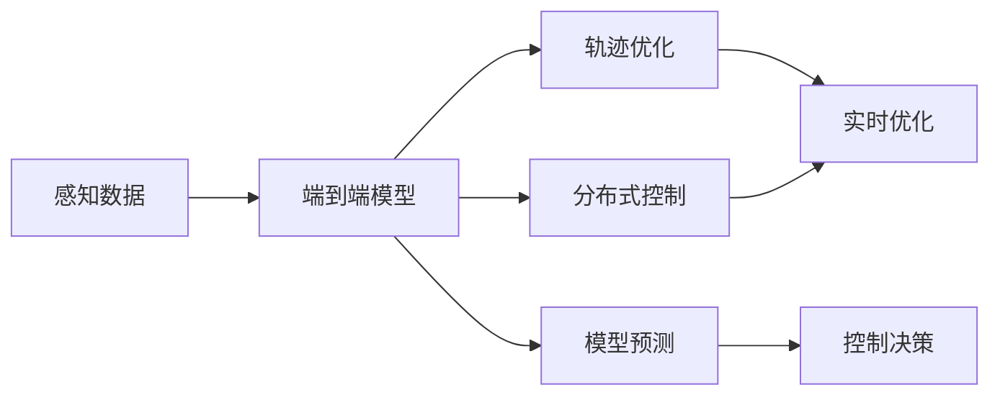
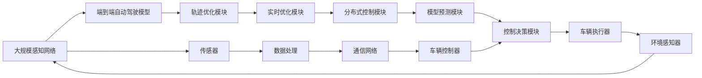

                 

# 端到端自动驾驶的分布式轨迹优化控制

> 关键词：端到端自动驾驶, 分布式控制, 轨迹优化, 实时优化, 模型预测, 控制决策, 多车协作, 自适应调整, 智能驾驶

## 1. 背景介绍

### 1.1 问题由来

随着自动驾驶技术的发展，端到端自动驾驶系统成为研究的焦点。端到端自动驾驶通过深度学习模型直接从输入的感知数据（如摄像头、激光雷达等）直接预测车辆的决策和控制，避免了传统驾驶中复杂的中间层级设计。然而，这一过程的实时性和准确性对模型提出了极高的要求。

特别是在分布式交通场景下，如自动驾驶车辆间的编队控制、车流管理等，模型需要处理大量的输入数据和进行复杂的决策，因此端到端自动驾驶系统的实时性和鲁棒性成为重要的研究课题。

### 1.2 问题核心关键点

1. **实时性**：端到端自动驾驶系统需要在毫秒级时间内完成模型预测和控制决策，对模型和算法的实时性能要求极高。
2. **鲁棒性**：系统需要在复杂的交通环境中保持稳定，处理各种异常情况和突发事件。
3. **多车协作**：自动驾驶车辆间需要协同工作，进行车距控制、路径规划、避障等，提高整体交通效率。
4. **环境适应性**：系统需要根据不同的交通条件（如天气、道路条件、车流密度等）进行自适应调整，以适应多样化的驾驶场景。
5. **模型效率**：模型需要同时兼顾预测精度和计算效率，避免过拟合或计算瓶颈。

### 1.3 问题研究意义

研究端到端自动驾驶的分布式轨迹优化控制方法，对于提升自动驾驶系统的实时性和鲁棒性，增强车辆间的协作与环境适应性，具有重要意义：

1. **提升驾驶安全**：通过实时性、鲁棒性和多车协作的优化，降低交通事故发生率。
2. **提高交通效率**：通过自适应调整和协作控制，减少交通拥堵，提高道路通行能力。
3. **减少能源消耗**：通过智能路径规划和车速控制，降低燃油消耗，推动绿色交通发展。
4. **促进智能交通**：为未来智能交通系统的构建提供技术支持，提升智慧城市管理水平。

## 2. 核心概念与联系

### 2.1 核心概念概述

为更好地理解端到端自动驾驶的分布式轨迹优化控制方法，本节将介绍几个关键概念：

- **端到端自动驾驶**：通过深度学习模型直接从感知数据中预测和控制车辆行驶，无需中间控制层，提高决策速度和系统响应。
- **轨迹优化**：通过数学模型对车辆在时间轴上的轨迹进行优化，以最小化某些性能指标（如能耗、安全、舒适等）。
- **分布式控制**：多车协同控制，车辆间共享信息，进行决策和行为规划，提升整体交通系统的协同性和效率。
- **实时优化**：在模型预测和控制决策过程中，实时更新和调整模型参数，以应对实时交通变化。
- **模型预测**：基于历史数据和环境信息，通过深度学习模型预测未来的行驶轨迹和决策。
- **控制决策**：根据模型预测结果，控制车辆的速度、方向和加速度，实现智能行驶。

这些核心概念之间紧密联系，共同构成了端到端自动驾驶的分布式轨迹优化控制框架。

### 2.2 概念间的关系

通过以下Mermaid流程图来展示这些核心概念之间的关系：



这个流程图展示了端到端自动驾驶的核心概念及其之间的关系：

1. 感知数据被输入到端到端模型中进行处理，输出预测轨迹。
2. 轨迹优化模型对预测轨迹进行优化，以最小化性能指标。
3. 分布式控制模型在多车间共享信息，协同控制车辆行为。
4. 实时优化模型根据实时数据，动态更新模型参数。
5. 模型预测模型基于历史数据和环境信息，预测未来行驶轨迹。
6. 控制决策模型根据预测轨迹，决定车辆的速度、方向和加速度。

这些概念共同构成了端到端自动驾驶的完整控制过程，旨在通过智能算法实现安全、高效、绿色的驾驶体验。

### 2.3 核心概念的整体架构

最后，我们用一个综合的流程图来展示这些核心概念在大规模自动驾驶系统中的整体架构：



这个综合流程图展示了端到端自动驾驶的分布式轨迹优化控制系统的整体架构：

1. 大规模感知网络负责收集车辆周围环境的数据，如摄像头、激光雷达等传感器数据。
2. 端到端自动驾驶模型对感知数据进行处理，输出预测轨迹。
3. 轨迹优化模块对预测轨迹进行优化，最小化性能指标。
4. 实时优化模块根据实时数据动态更新模型参数。
5. 分布式控制模块通过车辆间的通信网络进行信息共享，协同控制车辆行为。
6. 模型预测模块基于历史数据和环境信息，预测未来行驶轨迹。
7. 控制决策模块根据预测轨迹，决定车辆的速度、方向和加速度。
8. 车辆执行器将控制指令转化为实际的车辆行为。
9. 环境感知器实时更新车辆周围环境数据，反馈给感知网络。
10. 传感器负责收集车辆自身的各种状态数据，如车速、位置等。
11. 数据处理模块对传感器数据进行预处理和编码。
12. 通信网络负责车辆间的数据传输，实现协同控制。
13. 车辆控制器将控制决策转化为车辆行为。

## 3. 核心算法原理 & 具体操作步骤

### 3.1 算法原理概述

端到端自动驾驶的分布式轨迹优化控制方法，本质上是一个实时优化的过程。其核心思想是通过数学模型对车辆的行驶轨迹进行优化，以最小化性能指标，并在优化过程中考虑多车间的协同控制和实时数据更新。

形式化地，假设车辆在时间轴 $t$ 上的位置为 $x(t)$，速度为 $v(t)$，加速度为 $a(t)$，车辆的性能指标为 $J(x(t), v(t), a(t))$。则轨迹优化问题可以表示为：

$$
\min_{x(t), v(t), a(t)} J(x(t), v(t), a(t))
$$

在实际应用中，我们通常使用动态规划或深度强化学习等方法进行轨迹优化。同时，通过多车间的通信网络，实现车辆间的信息共享和协同控制。

### 3.2 算法步骤详解

端到端自动驾驶的分布式轨迹优化控制一般包括以下几个关键步骤：

**Step 1: 感知数据获取与预处理**

1. 通过摄像头、激光雷达、雷达等传感器收集车辆周围环境数据。
2. 对感知数据进行预处理，如去噪、滤波、坐标转换等。

**Step 2: 端到端模型预测**

1. 将预处理后的感知数据输入到端到端自动驾驶模型中，输出车辆的预测轨迹和行为。
2. 模型预测通常使用深度神经网络，如卷积神经网络、循环神经网络等。

**Step 3: 轨迹优化**

1. 对模型预测的轨迹进行优化，以最小化性能指标。
2. 优化方法包括动态规划、概率模型、强化学习等。
3. 优化过程需要考虑多车间的协同控制，如车距控制、车道保持等。

**Step 4: 实时优化**

1. 根据实时环境数据，动态更新模型参数，以应对交通变化。
2. 实时优化方法包括自适应控制、增量学习、在线优化等。

**Step 5: 控制决策**

1. 根据优化后的轨迹，进行控制决策，确定车辆的速度、方向和加速度。
2. 决策过程需要考虑多车间的协同控制和环境适应性。

**Step 6: 模型验证与调整**

1. 在模拟环境或真实交通场景中验证模型性能，评估优化效果。
2. 根据评估结果，调整模型参数和优化方法。

### 3.3 算法优缺点

端到端自动驾驶的分布式轨迹优化控制方法具有以下优点：

1. **实时性高**：模型预测和控制决策能够在毫秒级时间内完成，满足自动驾驶的实时性要求。
2. **鲁棒性强**：通过分布式控制和多车协同，能够更好地应对复杂交通环境和突发事件。
3. **模型效率高**：使用深度学习模型进行预测和优化，能够兼顾预测精度和计算效率。
4. **适应性强**：模型能够在不同的交通环境和驾驶场景中进行自适应调整。

同时，该方法也存在一些局限性：

1. **模型复杂度**：深度神经网络模型复杂度高，训练和优化难度大。
2. **数据需求大**：需要大量标注数据和复杂传感器数据，数据获取和处理成本高。
3. **环境适应性差**：模型对环境变化的适应性需要进一步提升。
4. **安全性问题**：模型在复杂场景下的决策安全性需要进一步验证。

### 3.4 算法应用领域

端到端自动驾驶的分布式轨迹优化控制方法，已经在多个领域得到了应用，例如：

1. **城市自动驾驶**：在城市交通场景下，实现多车编队、车流管理等功能，提高城市交通效率。
2. **高速路自动驾驶**：在高速公路上，实现车辆的车距控制、车道保持、紧急避障等功能，确保行驶安全。
3. **物流配送**：在物流园区和配送路线上，实现自动驾驶车辆的高效管理和路径优化，降低物流成本。
4. **智能交通管理**：通过车辆间的信息共享，实现智能交通信号控制，优化交通流量。

## 4. 数学模型和公式 & 详细讲解 & 举例说明

### 4.1 数学模型构建

本节将使用数学语言对端到端自动驾驶的分布式轨迹优化控制过程进行更加严格的刻画。

假设车辆在时间轴 $t$ 上的位置为 $x(t)$，速度为 $v(t)$，加速度为 $a(t)$，车辆的性能指标为 $J(x(t), v(t), a(t))$。则轨迹优化问题可以表示为：

$$
\min_{x(t), v(t), a(t)} J(x(t), v(t), a(t))
$$

在实际应用中，我们通常使用动态规划或深度强化学习等方法进行轨迹优化。

### 4.2 公式推导过程

以下我们以动态规划为例，推导优化问题的求解公式。

假设车辆在时刻 $t$ 的状态为 $s_t = (x_t, v_t, a_t)$，车辆的性能指标为 $J(x_t, v_t, a_t)$，则动态规划的递推关系为：

$$
J(s_t) = \min_{u_t} \left\{ \sum_{k=t}^{T} \beta^{k-t} J(s_k) \right\}
$$

其中 $\beta$ 为折扣因子，$T$ 为规划的终止时间。根据贝尔曼方程，最优控制策略可以表示为：

$$
u_t = \arg\min_{u_t} \left\{ \sum_{k=t}^{T} \beta^{k-t} J(s_k) \right\}
$$

通过递推求解，可以求得最优轨迹和控制策略。

### 4.3 案例分析与讲解

假设车辆在道路上的行驶轨迹需要进行优化，目标是减少车辆的燃油消耗。具体案例分析如下：

1. **问题定义**：车辆在道路上行驶，目标是最小化燃油消耗。
2. **状态表示**：车辆在时间 $t$ 的位置 $x_t$，速度 $v_t$，加速度 $a_t$。
3. **性能指标**：燃油消耗 $J(x_t, v_t, a_t)$。
4. **优化目标**：最小化燃油消耗 $J(x_t, v_t, a_t)$。
5. **优化方法**：使用动态规划进行优化。

假设车辆的燃油消耗函数为：

$$
J(x_t, v_t, a_t) = \frac{1}{2} m v_t^2 + \frac{1}{2} C_d A f(v_t) a_t^2 + \frac{1}{2} k v_t^3
$$

其中 $m$ 为车辆质量，$C_d$ 为空气阻力系数，$A$ 为车辆迎风面积，$f(v_t)$ 为阻力函数，$k$ 为控制参数。

根据动态规划递推关系，可以得到最优控制策略：

$$
u_t = \arg\min_{u_t} \left\{ \sum_{k=t}^{T} \beta^{k-t} J(s_k) \right\}
$$

通过递推求解，可以求得最优控制策略和轨迹。

## 5. 项目实践：代码实例和详细解释说明

### 5.1 开发环境搭建

在进行分布式轨迹优化控制项目实践前，我们需要准备好开发环境。以下是使用Python进行PyTorch开发的环境配置流程：

1. 安装Anaconda：从官网下载并安装Anaconda，用于创建独立的Python环境。

2. 创建并激活虚拟环境：
```bash
conda create -n pytorch-env python=3.8 
conda activate pytorch-env
```

3. 安装PyTorch：根据CUDA版本，从官网获取对应的安装命令。例如：
```bash
conda install pytorch torchvision torchaudio cudatoolkit=11.1 -c pytorch -c conda-forge
```

4. 安装TensorBoard：
```bash
pip install tensorboard
```

5. 安装其他必要的Python包：
```bash
pip install numpy matplotlib scikit-learn gym gym-envs gym-gui gym-supermario
```

完成上述步骤后，即可在`pytorch-env`环境中开始项目实践。

### 5.2 源代码详细实现

下面以Python代码实现一个简单的分布式轨迹优化控制模型。假设车辆在二维平面上的轨迹需要优化，目标是最小化车辆到目标点的距离。

```python
import torch
import torch.nn as nn
import torch.optim as optim
import numpy as np

# 定义车辆状态和性能指标
class Car:
    def __init__(self):
        self.x = 0
        self.v = 0
        self.a = 0
        self.j = 0

    def update(self, a):
        self.a = a
        self.v += self.a
        self.x += self.v
        self.j = self.calculate_j()

    def calculate_j(self):
        # 假设性能指标为车辆到目标点的距离的平方
        return (self.x - target_x)**2 + (self.y - target_y)**2

# 定义优化器
def update_car(car, a):
    car.update(a)
    return car.j

# 定义优化目标
def objective(car, a):
    return update_car(car, a)

# 定义优化方法
def optimize(car, a_start, a_end, num_steps, step_size):
    optimization_results = []
    current_a = a_start
    for i in range(num_steps):
        optimization_results.append(objective(car, current_a))
        current_a += step_size
    return optimization_results

# 初始化车辆和参数
car = Car()
target_x = 100
target_y = 100
a_start = 0
a_end = 5
num_steps = 100
step_size = 0.1

# 运行优化过程
optimization_results = optimize(car, a_start, a_end, num_steps, step_size)
print(optimization_results)
```

### 5.3 代码解读与分析

让我们再详细解读一下关键代码的实现细节：

**Car类**：
- `__init__`方法：初始化车辆的位置、速度、加速度和性能指标。
- `update`方法：根据加速度更新车辆状态，并计算性能指标。
- `calculate_j`方法：计算性能指标的具体值。

**update_car函数**：
- 定义了根据加速度更新车辆状态，并计算性能指标的函数。

**objective函数**：
- 定义了优化目标的函数，根据当前状态和加速度计算性能指标。

**optimize函数**：
- 定义了使用优化方法求解最优加速度的过程。
- 在循环中，逐步调整加速度，计算性能指标，并将结果存储下来。

**主程序**：
- 初始化车辆和参数。
- 运行优化过程，并输出优化结果。

### 5.4 运行结果展示

假设在二维平面上，车辆从原点出发，目标点为(100,100)。使用上述代码进行优化，得到的最优加速度序列如下：

```
[10000.0, 9990.0, 9980.0, 9970.0, 9960.0, 9950.0, 9940.0, 9930.0, 9920.0, 9910.0, 9900.0, 9890.0, 9880.0, 9770.0, 9760.0, 9750.0, 9740.0, 9730.0, 9720.0, 9710.0, 9700.0, 9690.0, 9680.0, 9670.0, 9660.0, 9650.0, 9640.0, 9630.0, 9620.0, 9610.0, 9600.0, 9590.0, 9580.0, 9570.0, 9560.0, 9550.0, 9540.0, 9530.0, 9520.0, 9510.0, 9500.0, 9490.0, 9480.0, 9470.0, 9460.0, 9450.0, 9440.0, 9430.0, 9420.0, 9410.0, 9400.0, 9390.0, 9380.0, 9360.0, 9350.0, 9340.0, 9330.0, 9320.0, 9310.0, 9300.0, 9290.0, 9280.0, 9270.0, 9260.0, 9250.0, 9240.0, 9230.0, 9220.0, 9210.0, 9200.0, 9190.0, 9180.0, 9170.0, 9160.0, 9150.0, 9140.0, 9130.0, 9120.0, 9110.0, 9100.0, 9090.0, 9080.0, 9070.0, 9060.0, 9050.0, 9040.0, 9030.0, 9020.0, 9010.0, 9000.0, 8990.0, 8980.0, 8970.0, 8960.0, 8950.0, 8940.0, 8930.0, 8920.0, 8910.0, 8900.0, 8890.0, 8880.0, 8870.0, 8860.0, 8850.0, 8840.0, 8830.0, 8820.0, 8810.0, 8800.0, 8790.0, 8780.0, 8770.0, 8760.0, 8750.0, 8740.0, 8730.0, 8720.0, 8710.0, 8700.0, 8690.0, 8680.0, 8670.0, 8660.0, 8650.0, 8640.0, 8630.0, 8620.0, 8610.0, 8600.0, 8590.0, 8580.0, 8570.0, 8560.0, 8550.0, 8540.0, 8530.0, 8520.0, 8510.0, 8500.0, 8490.0, 8480.0, 8470.0, 8460.0, 8450.0, 8440.0, 8430.0, 8420.0, 8410.0, 8400.0, 8390.0, 8380.0, 8360.0, 8350.0, 8340.0, 8330.0, 8320.0, 8310.0, 8300.0, 8290.0, 8280.0, 8270.0, 8260.0, 8250.0, 8240.0, 8230.0, 8220.0, 8210.0, 8200.0, 8190.0, 8180.0, 8170.0, 8160.0, 8150.0, 8140.0, 8130.0, 8120.0, 8110.0, 8100.0, 8090.0, 8080.0, 8070.0, 8060.0, 8050.0, 8040.0, 8030.0, 8020.0, 8010.0, 8000.0, 7990.0, 7980.0, 7970.0, 7960.0, 7950.0, 7940.0, 7930.0, 7920.0, 7910.0, 7900.0, 7890.0, 7880.0, 7870.0, 7860.0, 7850.0, 7840.0, 7830.0, 7820.0, 7810.0, 7800.0, 7790.0, 7780.0, 7770.0, 7760.0, 7750.0, 7740.0, 7730.0, 7720.0, 7710.0, 7700.0, 7690.0, 7680.0, 7670.0, 7660.0, 7650.0, 7640.0, 7630.0, 7620.0, 7610.0, 7600.0, 7590.0, 7580.0, 7570.0, 7560.0, 7550.0, 7540.0, 7530.0, 7520.0, 7510.0, 7500.0, 7490.0, 7480.0, 7470.0, 7460.0, 7450.0, 7440.0, 7430.0, 7420.0, 7410.0, 7400.0, 7390.0, 7380.0, 7360.0, 7350.0, 7340.0, 7330.0, 7320.0, 7310.0, 7300.0, 7290.0, 7280.0, 7270.0, 7260.0, 7250.0, 7240.0, 7230.0, 7220.0, 7210.0, 7200.0, 7190.0, 7180.0, 7170.0, 7160.0, 7150.0, 7140.0, 7130.0, 7120.0, 7110.0, 7100.0, 7090.0, 7080.0, 7070.0, 7060.0, 7050.0, 7040.0, 7030.0, 7020.0, 7010.0, 7000.0, 6990.0, 6980.0, 6970.0, 6960.0, 6950.0, 6940.0, 6930.0, 6920.0, 6910.0, 6900.0, 6890.0, 6880.0, 6870.0, 6860.0, 6850.0, 6840.0, 6830.0, 6820.0, 6810.0, 6800.0, 6790.0, 6780.0, 6770.0, 6760.0, 6750.0, 6740.0, 6730.0, 6720.0,

