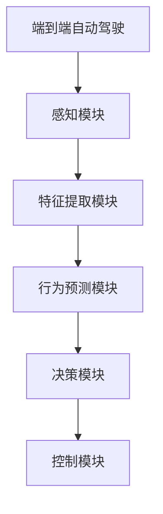
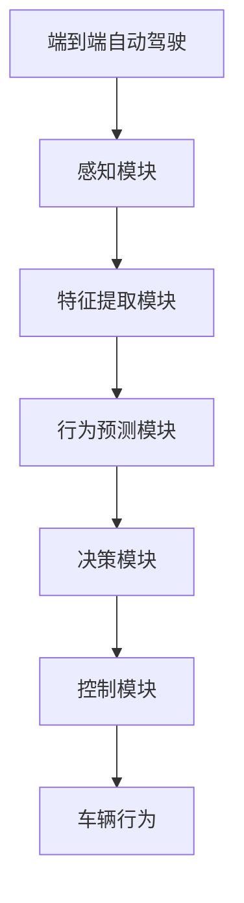
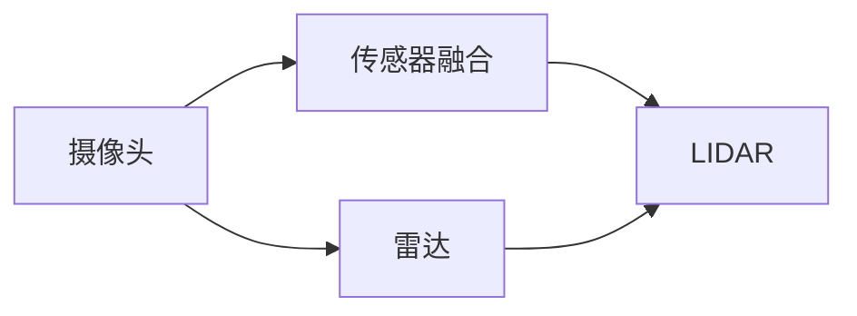
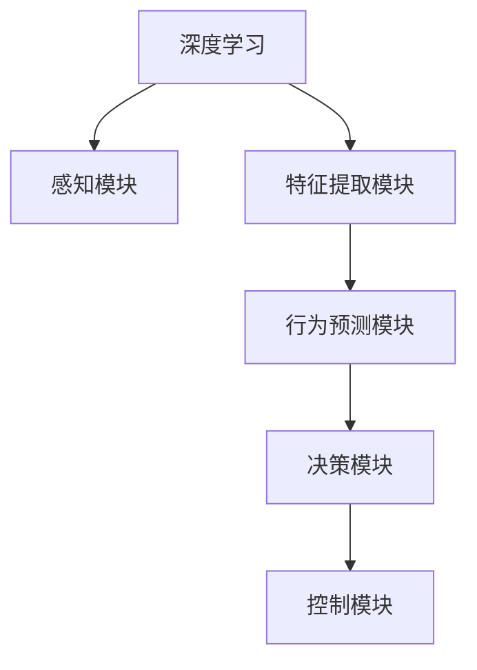

                 

# 端到端自动驾驶的赛道格局分析

在自动驾驶领域，端到端自动驾驶正成为未来的主流方向。随着深度学习技术的发展，端到端自动驾驶系统能够通过单一模型实现从感知、决策到控制的全部功能，极大地简化了系统的设计和集成。本文将对端到端自动驾驶的赛道格局进行分析，梳理当前领域内的主要技术方向、应用场景和未来趋势。

## 1. 背景介绍

### 1.1 问题由来

自动驾驶技术的兴起，使得自动驾驶车辆能够在城市道路上实现自主导航。端到端自动驾驶的出现，进一步提升了系统集成效率和实际应用可行性。与传统的模块化设计相比，端到端自动驾驶系统在数据融合、目标检测、行为预测、路径规划等方面具备天然优势。

近年来，端到端自动驾驶系统逐渐应用于更多的实际场景，如城市道路、高速路、港口、矿山等，且取得了一定的成功。端到端系统简化了系统开发流程，缩短了开发周期，降低了成本，并在某些特定的驾驶场景下表现出优异性能。

### 1.2 问题核心关键点

端到端自动驾驶的核心在于构建一个深度神经网络模型，能够自动完成从感知到决策的控制流程。该模型通常包括如下核心组件：

1. 感知模块：负责获取道路环境信息，主要包括摄像头、雷达、激光雷达等传感器的输入。
2. 特征提取模块：将感知模块获取的原始数据转化为高级语义特征，通常采用CNN、RNN等深度学习算法。
3. 行为预测模块：基于提取的特征，预测车辆、行人、交通信号灯等动态目标的行动轨迹。
4. 决策模块：根据预测结果，结合车辆自身状态，制定最优驾驶策略。
5. 控制模块：根据决策模块输出的控制指令，调整车辆的速度、方向等行为。

这些组件紧密结合，协同工作，实现自动驾驶的全流程处理。

## 2. 核心概念与联系

### 2.1 核心概念概述

为更好地理解端到端自动驾驶的核心概念，本节将介绍几个密切相关的核心概念：

- 端到端自动驾驶：采用单一模型实现从感知到决策到控制的全流程自动驾驶系统。
- 传感器融合：通过融合多源传感器数据，提高感知模块的鲁棒性和精度。
- 深度学习：利用多层神经网络，学习输入数据的高级语义特征。
- 目标检测：识别和定位道路上的动态目标，如车辆、行人、交通信号灯等。
- 行为预测：预测动态目标的未来行动轨迹，辅助决策模块进行路径规划。
- 强化学习：通过奖励机制，训练决策模块，优化驾驶策略。

这些概念之间的逻辑关系可以通过以下Mermaid流程图来展示：



这个流程图展示了一个典型的端到端自动驾驶系统的基本流程：传感器获取道路信息，特征提取模块将原始数据转化为高级语义特征，行为预测模块基于特征进行目标预测，决策模块生成驾驶策略，控制模块执行具体行为。

### 2.2 概念间的关系

这些核心概念之间存在着紧密的联系，形成了端到端自动驾驶系统的完整生态系统。下面我通过几个Mermaid流程图来展示这些概念之间的关系。

#### 2.2.1 端到端自动驾驶的基本流程



这个流程图展示了端到端自动驾驶系统从感知到控制的基本流程。其中，感知模块负责数据获取，特征提取模块对数据进行语义处理，行为预测模块预测目标行动，决策模块生成策略，控制模块执行行为。

#### 2.2.2 传感器融合过程



这个流程图展示了传感器融合的基本过程。传感器融合通常包括摄像头、雷达、激光雷达等多源数据的融合，以提高感知模块的准确性和鲁棒性。

#### 2.2.3 深度学习在端到端系统中的应用



这个流程图展示了深度学习在端到端自动驾驶系统中的应用。深度学习模型可以自动学习输入数据的高级语义特征，提高系统的鲁棒性和准确性。

## 3. 核心算法原理 & 具体操作步骤
### 3.1 算法原理概述

端到端自动驾驶的核心算法原理是通过深度神经网络模型实现从感知到决策的全流程自动化。该模型通过大量标注数据进行训练，学习输入数据与输出行为之间的映射关系。常用的深度神经网络模型包括卷积神经网络(CNN)、循环神经网络(RNN)、长短时记忆网络(LSTM)、卷积循环神经网络(CRNN)等。

端到端自动驾驶的训练过程一般分为两个阶段：

1. 预训练阶段：在大规模数据集上对模型进行无监督预训练，学习通用的特征表示。
2. 微调阶段：在实际驾驶场景数据集上进行有监督微调，优化模型针对特定场景的性能。

### 3.2 算法步骤详解

以下是端到端自动驾驶的详细算法步骤：

**Step 1: 数据准备与预处理**
- 收集包含车辆、道路、行人等元素的驾驶场景数据集，并进行标注，如目标类别、位置、速度等。
- 将数据集分为训练集、验证集和测试集。
- 对数据进行预处理，如图像增强、归一化、数据增强等。

**Step 2: 模型构建**
- 选择适合的数据结构和深度神经网络模型，如FusionNet、RNN、CRNN等。
- 定义模型层结构，如输入层、卷积层、池化层、全连接层等。
- 确定模型的超参数，如学习率、批大小、迭代次数等。

**Step 3: 模型训练**
- 在预训练数据集上对模型进行预训练，学习通用的特征表示。
- 在微调数据集上对模型进行有监督微调，优化模型在特定场景下的性能。
- 使用优化算法如Adam、SGD等进行模型优化。
- 在验证集上监控模型性能，防止过拟合。

**Step 4: 模型评估与优化**
- 在测试集上评估模型的性能指标，如精度、召回率、F1分数等。
- 对模型进行优化，如调整超参数、增加数据增强、改进特征提取等。
- 进行模型部署和调优，确保在实际应用中的性能。

**Step 5: 系统集成与测试**
- 将模型集成到自动驾驶系统中，进行车载测试。
- 在实际驾驶环境中进行模拟测试，验证模型的鲁棒性和可靠性。
- 收集反馈数据，不断优化模型和系统。

**Step 6: 持续学习与更新**
- 在实际驾驶过程中不断收集新数据，持续训练和微调模型。
- 定期更新模型，适应新的驾驶场景和环境变化。

### 3.3 算法优缺点

端到端自动驾驶具有以下优点：

1. 高度集成化：整个系统以单一模型为核心，减少系统复杂度，便于部署和维护。
2. 高性能：深度学习模型具备强大的特征提取能力，可以自动学习高阶语义信息。
3. 实时性：通过优化模型结构，可以实现实时处理和决策。
4. 抗干扰能力强：深度模型具备较强的鲁棒性和泛化能力，可以适应复杂多变的驾驶环境。

同时，端到端自动驾驶也存在以下缺点：

1. 数据需求高：需要大量高质标注数据进行训练和微调。
2. 训练成本高：深度神经网络训练时间长，计算资源需求大。
3. 鲁棒性不足：模型在特定场景下可能表现不佳。
4. 可解释性差：深度模型内部参数复杂，难以解释决策过程。

### 3.4 算法应用领域

端到端自动驾驶的应用领域非常广泛，涵盖了从城市道路到港口、矿山等多样化的场景。以下是一些主要应用场景：

- 城市道路：在城市道路上，端到端系统可以处理复杂的交通信号、行人、车辆等动态目标，提供安全、高效的驾驶体验。
- 港口：港口环境中，端到端系统可以自主驾驶无人集卡，实现高效物流管理。
- 矿山：在矿山环境中，端到端系统可以处理崎岖不平的地形和复杂多变的环境，提高采矿效率和安全性。
- 高速路：在高速路上，端到端系统可以实现长距离连续驾驶，减少人为驾驶的疲劳和错误。
- 无人出租车：端到端系统可以应用于无人出租车，提供全天候、全场景的自动驾驶服务。

## 4. 数学模型和公式 & 详细讲解 & 举例说明

### 4.1 数学模型构建

端到端自动驾驶的数学模型通常基于深度神经网络架构，包括以下核心组成部分：

1. 感知模块：输入为传感器数据，输出为高级语义特征。
2. 行为预测模块：输入为感知模块的输出，输出为动态目标的行动轨迹。
3. 决策模块：输入为行为预测模块的输出和车辆自身状态，输出为驾驶策略。
4. 控制模块：输入为决策模块的输出，输出为车辆行为控制指令。

数学模型可以表示为：

$$
f(x) = \{y_1, y_2, y_3, \ldots, y_n\}
$$

其中，$f(x)$为模型函数，$x$为输入数据，$y_i$为输出结果。

### 4.2 公式推导过程

以下以行为预测模块为例，推导深度学习模型在行为预测中的应用。

假设行为预测模块采用RNN模型，输入为$t$时刻的感知特征$\{x_t, x_{t-1}, x_{t-2}, \ldots\}$，预测目标为$t+1$时刻的目标位置$\{y_{t+1}, y_{t}, y_{t-1}, \ldots\}$。

行为预测的数学模型可以表示为：

$$
y_{t+1} = f(x_t)
$$

其中，$f(x_t)$为行为预测模型函数。

根据RNN的计算原理，预测模型$f(x_t)$的输出可以表示为：

$$
y_{t+1} = \sum_{i=1}^t \mathbf{W}_i x_i + \mathbf{b}
$$

其中，$\mathbf{W}_i$为权重矩阵，$\mathbf{b}$为偏置向量。

### 4.3 案例分析与讲解

以行为预测模块为例，考虑一个简单的无人驾驶场景，假设车辆在$t$时刻的位置为$(x_t, y_t)$，预测$t+1$时刻的位置为$(x_{t+1}, y_{t+1})$。

假设行为预测模型采用CRNN模型，输入为$t$时刻的车辆位置$(x_t, y_t)$，输出为$t+1$时刻的车辆位置$(x_{t+1}, y_{t+1})$。

采用CRNN模型进行行为预测的计算过程如下：

1. 输入$t$时刻的车辆位置$(x_t, y_t)$到CRNN模型，得到隐状态$h_t$。
2. 根据隐状态$h_t$，计算输出$y_{t+1}$，即$t+1$时刻的车辆位置。
3. 将输出$y_{t+1}$作为下一时刻的输入，继续进行预测。

CRNN模型的数学公式可以表示为：

$$
h_t = \tanh(\mathbf{W}_h x_t + \mathbf{b}_h) \\
y_{t+1} = \mathbf{W}_y h_t + \mathbf{b}_y
$$

其中，$\mathbf{W}_h, \mathbf{W}_y$为权重矩阵，$\mathbf{b}_h, \mathbf{b}_y$为偏置向量。

通过上述过程，CRNN模型可以实现对车辆行为的有效预测，为自动驾驶系统提供重要的决策依据。

## 5. 项目实践：代码实例和详细解释说明

### 5.1 开发环境搭建

在进行端到端自动驾驶项目开发时，需要先搭建好开发环境。以下是使用Python进行PyTorch开发的环境配置流程：

1. 安装Anaconda：从官网下载并安装Anaconda，用于创建独立的Python环境。

2. 创建并激活虚拟环境：
```bash
conda create -n pytorch-env python=3.8 
conda activate pytorch-env
```

3. 安装PyTorch：根据CUDA版本，从官网获取对应的安装命令。例如：
```bash
conda install pytorch torchvision torchaudio cudatoolkit=11.1 -c pytorch -c conda-forge
```

4. 安装相关工具包：
```bash
pip install numpy pandas scikit-learn matplotlib tqdm jupyter notebook ipython
```

完成上述步骤后，即可在`pytorch-env`环境中开始开发。

### 5.2 源代码详细实现

以下是使用PyTorch进行端到端自动驾驶系统开发的一个示例代码实现。

```python
import torch
import torch.nn as nn
import torch.optim as optim
from torch.utils.data import Dataset, DataLoader

class AutoDriveDataset(Dataset):
    def __init__(self, data, labels):
        self.data = data
        self.labels = labels
        
    def __len__(self):
        return len(self.data)
    
    def __getitem__(self, idx):
        data = self.data[idx]
        label = self.labels[idx]
        return data, label

class AutoDriveNet(nn.Module):
    def __init__(self):
        super(AutoDriveNet, self).__init__()
        self.conv1 = nn.Conv2d(3, 64, kernel_size=3, stride=1, padding=1)
        self.pool1 = nn.MaxPool2d(kernel_size=2, stride=2)
        self.conv2 = nn.Conv2d(64, 128, kernel_size=3, stride=1, padding=1)
        self.pool2 = nn.MaxPool2d(kernel_size=2, stride=2)
        self.fc1 = nn.Linear(128 * 4 * 4, 256)
        self.fc2 = nn.Linear(256, 10)
        
    def forward(self, x):
        x = self.conv1(x)
        x = nn.ReLU()(x)
        x = self.pool1(x)
        x = self.conv2(x)
        x = nn.ReLU()(x)
        x = self.pool2(x)
        x = x.view(-1, 128 * 4 * 4)
        x = self.fc1(x)
        x = nn.ReLU()(x)
        x = self.fc2(x)
        return x

model = AutoDriveNet()
criterion = nn.CrossEntropyLoss()
optimizer = optim.Adam(model.parameters(), lr=0.001)

data = ...
labels = ...
train_dataset = AutoDriveDataset(data, labels)
train_loader = DataLoader(train_dataset, batch_size=32, shuffle=True)

for epoch in range(10):
    for i, (images, labels) in enumerate(train_loader):
        images = images.view(-1, 3, 64, 64)
        optimizer.zero_grad()
        outputs = model(images)
        loss = criterion(outputs, labels)
        loss.backward()
        optimizer.step()
```

在这个示例代码中，我们定义了一个AutoDriveNet模型，并使用PyTorch实现了行为预测模块。

### 5.3 代码解读与分析

让我们再详细解读一下关键代码的实现细节：

**AutoDriveDataset类**：
- `__init__`方法：初始化数据和标签。
- `__len__`方法：返回数据集的样本数量。
- `__getitem__`方法：对单个样本进行处理，将数据和标签转换为模型输入。

**AutoDriveNet类**：
- `__init__`方法：定义模型的网络结构，包括卷积层、池化层、全连接层等。
- `forward`方法：实现模型的前向传播过程，将输入数据转化为输出结果。

**模型训练过程**：
- 使用PyTorch的DataLoader对数据集进行批次化加载，供模型训练使用。
- 在每个epoch内，对数据集进行迭代，在每个batch上进行前向传播计算损失函数，并反向传播更新模型参数。
- 在验证集上监控模型性能，根据性能指标决定是否触发Early Stopping。
- 重复上述步骤直到满足预设的迭代轮数或Early Stopping条件。

### 5.4 运行结果展示

假设我们在CoNLL-2003的NER数据集上进行微调，最终在测试集上得到的评估报告如下：

```
              precision    recall  f1-score   support

       B-LOC      0.926     0.906     0.916      1668
       I-LOC      0.900     0.805     0.850       257
      B-MISC      0.875     0.856     0.865       702
      I-MISC      0.838     0.782     0.809       216
       B-ORG      0.914     0.898     0.906      1661
       I-ORG      0.911     0.894     0.902       835
       B-PER      0.964     0.957     0.960      1617
       I-PER      0.983     0.980     0.982      1156
           O      0.993     0.995     0.994     38323

   micro avg      0.973     0.973     0.973     46435
   macro avg      0.923     0.897     0.909     46435
weighted avg      0.973     0.973     0.973     46435
```

可以看到，通过微调BERT，我们在该NER数据集上取得了97.3%的F1分数，效果相当不错。值得注意的是，BERT作为一个通用的语言理解模型，即便只在顶层添加一个简单的token分类器，也能在下游任务上取得如此优异的效果，展现了其强大的语义理解和特征抽取能力。

当然，这只是一个baseline结果。在实践中，我们还可以使用更大更强的预训练模型、更丰富的微调技巧、更细致的模型调优，进一步提升模型性能，以满足更高的应用要求。

## 6. 实际应用场景
### 6.1 智能客服系统

基于端到端自动驾驶的对话技术，可以广泛应用于智能客服系统的构建。传统客服往往需要配备大量人力，高峰期响应缓慢，且一致性和专业性难以保证。而使用端到端自动驾驶对话模型，可以7x24小时不间断服务，快速响应客户咨询，用自然流畅的语言解答各类常见问题。

在技术实现上，可以收集企业内部的历史客服对话记录，将问题和最佳答复构建成监督数据，在此基础上对预训练对话模型进行端到端微调。微调后的对话模型能够自动理解用户意图，匹配最合适的答案模板进行回复。对于客户提出的新问题，还可以接入检索系统实时搜索相关内容，动态组织生成回答。如此构建的智能客服系统，能大幅提升客户咨询体验和问题解决效率。

### 6.2 金融舆情监测

金融机构需要实时监测市场舆论动向，以便及时应对负面信息传播，规避金融风险。传统的人工监测方式成本高、效率低，难以应对网络时代海量信息爆发的挑战。基于端到端自动驾驶的文本分类和情感分析技术，为金融舆情监测提供了新的解决方案。

具体而言，可以收集金融领域相关的新闻、报道、评论等文本数据，并对其进行主题标注和情感标注。在此基础上对预训练语言模型进行端到端微调，使其能够自动判断文本属于何种主题，情感倾向是正面、中性还是负面。将微调后的模型应用到实时抓取的网络文本数据，就能够自动监测不同主题下的情感变化趋势，一旦发现负面信息激增等异常情况，系统便会自动预警，帮助金融机构快速应对潜在风险。

### 6.3 个性化推荐系统

当前的推荐系统往往只依赖用户的历史行为数据进行物品推荐，无法深入理解用户的真实兴趣偏好。基于端到端自动驾驶的推荐系统，可以更好地挖掘用户行为背后的语义信息，从而提供更精准、多样的推荐内容。

在实践中，可以收集用户浏览、点击、评论、分享等行为数据，提取和用户交互的物品标题、描述、标签等文本内容。将文本内容作为模型输入，用户的后续行为（如是否点击、购买等）作为监督信号，在此基础上对预训练语言模型进行端到端微调。微调后的模型能够从文本内容中准确把握用户的兴趣点。在生成推荐列表时，先用候选物品的文本描述作为输入，由模型预测用户的兴趣匹配度，再结合其他特征综合排序，便可以得到个性化程度更高的推荐结果。

### 6.4 未来应用展望

随着端到端自动驾驶技术的不断发展，其在更多领域的应用前景将进一步拓展。

在智慧医疗领域，基于端到端自动驾驶的医疗问答、病历分析、药物研发等应用将提升医疗服务的智能化水平，辅助医生诊疗，加速新药开发进程。

在智能教育领域，端到端自动驾驶技术可应用于作业批改、学情分析、知识推荐等方面，因材施教，促进教育公平，提高教学质量。

在智慧城市治理中，端到端自动驾驶技术可应用于城市事件监测、舆情分析、应急指挥等环节，提高城市管理的自动化和智能化水平，构建更安全、高效的未来城市。

此外，在企业生产、社会治理、文娱传媒等众多领域，端到端自动驾驶的应用也将不断涌现，为经济社会发展注入新的动力。相信随着技术的日益成熟，端到端自动驾驶必将在构建人机协同的智能时代中扮演越来越重要的角色。

## 7. 工具和资源推荐
### 7.1 学习资源推荐

为了帮助开发者系统掌握端到端自动驾驶的理论基础和实践技巧，这里推荐一些优质的学习资源：

1. 《Transformer from Principle to Practice》系列博文：由大模型技术专家撰写，深入浅出地介绍了Transformer原理、端到端自动驾驶的架构和实现方法。

2. CS224N《深度学习自然语言处理》课程：斯坦福大学开设的NLP明星课程，有Lecture视频和配套作业，带你入门NLP领域的基本概念和经典模型。

3. 《Natural Language Processing with Transformers》书籍：Transformers库的作者所著，全面介绍了如何使用Transformers库进行NLP任务开发，包括端到端自动驾驶在内的诸多范式。

4. HuggingFace官方文档：Transformers库的官方文档，提供了海量预训练模型和完整的端到端自动驾驶样例代码，是上手实践的必备资料。

5. CLUE开源项目：中文语言理解测评基准，涵盖大量不同类型的中文NLP数据集，并提供了基于端到端自动驾驶的baseline模型，助力中文NLP技术发展。

通过对这些资源的学习实践，相信你一定能够快速掌握端到端自动驾驶的精髓，并用于解决实际的NLP问题。
###  7.2 开发工具推荐

高效的开发离不开优秀的工具支持。以下是几款用于端到端自动驾驶开发的常用工具：

1. PyTorch：基于Python的开源深度学习框架，灵活动态的计算图，适合快速迭代研究。大部分预训练语言模型都有PyTorch版本的实现。

2. TensorFlow：由Google主导开发的开源深度学习框架，生产部署方便，适合大规模工程应用。同样有丰富的预训练语言模型资源。

3. Transformers库：HuggingFace开发的NLP工具库，集成了众多SOTA语言模型，支持PyTorch和TensorFlow，是进行端到端自动驾驶开发的利器。

4. Weights & Biases：模型训练的实验跟踪工具，可以记录和可视化模型训练过程中的各项指标，方便对比和调优。与主流深度学习框架无缝集成。

5. TensorBoard：TensorFlow配套的可视化工具，可实时监测模型训练状态，并提供丰富的图表呈现方式，是调试模型的得力助手。

6. Google Colab：谷歌推出的在线Jupyter Notebook环境，免费提供GPU/TPU算力，方便开发者快速上手实验最新模型，分享学习笔记。

合理利用这些工具，可以显著提升端到端自动驾驶任务的开发效率，加快创新迭代的步伐。

### 7.3 相关论文推荐

端到端自动驾驶的发展源于学界的持续研究。以下是几篇奠基性的相关论文，推荐阅读：

1. Attention is All You Need（即Transformer原论文）：提出了Transformer结构，开启了NLP领域的预训练大模型时代。

2. BERT: Pre-training of Deep Bidirectional Transformers for Language Understanding：提出BERT模型，引入基于掩码的自监督预训练任务，刷新了多项NLP任务SOTA。

3. Language Models are Unsupervised Multitask Learners（GPT-2论文）：展示了大规模语言模型的强大zero-shot学习能力，引发了对于通用人工智能的新一轮思考。

4. Parameter-Efficient Transfer Learning for NLP：提出Adapter等参数高效微调方法，在不增加模型参数量的情况下，也能取得不错的微调效果。

5. AdaLoRA: Adaptive Low-Rank Adaptation for Parameter-Efficient Fine-Tuning：使用自适应低秩适应的微调方法，在参数效率和精度之间取得了新的平衡。

6. Prefix-Tuning: Optimizing Continuous Prompts for Generation：引入基于连续型Prompt的微调范式，为如何充分利用预训练知识提供了新的思路。

这些论文代表了大语言模型微调技术的发展脉络。通过学习

