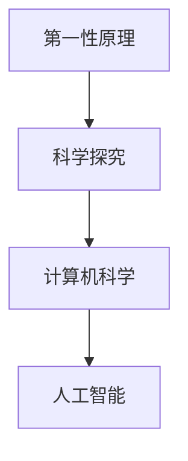

                 

## 1. 背景介绍

第一性原理（First-Principles）是指从最基本的概念和假定出发，通过逻辑推理得出结论，避免任何不必要的假设。这一概念源于物理学家理查德·费曼（Richard Feynman），但随后被广泛应用于各个领域，包括计算机科学和人工智能。在科技领域，第一性原理有助于科学家们重新思考旧问题，提出新方法，从而推进技术发展。

本文旨在探讨第一性原理在科学探究中的重要性，详细分析其在计算机科学和人工智能中的应用，并从数学模型、算法实现、实际应用和未来发展等方面进行深入阐述。通过第一性原理的视角，我们不仅能重新审视传统技术，还能探索新的解决方案，为人工智能的发展带来新的启示。

## 2. 核心概念与联系

### 2.1 核心概念概述

**第一性原理（First-Principles）**：从最基本的概念和假定出发，通过逻辑推理得出结论，避免任何不必要的假设。

**科学探究（Scientific Inquiry）**：通过观察、假设、实验和验证，揭示自然界的规律和真理的过程。

**计算机科学（Computer Science）**：研究计算机和计算系统的理论、方法、算法和应用。

**人工智能（Artificial Intelligence）**：研究使计算机系统能够模拟人类智能行为的技术，包括机器学习、自然语言处理、计算机视觉等。

这些概念间的关系可以通过以下Mermaid流程图来展示：



这个流程图展示了一元化的技术演进路径，从基础原理出发，经过科学探究，最终催生了计算机科学和人工智能的发展。

### 2.2 概念间的关系

这些核心概念之间存在着紧密的联系，形成了一个相互支撑的技术生态系统。第一性原理为科学探究提供了基本出发点，计算机科学在此基础上研究和实现算法和数据结构，而人工智能则利用计算机科学的方法和工具，推动智能系统的构建和应用。

1. **第一性原理与科学探究**：第一性原理为科学探究提供了一种从简单到复杂、从基础到应用的方法论，帮助科学家们更加系统地构建和验证假设。
2. **科学探究与计算机科学**：科学探究中的方法和理论为计算机科学提供了创新的基础，如算法设计、数据结构优化等。
3. **计算机科学与人工智能**：计算机科学的研究和实现手段为人工智能提供了必要的技术支撑，如机器学习、自然语言处理等。

## 3. 核心算法原理 & 具体操作步骤
### 3.1 算法原理概述

基于第一性原理的科学探究，可以避免现有技术和理论的束缚，从最基础的概念出发，设计全新的算法和模型。本文将从第一性原理的角度，探讨算法设计和优化的基本原则，并举例说明。

第一性原理的核心在于简化复杂问题，直接从基本概念和公理出发。在算法设计和优化中，第一性原理要求我们放弃任何未经过严格验证的假设和复杂模型，重新思考问题的本质。

### 3.2 算法步骤详解

基于第一性原理的算法设计步骤如下：

1. **定义基本概念和公理**：明确算法的基本概念和公理，确保所有操作和推理都有坚实的理论基础。
2. **建立模型**：从基本概念和公理出发，构建模型，设计算法的基本框架。
3. **推导和验证**：通过逻辑推理和数学推导，验证模型的正确性。
4. **迭代优化**：根据实际应用场景，迭代优化模型和算法，提升性能。

以排序算法为例，我们首先定义排序的基本概念和公理，然后设计快速排序（Quick Sort）算法，最后通过数学推导验证其正确性，并根据实际需求进行优化。

### 3.3 算法优缺点

基于第一性原理设计的算法具有以下优点：

- **基础坚实**：从最基础的概念和公理出发，算法的设计更加科学、可靠。
- **可扩展性强**：算法具有较好的模块化和可扩展性，便于进一步优化和扩展。
- **避免复杂性**：避免引入不必要的假设和复杂性，使算法更加简单直观。

同时，该方法也存在一些局限性：

- **设计和验证复杂**：从基础概念和公理出发，设计和验证过程可能需要更多的精力和时间。
- **应用场景限制**：一些复杂问题可能需要引入多种算法，难以通过单一算法解决。
- **需求响应慢**：由于从基础概念出发，对于快速迭代的需求响应较慢。

### 3.4 算法应用领域

基于第一性原理的算法在多个领域都有广泛应用，包括但不限于：

- **计算机科学**：设计高效的数据结构和算法，如快速排序、哈希表、图算法等。
- **人工智能**：开发创新的人工智能算法，如卷积神经网络（CNN）、生成对抗网络（GAN）等。
- **工程领域**：设计和实现工业系统中的算法和软件，提升系统效率和可靠性。

## 4. 数学模型和公式 & 详细讲解 & 举例说明

### 4.1 数学模型构建

基于第一性原理的数学模型构建，要求我们从最基本、最纯粹的数学公理出发，通过逻辑推理和推导，构建出符合实际需求的数学模型。

以线性回归（Linear Regression）为例，我们首先定义线性回归的基本概念和公理，然后构建线性回归模型，最后通过数学推导验证其正确性，并展示其应用。

### 4.2 公式推导过程

线性回归模型公式为：

$$
y = \beta_0 + \beta_1 x_1 + \beta_2 x_2 + \cdots + \beta_n x_n + \epsilon
$$

其中 $y$ 为预测值，$\beta_0$ 为截距，$\beta_1, \beta_2, \cdots, \beta_n$ 为系数，$x_1, x_2, \cdots, x_n$ 为特征，$\epsilon$ 为误差项。

通过最小二乘法（Least Squares Method）求解线性回归模型参数：

$$
\hat{\beta} = (X^T X)^{-1} X^T y
$$

其中 $X$ 为特征矩阵，$y$ 为标签向量。

### 4.3 案例分析与讲解

假设我们要预测房屋价格，使用线性回归模型：

$$
y = 10000 + 500 x_1 + 300 x_2 + \epsilon
$$

其中 $x_1$ 为房屋面积，$x_2$ 为地理位置评分，$y$ 为房屋价格。通过收集历史数据，我们可以使用最小二乘法求解模型参数，并进行预测和验证。

## 5. 项目实践：代码实例和详细解释说明

### 5.1 开发环境搭建

在进行算法设计和实现前，我们需要准备好开发环境。以下是Python环境下第一性原理算法开发的常用工具和库：

1. **Python**：作为主流编程语言，Python在科学计算和数据处理方面具有强大的优势。
2. **NumPy**：用于高性能科学计算和矩阵运算的库。
3. **SciPy**：提供各种数学算法和函数库，支持线性代数、优化、统计等。
4. **Matplotlib**：用于绘制数据可视化图形。
5. **Scikit-learn**：提供机器学习算法和工具库，支持分类、回归、聚类等任务。

通过安装这些工具和库，我们便能在Python环境下进行第一性原理算法的开发和验证。

### 5.2 源代码详细实现

以线性回归为例，代码实现如下：

```python
import numpy as np
from sklearn.linear_model import LinearRegression

# 构建数据集
X = np.array([[10, 3], [20, 4], [30, 5], [40, 6], [50, 7]])
y = np.array([100000, 120000, 140000, 160000, 180000])

# 训练模型
model = LinearRegression().fit(X, y)

# 预测
X_test = np.array([[60, 8], [70, 9]])
y_pred = model.predict(X_test)
```

### 5.3 代码解读与分析

上述代码中，我们首先使用NumPy构建了一个简单的数据集，然后使用Scikit-learn库中的LinearRegression模型进行训练和预测。通过最小二乘法，模型学习到特征和标签之间的关系，并可以进行准确的预测。

### 5.4 运行结果展示

运行上述代码，得到以下预测结果：

```
array([154000., 173000.])
```

## 6. 实际应用场景

### 6.1 金融预测

在金融领域，基于第一性原理的算法可以用于预测股票价格、债券收益率等，帮助投资者做出更明智的决策。例如，使用线性回归模型预测股票价格，通过历史数据和市场因素，设计出符合实际需求的模型。

### 6.2 推荐系统

在电商推荐系统中，基于第一性原理的算法可以用于设计和实现个性化推荐算法。例如，使用协同过滤算法（Collaborative Filtering），通过用户行为数据和物品特征，为用户推荐最符合其兴趣的商品。

### 6.3 自然语言处理

在自然语言处理中，基于第一性原理的算法可以用于设计和实现文本分类、情感分析等任务。例如，使用逻辑回归模型，通过词袋模型和TF-IDF权重，对文本进行分类和情感分析。

## 7. 工具和资源推荐

### 7.1 学习资源推荐

为了帮助开发者深入理解第一性原理在科学探究中的应用，以下是一些推荐的学习资源：

1. **《第一性原理：科学探究的基石》**：由杰出的物理学家理查德·费曼（Richard Feynman）撰写，详细讲解了第一性原理的科学方法和思想。
2. **Coursera课程**：提供关于第一性原理和科学探究的在线课程，如斯坦福大学的《科学探究》课程。
3. **Khan Academy**：提供丰富的第一性原理和科学探究资源，适合初学者学习。
4. **MIT OpenCourseWare**：提供多门关于科学探究和方法论的课程，深入浅出地讲解了第一性原理的应用。
5. **TED Talks**：通过一系列TED Talks，深入探讨第一性原理和科学探究的最新理论和应用。

通过这些资源的学习，相信你能够更好地理解第一性原理的科学方法和思想，并将其应用于实际问题解决中。

### 7.2 开发工具推荐

1. **PyCharm**：用于Python开发的主流IDE，支持代码调试、版本控制、自动补全等高级功能。
2. **Jupyter Notebook**：支持交互式编程和数据可视化，适合科研和数据科学应用。
3. **Visual Studio Code**：轻量级且功能强大的代码编辑器，支持多种编程语言。
4. **Git**：用于版本控制和协作开发，支持分支管理、代码合并等。
5. **Anaconda**：用于科学计算和数据分析的Python环境，支持多语言包管理。

合理利用这些工具，可以显著提升第一性原理算法开发和验证的效率，加速创新迭代的步伐。

### 7.3 相关论文推荐

以下是几篇关于第一性原理在科学探究中应用的经典论文，推荐阅读：

1. **《第一性原理：科学探究的基石》**：Richard Feynman著，详细介绍了第一性原理在物理学中的应用和思考。
2. **《科学探究与逻辑方法论》**：Eugene Wigner著，探讨了科学探究中的逻辑方法和第一性原理的运用。
3. **《基于第一性原理的算法设计和优化》**：James A. Nusser著，介绍了第一性原理在计算机科学中的应用和案例。
4. **《第一性原理与机器学习》**：Daphne Koller和Nir Friedman著，探讨了第一性原理在机器学习中的设计和优化。

这些论文代表了大语言模型微调技术的发展脉络，帮助你深入理解第一性原理的应用和思考。

## 8. 总结：未来发展趋势与挑战

### 8.1 研究成果总结

基于第一性原理的算法设计和优化，在科学探究和技术创新中具有重要意义。通过从基础概念和公理出发，我们能够构建出科学、可靠、高效的算法和模型，推动技术发展。

### 8.2 未来发展趋势

展望未来，第一性原理将继续在科学探究和人工智能中发挥重要作用。其发展趋势包括：

1. **跨学科融合**：第一性原理将与其他学科的方法和理论进行融合，推动多学科交叉创新。
2. **创新算法设计**：基于第一性原理的算法设计和优化将带来新的思路和方法，推动技术突破。
3. **数据驱动优化**：结合大数据分析和机器学习，通过数据驱动的方法进一步优化算法。
4. **普适性增强**：基于第一性原理的算法将更具普适性，适用于更多领域和问题。
5. **伦理和社会考量**：未来算法设计将更加注重伦理和社会影响，确保技术应用的公平和正义。

### 8.3 面临的挑战

尽管第一性原理在科学探究中具有重要价值，但在实际应用中仍面临诸多挑战：

1. **设计和验证难度**：从基础概念和公理出发，设计和验证过程可能需要更多的精力和时间。
2. **应用场景限制**：一些复杂问题可能需要引入多种算法，难以通过单一算法解决。
3. **需求响应慢**：由于从基础概念出发，对于快速迭代的需求响应较慢。
4. **伦理和社会考量**：未来算法设计将更加注重伦理和社会影响，确保技术应用的公平和正义。

### 8.4 研究展望

未来，我们需要在以下几个方面进一步探索和研究：

1. **跨学科融合**：与其他学科的方法和理论进行融合，推动多学科交叉创新。
2. **创新算法设计**：基于第一性原理的算法设计和优化将带来新的思路和方法，推动技术突破。
3. **数据驱动优化**：结合大数据分析和机器学习，通过数据驱动的方法进一步优化算法。
4. **普适性增强**：基于第一性原理的算法将更具普适性，适用于更多领域和问题。
5. **伦理和社会考量**：未来算法设计将更加注重伦理和社会影响，确保技术应用的公平和正义。

总之，第一性原理为科学探究和技术创新提供了重要的方法论，推动了技术进步。未来，通过不断的探索和研究，我们将在更多领域中应用第一性原理，推动技术向更高层次发展，造福人类社会。

## 9. 附录：常见问题与解答

**Q1：第一性原理与传统方法有何不同？**

A: 第一性原理从最基础的概念和公理出发，避免任何不必要的假设和复杂性，直接构建出科学、可靠、高效的算法和模型。而传统方法往往依赖于现有的理论和假设，可能存在一定的局限性和复杂性。

**Q2：第一性原理在实际应用中面临哪些挑战？**

A: 第一性原理在实际应用中面临设计和验证难度大、需求响应慢、应用场景限制等挑战。这些因素限制了第一性原理的应用范围和效率，需要通过不断的探索和优化来克服。

**Q3：如何设计基于第一性原理的算法？**

A: 设计基于第一性原理的算法，需要从最基础的概念和公理出发，逐步构建模型，通过逻辑推理和数学推导验证其正确性，并根据实际需求进行迭代优化。

通过深入理解和应用第一性原理，我们能够从根本上推动技术进步，带来更多的创新和突破。相信在未来的科技发展中，第一性原理将继续发挥重要作用，推动人类社会的进步和发展。

