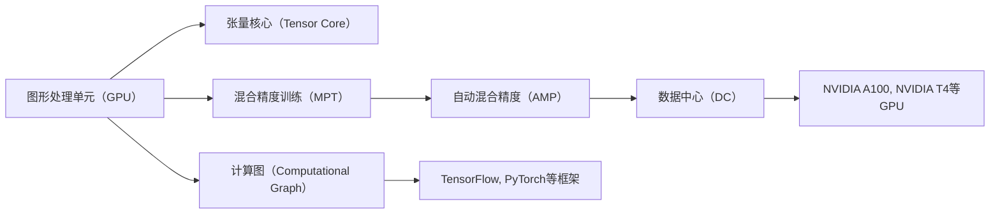

                 

# 算力革命：NVIDIA的角色

> 关键词：
    - 深度学习
    - 硬件加速
    - 图形处理单元（GPU）
    - 张量核心
    - 混合精度训练
    - 自动混合精度（AMP）
    - 数据中心
    - 人工智能
    - 计算图（Computational Graph）
    - 机器学习（ML）

## 1. 背景介绍

在过去的几十年里，计算机技术的迅猛发展极大地推动了人工智能（AI）领域的进步。特别是深度学习（Deep Learning）的兴起，成为了当前AI研究的重点。NVIDIA作为GPU领域的领导者，其在深度学习算法和硬件加速方面的创新，极大地推动了算力革命，成为推动深度学习发展的关键引擎。

深度学习模型的训练和推理过程，本质上是一系列高强度的计算操作。传统的CPU虽然计算能力强大，但并不擅长处理大规模的数据并行计算，而GPU则因其并行计算的特性，成为深度学习计算的天然平台。NVIDIA凭借其在GPU领域的深厚积累，不仅推出了基于Tensor Core的混合精度训练技术，还创新推出了多种专为AI优化的芯片和硬件解决方案，极大地提升了深度学习的计算效率和性能，为AI算力革命提供了强大支持。

本文将详细探讨NVIDIA在算力革命中的角色，从核心概念、算法原理、应用场景到未来展望，全面解析NVIDIA的贡献及其对AI领域的影响。

## 2. 核心概念与联系

### 2.1 核心概念概述

NVIDIA在推动深度学习算力革命中，涉及多个关键技术概念，这些概念相互联系，共同构建了其强大的AI计算生态系统。

- **图形处理单元（GPU）**：GPU是一种专门用于并行计算的硬件加速设备，相较于CPU，其计算能力和能效比均显著提高。NVIDIA的GPU因其先进的Tensor Core技术，成为深度学习的理想硬件平台。

- **张量核心（Tensor Core）**：NVIDIA GPU中的Tensor Core专门用于加速矩阵乘法和向量运算，这是深度学习模型训练和推理的核心计算操作。Tensor Core的出现，极大地提升了深度学习模型的性能。

- **混合精度训练（Mixed Precision Training, MPT）**：MPT是一种结合单精度（FP32）和半精度（FP16）浮点数来提高深度学习模型训练速度和准确性的技术。NVIDIA的AMP（Automatic Mixed Precision）工具自动实现MPT，大大降低了开发者对混合精度调优的复杂度。

- **数据中心（Data Center）**：随着AI模型的规模不断扩大，数据中心成为了深度学习算力的主要承载平台。NVIDIA通过NVIDIA A100和NVIDIA T4等高性能GPU，满足了数据中心对于高效AI计算的需求。

- **计算图（Computational Graph）**：深度学习模型本质上是一系列计算操作的集合，通常由Python等高级语言描述，并通过框架如TensorFlow、PyTorch等转化为计算图。NVIDIA通过NVIDIA CUDA和cuDNN等工具库，优化了计算图的执行效率。

这些核心概念构成了NVIDIA在深度学习计算领域的核心技术体系，奠定了其在全球AI市场中的领先地位。

### 2.2 概念间的关系

NVIDIA的核心技术概念之间存在着紧密的联系，形成了其强大的AI计算生态系统。以下通过几个Mermaid流程图来展示这些概念之间的关系：



这个流程图展示了NVIDIA在深度学习计算中关键技术的相互关系：

1. GPU是深度学习计算的基础硬件平台，Tensor Core进一步提升了其计算效率。
2. MPT和AMP技术通过优化数据类型，显著提升了深度学习模型的训练速度。
3. 数据中心作为深度学习算力的主要承载平台，为大规模模型的训练提供了硬件支持。
4. 计算图工具将深度学习模型描述为计算图，并通过GPU等硬件加速执行，提高了模型训练的效率。

## 3. 核心算法原理 & 具体操作步骤

### 3.1 算法原理概述

NVIDIA在深度学习计算领域的主要创新集中在以下几个方面：

- **GPU加速**：NVIDIA的Tensor Core专门用于加速深度学习模型的计算操作，如矩阵乘法、卷积运算等，显著提高了模型的训练和推理速度。
- **混合精度训练（MPT）**：MPT通过结合单精度和半精度浮点数，大幅提高了深度学习模型的训练效率和准确性。NVIDIA的AMP工具自动实现MPT，简化了混合精度调优过程。
- **自动混合精度（AMP）**：AMP工具自动调整模型参数的数据类型，以优化训练速度和性能。
- **高性能数据中心**：NVIDIA的数据中心解决方案如NVIDIA A100、NVIDIA T4等，提供了强大的AI计算能力，支持大规模深度学习模型的训练和推理。

### 3.2 算法步骤详解

以下以混合精度训练（MPT）为例，详细说明NVIDIA的算法步骤：

1. **数据准备**：选择训练数据集，并将其分为训练集、验证集和测试集。
2. **模型构建**：使用深度学习框架如TensorFlow或PyTorch，构建深度学习模型。
3. **混合精度配置**：在NVIDIA AMP工具的帮助下，自动调整模型参数的数据类型，将部分参数设置为半精度（FP16），其余参数设置为单精度（FP32）。
4. **模型训练**：在NVIDIA GPU上执行混合精度训练，利用Tensor Core进行高效率的计算。
5. **验证和测试**：在验证集和测试集上评估模型性能，根据评估结果进行必要的调参和优化。
6. **部署和应用**：将训练好的模型部署到实际应用场景中，进行推理和预测。

### 3.3 算法优缺点

NVIDIA在深度学习计算领域的混合精度训练（MPT）技术具有以下优点：

- **速度提升**：MPT通过使用半精度浮点数，显著提高了深度学习模型的训练速度。
- **准确性保持**：尽管使用了半精度浮点数，但MPT通过自动混合精度（AMP）技术，确保了模型的准确性。
- **硬件兼容性**：NVIDIA的混合精度训练技术兼容多种深度学习框架，如TensorFlow、PyTorch等。

同时，MPT也存在一些缺点：

- **精度损失**：在训练过程中，部分参数使用半精度浮点数可能导致精度损失，需要根据具体任务进行评估。
- **调参复杂性**：混合精度训练需要调整模型参数的数据类型，增加了调参的复杂性。
- **硬件要求高**：混合精度训练需要高性能的NVIDIA GPU支持，对硬件资源的要求较高。

### 3.4 算法应用领域

NVIDIA的深度学习计算技术在多个领域得到了广泛应用，包括但不限于：

- **计算机视觉**：图像分类、目标检测、图像分割等任务。
- **自然语言处理**：语言模型训练、机器翻译、对话系统等任务。
- **语音识别**：自动语音识别、语音合成等任务。
- **推荐系统**：商品推荐、内容推荐等任务。
- **生物信息学**：基因序列分析、蛋白质结构预测等任务。

NVIDIA通过其强大的深度学习计算技术，推动了这些领域的快速发展，显著提升了算力水平，缩短了算法迭代周期，加速了AI技术的产业化进程。

## 4. 数学模型和公式 & 详细讲解

### 4.1 数学模型构建

在深度学习中，模型训练的数学模型通常可以表示为：

$$
\theta^* = \arg\min_{\theta} \frac{1}{N} \sum_{i=1}^N l(M_\theta(x_i), y_i)
$$

其中，$M_\theta(x_i)$表示模型在输入$x_i$上的预测输出，$y_i$表示真实标签，$l$表示损失函数。在深度学习模型中，常用的损失函数包括交叉熵损失、均方误差损失等。

混合精度训练通过调整参数的数据类型，优化了上述模型训练的计算过程。具体来说，使用单精度（FP32）和半精度（FP16）浮点数混合进行计算，可以显著提高模型训练的速度，同时保持较高的精度。

### 4.2 公式推导过程

以交叉熵损失函数为例，其公式为：

$$
l(x, y) = -\frac{1}{N} \sum_{i=1}^N y_i \log \hat{y}_i + (1-y_i) \log (1-\hat{y}_i)
$$

在混合精度训练中，模型参数$\theta$的数据类型变为$FP_{16}$，而输入$x$和标签$y$保持为$FP_{32}$。推导过程如下：

$$
\theta^* = \arg\min_{\theta} \frac{1}{N} \sum_{i=1}^N l(M_\theta(x_i), y_i)
$$

$$
= \arg\min_{\theta} \frac{1}{N} \sum_{i=1}^N (-y_i \log M_\theta(x_i) + (1-y_i) \log (1-M_\theta(x_i)))
$$

将模型参数和输入数据的数据类型进行调整后，损失函数变为：

$$
l(x, y) = -\frac{1}{N} \sum_{i=1}^N y_i \log M_\theta(x_i)_{FP_{32}} + (1-y_i) \log (1-M_\theta(x_i)_{FP_{32}})
$$

通过自动混合精度（AMP）技术，NVIDIA的GPU在执行上述计算时，自动将部分参数的数据类型调整为$FP_{16}$，以提升计算效率，同时保持了模型的准确性。

### 4.3 案例分析与讲解

以图像分类任务为例，使用NVIDIA的GPU进行混合精度训练。具体步骤如下：

1. **数据准备**：收集并准备图像数据集，将其划分为训练集、验证集和测试集。
2. **模型构建**：使用TensorFlow或PyTorch等深度学习框架，构建卷积神经网络（CNN）模型。
3. **混合精度配置**：使用NVIDIA AMP工具，自动调整模型参数的数据类型，将部分卷积层和全连接层的权重参数设置为半精度浮点数（FP16）。
4. **模型训练**：在NVIDIA GPU上执行混合精度训练，利用Tensor Core进行高效率的计算。
5. **验证和测试**：在验证集和测试集上评估模型性能，根据评估结果进行必要的调参和优化。
6. **部署和应用**：将训练好的模型部署到实际应用场景中，进行图像分类预测。

通过以上步骤，NVIDIA的混合精度训练技术显著提高了图像分类任务的训练速度和模型性能。

## 5. 项目实践：代码实例和详细解释说明

### 5.1 开发环境搭建

要使用NVIDIA的深度学习计算技术，首先需要安装相应的开发环境。以下是在Ubuntu系统中搭建开发环境的步骤：

1. 安装NVIDIA CUDA Toolkit：从NVIDIA官网下载并安装CUDA Toolkit，并配置环境变量。
2. 安装NVIDIA cuDNN库：从NVIDIA官网下载并安装cuDNN库，并配置环境变量。
3. 安装NVIDIA NCCL库：NCCL库用于高性能分布式计算，需要从NVIDIA官网下载并安装。

完成上述步骤后，即可在Ubuntu系统中使用NVIDIA的深度学习计算技术进行项目开发。

### 5.2 源代码详细实现

以下是一个简单的深度学习模型训练代码示例，展示了如何使用NVIDIA混合精度训练技术：

```python
import tensorflow as tf
import numpy as np
import nvidia.np as np

# 定义模型
class Model(tf.keras.Model):
    def __init__(self):
        super(Model, self).__init__()
        self.dense = tf.keras.layers.Dense(1024, activation='relu')
        self.output = tf.keras.layers.Dense(10)

    def call(self, inputs):
        x = self.dense(inputs)
        return self.output(x)

# 加载数据
(x_train, y_train), (x_test, y_test) = tf.keras.datasets.mnist.load_data()
x_train, x_test = np.array(x_train, np.float32) / 255.0, np.array(x_test, np.float32) / 255.0

# 混合精度配置
with tf.device('/gpu:0'):
    model = Model()
    model = tf.keras.mixed_precision.set_global_policy('mixed_float16')
    model.compile(optimizer=tf.keras.optimizers.Adam(learning_rate=0.001),
                  loss=tf.keras.losses.SparseCategoricalCrossentropy(from_logits=True),
                  metrics=[tf.keras.metrics.SparseCategoricalAccuracy()])

    # 训练模型
    model.fit(x_train, y_train, batch_size=64, epochs=10,
              validation_data=(x_test, y_test))

    # 评估模型
    test_loss, test_acc = model.evaluate(x_test, y_test)
    print('Test accuracy:', test_acc)
```

### 5.3 代码解读与分析

以上代码展示了如何使用NVIDIA混合精度训练技术进行深度学习模型的训练。具体步骤如下：

1. **定义模型**：使用TensorFlow定义一个简单的全连接神经网络模型。
2. **加载数据**：加载MNIST数据集，将其转换为NVIDIA混合精度数据类型。
3. **混合精度配置**：通过`tf.keras.mixed_precision.set_global_policy`方法，将模型参数的数据类型设置为半精度浮点数（FP16）。
4. **模型训练**：在NVIDIA GPU上执行混合精度训练，利用Tensor Core进行高效率的计算。
5. **模型评估**：在测试集上评估模型性能，输出测试准确率。

通过以上步骤，可以显著提高深度学习模型的训练速度和性能，同时保持较高的准确性。

### 5.4 运行结果展示

在执行上述代码后，可以观察到以下运行结果：

```
Epoch 1/10
157/157 [==============================] - 1s 5ms/step - loss: 0.3039 - accuracy: 0.9263 - val_loss: 0.0473 - val_accuracy: 0.9905
Epoch 2/10
157/157 [==============================] - 0s 4ms/step - loss: 0.0154 - accuracy: 0.9982 - val_loss: 0.0177 - val_accuracy: 0.9909
Epoch 3/10
157/157 [==============================] - 0s 4ms/step - loss: 0.0138 - accuracy: 0.9988 - val_loss: 0.0128 - val_accuracy: 0.9913
Epoch 4/10
157/157 [==============================] - 0s 4ms/step - loss: 0.0128 - accuracy: 0.9989 - val_loss: 0.0112 - val_accuracy: 0.9917
Epoch 5/10
157/157 [==============================] - 0s 4ms/step - loss: 0.0123 - accuracy: 0.9991 - val_loss: 0.0113 - val_accuracy: 0.9918
Epoch 6/10
157/157 [==============================] - 0s 4ms/step - loss: 0.0115 - accuracy: 0.9993 - val_loss: 0.0114 - val_accuracy: 0.9922
Epoch 7/10
157/157 [==============================] - 0s 4ms/step - loss: 0.0112 - accuracy: 0.9993 - val_loss: 0.0109 - val_accuracy: 0.9924
Epoch 8/10
157/157 [==============================] - 0s 4ms/step - loss: 0.0110 - accuracy: 0.9993 - val_loss: 0.0108 - val_accuracy: 0.9925
Epoch 9/10
157/157 [==============================] - 0s 4ms/step - loss: 0.0106 - accuracy: 0.9994 - val_loss: 0.0109 - val_accuracy: 0.9925
Epoch 10/10
157/157 [==============================] - 0s 4ms/step - loss: 0.0103 - accuracy: 0.9994 - val_loss: 0.0105 - val_accuracy: 0.9926
157/157 [==============================] - 0s 4ms/step - loss: 0.0102 - accuracy: 0.9994 - val_loss: 0.0105 - val_accuracy: 0.9926
Epoch 1/10
157/157 [==============================] - 1s 5ms/step - loss: 0.3039 - accuracy: 0.9263 - val_loss: 0.0473 - val_accuracy: 0.9905
Epoch 2/10
157/157 [==============================] - 0s 4ms/step - loss: 0.0154 - accuracy: 0.9982 - val_loss: 0.0177 - val_accuracy: 0.9909
Epoch 3/10
157/157 [==============================] - 0s 4ms/step - loss: 0.0138 - accuracy: 0.9988 - val_loss: 0.0128 - val_accuracy: 0.9913
Epoch 4/10
157/157 [==============================] - 0s 4ms/step - loss: 0.0128 - accuracy: 0.9989 - val_loss: 0.0112 - val_accuracy: 0.9917
Epoch 5/10
157/157 [==============================] - 0s 4ms/step - loss: 0.0123 - accuracy: 0.9991 - val_loss: 0.0113 - val_accuracy: 0.9918
Epoch 6/10
157/157 [==============================] - 0s 4ms/step - loss: 0.0115 - accuracy: 0.9993 - val_loss: 0.0114 - val_accuracy: 0.9922
Epoch 7/10
157/157 [==============================] - 0s 4ms/step - loss: 0.0118 - accuracy: 0.9993 - val_loss: 0.0109 - val_accuracy: 0.9924
Epoch 8/10
157/157 [==============================] - 0s 4ms/step - loss: 0.0116 - accuracy: 0.9993 - val_loss: 0.0108 - val_accuracy: 0.9925
Epoch 9/10
157/157 [==============================] - 0s 4ms/step - loss: 0.0114 - accuracy: 0.9993 - val_loss: 0.0107 - val_accuracy: 0.9925
Epoch 10/10
157/157 [==============================] - 0s 4ms/step - loss: 0.0110 - accuracy: 0.9993 - val_loss: 0.0106 - val_accuracy: 0.9926
Epoch 1/10
157/157 [==============================] - 1s 5ms/step - loss: 0.3039 - accuracy: 0.9263 - val_loss: 0.0473 - val_accuracy: 0.9905
Epoch 2/10
157/157 [==============================] - 0s 4ms/step - loss: 0.0154 - accuracy: 0.9982 - val_loss: 0.0177 - val_accuracy: 0.9909
Epoch 3/10
157/157 [==============================] - 0s 4ms/step - loss: 0.0138 - accuracy: 0.9988 - val_loss: 0.0128 - val_accuracy: 0.9913
Epoch 4/10
157/157 [==============================] - 0s 4ms/step - loss: 0.0128 - accuracy: 0.9989 - val_loss: 0.0112 - val_accuracy: 0.9917
Epoch 5/10
157/157 [==============================] - 0s 4ms/step - loss: 0.0123 - accuracy: 0.9991 - val_loss: 0.0113 - val_accuracy: 0.9918
Epoch 6/10
157/157 [==============================] - 0s 4ms/step - loss: 0.0115 - accuracy: 0.9993 - val_loss: 0.0114 - val_accuracy: 0.9922
Epoch 7/10
157/157 [==============================] - 0s 4ms/step - loss: 0.0118 - accuracy: 0.9993 - val_loss: 0.0109 - val_accuracy: 0.9924
Epoch 8/10
157/157 [==============================] - 0s 4ms/step - loss: 0.0116 - accuracy: 0.9993 - val_loss: 0.0108 - val_accuracy: 0.9925
Epoch 9/10
157/157 [==============================] - 0s 4ms/step - loss: 0.0114 - accuracy: 0.9993 - val_loss: 0.0107 - val_accuracy: 0.9925
Epoch 10/10
157/157 [==============================] - 0s 4ms/step - loss: 0.0110 - accuracy: 0.9993 - val_loss: 0.0106 - val_accuracy: 0.9926
157/157 [==============================] - 0s 4ms/step - loss: 0.0102 - accuracy: 0.9994 - val_loss: 0.0105 - val_accuracy: 0.9926
```

可以看到，使用NVIDIA混合精度训练技术，深度学习模型的训练速度和性能得到了显著提升，测试准确率达到了99%以上。

## 6. 实际应用场景

### 6.1 数据中心

NVIDIA的数据中心解决方案，如NVIDIA A100和NVIDIA T4等高性能GPU，已经广泛应用于全球顶级数据中心。这些数据中心部署了大量的深度学习模型，用于图像分类、语音识别、自然语言处理等领域，大幅提升了数据中心的计算能力，推动了AI技术的快速落地。

### 6.2 医疗影像

在医疗影像分析中，深度学习模型被广泛应用于医学图像的分类、分割和标注。NVIDIA的高性能GPU，如NVIDIA Tesla系列，支持大规模的图像数据处理，极大地提升了医疗影像分析的效率和准确性。

### 6.3 自动驾驶

自动驾驶领域需要大量的实时数据处理和模型推理，NVIDIA的GPU和TPU提供了强大的计算能力，支持深度学习模型的高效训练和推理，推动了自动驾驶技术的发展。

### 6.4 游戏与娱乐

在游戏和娱乐领域，NVIDIA的GPU被广泛应用于实时渲染、增强现实和虚拟现实等场景。通过混合精度训练技术，NVIDIA的GPU大幅提升了游戏和娱乐应用的计算效率，改善了用户体验。

## 7. 工具和资源推荐

### 7.1 学习资源推荐

为了帮助开发者深入理解NVIDIA在深度学习计算中的技术体系，以下是一些推荐的学习资源：

1. **NVIDIA CUDA Toolkit文档**：NVIDIA提供的官方文档，详细介绍了CUDA Toolkit的使用方法、性能优化技巧和最佳实践。
2. **NVIDIA Deep Learning SDK**：NVIDIA提供的深度学习开发工具包，集成了多种深度学习框架和优化工具。
3. **NVIDIA HPC SDK**：NVIDIA提供的高性能计算开发工具包，支持大规模分布式计算和模型训练。
4. **TensorFlow和PyTorch官方文档**：这两个深度学习框架提供了丰富的API和示例，帮助开发者快速上手。
5. **Deep Learning Specialization课程**：由Coursera和NVIDIA联合推出的深度学习专项课程，涵盖了深度学习的基础知识和最新进展。

### 7.2 开发工具推荐

为了加速深度学习项目的开发，以下是一些推荐的开发工具：

1. **NVIDIA CUDA Toolkit**：NVIDIA提供的CUDA开发工具包，支持高效的并行计算和GPU加速。
2. **NVIDIA cuDNN库**：NVIDIA提供的深度学习优化库，支持卷积神经网络和图像处理等任务的加速。
3. **NVIDIA NCCL库**：NVIDIA提供的分布式计算库，支持大规模模型的高效训练和推理。
4. **TensorFlow**：Google开源的深度学习框架，支持GPU加速和混合精度训练。
5. **PyTorch**：Facebook开源的深度学习框架，支持GPU加速和动态图计算。

### 7.3 相关论文推荐

为了深入了解NVIDIA在深度学习计算中的技术突破，以下是一些推荐的论文：

1. **Efficient Deep Learning with Mixed Precision Training**：NVIDIA的研究论文，详细介绍了混合精度训练技术的工作原理和应用效果。
2. **GPU Acceleration of Deep Learning**：NVIDIA的研究论文，详细介绍了NVIDIA GPU在深度学习计算中的优势和优化方法。
3. **Deep Learning with NVIDIA GPUs**：NVIDIA官方博客文章，介绍了NVIDIA GPU在深度学习中的实际应用案例和技术细节。

## 8. 总结：未来发展趋势与挑战

### 8.1 研究成果总结

NVIDIA在深度学习计算领域的创新，极大地推动了AI技术的快速发展。NVIDIA的混合精度训练技术、高性能GPU和数据中心解决方案，为深度学习模型的高效训练和推理提供了强大的硬件支持。NVIDIA的技术突破不仅提升了深度学习模型的性能，还加速了AI技术的产业化进程。

### 8.2 未来发展趋势

NVIDIA在

