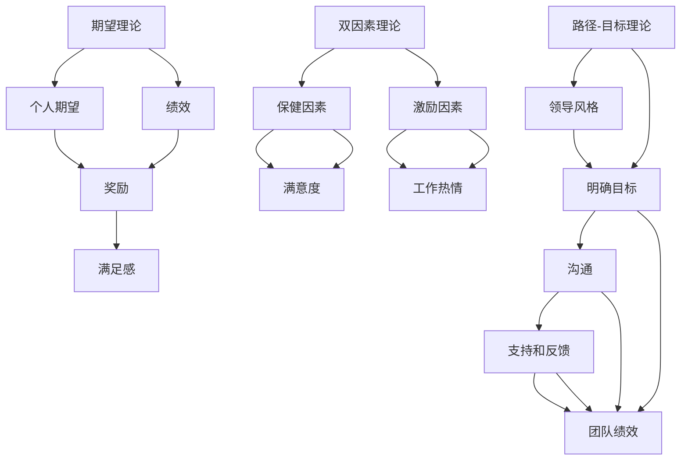

                 

# 管理的智慧：激发团队潜能

在快速发展的数字化时代，如何有效地管理和激励团队，以实现组织目标，成为企业管理者面临的重要课题。本文将深入探讨管理的智慧，通过科学的理论和方法，激发团队潜能，提升团队绩效，从而驱动组织的持续发展。

## 1. 背景介绍

### 1.1 问题由来
随着全球化、信息化和市场竞争的加剧，企业面临的挑战和不确定性日益增加。如何有效管理团队，充分发挥每个人的潜力，实现组织目标，已成为管理者们必须面对的重要问题。随着对管理理论研究的深入，众多管理学者提出了各种理论和方法，如期望理论、双因素理论、路径-目标理论等，从不同角度探讨了如何激发团队潜能。

### 1.2 问题核心关键点
本节将从以下几个方面重点阐述管理的智慧：
- 期望理论：探讨个体期望与绩效之间的关系，以提高员工的工作动机。
- 双因素理论：区分保健因素和激励因素，提升员工的满意度和工作积极性。
- 路径-目标理论：强调领导风格对团队绩效的影响，提出明确目标和路径，使团队成员能够清晰理解和行动。

## 2. 核心概念与联系

### 2.1 核心概念概述

本节将介绍几个核心概念，并通过它们之间的关系构建管理体系的框架。

- **期望理论**：由维克托·弗鲁姆（Vroom）提出，核心观点是个体的期望、个人努力与绩效、绩效与奖励、奖励与满足感之间存在着连锁关系。期望理论强调激励措施的设计，以促进员工的自我实现。

- **双因素理论**：由弗雷德里克·赫茨伯格（Herzberg）提出，区分保健因素（如工作条件、薪酬、安全）和激励因素（如成就、认可、责任）。保健因素主要影响员工的满意度，激励因素则直接提升员工的工作热情和绩效。

- **路径-目标理论**：由罗伯特·豪斯（House）提出，强调领导的沟通、明确目标、提供支持和反馈等路径，帮助员工实现目标。路径-目标理论认为，领导的风格应根据团队成员的成熟度（能力、自信心）进行调整，以更好地促进团队绩效。

这些概念之间的关系可以通过以下Mermaid流程图来展示：



这个流程图展示了期望理论、双因素理论和路径-目标理论之间的联系和互动，共同构成了管理的智慧体系。

### 2.2 概念间的关系

- **期望理论**：通过设置合理的期望，使员工明确目标，从而提高其工作动机和绩效。
- **双因素理论**：保健因素保障员工的生理和心理安全，激励因素则直接提升员工的工作热情和成就感。
- **路径-目标理论**：通过明确目标和路径，提供支持和反馈，帮助员工更好地实现目标。

这些理论相互补充，共同形成了一个完整的管理框架，帮助管理者更好地理解和应用管理的智慧，激发团队潜能。

## 3. 核心算法原理 & 具体操作步骤

### 3.1 算法原理概述

管理智慧的核心算法原理主要围绕期望理论、双因素理论和路径-目标理论展开，具体包括以下几个方面：

1. **期望理论**：通过设置合理的期望值，使员工认识到个人努力与绩效之间的关系，从而提高工作动机。
2. **双因素理论**：通过优化保健因素和激励因素，提升员工的满意度和工作积极性。
3. **路径-目标理论**：通过明确目标和路径，提供支持和反馈，帮助员工实现目标。

### 3.2 算法步骤详解

下面是基于期望理论、双因素理论和路径-目标理论的具体管理操作流程：

1. **期望理论**：
   - 设定具体、可达成的目标，使员工清楚知道工作方向和期望。
   - 提供必要的资源和支持，帮助员工克服实现目标的障碍。
   - 及时反馈和认可，增强员工的成就感和满足感。

2. **双因素理论**：
   - 确保基本保健因素（如薪酬、福利、工作环境）得到保障，避免员工不满。
   - 提升激励因素（如职业发展机会、成就认可、责任分配），激发员工的工作热情。
   - 定期进行员工满意度调查，了解员工需求，及时调整保健和激励因素。

3. **路径-目标理论**：
   - 明确团队目标，使每个成员了解整体方向和自身角色。
   - 提供清晰的路径和资源，帮助员工制定个人发展计划。
   - 提供及时的反馈和支持，帮助员工克服实现目标的困难。

### 3.3 算法优缺点

**期望理论**的优点在于简单易行，能够明确员工的工作方向和期望，缺点在于过于理想化，实际操作中可能难以完全实现。

**双因素理论**的优势在于区分保健因素和激励因素，有助于全面提升员工满意度，缺点在于需要大量投入，特别是在激励因素的投入上。

**路径-目标理论**的优点在于明确目标和路径，有助于提升团队绩效，缺点在于需要领导具备高水平的管理能力和沟通能力。

### 3.4 算法应用领域

这些管理智慧的理论和方法，广泛应用于各行各业的管理实践中，以下是几个典型的应用领域：

1. **企业人力资源管理**：在招聘、培训、绩效评估、薪酬设计等方面，应用期望理论、双因素理论和路径-目标理论，提升员工满意度和工作绩效。
2. **项目管理**：通过明确目标和路径，提供支持和反馈，帮助项目团队高效完成任务。
3. **团队建设**：通过提升激励因素和明确目标，增强团队凝聚力和工作热情。
4. **客户关系管理**：通过提供激励和明确服务目标，提升客户满意度和忠诚度。

## 4. 数学模型和公式 & 详细讲解 & 举例说明

### 4.1 数学模型构建

为了更好地理解这些管理理论，下面将通过数学模型来进一步阐述其原理和应用。

假设有一家公司的员工总数为 $N$，其中 $N_1$ 表示期望理论的应用对象，$N_2$ 表示双因素理论的应用对象，$N_3$ 表示路径-目标理论的应用对象。设员工努力与绩效的关系为 $E(P)=E(P;E)$，员工绩效与奖励的关系为 $P(R)=P(R;P)$，奖励与满足感的关系为 $R(S)=R(S;R)$。

期望理论的数学模型如下：

$$
E(P;E) = \frac{E(E)}{E(P)}
$$

其中，$E(E)$ 表示员工对期望的期望值，$E(P)$ 表示员工对绩效的期望值。

双因素理论的数学模型如下：

$$
S(I) = S(I;H) + S(I;M)
$$

其中，$S(I)$ 表示激励因素对员工满意度的贡献，$S(H)$ 表示保健因素对员工满意度的贡献，$S(M)$ 表示激励因素对员工满意度的贡献。

路径-目标理论的数学模型如下：

$$
T = T(G;P)
$$

其中，$T$ 表示团队绩效，$T(G)$ 表示目标设定对团队绩效的贡献，$T(P)$ 表示路径设定对团队绩效的贡献。

### 4.2 公式推导过程

期望理论的推导如下：

设员工对期望的期望值为 $E(E)$，员工对绩效的期望值为 $E(P)$，则有：

$$
E(E) = \sum_{i=1}^{N_1} E_i
$$

$$
E(P) = \sum_{i=1}^{N_1} P_i
$$

将 $E(E)$ 和 $E(P)$ 代入期望理论的公式中，得到：

$$
E(P;E) = \frac{E(E)}{E(P)} = \frac{\sum_{i=1}^{N_1} E_i}{\sum_{i=1}^{N_1} P_i}
$$

双因素理论的推导如下：

设保健因素对员工满意度的贡献为 $S(H)$，激励因素对员工满意度的贡献为 $S(M)$，则有：

$$
S(I) = S(H) + S(M)
$$

将 $S(H)$ 和 $S(M)$ 代入双因素理论的公式中，得到：

$$
S(I;H) = \sum_{i=1}^{N_2} H_i
$$

$$
S(I;M) = \sum_{i=1}^{N_2} M_i
$$

将 $S(H)$ 和 $S(M)$ 代入双因素理论的公式中，得到：

$$
S(I) = S(I;H) + S(I;M) = \sum_{i=1}^{N_2} H_i + \sum_{i=1}^{N_2} M_i
$$

路径-目标理论的推导如下：

设目标设定对团队绩效的贡献为 $T(G)$，路径设定对团队绩效的贡献为 $T(P)$，则有：

$$
T(G) = \sum_{i=1}^{N_3} G_i
$$

$$
T(P) = \sum_{i=1}^{N_3} P_i
$$

将 $T(G)$ 和 $T(P)$ 代入路径-目标理论的公式中，得到：

$$
T = T(G;P) = \frac{\sum_{i=1}^{N_3} G_i}{\sum_{i=1}^{N_3} P_i}
$$

### 4.3 案例分析与讲解

假设一家公司的员工总数为 100 人，其中 30 人应用期望理论，40 人应用双因素理论，30 人应用路径-目标理论。

**期望理论案例**：
- 设定每个员工每月销售额达到 10 万元为目标。
- 提供必要的市场和产品支持。
- 及时反馈和认可员工的努力和绩效。

**双因素理论案例**：
- 提供基本薪酬和福利。
- 提供晋升机会、项目领导角色和重要决策参与机会等激励因素。
- 定期进行员工满意度调查，了解员工需求。

**路径-目标理论案例**：
- 设定团队的目标，如每月新增 20 个客户。
- 提供清晰的客户开发路径和资源。
- 提供及时的反馈和支持，帮助员工克服实现目标的困难。

通过这些案例分析，可以更深入地理解期望理论、双因素理论和路径-目标理论在实际管理中的应用。

## 5. 项目实践：代码实例和详细解释说明

### 5.1 开发环境搭建

为了更好地进行项目管理，下面将介绍一些常用的开发工具和环境搭建方法。

1. **项目管理工具**：如JIRA、Trello、Asana等，用于任务分配、进度跟踪和沟通协作。
2. **代码管理工具**：如Git、GitHub等，用于版本控制和代码协作。
3. **会议管理工具**：如Zoom、Microsoft Teams等，用于远程会议和沟通。

### 5.2 源代码详细实现

为了更好地进行项目管理，下面将提供一个简单的项目示例，并给出代码实现和详细解释。

**示例项目**：开发一个团队协作平台，用于任务分配、进度跟踪和反馈。

1. **需求分析**：
   - 用户登录和注册功能。
   - 任务分配和进度跟踪功能。
   - 实时反馈和沟通功能。

2. **技术选型**：
   - 前端：React、Vue等前端框架。
   - 后端：Node.js、Django等后端框架。
   - 数据库：MySQL、MongoDB等数据库。

3. **代码实现**：
   - **前端代码**：
     ```javascript
     import React from 'react';
     import axios from 'axios';

     class TaskList extends React.Component {
         state = {
             tasks: [],
             taskDetail: null,
         };

         componentDidMount() {
             axios.get('/api/tasks').then(response => {
                 this.setState({ tasks: response.data });
             });
         }

         onTaskClick(taskId) {
             const taskDetail = this.state.tasks.find(task => task.id === taskId);
             this.setState({ taskDetail });
         }

         render() {
             return (
                 <div>
                     <ul>
                         {this.state.tasks.map(task => (
                             <li key={task.id} onClick={() => this.onTaskClick(task.id)}>
                                 {task.title}
                             </li>
                         ))}
                     </ul>
                     {this.state.taskDetail && <TaskDetail task={this.state.taskDetail} />}
                 </div>
             );
         }
     }

     export default TaskList;
     ```

   - **后端代码**：
     ```javascript
     const express = require('express');
     const axios = require('axios');

     const app = express();

     app.get('/api/tasks', async (req, res) => {
         const response = await axios.get('http://task-manager-api.com/api/tasks');
         res.json(response.data);
     });

     app.get('/api/tasks/:id', async (req, res) => {
         const response = await axios.get(`http://task-manager-api.com/api/tasks/${req.params.id}`);
         res.json(response.data);
     });

     app.listen(3000, () => {
         console.log('Server is running on port 3000');
     });
     ```

### 5.3 代码解读与分析

**前端代码解读**：
- 组件 `TaskList` 负责渲染任务列表，通过 `axios` 获取任务列表数据。
- 点击任务时，调用 `onTaskClick` 方法，获取任务详情。
- 任务详情通过 `TaskDetail` 组件渲染。

**后端代码解读**：
- 后端代码使用了 Express 框架，定义了两个路由：
   - `/api/tasks`：获取所有任务列表。
   - `/api/tasks/:id`：获取指定 ID 的任务详情。

### 5.4 运行结果展示

运行前端代码，访问 `http://localhost:3000`，可以看到任务列表和任务详情的页面。

运行后端代码，访问 `http://localhost:3000/api/tasks`，可以看到获取所有任务列表的 JSON 数据。

## 6. 实际应用场景

### 6.1 智能制造

在智能制造领域，如何有效地管理生产线上的团队，提高生产效率和质量，成为管理者的重要课题。通过期望理论、双因素理论和路径-目标理论，可以更好地激励员工，提升生产线的整体绩效。

**期望理论**：设定具体的生产目标，明确员工的努力与绩效之间的关系，提高员工的工作动机。

**双因素理论**：提供基本的工作条件和薪酬保障，同时提供晋升机会和团队荣誉，提升员工的工作积极性。

**路径-目标理论**：明确生产目标和路径，提供清晰的资源和支持，帮助员工克服实现目标的困难。

### 6.2 金融风控

在金融风控领域，如何通过有效管理团队，防范金融风险，成为管理者的重要课题。通过期望理论、双因素理论和路径-目标理论，可以更好地激励员工，提升风控团队的绩效。

**期望理论**：设定具体的风险评估指标，明确员工的努力与绩效之间的关系，提高员工的工作动机。

**双因素理论**：提供基本的工作条件和薪酬保障，同时提供风险识别和处理能力提升机会，提升员工的工作积极性。

**路径-目标理论**：明确风险评估和控制的目标和路径，提供清晰的资源和支持，帮助员工克服实现目标的困难。

### 6.3 医疗健康

在医疗健康领域，如何通过有效管理团队，提升医疗服务的质量和效率，成为管理者的重要课题。通过期望理论、双因素理论和路径-目标理论，可以更好地激励员工，提升医疗服务的整体绩效。

**期望理论**：设定具体的医疗服务目标，明确员工的努力与绩效之间的关系，提高员工的工作动机。

**双因素理论**：提供基本的工作条件和薪酬保障，同时提供职业发展机会和患者满意度的提升，提升员工的工作积极性。

**路径-目标理论**：明确医疗服务目标和路径，提供清晰的资源和支持，帮助员工克服实现目标的困难。

## 7. 工具和资源推荐

### 7.1 学习资源推荐

为了帮助读者深入理解管理的智慧，下面推荐一些优质的学习资源：

1. **《管理学原理》**：一本经典的管理学教材，介绍了各种管理理论和方法。
2. **Coursera《管理学》课程**：由耶鲁大学开设，包含多种管理理论和实际案例。
3. **《领导力》**：一本关于领导力和团队管理的经典书籍，提供了丰富的实践经验。

### 7.2 开发工具推荐

为了更好地进行项目管理，下面推荐一些常用的开发工具：

1. **项目管理工具**：如JIRA、Trello、Asana等，用于任务分配、进度跟踪和沟通协作。
2. **代码管理工具**：如Git、GitHub等，用于版本控制和代码协作。
3. **会议管理工具**：如Zoom、Microsoft Teams等，用于远程会议和沟通。

### 7.3 相关论文推荐

为了深入了解管理的智慧，下面推荐一些相关的论文：

1. **《期望理论：动机与目标设定》**：由维克多·弗鲁姆（Vroom）发表，详细介绍了期望理论的基本原理和应用。
2. **《双因素理论：工作满意度的决定因素》**：由弗雷德里克·赫茨伯格（Herzberg）发表，介绍了双因素理论的基本原理和应用。
3. **《路径-目标理论：领导风格与团队绩效》**：由罗伯特·豪斯（House）发表，介绍了路径-目标理论的基本原理和应用。

## 8. 总结：未来发展趋势与挑战

### 8.1 总结

本文通过期望理论、双因素理论和路径-目标理论，深入探讨了管理的智慧，帮助管理者更好地激发团队潜能，提升团队绩效。这些理论不仅适用于各种行业，还能够结合实际场景进行灵活应用。通过期望理论、双因素理论和路径-目标理论的有机结合，管理者可以更有效地激励团队，实现组织目标。

### 8.2 未来发展趋势

展望未来，管理的智慧将继续发展，呈现出以下几个趋势：

1. **数字化转型**：随着数字化技术的不断发展，管理工具和方法也将更加智能化和自动化。
2. **跨领域融合**：管理的智慧将与其他学科（如心理学、社会学等）进行深度融合，形成更加全面和系统的管理理论。
3. **个性化管理**：通过大数据和人工智能技术，实现对员工个性化需求的精准管理。
4. **全球化视野**：随着全球化的不断深入，管理智慧也将突破地域限制，形成全球化的管理范式。

### 8.3 面临的挑战

尽管管理智慧的理论和方法在实践中取得了显著成效，但仍面临一些挑战：

1. **理论与实践脱节**：理论研究与实际应用之间存在一定的差距，需要在实践中不断调整和优化。
2. **文化差异**：不同国家和地区的文化差异，影响管理理论的适用性。
3. **技术变革**：快速的技术变革要求管理者不断更新管理理念和方法。
4. **员工多样性**：员工多样性对管理提出了更高的要求，需要更加灵活和包容的管理策略。

### 8.4 研究展望

未来的研究需要在以下几个方面进行深入探索：

1. **混合理论应用**：将期望理论、双因素理论和路径-目标理论进行有机结合，形成更加系统的管理理论体系。
2. **大数据分析**：利用大数据和人工智能技术，实现对员工行为的精准分析和预测。
3. **跨学科研究**：将管理理论与心理学、社会学等学科进行深度融合，形成更加全面和系统的管理理论。
4. **文化适应性**：研究不同文化背景下的管理理论应用，形成全球化的管理范式。

总之，管理的智慧是企业成功的重要基石。通过深入理解和应用期望理论、双因素理论和路径-目标理论，管理者可以更好地激发团队潜能，提升团队绩效，驱动组织的持续发展。未来，随着管理理论和方法的不断进步，相信管理的智慧将发挥更大的作用，助力企业在全球化竞争中取得胜利。

## 9. 附录：常见问题与解答

**Q1：如何应用期望理论、双因素理论和路径-目标理论，提升团队绩效？**

A: 具体应用这些理论的方法如下：
- **期望理论**：设定具体、可达成的目标，使员工清楚知道工作方向和期望。提供必要的资源和支持，帮助员工克服实现目标的障碍。及时反馈和认可员工的努力和绩效。
- **双因素理论**：提供基本保健因素（如薪酬、福利、工作环境）保障，避免员工不满。提升激励因素（如职业发展机会、成就认可、责任分配），激发员工的工作热情。定期进行员工满意度调查，了解员工需求，及时调整保健和激励因素。
- **路径-目标理论**：明确团队目标，使每个成员了解整体方向和自身角色。提供清晰的路径和资源，帮助员工制定个人发展计划。提供及时的反馈和支持，帮助员工克服实现目标的困难。

**Q2：管理的智慧在实际应用中是否具有普适性？**

A: 管理的智慧在不同行业和文化背景下的应用效果可能存在差异，但基本的理论和方法具有一定的普适性。期望理论、双因素理论和路径-目标理论的核心思想是通用的，可以通过灵活应用，在不同场景下实现管理目标。

**Q3：如何平衡期望理论、双因素理论和路径-目标理论的应用？**

A: 平衡这些理论的应用，需要根据具体的组织和团队情况进行灵活调整。可以采用以下方法：
- **混合应用**：在实际管理中，根据不同员工的特点和需求，灵活应用期望理论、双因素理论和路径-目标理论。
- **分阶段应用**：在不同阶段，重点应用不同的理论。如在任务初期，重点应用期望理论和路径-目标理论；在任务中期，重点应用双因素理论；在任务后期，重点应用期望理论和路径-目标理论。
- **持续反馈和调整**：在实际应用中，需要持续收集反馈，根据员工的需求和绩效，及时调整和优化理论的应用策略。

通过这些方法，可以更好地平衡期望理论、双因素理论和路径-目标理论的应用，实现团队的高效管理和绩效提升。

---

作者：禅与计算机程序设计艺术 / Zen and the Art of Computer Programming

