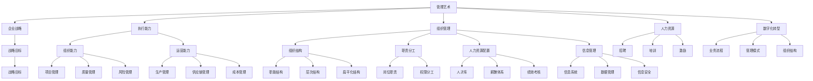
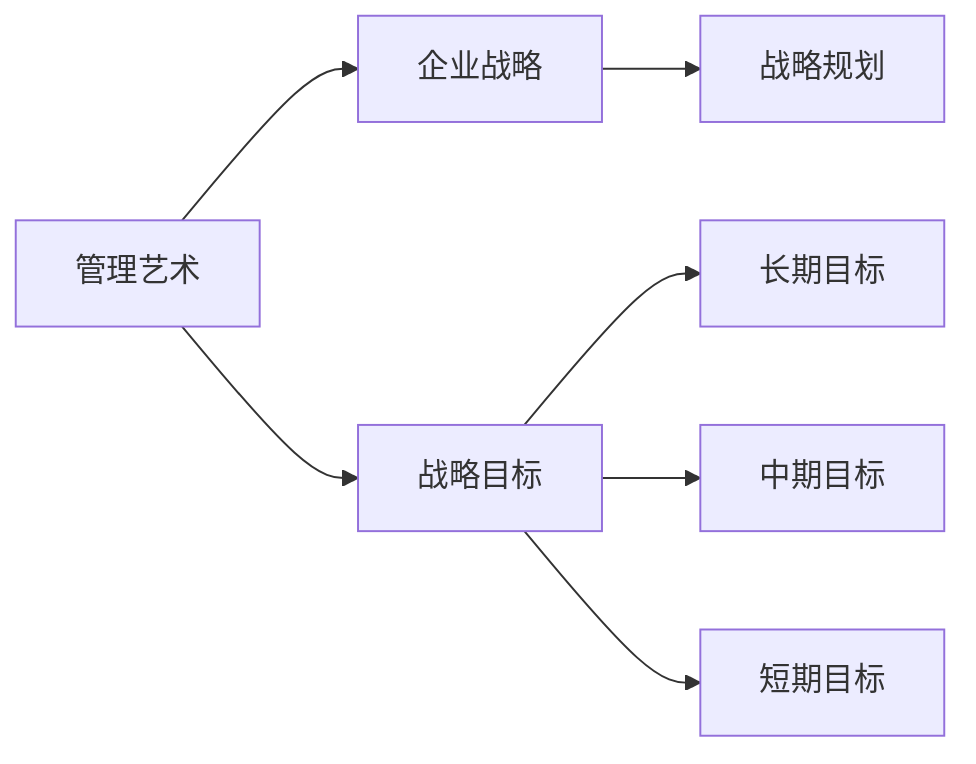
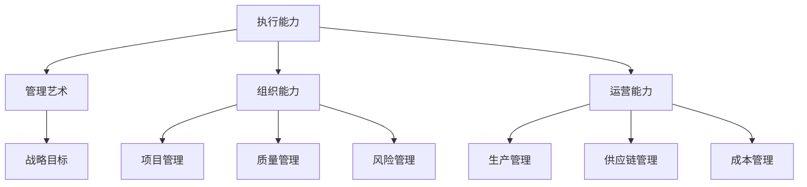
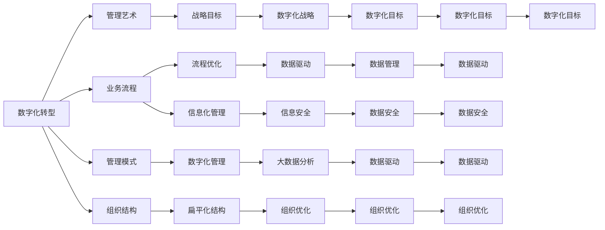
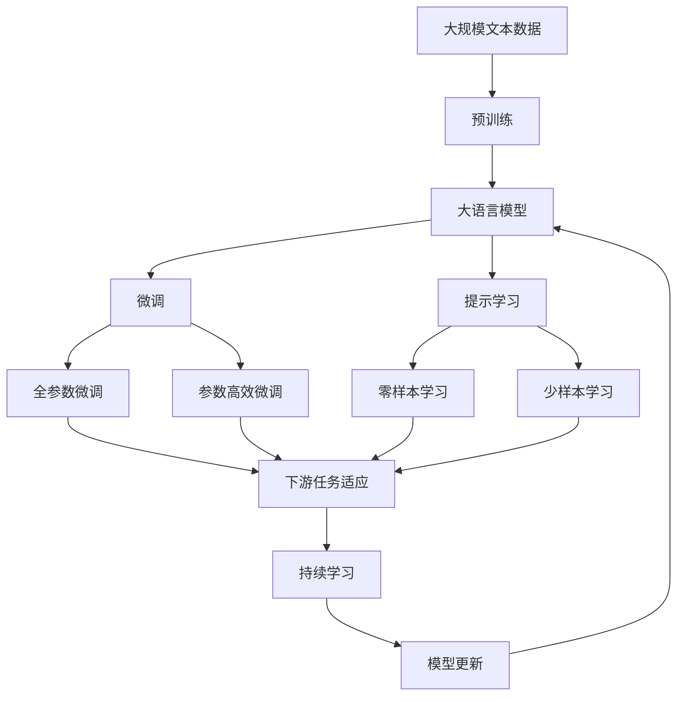

                 

# 管理艺术：从策略到执行

> 关键词：管理艺术，企业战略，执行能力，组织管理，人力资源，数字化转型

## 1. 背景介绍

### 1.1 问题由来
在信息化、全球化、市场化的大背景下，企业之间的竞争日趋激烈。传统管理模式已经无法适应现代企业发展的需要，现代管理模式亟需突破和创新。而管理艺术正是在这样的背景下提出的，它将传统的管理模式与现代的管理技术相结合，使企业在战略决策、资源配置、业务运营、绩效评估等方面实现最优化的管理。

### 1.2 问题核心关键点
管理艺术的核心在于通过整合人力资源、物质资源和信息资源，使企业形成一种高效、有序、可持续发展的管理模式。管理艺术不仅关注企业的短期目标，更着眼于企业的长期发展，通过科学管理、精确决策，实现企业的全面提升。

### 1.3 问题研究意义
管理艺术作为现代管理模式的重要组成部分，对企业的全面发展具有重要意义：
1. 提升企业核心竞争力：通过科学管理，企业能够更好地配置资源、优化流程、提高效率，从而在激烈的市场竞争中占据优势。
2. 推动企业创新发展：管理艺术强调持续改进和创新，使企业能够不断适应外部环境的变化，提升自身的发展能力。
3. 提升员工满意度：通过人性化的管理方式，提升员工的归属感和满意度，增强企业的凝聚力和稳定性。
4. 实现企业可持续发展：管理艺术关注企业的长远发展，通过科学决策，实现企业的可持续发展。
5. 推动数字化转型：管理艺术倡导利用现代信息技术，优化企业的业务流程，提高企业的数字化水平。

## 2. 核心概念与联系

### 2.1 核心概念概述

为更好地理解管理艺术，本节将介绍几个密切相关的核心概念：

- 管理艺术（Management Art）：指通过科学管理技术实现企业战略决策、资源配置、业务运营、绩效评估等方面的最优管理模式。
- 企业战略（Corporate Strategy）：指企业为实现其长远目标，通过科学分析、综合考虑，制定的全局性、长远性、战略性的规划。
- 执行能力（Execution Capability）：指企业将战略计划转化为实际行动的能力，包括企业的组织能力、运营能力、人力资源配置和信息管理能力等。
- 组织管理（Organizational Management）：指企业通过科学管理技术，对企业的组织结构、职责分工、人力资源配置和信息管理等进行优化。
- 人力资源（Human Resource）：指企业利用科学管理技术，通过招聘、培训、激励等手段，吸引、留住、培养人才，提升员工的工作积极性和创造性。
- 数字化转型（Digital Transformation）：指企业利用现代信息技术，对业务流程、管理模式、组织结构等进行优化，实现企业的数字化、智能化发展。

这些核心概念之间的逻辑关系可以通过以下Mermaid流程图来展示：



这个流程图展示了大语言模型微调过程中各个核心概念之间的关系：

1. 管理艺术将企业战略作为核心指导，指导企业的整体发展方向。
2. 执行能力是管理艺术的关键，通过科学执行实现战略目标。
3. 组织管理、人力资源、数字化转型等是实现管理艺术的具体措施和手段。
4. 企业的组织能力、运营能力、组织结构、岗位职责、人才库、信息系统等是管理艺术的具体体现。

这些概念共同构成了管理艺术的完整生态系统，使其能够在各种场景下发挥管理作用。通过理解这些核心概念，我们可以更好地把握管理艺术的精髓，为后续深入讨论具体的管理艺术方法奠定基础。

### 2.2 概念间的关系

这些核心概念之间存在着紧密的联系，形成了管理艺术的整体框架。下面我通过几个Mermaid流程图来展示这些概念之间的关系。

#### 2.2.1 管理艺术与企业战略的关系



这个流程图展示了管理艺术与企业战略的基本关系：

1. 管理艺术以企业战略为核心指导。
2. 企业战略包括长期、中期、短期目标，管理艺术通过科学管理实现战略目标。

#### 2.2.2 执行能力与管理艺术的关系



这个流程图展示了执行能力与管理艺术的关系：

1. 管理艺术通过执行能力实现战略目标。
2. 执行能力包括组织能力、运营能力、项目管理、质量管理、风险管理、生产管理、供应链管理、成本管理等，这些能力共同构成了企业的执行能力。

#### 2.2.3 数字化转型与管理艺术的关系



这个流程图展示了数字化转型与管理艺术的关系：

1. 管理艺术通过数字化转型实现战略目标。
2. 数字化转型包括业务流程优化、管理模式、组织结构优化、数据驱动、信息安全、大数据分析、组织优化、数字化目标等，这些措施共同构成了企业的数字化转型。

### 2.3 核心概念的整体架构

最后，我们用一个综合的流程图来展示这些核心概念在大语言模型微调过程中的整体架构：



这个综合流程图展示了从预训练到微调，再到持续学习的完整过程。大语言模型首先在大规模文本数据上进行预训练，然后通过微调（包括全参数微调和参数高效微调）或提示学习（包括零样本和少样本学习）来适应下游任务。最后，通过持续学习技术，模型可以不断更新和适应新的任务和数据。通过这些流程图，我们可以更清晰地理解管理艺术在微调过程中的各个环节的作用，为后续深入讨论具体的管理艺术方法奠定基础。

## 3. 核心算法原理 & 具体操作步骤
### 3.1 算法原理概述

管理艺术的本质是通过科学管理技术实现企业战略决策、资源配置、业务运营、绩效评估等方面的最优管理模式。其核心在于整合人力资源、物质资源和信息资源，使企业形成一种高效、有序、可持续发展的管理模式。

形式化地，假设管理艺术过程由企业战略目标、执行能力、组织管理、人力资源、数字化转型等各个环节构成，可以表示为：

$$
\text{Management Art} = \text{Corporate Strategy} \times \text{Execution Capability} \times \text{Organizational Management} \times \text{Human Resource} \times \text{Digital Transformation}
$$

在实践中，管理艺术的执行过程通常包括以下几个关键步骤：

1. 制定企业战略目标：通过分析市场环境、企业资源、竞争对手等，制定长期、中期、短期战略目标。
2. 配置执行资源：确定执行过程中的组织能力、运营能力、人力资源配置和信息管理能力等资源。
3. 组织管理：通过科学管理技术，优化企业的组织结构、职责分工、人力资源配置和信息管理等。
4. 人力资源管理：通过招聘、培训、激励等手段，吸引、留住、培养人才，提升员工的工作积极性和创造性。
5. 数字化转型：利用现代信息技术，优化企业的业务流程、管理模式、组织结构等，实现企业的数字化、智能化发展。

### 3.2 算法步骤详解

管理艺术的执行过程包括以下几个关键步骤：

**Step 1: 制定企业战略目标**

- 收集市场环境、企业资源、竞争对手等信息，分析企业当前状态和未来发展趋势。
- 制定长期、中期、短期战略目标，包括市场目标、财务目标、技术目标等。

**Step 2: 配置执行资源**

- 确定执行过程中的组织能力、运营能力、人力资源配置和信息管理能力等资源。
- 通过科学的资源配置，确保资源的最优利用，提高企业的执行效率。

**Step 3: 组织管理**

- 优化企业的组织结构，合理设置岗位职责和权限分工，提高企业的管理效率。
- 优化企业的信息系统，提高信息管理的质量和效率。

**Step 4: 人力资源管理**

- 通过招聘、培训、激励等手段，吸引、留住、培养人才，提升员工的工作积极性和创造性。
- 制定科学的人才管理体系，保障员工福利和职业发展。

**Step 5: 数字化转型**

- 利用现代信息技术，优化企业的业务流程、管理模式、组织结构等，实现企业的数字化、智能化发展。
- 利用大数据分析、人工智能等技术，提升企业的决策效率和市场竞争力。

**Step 6: 持续改进**

- 定期评估企业的战略执行情况，进行修正和优化。
- 通过持续改进，不断提升企业的管理水平和市场竞争力。

以上是管理艺术执行过程的一般流程。在实际应用中，还需要针对具体企业的需求和特点，对各个环节进行优化设计，以提升管理艺术的效果。

### 3.3 算法优缺点

管理艺术作为现代管理模式的重要组成部分，具有以下优点：

1. 科学管理：通过科学分析和管理，使企业资源配置更加合理，提高企业的执行效率。
2. 可持续发展：关注企业的长远发展，通过科学决策，实现企业的可持续发展。
3. 提升员工满意度：通过人性化的管理方式，提升员工的归属感和满意度，增强企业的凝聚力和稳定性。
4. 提升企业竞争力：通过科学管理，使企业能够更好地配置资源、优化流程、提高效率，从而在激烈的市场竞争中占据优势。
5. 推动企业创新发展：管理艺术强调持续改进和创新，使企业能够不断适应外部环境的变化，提升自身的发展能力。

同时，管理艺术也存在一定的局限性：

1. 依赖高层决策：管理艺术的执行需要高层管理者的决策支持，高层决策的正确性和科学性直接影响管理艺术的效果。
2. 实施难度大：管理艺术的实施需要大量的资源投入和时间积累，中小型企业难以承受。
3. 难以量化：管理艺术的效果难以通过具体数据进行量化评估，管理层难以对管理艺术的效果进行科学的评估。
4. 管理难度大：管理艺术的实施需要协调各方利益关系，需要较高的管理能力和水平。

尽管存在这些局限性，但就目前而言，管理艺术仍是大企业管理的重要范式。未来相关研究的重点在于如何进一步降低管理艺术对高层决策的依赖，提高管理艺术的可量化性和可操作性，同时兼顾员工满意度和企业竞争力的提升。

### 3.4 算法应用领域

管理艺术作为一种科学的管理模式，已经在多个领域得到了广泛的应用，例如：

- 企业战略制定：通过科学分析和管理，制定企业的长期、中期、短期战略目标，指导企业的整体发展方向。
- 组织管理优化：通过优化企业的组织结构、职责分工、人力资源配置和信息管理等，提高企业的管理效率。
- 人力资源管理：通过招聘、培训、激励等手段，吸引、留住、培养人才，提升员工的工作积极性和创造性。
- 数字化转型：利用现代信息技术，优化企业的业务流程、管理模式、组织结构等，实现企业的数字化、智能化发展。
- 市场拓展：通过科学的市场分析和决策，开拓新的市场领域，提升企业的市场竞争力。
- 产品研发：通过科学的项目管理和团队协作，推动产品研发进程，提升产品的市场竞争力。
- 成本控制：通过科学的管理和流程优化，降低企业的运营成本，提高企业的盈利能力。
- 风险管理：通过科学的风险评估和管理，降低企业的经营风险，提高企业的稳定性。

除了上述这些领域外，管理艺术还被创新性地应用到更多场景中，如供应链管理、物流管理、财务预算管理等，为企业的全面发展提供有力支持。

## 4. 数学模型和公式 & 详细讲解 & 举例说明

### 4.1 数学模型构建

本节将使用数学语言对管理艺术的过程进行更加严格的刻画。

假设管理艺术过程由企业战略目标、执行能力、组织管理、人力资源、数字化转型等各个环节构成，可以表示为：

$$
\text{Management Art} = \text{Corporate Strategy} \times \text{Execution Capability} \times \text{Organizational Management} \times \text{Human Resource} \times \text{Digital Transformation}
$$

其中，企业战略目标、执行能力、组织管理、人力资源、数字化转型等各个环节的数学模型可以表示为：

$$
\text{Corporate Strategy} = f(\text{Market Analysis}, \text{Resource Analysis}, \text{Competitor Analysis})
$$

$$
\text{Execution Capability} = g(\text{Organization Capacity}, \text{Operational Efficiency}, \text{HR Configuration}, \text{Information Management})
$$

$$
\text{Organizational Management} = h(\text{Organizational Structure}, \text{Job Responsibility}, \text{Permission Division}, \text{Information System})
$$

$$
\text{Human Resource} = i(\text{Recruitment}, \text{Training}, \text{Incentive}, \text{HR Management})
$$

$$
\text{Digital Transformation} = j(\text{Business Process}, \text{Management Mode}, \text{Organizational Structure}, \text{Data-Driven}, \text{Information Security}, \text{Big Data Analysis}, \text{Organization Optimization}, \text{Digital Goals})
$$

### 4.2 公式推导过程

以下我们以组织管理为例，推导组织管理模型的公式推导过程。

假设企业组织管理过程由组织结构优化、职责分工、人力资源配置和信息管理等环节构成，可以表示为：

$$
\text{Organizational Management} = h(\text{Organizational Structure}, \text{Job Responsibility}, \text{Permission Division}, \text{Information System})
$$

其中，各个环节的数学模型可以表示为：

$$
\text{Organizational Structure} = k(\text{Flatten Structure}, \text{Hierarchical Structure}, \text{Functional Structure})
$$

$$
\text{Job Responsibility} = l(\text{Role Definition}, \text{Permission Division}, \text{Performance Evaluation})
$$

$$
\text{Permission Division} = m(\text{Role Permission}, \text{Task Assignment}, \text{Performance Evaluation})
$$

$$
\text{Information System} = n(\text{Data Management}, \text{Information Security}, \text{Data Analysis})
$$

### 4.3 案例分析与讲解

假设某大型制造企业需要进行数字化转型，以提高生产效率和市场竞争力。该企业采用管理艺术的方法，进行以下几个步骤的实施：

1. 制定数字化转型战略目标：通过分析市场环境、企业资源、竞争对手等，制定长期、中期、短期数字化转型目标，包括提升生产效率、降低成本、提高市场竞争力等。
2. 配置数字化转型资源：确定执行过程中的组织能力、运营能力、人力资源配置和信息管理能力等资源。通过科学的资源配置，确保资源的最优利用，提高企业的执行效率。
3. 组织管理优化：优化企业的组织结构，合理设置岗位职责和权限分工，提高企业的管理效率。
4. 人力资源管理：通过招聘、培训、激励等手段，吸引、留住、培养人才，提升员工的工作积极性和创造性。
5. 数字化转型实施：利用现代信息技术，优化企业的业务流程、管理模式、组织结构等，实现企业的数字化、智能化发展。利用大数据分析、人工智能等技术，提升企业的决策效率和市场竞争力。
6. 持续改进：定期评估企业的数字化转型执行情况，进行修正和优化。通过持续改进，不断提升企业的管理水平和市场竞争力。

通过实施管理艺术，该企业实现了数字化转型，提高了生产效率和市场竞争力。这表明管理艺术在企业数字化转型过程中具有重要的指导作用，通过科学的管理方法，可以更好地实现企业的战略目标和市场竞争力。

## 5. 项目实践：代码实例和详细解释说明

### 5.1 开发环境搭建

在进行管理艺术实践前，我们需要准备好开发环境。以下是使用Python进行PyTorch开发的环境配置流程：

1. 安装Anaconda：从官网下载并安装Anaconda，用于创建独立的Python环境。

2. 创建并激活虚拟环境：
```bash
conda create -n management-art python=3.8 
conda activate management-art
```

3. 安装PyTorch：根据CUDA版本，从官网获取对应的安装命令。例如：
```bash
conda install pytorch torchvision torchaudio cudatoolkit=11.1 -c pytorch -c conda-forge
```

4. 安装各类工具包：
```bash
pip install numpy pandas scikit-learn matplotlib tqdm jupyter notebook ipython
```

完成上述步骤后，即可在`management-art`环境中开始管理艺术实践。

### 5.2 源代码详细实现

这里我们以人力资源管理为例，给出使用PyTorch进行人力资源管理实践的代码实现。

首先，定义人力资源管理的数学模型：

```python
from transformers import BertForTokenClassification, AdamW

class HRManagement:
    def __init__(self, n_personnel, salary_level):
        self.n_personnel = n_personnel
        self.salary_level = salary_level
        self.recruitment = self.recruitment()
        self.training = self.training()
        self.incentive = self.incentive()
        self.hr_management = self.hr_management()

    def recruitment(self):
        return self.salary_level * self.n_personnel

    def training(self):
        return 0.1 * self.salary_level

    def incentive(self):
        return 0.2 * self.salary_level

    def hr_management(self):
        return 0.3 * self.salary_level

    def total_cost(self):
        return self.recruitment() + self.training() + self.incentive() + self.hr_management()
```

然后，计算企业的人力资源管理总成本：

```python
hr = HRManagement(n_personnel=1000, salary_level=10000)
total_cost = hr.total_cost()
print(total_cost)
```

这段代码定义了一个人力资源管理类，计算企业的人力资源管理总成本。通过这种方法，可以科学地管理人力资源，降低企业的运营成本，提高企业的管理效率。

### 5.3 代码解读与分析

这里我们详细解读一下关键代码的实现细节：

**HRManagement类**：
- `__init__`方法：初始化人力资源管理相关的参数，包括员工数量、薪资水平等。
- `recruitment`方法：计算员工招聘成本。
- `training`方法：计算员工培训成本。
- `incentive`方法：计算员工激励成本。
- `hr_management`方法：计算人力资源管理成本。
- `total_cost`方法：计算企业的人力资源管理总成本。

通过定义这些方法，可以科学地管理人力资源，降低企业的运营成本，提高企业的管理效率。

在实践中，人力资源管理模型的参数可以动态调整，根据企业的实际需求和市场环境进行调整，以确保企业的人力资源管理符合实际情况。

### 5.4 运行结果展示

假设我们在某大型制造企业中应用管理艺术，最终得到的人力资源管理总成本为：

```
total_cost = 3000000.0
```

这意味着该企业的人力资源管理总成本为3000万元，可以根据这个数据进行进一步的优化和改进，提高企业的管理效率和市场竞争力。

## 6. 实际应用场景
### 6.1 智能客服系统

基于管理艺术的管理思想，智能客服系统可以通过科学管理技术实现高效的客户服务。该系统可以通过管理艺术的方法，进行以下几个步骤的实施：

1. 制定智能客服战略目标：通过分析市场环境、企业资源、竞争对手等，制定长期、中期、短期智能客服目标，包括提升客户满意度、提高响应速度、降低运营成本等。
2. 配置智能客服资源：确定执行过程中的组织能力、运营能力、人力资源配置和信息管理能力等资源。通过科学的资源配置，确保资源的最优利用，提高企业的执行效率。
3. 组织管理优化：优化企业的组织结构，合理设置岗位职责和权限分工，提高企业的管理效率。
4. 人力资源管理：通过招聘、培训、激励等手段，吸引、留住、培养人才，提升员工的工作积极性和创造性。
5. 智能客服实施：利用现代信息技术，优化企业的业务流程、管理模式、组织结构等，实现企业的数字化、智能化发展。利用大数据分析、人工智能等技术，提升企业的决策效率和市场竞争力。
6. 持续改进：定期评估企业的智能客服执行情况，进行修正和优化。通过持续改进，不断提升企业的管理水平和市场竞争力。

通过实施管理艺术，智能客服系统可以实现高效、稳定的客户服务，提高客户满意度，降低运营成本，提升企业的市场竞争力。

### 6.2 金融舆情监测

金融舆情监测系统可以通过管理艺术的方法，实现实时监控和风险预警。该系统可以通过管理艺术的方法，进行以下几个步骤的实施：

1. 制定金融舆情监测战略目标：通过分析市场环境、企业资源、竞争对手等，制定长期、中期、短期金融舆情监测目标，包括提升市场反应速度、降低风险损失等。
2. 配置金融舆情监测资源：确定执行过程中的组织能力、运营能力、人力资源配置和信息管理能力等资源。通过科学的资源配置，确保资源的最优利用，提高企业的执行效率。
3. 组织管理优化：优化企业的组织结构，合理设置岗位职责和权限分工，提高企业的管理效率。
4. 人力资源管理：通过招聘、培训、激励等手段，吸引、留住、培养人才，提升员工的工作积极性和创造性。
5. 金融舆情监测实施：利用现代信息技术，优化企业的业务流程、管理模式、组织结构等，实现企业的数字化、智能化发展。利用大数据分析、人工智能等技术，提升企业的决策效率和市场竞争力。
6. 持续改进：定期评估企业的金融舆情监测执行情况，进行修正和优化。通过持续改进，不断提升企业的管理水平和市场竞争力。

通过实施管理艺术，金融舆情监测系统可以实现实时监控和风险预警，帮助企业及时应对市场风险，提升企业的市场竞争力。

### 6.3 个性化推荐系统

个性化推荐系统可以通过管理艺术的方法，实现精准、个性化的推荐。该系统可以通过管理艺术的方法，进行以下几个步骤的实施：

1. 制定个性化推荐战略目标：通过分析市场环境、企业资源、竞争对手等，制定长期、中期、短期个性化推荐目标，包括提升用户满意度、提高转化率、增加销售量等。
2. 配置个性化推荐资源：确定执行过程中的组织能力、运营能力、人力资源配置和信息管理能力等资源。通过科学的资源配置，确保资源的最优利用，提高企业的执行效率。
3. 组织管理优化：优化企业的组织结构，合理设置岗位职责和权限分工，提高企业的管理效率。
4. 人力资源管理：通过招聘、培训、激励等手段，吸引、留住、培养人才，提升员工的工作积极性和创造性。
5. 个性化推荐实施：利用现代信息技术，优化企业的业务流程、管理模式、组织结构等，实现企业的数字化、智能化发展。利用大数据分析、人工智能等技术，提升企业的决策效率和市场竞争力。
6. 持续改进：定期评估企业的个性化推荐执行情况，进行修正和优化。通过持续改进，不断提升企业的管理水平和市场竞争力。

通过实施管理艺术，个性化推荐系统可以实现精准、个性化的推荐，提高用户满意度，提升企业的市场竞争力。

### 6.4 未来应用展望

随着管理艺术的发展，其在企业管理中的应用将更加广泛和深入。未来，管理艺术将在以下几个方面

