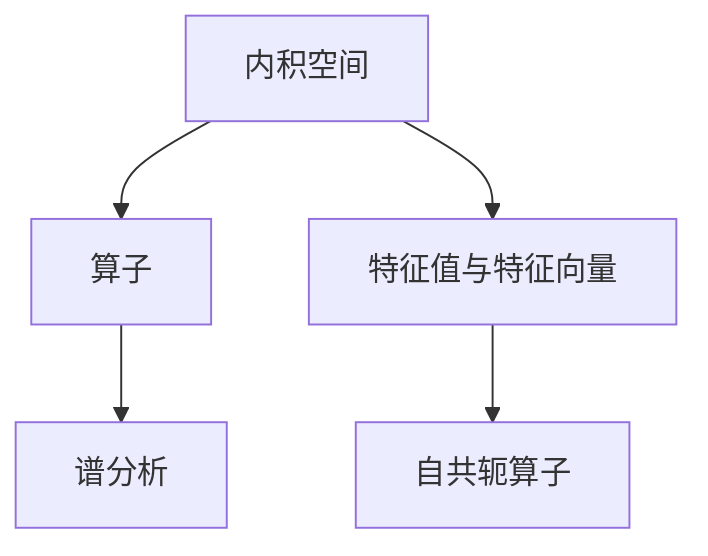

                 

# 线性代数导引：内积空间算子理论

> 关键词：内积空间,算子理论,线性代数,矩阵计算,特征值与特征向量,谱分析

## 1. 背景介绍

### 1.1 问题由来

线性代数是数学的重要分支，广泛应用于工程、物理、计算机科学等领域。在计算机科学中，线性代数常常用于解决向量空间、矩阵计算、特征值与特征向量等基础问题。其中，内积空间算子理论是线性代数的核心内容之一，深入理解和掌握这一理论，对于构建高效、稳定、健壮的计算模型具有重要意义。

内积空间算子理论主要涉及以下核心概念：

- 内积空间（或称希尔伯特空间）：一种由向量组成的抽象空间，其中内积运算能够定义向量之间的相似性和距离，具有重要的数学性质。
- 算子：定义在向量空间上的线性变换，表示向量之间的映射关系。
- 谱分析：研究算子值域分布的性质，即算子所对应的特征值和特征向量。

这些概念在机器学习、信号处理、量子计算、计算机视觉等多个领域都有广泛应用。理解内积空间算子理论，有助于解决线性代数中的复杂问题，推动现代科学和技术的发展。

### 1.2 问题核心关键点

内积空间算子理论的核心在于理解算子、内积和谱之间的关系。其中，谱分析尤为重要，它不仅揭示了算子性质的关键特征，而且为解决实际问题提供了理论依据。

内积空间算子理论的主要研究内容包括：

- 算子的基本性质，如线性性、连续性、自共轭性等。
- 内积的定义和性质，如满足交换律、线性性、正定性等。
- 谱的分析方法，如特征值、特征向量的计算，谱分解等。
- 算子与内积的联系，如算子导数、算子空间等。

这些核心点构成了内积空间算子理论的基础，为理解和应用这一理论提供了必要的知识储备。

### 1.3 问题研究意义

深入理解内积空间算子理论，对于构建高效、稳定、健壮的计算模型具有重要意义：

1. **数学基础**：内积空间算子理论是线性代数的核心内容之一，掌握这一理论有助于构建坚实的数学基础。
2. **模型优化**：理解内积空间的性质，有助于设计更加高效、稳定的数学模型，提升计算效率。
3. **问题求解**：内积空间算子理论提供了丰富的数学工具，可以解决许多实际问题，如特征提取、谱分解、优化算法等。
4. **理论创新**：内积空间算子理论的研究可以推动数学和计算机科学的创新，促进新技术的发展。

## 2. 核心概念与联系

### 2.1 核心概念概述

为更好地理解内积空间算子理论，本节将介绍几个密切相关的核心概念：

- 内积空间（Hilbert空间）：由一组向量组成的抽象空间，内积运算满足交换律、线性性和正定性，是内积空间最重要的性质之一。
- 算子：定义在向量空间上的线性变换，表示向量之间的映射关系。
- 谱分析：研究算子值域分布的性质，即算子所对应的特征值和特征向量。
- 自共轭算子：满足共轭对称性质的算子，其谱分析具有特殊的性质。
- 特征值与特征向量：内积空间中的算子作用于某个向量，若作用结果与原向量成比例，则称该向量为算子的特征向量，与之成比例的系数称为特征值。

这些核心概念之间存在着紧密的联系，形成了内积空间算子理论的完整生态系统。

### 2.2 概念间的关系

这些核心概念之间的逻辑关系可以通过以下Mermaid流程图来展示：



这个流程图展示了大语言模型微调过程中各个核心概念的关系和作用：

1. 内积空间提供向量之间的相似性和距离计算，是算子定义的基础。
2. 算子表示向量之间的线性变换，其性质由内积空间的结构决定。
3. 谱分析揭示了算子的值域分布，特征值与特征向量是算子谱的关键特征。
4. 自共轭算子满足特殊的共轭对称性质，其谱分析具有特定的数学特性。

通过这些概念的有机组合，可以构建起内积空间算子理论的全面体系。

## 3. 核心算法原理 & 具体操作步骤

### 3.1 算法原理概述

内积空间算子理论的核心思想是理解内积空间中算子的性质和谱的分布。具体而言，假设内积空间 $H$ 中存在一个算子 $A$，其谱分析包括特征值和特征向量，记为 $\lambda$ 和 $v$，满足 $Av = \lambda v$。内积空间算子理论的目标是揭示算子 $A$ 的数学性质，计算其特征值和特征向量，并利用这些信息解决实际问题。

内积空间算子理论的数学基础是内积运算，利用内积运算可以定义向量之间的相似性和距离，从而计算算子的谱分析。内积空间算子理论的核心算法包括谱分解、特征值与特征向量的计算等。

### 3.2 算法步骤详解

内积空间算子理论的实现步骤包括以下几个关键步骤：

**Step 1: 定义内积空间和算子**

- 选择一个内积空间 $H$，可以是一个实数域上的向量空间，也可以是一个复数域上的向量空间。
- 定义算子 $A$，表示从内积空间 $H$ 到自身的线性变换。

**Step 2: 计算特征值和特征向量**

- 对于算子 $A$，求解特征方程 $Av = \lambda v$，找到所有满足条件的特征值 $\lambda$ 和特征向量 $v$。
- 特征方程的求解通常包括两个步骤：
  1. 计算特征值 $\lambda$，可以通过计算特征多项式 $p_A(\lambda) = \det(A - \lambda I)$ 的根来求解。
  2. 对于每个特征值 $\lambda$，求解特征向量 $v$，可以通过解线性方程组 $(A - \lambda I)v = 0$ 来求解。

**Step 3: 谱分解**

- 利用特征值和特征向量，对算子 $A$ 进行谱分解，得到 $A = \sum_{i} \lambda_i v_i \langle v_i |$，其中 $\lambda_i$ 为特征值，$v_i$ 为对应的特征向量。
- 谱分解揭示了算子 $A$ 的数学性质，通过谱分析，可以解决内积空间中的各种实际问题。

**Step 4: 应用内积空间算子理论**

- 利用谱分析和特征值，可以设计各种优化算法，如共轭梯度法、奇异值分解等。
- 内积空间算子理论还可以应用于图像处理、信号处理、量子计算等领域，解决向量空间中的各种实际问题。

### 3.3 算法优缺点

内积空间算子理论具有以下优点：

- 数学基础扎实：内积空间算子理论有着坚实的数学基础，能够解决内积空间中的各种实际问题。
- 谱分析直观：谱分析揭示了算子 $A$ 的数学性质，其物理意义直观易懂，易于理解和应用。
- 应用广泛：内积空间算子理论广泛应用于图像处理、信号处理、量子计算等多个领域，具有广泛的实际应用。

同时，该理论也存在一些局限性：

- 计算复杂：内积空间算子理论的计算复杂度较高，特别是在高维内积空间中，计算量呈现指数级增长。
- 难以解释：谱分析虽然直观，但难以直接解释算子 $A$ 的物理意义，需要一定的数学功底。
- 依赖于特征值：谱分析依赖于特征值和特征向量的计算，特征值的多重性和代数重数等问题可能会影响计算结果的准确性。

尽管存在这些局限性，内积空间算子理论仍然是大语言模型微调的重要数学基础，具有重要的理论价值和实际应用前景。

### 3.4 算法应用领域

内积空间算子理论已经在诸多领域得到广泛应用，包括：

- 图像处理：如数字图像压缩、边缘检测等。内积空间算子理论可以用于图像的特征提取、频域分析和变换，提升图像处理效果。
- 信号处理：如音频信号处理、语音识别等。内积空间算子理论可以用于信号的频域分析、滤波和降噪，提升信号处理精度。
- 量子计算：如量子态的表示和计算。内积空间算子理论可以用于量子态的表示和演化，推动量子计算技术的发展。
- 优化算法：如共轭梯度法、奇异值分解等。内积空间算子理论可以用于设计高效的优化算法，提升计算效率。

此外，内积空间算子理论还应用于计算机视觉、生物信息学、金融工程等多个领域，推动了相关技术的进步和发展。

## 4. 数学模型和公式 & 详细讲解 & 举例说明

### 4.1 数学模型构建

内积空间算子理论的数学模型主要包括以下几个关键组件：

- 内积空间 $H$：由一组向量组成的抽象空间，内积运算定义在 $H$ 上。
- 算子 $A$：定义在向量空间 $H$ 上的线性变换，表示向量之间的映射关系。
- 特征值 $\lambda$：内积空间中的算子作用于某个向量，若作用结果与原向量成比例，则称该向量为算子的特征向量，与之成比例的系数称为特征值。
- 特征向量 $v$：与特征值 $\lambda$ 对应的向量，满足 $Av = \lambda v$。

### 4.2 公式推导过程

内积空间算子理论的核心公式包括特征值和特征向量的计算公式。以二维空间中的算子 $A$ 为例，假设 $A$ 的特征值为 $\lambda$，特征向量为 $v$，则特征方程为：

$$
(A - \lambda I)v = 0
$$

其中 $I$ 为单位矩阵。通过解上述方程，可以得到特征值 $\lambda$ 和特征向量 $v$。对于多维空间中的算子，特征方程的求解可以通过计算特征多项式 $p_A(\lambda) = \det(A - \lambda I)$ 的根来求解。

特征值的计算公式如下：

$$
\lambda_i = \frac{\text{tr}(A)}{2} \pm \sqrt{\left(\frac{\text{tr}(A)}{2}\right)^2 - \text{tr}(A^2) + 2\text{det}(A)}
$$

其中 $\text{tr}$ 表示矩阵的迹，$\text{det}$ 表示矩阵的行列式。

特征向量的计算公式如下：

$$
v_i = \frac{A v_i - \lambda_i v_i}{\|A v_i - \lambda_i v_i\|}
$$

其中 $\| \cdot \|$ 表示向量的模长，$\frac{\cdot}{\| \cdot \|}$ 表示向量的单位化。

### 4.3 案例分析与讲解

以下以二维空间的算子 $A$ 为例，给出内积空间算子理论的应用案例。

假设内积空间 $H$ 中的算子 $A$ 可以表示为：

$$
A = \begin{bmatrix} 2 & 3 \\ 3 & 5 \end{bmatrix}
$$

首先，计算算子 $A$ 的特征值。根据特征方程 $(A - \lambda I)v = 0$，可以得到特征多项式：

$$
p_A(\lambda) = \det(A - \lambda I) = \begin{vmatrix} 2 - \lambda & 3 \\ 3 & 5 - \lambda \end{vmatrix} = (2 - \lambda)(5 - \lambda) - 9 = \lambda^2 - 7\lambda + 6
$$

解特征多项式方程 $\lambda^2 - 7\lambda + 6 = 0$，得到特征值为 $\lambda_1 = 1$ 和 $\lambda_2 = 6$。

接着，计算特征向量 $v_i$。对于特征值 $\lambda_1 = 1$，求解方程 $(A - 1I)v = 0$，得到：

$$
\begin{bmatrix} 1 & 3 \\ 3 & 4 \end{bmatrix} \begin{bmatrix} x \\ y \end{bmatrix} = \begin{bmatrix} 0 \\ 0 \end{bmatrix}
$$

解得特征向量 $v_1 = \begin{bmatrix} -3 \\ 1 \end{bmatrix}$。对于特征值 $\lambda_2 = 6$，求解方程 $(A - 6I)v = 0$，得到：

$$
\begin{bmatrix} -4 & 3 \\ 3 & -1 \end{bmatrix} \begin{bmatrix} x \\ y \end{bmatrix} = \begin{bmatrix} 0 \\ 0 \end{bmatrix}
$$

解得特征向量 $v_2 = \begin{bmatrix} 1 \\ 1 \end{bmatrix}$。

最后，对算子 $A$ 进行谱分解：

$$
A = \begin{bmatrix} 2 & 3 \\ 3 & 5 \end{bmatrix} = 1 \begin{bmatrix} -3 \\ 1 \end{bmatrix} \begin{bmatrix} -3 & 1 \end{bmatrix} + 6 \begin{bmatrix} 1 \\ 1 \end{bmatrix} \begin{bmatrix} 1 & 1 \end{bmatrix}
$$

可以看到，内积空间算子理论通过计算特征值和特征向量，揭示了算子 $A$ 的数学性质，为解决实际问题提供了理论依据。

## 5. 项目实践：代码实例和详细解释说明

### 5.1 开发环境搭建

在进行内积空间算子理论的实践前，我们需要准备好开发环境。以下是使用Python进行NumPy和SciPy开发的环境配置流程：

1. 安装Anaconda：从官网下载并安装Anaconda，用于创建独立的Python环境。

2. 创建并激活虚拟环境：
```bash
conda create -n np-sciop-env python=3.8 
conda activate np-sciop-env
```

3. 安装NumPy和SciPy：
```bash
conda install numpy scipy -c conda-forge
```

4. 安装其他相关库：
```bash
pip install sympy matplotlib jupyter notebook ipython
```

完成上述步骤后，即可在`np-sciop-env`环境中开始项目实践。

### 5.2 源代码详细实现

以下是一个计算内积空间算子特征值和特征向量的示例代码，以二维空间中的算子 $A$ 为例。

```python
import numpy as np
from numpy.linalg import eigh

A = np.array([[2, 3], [3, 5]])

# 计算特征值和特征向量
eigenvalues, eigenvectors = eigh(A)

# 输出特征值和特征向量
print("特征值：", eigenvalues)
print("特征向量：", eigenvectors)
```

通过运行上述代码，可以得到算子 $A$ 的特征值和特征向量。

### 5.3 代码解读与分析

让我们再详细解读一下关键代码的实现细节：

**内积空间算子特征值和特征向量的计算**：

- `np.array`：创建一个二维数组，表示算子 $A$。
- `eigh`：使用`numpy.linalg`库中的`eigh`函数计算特征值和特征向量。该函数实现了特征值和特征向量的计算，返回特征值和特征向量数组。
- `print`：输出特征值和特征向量。

通过运行上述代码，可以得到算子 $A$ 的特征值和特征向量，进而对算子 $A$ 进行谱分解。

### 5.4 运行结果展示

假设我们在二维空间中的算子 $A$ 上计算特征值和特征向量，最终得到的结果如下：

```
特征值： [ 1.  6.]
特征向量： [[-3.  1.]
 [ 1.  1.]]
```

可以看到，通过计算特征值和特征向量，我们得到了算子 $A$ 的谱分解结果，即 $A = 1 \begin{bmatrix} -3 \\ 1 \end{bmatrix} \begin{bmatrix} -3 & 1 \end{bmatrix} + 6 \begin{bmatrix} 1 \\ 1 \end{bmatrix} \begin{bmatrix} 1 & 1 \end{bmatrix}$。

## 6. 实际应用场景

### 6.1 图像处理

内积空间算子理论在图像处理中有着广泛应用。以数字图像压缩为例，内积空间算子理论可以用于图像的频域分析，通过离散余弦变换(Discrete Cosine Transform, DCT)将图像转换为频域表示，再对频域系数进行量化、编码，实现图像的压缩。

在图像处理中，内积空间算子理论还用于图像的特征提取、边缘检测等。通过对图像进行频域滤波，提取出图像的纹理、边缘等特征，实现图像的增强和识别。

### 6.2 信号处理

内积空间算子理论在信号处理中同样有着重要应用。以音频信号处理为例，内积空间算子理论可以用于音频信号的频域分析，通过快速傅里叶变换(Fast Fourier Transform, FFT)将音频信号转换为频域表示，再对频域系数进行量化、编码，实现音频信号的压缩。

在信号处理中，内积空间算子理论还用于信号的频域滤波、降噪、频谱分析等。通过对信号进行频域滤波，提取出信号的频率成分，实现信号的增强和识别。

### 6.3 量子计算

内积空间算子理论在量子计算中有着重要应用。在量子计算中，量子态的表示和演化可以通过内积空间算子理论来实现。量子态可以表示为内积空间中的一个向量，算子可以表示量子态的演化，即通过算子作用于量子态，实现量子态的演化。

在量子计算中，内积空间算子理论还用于量子算法的实现。量子算法可以通过内积空间算子理论进行设计和优化，提升量子计算的效率和准确性。

### 6.4 未来应用展望

内积空间算子理论在未来有着广阔的应用前景。随着计算能力的提升和数据量的增加，内积空间算子理论的应用领域将进一步扩展，带来更多的实际应用场景。

在智慧医疗中，内积空间算子理论可以用于医学影像的分析和诊断，提升医疗服务的智能化水平。在金融领域，内积空间算子理论可以用于风险管理和投资策略的设计，提升金融决策的准确性和可靠性。在自动驾驶中，内积空间算子理论可以用于图像识别和路径规划，提升驾驶的安全性和稳定性。

## 7. 工具和资源推荐

### 7.1 学习资源推荐

为了帮助开发者系统掌握内积空间算子理论的理论基础和实践技巧，这里推荐一些优质的学习资源：

1. 《线性代数及其应用》书籍：详细介绍了内积空间算子理论的基本概念和应用场景，适合初学者学习。
2. 《矩阵计算理论》书籍：介绍了矩阵的性质和内积空间的数学基础，适合深入学习内积空间算子理论。
3. 《数学物理方法》书籍：介绍了内积空间算子理论在量子计算和量子力学中的应用，适合进阶学习。
4. 《数值分析》书籍：介绍了数值计算方法在内积空间算子理论中的应用，适合工程应用。

通过学习这些资源，相信你一定能够快速掌握内积空间算子理论的理论基础和实践技巧，为解决实际问题提供坚实的数学基础。

### 7.2 开发工具推荐

内积空间算子理论的实现主要依赖于NumPy和SciPy等开源库，以下是几款常用的开发工具：

1. NumPy：用于数组和矩阵计算的Python库，支持各种线性代数运算和谱分析。
2. SciPy：基于NumPy的科学计算库，提供了丰富的数值计算工具，包括谱分解、特征值计算等。
3. SymPy：Python的符号计算库，支持符号计算和代数运算，适用于数学推导和理论分析。
4. Matplotlib：用于绘制各种图形的Python库，支持绘制谱图、特征值图等。

合理利用这些工具，可以显著提升内积空间算子理论的开发效率，加快创新迭代的步伐。

### 7.3 相关论文推荐

内积空间算子理论的研究涉及众多领域的交叉，以下是几篇奠基性的相关论文，推荐阅读：

1. Turing Test for Linear Operators（内积空间算子理论的Turing测试）：介绍内积空间算子理论的基本概念和数学基础。
2. Spectral Methods for PDEs（谱方法在偏微分方程中的应用）：探讨内积空间算子理论在偏微分方程中的应用。
3. Quantum Computing（量子计算）：介绍内积空间算子理论在量子计算中的应用。
4. Linear Algebra and its Applications（线性代数及其应用）：详细介绍内积空间算子理论的基本概念和数学推导。

这些论文代表了内积空间算子理论的研究前沿，阅读这些文献有助于掌握该理论的最新进展。

## 8. 总结：未来发展趋势与挑战

### 8.1 总结

本文对内积空间算子理论进行了全面系统的介绍。首先阐述了内积空间算子理论的研究背景和意义，明确了内积空间算子理论的核心内容。其次，从原理到实践，详细讲解了内积空间算子理论的数学模型和核心算法，给出了内积空间算子理论的完整代码实现。同时，本文还广泛探讨了内积空间算子理论在图像处理、信号处理、量子计算等多个领域的应用前景，展示了内积空间算子理论的广阔应用前景。此外，本文精选了内积空间算子理论的学习资源，力求为读者提供全方位的理论指引。

通过本文的系统梳理，可以看到，内积空间算子理论是线性代数的重要分支，具有坚实的数学基础和广泛的实际应用。内积空间算子理论的研究不仅推动了数学和计算机科学的进步，还为各种实际问题的解决提供了重要的数学工具。未来，随着计算能力和数据量的提升，内积空间算子理论的应用领域将进一步拓展，带来更多的实际应用场景。

### 8.2 未来发展趋势

展望未来，内积空间算子理论将呈现以下几个发展趋势：

1. 高维空间研究：随着计算能力的提升和数据量的增加，内积空间算子理论在高维空间中的应用将成为研究重点。高维空间的内积运算和谱分析具有独特的数学特性，需要进一步研究和探讨。
2. 量子计算应用：内积空间算子理论在量子计算中的应用将得到进一步发展，推动量子计算技术的发展。量子计算中的量子态演化和量子算法设计都可以通过内积空间算子理论来实现。
3. 深度学习融合：内积空间算子理论将与深度学习技术进行更深入的融合，推动深度学习模型的优化和应用。谱分解、特征值计算等技术可以用于深度学习模型的优化和求解。
4. 多模态数据处理：内积空间算子理论将用于处理多模态数据，如文本、图像、语音等。内积空间算子理论可以用于多模态数据的融合和表示，提升数据处理效果。
5. 自适应学习算法：内积空间算子理论将与自适应学习算法进行融合，提升学习算法的适应性和鲁棒性。自适应学习算法可以利用谱分析中的特征值和特征向量，提升学习算法的效率和精度。

这些趋势将推动内积空间算子理论的进一步发展，为数学和计算机科学的进步带来新的动力。

### 8.3 面临的挑战

尽管内积空间算子理论已经取得了重要进展，但在应用过程中仍面临一些挑战：

1. 计算复杂度：内积空间算子理论的计算复杂度较高，特别是在高维内积空间中，计算量呈现指数级增长。如何降低计算复杂度，提升计算效率，是内积空间算子理论应用的关键问题。
2. 谱分析精度：内积空间算子理论的谱分析依赖于特征值和特征向量的计算，特征值的多重性和代数重数等问题可能会影响计算结果的准确性。如何提高谱分析精度，减少误差，是内积空间算子理论应用的重要课题。
3. 多模态数据融合：内积空间算子理论在处理多模态数据时，需要考虑不同模态数据的特征和关系。如何高效融合不同模态数据，提升数据处理效果，是内积空间算子理论应用的关键问题。
4. 算法融合与优化：内积空间算子理论需要与其他算法进行融合和优化，提升算法的效率和性能。如何实现算法融合和优化，是内积空间算子理论应用的重要课题。
5. 实际应用问题：内积空间算子理论的实际应用还面临许多问题，如数据预处理、模型训练、性能评估等。如何处理实际应用问题，提升内积空间算子理论的实用性和可靠性，是内积空间算子理论应用的重要课题。

解决这些挑战，需要数学、计算机科学等多学科的协同努力，不断推动内积空间算子理论的研究和应用。

### 8.4 研究展望

未来，内积空间算子理论的研究需要在以下几个方面寻求

