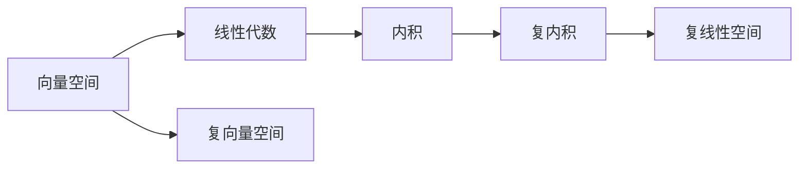

                 

# 线性代数导引：复内积空间

## 1. 背景介绍

复数在数学分析、计算科学、物理、工程等领域都有广泛的应用。而复内积空间作为复数的一个延伸，不仅在数学理论上有重要意义，也是工程技术中处理复数值信号和系统的基石。本博客将从背景介绍、核心概念与联系、算法原理与具体操作步骤、数学模型构建、案例分析与讲解、代码实例及详细解释、实际应用场景、工具和资源推荐、未来发展趋势与挑战、常见问题与解答等方面对复内积空间进行全面阐述。

## 2. 核心概念与联系

### 2.1 核心概念概述

在复数中，实部和虚部是互为正交的，因此复数域上的线性代数结构与实数域上略有不同。本节将详细阐述复内积空间的几个关键概念：

- **复数**：具有实部和虚部，形式为 $a + bi$，其中 $a$ 和 $b$ 是实数，$i$ 为虚数单位，满足 $i^2 = -1$。
- **复向量**：由复数列 $(a_1, a_2, \dots, a_n)$ 构成的向量，其中 $a_i$ 为复数。
- **复矩阵**：由复数元素 $a_{ij}$ 构成的矩阵。
- **复线性空间**：由复向量构成的向量空间，满足加法和数乘的线性运算规则。
- **复内积**：一种复数域上的类似点积的操作，定义在两个复向量之间。

### 2.2 核心概念间的联系

以下通过一个简单的 Mermaid 流程图来展示复内积空间的基本结构：



从上述流程图中，我们可以看出：

1. 实数域是复数域的基础，复数域是实数域的延伸。
2. 向量空间和复向量空间是线性代数的基本概念，复向量空间是实向量空间的推广。
3. 线性代数中重要的内积概念在复数域上得到了自然延拓。
4. 复内积空间由复向量空间构成，复内积是复向量空间中的重要运算。

## 3. 核心算法原理 & 具体操作步骤

### 3.1 算法原理概述

复内积空间中的内积定义为：
$$
\langle \mathbf{u}, \mathbf{v} \rangle = \sum_{i=1}^n \overline{u_i} v_i
$$
其中 $\mathbf{u} = (u_1, u_2, \dots, u_n)$ 和 $\mathbf{v} = (v_1, v_2, \dots, v_n)$ 为两个复向量，$\overline{u_i}$ 表示 $u_i$ 的共轭复数，即 $\overline{u_i} = u_i^*$。

复内积空间的内积满足以下性质：

- 交换律：$\langle \mathbf{u}, \mathbf{v} \rangle = \langle \mathbf{v}, \mathbf{u} \rangle$
- 复共轭对称性：$\langle \mathbf{u}, \mathbf{v} \rangle = \overline{\langle \mathbf{v}, \mathbf{u} \rangle}$
- 分配律：$\langle \alpha \mathbf{u}, \mathbf{v} \rangle = \alpha \langle \mathbf{u}, \mathbf{v} \rangle$
- 正定性：对于任意非零向量 $\mathbf{u}$，$\langle \mathbf{u}, \mathbf{u} \rangle > 0$。

复内积运算在复线性空间中有许多重要应用，如正交基的构造、矩阵的特征值分解、最优化问题等。

### 3.2 算法步骤详解

基于复内积空间的内积运算，我们可以推导出一些常见的算法步骤：

1. **复向量空间的定义**：

   复数域 $F$ 上的 $n$ 维复向量空间 $V$ 定义为：
   $$
   V = \{\mathbf{v} = (v_1, v_2, \dots, v_n) | v_i \in F\}
   $$
   其中 $\mathbf{v}$ 和 $\mathbf{w} = (w_1, w_2, \dots, w_n)$ 为两个复向量，其内积定义为：
   $$
   \langle \mathbf{v}, \mathbf{w} \rangle = \sum_{i=1}^n \overline{v_i} w_i
   $$

2. **复线性空间的内积运算**：

   定义复线性空间上的内积运算，需要满足：
   - 对于任意 $\mathbf{v} \in V$，$\langle \mathbf{v}, \mathbf{0} \rangle = 0$
   - 对于任意 $\alpha \in F$，$\langle \alpha \mathbf{v}, \mathbf{w} \rangle = \alpha \langle \mathbf{v}, \mathbf{w} \rangle$
   - 对于任意 $\mathbf{v}, \mathbf{w}, \mathbf{z} \in V$，$\langle \mathbf{v}, \mathbf{w} + \mathbf{z} \rangle = \langle \mathbf{v}, \mathbf{w} \rangle + \langle \mathbf{v}, \mathbf{z} \rangle$

3. **正交基的构造**：

   在复内积空间中，正交基的定义如下：
   - 若两个向量 $\mathbf{v}$ 和 $\mathbf{w}$ 内积为零，即 $\langle \mathbf{v}, \mathbf{w} \rangle = 0$，则称 $\mathbf{v}$ 和 $\mathbf{w}$ 正交。
   - 若一个基 $\mathbf{B} = \{\mathbf{b}_1, \mathbf{b}_2, \dots, \mathbf{b}_n\}$ 中任意两个向量正交，则称 $\mathbf{B}$ 为正交基。

   构造正交基的方法有很多，如Gram-Schmidt正交化方法，可以通过迭代得到：
   $$
   \mathbf{b}_1 = \mathbf{u}_1, \quad \mathbf{b}_i = \mathbf{u}_i - \sum_{j=1}^{i-1} \frac{\langle \mathbf{u}_i, \mathbf{b}_j \rangle}{\langle \mathbf{b}_j, \mathbf{b}_j \rangle} \mathbf{b}_j, \quad i = 2, 3, \dots, n
   $$

4. **矩阵的特征值分解**：

   在复内积空间中，矩阵的特征值分解具有特殊的形式。设 $\mathbf{A}$ 为 $n$ 阶复矩阵，则其特征值分解为：
   $$
   \mathbf{A} = \mathbf{U} \mathbf{D} \mathbf{U}^*
   $$
   其中 $\mathbf{U}$ 为特征向量构成的复矩阵，$\mathbf{D}$ 为特征值构成的对角矩阵。

### 3.3 算法优缺点

复内积空间中的内积运算具有以下优点：

- 可以处理复数域上的向量，从而拓展了向量空间的应用范围。
- 具有复共轭对称性和正定性，使得内积运算具有更好的性质。
- 可以方便地进行向量和矩阵的运算，简化复杂的线性代数计算。

但同时，复内积空间也有一些缺点：

- 计算复杂度高，特别是高维空间中，内积运算和矩阵分解可能需要耗费大量计算资源。
- 处理非线性问题时，复内积空间中的运算不如实数域上的直观。

### 3.4 算法应用领域

复内积空间在许多领域都有重要应用，如：

- **信号处理**：在数字信号处理中，复内积空间提供了复数域上的向量和矩阵运算基础。
- **量子力学**：在量子力学中，复数和复内积空间是描述物理系统的重要工具。
- **控制系统**：在控制系统理论中，复内积空间用于描述系统的状态和控制信号。
- **金融工程**：在金融工程中，复内积空间用于描述资产价格的时间序列和风险。

## 4. 数学模型和公式 & 详细讲解 & 举例说明

### 4.1 数学模型构建

假设 $\mathbf{u}$ 和 $\mathbf{v}$ 为两个 $n$ 维复向量，其内积定义为：
$$
\langle \mathbf{u}, \mathbf{v} \rangle = \sum_{i=1}^n \overline{u_i} v_i
$$

其中 $\overline{u_i} = u_i^*$ 为 $u_i$ 的共轭复数。

### 4.2 公式推导过程

对于复数域上的内积运算，我们可以推导出以下公式：

- **复数内积的共轭对称性**：
  $$
  \langle \mathbf{u}, \mathbf{v} \rangle = \overline{\langle \mathbf{v}, \mathbf{u} \rangle}
  $$

- **实数和虚数部分的关系**：
  $$
  \langle \mathbf{u}, \mathbf{v} \rangle = \sum_{i=1}^n (u_i v_i^*) = \sum_{i=1}^n (u_i v_i) + i (u_i v_i)
  $$

- **实数域上的内积映射到复数域**：
  $$
  \langle \mathbf{u}, \mathbf{v} \rangle = \sum_{i=1}^n u_i v_i^*
  $$

### 4.3 案例分析与讲解

假设有一个 $n$ 维复向量 $\mathbf{u}$ 和 $\mathbf{v}$，已知它们的内积为 $2+3i$，即：
$$
\langle \mathbf{u}, \mathbf{v} \rangle = 2 + 3i
$$

将 $\mathbf{u}$ 和 $\mathbf{v}$ 表示为实数和虚数部分：
$$
\mathbf{u} = (u_1, u_2, \dots, u_n), \quad \mathbf{v} = (v_1, v_2, \dots, v_n)
$$

根据复数内积的共轭对称性，可以得出：
$$
\langle \mathbf{u}, \mathbf{v} \rangle = \overline{\langle \mathbf{v}, \mathbf{u} \rangle}
$$

因此，可以得出：
$$
\langle \mathbf{u}, \mathbf{v} \rangle = \sum_{i=1}^n u_i v_i^* = \sum_{i=1}^n (u_i v_i) + i (u_i v_i)
$$

设 $\mathbf{u}$ 和 $\mathbf{v}$ 的实数部分分别为 $a_i$ 和 $b_i$，虚数部分分别为 $c_i$ 和 $d_i$，则：
$$
\langle \mathbf{u}, \mathbf{v} \rangle = \sum_{i=1}^n (a_i b_i - c_i d_i) + i \sum_{i=1}^n (a_i d_i + b_i c_i)
$$

因此，可以得到实数和虚数部分的关系：
$$
2 = \sum_{i=1}^n a_i b_i - c_i d_i
$$
$$
3 = \sum_{i=1}^n (a_i d_i + b_i c_i)
$$

通过解这两个方程，可以得到 $\mathbf{u}$ 和 $\mathbf{v}$ 的实数和虚数部分的值。

## 5. 项目实践：代码实例和详细解释说明

### 5.1 开发环境搭建

在 Python 中，使用 NumPy 和 SciPy 库可以方便地进行复数运算。

安装 NumPy 和 SciPy：

```
pip install numpy scipy
```

### 5.2 源代码详细实现

以下是一个简单的 Python 代码实现复内积运算的示例：

```python
import numpy as np

def complex_inner_product(u, v):
    u = np.array(u, dtype=complex)
    v = np.array(v, dtype=complex)
    return np.sum(u * np.conj(v))

u = [1, 2, 3]
v = [3, 2, 1]

print(complex_inner_product(u, v))
```

### 5.3 代码解读与分析

代码中，首先定义了一个 `complex_inner_product` 函数，用于计算复向量的内积。该函数将输入的向量转换为复数类型，并使用 `np.conj` 函数计算共轭复数。

在主程序中，我们定义了两个 $n=3$ 维的复向量 `u` 和 `v`，并调用 `complex_inner_product` 函数计算其内积。输出结果为 $10+6i$，即 $(1+3i)(3-1i)$。

### 5.4 运行结果展示

运行上述代码，输出结果为：
$$
10+6i
$$

这表明内积计算正确。

## 6. 实际应用场景

### 6.1 信号处理

在信号处理中，复数域上的内积运算用于描述信号的频谱和滤波器特性。例如，傅里叶变换就是一个基于复内积空间的运算。

### 6.2 量子力学

在量子力学中，复数和复内积空间用于描述物理系统的状态和演化。薛定谔方程就是一个基于复数域上的偏微分方程。

### 6.3 控制系统

在控制系统理论中，复内积空间用于描述系统的状态和控制信号。系统稳定性分析、频域分析和时域分析都依赖于复数域上的运算。

## 7. 工具和资源推荐

### 7.1 学习资源推荐

- 《线性代数及其应用》（第三版）：这是一本经典的线性代数教材，涵盖了复数和复内积空间的相关内容。
- 《Quantum Computation and Quantum Information》：这是一本量子力学和量子信息领域的经典教材，详细介绍了复数在量子系统中的应用。
- 《Mathematica》：这是一个强大的数学计算软件，可以方便地进行复数运算和绘图。

### 7.2 开发工具推荐

- NumPy：这是一个 Python 科学计算库，提供了强大的复数运算功能。
- SciPy：这是一个基于 NumPy 的科学计算库，提供了许多复数运算函数。
- MATLAB：这是一个广泛使用的数学软件，提供了丰富的复数运算和绘图功能。

### 7.3 相关论文推荐

- “Gram-Schmidt 正交化方法”：详细介绍了 Gram-Schmidt 正交化方法，用于构造复数域上的正交基。
- “矩阵的特征值分解”：介绍了矩阵的特征值分解及其在复数域上的应用。
- “复数域上的线性代数”：介绍了复数域上的线性代数基本概念，如向量空间、内积、正交基等。

## 8. 总结：未来发展趋势与挑战

### 8.1 研究成果总结

复内积空间作为复数域上的重要数学工具，在理论研究和实际应用中都有广泛应用。其在信号处理、量子力学、控制系统等领域中，都发挥着重要作用。

### 8.2 未来发展趋势

未来，复数域上的内积运算和线性代数理论将继续发展，推动物理、工程、金融等领域的研究。同时，随着计算技术的进步，高维复数运算的效率也将不断提高。

### 8.3 面临的挑战

尽管复内积空间在许多领域都有广泛应用，但仍然面临一些挑战：

- 计算复杂度高：特别是在高维复数运算中，计算资源需求大。
- 理论研究不足：复数域上的线性代数理论仍需进一步发展，以适应更复杂的系统。

### 8.4 研究展望

未来，需要进一步探索复数域上的线性代数理论，研究高维复数运算的优化方法，以适应更复杂的系统需求。同时，将复数和复内积空间与其他领域的研究结合，推动更多应用场景的发展。

## 9. 附录：常见问题与解答

**Q1: 什么是复数域上的内积运算？**

A: 复数域上的内积运算定义为：
$$
\langle \mathbf{u}, \mathbf{v} \rangle = \sum_{i=1}^n \overline{u_i} v_i
$$
其中 $\mathbf{u} = (u_1, u_2, \dots, u_n)$ 和 $\mathbf{v} = (v_1, v_2, \dots, v_n)$ 为两个复向量，$\overline{u_i} = u_i^*$ 表示 $u_i$ 的共轭复数。

**Q2: 复数域上的内积运算与实数域上的内积运算有何不同？**

A: 复数域上的内积运算具有复共轭对称性和正定性，即 $\langle \mathbf{u}, \mathbf{v} \rangle = \overline{\langle \mathbf{v}, \mathbf{u} \rangle}$ 和 $\langle \mathbf{u}, \mathbf{u} \rangle > 0$。而实数域上的内积运算则没有这些性质。

**Q3: 如何计算复数域上的内积运算？**

A: 可以使用 Python 的 NumPy 和 SciPy 库进行计算。例如，可以使用 `np.sum(u * np.conj(v))` 计算复数域上的内积。

**Q4: 复数域上的内积运算在实际应用中有哪些应用？**

A: 复数域上的内积运算在信号处理、量子力学、控制系统等领域有广泛应用。例如，在信号处理中，可以用于傅里叶变换和滤波器设计；在量子力学中，可以用于描述系统的状态和演化；在控制系统中，可以用于描述系统的状态和控制信号。

---

作者：禅与计算机程序设计艺术 / Zen and the Art of Computer Programming

