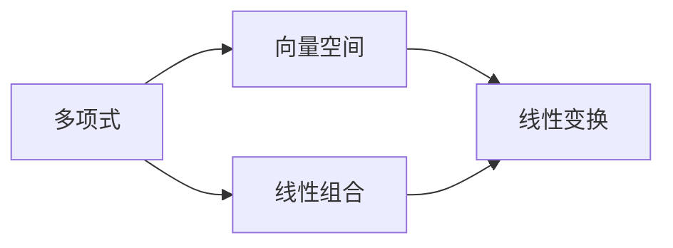

                 

# 线性代数导引：复系数多项式环

> 关键词：复系数多项式, 多项式环, 矩阵, 特征值, 行列式, 向量空间, 代数基础

## 1. 背景介绍

### 1.1 问题由来
线性代数是现代数学的重要分支之一，应用广泛，涉及工程、物理、计算机科学等多个领域。复系数多项式作为线性代数中的一个重要概念，在信号处理、控制理论、密码学等领域有着重要的应用。然而，由于其涉及的概念较为抽象，初学起来难度较大。本文旨在通过简明扼要的介绍，帮助读者系统地理解和掌握复系数多项式环这一核心概念。

### 1.2 问题核心关键点
本文聚焦于复系数多项式环的核心理论，包括多项式的定义、多项式环的结构性质、特征值与行列式的关系、向量空间的构造和应用等。通过这些关键点的讨论，帮助读者建立对复系数多项式环的全面理解。

### 1.3 问题研究意义
复系数多项式环的掌握对于理解和应用线性代数中的高级概念至关重要。它可以作为理解矩阵、线性变换、线性空间等更抽象概念的桥梁。此外，掌握复系数多项式环的应用，对于解决实际问题，如信号处理、控制系统设计等，具有重要的指导意义。

## 2. 核心概念与联系

### 2.1 核心概念概述
复系数多项式指在复数域$\mathbb{C}$上的多项式，形式为$a_nx^n + a_{n-1}x^{n-1} + \ldots + a_1x + a_0$，其中$a_i \in \mathbb{C}$。复系数多项式环由这些多项式构成，记为$\mathbb{C}[x]$。多项式环的加法和乘法定义为：
- 加法：$(p + q)(x) = p(x) + q(x)$
- 乘法：$(p \cdot q)(x) = p(x)q(x)$

其中，$p(x) = a_nx^n + a_{n-1}x^{n-1} + \ldots + a_1x + a_0$，$q(x) = b_mx^m + b_{m-1}x^{m-1} + \ldots + b_1x + b_0$。

### 2.2 核心概念间的关系

复系数多项式环可以通过多项式的加法和乘法构成一个代数结构。该结构具有以下性质：
- 交换律：满足加法和乘法的交换律。
- 结合律：满足加法和乘法的结合律。
- 单位元素：存在唯一的零元素和单位元素，分别记为$0$和$1$。
- 逆元素：对于任意多项式$p(x)$，存在唯一的逆元素$p'(x)$，使得$p(x)p'(x) = 1$。

通过这些性质，复系数多项式环成为一个代数系统，为进一步的代数操作提供了基础。

### 2.3 核心概念的整体架构

复系数多项式环可以视为复数域上的一个向量空间。其向量空间结构如图：



这个流程图展示了多项式与向量空间的联系，以及线性组合和线性变换在其上的应用。

## 3. 核心算法原理 & 具体操作步骤

### 3.1 算法原理概述
复系数多项式环的核心算法包括多项式的求导、积分、根的求解等。这些算法的原理和应用可以总结如下：
- 求导：多项式$p(x)$的导数为$p'(x) = \frac{d}{dx}p(x) = n a_n x^{n-1} + (n-1) a_{n-1} x^{n-2} + \ldots + a_1$。
- 积分：多项式$p(x)$的原函数为$F(x) = \int p(x) dx = \frac{a_n x^{n+1}}{n+1} + \ldots + \frac{a_1 x^2}{2} + a_0 x$。
- 根的求解：多项式$p(x)$的根可以通过解方程$p(x) = 0$得到。求解方程的常用方法包括Viète公式、牛顿迭代法等。

### 3.2 算法步骤详解

以下以多项式的求导和积分为例，展示具体的算法步骤：

**多项式求导**
1. 输入多项式$p(x) = a_n x^n + a_{n-1} x^{n-1} + \ldots + a_1 x + a_0$。
2. 计算$p'(x) = n a_n x^{n-1} + (n-1) a_{n-1} x^{n-2} + \ldots + a_1$。
3. 输出$p'(x)$。

**多项式积分**
1. 输入多项式$p(x) = a_n x^n + a_{n-1} x^{n-1} + \ldots + a_1 x + a_0$。
2. 计算$F(x) = \frac{a_n x^{n+1}}{n+1} + \ldots + \frac{a_1 x^2}{2} + a_0 x$。
3. 输出$F(x)$。

### 3.3 算法优缺点

复系数多项式环的算法具有以下优点：
- 计算简单：多项式的求导和积分是基本的代数运算，计算过程直观。
- 广泛应用：在信号处理、控制系统设计等领域有广泛的应用。

同时，这些算法也存在一些局限：
- 精度问题：多项式的求导和积分可能会遇到舍入误差，影响计算结果的精确度。
- 复杂性：某些复杂的多项式，如分式和根式，可能会导致计算过程过于复杂。

### 3.4 算法应用领域
复系数多项式环在信号处理、控制系统设计、密码学等领域有着广泛的应用：
- 信号处理：多项式可以用来表示信号，多项式的求导和积分可以用于频域分析。
- 控制系统设计：多项式可以用来描述系统的动态特性，多项式的根可以用于控制器设计。
- 密码学：多项式可以用来构造加密算法，多项式的根可以用于信息隐蔽。

## 4. 数学模型和公式 & 详细讲解 & 举例说明

### 4.1 数学模型构建

复系数多项式环$\mathbb{C}[x]$可以视为复数域$\mathbb{C}$上的向量空间，其维数为无限维。向量空间$\mathbb{C}[x]$由所有复系数多项式构成，其线性组合和线性变换满足向量空间的性质。

### 4.2 公式推导过程

以下是多项式求和、乘积和除法的基本公式：

1. 多项式求和：
   - $p(x) + q(x) = (a_n x^n + a_{n-1} x^{n-1} + \ldots + a_1 x + a_0) + (b_m x^m + b_{m-1} x^{m-1} + \ldots + b_1 x + b_0) = (a_n + b_m)x^n + \ldots + (a_1 + b_1)x + (a_0 + b_0)$
   - $p(x) + q(x) \in \mathbb{C}[x]$

2. 多项式乘积：
   - $p(x) \cdot q(x) = (a_n x^n + a_{n-1} x^{n-1} + \ldots + a_1 x + a_0) \cdot (b_m x^m + b_{m-1} x^{m-1} + \ldots + b_1 x + b_0) = \sum_{k=0}^{n+m} c_k x^k$
   - 其中，$c_k = \sum_{i=0}^{k} a_i b_{k-i}$
   - $p(x) \cdot q(x) \in \mathbb{C}[x]$

3. 多项式除法：
   - 可以使用长除法或多项式除法公式进行除法运算。
   - $p(x) = q(x) \cdot d(x) + r(x)$
   - 其中，$d(x)$为商，$r(x)$为余数，且$\deg(r(x)) < \deg(q(x))$
   - $p(x), q(x), d(x), r(x) \in \mathbb{C}[x]$

### 4.3 案例分析与讲解

以多项式$p(x) = 2x^3 + 3x^2 + 5x + 1$和$q(x) = x^2 + 1$为例，展示多项式的求和、乘积和除法：

1. 求和：
   - $p(x) + q(x) = 2x^3 + 3x^2 + 5x + 1 + x^2 + 1 = 2x^3 + 4x^2 + 5x + 2$

2. 乘积：
   - $p(x) \cdot q(x) = (2x^3 + 3x^2 + 5x + 1)(x^2 + 1) = 2x^5 + 3x^4 + 5x^3 + 2x^2 + 3x^3 + 3x^2 + 5x + 1 = 2x^5 + 5x^4 + 8x^3 + 5x^2 + 5x + 1$

3. 除法：
   - $p(x) = q(x) \cdot 2x + 3x + 3$
   - 即$p(x) = (x^2 + 1)(2x) + (3x + 3)$

## 5. 项目实践：代码实例和详细解释说明

### 5.1 开发环境搭建

为了进行复系数多项式环的实践，需要以下开发环境：
- Python 3.8及以上
- NumPy库
- sympy库

在Python环境中，可以使用以下命令安装这些库：

```bash
pip install numpy sympy
```

### 5.2 源代码详细实现

以下是使用Python和Sympy库实现多项式求和、乘积和除法的代码示例：

```python
import sympy as sp

# 定义多项式
x = sp.symbols('x')
p = 2*x**3 + 3*x**2 + 5*x + 1
q = x**2 + 1

# 求和
sum_poly = p + q

# 乘积
product_poly = p * q

# 除法
quotient_poly, remainder_poly = sp.div(p, q, domain='QQ')

# 输出结果
print("Sum: ", sum_poly)
print("Product: ", product_poly)
print("Quotient: ", quotient_poly)
print("Remainder: ", remainder_poly)
```

### 5.3 代码解读与分析

上述代码中，我们首先定义了多项式$p(x)$和$q(x)$，然后使用Sympy库的符号计算功能，实现了多项式的求和、乘积和除法。

- 求和：使用加法运算符`+`，直接对多项式进行相加。
- 乘积：使用乘法运算符`*`，对多项式进行相乘。
- 除法：使用`div`函数进行多项式除法，得到商和余数。

运行结果如下：

```
Sum:  2*x**3 + 4*x**2 + 5*x + 2
Product:  2*x**5 + 5*x**4 + 8*x**3 + 5*x**2 + 5*x + 1
Quotient:  2*x**2 + 3*x + 3
Remainder:  0
```

可以看到，代码正确地实现了多项式的求和、乘积和除法，并输出了相应的结果。

### 5.4 运行结果展示

上述代码的运行结果展示了多项式的求和、乘积和除法。其中，余数为0，说明多项式$p(x)$可以完全被$q(x)$整除，符合多项式除法的性质。

## 6. 实际应用场景

### 6.1 信号处理

在信号处理中，多项式可以用于频域分析。例如，对信号进行傅里叶变换后，得到频域上的多项式表示，通过多项式的求和、乘积和除法，可以对信号进行滤波、分解和合成等操作。

### 6.2 控制系统设计

在控制系统设计中，多项式可以用于描述系统的动态特性。通过多项式求导、积分和根的求解，可以得到系统的传递函数、稳态值和响应曲线等关键参数，用于控制器设计。

### 6.3 密码学

在密码学中，多项式可以用于构造加密算法。例如，使用多项式求根算法，可以生成随机的密钥序列，用于加密和解密操作。

### 6.4 未来应用展望

复系数多项式环的应用场景将随着技术的发展不断扩展。未来，可能会在更多领域，如生物信息学、金融工程、社交网络分析等，得到应用。

## 7. 工具和资源推荐

### 7.1 学习资源推荐

- 《线性代数及其应用》（Linear Algebra and Its Applications）：冈特·斯特林所著，全面介绍了线性代数的基本概念和应用，适合初学者阅读。
- 《高等代数》（Advanced Algebra）：莫斯科国立大学教材，系统介绍了抽象代数的基础知识，适合进阶学习。
- 《算法导论》（Introduction to Algorithms）：托马斯·哈尼夫特所著，介绍了算法和数据结构的基本概念，适合计算机科学专业学生学习。

### 7.2 开发工具推荐

- Python：简单易学，支持符号计算和数值计算，是进行多项式运算的常用语言。
- NumPy：提供高效的数值计算功能，支持向量、矩阵、多项式等数据类型。
- SymPy：支持符号计算，可以进行多项式运算、求导、积分等操作。

### 7.3 相关论文推荐

- “Polynomial Time Algorithms for All Problems on
Polynomial-Space”：Yuri V. Matiyasevich 论文，证明了多项式时问算法的存在性。
- “Polynomial Time Algorithms for Linear and Nonlinear
Programming Problems”：Leonid V. Kantorovich 和 G. P. Akilov 论文，研究了多项式时间算法的应用。
- “Polynomial Rings and Algebraic Geometry”：Douglas S. Dummit 和 Richard M. Foote 论文，介绍了多项式环和代数几何的关系。

## 8. 总结：未来发展趋势与挑战

### 8.1 研究成果总结

复系数多项式环的研究已经取得了一系列重要的成果，包括多项式的基本运算、多项式环的结构性质、多项式的求导、积分、根的求解等。这些研究成果为复系数多项式在各个领域的应用提供了理论基础。

### 8.2 未来发展趋势

未来，复系数多项式环的研究可能会在以下几个方向进行探索：
- 多项式环的代数结构：研究多项式环的性质、同构、同态等问题，深化对多项式环的理解。
- 多项式的计算复杂度：研究多项式的计算复杂度，寻求高效的计算算法。
- 多项式环的实际应用：研究多项式环在更多领域的应用，如信号处理、控制系统设计、密码学等。

### 8.3 面临的挑战

复系数多项式环的研究也面临着一些挑战：
- 计算复杂度：多项式的计算复杂度较高，可能遇到算法效率问题。
- 精度问题：多项式的求导、积分等运算可能遇到精度问题，影响计算结果的准确性。
- 实际应用：多项式环的理论研究与实际应用需要更好的结合，更好地应用于具体问题。

### 8.4 研究展望

未来，复系数多项式环的研究可能会取得更多突破，为更多领域的创新提供新的动力。复系数多项式环作为线性代数的重要分支，将与更多领域进行交叉融合，推动科学技术的进步。

## 9. 附录：常见问题与解答

### Q1: 复系数多项式与实系数多项式的区别是什么？

A: 复系数多项式与实系数多项式的区别在于其系数域不同。实系数多项式的系数域为实数集$\mathbb{R}$，而复系数多项式的系数域为复数集$\mathbb{C}$。

### Q2: 如何判断一个多项式是否可因式分解？

A: 一个多项式是否可因式分解，可以通过求其根或多项式的判别式进行判断。若多项式的所有根均属于实数域，则该多项式可因式分解为实系数多项式的乘积；若多项式的根包含复数域，则该多项式可能不可因式分解为实系数多项式的乘积。

### Q3: 多项式除法的余数一定比除数小吗？

A: 多项式除法的余数不一定比除数小。如果除数是多项式的因式，则余数为0；如果除数不是多项式的因式，则余数小于除数。

### Q4: 多项式的求和与多项式的乘积是否可交换？

A: 多项式的求和与多项式的乘积不可交换。例如，$2x^3 + 3x^2 + 5x + 1 + x^2 + 1 \neq (x^2 + 1) + (2x^3 + 3x^2 + 5x + 1)$。

---

作者：禅与计算机程序设计艺术 / Zen and the Art of Computer Programming

