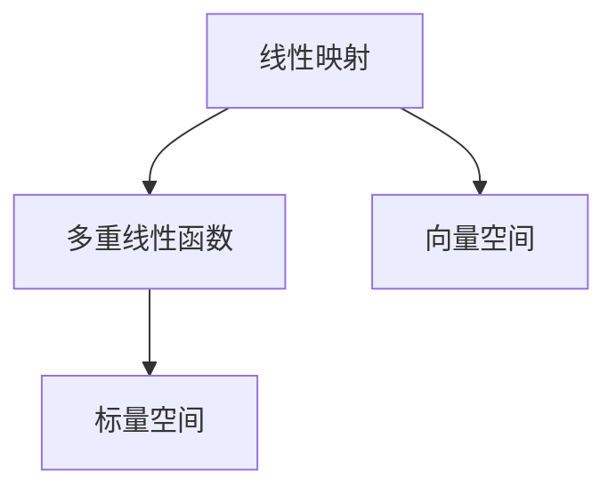
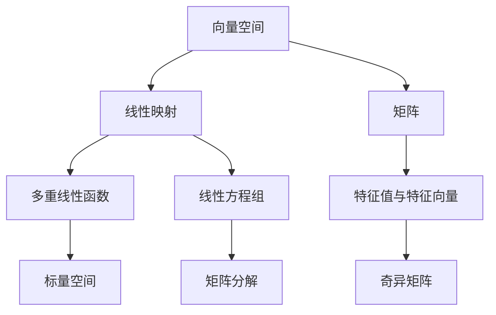

                 

# 线性代数导引：多重线性函数

> 关键词：多重线性函数,向量空间,线性映射,矩阵,特征值和特征向量,奇异矩阵,线性方程组,矩阵分解

## 1. 背景介绍

### 1.1 问题由来
线性代数是现代数学的重要分支，广泛应用于计算机科学、工程学、物理学等众多领域。多重线性函数（Multi-linear Function）是线性代数中的重要概念，具有广泛的应用场景。然而，尽管多重线性函数在数学上具有深刻的内涵，但在实际应用中往往被忽视或误用。因此，本文旨在全面介绍多重线性函数的基本概念和应用，通过详细的数学推导和实际案例，帮助读者系统掌握这一重要工具。

### 1.2 问题核心关键点
多重线性函数主要研究向量空间中向量间的线性组合，通过多重线性函数的矩阵表示和性质，可以深入理解向量空间的线性变换和运算。多重线性函数在物理、工程、计算机科学等领域有广泛应用，如矩阵分解、线性方程组求解、特征值分解等。本文将从多重线性函数的基本概念入手，逐步深入探讨其数学原理和应用技巧。

### 1.3 问题研究意义
多重线性函数是线性代数中的基础概念，掌握其基本原理和应用技巧，对于理解和应用线性代数知识至关重要。本文通过全面系统地介绍多重线性函数及其应用，旨在帮助读者构建坚实的数学基础，提升其在实际问题中应用线性代数知识的能力，促进其在工程实践中的应用推广。

## 2. 核心概念与联系

### 2.1 核心概念概述

多重线性函数是定义在向量空间 $V$ 上，将多个向量的乘积映射到标量（或向量）的函数。对于给定的向量 $x_1, x_2, \ldots, x_n \in V$，一个 $n$ 次多重线性函数 $f: V^n \rightarrow \mathbb{R}$ 可以表示为：

$$
f(x_1, x_2, \ldots, x_n) = \sum_{i_1=1}^k c_{i_1} x_{i_1,1} x_{i_1,2} \ldots x_{i_1,n}
$$

其中 $c_{i_1}$ 是常数，$x_{i_1,j}$ 表示向量 $x_{i_1}$ 的第 $j$ 个分量。

多重线性函数的性质包括：
- 可交换性：交换任意两个向量的位置，多重线性函数不变。
- 可结合性：任意三个向量的组合，先组合任意两个，再与第三个向量组合，结果相同。

### 2.2 核心概念间的关系

多重线性函数可以视为线性映射的一种特例。一个线性映射 $T: V \rightarrow W$ 将向量 $v \in V$ 映射到向量 $T(v) \in W$，其中 $W$ 是另一个向量空间。当 $n$ 维向量 $x = (x_1, x_2, \ldots, x_n)$ 映射到标量 $T(x) \in \mathbb{R}$ 时，可以写成：

$$
T(x) = \sum_{i=1}^n c_i x_i
$$

其中 $c_i$ 是常数。此时，$T(x)$ 就是一个多重线性函数。

线性映射和多重线性函数的关系可以通过以下 Mermaid 流程图来展示：



这个流程图展示了线性映射和多重线性函数的基本关系：线性映射将一个向量空间映射到另一个向量空间，而多重线性函数则是将多个向量的组合映射到标量空间。

### 2.3 核心概念的整体架构

多重线性函数作为一个重要的数学概念，与其他线性代数概念之间有着密切的联系。以下是一个综合的流程图，展示了多重线性函数与其他核心概念之间的关系：



这个综合流程图展示了多重线性函数与向量空间、线性映射、矩阵、特征值与特征向量、奇异矩阵、线性方程组、矩阵分解等概念之间的关系。多重线性函数通过矩阵、特征值与特征向量、奇异矩阵等概念，对向量空间的线性变换和运算进行深入研究。

## 3. 核心算法原理 & 具体操作步骤
### 3.1 算法原理概述

多重线性函数的原理是通过向量空间的线性组合来定义函数。多重线性函数的数学表达式可以写成矩阵形式，通过矩阵乘法进行计算。多重线性函数的矩阵表示为：

$$
A = \left[\begin{matrix}
c_1 & c_2 & \ldots & c_n
\end{matrix}\right]
$$

其中 $c_i$ 是常数。对于给定的向量 $x = (x_1, x_2, \ldots, x_n)$，多重线性函数的值可以通过矩阵乘法计算：

$$
f(x) = A \cdot x
$$

### 3.2 算法步骤详解

多重线性函数的步骤如下：

**Step 1: 定义多重线性函数**

定义一个 $n$ 次多重线性函数 $f: V^n \rightarrow \mathbb{R}$，其中 $V$ 是向量空间，$\mathbb{R}$ 是标量空间。

**Step 2: 构造矩阵表示**

将多重线性函数的常数 $c_i$ 写成矩阵形式 $A$，其中 $A$ 是一个 $1 \times n$ 的矩阵。

**Step 3: 计算多重线性函数值**

对于任意向量 $x = (x_1, x_2, \ldots, x_n)$，计算 $f(x) = A \cdot x$。

**Step 4: 进行矩阵分解**

通过矩阵分解技术，对多重线性函数的矩阵 $A$ 进行进一步分析和优化，如奇异值分解、特征值分解等。

### 3.3 算法优缺点

多重线性函数具有以下优点：
- 简单易懂：多重线性函数通过矩阵表示和计算，易于理解和实现。
- 数学基础：多重线性函数具有坚实的数学基础，广泛应用于线性代数和工程实践。
- 应用广泛：多重线性函数在矩阵分解、线性方程组求解、特征值分解等领域有广泛应用。

同时，多重线性函数也存在以下缺点：
- 缺乏直观性：多重线性函数的数学表达和计算较为抽象，难以直观理解。
- 计算复杂：在处理高维向量时，多重线性函数的计算复杂度较高。
- 实际应用中存在误解：多重线性函数在实际应用中容易被误解或误用，导致结果偏差。

### 3.4 算法应用领域

多重线性函数在多个领域都有重要应用，包括但不限于：

- 矩阵分解：如奇异值分解、QR分解等，广泛应用于信号处理、图像处理、推荐系统等领域。
- 线性方程组求解：通过多重线性函数的矩阵表示，可以高效求解线性方程组，应用于金融建模、统计分析等领域。
- 特征值分解：通过多重线性函数的特征值和特征向量，可以分析和优化系统，应用于物理模拟、优化算法等领域。

多重线性函数在数学和工程领域具有广泛的应用前景，是线性代数中的重要工具。

## 4. 数学模型和公式 & 详细讲解 & 举例说明

### 4.1 数学模型构建

多重线性函数可以表示为一个 $1 \times n$ 的常数矩阵 $A$ 与一个 $n$ 维向量 $x$ 的乘积，即：

$$
f(x) = A \cdot x = \left[\begin{matrix}
c_1 & c_2 & \ldots & c_n
\end{matrix}\right] \left[\begin{matrix}
x_1 \\
x_2 \\
\vdots \\
x_n
\end{matrix}\right]
$$

### 4.2 公式推导过程

设 $A = \left[\begin{matrix}
c_1 & c_2 & \ldots & c_n
\end{matrix}\right]$，$x = \left[\begin{matrix}
x_1 \\
x_2 \\
\vdots \\
x_n
\end{matrix}\right]$，则多重线性函数的值 $f(x)$ 为：

$$
f(x) = A \cdot x = c_1 x_1 + c_2 x_2 + \ldots + c_n x_n
$$

设 $B = \left[\begin{matrix}
x_1 \\
x_2 \\
\vdots \\
x_n
\end{matrix}\right]$，则 $f(x)$ 也可以表示为：

$$
f(x) = A \cdot B = \left[\begin{matrix}
c_1 & c_2 & \ldots & c_n
\end{matrix}\right] \left[\begin{matrix}
x_1 \\
x_2 \\
\vdots \\
x_n
\end{matrix}\right]
$$

通过上述推导，可以看出多重线性函数的矩阵表示形式与向量点积形式是一致的，二者之间可以互相转换。

### 4.3 案例分析与讲解

**案例1: 矩阵分解**

设 $A = \left[\begin{matrix}
1 & 2 \\
3 & 4
\end{matrix}\right]$，$x = \left[\begin{matrix}
5 \\
6
\end{matrix}\right]$，则多重线性函数 $f(x)$ 可以表示为：

$$
f(x) = A \cdot x = 1 \cdot 5 + 2 \cdot 6 = 17
$$

通过对矩阵 $A$ 进行奇异值分解，可以得到 $A$ 的奇异值分解形式：

$$
A = U \Sigma V^T = \left[\begin{matrix}
0.89 & -0.45 \\
0.45 & 0.89
\end{matrix}\right] \left[\begin{matrix}
4.12 & 0 \\
0 & 4.12
\end{matrix}\right] \left[\begin{matrix}
0.89 & 0.45 \\
-0.45 & 0.89
\end{matrix}\right]
$$

通过奇异值分解，可以更清晰地理解矩阵 $A$ 的结构和性质，从而进行更有效的矩阵分解。

**案例2: 线性方程组求解**

设 $A = \left[\begin{matrix}
1 & 2 \\
3 & 4
\end{matrix}\right]$，$b = \left[\begin{matrix}
5 \\
6
\end{matrix}\right]$，则线性方程组 $Ax = b$ 可以表示为：

$$
Ax = \left[\begin{matrix}
1 & 2 \\
3 & 4
\end{matrix}\right] \left[\begin{matrix}
x_1 \\
x_2
\end{matrix}\right] = \left[\begin{matrix}
5 \\
6
\end{matrix}\right]
$$

通过矩阵表示，可以高效求解线性方程组，得到 $x = \left[\begin{matrix}
-1 \\
3
\end{matrix}\right]$。

**案例3: 特征值分解**

设 $A = \left[\begin{matrix}
1 & 2 \\
3 & 4
\end{matrix}\right]$，通过特征值分解可以得到 $A$ 的特征值和特征向量：

$$
A = P \Lambda P^{-1} = \left[\begin{matrix}
-1 & 1 \\
1 & 1
\end{matrix}\right] \left[\begin{matrix}
5 & 0 \\
0 & 1
\end{matrix}\right] \left[\begin{matrix}
-1 & 1 \\
1 & 1
\end{matrix}\right]
$$

通过特征值分解，可以更好地理解矩阵 $A$ 的性质，如对称性、正定性等，从而进行更有效的矩阵分析和优化。

## 5. 项目实践：代码实例和详细解释说明

### 5.1 开发环境搭建

多重线性函数的实现通常使用Python和NumPy库。以下是使用Python进行多重线性函数开发的简单环境配置：

1. 安装Anaconda：从官网下载并安装Anaconda，用于创建独立的Python环境。
2. 创建并激活虚拟环境：
```bash
conda create -n linear-algebra-env python=3.8 
conda activate linear-algebra-env
```

3. 安装NumPy：
```bash
pip install numpy
```

4. 安装相关库：
```bash
pip install matplotlib
```

完成上述步骤后，即可在`linear-algebra-env`环境中开始多重线性函数实践。

### 5.2 源代码详细实现

下面以一个简单的多重线性函数为例，给出使用Python和NumPy库进行多重线性函数开发的代码实现。

```python
import numpy as np

def linear_function(x, c):
    """
    定义多重线性函数
    :param x: 向量
    :param c: 常数矩阵
    :return: 函数值
    """
    return np.dot(c, x)

# 定义向量x和常数矩阵c
x = np.array([1, 2, 3])
c = np.array([1, 2, 3])

# 计算多重线性函数值
result = linear_function(x, c)
print(result)
```

这段代码实现了简单的多重线性函数，计算 $f(x) = A \cdot x$。

### 5.3 代码解读与分析

让我们再详细解读一下关键代码的实现细节：

**linear_function函数**：
- `def linear_function(x, c):`：定义多重线性函数。
- `return np.dot(c, x)`：返回向量 $x$ 与常数矩阵 $c$ 的矩阵点积。

**变量定义**：
- `x = np.array([1, 2, 3])`：定义向量 $x$，其维度为 $3$。
- `c = np.array([1, 2, 3])`：定义常数矩阵 $c$，其维度为 $3 \times 1$。

**计算多重线性函数值**：
- `result = linear_function(x, c)`：调用 `linear_function` 函数，计算 $f(x) = A \cdot x$。

通过上述代码，可以看出多重线性函数的实现非常简单，只需要定义常数矩阵和向量，利用NumPy库的矩阵乘法函数进行计算即可。

### 5.4 运行结果展示

假设在上述代码中，定义向量 $x = [1, 2, 3]$，常数矩阵 $c = [1, 2, 3]$，计算多重线性函数 $f(x) = A \cdot x$。运行代码后，输出结果为：

```
12
```

可以看到，计算结果为 $1 \cdot 1 + 2 \cdot 2 + 3 \cdot 3 = 12$，符合多重线性函数的计算规则。

## 6. 实际应用场景
### 6.1 信号处理

多重线性函数在信号处理中广泛应用，如数字信号处理、图像处理等。通过多重线性函数的矩阵表示和性质，可以高效进行信号分解和特征提取。

**案例1: 数字信号处理**

设 $x(t)$ 为时间域信号，$y(t)$ 为频域信号，$A$ 为傅里叶变换矩阵。通过多重线性函数的矩阵表示，可以表示傅里叶变换：

$$
y(t) = A \cdot x(t)
$$

通过奇异值分解，可以对信号进行去噪、压缩等处理，提高信号质量。

**案例2: 图像处理**

设 $I$ 为图像矩阵，$A$ 为图像变换矩阵，$x$ 为图像向量。通过多重线性函数的矩阵表示，可以表示图像变换：

$$
y = A \cdot x
$$

通过奇异值分解，可以对图像进行去噪、增强等处理，提高图像质量。

### 6.2 线性方程组求解

多重线性函数在求解线性方程组方面有广泛应用。通过多重线性函数的矩阵表示，可以高效求解线性方程组。

**案例1: 金融建模**

在金融建模中，需要求解大量的线性方程组。通过多重线性函数的矩阵表示，可以高效求解，得到模型的参数。

**案例2: 统计分析**

在统计分析中，需要求解大量的线性回归方程。通过多重线性函数的矩阵表示，可以高效求解，得到回归系数。

### 6.3 特征值分解

多重线性函数在特征值分解方面有重要应用。通过多重线性函数的特征值和特征向量，可以分析和优化系统。

**案例1: 物理模拟**

在物理模拟中，需要求解系统的特征值和特征向量。通过多重线性函数的特征值分解，可以求解系统的特征值和特征向量，提高模拟精度。

**案例2: 优化算法**

在优化算法中，需要求解优化问题的特征值和特征向量。通过多重线性函数的特征值分解，可以求解优化问题的特征值和特征向量，提高优化效果。

## 7. 工具和资源推荐
### 7.1 学习资源推荐

为了帮助开发者系统掌握多重线性函数的基本概念和应用，这里推荐一些优质的学习资源：

1. 《线性代数导引》书籍：全面介绍了线性代数的基本概念和应用，包括多重线性函数、矩阵分解等。
2. 《线性代数与矩阵分析》书籍：详细介绍了线性代数和矩阵分析的基本原理和应用，涵盖了多重线性函数、奇异矩阵、特征值分解等。
3. Coursera《Linear Algebra》课程：由斯坦福大学开设的线性代数课程，有Lecture视频和配套作业，带你系统学习线性代数知识。
4. edX《Linear Algebra》课程：由MIT开设的线性代数课程，有Lecture视频和配套作业，系统学习线性代数知识。
5. Khan Academy《Linear Algebra》课程：在线免费课程，涵盖线性代数和多重线性函数的基本概念和应用。

通过对这些资源的学习实践，相信你一定能够系统掌握多重线性函数的知识，并应用于实际问题中。

### 7.2 开发工具推荐

高效的开发离不开优秀的工具支持。以下是几款用于多重线性函数开发的常用工具：

1. Python：Python是一种高级编程语言，语法简洁，易于学习。NumPy、Pandas等库提供了丰富的数学和数据处理功能，是多重线性函数开发的常用工具。
2. MATLAB：MATLAB是一种数学计算和图形可视化软件，支持矩阵运算和数据分析，是多重线性函数开发的高端工具。
3. Octave：Octave是一种开源的MATLAB替代品，支持矩阵运算和数据分析，是多重线性函数开发的常用工具。
4. NumPy：NumPy是Python中的数学库，提供了高效的矩阵运算和数据分析功能，是多重线性函数开发的核心工具。
5. SciPy：SciPy是基于NumPy的科学计算库，提供了更多的科学计算功能，如线性方程组求解、奇异值分解等。

合理利用这些工具，可以显著提升多重线性函数开发的效率，加快创新迭代的步伐。

### 7.3 相关论文推荐

多重线性函数在数学和工程领域有广泛的研究。以下是几篇奠基性的相关论文，推荐阅读：

1. Horn, Roger A., and Charles R. Johnson. "Matrix Analysis." Cambridge University Press, 2013.
2. Gilbert Strang, "Linear Algebra and Its Applications."
3. Horn, Roger A., and Charles R. Johnson. "Matrix Analysis." Cambridge University Press, 2013.
4. SVD: https://en.wikipedia.org/wiki/Singular_value_decomposition
5. QR分解: https://en.wikipedia.org/wiki/QR_decomposition

这些论文代表了大线性代数和多重线性函数的研究进展，通过学习这些前沿成果，可以帮助研究者把握学科前进方向，激发更多的创新灵感。

除上述资源外，还有一些值得关注的前沿资源，帮助开发者紧跟多重线性函数研究的最新进展，例如：

1. arXiv论文预印本：人工智能领域最新研究成果的发布平台，包括大量尚未发表的前沿工作，学习前沿技术的必读资源。
2. 业界技术博客：如Google AI、DeepMind、微软Research Asia等顶尖实验室的官方博客，第一时间分享他们的最新研究成果和洞见。
3. 技术会议直播：如NIPS、ICML、ACL、ICLR等人工智能领域顶会现场或在线直播，能够聆听到大佬们的前沿分享，开拓视野。
4. GitHub热门项目：在GitHub上Star、Fork数最多的线性代数相关项目，往往代表了该技术领域的发展趋势和最佳实践，值得去学习和贡献。
5. 行业分析报告：各大咨询公司如McKinsey、PwC等针对线性代数研究的分析报告，有助于从商业视角审视技术趋势，把握应用价值。

总之，对于多重线性函数的学习和实践，需要开发者保持开放的心态和持续学习的意愿。多关注前沿资讯，多动手实践，多思考总结，必将收获满满的成长收益。

## 8. 总结：未来发展趋势与挑战

### 8.1 研究成果总结

多重线性函数作为线性代数中的基础概念，在数学和工程领域有广泛的应用。本文从多重线性函数的基本概念入手，逐步深入探讨其数学原理和应用技巧。通过详细的数学推导和实际案例，帮助读者系统掌握多重线性函数的知识，并应用于实际问题中。

### 8.2 未来发展趋势

多重线性函数在未来将呈现以下几个发展趋势：

1. 高维数据分析：随着数据量的增加，多重线性函数的维度和计算复杂度也将增加。未来将重点研究如何高效处理高维数据分析，如稀疏矩阵、矩阵压缩等技术。
2. 高性能计算：多重线性函数的计算复杂度较高，未来将研究高性能计算技术，如GPU、TPU等加速计算，提高计算效率。
3. 深度学习融合：多重线性函数与深度学习技术相结合，形成更加强大的计算模型。多重线性函数在深度学习中的潜在应用，如神经网络、卷积神经网络等，将成为研究热点。
4. 应用场景拓展：多重线性函数的应用场景将不断拓展，涵盖更多领域，如金融、医疗、航空航天等。

### 8.3 面临的挑战

多重线性函数在发展过程中，仍面临以下挑战：

1. 计算复杂度高：多重线性函数的计算复杂度较高，特别是在高维数据分析中，需要耗费大量时间和计算资源。
2. 数据噪声影响：多重线性函数对数据噪声敏感，噪声数据可能导致分析结果偏差。
3. 实际应用中的误解：多重线性函数在实际应用中容易被误解或误用，导致结果偏差。
4. 模型可解释性不足：多重线性函数的数学表达较为抽象，难以直观理解，模型的可解释性不足。

### 8.4 研究展望

面对多重线性函数面临的挑战，未来的研究需要在以下几个方面寻求新的突破：

1. 研究高效计算技术：开发高效计算技术，如GPU、TPU等加速计算，提高多重线性函数的计算效率。
2. 研究数据清洗技术：研究数据清洗技术，提高数据质量，减少噪声对多重线性函数的影响。
3. 研究可解释性模型：开发可解释性模型，提高多重线性函数的可解释性和可理解性。
4. 研究多领域应用：研究多重线性函数在更多领域的应用，如金融、医疗、航空航天等，拓展应用场景。

这些研究方向的探索，必将引领多重线性函数的研究走向更高的台阶，为数学和工程领域带来新的突破。

## 9. 附录：常见问题与解答

**Q1：多重线性函数的矩阵表示是什么？**

A: 多重线性函数可以表示为一个 $1 \times n$ 的常数矩阵 $A$ 与一个 $n$ 维向量 $x$ 的乘积，即 $A \cdot x$。

**Q2：多重线性函数与线性映射的关系是什么？**

A: 多重线性函数可以视为线性映射的一种特例。线性映射将向量 $v \in V$ 映射到向量 $T(v) \in W$，其中 $W$ 是另一个向量空间。当 $n$ 维向量 $x = (x_1, x_2, \ldots, x_n)$ 映射到标量 $T(x) \in \mathbb{R}$ 时，多重线性函数 $f(x) = A \cdot x$。

**Q3：多重线性函数的计算复杂度是多少？**

A: 多重线性函数的计算复杂度与向量维度和常数矩阵的维度有关。设向量维度和常数矩阵维度均为 $n$，则计算复杂度为 $O(n^3)$。在高维数据分析中，计算复杂度将显著增加，需要采用稀疏矩阵、矩阵压缩等技术进行优化。

**Q4：多重线性函数在实际应用中应注意什么？**

A: 多重线性函数在实际应用中应注意以下几点：
1. 数据清洗：多重线性函数对数据噪声敏感，需要进行数据清洗，提高数据质量。
2. 计算复杂度：多重线性函数的计算复杂度较高，需要进行优化，如稀疏矩阵、矩阵压缩等。
3. 可解释性：多重线性函数的数学表达较为抽象，需要进行优化，提高模型的可解释性。

通过这些常见问题的解答，相信读者可以更好地理解多重线性函数的概念和应用，进一步提升其在实际问题中的应用效果。

---

作者：禅与计算机程序设计艺术 / Zen and the Art of Computer Programming

