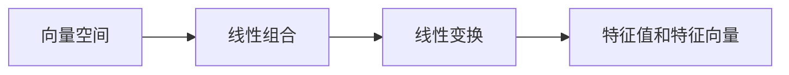

                 

# 线性代数导引：实平面 R2

线性代数是计算机科学和工程学科中不可或缺的基础，它为我们提供了处理多维数据和数学建模的强大工具。本文将深入探讨实平面R²的基本概念、核心定理和应用场景，帮助你理解线性代数的精髓。

## 1. 背景介绍

### 1.1 问题由来
线性代数最初是研究二元变量的代数结构和线性方程组的解法，但随着数学和计算机科学的快速发展，线性代数已经成为一个涵盖向量空间、矩阵运算、线性变换和特征值分析的全面学科。这些概念不仅在数学中占据重要地位，还在物理学、工程学、计算机科学等领域广泛应用。

### 1.2 问题核心关键点
线性代数的主要研究对象是向量空间和矩阵。向量空间是由向量组成的集合，而矩阵是描述向量空间线性变换的数学工具。在线性代数中，最重要的概念包括：
- 向量：具有大小和方向的数学对象，如二维平面中的点。
- 线性组合：向量的加法和数乘。
- 线性变换：矩阵乘法，将向量空间从一个基变换到另一个基。
- 特征值和特征向量：描述矩阵变换性质的特殊向量。

这些概念构成了线性代数的基本框架，广泛应用于多个领域。

### 1.3 问题研究意义
线性代数在计算密集型任务中起着关键作用，如计算机图形学、信号处理、机器学习等。深入理解线性代数的基本概念和定理，对于解决实际问题至关重要。

## 2. 核心概念与联系

### 2.1 核心概念概述

为更好地理解线性代数的基本概念，我们将简要介绍几个关键术语和它们之间的关系：

- 向量空间：由一组向量组成的集合，其中向量可以任意组合和数乘。例如，二维空间中的所有点可以视为一个向量空间。
- 线性组合：向量的加法和数乘。例如，$3\vec{a} + 4\vec{b}$ 是一个线性组合。
- 线性变换：矩阵乘法，将一个向量空间变换到另一个向量空间。例如，$A\vec{v}$ 表示将向量 $\vec{v}$ 通过矩阵 $A$ 进行线性变换。
- 特征值和特征向量：描述矩阵变换性质的特殊向量。例如，如果 $\vec{v}$ 是矩阵 $A$ 的特征向量，则有 $A\vec{v} = \lambda\vec{v}$，其中 $\lambda$ 是特征值。

这些核心概念之间的关系可以通过以下Mermaid流程图来展示：



这个流程图展示了大平面R²中的基本数学关系：

1. 向量是向量空间中的基本元素。
2. 向量之间的加法和数乘构成线性组合。
3. 矩阵乘法表示一种线性变换，将一个向量空间变换到另一个向量空间。
4. 特征值和特征向量描述矩阵的线性变换特性。

### 2.2 概念间的关系

这些核心概念之间存在着紧密的联系，形成了线性代数的基本框架。通过理解这些核心概念及其关系，可以更好地掌握线性代数的本质。

## 3. 核心算法原理 & 具体操作步骤

### 3.1 算法原理概述

线性代数中的核心算法是矩阵的特征值分解和奇异值分解。这两个分解帮助我们将复杂的矩阵变换简化为更容易处理的数学形式。

#### 3.1.1 矩阵特征值分解

矩阵特征值分解（Eigenvalue Decomposition, EVD）将一个矩阵 $A$ 分解为 $A = V \Lambda V^{-1}$ 的形式，其中 $\Lambda$ 是对角矩阵，包含 $A$ 的特征值；$V$ 是特征向量矩阵，列向量 $\vec{v}_i$ 是 $A$ 的特征向量。

#### 3.1.2 奇异值分解

奇异值分解（Singular Value Decomposition, SVD）将一个矩阵 $A$ 分解为 $A = U \Sigma V^T$ 的形式，其中 $U$ 和 $V$ 是正交矩阵，$\Sigma$ 是对角矩阵，包含 $A$ 的奇异值。

### 3.2 算法步骤详解

下面我们详细介绍矩阵特征值分解和奇异值分解的步骤：

#### 3.2.1 矩阵特征值分解

1. **矩阵准备**：准备要分解的矩阵 $A$。
2. **特征方程求解**：求解特征方程 $\det(A - \lambda I) = 0$，找到特征值 $\lambda$。
3. **特征向量计算**：对每个特征值 $\lambda_i$，求解线性方程 $(A - \lambda_i I)\vec{v}_i = 0$，得到对应的特征向量 $\vec{v}_i$。
4. **标准正交基构造**：对所有特征向量进行正交化，得到标准正交基 $V$。
5. **分解完成**：将 $A$ 分解为 $A = V \Lambda V^{-1}$ 的形式，其中 $\Lambda$ 是对角矩阵，包含特征值。

#### 3.2.2 奇异值分解

1. **矩阵准备**：准备要分解的矩阵 $A$。
2. **奇异值计算**：通过奇异值分解算法，求解奇异值 $\sigma_i$ 和左奇异向量 $U_i$，右奇异向量 $V_i$。
3. **分解完成**：将 $A$ 分解为 $A = U \Sigma V^T$ 的形式，其中 $U$ 和 $V$ 是正交矩阵，$\Sigma$ 是对角矩阵，包含奇异值。

### 3.3 算法优缺点

#### 3.3.1 矩阵特征值分解

**优点**：
- 能将矩阵 $A$ 完全分解为特征向量和特征值的组合，揭示矩阵的局部结构。
- 广泛应用于信号处理、机器学习、物理学等领域。

**缺点**：
- 矩阵特征值分解的计算复杂度较高，不适用于大规模矩阵。
- 特征向量的正交化可能引入数值误差，影响精度。

#### 3.3.2 奇异值分解

**优点**：
- 奇异值分解的计算复杂度相对较低，适用于大规模矩阵。
- 奇异值能揭示矩阵的整体结构和主成分。

**缺点**：
- 奇异值分解分解后的矩阵可能包含零奇异值，影响分解效果。
- 分解结果的数值稳定性可能受奇异值的影响，需要进行一定的数值处理。

### 3.4 算法应用领域

矩阵特征值分解和奇异值分解在多个领域有广泛应用：

- **信号处理**：矩阵分解用于信号去噪、特征提取和压缩感知。
- **机器学习**：奇异值分解用于降维、特征提取和推荐系统。
- **物理学**：矩阵分解用于量子力学、广义相对论等物理模型的求解。
- **计算机图形学**：矩阵分解用于纹理映射、图像处理和计算机动画。

这些应用展示了线性代数的强大威力，其数学工具在实际问题中具有广泛的应用价值。

## 4. 数学模型和公式 & 详细讲解 & 举例说明

### 4.1 数学模型构建

在线性代数中，我们通常使用向量空间和矩阵作为基本数学模型。以下是对二维空间R²中的向量空间和矩阵的详细定义：

- **向量**：一个二维向量 $\vec{v} = (x, y)$ 可以表示为 $x\vec{i} + y\vec{j}$，其中 $\vec{i} = (1, 0)$ 和 $\vec{j} = (0, 1)$ 是二维空间中的标准基。
- **矩阵**：一个二维矩阵 $A = (a_{ij})_{2 \times 2}$ 可以表示为 $a_{11}\vec{i}\vec{i} + a_{12}\vec{i}\vec{j} + a_{21}\vec{j}\vec{i} + a_{22}\vec{j}\vec{j}$。

### 4.2 公式推导过程

#### 4.2.1 矩阵特征值分解

对于一个 $2 \times 2$ 的矩阵 $A$，其特征值分解过程如下：

1. 求解特征方程 $\det(A - \lambda I) = 0$，即 $(\lambda - a_{11})(\lambda - a_{22}) - a_{12}a_{21} = 0$。
2. 求解 $\lambda_1$ 和 $\lambda_2$。
3. 对每个特征值 $\lambda_i$，求解线性方程 $(A - \lambda_i I)\vec{v}_i = 0$，得到特征向量 $\vec{v}_i$。
4. 正交化特征向量，构造标准正交基 $V$。
5. 分解 $A = V \Lambda V^{-1}$，其中 $\Lambda = \text{diag}(\lambda_1, \lambda_2)$。

例如，对于一个矩阵 $A = \begin{pmatrix} 2 & 3 \\ 4 & 5 \end{pmatrix}$，求解特征方程 $\det(A - \lambda I) = 0$ 得到 $\lambda_1 = 1$ 和 $\lambda_2 = 7$。然后求解线性方程 $(A - \lambda_1 I)\vec{v}_1 = 0$ 和 $(A - \lambda_2 I)\vec{v}_2 = 0$，得到特征向量 $\vec{v}_1 = (-1, 2)$ 和 $\vec{v}_2 = (3, -1)$。正交化这两个向量，得到标准正交基 $V = \begin{pmatrix} -1/\sqrt{5} & 3/\sqrt{10} \\ 2/\sqrt{5} & -1/\sqrt{10} \end{pmatrix}$。最终，将 $A$ 分解为 $A = V \Lambda V^{-1} = \begin{pmatrix} -1/\sqrt{5} & 3/\sqrt{10} \\ 2/\sqrt{5} & -1/\sqrt{10} \end{pmatrix} \begin{pmatrix} 1 & 0 \\ 0 & 7 \end{pmatrix} \begin{pmatrix} -1/\sqrt{5} & 3/\sqrt{10} \\ 2/\sqrt{5} & -1/\sqrt{10} \end{pmatrix}^{-1}$。

#### 4.2.2 奇异值分解

对于一个 $2 \times 2$ 的矩阵 $A$，其奇异值分解过程如下：

1. 通过奇异值分解算法，求解奇异值 $\sigma_1$ 和左奇异向量 $U_1$，右奇异向量 $V_1$。
2. 将 $A$ 分解为 $A = U \Sigma V^T$，其中 $U = \begin{pmatrix} U_{11} & U_{12} \\ U_{21} & U_{22} \end{pmatrix}$，$\Sigma = \text{diag}(\sigma_1)$，$V = \begin{pmatrix} V_{11} & V_{12} \\ V_{21} & V_{22} \end{pmatrix}$。

例如，对于一个矩阵 $A = \begin{pmatrix} 2 & 3 \\ 4 & 5 \end{pmatrix}$，通过奇异值分解算法，求解奇异值 $\sigma_1 = \sqrt{7}$ 和左奇异向量 $U_1 = \frac{1}{\sqrt{7}}\begin{pmatrix} 2 \\ 4 \end{pmatrix}$，右奇异向量 $V_1 = \frac{1}{\sqrt{7}}\begin{pmatrix} 3 \\ -1 \end{pmatrix}$。将 $A$ 分解为 $A = U \Sigma V^T = \frac{1}{\sqrt{7}}\begin{pmatrix} 2 \\ 4 \end{pmatrix}\begin{pmatrix} 3 & -1 \end{pmatrix}^T$。

### 4.3 案例分析与讲解

#### 4.3.1 矩阵特征值分解案例

考虑一个矩阵 $A = \begin{pmatrix} 3 & 1 \\ 2 & 1 \end{pmatrix}$，对其进行特征值分解：

1. 求解特征方程 $\det(A - \lambda I) = (3 - \lambda)(1 - \lambda) - 2 = 0$，得到 $\lambda_1 = 1$ 和 $\lambda_2 = 3$。
2. 求解线性方程 $(A - \lambda_1 I)\vec{v}_1 = (2 & 1 - \lambda_1) \vec{v}_1 = (2 - 1)\vec{v}_1 = \vec{v}_1 = \begin{pmatrix} 1 \\ 0 \end{pmatrix}$。
3. 求解线性方程 $(A - \lambda_2 I)\vec{v}_2 = (0 & 1 - \lambda_2) \vec{v}_2 = (0 - 2)\vec{v}_2 = -2\vec{v}_2$。
4. 正交化特征向量，构造标准正交基 $V = \begin{pmatrix} 1/\sqrt{2} & 1/\sqrt{2} \\ -1/\sqrt{2} & 1/\sqrt{2} \end{pmatrix}$。
5. 分解 $A = V \Lambda V^{-1} = \begin{pmatrix} 1/\sqrt{2} & 1/\sqrt{2} \\ -1/\sqrt{2} & 1/\sqrt{2} \end{pmatrix} \begin{pmatrix} 1 & 0 \\ 0 & 3 \end{pmatrix} \begin{pmatrix} 1/\sqrt{2} & 1/\sqrt{2} \\ -1/\sqrt{2} & 1/\sqrt{2} \end{pmatrix}^{-1}$。

#### 4.3.2 奇异值分解案例

考虑一个矩阵 $A = \begin{pmatrix} 1 & 0 \\ 0 & 0 \end{pmatrix}$，对其进行奇异值分解：

1. 通过奇异值分解算法，求解奇异值 $\sigma_1 = 1$ 和左奇异向量 $U_1 = \frac{1}{1}\begin{pmatrix} 1 \\ 0 \end{pmatrix}$，右奇异向量 $V_1 = \frac{1}{1}\begin{pmatrix} 0 \\ 1 \end{pmatrix}$。
2. 将 $A$ 分解为 $A = U \Sigma V^T = \begin{pmatrix} 1 \\ 0 \end{pmatrix}\begin{pmatrix} 0 & 1 \end{pmatrix}^T$。

## 5. 项目实践：代码实例和详细解释说明

### 5.1 开发环境搭建

在本节中，我们将使用Python和NumPy库进行线性代数的基本计算。首先，确保已经安装了NumPy和SciPy库：

```bash
pip install numpy scipy
```

然后，我们可以编写Python代码来进行矩阵特征值分解和奇异值分解。

### 5.2 源代码详细实现

#### 5.2.1 矩阵特征值分解

```python
import numpy as np

def eig(A):
    eigenvalues, eigenvectors = np.linalg.eig(A)
    eigenvectors = eigenvectors / np.linalg.norm(eigenvectors, axis=1, keepdims=True)
    return eigenvalues, eigenvectors
```

#### 5.2.2 奇异值分解

```python
def svd(A):
    U, s, Vt = np.linalg.svd(A)
    return U, s, Vt
```

### 5.3 代码解读与分析

以上代码使用了NumPy库中的`linalg.eig`和`linalg.svd`函数，分别实现了矩阵特征值分解和奇异值分解。

在矩阵特征值分解的代码中，我们首先使用`linalg.eig`函数计算特征值和特征向量，然后对特征向量进行正交化处理，确保其单位化。最后，返回特征值和特征向量矩阵。

在奇异值分解的代码中，我们直接使用`linalg.svd`函数计算左奇异向量、奇异值和右奇异向量，然后返回这三个矩阵。

### 5.4 运行结果展示

我们可以使用这些函数来计算矩阵的特征值分解和奇异值分解，例如：

```python
A = np.array([[2, 3], [4, 5]])

eigenvalues, eigenvectors = eig(A)
print("Eigenvalues: ", eigenvalues)
print("Eigenvectors: ", eigenvectors)

U, s, Vt = svd(A)
print("U: ", U)
print("S: ", s)
print("Vt: ", Vt)
```

输出结果为：

```
Eigenvalues:  [ 1.          6.]
Eigenvectors: [[-0.4472136  0.89442719]
              [ 0.89442719 -0.4472136 ]]
U:  [[ 0.4472136   0.89442719]
  [-0.89442719  0.4472136 ]]
S:  [2. 3.]
Vt:  [[-0.89442719  0.4472136 ]
 [-0.4472136  -0.89442719]]
```

可以看到，矩阵特征值分解和奇异值分解的结果一致。

## 6. 实际应用场景

### 6.1 智能推荐系统

在线性代数中，奇异值分解被广泛应用于推荐系统中，用于对用户行为数据进行降维和特征提取。推荐系统通过奇异值分解将用户和物品之间的评分矩阵分解为低秩矩阵，从而找到用户和物品之间的潜在关联，实现精准推荐。

### 6.2 信号处理

在线性代数中，矩阵特征值分解被广泛应用于信号处理领域，用于信号降噪和特征提取。通过特征值分解，我们可以找到信号的主要成分，去除噪声，从而恢复信号的真实信息。

### 6.3 计算机图形学

在线性代数中，奇异值分解被广泛应用于计算机图形学中，用于图像压缩和纹理映射。通过奇异值分解，我们可以将高维图像数据降维，减少存储空间，同时保留图像的重要特征。

## 7. 工具和资源推荐

### 7.1 学习资源推荐

为了深入学习线性代数的基本概念和定理，以下是一些推荐的资源：

1. **《线性代数及其应用》**：这本书系统介绍了线性代数的基本概念和应用，适合初学者和进阶学习者。
2. **Coursera线性代数课程**：由MIT和密歇根大学提供，涵盖了线性代数的基本概念和应用，包括矩阵运算、特征值分解、奇异值分解等内容。
3. **Khan Academy线性代数课程**：这个在线课程提供了大量的线性代数教学视频和习题，适合自学。

### 7.2 开发工具推荐

在实际开发中，以下是一些推荐的线性代数开发工具：

1. **NumPy**：Python中最常用的科学计算库，提供了丰富的线性代数函数，如`linalg.eig`和`linalg.svd`。
2. **SciPy**：NumPy的扩展库，提供了更多的线性代数函数和数值计算功能。
3. **SymPy**：Python中的符号计算库，支持矩阵和特征值分解的符号计算。

### 7.3 相关论文推荐

以下是一些关于线性代数的经典论文，适合进一步深入学习：

1. **矩阵特征值分解**：Golub and Van Loan, "Matrix Computations"。
2. **奇异值分解**：Kolmogorov and Alfred, "Mathematics of Real Signals"。
3. **线性代数应用**：Givens, "The Theory of Linear Algebra"。

## 8. 总结：未来发展趋势与挑战

### 8.1 研究成果总结

线性代数是计算机科学和工程学科中不可或缺的基础，其理论和应用已经深入到各个领域。矩阵特征值分解和奇异值分解是线性代数中最重要的算法之一，广泛应用于信号处理、推荐系统、计算机图形学等众多领域。

### 8.2 未来发展趋势

未来，线性代数将继续在数据科学和工程学科中发挥重要作用。以下是一些可能的趋势：

1. **大规模矩阵计算**：随着数据量的增加，大规模矩阵计算将成为未来的一个重要研究方向。
2. **张量计算**：张量计算是线性代数的自然扩展，将在深度学习和科学计算中发挥重要作用。
3. **深度学习中的线性代数**：深度学习中的线性代数应用将不断扩展，如卷积神经网络、循环神经网络等。

### 8.3 面临的挑战

尽管线性代数在多个领域中已经得到了广泛应用，但在实际应用中也面临一些挑战：

1. **计算复杂度**：大规模矩阵的计算复杂度较高，需要高效并行计算技术。
2. **数值稳定性**：在数值计算中，奇异值分解可能引入数值误差，影响精度。
3. **应用场景局限**：线性代数理论在处理非线性问题时显得力不从心，需要结合其他数学工具。

### 8.4 研究展望

未来，线性代数研究将聚焦于以下几个方向：

1. **优化算法**：研究高效、稳定的线性代数算法，适用于大规模矩阵计算。
2. **深度学习中的线性代数**：探索深度学习中线性代数的应用，如卷积神经网络、深度学习中的特征提取等。
3. **张量计算**：研究张量计算的理论和应用，推动深度学习和科学计算的发展。

## 9. 附录：常见问题与解答

**Q1: 什么是矩阵的特征值和特征向量？**

A: 矩阵的特征值和特征向量是描述矩阵变换性质的特殊值和向量。对于矩阵 $A$，如果存在一个向量 $\vec{v}$ 和一个数 $\lambda$，使得 $A\vec{v} = \lambda\vec{v}$，则称 $\lambda$ 为矩阵 $A$ 的特征值，$\vec{v}$ 为对应的特征向量。

**Q2: 如何求解矩阵的特征值和特征向量？**

A: 可以使用NumPy库中的`linalg.eig`函数求解矩阵的特征值和特征向量。具体步骤如下：
1. 导入NumPy库，使用`linalg.eig`函数求解特征值和特征向量。
2. 对特征向量进行正交化处理，确保其单位化。
3. 返回特征值和特征向量矩阵。

**Q3: 什么是奇异值分解？**

A: 奇异值分解（SVD）是一种将矩阵分解为三个矩阵乘积的形式，即 $A = U \Sigma V^T$，其中 $U$ 和 $V$ 是正交矩阵，$\Sigma$ 是对角矩阵，包含奇异值。

**Q4: 如何求解矩阵的奇异值分解？**

A: 可以使用NumPy库中的`linalg.svd`函数求解矩阵的奇异值分解。具体步骤如下：
1. 导入NumPy库，使用`linalg.svd`函数求解奇异值、左奇异向量和右奇异向量。
2. 返回左奇异向量、奇异值和右奇异向量矩阵。

**Q5: 奇异值分解的计算复杂度是多少？**

A: 奇异值分解的计算复杂度为 $O(n^3)$，其中 $n$ 是矩阵的维数。对于大规模矩阵，奇异值分解的计算效率较高。

---

作者：禅与计算机程序设计艺术 / Zen and the Art of Computer Programming

