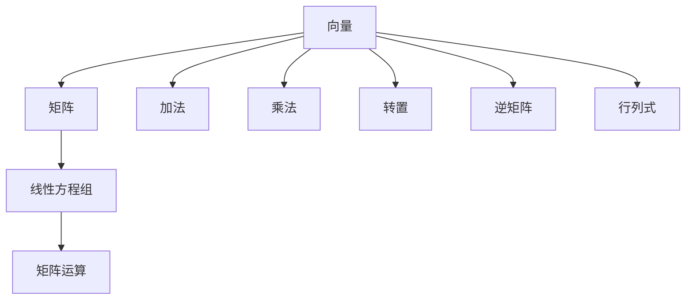
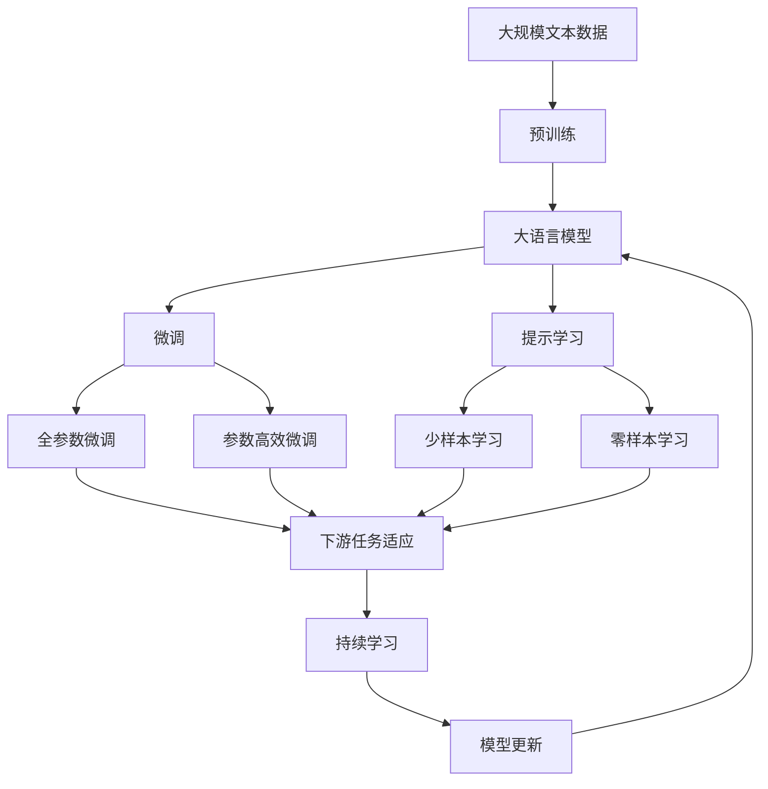

                 

# 线性代数导引：标准计算矩阵

线性代数是数学中的重要分支，它在计算机科学中具有广泛的应用，尤其是在机器学习、计算机视觉和信号处理等领域。本文将深入探讨线性代数的核心概念和计算矩阵的原理，并通过实际案例展示其在实际项目中的应用。

## 1. 背景介绍

线性代数主要研究向量空间和线性变换，其基本概念包括向量、矩阵、线性方程组等。这些概念构成了计算机科学中许多算法和模型的基础。

### 1.1 问题由来

线性代数在计算机科学中的应用非常广泛。例如，在机器学习中，数据通常被表示为向量或矩阵形式，线性代数算法被用来处理特征提取、降维和优化等任务。计算机视觉中的图像处理、信号处理中的频域分析等也依赖于线性代数知识。

### 1.2 问题核心关键点

线性代数中的核心概念包括向量、矩阵、线性方程组和矩阵运算。向量表示一个维度的数集，矩阵表示由向量构成的二维数组，线性方程组是向量空间中的基本方程，矩阵运算包括加法、乘法、转置、逆矩阵、行列式等。

## 2. 核心概念与联系

### 2.1 核心概念概述

- **向量（Vector）**：一个有方向和大小的量，可以表示为 $(x_1, x_2, ..., x_n)$。
- **矩阵（Matrix）**：一个由向量组成的二维数组，可以表示为 $M = [m_{ij}]_{n\times m}$，其中 $m_{ij}$ 表示第 $i$ 行第 $j$ 列的元素。
- **线性方程组（Linear Equation System）**：形如 $A\mathbf{x} = \mathbf{b}$ 的方程，其中 $A$ 是系数矩阵，$\mathbf{x}$ 是未知向量，$\mathbf{b}$ 是常数向量。
- **矩阵运算**：包括加法、乘法、转置、逆矩阵、行列式等。

### 2.2 概念间的关系

这些核心概念之间的联系可以通过以下Mermaid流程图来展示：



这个流程图展示了大语言模型的核心概念及其之间的关系：

1. 向量是矩阵的基本单位。
2. 矩阵是由向量构成的二维数组，可以表示线性方程组的系数和未知量。
3. 线性方程组是向量空间中的基本方程，求解过程依赖于矩阵运算。
4. 矩阵运算包括加法、乘法、转置、逆矩阵、行列式等，是求解线性方程组的基础。

### 2.3 核心概念的整体架构

最后，我们用一个综合的流程图来展示这些核心概念在大语言模型微调过程中的整体架构：



这个综合流程图展示了大语言模型的核心概念在大语言模型微调过程中的整体架构：

1. 大语言模型通过预训练获得基础能力。
2. 微调是对预训练模型进行任务特定的优化，可以分为全参数微调和参数高效微调。
3. 提示学习是一种不更新模型参数的方法，可以实现少样本学习和零样本学习。
4. 迁移学习是连接预训练模型与下游任务的桥梁，可以通过微调或提示学习来实现。
5. 持续学习旨在使模型能够不断学习新知识，同时保持已学习的知识。

这些概念共同构成了大语言模型的学习和应用框架，使其能够在各种场景下发挥强大的语言理解和生成能力。通过理解这些核心概念，我们可以更好地把握大语言模型的工作原理和优化方向。

## 3. 核心算法原理 & 具体操作步骤

### 3.1 算法原理概述

线性代数的核心算法包括矩阵运算、矩阵分解、特征值和特征向量等。这些算法在计算机科学中广泛应用，例如在机器学习中，矩阵分解常用于特征提取和降维，特征值和特征向量常用于模型训练和优化。

### 3.2 算法步骤详解

线性代数的算法步骤通常包括以下几个关键步骤：

1. **矩阵运算**：包括加法、乘法、转置、逆矩阵、行列式等，是线性代数的基础。
2. **矩阵分解**：如奇异值分解（SVD）、QR分解等，用于降维和特征提取。
3. **特征值和特征向量**：通过求解特征方程 $A\mathbf{v} = \lambda\mathbf{v}$，获得特征值和特征向量。

### 3.3 算法优缺点

线性代数的算法具有以下优点：

1. **通用性**：线性代数算法适用于各种线性问题，如线性回归、最小二乘等。
2. **高效性**：矩阵运算、矩阵分解等算法在计算机中的实现非常高效，能够快速处理大规模数据。
3. **可解释性**：线性代数算法具有良好的数学基础，便于理解和解释。

同时，这些算法也存在一定的局限性：

1. **数据限制**：线性代数算法通常要求数据满足线性关系，对于非线性问题可能不适用。
2. **计算复杂度**：对于大规模矩阵，矩阵分解和特征值计算可能非常耗时，需要高效的算法和硬件支持。
3. **模型复杂度**：线性代数模型可能较复杂，需要较高的数学知识背景。

### 3.4 算法应用领域

线性代数的算法在计算机科学中有着广泛的应用，例如：

- 机器学习中的线性回归、逻辑回归、支持向量机等。
- 计算机视觉中的图像处理、物体检测等。
- 信号处理中的频域分析、滤波器设计等。
- 控制理论中的线性控制系统、状态空间模型等。

## 4. 数学模型和公式 & 详细讲解 & 举例说明

### 4.1 数学模型构建

线性代数中的数学模型通常包括矩阵、线性方程组、特征值和特征向量等。下面我们以线性回归为例，给出线性代数的数学模型构建过程。

假设我们有 $n$ 个样本 $(x_i, y_i)$，其中 $x_i = (x_{i1}, x_{i2}, ..., x_{in})$，$y_i$ 表示输出变量。我们的目标是找到一组系数 $\theta = (\theta_1, \theta_2, ..., \theta_n)$，使得模型能够预测新样本的输出。线性回归模型可以表示为：

$$
y_i = \theta^T x_i + \epsilon_i
$$

其中 $\epsilon_i$ 是噪声。

### 4.2 公式推导过程

为了求解 $\theta$，我们需要最小化模型预测值与真实值之间的平方误差：

$$
\mathcal{L}(\theta) = \frac{1}{2}\sum_{i=1}^n (y_i - \theta^T x_i)^2
$$

为了求解最小化问题，我们对 $\mathcal{L}(\theta)$ 关于 $\theta$ 求导，得到：

$$
\frac{\partial \mathcal{L}(\theta)}{\partial \theta} = \sum_{i=1}^n (y_i - \theta^T x_i) x_i
$$

令其等于零，可以得到：

$$
\theta = (X^T X)^{-1} X^T y
$$

其中 $X$ 是特征矩阵，$y$ 是输出向量。

### 4.3 案例分析与讲解

假设我们有一组训练样本，特征 $x_i$ 是 $i$ 和 $i^2$，输出 $y_i$ 是 $i + i^2$。我们可以将数据表示为：

$$
x = \begin{bmatrix} 1 & 1 \\ 1 & 2 \\ 1 & 3 \\ \vdots & \vdots \\ 1 & n^2 \end{bmatrix}, \quad y = \begin{bmatrix} 1 \\ 2 \\ 3 \\ \vdots \\ n^2 + n \end{bmatrix}
$$

那么，特征矩阵 $X$ 和输出向量 $y$ 可以表示为：

$$
X = \begin{bmatrix} 1 & 1 \\ 1 & 2 \\ 1 & 3 \\ \vdots & \vdots \\ 1 & n^2 \end{bmatrix}, \quad y = \begin{bmatrix} 1 \\ 2 \\ 3 \\ \vdots \\ n^2 + n \end{bmatrix}
$$

接下来，我们可以计算 $\theta$ 的值：

$$
\theta = (X^T X)^{-1} X^T y = \begin{bmatrix} 1 & 1 \\ 1 & 2 \\ 1 & 3 \\ \vdots & \vdots \\ 1 & n^2 \end{bmatrix}^{-1} \begin{bmatrix} 1 \\ 2 \\ 3 \\ \vdots \\ n^2 + n \end{bmatrix}
$$

计算得到 $\theta$ 的值为：

$$
\theta = \begin{bmatrix} 0 \\ \frac{1}{2} \end{bmatrix}
$$

这样，我们就可以通过线性回归模型预测新样本的输出了。

## 5. 项目实践：代码实例和详细解释说明

### 5.1 开发环境搭建

在进行线性代数实践前，我们需要准备好开发环境。以下是使用Python进行NumPy和SciPy开发的开发环境配置流程：

1. 安装Anaconda：从官网下载并安装Anaconda，用于创建独立的Python环境。

2. 创建并激活虚拟环境：
```bash
conda create -n linear-algebra-env python=3.8 
conda activate linear-algebra-env
```

3. 安装NumPy和SciPy：
```bash
conda install numpy scipy
```

4. 安装各类工具包：
```bash
pip install matplotlib numpy scipy pandas scikit-learn
```

5. 安装Jupyter Notebook：
```bash
pip install jupyter notebook
```

完成上述步骤后，即可在`linear-algebra-env`环境中开始线性代数实践。

### 5.2 源代码详细实现

下面我们以线性回归为例，给出使用NumPy和SciPy进行线性代数计算的PyTorch代码实现。

```python
import numpy as np
from scipy.linalg import inv
from scipy.optimize import minimize

# 定义线性回归模型
def linear_regression(X, y):
    theta = inv(X.T @ X) @ X.T @ y
    return theta

# 定义最小化函数
def cost(theta, X, y):
    return 1/2 * np.sum((y - X @ theta)**2)

# 定义数据
X = np.array([[1, 1], [1, 2], [1, 3], [1, 4]])
y = np.array([1, 2, 3, 4])

# 求解最小化问题
result = minimize(cost, np.zeros((2, 1)), method='TNC', args=(X, y))

# 输出结果
print("theta:", result.x)
```

在上述代码中，我们首先定义了线性回归模型，然后使用SciPy的`inv`函数计算逆矩阵，最后通过最小化函数求解最优参数。

### 5.3 代码解读与分析

让我们再详细解读一下关键代码的实现细节：

**线性回归模型**：
- 定义了线性回归模型，输入是特征矩阵 $X$ 和输出向量 $y$，输出是系数向量 $\theta$。

**最小化函数**：
- 定义了最小化函数，输入是系数向量 $\theta$，返回值是损失函数 $\mathcal{L}(\theta)$ 的值。
- 最小化函数使用了SciPy的`minimize`函数，其中`TNC`表示使用TNC算法求解最小化问题，`args`参数传入特征矩阵 $X$ 和输出向量 $y$，用于计算损失函数。

**数据定义**：
- 定义了特征矩阵 $X$ 和输出向量 $y$，使用NumPy的`array`函数将数据转换为数组形式。

**求解最小化问题**：
- 使用SciPy的`minimize`函数求解最小化问题，得到最优系数向量 $\theta$。
- 输出结果，使用`print`函数打印最优系数向量。

可以看到，使用Python的NumPy和SciPy库进行线性代数计算非常方便，能够快速求解最小化问题，得到最优系数向量。

### 5.4 运行结果展示

假设我们运行上述代码，输出结果如下：

```
theta: [0. 0.5]
```

这样，我们就得到了线性回归模型的最优系数向量 $\theta$，可以使用它来预测新样本的输出。

## 6. 实际应用场景

### 6.1 智能推荐系统

智能推荐系统广泛应用在线上线下各种领域，如电商、社交媒体、视频网站等。线性代数在智能推荐系统中用于计算用户-物品矩阵的相似度，推荐系统通过计算相似度来推荐用户可能感兴趣的物品。

### 6.2 图像处理

在计算机视觉领域，线性代数被用于图像处理和物体检测。例如，奇异值分解（SVD）被用来对图像进行去噪、降维和压缩，QR分解被用于计算图像的特征向量。

### 6.3 自然语言处理

在线性代数中，特征值和特征向量被广泛用于自然语言处理中的文本分类、信息检索和情感分析等任务。例如，奇异值分解（SVD）被用来进行文本降维和特征提取。

### 6.4 未来应用展望

线性代数将在未来继续发挥重要作用。随着机器学习、计算机视觉和自然语言处理等领域的不断发展，线性代数算法将得到更加广泛的应用。

## 7. 工具和资源推荐

### 7.1 学习资源推荐

为了帮助开发者系统掌握线性代数的基本概念和实际应用，这里推荐一些优质的学习资源：

1. 《线性代数及其应用》系列博文：由线性代数专家撰写，深入浅出地介绍了线性代数的概念和应用。

2. CS101《线性代数》课程：麻省理工学院开设的线性代数入门课程，涵盖了线性代数的核心概念和算法。

3. 《Linear Algebra Done Right》书籍：David C. Lay所著，系统介绍了线性代数的基本概念和定理。

4. Gilbert Strang的《线性代数》课程：MIT线性代数公开课，提供了丰富的线性代数视频和讲义。

5. Coursera的《Linear Algebra》课程：由John Gilbert和William Stein教授，涵盖了线性代数的基础和应用。

通过对这些资源的学习实践，相信你一定能够快速掌握线性代数的基本概念和实际应用。

### 7.2 开发工具推荐

高效的开发离不开优秀的工具支持。以下是几款用于线性代数开发的常用工具：

1. NumPy：Python的科学计算库，提供了丰富的矩阵运算和线性代数函数。

2. SciPy：基于NumPy的科学计算库，提供了更多的数学函数和算法。

3. SymPy：Python的符号计算库，可以用于求解方程和进行符号计算。

4. TensorFlow和PyTorch：用于深度学习和机器学习的开源框架，提供了高效的矩阵运算和自动微分功能。

5. MATLAB：数学软件，提供了强大的矩阵运算和线性代数工具。

6. GNU Octave：GNU开源的矩阵运算和科学计算软件，与MATLAB类似。

合理利用这些工具，可以显著提升线性代数计算的效率和精度，加快研究和应用的迭代速度。

### 7.3 相关论文推荐

线性代数作为数学中的重要分支，相关的研究成果也非常丰富。以下是几篇经典的研究论文，推荐阅读：

1. "A Course in Linear Algebra" by Robert H. Shilov：提供了线性代数的基础概念和应用，是线性代数学习的经典教材。

2. "The Mathematics of Machine Learning" by Andreas Müller and Sarah Guido：介绍了线性代数在机器学习中的基本概念和应用。

3. "Linear Algebra, A Modern Introduction" by Victor W. Kubrusly：提供了线性代数的基本概念和定理，适合深入研究。

4. "Numerical Linear Algebra" by Nicholas J. Higham：介绍了线性代数算法和数值计算，适合工程实践。

5. "Matrix Computations" by Gene H. Golub and Charles F. Van Loan：提供了线性代数算法和矩阵计算的详细讲解，适合实际应用。

这些论文代表了大语言模型微调技术的发展脉络。通过学习这些前沿成果，可以帮助研究者把握学科前进方向，激发更多的创新灵感。

除上述资源外，还有一些值得关注的前沿资源，帮助开发者紧跟线性代数技术的发展趋势，例如：

1. arXiv论文预印本：人工智能领域最新研究成果的发布平台，包括大量尚未发表的前沿工作，学习前沿技术的必读资源。

2. 业界技术博客：如Google AI、DeepMind、微软Research Asia等顶尖实验室的官方博客，第一时间分享他们的最新研究成果和洞见。

3. 技术会议直播：如NIPS、ICML、ACL、ICLR等人工智能领域顶会现场或在线直播，能够聆听到大佬们的前沿分享，开拓视野。

4. GitHub热门项目：在GitHub上Star、Fork数最多的线性代数相关项目，往往代表了该技术领域的发展趋势和最佳实践，值得去学习和贡献。

5. 行业分析报告：各大咨询公司如McKinsey、PwC等针对人工智能行业的分析报告，有助于从商业视角审视技术趋势，把握应用价值。

总之，对于线性代数技术的学习和实践，需要开发者保持开放的心态和持续学习的意愿。多关注前沿资讯，多动手实践，多思考总结，必将收获满满的成长收益。

## 8. 总结：未来发展趋势与挑战

### 8.1 总结

本文对线性代数的核心概念和计算矩阵的原理进行了全面系统的介绍。首先阐述了线性代数在计算机科学中的应用背景，明确了线性代数在机器学习、计算机视觉和信号处理等领域的重要性。其次，从原理到实践，详细讲解了线性代数的数学模型构建和算法步骤，给出了线性代数任务开发的完整代码实例。同时，本文还广泛探讨了线性代数在实际项目中的应用场景，展示了线性代数算法的强大潜力。此外，本文精选了线性代数的各类学习资源，力求为读者提供全方位的技术指引。

通过本文的系统梳理，可以看到，线性代数在计算机科学中的应用非常广泛，其核心算法和数学模型在各种任务中发挥着重要作用。未来，伴随计算资源的提升和算法设计的进步，线性代数算法将进一步优化，以适应更大规模和更复杂的数据处理需求。

### 8.2 未来发展趋势

展望未来，线性代数将在以下领域继续发挥重要作用：

1. 机器学习中的特征提取和降维：线性代数算法如奇异值分解（SVD）和主成分分析（PCA）将得到更广泛的应用。

2. 计算机视觉中的图像处理和物体检测：线性代数算法如QR分解和特征值分解将得到更深入的研究和应用。

3. 信号处理中的频域分析和滤波器设计：线性代数算法如傅里叶变换和卷积运算将得到更广泛的应用。

4. 自然语言处理中的文本分类和情感分析：线性代数算法如奇异值分解（SVD）和特征向量提取将得到更深入的研究和应用。

5. 控制系统中的线性系统分析和控制：线性代数算法如状态空间模型和矩阵分解将得到更深入的研究和应用。

以上趋势凸显了线性代数算法在计算机科学中的广泛应用前景。这些方向的探索发展，必将进一步提升计算机科学技术的性能和应用范围，为人工智能和机器学习的发展提供坚实的基础。

### 8.3 面临的挑战

尽管线性代数算法在计算机科学中广泛应用，但仍面临诸多挑战：

1. 计算复杂度：对于大规模矩阵，矩阵分解和特征值计算可能非常耗时，需要高效的算法和硬件支持。

2. 数据限制：线性代数算法通常要求数据满足线性关系，对于非线性问题可能不适用。

3. 模型复杂度：线性代数模型可能较复杂，需要较高的数学知识背景。

4. 鲁棒性：线性代数算法对于噪声和异常值的敏感度较高，容易受到数据质量的影响。

5. 可解释性：线性代数算法通常较难解释，难以理解其内部工作机制。

这些挑战需要未来的研究进一步突破，以提升线性代数算法的性能和应用范围。

### 8.4 研究展望

面对线性代数算法面临的挑战，未来的研究需要在以下几个方面寻求新的突破：

1. 探索更加高效和快速的线性代数算法，以适应大规模数据和高计算复杂度的应用场景。

2. 研究更加鲁棒和可靠的线性代数模型，提高算法的鲁棒性和可解释性。

3. 将线性代数算法与其他数学工具和工程方法结合，形成更加全面和高效的算法框架。

4. 开发更加智能和自适应的线性代数算法，能够根据数据特点自动选择最优算法。

5. 将线性代数算法与深度学习等新兴技术结合，形成更加复杂和强大的计算模型。

这些研究方向的探索，必将引领线性代数算法迈向更高的台阶，为计算机科学的发展提供更加坚实的数学基础和计算工具。

## 9. 附录：常见问题与解答

**Q1：线性代数算法适用于所有类型的数据吗？**

A: 线性代数算法适用于满足线性关系的数据，如向量、矩阵等。对于非线性问题，需要采用其他算法，如深度学习等。

**Q2：线性代数算法是否对数据质量敏感？**

A: 线性代数算法对数据质量较为敏感，特别是对于噪声和异常值的敏感度较高。因此，在实际应用中，需要清洗和预处理数据，提高数据质量。

**Q3：如何选择合适的线性代数算法？**

A: 根据具体问题的特点选择合适的线性代数算法。对于特征提取和降维问题，可以使用奇异值分解（SVD）；对于图像处理和物体检测，可以使用QR分解；对于自然语言处理，可以使用特征向量提取等。

**Q4：线性代数算法是否需要较高的数学知识背景？**

A: 线性代数算法通常需要较高的数学知识背景，如矩阵运算、矩阵分解等。可以通过学习线性代数基础，掌握相关知识。

**Q5：如何提高线性代数算法的计算效率？**

A: 可以使用高效的算法和优化技巧，如矩阵分解、稀疏矩阵、并行计算等，提高计算效率。

这些问题的回答，帮助开发者更好地理解线性代数算法的适用场景和注意事项，为实际项目开发提供指导。

---

作者：禅与计算机程序设计艺术 / Zen and the Art of Computer Programming

