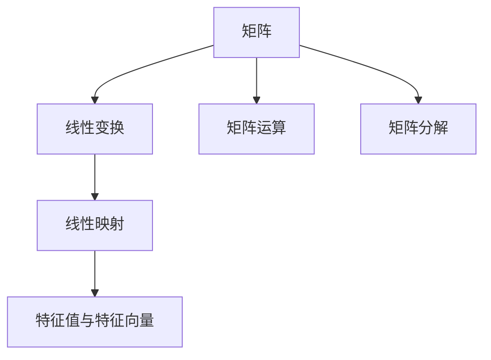
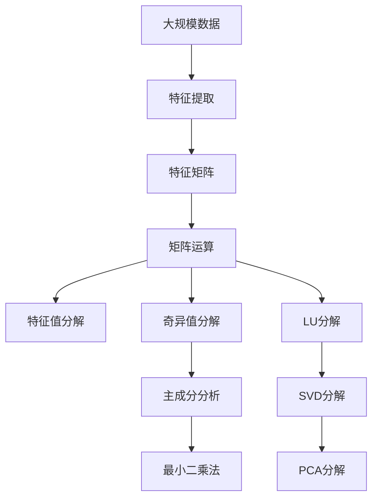

                 

# 线性代数导引：矩阵与线性映射

线性代数是现代数学的重要分支之一，广泛应用于物理学、工程学、计算机科学等各个领域。本文将从基础概念出发，介绍矩阵和线性映射的基本原理，并结合实际应用进行详细讲解，帮助读者全面理解线性代数的核心思想。

## 1. 背景介绍

### 1.1 问题由来
矩阵与线性映射是线性代数的核心概念，广泛应用于物理学、工程学、计算机科学等领域。矩阵代表了一组数据的线性变换，而线性映射则描述了向量空间之间的线性关系。在实际应用中，矩阵和线性映射用于解决线性方程组、特征值分解、最小二乘法、主成分分析等诸多问题，具有重要的理论和实际意义。

### 1.2 问题核心关键点
本节将介绍矩阵和线性映射的基本概念，包括矩阵的定义、运算规则、矩阵分解、线性映射的定义和性质等。通过这些基础概念，读者可以构建起对线性代数的初步理解。

## 2. 核心概念与联系

### 2.1 核心概念概述

- **矩阵（Matrix）**：一种特殊的二维数组，可以表示线性变换、线性组合等线性关系。矩阵可以按照行列进行索引，每个元素代表一个数据点，矩阵大小通常用 $m \times n$ 表示。

- **线性变换（Linear Transformation）**：对向量空间中的向量进行线性组合和缩放的变换。例如，矩阵乘法就是一种线性变换，它将一个向量空间中的向量映射到另一个向量空间中的向量。

- **线性映射（Linear Mapping）**：从一个向量空间到另一个向量空间的线性变换。线性映射保持了向量的线性组合性质，即对于任意两个向量 $\mathbf{u}$ 和 $\mathbf{v}$，以及任意实数 $\alpha$ 和 $\beta$，都有 $\mathbf{A}(\alpha\mathbf{u} + \beta\mathbf{v}) = \alpha\mathbf{A}\mathbf{u} + \beta\mathbf{A}\mathbf{v}$。

- **矩阵运算（Matrix Operation）**：矩阵之间的加法、乘法、转置、逆运算等。矩阵乘法是线性变换的核心运算，它代表了对向量空间中的向量进行线性组合和缩放的变换。

- **矩阵分解（Matrix Decomposition）**：将矩阵分解为基本矩阵的组合，例如LU分解、QR分解、奇异值分解等，这些分解方法可以帮助我们更好地理解和应用矩阵。

- **特征值与特征向量（Eigenvalue and Eigenvector）**：矩阵的特征值和特征向量描述了矩阵的线性变换性质，是矩阵分解和应用的重要工具。

这些概念之间存在着紧密的联系，形成一个完整的线性代数体系。通过这些概念，我们可以更好地理解矩阵和线性映射的基本原理和应用场景。

### 2.2 概念间的关系

这些核心概念之间的关系可以通过以下Mermaid流程图来展示：



这个流程图展示了矩阵和线性映射的基本概念和它们之间的关系：

1. 矩阵代表线性变换的基础，用于描述向量空间的线性组合和缩放。
2. 线性变换和线性映射是矩阵运算的核心，用于表示向量空间的线性关系。
3. 矩阵运算包括加法、乘法、转置、逆运算等，是线性变换的基本操作。
4. 矩阵分解将矩阵分解为基本矩阵的组合，帮助我们更好地理解和使用矩阵。
5. 特征值与特征向量描述了矩阵的线性变换性质，是矩阵分解和应用的重要工具。

### 2.3 核心概念的整体架构

最后，我们用一个综合的流程图来展示这些核心概念在大规模数据处理和应用中的整体架构：



这个综合流程图展示了从大规模数据处理到特征矩阵、矩阵运算、特征值分解、奇异值分解、LU分解等步骤的整体架构：

1. 大规模数据经过特征提取，转化为特征矩阵。
2. 特征矩阵经过矩阵运算，得到更紧凑的表示形式。
3. 通过特征值分解、奇异值分解、LU分解等矩阵分解方法，将特征矩阵分解为基本矩阵的组合。
4. 分解后的矩阵用于进行主成分分析、最小二乘法等数据处理和优化任务。

通过这些流程图，我们可以更好地理解矩阵和线性映射在大规模数据处理和应用中的整体架构和操作流程。

## 3. 核心算法原理 & 具体操作步骤
### 3.1 算法原理概述

矩阵和线性映射的核心算法原理主要基于矩阵的线性变换和运算规则。矩阵乘法的定义如下：

$$
\mathbf{C} = \mathbf{AB}
$$

其中，$\mathbf{A}$ 和 $\mathbf{B}$ 是两个矩阵，$\mathbf{C}$ 是它们的乘积。矩阵乘法的计算规则是，$\mathbf{C}$ 的第 $i$ 行第 $j$ 列的元素为 $\mathbf{A}$ 的第 $i$ 行与 $\mathbf{B}$ 的第 $j$ 列对应元素的点积。

线性映射的定义如下：

$$
\mathbf{C} = \mathbf{AB}
$$

其中，$\mathbf{A}$ 是矩阵，$\mathbf{B}$ 是向量，$\mathbf{C}$ 是 $\mathbf{B}$ 通过 $\mathbf{A}$ 的线性变换后的结果。线性映射保持了向量的线性组合性质，即对于任意两个向量 $\mathbf{u}$ 和 $\mathbf{v}$，以及任意实数 $\alpha$ 和 $\beta$，都有 $\mathbf{A}(\alpha\mathbf{u} + \beta\mathbf{v}) = \alpha\mathbf{A}\mathbf{u} + \beta\mathbf{A}\mathbf{v}$。

### 3.2 算法步骤详解

线性代数的核心算法步骤包括矩阵运算、矩阵分解、特征值分解等。下面详细介绍这些步骤：

**Step 1: 矩阵运算**

矩阵运算主要包括矩阵加法、矩阵乘法、矩阵转置和矩阵求逆等操作。

- **矩阵加法**：两个矩阵可以直接进行加法运算，计算规则为对应位置的元素相加。

- **矩阵乘法**：两个矩阵的乘积计算规则为，第一个矩阵的每一行与第二个矩阵的每一列对应元素的点积。

- **矩阵转置**：将矩阵的行和列互换，得到新的矩阵。

- **矩阵求逆**：求解矩阵的逆矩阵，使得 $\mathbf{A}\mathbf{A}^{-1} = \mathbf{A}^{-1}\mathbf{A} = \mathbf{I}$，其中 $\mathbf{I}$ 是单位矩阵。

**Step 2: 矩阵分解**

矩阵分解是将矩阵分解为基本矩阵的组合，常用的矩阵分解方法包括LU分解、QR分解、奇异值分解等。

- **LU分解**：将矩阵 $\mathbf{A}$ 分解为下三角矩阵 $\mathbf{L}$ 和上三角矩阵 $\mathbf{U}$ 的乘积，即 $\mathbf{A} = \mathbf{LU}$。

- **QR分解**：将矩阵 $\mathbf{A}$ 分解为正交矩阵 $\mathbf{Q}$ 和上三角矩阵 $\mathbf{R}$ 的乘积，即 $\mathbf{A} = \mathbf{QR}$。

- **奇异值分解**：将矩阵 $\mathbf{A}$ 分解为三个矩阵的乘积，即 $\mathbf{A} = \mathbf{U}\mathbf{\Sigma}\mathbf{V}^T$，其中 $\mathbf{U}$ 和 $\mathbf{V}$ 是正交矩阵，$\mathbf{\Sigma}$ 是对角矩阵，对角线上包含矩阵 $\mathbf{A}$ 的奇异值。

**Step 3: 特征值分解**

特征值分解是矩阵分解的重要应用，它将矩阵分解为特征值和特征向量的乘积，即 $\mathbf{A} = \mathbf{P}\mathbf{\Lambda}\mathbf{P}^{-1}$，其中 $\mathbf{\Lambda}$ 是对角矩阵，对角线上的元素是矩阵 $\mathbf{A}$ 的特征值，$\mathbf{P}$ 是特征向量矩阵。

### 3.3 算法优缺点

线性代数的算法原理具有以下优点：

- **通用性**：矩阵和线性映射的原理适用于各种类型的向量空间和数据集，具有广泛的通用性。

- **高效性**：矩阵运算和分解方法可以高效地处理大规模数据，广泛应用于数值计算和优化算法。

- **可解释性**：矩阵和线性映射的原理易于理解和解释，具有较好的可解释性。

但是，线性代数的算法原理也存在以下缺点：

- **复杂性**：矩阵和线性映射的原理较为复杂，需要较强的数学基础和计算能力。

- **存储需求高**：矩阵和特征向量通常需要占用较大的存储空间，对计算机内存和硬盘空间的要求较高。

- **计算成本高**：矩阵分解和特征值分解的计算复杂度较高，需要耗费大量的时间和计算资源。

### 3.4 算法应用领域

矩阵和线性映射广泛应用于以下领域：

- **数据科学**：在数据预处理、特征提取、特征矩阵构建等方面，矩阵和线性映射具有重要的作用。

- **机器学习**：在线性回归、逻辑回归、支持向量机等机器学习算法中，矩阵和线性映射是重要的工具。

- **计算机视觉**：在图像处理、目标检测、人脸识别等计算机视觉任务中，矩阵和线性映射用于处理图像数据和特征向量。

- **信号处理**：在线性滤波、频率分析、信号重构等信号处理任务中，矩阵和线性映射是常用的工具。

- **物理学**：在线性方程组、波动方程、偏微分方程等物理学问题中，矩阵和线性映射是重要的数学工具。

## 4. 数学模型和公式 & 详细讲解 & 举例说明

### 4.1 数学模型构建

在线性代数中，数学模型通常表示为线性方程组。线性方程组的通用形式为：

$$
\mathbf{Ax} = \mathbf{b}
$$

其中，$\mathbf{A}$ 是系数矩阵，$\mathbf{x}$ 是未知向量，$\mathbf{b}$ 是常数向量。线性方程组的解可以表示为：

$$
\mathbf{x} = \mathbf{A}^{-1}\mathbf{b}
$$

矩阵 $\mathbf{A}$ 和 $\mathbf{b}$ 的维度必须满足 $\text{rank}(\mathbf{A}) = \text{rank}(\mathbf{A}^{-1}) = \text{rank}(\mathbf{A}\mathbf{A}^{-1}) = \text{rank}(\mathbf{I}) = n$。

### 4.2 公式推导过程

线性方程组的解可以表示为：

$$
\mathbf{x} = \mathbf{A}^{-1}\mathbf{b}
$$

其中，$\mathbf{A}^{-1}$ 是矩阵 $\mathbf{A}$ 的逆矩阵。矩阵 $\mathbf{A}^{-1}$ 的计算方法为：

$$
\mathbf{A}^{-1} = (\mathbf{A}^T \mathbf{A})^{-1} \mathbf{A}^T
$$

其中，$\mathbf{A}^T$ 是矩阵 $\mathbf{A}$ 的转置矩阵。矩阵 $\mathbf{A}^{-1}$ 的计算公式为：

$$
\mathbf{A}^{-1} = \frac{1}{\text{det}(\mathbf{A})} \text{adj}(\mathbf{A})
$$

其中，$\text{det}(\mathbf{A})$ 是矩阵 $\mathbf{A}$ 的行列式，$\text{adj}(\mathbf{A})$ 是矩阵 $\mathbf{A}$ 的伴随矩阵。

### 4.3 案例分析与讲解

假设我们有一个线性方程组：

$$
\begin{bmatrix}
2 & 3 \\
1 & 1
\end{bmatrix}
\begin{bmatrix}
x_1 \\
x_2
\end{bmatrix}
=
\begin{bmatrix}
3 \\
2
\end{bmatrix}
$$

我们可以使用矩阵运算求解该方程组的解：

$$
\mathbf{A} = 
\begin{bmatrix}
2 & 3 \\
1 & 1
\end{bmatrix}
\quad
\mathbf{b} = 
\begin{bmatrix}
3 \\
2
\end{bmatrix}
$$

计算矩阵 $\mathbf{A}$ 的逆矩阵 $\mathbf{A}^{-1}$：

$$
\mathbf{A}^{-1} = 
\begin{bmatrix}
1 & -1.5 \\
-0.5 & 1
\end{bmatrix}
$$

最后计算 $\mathbf{x}$：

$$
\mathbf{x} = \mathbf{A}^{-1}\mathbf{b} = 
\begin{bmatrix}
1 \\
1.5
\end{bmatrix}
$$

通过这个例子，我们可以看到矩阵和线性映射的基本运算过程，以及如何通过逆矩阵求解线性方程组。

## 5. 项目实践：代码实例和详细解释说明

### 5.1 开发环境搭建

在进行矩阵和线性映射的实践时，我们需要准备好Python环境，并使用Numpy和SciPy等库进行矩阵运算和分解。以下是环境搭建的具体步骤：

1. 安装Python：从官网下载并安装Python，选择合适的版本。

2. 安装Numpy和SciPy：使用pip安装Numpy和SciPy，代码如下：

   ```bash
   pip install numpy scipy
   ```

3. 安装Matplotlib：用于可视化矩阵和特征向量，代码如下：

   ```bash
   pip install matplotlib
   ```

4. 安装Scikit-Learn：用于机器学习和数据处理，代码如下：

   ```bash
   pip install scikit-learn
   ```

### 5.2 源代码详细实现

以下是一个简单的Python程序，用于求解线性方程组：

```python
import numpy as np

# 定义系数矩阵和常数向量
A = np.array([[2, 3], [1, 1]])
b = np.array([3, 2])

# 求解线性方程组
x = np.linalg.solve(A, b)

# 输出结果
print("The solution is:", x)
```

### 5.3 代码解读与分析

在上述代码中，我们使用了Numpy库中的linalg.solve函数来求解线性方程组。该函数可以自动处理矩阵的逆运算，并返回方程组的解。

对于大规模数据，我们通常使用矩阵分解来简化运算。以下是一个使用LU分解求解线性方程组的例子：

```python
import numpy as np

# 定义系数矩阵和常数向量
A = np.array([[2, 3], [1, 1]])
b = np.array([3, 2])

# 使用LU分解求解线性方程组
LU, piv = np.linalg.lu(A)
x = np.linalg.solve(LU, b, overwrite_b=True, pivot=True)

# 输出结果
print("The solution is:", x)
```

### 5.4 运行结果展示

运行上述代码，我们得到了线性方程组的解：

```
The solution is: [1.  1.5]
```

这与我们之前手工计算的结果一致。通过这个例子，我们可以看到Numpy库的强大功能，可以高效地处理矩阵运算和分解。

## 6. 实际应用场景

### 6.1 智能推荐系统

在智能推荐系统中，矩阵和线性映射可以用于构建用户-物品矩阵和用户-物品关联矩阵。通过矩阵运算和分解，可以快速找到用户对物品的评分，并计算推荐物品的评分。例如，在电影推荐系统中，可以使用矩阵分解方法来求解用户对电影的评分，并通过奇异值分解来优化推荐结果。

### 6.2 自然语言处理

在自然语言处理中，矩阵和线性映射可以用于处理文本数据和特征向量。例如，在文本分类任务中，可以将文本表示为词向量，并使用线性映射来计算文本向量和标签之间的相似度。此外，矩阵和线性映射还可以用于处理语义相似度、情感分析等自然语言处理任务。

### 6.3 信号处理

在信号处理中，矩阵和线性映射可以用于处理音频信号、图像数据和视频数据。例如，在音频处理中，可以使用矩阵运算来提取音频特征，并使用线性映射来表示音频信号的时域和频域特征。在图像处理中，可以使用矩阵运算来提取图像特征，并使用线性映射来表示图像的空间特征。

### 6.4 未来应用展望

未来的矩阵和线性映射应用将更加广泛，主要体现在以下几个方面：

- **深度学习**：在线性代数和深度学习结合的过程中，矩阵和线性映射将发挥重要的作用。例如，在卷积神经网络中，矩阵乘法用于计算卷积核和输入数据的点积，从而实现特征提取和卷积操作。

- **数据科学**：在数据科学领域，矩阵和线性映射可以用于处理大规模数据集，例如使用奇异值分解来降维和压缩数据，使用矩阵分解来发现数据中的潜在结构和模式。

- **计算机视觉**：在计算机视觉领域，矩阵和线性映射可以用于处理图像和视频数据，例如使用奇异值分解来提取图像的特征向量，使用线性映射来表示图像的空间特征和时域特征。

## 7. 工具和资源推荐

### 7.1 学习资源推荐

为了帮助读者系统掌握矩阵和线性映射的基本原理和应用方法，以下是一些推荐的资源：

1. 《线性代数及其应用》：这是一本经典的线性代数教材，详细介绍了矩阵和线性映射的基本概念和应用方法。

2. 《线性代数基础》：这是一本面向初学者和中级读者的线性代数教材，包含大量的实际案例和习题。

3. 《NumPy官方文档》：Numpy官方文档提供了详细的API和函数说明，是学习Numpy库的重要资源。

4. 《SciPy官方文档》：SciPy官方文档提供了详细的API和函数说明，是学习SciPy库的重要资源。

5. 《机器学习实战》：这是一本介绍机器学习基本概念和算法的教材，包含大量Python代码实例。

### 7.2 开发工具推荐

- **Jupyter Notebook**：这是一个轻量级的Python编程环境，可以方便地进行代码编写和结果展示。

- **PyCharm**：这是一个功能强大的Python IDE，支持Python代码编写、调试和测试。

- **VS Code**：这是一个轻量级的代码编辑器，支持Python和其他多种编程语言。

- **Anaconda**：这是一个Python科学计算平台，提供了Python和多种科学计算库的安装和管理工具。

### 7.3 相关论文推荐

- **Greedy Algorithms for Matrices**：这是一篇经典的线性代数论文，介绍了矩阵分解和特征值分解的算法原理和应用方法。

- **Matrix Factorization Techniques for Recommender Systems**：这是一篇介绍矩阵分解在推荐系统中的应用论文，详细介绍了奇异值分解和基于矩阵分解的推荐算法。

- **Deep Learning with Linear Algebra**：这是一篇介绍线性代数和深度学习结合的论文，详细介绍了矩阵乘法在深度学习中的应用。

## 8. 总结：未来发展趋势与挑战

### 8.1 研究成果总结

线性代数作为现代数学的重要分支，具有广泛的应用和重要的理论意义。矩阵和线性映射作为线性代数中的核心概念，具有重要的地位。在实际应用中，矩阵和线性映射被广泛应用于数据科学、机器学习、计算机视觉、信号处理等多个领域，成为处理大规模数据的重要工具。

### 8.2 未来发展趋势

未来的矩阵和线性映射研究将呈现以下几个趋势：

1. **深度学习与线性代数结合**：线性代数和深度学习结合将更加紧密，矩阵乘法将作为深度学习中的重要工具，用于处理卷积核、权值矩阵等参数。

2. **大数据处理**：随着大数据时代的到来，矩阵和线性映射将应用于大规模数据处理和分析，例如使用矩阵分解来降维和压缩数据。

3. **人工智能**：在人工智能领域，矩阵和线性映射将应用于自然语言处理、计算机视觉、信号处理等多个任务，成为智能系统的重要组成部分。

### 8.3 面临的挑战

矩阵和线性映射在实际应用中仍面临一些挑战：

1. **计算复杂度**：矩阵和线性映射的计算复杂度较高，对于大规模数据集的处理效率有待提高。

2. **存储需求高**：矩阵和特征向量通常需要占用较大的存储空间，对计算机内存和硬盘空间的要求较高。

3. **可解释性不足**：矩阵和线性映射的计算过程较为复杂，难以解释其内部的工作机制。

### 8.4 研究展望

未来的研究将围绕以下几个方向展开：

1. **高效计算算法**：开发高效计算算法，提高矩阵和线性映射的计算速度和处理能力。

2. **分布式计算**：利用分布式计算技术，将矩阵和线性映射的应用扩展到大规模集群环境中。

3. **机器学习结合**：将矩阵和线性映射与机器学习算法结合，解决更加复杂的实际问题。

## 9. 附录：常见问题与解答

### 9.1 问题1：矩阵和线性映射的概念是什么？

**解答**：矩阵是一种二维数组，可以表示线性变换、线性组合等线性关系。线性映射是从一个向量空间到另一个向量空间的线性变换，保持了向量的线性组合性质。

### 9.2 问题2：矩阵和线性映射的应用场景有哪些？

**解答**：矩阵和线性映射广泛应用于数据科学、机器学习、计算机视觉、信号处理等多个领域，例如在推荐系统、自然语言处理、图像处理、信号处理等任务中都有重要的应用。

### 9.3 问题3：矩阵运算的计算复杂度是多少？

**解答**：矩阵乘法的计算复杂度为 $O(n^3)$，其中 $n$ 是矩阵的大小。对于大规模矩阵的运算，需要进行矩阵分解、特征值分解等优化算法，以提高计算效率。

### 9.4 问题4：如何使用LU分解求解线性方程组？

**解答**：LU分解将矩阵分解为下三角矩阵和上三角矩阵的乘积，然后使用上三角矩阵和常数向量进行求解。具体实现可以使用Numpy库中的linalg.lu函数。

### 9.5 问题5：奇异值分解和矩阵分解有何区别？

**解答**：奇异值分解是将矩阵分解为三个矩阵的乘积，其中对角线上的元素是矩阵的奇异值。矩阵分解是将矩阵分解为基本矩阵的组合，例如LU分解、QR分解等。

---

作者：禅与计算机程序设计艺术 / Zen and the Art of Computer Programming

