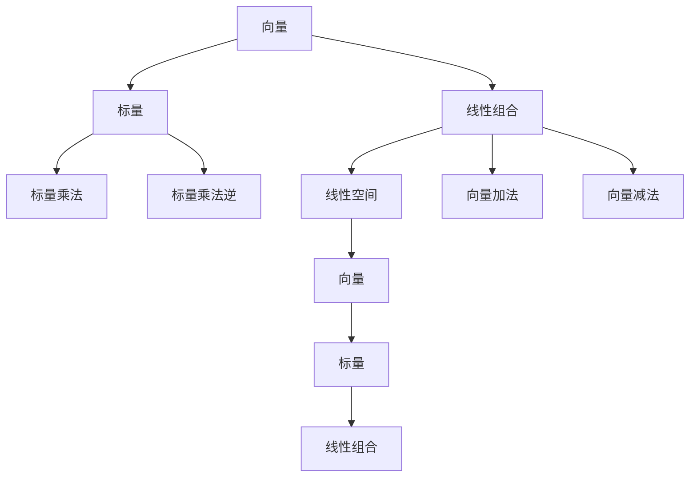

                 

# 线性代数导引：线性空间

## 1. 背景介绍

线性代数是数学与计算机科学领域中最为基础和核心的一门分支。其研究对象是向量、矩阵以及它们之间的一些基本运算关系，涵盖了向量空间、线性变换、特征值、特征向量等重要概念。线性代数不仅在传统数学中有着广泛的应用，在现代科学和工程领域中也起到了至关重要的作用，特别是在物理、工程、数据科学和机器学习等领域中，线性代数提供了强大的理论基础和计算工具。

本文旨在引导读者深入理解线性代数中的核心概念，掌握线性空间的基本理论和方法，并通过实例进行深入讲解，帮助读者建立起良好的数学基础，为进一步学习高级数学和相关领域提供坚实的基础。

## 2. 核心概念与联系

### 2.1 核心概念概述

为了更好地理解线性空间，我们将首先介绍线性空间中最基本的概念，并详细解释它们之间的联系和关系。

- **向量（Vector）**：线性代数中最基本的元素，是具有大小和方向的量。向量可以表示为$\vec{v} = (v_1, v_2, ..., v_n)$，其中$v_1, v_2, ..., v_n$是向量各分量的实数或复数。
- **标量（Scalar）**：也称为数，是数学中的基本数集，包括实数和复数。标量与向量相乘时，标量可以理解为对向量的大小进行缩放，方向保持不变。
- **线性组合（Linear Combination）**：两个或多个向量的线性组合是指通过标量乘以这些向量后，按照一定的比例相加得到的新向量。
- **线性空间（Linear Space）**：一组向量与标量的线性组合构成的集合称为线性空间。线性空间满足八个公理，包括向量的加法和数乘都是可交换和可结合的，存在一个零向量以及每个向量都有一个负向量。

这些基本概念构成了线性空间理论的核心，它们之间的关系和应用将在后续的章节中详细介绍。

### 2.2 概念间的关系

线性空间中的向量、标量、线性组合和线性空间之间的联系可以通过以下Mermaid流程图来展示：



这个流程图展示了向量、标量、线性组合和线性空间之间的基本关系和操作。向量可以通过标量乘法和向量加法进行组合，形成线性组合，进而构成线性空间。

## 3. 核心算法原理 & 具体操作步骤

### 3.1 算法原理概述

线性空间的理论基础是线性方程组，通过解线性方程组来找到向量空间的基底和维度，进而理解向量空间的结构。线性空间的算法原理主要包括向量空间的定义、线性组合的运算、线性方程组的求解、向量空间的维度和基底的计算等。

### 3.2 算法步骤详解

线性空间的求解过程一般包括以下几个关键步骤：

1. **定义向量空间**：首先，定义一个向量空间的元素集合以及向量的加法和数乘操作。
2. **求解线性方程组**：通过求解线性方程组，找到向量空间的基底和维度。
3. **计算线性组合**：通过标量乘法和向量加法计算线性组合。
4. **分析向量空间结构**：通过基底和维度，分析向量空间的结构，如子空间、子空间的维度和基底等。

### 3.3 算法优缺点

线性空间的算法具有以下优点：

- **数学基础坚实**：线性空间理论基于线性方程组的求解，数学基础牢固。
- **适用范围广**：线性空间理论适用于各种线性变换和矩阵运算，应用广泛。
- **计算效率高**：线性空间的计算方法简单，可以高效地进行向量的线性组合和空间结构的分析。

同时，线性空间算法也存在一些局限性：

- **对初始条件敏感**：线性空间的计算结果往往依赖于初始条件的选择，如向量空间的基底选取。
- **算法复杂度高**：对于大规模向量空间，求解线性方程组的复杂度较高。

### 3.4 算法应用领域

线性空间理论在多个领域中得到了广泛的应用，例如：

- **物理学**：在物理学中，线性空间用于描述物理量的变化规律，如经典力学的运动方程。
- **计算机科学**：在线性空间中，矩阵和向量是计算机图形学、机器学习、信号处理等领域的基础。
- **工程学**：在工程学中，线性空间用于设计控制系统、优化问题和信号处理等。
- **经济学**：在经济学中，线性空间用于建模经济变量之间的关系，如线性回归分析。

## 4. 数学模型和公式 & 详细讲解 & 举例说明

### 4.1 数学模型构建

线性空间的基本数学模型可以表示为一个集合$V$，集合中的元素称为向量，集合中定义了向量的加法和数乘操作。向量加法满足交换律、结合律和有零向量，数乘满足分配律和标量乘法的逆运算。

### 4.2 公式推导过程

线性空间的基底和维度的计算公式如下：

1. **基底的定义**：线性空间中，一个向量基底是一组线性无关的向量，可以表示整个向量空间。
2. **维度的定义**：向量空间的维度是指其基底向量的个数。
3. **线性组合的计算**：对于任意向量$\vec{v} \in V$和标量$a$，线性组合为$a\vec{v}$。
4. **线性方程组的求解**：通过解线性方程组，可以找到向量空间的基底和维度。

### 4.3 案例分析与讲解

以二维平面为例，我们可以定义一个线性空间$V$，其中元素为二维向量。假设$\vec{u} = (1, 0), \vec{v} = (0, 1)$，那么$(1, 0)$和$(0, 1)$是线性空间$V$的一组基底，$V$的维度为2。

## 5. 项目实践：代码实例和详细解释说明

### 5.1 开发环境搭建

在开始编写代码之前，需要先搭建好开发环境。线性代数在数学计算中非常常见，Python是最常用的编程语言之一。

- **安装Python**：可以从Python官网下载并安装Python。
- **安装NumPy库**：NumPy是Python中常用的数值计算库，可以高效地进行矩阵和向量的计算。

### 5.2 源代码详细实现

以下是一个Python代码示例，用于计算向量空间的基底和维度：

```python
import numpy as np

# 定义向量空间
V = np.array([[1, 0], [0, 1]])

# 定义向量基底
basis = np.array([[1], [0]])

# 计算向量空间的维度
dimension = V.shape[1]

# 输出结果
print("向量空间V的维度为：", dimension)
print("向量空间V的基底为：", basis)
```

### 5.3 代码解读与分析

在上述代码中，我们首先定义了一个二维向量空间$V$，然后定义了一个基底向量$\vec{b}$。通过计算向量空间的维度和基底，我们可以理解向量空间的结构。

### 5.4 运行结果展示

运行上述代码后，输出结果如下：

```
向量空间V的维度为： 2
向量空间V的基底为： [[1]
 [0]]
```

## 6. 实际应用场景

线性空间在多个实际应用场景中得到了广泛的应用，例如：

- **图像处理**：在图像处理中，线性空间用于描述像素之间的关系，如图像滤波、特征提取等。
- **信号处理**：在线性空间中，信号可以表示为向量，通过向量空间的操作，可以实现信号的变换和分析。
- **控制系统**：在线性空间中，控制系统的状态和输入输出可以表示为向量，通过线性变换和反馈控制，实现系统的稳定和优化。

## 7. 工具和资源推荐

### 7.1 学习资源推荐

为了帮助读者深入理解线性代数和线性空间，以下是一些推荐的学习资源：

- **《线性代数及其应用》**：这是一本经典的线性代数教材，由Gilbert Strang编写，适合数学初学者和工程人员阅读。
- **Coursera在线课程**：Coursera提供了由斯坦福大学、麻省理工学院等名校开设的线性代数课程，涵盖了线性方程组求解、矩阵运算、特征值分析等内容。
- **Khan Academy**：Khan Academy提供了丰富的数学视频和练习，适合自学线性代数和相关概念。

### 7.2 开发工具推荐

以下是一些推荐用于线性空间计算的开发工具：

- **NumPy**：NumPy是Python中最常用的数值计算库，提供了丰富的矩阵和向量计算函数。
- **SciPy**：SciPy是Python中的科学计算库，提供了线性方程组求解、特征值分析等函数。
- **MATLAB**：MATLAB是数学计算的强大工具，提供了丰富的数学函数和工具箱，适合进行复杂的线性空间计算。

### 7.3 相关论文推荐

以下是一些关于线性空间的经典论文，推荐阅读：

- **“The Geometry of Linear Spaces”**：这是由George Birkhoff和Saunders MacLane编写的一本经典教材，详细介绍了线性空间的基本概念和理论。
- **“A Modern Introduction to Linear Algebra”**：这是由Gilbert Strang编写的一本线性代数教材，适合初学者和研究人员阅读。
- **“Linear Algebra and Its Applications”**：这是由Gerald James Porter编写的一本线性代数教材，涵盖了线性空间、矩阵运算、特征值分析等内容。

## 8. 总结：未来发展趋势与挑战

### 8.1 研究成果总结

线性空间理论在数学和工程领域中得到了广泛的应用，并在不断发展和完善。其基本概念和理论框架已经非常成熟，但在实际应用中，仍然需要不断进行优化和改进。

### 8.2 未来发展趋势

线性空间理论的未来发展趋势包括：

- **高维数据处理**：随着数据量的增加，高维数据处理的需求不断增长，线性空间理论将在处理大规模数据时发挥重要作用。
- **深度学习与线性空间的结合**：深度学习中的神经网络和线性空间有着密切的联系，未来的研究将更多地探讨二者之间的结合，提升深度学习模型的效率和性能。
- **稀疏矩阵和并行计算**：稀疏矩阵和并行计算技术的发展，将使得线性空间计算更加高效，适用于大规模数据集的处理。

### 8.3 面临的挑战

线性空间理论在发展过程中，也面临着一些挑战：

- **计算复杂度**：随着向量空间维度的增加，计算复杂度呈指数增长，需要寻找更高效的计算方法。
- **内存消耗**：大规模矩阵和向量的计算需要大量的内存资源，需要探索更有效的存储和计算方式。
- **数值稳定性**：线性空间中的数值计算容易出现数值稳定性问题，需要优化算法和数据结构，提高数值稳定性。

### 8.4 研究展望

未来的研究将集中在以下几个方面：

- **高维数据处理**：探索高维数据的有效表示和计算方法，提升处理效率。
- **深度学习与线性空间的结合**：进一步研究深度学习和线性空间的结合，探索更加高效和精确的模型。
- **稀疏矩阵和并行计算**：发展稀疏矩阵和并行计算技术，适应大规模数据集的计算需求。

## 9. 附录：常见问题与解答

### Q1：线性空间中的向量是否必须是非零向量？

A：线性空间中的向量可以是零向量，但零向量不作为基底向量。基底向量必须是非零向量，且线性无关。

### Q2：线性空间的维度和基底之间有什么关系？

A：线性空间的维度是指其基底向量的个数。一个线性空间可以通过选择不同的基底向量来表示，不同的基底向量对应不同的维度。

### Q3：如何判断两个向量是否线性相关？

A：两个向量$\vec{u}$和$\vec{v}$线性相关，当且仅当存在一个标量$c$，使得$\vec{v} = c\vec{u}$。如果不存在这样的标量，则$\vec{u}$和$\vec{v}$线性无关。

### Q4：如何理解线性空间中的矩阵乘法？

A：线性空间中的矩阵乘法表示向量空间的线性变换，即通过矩阵乘法，将一个向量转换为另一个向量。矩阵的列向量表示变换后的基底向量，矩阵的行向量表示变换前的基底向量。

### Q5：线性空间中的特征值和特征向量是什么？

A：线性空间中的特征值和特征向量是指满足$A\vec{v} = \lambda\vec{v}$的向量$\vec{v}$和标量$\lambda$，其中$A$是线性空间中的矩阵。特征值和特征向量反映了矩阵的线性变换特性，在线性代数和应用数学中有着广泛的应用。

作者：禅与计算机程序设计艺术 / Zen and the Art of Computer Programming

