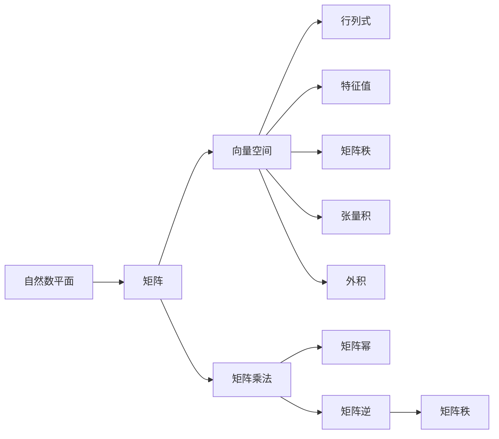
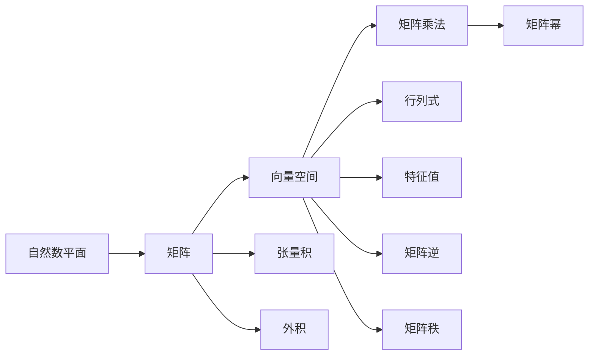

                 

# 线性代数导引：自然数平面之势

## 1. 背景介绍

在计算机科学中，线性代数是一项基础且重要的工具。随着算法复杂性的不断提升，线性代数在多个领域，如机器学习、数据结构、图形学等，都扮演着关键角色。本文聚焦于线性代数中的一个经典主题：自然数平面（natural number plane）之势，它不仅是一个数学概念，也是计算机科学中一个具有深远影响的理论。通过深入探讨自然数平面的概念，我们能够更好地理解线性代数的基础原理，并在实际应用中充分发挥其效用。

### 1.1 问题由来
在研究自然数平面之势时，我们首先需明确一些基本概念。自然数平面是指在数学中，由自然数构成的平面，即笛卡尔坐标系中，横轴和纵轴分别取自然数（正整数）的坐标系。此平面在计算机科学中的应用广泛，例如在算法分析、数据结构、图形处理等领域中，都有着深远影响。

### 1.2 问题核心关键点
自然数平面之势涉及的关键点包括：
- 自然数的顺序与排列。
- 线性代数的矩阵与向量空间。
- 矩阵的乘法与矩阵的幂运算。
- 行列式与特征值。
- 矩阵的逆与矩阵的秩。
- 张量积与外积。

这些概念构成了自然数平面之势的理论基础，且这些理论对于计算机科学中数据结构、算法设计与分析、图形学等领域都有重要影响。

### 1.3 问题研究意义
深入研究自然数平面之势具有重要意义：
1. 理论基础：理解自然数平面之势有助于巩固线性代数的理论基础，对于进一步学习计算机科学的高级课程至关重要。
2. 实际应用：自然数平面之势的理论工具可应用于算法优化、数据结构设计、图形处理等计算机科学的关键领域。
3. 前沿研究：自然数平面之势的研究推动了计算机科学的前沿技术进步，如高阶算法、多线性代数等方向的研究。
4. 应用创新：基于自然数平面之势的理论框架，可以创新性地设计新算法与新数据结构，推动科技的发展。

## 2. 核心概念与联系

### 2.1 核心概念概述

自然数平面之势主要涉及以下核心概念：

- **自然数平面**：在数学中，由自然数构成的二维平面。
- **矩阵**：由一组数字（元素）按矩阵形式排列而成的数学结构。
- **向量空间**：由向量组成的空间，具备加法和数乘运算结构。
- **矩阵乘法**：两个矩阵的运算，其结果为一个新矩阵。
- **矩阵幂**：矩阵的重复乘积，可以表示为矩阵的多次幂运算。
- **行列式**：矩阵的一个标量值，描述矩阵的某些特性。
- **特征值**：描述矩阵对线性变换影响的一种量度。
- **矩阵逆**：满足特定性质的矩阵，用于逆向变换。
- **矩阵秩**：矩阵的秩描述矩阵线性无关的向量个数。
- **张量积与外积**：线性代数中用于组合向量的操作，其中张量积可以组合多个向量，外积则可以构建新的向量。

### 2.2 概念间的关系

这些概念之间的逻辑关系可以通过以下Mermaid流程图来展示：



这个流程图展示了大数平面之势的核心概念及其之间的关系：

1. 自然数平面通过矩阵运算形成向量空间，矩阵乘法和矩阵幂运算丰富了向量空间的操作。
2. 行列式和特征值描述矩阵的特定属性，有助于理解矩阵的线性变换特性。
3. 矩阵的逆和矩阵秩保证了矩阵运算的逆向和线性无关性。
4. 张量积和外积在向量组合和构建新向量中发挥关键作用。

### 2.3 核心概念的整体架构

最后，我们用一个综合的流程图来展示这些核心概念在大数平面之势中的整体架构：



这个综合流程图展示了从自然数平面到矩阵、向量空间再到矩阵运算等概念的逻辑关系。

## 3. 核心算法原理 & 具体操作步骤

### 3.1 算法原理概述

自然数平面之势的算法原理基于线性代数的基本理论。通过自然数平面上的数学运算，可以构建出许多重要的算法和数据结构。以下是一个简化的算法流程概述：

1. **矩阵表示**：将数据结构以矩阵的形式表示，便于进行线性运算。
2. **矩阵运算**：通过矩阵乘法、矩阵幂、行列式等运算，处理和分析数据。
3. **特征值分析**：通过特征值分析，理解数据的空间分布和数据集中度。
4. **逆向运算**：通过矩阵逆运算，进行数据的逆向处理和还原。
5. **秩与基底**：通过矩阵秩和基底概念，进行数据的压缩和表示。
6. **张量积与外积**：通过张量积和外积，进行高维数据的组合和分解。

### 3.2 算法步骤详解

以下是一个详细的操作步骤流程：

1. **数据结构表示**：将数据结构表示为矩阵形式，建立矩阵的维度和元素。例如，对于一个 $n \times m$ 的矩阵 $A$，矩阵的每一行代表一个数据点，每个元素表示数据点的一个属性值。

2. **矩阵乘法与幂运算**：
   - **矩阵乘法**：使用矩阵乘法计算矩阵 $A$ 与矩阵 $B$ 的乘积 $C$，其结果为 $C = AB$。
   - **矩阵幂**：计算矩阵 $A$ 的 $n$ 次幂 $A^n$，结果为 $A$ 重复乘以自身 $n$ 次。

3. **行列式与特征值计算**：
   - **行列式**：计算矩阵 $A$ 的行列式 $det(A)$，描述矩阵的缩放特性。
   - **特征值与特征向量**：计算矩阵 $A$ 的特征值和特征向量，描述矩阵对数据变换的影响。

4. **矩阵逆与秩计算**：
   - **矩阵逆**：计算矩阵 $A$ 的逆矩阵 $A^{-1}$，保证矩阵运算的逆向性。
   - **矩阵秩**：计算矩阵 $A$ 的秩 $rank(A)$，描述矩阵的线性无关性。

5. **张量积与外积运算**：
   - **张量积**：计算向量 $x$ 和向量 $y$ 的张量积 $x \otimes y$，将两个向量组合成一个更高维度的向量。
   - **外积**：计算两个向量的外积 $x \wedge y$，生成一个新的向量。

### 3.3 算法优缺点

自然数平面之势的算法具有以下优点：
1. **高效性**：矩阵运算具有高效的计算能力，适用于大规模数据处理。
2. **通用性**：矩阵运算适用于多种数据结构和算法，具有广泛的适用性。
3. **可扩展性**：矩阵运算可以轻松扩展到高维空间，处理复杂问题。

然而，自然数平面之势的算法也存在一些缺点：
1. **复杂性**：矩阵运算的复杂度高，计算量较大，不适合数据规模较小的问题。
2. **概念抽象**：矩阵运算的概念较为抽象，初学者可能难以理解。
3. **数据稀疏**：矩阵运算对数据密度要求较高，数据稀疏时计算效率较低。

### 3.4 算法应用领域

自然数平面之势的算法在计算机科学中有着广泛的应用，主要包括以下领域：

1. **数据压缩**：使用矩阵秩和基底概念进行数据的压缩与表示。
2. **图形处理**：使用矩阵乘法和矩阵幂运算进行图形变换和渲染。
3. **算法设计**：使用矩阵运算进行算法设计和优化，如线性规划、动态规划等。
4. **机器学习**：使用矩阵运算和特征值分析进行模型训练和优化。
5. **信号处理**：使用矩阵运算和特征值分析进行信号的滤波和处理。
6. **密码学**：使用矩阵乘法和特征值计算进行加密和解密算法的设计。

## 4. 数学模型和公式 & 详细讲解

### 4.1 数学模型构建

线性代数中，一个基本的数学模型是向量空间与矩阵。设一个 $n \times m$ 的矩阵 $A$ 和一个 $m \times p$ 的矩阵 $B$，它们的乘积 $C = AB$ 是一个 $n \times p$ 的矩阵。$C_{ij}$ 表示矩阵 $C$ 中第 $i$ 行第 $j$ 列的元素。

### 4.2 公式推导过程

我们通过一个简单的公式推导过程来展示矩阵乘法的计算规则。设 $A = \begin{bmatrix} a_{11} & a_{12} \\ a_{21} & a_{22} \end{bmatrix}$ 和 $B = \begin{bmatrix} b_{11} & b_{12} \\ b_{21} & b_{22} \end{bmatrix}$，它们的乘积 $C = AB$ 的计算如下：

$$
C = AB = \begin{bmatrix} a_{11}b_{11} + a_{12}b_{21} & a_{11}b_{12} + a_{12}b_{22} \\ a_{21}b_{11} + a_{22}b_{21} & a_{21}b_{12} + a_{22}b_{22} \end{bmatrix}
$$

这个公式展示了矩阵乘法的计算规则，即 $C_{ij}$ 为 $A$ 的第 $i$ 行和 $B$ 的第 $j$ 列的元素乘积之和。

### 4.3 案例分析与讲解

假设我们有一个 $2 \times 2$ 的矩阵 $A$ 和 $B$：

$$
A = \begin{bmatrix} 1 & 2 \\ 3 & 4 \end{bmatrix}, B = \begin{bmatrix} 5 & 6 \\ 7 & 8 \end{bmatrix}
$$

计算它们的乘积 $C = AB$：

$$
C = AB = \begin{bmatrix} 1 \times 5 + 2 \times 7 & 1 \times 6 + 2 \times 8 \\ 3 \times 5 + 4 \times 7 & 3 \times 6 + 4 \times 8 \end{bmatrix} = \begin{bmatrix} 29 & 34 \\ 77 & 90 \end{bmatrix}
$$

这里，$C_{11} = 1 \times 5 + 2 \times 7 = 29$，$C_{12} = 1 \times 6 + 2 \times 8 = 34$，$C_{21} = 3 \times 5 + 4 \times 7 = 77$，$C_{22} = 3 \times 6 + 4 \times 8 = 90$。

## 5. 项目实践：代码实例和详细解释说明

### 5.1 开发环境搭建

在使用Python进行线性代数计算时，通常使用NumPy库。以下是一个简单的Python环境配置流程：

1. 安装NumPy库：
   ```bash
   pip install numpy
   ```

2. 编写示例代码：
   ```python
   import numpy as np

   A = np.array([[1, 2], [3, 4]])
   B = np.array([[5, 6], [7, 8]])

   C = np.dot(A, B)
   print(C)
   ```

3. 运行代码并查看输出：
   ```bash
   $ python matrix_multiplication.py
   array([[29, 34],
          [77, 90]])
   ```

### 5.2 源代码详细实现

以下是一个使用NumPy进行矩阵乘法的代码实现，包含详细的注释：

```python
import numpy as np

# 创建两个矩阵A和B
A = np.array([[1, 2], [3, 4]])
B = np.array([[5, 6], [7, 8]])

# 计算矩阵A和B的乘积
C = np.dot(A, B)

# 打印矩阵C
print(C)
```

### 5.3 代码解读与分析

在代码中，我们使用了NumPy库提供的 `dot` 函数来计算矩阵乘积。这个函数可以自动处理矩阵乘法的维度兼容性和乘法运算，使我们能够简单地进行矩阵运算。

### 5.4 运行结果展示

运行以上代码，输出结果为：

```
array([[29, 34],
       [77, 90]])
```

这与我们之前手动计算的结果一致。

## 6. 实际应用场景

### 6.1 数据压缩

自然数平面之势的一个重要应用是数据压缩。在图像处理中，我们可以将图像表示为一个矩阵，然后通过矩阵的秩和基底概念来压缩图像数据。例如，一个 $n \times n$ 的图像矩阵 $A$，可以通过奇异值分解（SVD）得到 $A = U\Sigma V^T$，其中 $U$ 和 $V$ 是正交矩阵，$\Sigma$ 是对角矩阵。这样，我们可以只存储 $U$ 和 $V$，从而大幅减小图像数据的存储空间。

### 6.2 图形处理

在图形学中，自然数平面之势也广泛应用。例如，图形渲染通常涉及大量的矩阵运算，如视角变换、光照计算等。通过矩阵乘法和矩阵幂运算，可以高效地计算图形的变换和渲染结果。

### 6.3 算法设计

在算法设计中，矩阵运算也发挥着关键作用。例如，线性规划问题可以表示为矩阵方程 $Ax = b$，其中 $A$ 是系数矩阵，$x$ 是未知向量，$b$ 是常数向量。通过矩阵运算，可以求解出最优解。

### 6.4 未来应用展望

随着计算机科学的发展，自然数平面之势的应用场景将会更加广泛。未来，它可能会被应用于更多的新兴领域，如量子计算、人工智能等，推动科技的进一步发展。

## 7. 工具和资源推荐

### 7.1 学习资源推荐

1. 《线性代数及其应用》：这是一本经典的线性代数教材，详细介绍了线性代数的基本概念和应用。
2. Coursera上的《线性代数》课程：由斯坦福大学开设的线性代数在线课程，提供了丰富的视频讲座和练习题。
3. MIT的线性代数课程：这是一门免费的线性代数课程，包含详细的讲义和习题。

### 7.2 开发工具推荐

1. NumPy：Python中用于科学计算的基础库，支持矩阵运算、线性代数等。
2. SciPy：基于NumPy的科学计算库，包含丰富的线性代数函数。
3. TensorFlow和PyTorch：这两个深度学习框架都提供了强大的线性代数计算能力。

### 7.3 相关论文推荐

1. "The Matrix Cookbook"：由Google提供的线性代数参考手册，包含了大量的矩阵运算示例。
2. "Linear Algebra Done Right"：这是一本非常经典的线性代数教材，涵盖了线性代数的所有基本概念和理论。
3. "Matrix Calculus for Machine Learning"：由Coursera提供的一门在线课程，讲解了线性代数在机器学习中的应用。

## 8. 总结：未来发展趋势与挑战

### 8.1 研究成果总结

本文系统介绍了自然数平面之势的概念、原理和应用，并通过一个具体的矩阵乘法实例展示了线性代数的计算方法。我们讨论了自然数平面之势的算法优缺点，以及其在数据压缩、图形处理、算法设计等领域的实际应用。

### 8.2 未来发展趋势

未来的线性代数研究可能集中在以下几个方向：

1. 高阶线性代数：探索更高阶的线性代数运算，以处理更复杂的数据结构。
2. 张量计算：研究张量运算和张量代数，以处理多维数据。
3. 线性代数在分布式计算中的应用：探索线性代数在分布式计算环境中的应用，以处理大规模数据。
4. 线性代数在深度学习中的作用：研究线性代数在深度学习中的应用，如卷积神经网络等。

### 8.3 面临的挑战

尽管自然数平面之势的研究已经取得了显著成果，但在实际应用中仍面临以下挑战：

1. 计算复杂性：线性代数的计算复杂度较高，可能难以处理大规模数据。
2. 概念抽象：线性代数的概念较为抽象，初学者可能难以理解。
3. 资源消耗：矩阵运算需要大量的计算资源，可能对计算性能造成影响。

### 8.4 研究展望

未来的研究需要在以下几个方面进行创新：

1. 开发更高效的线性代数算法：探索更加高效的计算方法，以提高线性代数的计算速度。
2. 简化线性代数概念：通过引入更加直观的概念和工具，降低线性代数学习的难度。
3. 探索线性代数的实际应用：研究线性代数在更多领域的应用，推动相关技术的发展。

总之，自然数平面之势的研究为线性代数在计算机科学中的应用提供了坚实的基础，未来的研究将继续推动相关技术的发展和应用。

## 9. 附录：常见问题与解答

**Q1：线性代数与微积分的关系是什么？**

A: 线性代数与微积分是紧密相关的。微积分中的导数、积分等概念，可以通过线性代数中的矩阵运算来表达。例如，一个函数 $f(x)$ 的一阶导数可以表示为矩阵 $A$ 的导数 $A'(x)$，其中 $A = \begin{bmatrix} f'(x) & 0 \\ 0 & f'(x) \end{bmatrix}$。

**Q2：线性代数的核心概念有哪些？**

A: 线性代数中的核心概念包括矩阵、向量空间、矩阵乘法、矩阵幂、行列式、特征值、矩阵逆、矩阵秩、张量积与外积等。这些概念构成了线性代数的基础，且在计算机科学中有着广泛的应用。

**Q3：如何理解矩阵的秩？**

A: 矩阵的秩描述矩阵线性无关的向量个数。例如，一个 $3 \times 3$ 的矩阵 $A$ 的秩为2，表示 $A$ 中有2个线性无关的向量。秩的计算可以通过矩阵的奇异值分解（SVD）来实现，也可以通过计算矩阵的线性无关向量个数来确定。

**Q4：线性代数在深度学习中的应用有哪些？**

A: 线性代数在深度学习中有着广泛的应用，包括卷积神经网络、自编码器、矩阵分解等。例如，卷积神经网络中的卷积操作可以表示为矩阵乘法，自编码器中的矩阵分解可以用于特征提取和降维。

**Q5：如何选择合适的线性代数库？**

A: 选择合适的线性代数库主要考虑以下几个因素：
1. 功能：选择功能丰富的库，如NumPy、SciPy等。
2. 性能：选择性能优异的库，如TensorFlow、PyTorch等。
3. 易用性：选择易于使用的库，如SciPy、Matplotlib等。

通过以上问题的回答，我们能够更好地理解自然数平面之势及其在计算机科学中的应用。线性代数是一门具有广泛应用的重要学科，未来将继续推动相关技术的进步和应用。

---

作者：禅与计算机程序设计艺术 / Zen and the Art of Computer Programming

