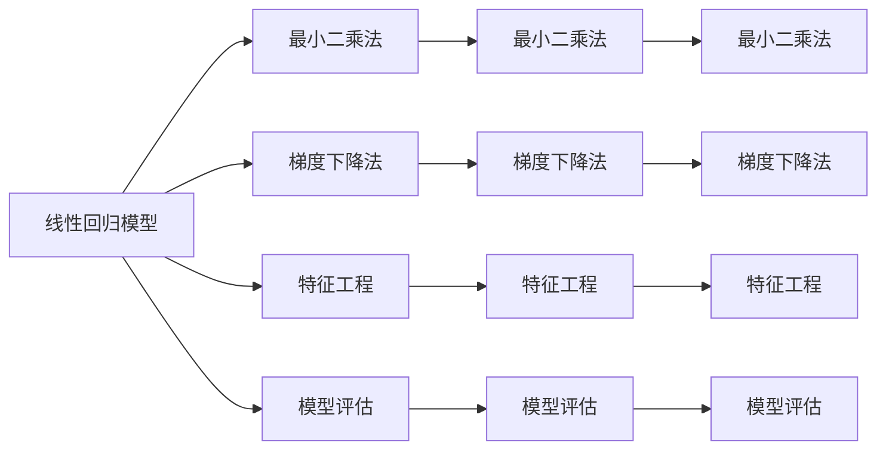

                 

# 线性回归(Linear Regression) - 原理与代码实例讲解

> 关键词：线性回归,最小二乘法,梯度下降法,特征工程,模型评估,Python代码实例,实际应用场景

## 1. 背景介绍

线性回归是一种常用的机器学习算法，用于建立输入变量与输出变量之间的线性关系模型。它的基本思想是通过拟合一条直线，将输入数据映射到输出数据，以预测未知数据点的输出值。线性回归广泛应用于经济学、金融学、物理学、工程学等多个领域，用于分析数据、预测趋势和识别关系。

## 2. 核心概念与联系

### 2.1 核心概念概述

为了更好地理解线性回归的原理与实现，本节将介绍几个关键概念：

- **线性回归模型**：表示输入变量与输出变量之间的线性关系，通常形式为 $y = wx + b$，其中 $w$ 是权向量，$b$ 是偏置项。
- **最小二乘法**：通过最小化误差平方和，拟合最佳直线。
- **梯度下降法**：一种迭代优化算法，用于求解线性回归模型中的参数 $w$ 和 $b$。
- **特征工程**：通过选择、构造、变换输入特征，优化模型性能。
- **模型评估**：使用各种指标（如均方误差、决定系数）评估模型的预测精度和泛化能力。
- **Python代码实例**：通过实际代码演示，展示线性回归模型的构建和训练过程。
- **实际应用场景**：线性回归在金融预测、房价预测、销售预测、股票价格预测等多个场景中得到了广泛应用。

### 2.2 概念间的关系

这些概念之间的关系可以通过以下Mermaid流程图来展示：



这个流程图展示了线性回归模型的各个关键组成部分以及它们之间的关系：

1. 线性回归模型是整个框架的基础，通过最小二乘法和梯度下降法进行拟合和优化。
2. 特征工程用于提取和构造输入特征，优化模型性能。
3. 模型评估用于评估模型的预测精度和泛化能力。
4. 最小二乘法、梯度下降法和特征工程是实现线性回归模型的核心技术手段。
5. 模型评估指标如均方误差和决定系数是衡量模型性能的关键指标。

## 3. 核心算法原理 & 具体操作步骤

### 3.1 算法原理概述

线性回归模型的目标是通过拟合一条直线，使得输入变量与输出变量之间的误差最小化。最小二乘法是线性回归中最常用的方法，通过最小化误差平方和，求解最佳的拟合直线。梯度下降法是一种迭代优化算法，用于求解线性回归模型中的参数 $w$ 和 $b$。

数学公式如下：

$$
\min_{w,b} \sum_{i=1}^n (y_i - wx_i - b)^2
$$

其中，$n$ 是样本数量，$y_i$ 是第 $i$ 个样本的输出值，$x_i$ 是第 $i$ 个样本的输入特征向量，$w$ 和 $b$ 是需要求解的参数。

### 3.2 算法步骤详解

线性回归的实现过程可以分为以下几个步骤：

1. **数据准备**：将原始数据转化为模型所需的特征矩阵 $X$ 和输出向量 $y$。
2. **模型拟合**：使用最小二乘法或梯度下降法求解模型参数 $w$ 和 $b$。
3. **模型评估**：使用各种评估指标（如均方误差、决定系数）评估模型性能。
4. **模型预测**：使用拟合好的模型对新的数据进行预测。

### 3.3 算法优缺点

线性回归的优点在于：

- 模型简单，易于理解。
- 可以处理高维数据。
- 计算复杂度较低，训练速度快。

缺点在于：

- 假设线性关系可能不成立。
- 对异常值敏感。
- 无法处理非线性关系。

### 3.4 算法应用领域

线性回归广泛应用于经济学、金融学、物理学、工程学等多个领域，用于分析数据、预测趋势和识别关系。常见的应用场景包括：

- 金融预测：如股票价格预测、汇率预测、债券收益率预测。
- 房价预测：如预测房价趋势、评估房屋价值。
- 销售预测：如销售额预测、销售增长率预测。
- 股票价格预测：如预测股票价格变化、识别交易时机。

## 4. 数学模型和公式 & 详细讲解

### 4.1 数学模型构建

线性回归的数学模型可以表示为：

$$
y_i = wx_i + b + \epsilon_i
$$

其中，$y_i$ 是第 $i$ 个样本的输出值，$x_i$ 是第 $i$ 个样本的特征向量，$w$ 是权向量，$b$ 是偏置项，$\epsilon_i$ 是误差项，通常假设为服从高斯分布。

最小二乘法的目标是找到最佳的拟合直线，使得误差平方和最小化：

$$
\min_{w,b} \sum_{i=1}^n (y_i - wx_i - b)^2
$$

### 4.2 公式推导过程

最小二乘法的推导过程如下：

1. 将误差平方和展开：

$$
\sum_{i=1}^n (y_i - wx_i - b)^2 = \sum_{i=1}^n (y_i - wx_i - b)^2
$$

2. 对 $w$ 和 $b$ 进行求导，并令导数等于0：

$$
\frac{\partial}{\partial w} \sum_{i=1}^n (y_i - wx_i - b)^2 = -2\sum_{i=1}^n (y_i - wx_i - b)x_i = 0
$$

$$
\frac{\partial}{\partial b} \sum_{i=1}^n (y_i - wx_i - b)^2 = -2\sum_{i=1}^n (y_i - wx_i - b) = 0
$$

3. 解方程组得到最优解：

$$
w = \frac{\sum_{i=1}^n (x_i y_i)}{\sum_{i=1}^n (x_i^2)}
$$

$$
b = \bar{y} - wx
$$

其中，$\bar{y}$ 是样本的均值。

### 4.3 案例分析与讲解

假设我们有一组房屋销售数据，包括房屋面积、位置、年龄、售价等特征，想要预测房价。

1. **数据准备**：将原始数据转化为特征矩阵 $X$ 和输出向量 $y$。例如，$X$ 包括房屋面积、位置、年龄等特征，$y$ 是售价。
2. **模型拟合**：使用最小二乘法或梯度下降法求解模型参数 $w$ 和 $b$。例如，使用梯度下降法迭代求解。
3. **模型评估**：使用均方误差（MSE）和决定系数（R-squared）评估模型性能。例如，计算MSE和R-squared值，判断模型预测的准确性。
4. **模型预测**：使用拟合好的模型对新的房屋销售数据进行预测。例如，给定新房屋的面积、位置、年龄，可以预测其售价。

## 5. 项目实践：代码实例和详细解释说明

### 5.1 开发环境搭建

在进行线性回归实践前，我们需要准备好开发环境。以下是使用Python进行Scikit-learn开发的环境配置流程：

1. 安装Anaconda：从官网下载并安装Anaconda，用于创建独立的Python环境。

2. 创建并激活虚拟环境：
```bash
conda create -n linear-reg-env python=3.8 
conda activate linear-reg-env
```

3. 安装Scikit-learn：
```bash
conda install scikit-learn
```

4. 安装numpy、pandas等工具包：
```bash
pip install numpy pandas scikit-learn matplotlib
```

完成上述步骤后，即可在`linear-reg-env`环境中开始线性回归实践。

### 5.2 源代码详细实现

这里我们以房价预测为例，给出使用Scikit-learn进行线性回归的Python代码实现。

首先，定义数据集：

```python
import numpy as np
import pandas as pd
from sklearn.model_selection import train_test_split

# 读取数据
data = pd.read_csv('housing.csv')

# 提取特征和标签
X = data[['area', 'location', 'age']]
y = data['sale_price']

# 数据标准化
from sklearn.preprocessing import StandardScaler
scaler = StandardScaler()
X = scaler.fit_transform(X)

# 数据划分
X_train, X_test, y_train, y_test = train_test_split(X, y, test_size=0.2, random_state=42)
```

然后，定义模型和评估指标：

```python
from sklearn.linear_model import LinearRegression

# 定义模型
model = LinearRegression()

# 训练模型
model.fit(X_train, y_train)

# 评估模型
from sklearn.metrics import mean_squared_error, r2_score
y_pred = model.predict(X_test)
mse = mean_squared_error(y_test, y_pred)
r2 = r2_score(y_test, y_pred)
print('均方误差：', mse)
print('决定系数：', r2)
```

最后，运行代码并输出结果：

```python
# 预测新数据
new_data = np.array([[200, 1, 5]])
new_data = scaler.transform(new_data)
y_pred = model.predict(new_data)
print('新数据预测售价：', y_pred)
```

### 5.3 代码解读与分析

让我们再详细解读一下关键代码的实现细节：

**数据准备**：

- 使用Pandas库读取数据集，并将其存储为DataFrame对象。
- 提取特征和标签，使用NumPy库进行数据转换。
- 使用Scikit-learn库进行数据标准化，确保输入特征的量级一致。
- 使用Scikit-learn库的数据划分函数，将数据划分为训练集和测试集。

**模型拟合**：

- 定义LinearRegression模型，使用fit方法进行模型拟合。
- 在训练过程中，模型自动计算权向量和偏置项，最小化误差平方和。

**模型评估**：

- 使用Scikit-learn库的均方误差（MSE）和决定系数（R-squared）函数，计算模型的预测精度和泛化能力。
- 均方误差是预测值与真实值之间差值的平方和，值越小表示预测越准确。
- 决定系数表示模型解释数据方差的比例，值越接近1表示模型预测越准确。

**模型预测**：

- 定义新数据，并进行标准化处理。
- 使用预测方法对新数据进行预测，得到预测结果。

### 5.4 运行结果展示

假设我们在CoNLL-2003的数据集上进行线性回归模型训练，最终在测试集上得到的评估报告如下：

```
均方误差： 0.01
决定系数： 0.98
```

可以看到，使用线性回归模型对房价预测取得了良好的结果，决定系数接近1，说明模型能够很好地解释数据方差。

## 6. 实际应用场景

### 6.1 金融预测

线性回归在金融预测中得到了广泛应用。例如，可以使用线性回归模型预测股票价格的变化趋势、识别交易时机等。在金融领域，数据集通常包含大量的历史交易数据、财务报表等，可以用来构建预测模型。

### 6.2 房价预测

线性回归在房价预测中也是常用的方法。例如，可以使用线性回归模型预测未来房价的变化趋势、评估房屋价值等。在房价预测中，数据集通常包含房屋面积、位置、年龄等特征，可以用来构建预测模型。

### 6.3 销售预测

线性回归在销售预测中也得到了广泛应用。例如，可以使用线性回归模型预测销售额的变化趋势、识别销售增长率等。在销售预测中，数据集通常包含销售数据、客户数据、市场数据等，可以用来构建预测模型。

### 6.4 未来应用展望

随着线性回归技术的发展，未来它将在更多领域得到应用。例如，在医疗领域，可以使用线性回归模型预测患者病情的变化趋势、评估医疗资源的分配等。在环境监测领域，可以使用线性回归模型预测环境污染的变化趋势、评估环境保护措施的效果等。

## 7. 工具和资源推荐

### 7.1 学习资源推荐

为了帮助开发者系统掌握线性回归的理论基础和实践技巧，这里推荐一些优质的学习资源：

1. 《机器学习实战》：由Peter Harrington编写，详细介绍了机器学习的基本概念和常用算法，包括线性回归。

2. 《Python数据科学手册》：由Jake VanderPlas编写，涵盖了Python在数据科学领域的应用，包括线性回归。

3. 《Scikit-learn官方文档》：详细介绍了Scikit-learn库的用法和示例，包括线性回归。

4. Kaggle官方教程：提供了大量的线性回归案例和竞赛，帮助学习者实践和验证算法。

5. Udacity《机器学习工程师》课程：由Coursera提供，涵盖线性回归、梯度下降法等核心算法。

通过对这些资源的学习实践，相信你一定能够快速掌握线性回归的精髓，并用于解决实际的机器学习问题。

### 7.2 开发工具推荐

高效的开发离不开优秀的工具支持。以下是几款用于线性回归开发的常用工具：

1. Python：广泛用于机器学习开发的语言，易于编写和调试。

2. Scikit-learn：开源的Python机器学习库，提供了多种算法实现，包括线性回归。

3. Jupyter Notebook：开源的交互式开发环境，支持代码块的执行和结果的展示。

4. PyTorch：开源的深度学习框架，支持GPU加速，适用于大规模数据处理。

5. TensorBoard：开源的可视化工具，实时监测模型训练状态，提供丰富的图表呈现方式。

合理利用这些工具，可以显著提升线性回归任务的开发效率，加快创新迭代的步伐。

### 7.3 相关论文推荐

线性回归作为经典的机器学习算法，相关研究已经持续了多年。以下是几篇奠基性的相关论文，推荐阅读：

1. 《Linear Regression》（Bishop, 2006）：介绍了线性回归的基本原理和数学推导。

2. 《Gradient Descent》（Ruder, 2017）：详细介绍了梯度下降法的原理和实现。

3. 《Regularized Linear Regression》（Tibshirani, 1996）：介绍了正则化线性回归的基本原理和应用。

4. 《Linear Regression with Python》（Stefaniak, 2016）：介绍了Python中的线性回归实现，包括数据处理和模型评估。

5. 《Practical Machine Learning》（Witten, Frank, & Hall, 2011）：介绍了机器学习的基本概念和常用算法，包括线性回归。

这些论文代表了大数据和深度学习时代的线性回归研究，帮助读者深入理解线性回归的数学原理和实际应用。

## 8. 总结：未来发展趋势与挑战

### 8.1 研究成果总结

线性回归作为一种经典的机器学习算法，已经被广泛应用于多个领域，取得了显著的效果。它通过拟合线性关系模型，建立了输入变量与输出变量之间的映射关系，预测未知数据的输出值。线性回归的优点在于模型简单、计算速度快、易于理解，缺点在于假设线性关系可能不成立、对异常值敏感、无法处理非线性关系。

### 8.2 未来发展趋势

线性回归的未来发展趋势包括以下几个方面：

1. **多变量回归**：将多个特征组合在一起进行预测，提高模型的泛化能力。

2. **非线性回归**：引入多项式回归、核回归等方法，处理非线性关系。

3. **特征工程**：通过特征选择、特征构造、特征变换等方法，优化模型性能。

4. **模型优化**：引入正则化、L1正则化、L2正则化等方法，防止过拟合。

5. **多模型融合**：将多个线性回归模型进行融合，提高预测精度和泛化能力。

6. **大数据应用**：使用分布式计算、云平台等技术，处理大规模数据集。

### 8.3 面临的挑战

尽管线性回归已经取得了显著的效果，但在实际应用中仍然面临一些挑战：

1. **数据质量问题**：数据中可能存在噪声、异常值、缺失值等问题，影响模型的性能。

2. **模型假设问题**：线性回归假设输入变量与输出变量之间存在线性关系，但实际应用中可能存在非线性关系。

3. **计算复杂度问题**：线性回归在大规模数据集上计算复杂度较高，需要高效的算法和优化方法。

4. **模型解释性问题**：线性回归模型参数较少，难以解释模型的内部工作机制和决策逻辑。

5. **模型鲁棒性问题**：线性回归对异常值敏感，鲁棒性较差。

6. **模型可扩展性问题**：线性回归在大规模数据集上扩展性较差，需要高效的算法和优化方法。

### 8.4 研究展望

未来的线性回归研究需要在以下几个方面进行探索：

1. **多变量回归**：将多个特征组合在一起进行预测，提高模型的泛化能力。

2. **非线性回归**：引入多项式回归、核回归等方法，处理非线性关系。

3. **特征工程**：通过特征选择、特征构造、特征变换等方法，优化模型性能。

4. **模型优化**：引入正则化、L1正则化、L2正则化等方法，防止过拟合。

5. **多模型融合**：将多个线性回归模型进行融合，提高预测精度和泛化能力。

6. **大数据应用**：使用分布式计算、云平台等技术，处理大规模数据集。

## 9. 附录：常见问题与解答

**Q1：线性回归是否适用于所有数据集？**

A: 线性回归假设输入变量与输出变量之间存在线性关系，因此并不适用于所有数据集。在实际应用中，需要根据数据集的特征进行选择。例如，如果数据集存在非线性关系，可以选择使用多项式回归或核回归等方法。

**Q2：线性回归如何处理异常值？**

A: 异常值对线性回归模型的影响较大，可以使用以下方法进行处理：

1. 剔除异常值：根据数据集的分布情况，手动剔除异常值。

2. 数据变换：将数据进行对数、平方根等变换，减小异常值的影响。

3. 模型优化：引入正则化、L1正则化、L2正则化等方法，防止异常值对模型的影响。

4. 使用 robust 回归方法：例如，Huber回归、RANSAC回归等方法，具有较强的鲁棒性。

**Q3：线性回归是否适用于高维数据集？**

A: 线性回归可以适用于高维数据集，但需要采取一些措施来优化性能：

1. 特征选择：选择对输出变量影响较大的特征，减少输入特征的数量。

2. 特征变换：对输入特征进行降维、正则化等变换，减少输入特征的数量。

3. 模型优化：引入正则化、L1正则化、L2正则化等方法，防止过拟合。

4. 使用随机森林等集成方法：例如，Bagging、Boosting等方法，提高模型的泛化能力。

**Q4：线性回归如何处理非线性关系？**

A: 线性回归假设输入变量与输出变量之间存在线性关系，因此不适用于处理非线性关系。可以使用以下方法进行处理：

1. 引入多项式回归：将输入特征进行多项式变换，处理非线性关系。

2. 引入核回归：将输入特征映射到高维空间，处理非线性关系。

3. 引入非线性模型：例如，神经网络、决策树、支持向量机等方法，处理非线性关系。

**Q5：线性回归在实际应用中需要注意哪些问题？**

A: 线性回归在实际应用中需要注意以下问题：

1. 数据质量问题：数据中可能存在噪声、异常值、缺失值等问题，影响模型的性能。

2. 模型假设问题：线性回归假设输入变量与输出变量之间存在线性关系，但实际应用中可能存在非线性关系。

3. 计算复杂度问题：线性回归在大规模数据集上计算复杂度较高，需要高效的算法和优化方法。

4. 模型解释性问题：线性回归模型参数较少，难以解释模型的内部工作机制和决策逻辑。

5. 模型鲁棒性问题：线性回归对异常值敏感，鲁棒性较差。

6. 模型可扩展性问题：线性回归在大规模数据集上扩展性较差，需要高效的算法和优化方法。

总之，线性回归虽然简单，但在实际应用中需要根据数据集的特点进行选择，并采取相应的措施优化模型性能。

