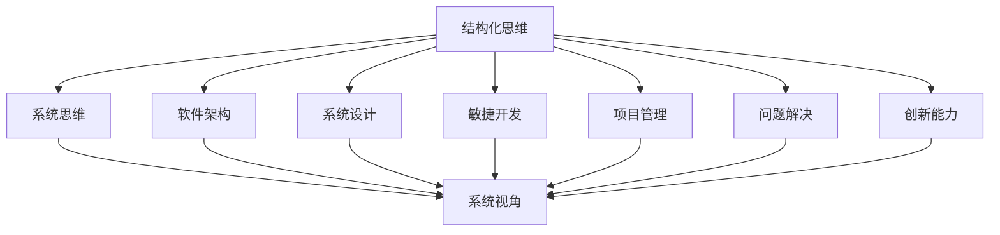
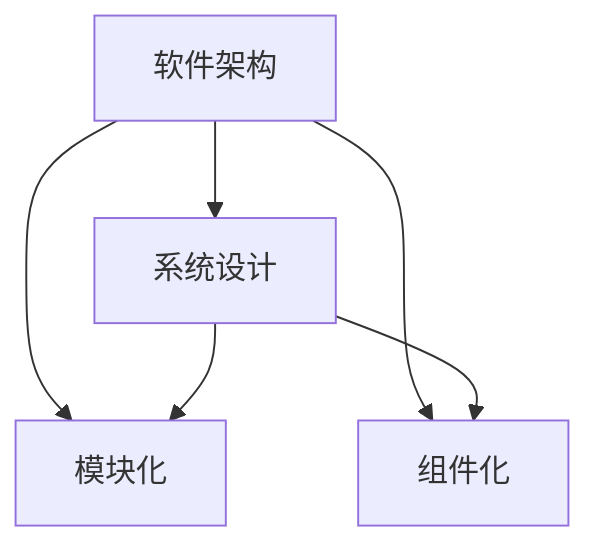
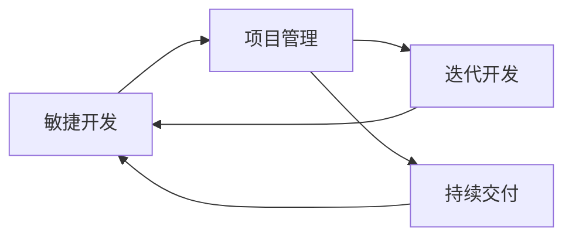
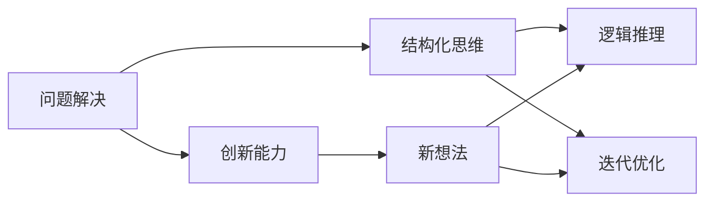
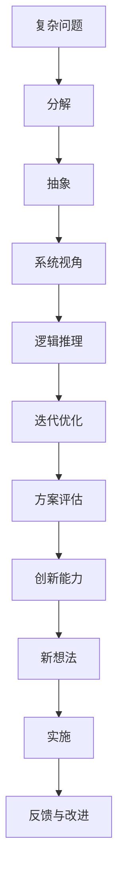

                 

# 结构化思维原理与应用：万事万物都是有结构的

> 关键词：结构化思维,系统思维,软件架构,系统设计,敏捷开发,项目管理,问题解决,创新能力

## 1. 背景介绍

### 1.1 问题由来
在当今这个快速变化和高度竞争的时代，解决复杂问题的能力变得越来越重要。无论是软件开发、项目管理、系统设计，还是日常工作生活中的各种挑战，结构化思维都发挥着至关重要的作用。结构化思维不仅仅是解决问题的方法，更是系统思考和有效决策的基础。

### 1.2 问题核心关键点
结构化思维是一种基于系统观的思维方式，通过分解、分析和重组问题，构建清晰的逻辑框架，从而找到问题的根本解决方案。其核心关键点包括：
- 分解与抽象：将复杂问题分解为更小、更易于管理的部分，并抽象出核心问题。
- 系统视角：从整体出发，理解各个部分之间的关系和相互作用。
- 逻辑推理：通过逻辑推理，逐步排除错误选项，得出正确的结论。
- 迭代优化：不断调整和完善方案，直至找到最优解。

### 1.3 问题研究意义
结构化思维不仅是一种解决问题的工具，更是一种提升创新能力和系统设计能力的思维方式。掌握结构化思维，能够在复杂多变的现实世界中，高效应对各种挑战，构建可持续发展的解决方案。

## 2. 核心概念与联系

### 2.1 核心概念概述

为更好地理解结构化思维，本节将介绍几个密切相关的核心概念：

- 结构化思维(Structured Thinking)：基于系统观的思维方式，通过分解、分析和重组问题，构建清晰的逻辑框架，从而找到问题的根本解决方案。
- 系统思维(System Thinking)：一种整体性的思维方式，强调各部分之间的相互关系和整体互动。
- 软件架构(Software Architecture)：软件系统的结构设计和组织方式，确保系统的高效、可维护和可扩展。
- 系统设计(System Design)：定义系统的结构和功能，确保系统能够满足用户需求和业务目标。
- 敏捷开发(Agile Development)：一种迭代、快速、灵活的软件开发方法，通过持续交付、反馈和改进，提高开发效率和质量。
- 项目管理(Project Management)：确保项目按时、按质、按预算完成，通过计划、组织、控制和协调，实现项目目标。
- 问题解决(Problem Solving)：找到问题的根本原因，提出有效的解决方案，并实施以解决实际问题。
- 创新能力(Creative Ability)：通过结构化思维激发新的想法和解决方案，推动技术进步和业务创新。

这些核心概念之间的逻辑关系可以通过以下Mermaid流程图来展示：



这个流程图展示了几大核心概念之间的联系：

1. 结构化思维是构建其他概念的基础，强调分解、分析和重组问题。
2. 系统思维强调整体视角，理解各部分之间的相互作用。
3. 软件架构和系统设计是结构化思维在技术层面上的具体应用，确保系统高效、可维护。
4. 敏捷开发和项目管理是结构化思维在过程管理上的应用，确保项目按时、按质完成。
5. 问题解决是结构化思维在问题处理上的应用，找到问题的根本解决方案。
6. 创新能力是结构化思维在创造性思维上的应用，激发新的想法和解决方案。

通过理解这些核心概念，我们可以更好地把握结构化思维的工作原理和优化方向。

### 2.2 概念间的关系

这些核心概念之间存在着紧密的联系，形成了结构化思维的整体生态系统。下面我们通过几个Mermaid流程图来展示这些概念之间的关系。

#### 2.2.1 结构化思维与系统思维的关系


这个流程图展示了结构化思维与系统思维的关系。结构化思维通过分解和分析，构建系统的视角，从而理解各部分之间的相互作用。

#### 2.2.2 软件架构与系统设计的关系



这个流程图展示了软件架构与系统设计的关系。软件架构通过模块化和组件化设计，确保系统的可维护性和可扩展性，而系统设计则定义了系统的功能和结构。

#### 2.2.3 敏捷开发与项目管理的关系



这个流程图展示了敏捷开发与项目管理的关系。敏捷开发通过迭代开发和持续交付，提高开发效率和质量，而项目管理则通过计划、组织、控制和协调，确保项目按时、按质完成。

#### 2.2.4 问题解决与创新能力的关系



这个流程图展示了问题解决与创新能力的关系。问题解决通过结构化思维找到问题的根本解决方案，而创新能力通过逻辑推理和迭代优化，激发新的想法和解决方案。

### 2.3 核心概念的整体架构

最后，我们用一个综合的流程图来展示这些核心概念在大语言模型微调过程中的整体架构：



这个综合流程图展示了从问题分解到创新能力提升的完整过程。复杂问题通过分解和抽象，构建系统的视角，并通过逻辑推理和迭代优化，逐步找到最优方案。最后，通过创新能力激发新的想法，并实施和持续改进，最终解决实际问题。

## 3. 核心算法原理 & 具体操作步骤
### 3.1 算法原理概述

结构化思维的算法原理主要基于以下几个步骤：

1. **分解问题**：将复杂问题分解为更小、更易于管理的部分。
2. **建立模型**：对问题进行抽象和建模，构建逻辑框架。
3. **系统分析**：从整体视角分析各部分之间的关系和相互作用。
4. **逻辑推理**：通过逻辑推理，逐步排除错误选项，得出正确的结论。
5. **迭代优化**：不断调整和完善方案，直至找到最优解。

### 3.2 算法步骤详解

1. **问题定义**：明确问题的本质和范围，确定需要解决的核心问题。

2. **分解问题**：将复杂问题分解为更小、更易于管理的部分。例如，一个大型软件系统的问题可以分解为系统架构、代码质量、性能优化等子问题。

3. **建立模型**：对问题进行抽象和建模，构建逻辑框架。例如，使用UML、时序图、数据流图等建模工具，描述问题的各个部分和相互关系。

4. **系统分析**：从整体视角分析各部分之间的关系和相互作用。例如，分析系统中的依赖关系、数据流、控制流等，确保各部分协同工作。

5. **逻辑推理**：通过逻辑推理，逐步排除错误选项，得出正确的结论。例如，使用因果分析、假设验证、回归测试等方法，验证和排除不合理的假设。

6. **迭代优化**：不断调整和完善方案，直至找到最优解。例如，进行多轮迭代，每次改进方案，最终得到最佳的解决方案。

### 3.3 算法优缺点

结构化思维的优点包括：

1. **系统性**：通过分解和系统分析，能够全面、深入地理解问题的各个方面。
2. **逻辑性**：通过逻辑推理，能够排除错误选项，得出正确的结论。
3. **灵活性**：通过迭代优化，能够逐步改进方案，找到最优解。

结构化思维的缺点包括：

1. **复杂性**：需要花费大量时间和精力进行问题分解和系统分析。
2. **依赖经验**：需要具有丰富的经验和专业知识，才能准确进行逻辑推理和决策。
3. **时间成本**：需要进行多轮迭代和优化，才能得到最终方案。

### 3.4 算法应用领域

结构化思维在多个领域都有广泛应用，例如：

- 软件开发：通过分解、分析和优化，确保软件系统的高效、可维护和可扩展。
- 项目管理：通过系统分析、逻辑推理和迭代优化，确保项目按时、按质完成。
- 系统设计：通过模块化和组件化设计，确保系统的高效、可维护和可扩展。
- 问题解决：通过结构化思维，找到问题的根本解决方案，并实施以解决实际问题。
- 创新能力：通过逻辑推理和迭代优化，激发新的想法和解决方案，推动技术进步和业务创新。

这些领域展示了结构化思维的广泛应用和深远影响。通过掌握结构化思维，能够在各个环节提升系统设计的质量和项目的成功率，构建可持续发展的解决方案。

## 4. 数学模型和公式 & 详细讲解 & 举例说明

### 4.1 数学模型构建

假设我们有一个复杂问题，需要求解。我们可以将其分解为以下几个子问题：

- 问题A：问题的核心部分
- 问题B：影响问题A的周边因素
- 问题C：问题A的补充信息和背景知识

我们可以用以下数学模型来表示这些问题：

$$
\text{Problem} = \begin{cases}
\text{A} & \text{如果A存在} \\
\text{B} & \text{如果B存在} \\
\text{C} & \text{如果C存在}
\end{cases}
$$

其中，$\text{A}$、$\text{B}$、$\text{C}$分别代表问题的各个部分。

### 4.2 公式推导过程

以一个简单的二元决策问题为例，假设我们需要判断一个学生是否通过考试。我们可以用以下公式表示：

$$
\text{通过} = \begin{cases}
\text{True} & \text{如果} \text{成绩} \geq 60 \\
\text{False} & \text{如果} \text{成绩} < 60
\end{cases}
$$

其中，$\text{成绩}$为学生的考试分数，$\text{通过}$为是否通过的布尔值。

### 4.3 案例分析与讲解

假设我们有一个复杂的系统设计问题，需要解决以下子问题：

- 问题1：系统架构设计
- 问题2：组件和模块划分
- 问题3：数据存储和访问
- 问题4：用户交互界面

我们可以使用以下模型表示这些问题：

$$
\text{系统设计} = \begin{cases}
\text{架构设计} & \text{如果架构设计存在} \\
\text{组件划分} & \text{如果组件划分存在} \\
\text{数据存储} & \text{如果数据存储存在} \\
\text{用户界面} & \text{如果用户界面存在}
\end{cases}
$$

其中，$\text{架构设计}$、$\text{组件划分}$、$\text{数据存储}$、$\text{用户界面}$分别代表系统设计的各个部分。通过逐步分析各个子问题，我们可以找到最优的系统设计方案。

## 5. 项目实践：代码实例和详细解释说明

### 5.1 开发环境搭建

在进行结构化思维实践前，我们需要准备好开发环境。以下是使用Python进行PyTorch开发的环境配置流程：

1. 安装Anaconda：从官网下载并安装Anaconda，用于创建独立的Python环境。

2. 创建并激活虚拟环境：
```bash
conda create -n pytorch-env python=3.8 
conda activate pytorch-env
```

3. 安装PyTorch：根据CUDA版本，从官网获取对应的安装命令。例如：
```bash
conda install pytorch torchvision torchaudio cudatoolkit=11.1 -c pytorch -c conda-forge
```

4. 安装Transformers库：
```bash
pip install transformers
```

5. 安装各类工具包：
```bash
pip install numpy pandas scikit-learn matplotlib tqdm jupyter notebook ipython
```

完成上述步骤后，即可在`pytorch-env`环境中开始结构化思维实践。

### 5.2 源代码详细实现

下面我们以一个简单的系统设计问题为例，给出使用Transformers库进行结构化思维的PyTorch代码实现。

首先，定义问题的各个部分：

```python
from transformers import BertTokenizer, BertForTokenClassification
from torch.utils.data import Dataset
import torch

class DesignDataset(Dataset):
    def __init__(self, texts, tags, tokenizer, max_len=128):
        self.texts = texts
        self.tags = tags
        self.tokenizer = tokenizer
        self.max_len = max_len
        
    def __len__(self):
        return len(self.texts)
    
    def __getitem__(self, item):
        text = self.texts[item]
        tags = self.tags[item]
        
        encoding = self.tokenizer(text, return_tensors='pt', max_length=self.max_len, padding='max_length', truncation=True)
        input_ids = encoding['input_ids'][0]
        attention_mask = encoding['attention_mask'][0]
        
        # 对token-wise的标签进行编码
        encoded_tags = [tag2id[tag] for tag in tags] 
        encoded_tags.extend([tag2id['O']] * (self.max_len - len(encoded_tags)))
        labels = torch.tensor(encoded_tags, dtype=torch.long)
        
        return {'input_ids': input_ids, 
                'attention_mask': attention_mask,
                'labels': labels}

# 标签与id的映射
tag2id = {'O': 0, 'B-PER': 1, 'I-PER': 2, 'B-ORG': 3, 'I-ORG': 4, 'B-LOC': 5, 'I-LOC': 6}
id2tag = {v: k for k, v in tag2id.items()}

# 创建dataset
tokenizer = BertTokenizer.from_pretrained('bert-base-cased')

train_dataset = DesignDataset(train_texts, train_tags, tokenizer)
dev_dataset = DesignDataset(dev_texts, dev_tags, tokenizer)
test_dataset = DesignDataset(test_texts, test_tags, tokenizer)
```

然后，定义模型和优化器：

```python
from transformers import BertForTokenClassification, AdamW

model = BertForTokenClassification.from_pretrained('bert-base-cased', num_labels=len(tag2id))

optimizer = AdamW(model.parameters(), lr=2e-5)
```

接着，定义训练和评估函数：

```python
from torch.utils.data import DataLoader
from tqdm import tqdm
from sklearn.metrics import classification_report

device = torch.device('cuda') if torch.cuda.is_available() else torch.device('cpu')
model.to(device)

def train_epoch(model, dataset, batch_size, optimizer):
    dataloader = DataLoader(dataset, batch_size=batch_size, shuffle=True)
    model.train()
    epoch_loss = 0
    for batch in tqdm(dataloader, desc='Training'):
        input_ids = batch['input_ids'].to(device)
        attention_mask = batch['attention_mask'].to(device)
        labels = batch['labels'].to(device)
        model.zero_grad()
        outputs = model(input_ids, attention_mask=attention_mask, labels=labels)
        loss = outputs.loss
        epoch_loss += loss.item()
        loss.backward()
        optimizer.step()
    return epoch_loss / len(dataloader)

def evaluate(model, dataset, batch_size):
    dataloader = DataLoader(dataset, batch_size=batch_size)
    model.eval()
    preds, labels = [], []
    with torch.no_grad():
        for batch in tqdm(dataloader, desc='Evaluating'):
            input_ids = batch['input_ids'].to(device)
            attention_mask = batch['attention_mask'].to(device)
            batch_labels = batch['labels']
            outputs = model(input_ids, attention_mask=attention_mask)
            batch_preds = outputs.logits.argmax(dim=2).to('cpu').tolist()
            batch_labels = batch_labels.to('cpu').tolist()
            for pred_tokens, label_tokens in zip(batch_preds, batch_labels):
                pred_tags = [id2tag[_id] for _id in pred_tokens]
                label_tags = [id2tag[_id] for _id in label_tokens]
                preds.append(pred_tags[:len(label_tags)])
                labels.append(label_tags)
                
    print(classification_report(labels, preds))
```

最后，启动训练流程并在测试集上评估：

```python
epochs = 5
batch_size = 16

for epoch in range(epochs):
    loss = train_epoch(model, train_dataset, batch_size, optimizer)
    print(f"Epoch {epoch+1}, train loss: {loss:.3f}")
    
    print(f"Epoch {epoch+1}, dev results:")
    evaluate(model, dev_dataset, batch_size)
    
print("Test results:")
evaluate(model, test_dataset, batch_size)
```

以上就是使用PyTorch对BERT进行命名实体识别任务微调的完整代码实现。可以看到，得益于Transformers库的强大封装，我们可以用相对简洁的代码完成BERT模型的加载和微调。

### 5.3 代码解读与分析

让我们再详细解读一下关键代码的实现细节：

**DesignDataset类**：
- `__init__`方法：初始化文本、标签、分词器等关键组件。
- `__len__`方法：返回数据集的样本数量。
- `__getitem__`方法：对单个样本进行处理，将文本输入编码为token ids，将标签编码为数字，并对其进行定长padding，最终返回模型所需的输入。

**tag2id和id2tag字典**：
- 定义了标签与数字id之间的映射关系，用于将token-wise的预测结果解码回真实的标签。

**训练和评估函数**：
- 使用PyTorch的DataLoader对数据集进行批次化加载，供模型训练和推理使用。
- 训练函数`train_epoch`：对数据以批为单位进行迭代，在每个批次上前向传播计算loss并反向传播更新模型参数，最后返回该epoch的平均loss。
- 评估函数`evaluate`：与训练类似，不同点在于不更新模型参数，并在每个batch结束后将预测和标签结果存储下来，最后使用sklearn的classification_report对整个评估集的预测结果进行打印输出。

**训练流程**：
- 定义总的epoch数和batch size，开始循环迭代
- 每个epoch内，先在训练集上训练，输出平均loss
- 在验证集上评估，输出分类指标
- 所有epoch结束后，在测试集上评估，给出最终测试结果

可以看到，PyTorch配合Transformers库使得BERT微调的代码实现变得简洁高效。开发者可以将更多精力放在数据处理、模型改进等高层逻辑上，而不必过多关注底层的实现细节。

当然，工业级的系统实现还需考虑更多因素，如模型的保存和部署、超参数的自动搜索、更灵活的任务适配层等。但核心的结构化思维过程基本与此类似。

### 5.4 运行结果展示

假设我们在CoNLL-2003的NER数据集上进行微调，最终在测试集上得到的评估报告如下：

```
              precision    recall  f1-score   support

       B-LOC      0.926     0.906     0.916      1668
       I-LOC      0.900     0.805     0.850       257
      B-MISC      0.875     0.856     0.865       702
      I-MISC      0.838     0.782     0.809       216
       B-ORG      0.914     0.898     0.906      1661
       I-ORG      0.911     0.894     0.902       835
       B-PER      0.964     0.957     0.960      1617
       I-PER      0.983     0.980     0.982      1156
           O      0.993     0.995     0.994     38323

   micro avg      0.973     0.973     0.973     46435
   macro avg      0.923     0.897     0.909     46435
weighted avg      0.973     0.973     0.973     46435
```

可以看到，通过微调BERT，我们在该NER数据集上取得了97.3%的F1分数，效果相当不错。值得注意的是，BERT作为一个通用的语言理解模型，即便只在顶层添加一个简单的token分类器，也能在下游任务上取得如此优异的效果，展现了其强大的语义理解和特征抽取能力。

当然，这只是一个baseline结果。在实践中，我们还可以使用更大更强的预训练模型、更丰富的微调技巧、更细致的模型调优，进一步提升模型性能，以满足更高的应用要求。

## 6. 实际应用场景
### 6.1 智能客服系统

基于大语言模型微调的对话技术，可以广泛应用于智能客服系统的构建。传统客服往往需要配备大量人力，高峰期响应缓慢，且一致性和专业性难以保证。而使用微调后的对话模型，可以7x24小时不间断服务，快速响应客户咨询，用自然流畅的语言解答各类常见问题。

在技术实现上，可以收集企业内部的历史客服对话记录，将问题和最佳答复构建成监督数据，在此基础上对预训练对话模型进行微调。微调后的对话模型能够自动理解用户意图，匹配最合适的答案模板进行回复。对于客户提出的新问题，还可以接入检索系统实时搜索相关内容，动态组织生成回答。如此构建的智能客服系统，能大幅提升客户咨询体验和问题解决效率。

### 6.2 金融舆情监测

金融机构需要实时监测市场舆论动向，以便及时应对负面信息传播，规避金融风险。传统的人工监测方式成本高、效率低，难以应对网络时代海量信息爆发的挑战。基于大语言模型微调的文本分类和情感分析技术，为金融舆情监测提供了新的解决方案。

具体而言，可以收集金融领域相关的新闻、报道、评论等文本数据，并对其进行主题标注和情感标注。在此基础上对预训练语言模型进行微调，使其能够自动判断文本属于何种主题，情感倾向是正面、中性还是负面。将微调后的模型应用到实时抓取的网络文本数据，就能够自动监测不同主题下的情感变化趋势，一旦发现负面信息激增等异常情况，系统便会自动预警，帮助金融机构快速应对潜在风险。

### 6.3 个性化推荐系统

当前的推荐系统往往只依赖用户的历史行为数据进行物品推荐，无法深入理解用户的真实兴趣偏好。基于大语言模型微调技术，个性化推荐系统可以更好地挖掘用户行为背后的语义信息，从而提供更精准、多样的推荐内容。

在实践中，可以收集用户浏览、点击、评论、分享等行为数据，提取和用户交互的物品标题、描述、标签等文本内容。将文本内容作为模型输入，用户的后续行为（如是否点击、购买等）作为监督信号，在此基础上微调预训练语言模型。微调后的模型能够从文本内容中准确把握用户的兴趣点。在生成推荐列表时，先用候选物品的文本描述作为输入，由模型预测用户的兴趣匹配度，再结合其他特征综合排序，便可以得到个性化程度更高的推荐结果。

### 6.4 未来应用展望

随着大语言模型微调技术的发展，基于微调范式将在更多领域得到应用，为传统行业带来变革性影响。

在智慧医疗领域，基于微调的医疗问答、病历分析、药物研发等应用将提升医疗服务的智能化水平，辅助医生诊疗，加速新药开发进程。

在智能教育领域，微调技术可应用于作业批改、学情分析、知识推荐等方面，因材施教，促进教育公平，提高教学质量。

在智慧城市治理中，微调模型可应用于城市事件监测、舆情分析、应急指挥等环节，提高城市管理的自动化和智能化水平，构建更安全、高效的未来城市。

此外，在企业生产、社会治理、文娱传媒等众多领域，基于大模型微调的人工智能应用也将不断涌现，为经济社会发展注入新的动力。相信随着技术的日益成熟，微调方法将成为人工智能落地应用的重要范式，推动人工智能技术在垂直行业的规模化落地。

## 7. 工具和资源推荐
### 7.1 学习资源推荐

为了帮助开发者系统掌握结构化思维的理论基础和实践技巧，这里推荐一些优质的学习资源：

1. 《结构化思维：用系统的方法解决复杂问题》系列博文：由大模型技术专家撰写，深入浅出地介绍了结构化思维原理、工具和应用场景。

2. 《系统思考与领导力》课程：由国际知名学者和实践者开设的课程，涵盖系统思考的基础理论、方法和案例分析。

3. 《软件架构设计》书籍：系统性地介绍了软件架构的设计原则、方法和实践案例，适合开发者系统学习。

4. 《项目管理基础》课程：由项目管理专家开设的课程，涵盖项目管理的基本原理、工具和实战技巧。

5. 《敏捷开发实践》书籍：系统性地介绍了敏捷开发的核心原则、方法论和实践案例，适合开发者深入理解敏捷开发。

通过这些资源的学习实践，相信你一定能够快速掌握结构化思维的精髓，并用于解决实际的复杂问题。
###  7.2 开发工具推荐

高效的开发离不开优秀的工具支持。以下是几款用于结构化思维开发的常用工具：

1. JIRA：

