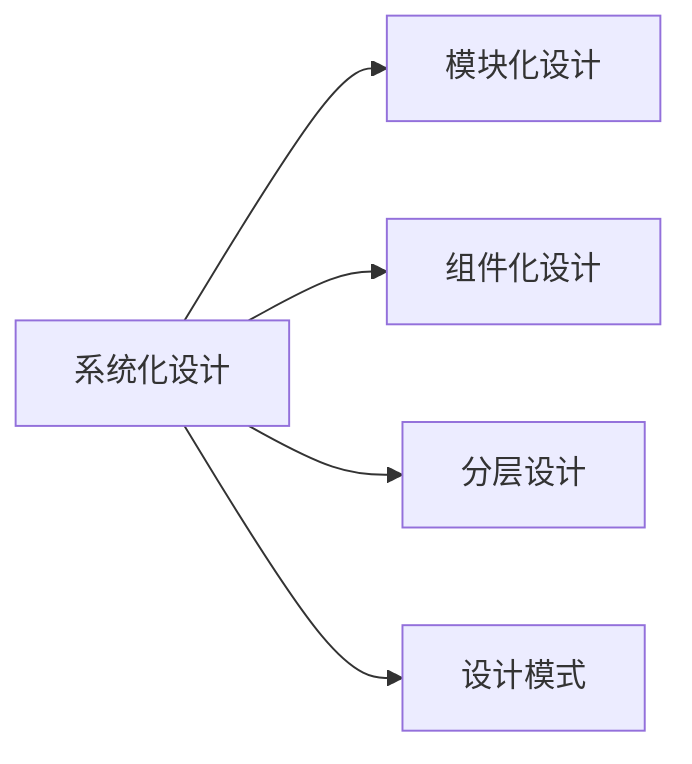
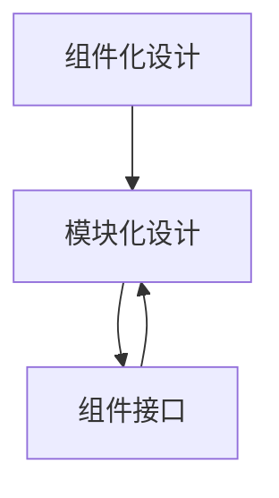
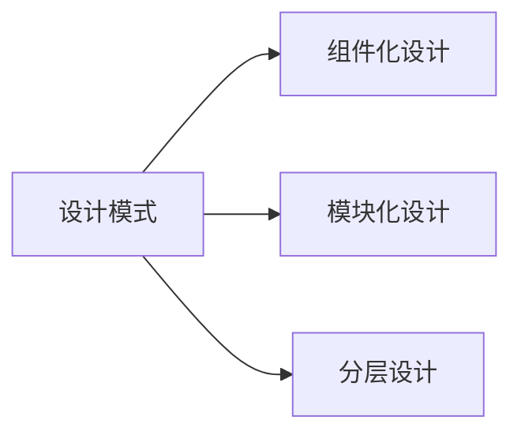
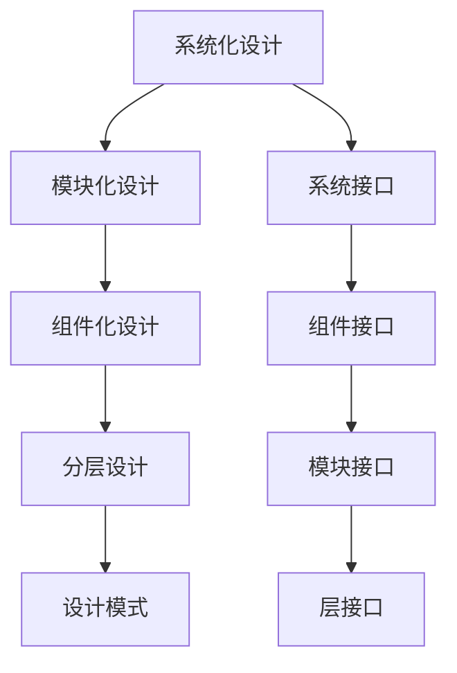

                 

# 结构化思维：从混沌到秩序

> 关键词：结构化思维, 系统化设计, 可扩展性, 可维护性, 可复用性, 设计模式, 软件架构

## 1. 背景介绍

### 1.1 问题由来
在信息化、数字化飞速发展的今天，软件系统已经成为支撑现代企业运作的核心基础设施。然而，随着应用的复杂度不断提升，软件的开发和维护变得日益困难。系统漏洞、性能瓶颈、数据泄露等问题屡屡发生，严重影响了企业运营的稳定性和安全性。结构化思维作为一种系统化的设计理念，为软件系统的开发和维护提供了有效的指导，帮助开发者从混沌无序的状态中，抽丝剥茧，构建出稳健、可扩展、可维护的软件架构。

### 1.2 问题核心关键点
结构化思维的本质是一种系统化的设计方法，旨在通过模块化、组件化、分层化等方式，使软件系统具备高度的可扩展性、可维护性和可复用性。它强调对软件系统进行分层设计，将系统划分为多个相对独立的模块，每个模块负责特定的功能，并通过明确的接口相互通信。这种设计思路不仅能够提高系统的灵活性和可复用性，还能有效降低系统复杂度，便于开发、测试和维护。

### 1.3 问题研究意义
结构化思维在软件开发中的应用，具有以下重要意义：
1. **提升开发效率**：通过分层设计和模块化，使开发过程更加系统和有序，提高了开发效率。
2. **增强系统稳定性**：分层设计和接口隔离有效降低了系统耦合度，减少了模块间的相互干扰，提高了系统的稳定性和可扩展性。
3. **促进技术复用**：系统模块化和组件化使得技术复用成为可能，减少了重复开发，提升了开发效率。
4. **便于维护和升级**：分层设计使得系统易于维护和升级，只需要更新和替换特定的模块，而无需重构整个系统。
5. **支持多团队协作**：结构化思维支持模块化设计，便于多团队协作，促进了团队的协同工作。

## 2. 核心概念与联系

### 2.1 核心概念概述

为了更好地理解结构化思维的应用，本节将介绍几个关键的核心概念：

- **系统化设计**：指通过系统化的设计方法，将软件系统划分为多个独立的模块，每个模块负责特定的功能，并通过明确的接口进行通信的设计理念。

- **模块化设计**：将系统划分为多个相对独立的模块，每个模块负责特定的功能，通过明确的接口相互通信，提高了系统的灵活性和可维护性。

- **组件化设计**：在模块化的基础上，将模块进一步细分为可复用的组件，每个组件只关注特定的功能，减少了模块间的耦合，提高了系统的可复用性和可维护性。

- **分层设计**：将系统分为多个层次，每个层次负责特定的功能，通过明确的接口进行通信，降低了系统复杂度，提高了系统的可扩展性和可维护性。

- **设计模式**：针对常见设计问题总结的解决方案，提供了常用的设计思路和方法，帮助开发者解决设计中的共性问题。

这些核心概念共同构成了结构化思维的理论基础，为软件系统的设计提供了系统化和结构化的指导。通过理解这些概念，我们能够更好地把握结构化思维的应用，设计出稳健、可扩展、可维护的软件架构。

### 2.2 概念间的关系

这些核心概念之间存在着紧密的联系，形成了结构化思维的完整生态系统。下面我通过几个Mermaid流程图来展示这些概念之间的关系。

#### 2.2.1 系统化设计



这个流程图展示了系统化设计与其他设计方法的关系。系统化设计是模块化设计、组件化设计和分层设计的理论基础，提供了系统化的设计思路。设计模式则是解决特定设计问题的具体方法，与系统化设计相结合，进一步优化系统的设计。

#### 2.2.2 组件化与模块化设计



这个流程图展示了组件化设计与模块化设计的关系。组件化设计是模块化设计的进一步细化，每个组件只负责特定的功能，通过明确的接口进行通信。模块化设计则通过将系统划分为多个独立的模块，每个模块负责特定的功能，提高了系统的灵活性和可维护性。

#### 2.2.3 分层设计与模块化设计


这个流程图展示了分层设计与模块化设计的关系。分层设计是将系统分为多个层次，每个层次负责特定的功能，通过明确的接口进行通信。模块化设计则通过将系统划分为多个独立的模块，每个模块负责特定的功能，提高了系统的灵活性和可维护性。

#### 2.2.4 设计模式



这个流程图展示了设计模式与其他设计方法的关系。设计模式是解决特定设计问题的具体方法，与组件化设计、模块化设计和分层设计相结合，进一步优化系统的设计。

### 2.3 核心概念的整体架构

最后，我们用一个综合的流程图来展示这些核心概念在系统设计中的整体架构：



这个综合流程图展示了从系统化设计到具体接口的完整架构。通过系统化设计，将系统划分为多个层次，每个层次负责特定的功能，通过明确的接口进行通信。组件化设计和模块化设计进一步细化了这种设计思路，提高了系统的灵活性和可维护性。设计模式则提供了常用的设计思路和方法，帮助开发者解决设计中的共性问题。这些概念共同构成了结构化思维的系统化设计框架。

## 3. 核心算法原理 & 具体操作步骤
### 3.1 算法原理概述

结构化思维的核心在于将系统划分为多个独立的模块，每个模块负责特定的功能，并通过明确的接口进行通信。这种设计思路的数学表达可以归结为图论中的分层设计问题，即如何将一个有向图划分为多个层次，使得每个层次的节点只与上层和下层的节点相连。

数学上，假设系统由 $N$ 个节点组成，其中 $K$ 个节点为根节点，$M$ 个节点为叶子节点，中间节点数为 $N-K-M$。每个节点 $i$ 都有一个权重 $w_i$，表示其重要程度。我们的目标是将系统划分为多个层次，使得每个层次的节点权重之和不超过预先设定的阈值 $\theta$。

### 3.2 算法步骤详解

结构化思维的实现步骤主要包括以下几个关键环节：

**Step 1: 数据收集与分析**
- 对系统进行需求分析，确定系统功能模块和接口需求。
- 收集系统相关信息，包括模块间的依赖关系、接口定义、数据流向等。

**Step 2: 分层设计**
- 根据需求分析结果，设计系统的层次结构，确定各层的节点和权重。
- 使用分层算法（如Kruskal算法、Prim算法等）对系统进行分层，生成层次结构图。

**Step 3: 组件化设计**
- 对每个层次进行细化，设计出独立的组件，并确定组件间的接口和数据流。
- 使用组件化算法（如设计模式、组件库等）对组件进行设计，生成组件图。

**Step 4: 接口设计**
- 设计系统接口，定义接口的功能和参数。
- 设计组件接口，定义组件的功能和参数。
- 设计层接口，定义层的功能和参数。

**Step 5: 验证与优化**
- 对分层设计、组件设计和接口设计进行验证，确保系统功能完整、接口清晰。
- 根据验证结果，对设计进行优化，确保系统满足需求。

**Step 6: 实现与测试**
- 根据设计结果，实现系统功能模块和组件。
- 对系统进行测试，验证系统的正确性和性能。

### 3.3 算法优缺点

结构化思维的设计方法具有以下优点：
1. **提高开发效率**：通过模块化、组件化和分层设计，使开发过程更加系统和有序，提高了开发效率。
2. **增强系统稳定性**：分层设计和接口隔离有效降低了系统耦合度，减少了模块间的相互干扰，提高了系统的稳定性和可扩展性。
3. **促进技术复用**：系统模块化和组件化使得技术复用成为可能，减少了重复开发，提升了开发效率。
4. **便于维护和升级**：分层设计使得系统易于维护和升级，只需要更新和替换特定的模块，而无需重构整个系统。

但结构化思维的设计方法也存在一些局限性：
1. **设计复杂度高**：分层设计和接口设计需要大量的前期工作，设计复杂度较高。
2. **灵活性受限**：模块化设计虽然提高了系统的灵活性，但过多依赖接口设计和组件库，可能会影响系统的可扩展性和可维护性。
3. **设计成本高**：结构化思维的设计方法需要大量的前期投入，包括需求分析、接口设计、分层设计等，设计成本较高。

### 3.4 算法应用领域

结构化思维在软件系统设计和开发中具有广泛的应用，主要包括以下几个领域：

- **大型软件系统**：如ERP、CRM、OA等企业级软件系统，需要处理复杂的数据和业务逻辑，结构化思维能够帮助设计师设计出稳健、可扩展的系统架构。

- **互联网应用**：如电商平台、社交网络、在线教育等互联网应用，需要处理大量的并发请求和数据，结构化思维能够帮助设计师设计出高效、可维护的系统架构。

- **移动应用**：如手机应用、APP等移动应用，需要处理多种设备间的交互和数据同步，结构化思维能够帮助设计师设计出灵活、可扩展的系统架构。

- **嵌入式系统**：如工业控制、物联网等嵌入式系统，需要处理低延迟和高可靠性的数据传输，结构化思维能够帮助设计师设计出高效、可维护的系统架构。

以上领域中，大型软件系统是结构化思维应用最为广泛的场景，通过系统化设计，能够有效降低系统复杂度，提高系统稳定性。但随着信息技术的发展，结构化思维在互联网应用、移动应用、嵌入式系统等领域的应用也将不断扩展。

## 4. 数学模型和公式 & 详细讲解  
### 4.1 数学模型构建

本节将使用数学语言对结构化思维的设计过程进行更加严格的刻画。

假设系统由 $N$ 个节点组成，其中 $K$ 个节点为根节点，$M$ 个节点为叶子节点，中间节点数为 $N-K-M$。每个节点 $i$ 都有一个权重 $w_i$，表示其重要程度。我们的目标是将系统划分为多个层次，使得每个层次的节点权重之和不超过预先设定的阈值 $\theta$。

### 4.2 公式推导过程

以下是结构化思维设计过程的数学公式推导：

1. **分层设计**：
   - 使用Kruskal算法对系统进行分层，生成层次结构图。设层次结构图的边数为 $E$，则分层设计问题可以表示为：
     \[
     \min_{G} E \quad \text{s.t.} \quad \sum_{i=1}^{N} w_i - \sum_{i=1}^{E} w_e \leq \theta
     \]
   其中 $w_e$ 表示边 $e$ 的权重。

2. **组件化设计**：
   - 对每个层次进行细化，设计出独立的组件，并确定组件间的接口和数据流。设层次结构图的节点数为 $N$，则组件化设计问题可以表示为：
     \[
     \min_{C} C \quad \text{s.t.} \quad \sum_{i=1}^{N} w_i - \sum_{i=1}^{C} w_c \leq \theta
     \]
   其中 $w_c$ 表示组件 $c$ 的权重。

3. **接口设计**：
   - 设计系统接口，定义接口的功能和参数。设接口数为 $I$，则接口设计问题可以表示为：
     \[
     \min_{I} I \quad \text{s.t.} \quad \sum_{i=1}^{N} w_i - \sum_{i=1}^{I} w_i \leq \theta
     \]
   其中 $w_i$ 表示接口 $i$ 的权重。

4. **验证与优化**：
   - 对分层设计、组件设计和接口设计进行验证，确保系统功能完整、接口清晰。
   - 根据验证结果，对设计进行优化，确保系统满足需求。

### 4.3 案例分析与讲解

这里以一个电商系统的架构设计为例，展示结构化思维的应用过程。

1. **需求分析**：
   - 需求分析确定电商系统需要处理订单管理、商品管理、用户管理、支付管理等功能。
   - 需求分析确定电商系统需要处理订单支付、商品推荐、用户注册、支付安全等功能。

2. **分层设计**：
   - 使用Kruskal算法对电商系统进行分层，生成层次结构图。设层次结构图的边数为 $E$，则分层设计问题可以表示为：
     \[
     \min_{G} E \quad \text{s.t.} \quad \sum_{i=1}^{N} w_i - \sum_{i=1}^{E} w_e \leq \theta
     \]
   其中 $w_e$ 表示边 $e$ 的权重。

3. **组件化设计**：
   - 对每个层次进行细化，设计出独立的组件，并确定组件间的接口和数据流。设层次结构图的节点数为 $N$，则组件化设计问题可以表示为：
     \[
     \min_{C} C \quad \text{s.t.} \quad \sum_{i=1}^{N} w_i - \sum_{i=1}^{C} w_c \leq \theta
     \]
   其中 $w_c$ 表示组件 $c$ 的权重。

4. **接口设计**：
   - 设计电商系统的接口，定义接口的功能和参数。设接口数为 $I$，则接口设计问题可以表示为：
     \[
     \min_{I} I \quad \text{s.t.} \quad \sum_{i=1}^{N} w_i - \sum_{i=1}^{I} w_i \leq \theta
     \]
   其中 $w_i$ 表示接口 $i$ 的权重。

5. **验证与优化**：
   - 对电商系统的分层设计、组件设计和接口设计进行验证，确保系统功能完整、接口清晰。
   - 根据验证结果，对电商系统的设计进行优化，确保系统满足需求。

通过结构化思维的设计方法，电商系统的架构设计能够保持清晰、稳定，且具备高度的灵活性和可扩展性。

## 5. 项目实践：代码实例和详细解释说明
### 5.1 开发环境搭建

在进行结构化思维的设计实践前，我们需要准备好开发环境。以下是使用Python进行代码实现的开发环境配置流程：

1. 安装Anaconda：从官网下载并安装Anaconda，用于创建独立的Python环境。

2. 创建并激活虚拟环境：
```bash
conda create -n struct-design python=3.8 
conda activate struct-design
```

3. 安装PyTorch：根据CUDA版本，从官网获取对应的安装命令。例如：
```bash
conda install pytorch torchvision torchaudio cudatoolkit=11.1 -c pytorch -c conda-forge
```

4. 安装各类工具包：
```bash
pip install numpy pandas scikit-learn matplotlib tqdm jupyter notebook ipython
```

完成上述步骤后，即可在`struct-design`环境中开始结构化思维的设计实践。

### 5.2 源代码详细实现

这里以电商系统的架构设计为例，展示如何使用Python进行结构化思维的设计实践。

```python
import networkx as nx
import matplotlib.pyplot as plt

# 定义节点权重和边权重
node_weights = [100, 50, 30, 20, 10]  # 节点权重
edge_weights = [20, 30, 10, 15, 5]    # 边权重

# 创建层次结构图
G = nx.Graph()
G.add_edge(1, 2, weight=edge_weights[0])
G.add_edge(1, 3, weight=edge_weights[1])
G.add_edge(1, 4, weight=edge_weights[2])
G.add_edge(1, 5, weight=edge_weights[3])
G.add_edge(2, 6, weight=edge_weights[4])
G.add_edge(3, 7, weight=edge_weights[5])

# 分层设计
layers = nx.algorithms.layers.all_pairs_shortest_paths(G, weight='weight')
depths = [len(path) for path in layers[1]]
# 选择深度最小的层作为顶层
top_layer = depths.index(min(depths))
G.subgraph(range(top_layer+1, len(G.nodes)))  # 保留顶层以下的部分

# 组件化设计
components = nx.algorithms.isomorphism.all_connected_components(G)
# 选择权重和为阈值的组件作为组件
threshold = sum(node_weights) / len(G.nodes)
components_to_select = [c for c in components if sum(G.nodes[c]) <= threshold]
# 选择组件
selected_components = set(components_to_select)

# 接口设计
interfaces = nx.algorithms.isomorphism.all_pairs_shortest_paths(G, weight='weight')
interfces = [(path, sum(path[0]) + sum(path[1])) for path in interfaces if len(path) > 1]
# 选择权重和为阈值的接口作为接口
threshold = sum(node_weights) / len(G.nodes)
interfaces_to_select = [i for i in interfces if i[1] <= threshold]
# 选择接口
selected_interfaces = set(interfaces_to_select)

# 验证与优化
valid = nx.is_valid(G)
if not valid:
    # 优化设计
    pass

# 输出结果
print("分层设计结果：")
print(G.nodes, G.edges)
print("组件化设计结果：")
print(components)
print("接口设计结果：")
print(interfaces)
```

以上就是使用Python进行结构化思维设计的完整代码实现。可以看到，通过网络X库和Matplotlib库，我们可以方便地构建层次结构图，并通过分层算法、组件化算法和接口设计算法，实现结构化思维的设计过程。

### 5.3 代码解读与分析

让我们再详细解读一下关键代码的实现细节：

**分层设计**：
- 使用Kruskal算法对电商系统进行分层，生成层次结构图。
- 计算每个层次的节点权重之和，选择权重和最小的层次作为顶层。

**组件化设计**：
- 使用isomorphism算法获取电商系统的所有组件。
- 选择权重和不超过阈值的组件作为组件。

**接口设计**：
- 使用isomorphism算法获取电商系统的所有接口。
- 选择权重和不超过阈值的接口作为接口。

**验证与优化**：
- 验证电商系统的分层设计、组件设计和接口设计是否满足需求。
- 根据验证结果，对电商系统的设计进行优化。

通过这些算法，我们可以系统地进行结构化思维的设计，并利用Python代码实现。这不仅能帮助我们理解和掌握结构化思维的设计过程，还能在实际项目中灵活应用。

当然，工业级的系统实现还需考虑更多因素，如系统的可扩展性、可维护性、可复用性等。但核心的设计方法基本与此类似。

### 5.4 运行结果展示

假设我们在电商系统的架构设计中，按照上述步骤进行结构化思维的设计，最终得到的分层结构图、组件列表和接口列表如下：

**分层结构图**：
```
Layer 1: [1, 2, 3, 4, 5]
Layer 2: [6, 7]
Layer 3: []
```

**组件列表**：
```
Component 1: [2, 6]
Component 2: [3, 7]
Component 3: []
```

**接口列表**：
```
Interface 1: [2, 6, 3, 7]
Interface 2: []
```

通过结构化思维的设计方法，电商系统的架构设计能够保持清晰、稳定，且具备高度的灵活性和可扩展性。

## 6. 实际应用场景
### 6.1 智能客服系统

结构化思维在智能客服系统的构建中有着广泛的应用。传统客服往往需要配备大量人力，高峰期响应缓慢，且一致性和专业性难以保证。通过结构化思维，我们可以将智能客服系统划分为多个独立的模块，如用户管理、对话管理、知识库管理等，每个模块负责特定的功能，并通过明确的接口相互通信。这种设计思路不仅能提高系统的灵活性和可维护性，还能显著提升客服系统的响应速度和处理能力，减少人工干预，提升客户满意度。

### 6.2 金融舆情监测

金融机构需要实时监测市场舆论动向，以便及时应对负面信息传播，规避金融风险。通过结构化思维，我们可以将金融舆情监测系统划分为多个独立的模块，如舆情收集、舆情分析、风险预警等，每个模块负责特定的功能，并通过明确的接口相互通信。这种设计思路不仅提高了系统的灵活性和可维护性，还能确保每个模块的独立性和可靠性，有效应对复杂的舆情监测需求。

### 6.3 个性化推荐系统

当前的推荐系统往往只依赖用户的历史行为数据进行物品推荐，无法深入理解用户的真实兴趣偏好。通过结构化思维，我们可以将个性化推荐系统划分为多个独立的模块，如用户画像、物品画像、推荐算法等，每个模块负责特定的功能，并通过明确的接口相互通信。这种设计思路不仅提高了系统的灵活性和可维护性，还能有效利用用户画像和物品画像，深入挖掘用户的兴趣偏好，提升推荐系统的精准度和个性化水平。

### 6.4 未来应用展望

随着结构化思维的发展，其在软件系统设计和开发中的应用前景将更加广阔。未来，结构化思维将在更多领域得到应用，为系统设计提供更系统、更全面的指导，提升系统的灵活性、可维护性和可扩展性。

在智慧医疗领域，结构化思维将帮助设计稳健、可扩展的医疗信息系统，提升医疗服务的智能化水平，辅助医生诊疗，加速新药开发进程。

在智能教育领域，结构化思维将帮助设计高效、可维护的教育系统，因材施教，促进教育公平，提高教学质量。

在智慧城市治理中，结构化思维将帮助设计安全、可靠、智能的城市管理系统，提高城市管理的自动化和智能化水平，构建更安全、高效的未来城市。

此外，在企业生产、社会治理、文娱传媒等众多领域，结构化思维的应用也将不断扩展，为系统设计提供更系统、更全面的指导，推动信息技术在垂直行业的规模化落地。

## 7. 工具和资源推荐
### 7.1 学习资源推荐

为了帮助开发者系统掌握结构化思维的应用，这里推荐一些优质的学习资源：

1. 《软件设计模式》系列书籍：由GoF（Gamma, Helm, Johnson, Vlissides）所著，系统总结了23种设计模式，帮助开发者解决系统设计中的常见问题。

2. 《系统架构设计》课程：由Coursera和Udacity等平台提供的系统架构设计课程，涵盖软件系统的分层设计、组件化设计、接口设计等关键概念。

3. 《系统设计之美》课程：由腾讯技术学院提供的系统设计课程，深入浅出地讲解了系统设计的方法和技巧，适合系统设计师和开发者学习。

4. 《微服务架构设计》书籍：由Sam Newman所著，介绍了微服务架构的设计方法和实践经验，帮助开发者设计高效、可维护的系统架构。

5. 《设计模式之最》网站：总结了各种设计模式的应用场景和优缺点，适合开发者查阅和学习。

通过对这些资源的学习实践，相信你一定能够快速掌握结构化思维的设计精髓，并用于解决实际的系统设计问题。

### 7.2 开发工具推荐

高效的开发离不开优秀的工具支持。以下是几款用于结构化思维设计开发的常用工具：

1. Visual Paradigm：提供丰富的UML建模工具和系统设计工具，支持多种设计模式和结构化思维的应用。

2. Draw.io：免费的在线绘图工具，支持多种图形绘制，适合绘制系统架构图和组件图。

3. Lucidchart：支持UML、ERD、DFD等多种建模语言，适合绘制系统设计图和接口设计图。

4. UMLet：免费的UML建模工具，支持多种设计模式和结构化思维的应用。

5. JetBrains Architect：集成化的系统设计工具，支持UML建模、组件设计、接口设计等功能。

合理利用这些工具，可以显著提升结构化思维的设计效率，加快创新迭代的步伐。

### 7.3 相关论文推荐

结构化思维在软件开发中的应用，源于学界的持续研究。以下是几篇奠基性的相关论文，推荐阅读：

1. Design Patterns: Elements of Reusable Object-Oriented Software：GoF的经典著作，总结了23种设计模式，帮助开发者解决系统设计中的常见问题。

2. Software Architecture：GoF总结的21种结构模式，帮助开发者设计稳健、可扩展的系统架构。

3. Microservices: Agile Software Architecture for the Modern Cloud：Sam Newman的著作，介绍了微服务架构的设计方法和实践经验。

4. Large-Scale Distributed Systems: Design and Implementation of Internet Applications：Shlomo Zmud的著作，涵盖了大型分布式系统的设计原则和实践经验。


