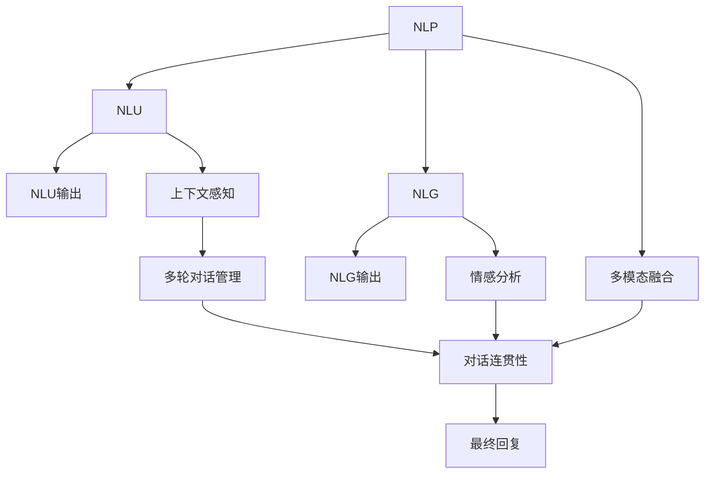
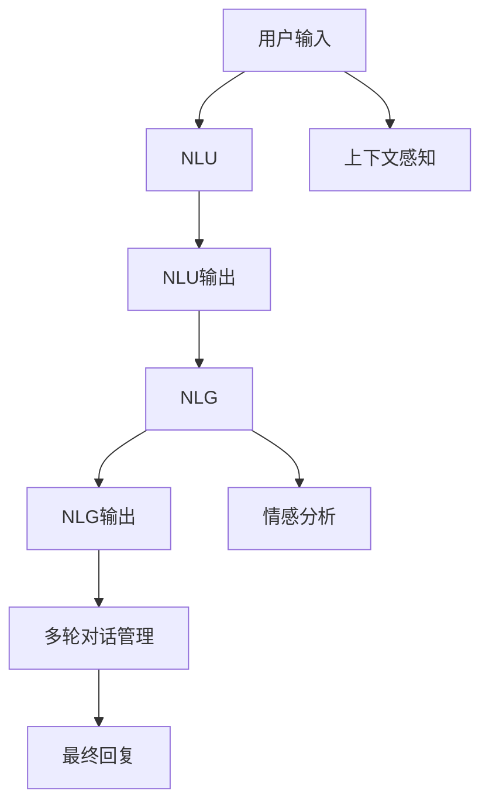
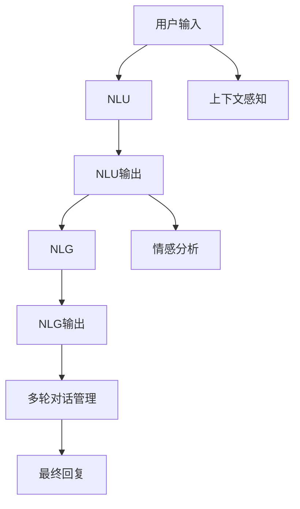
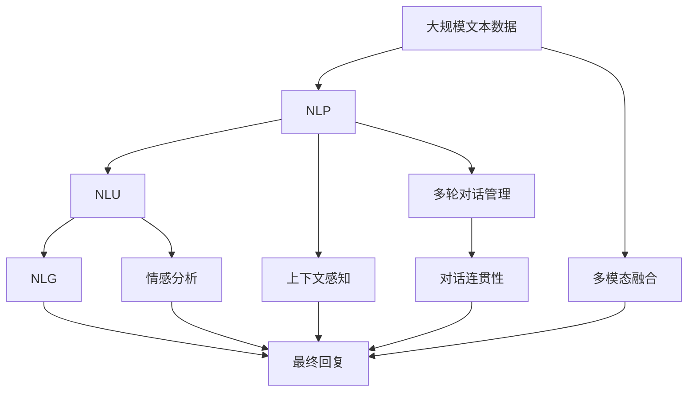

                 

# 聊天机器人初探（Chat Completion）

> 关键词：聊天机器人, 自然语言处理(NLP), 自然语言理解(NLU), 自然语言生成(NLG), 语言模型, 深度学习, 生成对抗网络(GAN), 多轮对话, 用户意图识别, 上下文感知, 情感分析, 多模态信息融合

## 1. 背景介绍

### 1.1 问题由来
随着人工智能技术的不断进步，聊天机器人作为一种自然语言处理（Natural Language Processing, NLP）应用，已经逐渐走入了人们的日常生活和工作。聊天机器人能够通过理解和生成自然语言，与用户进行实时互动，提供信息查询、问题解答、情感陪伴等多种服务。其应用场景涵盖了客户服务、在线咨询、教育培训、智能助手等多个领域，极大地提高了人机交互的效率和用户体验。

然而，尽管聊天机器人在语音识别、语义理解等方面取得了显著进展，但仍存在诸多局限性。例如，对话流畅度、上下文理解、多轮对话管理、情感响应等方面仍需进一步提升。这些问题直接影响了聊天机器人的实际应用效果，限制了其在更多复杂和多样化的场景中的应用。

本文将深入探讨聊天机器人的核心技术和关键算法，旨在通过多轮对话生成、上下文感知、情感分析等技术，提升聊天机器人的交互质量，探索其未来发展的方向。

### 1.2 问题核心关键点
聊天机器人的核心技术主要包括自然语言理解（Natural Language Understanding, NLU）和自然语言生成（Natural Language Generation, NLG）两大环节。NLU负责理解用户的意图和上下文，生成代表用户需求的符号表示；NLG则根据NLU的结果，生成符合语法和语义规则的自然语言回复。这两个环节紧密联系，缺一不可。

1. **自然语言理解（NLU）**：
   - 通过深度学习模型（如循环神经网络RNN、卷积神经网络CNN、Transformer等）对文本进行分词、词性标注、命名实体识别、情感分析等处理，生成用户意图的符号表示。
   - 通过向量表示和语义匹配，理解不同表达方式下的同一意图。
   - 实现上下文感知，理解多轮对话中的前后文关系。

2. **自然语言生成（NLG）**：
   - 利用语言模型（如RNN、LSTM、GPT等）生成自然语言回复。
   - 通过注意力机制和序列生成技术，提高回复的流畅度和连贯性。
   - 通过生成对抗网络（Generative Adversarial Network, GAN）等技术，生成更加逼真、多样化的回复。

聊天机器人的构建涉及多个环节，包括数据收集与预处理、模型选择与训练、对话生成与优化、多轮对话管理、情感响应等多个方面。本节将详细介绍这些核心技术，并探讨其背后的数学原理和算法流程。

### 1.3 问题研究意义
聊天机器人在提升用户体验、降低运营成本、扩展应用范围等方面具有重要意义：

1. **提升用户体验**：通过智能化的对话生成，聊天机器人能够快速响应用户需求，提供个性化服务，增强用户满意度和黏性。
2. **降低运营成本**：相较于人工客服，聊天机器人能够24小时不间断提供服务，减少人工成本和时间消耗。
3. **扩展应用范围**：聊天机器人在教育、医疗、金融等多个领域具有广泛应用前景，有助于推动行业数字化转型。
4. **技术创新**：多轮对话、上下文感知、情感分析等技术的探索，为NLP技术提供了新的研究方向和应用范式。
5. **产业升级**：聊天机器人技术的应用，能够赋能各行各业，提升效率和服务质量，推动产业升级。

通过深入研究聊天机器人的核心技术，不仅能够提升其实际应用效果，还能够在理论和应用层面探索更多创新可能性，为NLP技术的产业化进程提供有力支持。

## 2. 核心概念与联系

### 2.1 核心概念概述

为了更好地理解聊天机器人技术，本节将介绍几个密切相关的核心概念：

- **自然语言处理（NLP）**：涉及语言理解、语言生成、语言表示等多个环节，是聊天机器人技术的基础。
- **自然语言理解（NLU）**：通过机器学习模型对用户输入的自然语言进行理解，生成用户意图的符号表示。
- **自然语言生成（NLG）**：根据用户意图和上下文，生成符合语法和语义规则的自然语言回复。
- **语言模型**：用于建模文本序列的概率分布，是NLP任务中常用的基础模型。
- **深度学习**：通过神经网络模型进行复杂的模式识别和生成任务，是NLP技术的主要工具。
- **生成对抗网络（GAN）**：通过对抗训练生成更加逼真、多样化的回复。
- **多轮对话管理**：确保对话在多轮中保持连贯性，理解上下文关系。
- **情感分析**：分析用户的情感倾向，提高聊天机器人对情感的理解和响应能力。
- **多模态信息融合**：结合文本、语音、图像等多种信息源，提高聊天机器人的感知能力。

这些核心概念之间的逻辑关系可以通过以下Mermaid流程图来展示：



这个流程图展示了大语言模型微调过程中各个核心概念的关系和作用：

1. NLP是大语言模型的基础，包括NLU和NLG两个环节。
2. NLU负责理解用户输入的自然语言，生成符号表示。
3. NLG负责根据符号表示生成自然语言回复。
4. 上下文感知和多轮对话管理确保对话连贯性。
5. 情感分析提高对用户情感的理解和响应能力。
6. 多模态信息融合结合多种信息源，提升感知能力。

### 2.2 概念间的关系

这些核心概念之间存在着紧密的联系，形成了聊天机器人技术的完整生态系统。下面我通过几个Mermaid流程图来展示这些概念之间的关系。

#### 2.2.1 聊天机器人构建过程



这个流程图展示了聊天机器人构建的基本流程：

1. 用户输入自然语言后，NLU对其进行处理，生成符号表示。
2. NLG根据符号表示生成自然语言回复。
3. 上下文感知和多轮对话管理确保对话连贯性。
4. 情感分析提高对用户情感的理解和响应能力。
5. 最终回复通过多轮对话管理后，输出给用户。

#### 2.2.2 多轮对话管理


这个流程图展示了多轮对话管理的过程：

1. 用户输入自然语言后，NLU对其进行处理，生成符号表示。
2. NLG根据符号表示生成自然语言回复。
3. 上下文感知确保对话连贯性，理解多轮对话中的前后文关系。
4. 情感分析提高对用户情感的理解和响应能力。
5. 最终回复通过多轮对话管理后，输出给用户。

#### 2.2.3 情感分析



这个流程图展示了情感分析的过程：

1. 用户输入自然语言后，NLU对其进行处理，生成符号表示。
2. NLG根据符号表示生成自然语言回复。
3. 上下文感知确保对话连贯性，理解多轮对话中的前后文关系。
4. 情感分析提高对用户情感的理解和响应能力。
5. 最终回复通过多轮对话管理后，输出给用户。

### 2.3 核心概念的整体架构

最后，我们用一个综合的流程图来展示这些核心概念在大语言模型微调过程中的整体架构：



这个综合流程图展示了从预训练到微调，再到最终回复的完整过程。大规模文本数据经过NLP处理后，进入NLU和NLG环节，最终生成自然语言回复。上下文感知、情感分析和多轮对话管理等技术，在NLU和NLG环节中发挥作用，确保对话连贯性和情感响应能力。多模态信息融合则进一步提升感知能力，丰富回复内容。

通过这些流程图，我们可以更清晰地理解聊天机器人技术的各个环节和关键算法，为后续深入讨论具体的技术细节奠定基础。

## 3. 核心算法原理 & 具体操作步骤
### 3.1 算法原理概述

聊天机器人技术的核心算法主要集中在自然语言理解和自然语言生成两个环节。下面我们将分别介绍这两个环节的算法原理和具体操作步骤。

### 3.2 算法步骤详解

#### 3.2.1 自然语言理解（NLU）

**步骤1：数据预处理**
- 收集用户输入的自然语言数据，并进行清洗、分词、词性标注等预处理操作。
- 对数据集进行划分，分为训练集、验证集和测试集。

**步骤2：模型选择与训练**
- 选择合适的NLU模型（如RNN、LSTM、BERT等），并对其进行训练。
- 通过监督学习的方式，使用标注好的训练数据训练模型。

**步骤3：特征提取与符号表示**
- 将预处理后的文本数据输入模型，得到符号表示（如词向量、句向量等）。
- 使用注意力机制或Transformer模型，提取文本中的关键信息。

**步骤4：语义匹配与意图识别**
- 将符号表示输入到语义匹配模块中，生成意图表示。
- 通过向量相似度计算或深度学习模型，匹配意图与标签。

**步骤5：上下文感知与对话管理**
- 在多轮对话中，记录前一轮的对话历史，并作为上下文信息。
- 使用RNN或Transformer模型，理解上下文关系。
- 根据上下文信息调整意图识别和回复生成。

#### 3.2.2 自然语言生成（NLG）

**步骤1：数据预处理**
- 收集预定义的回复模板和语料库，并进行清洗和分词。
- 对数据集进行划分，分为训练集、验证集和测试集。

**步骤2：模型选择与训练**
- 选择合适的NLG模型（如RNN、LSTM、GPT等），并对其进行训练。
- 通过监督学习的方式，使用标注好的训练数据训练模型。

**步骤3：特征提取与语言生成**
- 将意图表示输入模型，生成自然语言回复。
- 使用注意力机制或Transformer模型，生成连贯、流畅的回复。

**步骤4：情感分析与响应生成**
- 对生成的回复进行情感分析，判断用户的情感倾向。
- 根据情感分析结果，调整回复内容，增强情感响应能力。

**步骤5：多模态信息融合**
- 结合语音、图像、视频等多种信息源，丰富回复内容。
- 通过多模态融合技术，提高聊天机器人的感知能力。

### 3.3 算法优缺点

聊天机器人技术的核心算法具有以下优点：

1. **高效性**：相较于人工客服，聊天机器人能够24小时不间断提供服务，显著降低人工成本。
2. **准确性**：通过深度学习模型，聊天机器人能够理解复杂的自然语言表达，提高回复的准确性。
3. **可扩展性**：通过微调和集成新的语言模型，聊天机器人能够适应多种语言和场景。
4. **可定制性**：通过自定义回复模板和语料库，聊天机器人能够适应不同的业务需求。

同时，这些算法也存在一些局限性：

1. **理解能力有限**：聊天机器人难以理解复杂的语言现象和语境，可能产生误解或不当回复。
2. **上下文感知不足**：多轮对话管理不够完善，可能出现对话中断或上下文丢失的情况。
3. **情感响应能力差**：情感分析技术仍需改进，难以准确捕捉用户的情感变化。
4. **多模态融合困难**：多种信息源的融合仍存在技术挑战，难以实现完美的信息整合。

尽管存在这些局限性，但通过不断的技术改进和创新，聊天机器人技术正逐步走向成熟，应用前景广阔。

### 3.4 算法应用领域

聊天机器人技术在多个领域都有广泛应用，包括但不限于：

1. **客户服务**：通过自动回答客户咨询，提高服务效率和客户满意度。
2. **在线教育**：提供智能辅导、作业批改等服务，提升教育质量。
3. **医疗咨询**：提供健康咨询、病情分析等服务，改善医疗体验。
4. **金融咨询**：提供理财建议、投资咨询等服务，增强用户粘性。
5. **娱乐社交**：提供情感陪伴、游戏互动等服务，丰富用户生活。
6. **智能助手**：提供日程管理、信息查询等服务，提升工作和生活效率。

随着技术的不断发展，聊天机器人技术在更多领域的应用前景将更加广阔，为各行各业带来新的创新和变革。

## 4. 数学模型和公式 & 详细讲解 & 举例说明

### 4.1 数学模型构建

#### 4.1.1 自然语言理解（NLU）

在NLU中，我们通常使用Transformer模型来处理自然语言序列。Transformer模型的核心组件包括自注意力机制（Self-Attention）和编码器-解码器结构（Encoder-Decoder）。

**编码器**：负责提取输入文本的关键信息。编码器由多个层组成，每层包含多头注意力机制和前向神经网络。

**解码器**：负责根据编码器输出的语义表示，生成意图表示。解码器同样由多个层组成，每层包含多头注意力机制和前向神经网络。

**注意力机制**：用于计算输入序列中不同位置的相关性，筛选出关键信息。注意力机制通过计算查询向量、键向量和值向量的点积，得到注意力权重，最终生成加权和的向量表示。

**多头注意力**：通过多个头（Head）并行计算注意力权重，提高模型的表征能力。

**前向神经网络**：用于对向量进行非线性变换，增强模型的表达能力。

**输出层**：将意图表示映射到不同的标签空间，进行意图分类。

#### 4.1.2 自然语言生成（NLG）

在NLG中，我们通常使用生成对抗网络（GAN）来生成自然语言回复。GAN由生成器和判别器两个部分组成，通过对抗训练生成更加逼真、多样化的回复。

**生成器**：负责从随机噪声中生成回复文本。生成器通过多层神经网络对噪声进行非线性变换，生成文本序列。

**判别器**：负责评估生成器生成的文本是否逼真。判别器通过多层神经网络对文本进行判别，输出真实文本的概率。

**对抗训练**：通过训练生成器和判别器，使生成器生成的文本越来越逼真，判别器越来越难以区分生成文本和真实文本。

#### 4.1.3 多模态信息融合

多模态信息融合通常使用时序多模态神经网络（Temporal Multimodal Neural Network），将文本、语音、图像等多种信息源进行融合。

**时序多模态神经网络**：将不同模态的信息进行编码，然后通过时序信息融合模块，将不同模态的信息进行整合。

**编码器**：将不同模态的信息分别编码成向量表示。

**时序信息融合模块**：通过LSTM或Transformer等模型，将不同模态的信息进行整合，生成融合向量。

**解码器**：将融合向量输入生成器，生成最终的回复文本。

### 4.2 公式推导过程

#### 4.2.1 自然语言理解（NLU）

假设输入文本序列为 $X=\{x_1,x_2,...,x_n\}$，意图表示为 $Y$。Transformer模型的自注意力机制公式如下：

$$
\text{Attention}(Q,K,V)=\text{softmax}\left(\frac{QK^T}{\sqrt{d_k}}\right)V
$$

其中 $Q$ 为查询向量，$K$ 为键向量，$V$ 为值向量。$d_k$ 为键向量的维度。

Transformer模型的多头注意力机制公式如下：

$$
\text{Multi-Head Attention}(Q,K,V)=\left[\text{Concat}(\text{Attention}(Q,K,V)^T)^T\right]W^O
$$

其中 $[\cdot]$ 表示按列拼接操作，$W^O$ 为输出层的权重矩阵。

Transformer模型的编码器和解码器结构公式如下：

$$
\text{Encoder}(X)=\text{Stack}(\text{Self-Attention},\text{Feed Forward})
$$

$$
\text{Decoder}(X,Y)=\text{Stack}(\text{Self-Attention},\text{Feed Forward},\text{Source Attention})
$$

其中 $\text{Self-Attention}$ 表示自注意力机制，$\text{Feed Forward}$ 表示前向神经网络，$\text{Source Attention}$ 表示源编码器的注意力机制。

#### 4.2.2 自然语言生成（NLG）

生成对抗网络（GAN）的训练过程如下：

1. 生成器 $G$ 从随机噪声 $z$ 生成文本序列 $x$。

$$
x=G(z)
$$

2. 判别器 $D$ 评估文本序列 $x$ 的真实性。

$$
y=D(x)
$$

3. 优化器 $O$ 更新生成器和判别器，使其满足对抗训练的要求。

$$
\min_G\max_D\mathcal{L}(D,G)=\mathbb{E}_{x\sim p_{\text{real}}}[\log D(x)]+\mathbb{E}_{z\sim p(z)}[\log(1-D(G(z)))]
$$

其中 $\mathcal{L}$ 为损失函数，$p_{\text{real}}$ 为真实文本的概率分布，$p(z)$ 为噪声的概率分布。

#### 4.2.3 多模态信息融合

时序多模态神经网络的信息融合公式如下：

$$
\text{Fusion}(\{X_i\})=\text{LSTM}(\{X_i\})W^O
$$

其中 $\{X_i\}$ 表示不同模态的信息源，$W^O$ 为输出层的权重矩阵。

### 4.3 案例分析与讲解

#### 4.3.1 自然语言理解（NLU）

假设我们有一个简单的问答系统，用于回答用户关于天气的问题。我们可以使用BERT模型作为NLU模型，其输入为“天气怎么样？”，输出为意图表示“天气查询”。

1. 数据预处理：收集历史问答数据，并进行清洗、分词等预处理操作。

2. 模型训练：使用BERT模型对预处理后的数据进行训练，得到意图表示“天气查询”。

3. 意图识别：输入用户输入“今天天气怎么样？”，通过BERT模型得到意图表示“天气查询”。

4. 上下文感知：结合用户历史查询记录“昨天下了一天的雨”，得到意图表示“天气查询”。

5. 回复生成：根据意图表示“天气查询”，生成回复“今天天气晴朗，温度26℃”。

#### 4.3.2 自然语言生成（NLG）

假设我们有一个简单的情感聊天机器人，用于回复用户的情感表达。我们可以使用GPT模型作为NLG模型，其输入为“我很伤心”，输出为回复“每个人都会经历悲伤，希望你能尽快好起来”。

1. 数据预处理：收集历史情感回复数据，并进行清洗、分词等预处理操作。

2. 模型训练：使用GPT模型对预处理后的数据进行训练，得到回复模板“每个人都会经历悲伤，希望你能尽快好起来”。

3. 情感分析：输入用户输入“我很伤心”，通过GPT模型得到情感分析结果“消极”。

4. 情感响应：根据情感分析结果“消极”，生成回复“每个人都会经历悲伤，希望你能尽快好起来”。

#### 4.3.3 多模态信息融合

假设我们有一个智能客服系统，用于处理用户的语音和文字咨询。我们可以使用时序多模态神经网络对语音和文字信息进行融合。

1. 数据预处理：收集用户的语音和文字咨询数据，并进行清洗、分词等预处理操作。

2. 模型训练：使用时序多模态神经网络对预处理后的数据进行训练，得到融合向量。

3. 信息融合：将语音和文字信息通过时序多模态神经网络融合，得到融合向量。

4. 回复生成：根据融合向量，生成回复“你的问题已收到，我会尽快处理”。

## 5. 项目实践：代码实例和详细解释说明

### 5.1 开发环境搭建

在进行项目实践前，我们需要准备好开发环境。以下是使用Python进行PyTorch开发的环境配置流程：

1. 安装Anaconda：从官网下载并安装Anaconda，用于创建独立的Python环境。

2. 创建并激活虚拟环境：
```bash
conda create -n pytorch-env python=3.8 
conda activate pytorch-env
```

3. 安装PyTorch：根据CUDA版本，从官网获取对应的安装命令。例如：
```bash
conda install pytorch torchvision torchaudio cudatoolkit=11.1 -c pytorch -c conda-forge
```

4. 安装Transformers库：
```bash
pip install transformers
```

5. 安装各类工具包：
```bash
pip install numpy pandas scikit-learn matplotlib tqdm jupyter notebook ipython
```

完成上述步骤后，即可在`pytorch-env`环境中开始项目实践。

### 5.2 源代码详细实现

下面我们以聊天机器人为例，给出使用Transformers库进行自然语言理解（NLU）和自然语言生成（NLG）的PyTorch代码实现。

首先，定义NLU和NLG模型的数据处理函数：

```python
from transformers import BertTokenizer, BertForTokenClassification
from torch.utils.data import Dataset, DataLoader
import torch

class QADataset(Dataset):
    def __init__(self, texts, tags, tokenizer):
        self.texts = texts
        self.tags = tags
        self.tokenizer = tokenizer
        
    def __len__(self):
        return len(self.texts)
    
    def __getitem__(self, item):
        text = self.texts[item]
        tag = self.tags[item]
        
        encoding = self.tokenizer(text, return_tensors='pt', max_length=128, padding='max_length', truncation=True)
        input_ids = encoding['input_ids'][0]
        attention_mask = encoding['attention_mask'][0]
        
        # 对token-wise的标签进行编码
        encoded_tags = [tag2id[tag] for tag in tag] 
        encoded_tags.extend([tag2id['O']] * (128 - len(encoded_tags)))
        labels = torch.tensor(encoded_tags, dtype=torch.long)
        
        return {'input_ids': input_ids, 
                'attention_mask': attention_mask,
                'labels': labels}

# 标签与id的映射
tag2id = {'O': 0, 'B': 1, 'I': 2}
id2tag = {v: k for k, v in tag2id.items()}

# 创建dataset
tokenizer = BertTokenizer.from_pretrained('bert-base-cased')

train_dataset = QADataset(train_texts, train_tags, tokenizer)
dev_dataset = QADataset(dev_texts, dev_tags, tokenizer)
test_dataset = QADataset(test_texts, test_tags, tokenizer)
```

然后，定义模型和优化器：

```python
from transformers import BertForTokenClassification, AdamW

model = BertForTokenClassification.from_pretrained('bert-base-cased', num_labels=len(tag2id))

optimizer = AdamW(model.parameters(), lr=2e-5)
```

接着，定义训练和评估函数：

```python
from torch.utils.data import DataLoader
from tqdm import tqdm
from sklearn.metrics import classification_report

device = torch.device('cuda') if torch.cuda.is_available() else torch.device('cpu')
model.to(device)

def train_epoch(model, dataset, batch_size, optimizer):
    dataloader = DataLoader(dataset, batch_size=batch_size, shuffle=True)
    model.train()
    epoch_loss = 0
    for batch in tqdm(dataloader, desc='Training

