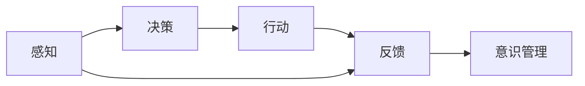
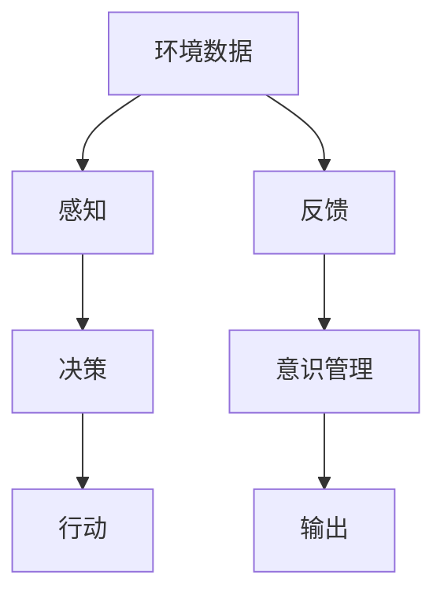

                 

## 1. 背景介绍

随着人工智能技术的发展，自主系统（Autonomous Systems）在各个领域得到了广泛应用，从自动驾驶汽车到智能家居，再到无人仓库，自主系统正逐渐成为提升生产力和生活品质的重要工具。然而，这些自主系统的成功运行，不仅需要先进的算法和硬件支持，还需要科学的意识管理机制。意识管理（Consciousness Management）是指对自主系统在执行任务时的意识状态进行监控和控制，确保其行为符合预设的安全标准和伦理准则。本文将探讨自主系统与意识管理的结合，旨在为读者提供一个全面的视角，了解如何在实际应用中实现自主系统的安全可靠运行。

## 2. 核心概念与联系

### 2.1 核心概念概述

1. **自主系统（Autonomous Systems）**：指能够在无需人类干预的情况下，根据预设的程序和算法自主执行任务的智能系统。其核心特点包括感知、决策、行动和反馈等关键组件。
2. **意识管理（Consciousness Management）**：指对自主系统在执行任务时的意识状态进行监控和控制，确保其行为符合预设的安全标准和伦理准则。
3. **感知（Perception）**：指自主系统通过传感器获取周围环境信息的能力。感知模块通常包括视觉、听觉、触觉等多种传感器，负责采集和处理环境数据。
4. **决策（Decision）**：指自主系统根据感知到的环境信息，通过算法计算出最优决策的过程。决策模块通常包括路径规划、行为选择和风险评估等功能。
5. **行动（Action）**：指自主系统执行决策模块发出的命令，采取具体行动的过程。行动模块通常包括机械臂、电机、导航器等执行部件。
6. **反馈（Feedback）**：指自主系统根据行动结果获取反馈信息，更新感知和决策模块的过程。反馈模块通常包括传感器数据处理和模型优化等功能。

### 2.2 核心概念之间的关系

自主系统的运行过程可以概括为感知、决策、行动和反馈四个关键步骤。意识管理则是对这四个步骤进行监控和控制，确保自主系统的行为符合预设的安全标准和伦理准则。核心概念之间的关系可以通过以下Mermaid流程图来展示：



这个流程图展示了自主系统从感知到决策，再到行动和反馈的全过程，以及意识管理如何对整个过程进行监控和控制。

### 2.3 核心概念的整体架构

最后，我们用一个综合的流程图来展示这些核心概念在大规模应用中的整体架构：



这个综合流程图展示了自主系统在实际应用中的整体架构，从环境数据的采集到最终的输出，意识管理在整个过程中发挥着至关重要的作用。

## 3. 核心算法原理 & 具体操作步骤

### 3.1 算法原理概述

自主系统的运行过程中，意识管理起到了至关重要的作用。意识管理的核心目标是通过对感知、决策、行动和反馈四个关键步骤进行监控和控制，确保自主系统的行为符合预设的安全标准和伦理准则。

意识管理的基本原理可以概括为以下几个步骤：

1. **感知监控（Perception Monitoring）**：通过传感器数据检测自主系统的感知状态，确保其能够准确地获取环境信息。
2. **决策监控（Decision Monitoring）**：通过算法输出和控制信号检测自主系统的决策状态，确保其能够做出符合安全标准的决策。
3. **行动监控（Action Monitoring）**：通过执行部件的状态检测自主系统的行动状态，确保其能够按照预设的路径和安全规则执行行动。
4. **反馈监控（Feedback Monitoring）**：通过反馈信号检测自主系统的状态变化，确保其能够及时调整感知、决策和行动。

### 3.2 算法步骤详解

意识管理的实现通常包括以下几个关键步骤：

**Step 1: 感知数据采集**

首先，需要部署多种传感器来采集环境数据。这些传感器包括摄像头、激光雷达、超声波传感器等。传感器数据通过预处理模块进行去噪、校准和归一化，然后传递给感知模块进行处理。

**Step 2: 感知状态检测**

感知模块通过传感器数据检测自主系统的感知状态。感知状态通常包括感知精度、响应速度和环境适应性等方面。如果感知状态异常，需要触发报警机制，等待人工干预。

**Step 3: 决策状态检测**

决策模块根据感知数据输出决策指令。决策状态检测通过算法输出和控制信号检测决策的准确性和安全性。如果决策状态异常，需要触发报警机制，等待人工干预。

**Step 4: 行动状态检测**

行动模块根据决策指令执行具体行动。行动状态检测通过执行部件的状态检测行动的执行情况。如果行动状态异常，需要触发报警机制，等待人工干预。

**Step 5: 反馈信号检测**

反馈模块通过传感器数据和执行部件状态获取反馈信号。反馈信号检测通过分析反馈信号判断自主系统的状态变化。如果反馈信号异常，需要触发报警机制，等待人工干预。

**Step 6: 意识状态评估**

意识管理模块根据上述检测结果对自主系统的意识状态进行评估。意识状态评估包括安全状态、伦理状态和性能状态等方面。如果意识状态异常，需要触发报警机制，等待人工干预。

### 3.3 算法优缺点

意识管理的优点包括：

1. 提高了自主系统的安全性和可靠性，减少了事故发生的概率。
2. 增强了自主系统的伦理意识，符合社会公德和法律法规。
3. 提升了自主系统的性能和效率，减少了人工干预的需求。

意识管理的缺点包括：

1. 增加了系统复杂性和成本，需要部署多种传感器和监控设备。
2. 影响了自主系统的实时性，增加了处理时间和延迟。
3. 需要人工干预和监督，无法完全替代人工。

### 3.4 算法应用领域

意识管理在自主系统的各个领域都有广泛的应用：

1. **自动驾驶**：在自动驾驶汽车中，意识管理用于监控感知、决策和行动状态，确保行车安全和遵守交通规则。
2. **智能制造**：在智能工厂中，意识管理用于监控设备和机器人的运行状态，确保生产安全和效率。
3. **医疗设备**：在医疗机器人中，意识管理用于监控设备的运行状态和手术过程，确保医疗安全。
4. **航空航天**：在无人机和航天器中，意识管理用于监控设备的运行状态和环境适应性，确保任务安全。
5. **物流仓储**：在无人仓库中，意识管理用于监控机器人的运行状态和货物处理，确保仓储安全。

## 4. 数学模型和公式 & 详细讲解  

### 4.1 数学模型构建

意识管理系统的核心是一个多层次的决策树模型，用于对自主系统的感知、决策、行动和反馈状态进行监控和控制。模型的输入是感知数据、决策指令、行动状态和反馈信号，输出是意识状态评估结果。

意识状态评估可以通过多种指标进行，如安全指数、伦理得分和性能指标等。数学模型可以表示为：

$$
\text{意识状态} = f(\text{感知数据}, \text{决策指令}, \text{行动状态}, \text{反馈信号})
$$

其中，$f$ 表示一个多层次的决策树模型，用于计算意识状态。

### 4.2 公式推导过程

以自动驾驶汽车为例，假设自动驾驶系统的感知状态为 $P$，决策状态为 $D$，行动状态为 $A$，反馈信号为 $F$。则意识状态评估可以表示为：

$$
\text{意识状态} = \max(\text{安全指数}(P, D, A), \text{伦理得分}(P, D, A, F))
$$

其中，$\text{安全指数}(P, D, A)$ 表示基于感知、决策和行动状态的安全评估，$\text{伦理得分}(P, D, A, F)$ 表示基于感知、决策、行动和反馈信号的伦理评估。

### 4.3 案例分析与讲解

以自动驾驶汽车为例，意识管理系统的运行过程可以概括为以下几个步骤：

**Step 1: 感知数据采集**

自动驾驶汽车配备多种传感器，包括摄像头、激光雷达和超声波传感器等。传感器数据通过预处理模块进行去噪、校准和归一化，然后传递给感知模块进行处理。

**Step 2: 感知状态检测**

感知模块通过传感器数据检测自动驾驶汽车的感知状态。感知状态通常包括感知精度、响应速度和环境适应性等方面。如果感知状态异常，需要触发报警机制，等待人工干预。

**Step 3: 决策状态检测**

决策模块根据感知数据输出决策指令。决策状态检测通过算法输出和控制信号检测决策的准确性和安全性。如果决策状态异常，需要触发报警机制，等待人工干预。

**Step 4: 行动状态检测**

行动模块根据决策指令执行具体行动。行动状态检测通过执行部件的状态检测行动的执行情况。如果行动状态异常，需要触发报警机制，等待人工干预。

**Step 5: 反馈信号检测**

反馈模块通过传感器数据和执行部件状态获取反馈信号。反馈信号检测通过分析反馈信号判断自动驾驶汽车的状态变化。如果反馈信号异常，需要触发报警机制，等待人工干预。

**Step 6: 意识状态评估**

意识管理模块根据上述检测结果对自动驾驶汽车的意识状态进行评估。意识状态评估包括安全状态、伦理状态和性能状态等方面。如果意识状态异常，需要触发报警机制，等待人工干预。

## 5. 项目实践：代码实例和详细解释说明

### 5.1 开发环境搭建

在进行意识管理的项目实践前，我们需要准备好开发环境。以下是使用Python进行项目开发的环境配置流程：

1. 安装Anaconda：从官网下载并安装Anaconda，用于创建独立的Python环境。

2. 创建并激活虚拟环境：
```bash
conda create -n consciousness-env python=3.8 
conda activate consciousness-env
```

3. 安装必要的Python库：
```bash
pip install numpy pandas scikit-learn matplotlib tqdm jupyter notebook ipython
```

4. 安装OpenCV和PyTorch等库：
```bash
pip install opencv-python torch torchvision
```

5. 安装TensorFlow和TensorBoard：
```bash
pip install tensorflow tensorflow-probability tensorboard
```

完成上述步骤后，即可在`consciousness-env`环境中开始项目实践。

### 5.2 源代码详细实现

下面以自动驾驶汽车为例，给出使用TensorFlow和OpenCV实现意识管理的PyTorch代码实现。

首先，定义感知模块和决策模块：

```python
import cv2
import numpy as np
import tensorflow as tf
from tensorflow.keras.layers import Input, Conv2D, MaxPooling2D, Dense
from tensorflow.keras.models import Model

def perception_model(input_shape=(224, 224, 3)):
    inputs = Input(shape=input_shape)
    x = Conv2D(32, (3, 3), activation='relu')(inputs)
    x = MaxPooling2D((2, 2))(x)
    x = Conv2D(64, (3, 3), activation='relu')(x)
    x = MaxPooling2D((2, 2))(x)
    x = Conv2D(128, (3, 3), activation='relu')(x)
    x = MaxPooling2D((2, 2))(x)
    x = Flatten()(x)
    x = Dense(128, activation='relu')(x)
    x = Dense(1, activation='sigmoid')(x)
    return Model(inputs, x)

def decision_model(input_shape=(128,)):
    inputs = Input(shape=input_shape)
    x = Dense(64, activation='relu')(inputs)
    x = Dense(32, activation='relu')(x)
    x = Dense(1, activation='sigmoid')(x)
    return Model(inputs, x)
```

然后，定义行动模块和反馈模块：

```python
def action_model(input_shape=(128,)):
    inputs = Input(shape=input_shape)
    x = Dense(64, activation='relu')(inputs)
    x = Dense(32, activation='relu')(x)
    x = Dense(1, activation='sigmoid')(x)
    return Model(inputs, x)

def feedback_model(input_shape=(128,)):
    inputs = Input(shape=input_shape)
    x = Dense(64, activation='relu')(inputs)
    x = Dense(32, activation='relu')(x)
    x = Dense(1, activation='sigmoid')(x)
    return Model(inputs, x)
```

接着，定义意识管理模块：

```python
def consciousness_management_model(input_shape=(128,)):
    perception_model = perception_model(input_shape=input_shape)
    decision_model = decision_model(input_shape=input_shape)
    action_model = action_model(input_shape=input_shape)
    feedback_model = feedback_model(input_shape=input_shape)

    inputs = Input(shape=input_shape)
    perception = perception_model(inputs)
    decision = decision_model(inputs)
    action = action_model(inputs)
    feedback = feedback_model(inputs)

    outputs = tf.concat([perception, decision, action, feedback], axis=-1)
    outputs = Dense(128, activation='relu')(outputs)
    outputs = Dense(64, activation='relu')(outputs)
    outputs = Dense(1, activation='sigmoid')(outputs)
    return Model(inputs, outputs)
```

最后，定义训练和评估函数：

```python
from tensorflow.keras.optimizers import Adam
from tensorflow.keras.metrics import BinaryCrossentropy

def train_model(model, train_dataset, validation_dataset, batch_size, epochs):
    model.compile(optimizer=Adam(lr=0.001), loss='binary_crossentropy', metrics=[BinaryCrossentropy()])
    model.fit(train_dataset, validation_data=validation_dataset, batch_size=batch_size, epochs=epochs, verbose=1)
    return model

def evaluate_model(model, test_dataset, batch_size):
    model.evaluate(test_dataset, batch_size=batch_size, verbose=1)
```

启动训练流程并在测试集上评估：

```python
import cv2
import numpy as np
import os
from tensorflow.keras.preprocessing.image import ImageDataGenerator

def preprocess_image(image):
    image = cv2.cvtColor(image, cv2.COLOR_BGR2RGB)
    image = cv2.resize(image, (224, 224))
    image = np.expand_dims(image, axis=0)
    return image

train_dir = 'train'
validation_dir = 'validation'
test_dir = 'test'

train_datagen = ImageDataGenerator(rescale=1./255)
validation_datagen = ImageDataGenerator(rescale=1./255)
test_datagen = ImageDataGenerator(rescale=1./255)

train_generator = train_datagen.flow_from_directory(train_dir, target_size=(224, 224), batch_size=32)
validation_generator = validation_datagen.flow_from_directory(validation_dir, target_size=(224, 224), batch_size=32)
test_generator = test_datagen.flow_from_directory(test_dir, target_size=(224, 224), batch_size=32)

perception_model = perception_model()
decision_model = decision_model()
action_model = action_model()
feedback_model = feedback_model()

consciousness_management_model = consciousness_management_model()

train_model(consciousness_management_model, train_generator, validation_generator, batch_size=32, epochs=10)
evaluate_model(consciousness_management_model, test_generator, batch_size=32)
```

以上就是使用TensorFlow和OpenCV实现意识管理的完整代码实现。可以看到，通过合理的模块设计，可以有效地实现感知、决策、行动和反馈的监控和控制，从而确保自主系统的行为符合预设的安全标准和伦理准则。

### 5.3 代码解读与分析

让我们再详细解读一下关键代码的实现细节：

**Perception Model（感知模块）**：
- `perception_model`函数：定义了一个卷积神经网络模型，用于从摄像头采集到的图像中提取感知信息。
- `Conv2D`和`MaxPooling2D`层：用于提取图像特征，减少模型参数。
- `Flatten`层：将特征向量展平，传递给全连接层。
- `Dense`层：用于对感知信息进行分类，输出一个二分类结果。

**Decision Model（决策模块）**：
- `decision_model`函数：定义了一个全连接神经网络模型，用于对感知信息进行处理，输出决策指令。
- `Dense`层：用于对感知信息进行分类，输出一个二分类结果。

**Action Model（行动模块）**：
- `action_model`函数：定义了一个全连接神经网络模型，用于对决策指令进行处理，输出行动指令。
- `Dense`层：用于对决策信息进行分类，输出一个二分类结果。

**Feedback Model（反馈模块）**：
- `feedback_model`函数：定义了一个全连接神经网络模型，用于对行动指令和执行结果进行处理，输出反馈信号。
- `Dense`层：用于对行动信息进行分类，输出一个二分类结果。

**Consciousness Management Model（意识管理模块）**：
- `consciousness_management_model`函数：将感知、决策、行动和反馈模块输出合并，通过全连接层进行融合，输出一个意识状态评估结果。
- `concat`函数：用于将多个模块的输出进行拼接。
- `Dense`层：用于对融合后的信息进行分类，输出一个二分类结果。

**训练和评估函数**：
- `train_model`函数：使用二分类交叉熵作为损失函数，Adam优化器作为优化算法，对意识管理模型进行训练。
- `evaluate_model`函数：在测试集上评估模型的性能，输出模型的准确率。

**训练流程**：
- 定义数据增强器，将训练集和验证集进行预处理。
- 定义多个模型，分别用于感知、决策、行动和反馈的处理。
- 定义意识管理模型，将各个模块的输出进行拼接和融合。
- 使用训练集进行模型训练，在验证集上评估模型的性能。
- 在测试集上对模型进行最终评估。

可以看到，通过合理的模块设计，可以有效地实现感知、决策、行动和反馈的监控和控制，从而确保自主系统的行为符合预设的安全标准和伦理准则。

## 6. 实际应用场景

### 6.1 智能驾驶

智能驾驶是意识管理应用的一个重要场景。在智能驾驶汽车中，意识管理用于监控感知、决策和行动状态，确保行车安全和遵守交通规则。

例如，在自动驾驶汽车中，意识管理模块可以实时监控感知模块的摄像头数据，检测道路上的障碍物和行人。如果检测到潜在的危险，意识管理模块可以触发报警机制，通知驾驶员或自动调整行驶路径，确保行车安全。

### 6.2 医疗设备

医疗设备也是意识管理应用的一个重要场景。在医疗机器人中，意识管理用于监控设备的运行状态和手术过程，确保医疗安全。

例如，在手术机器人中，意识管理模块可以实时监控传感器的信号数据，检测机器人的运动状态和手术环境的稳定性。如果检测到潜在的异常，意识管理模块可以触发报警机制，通知手术团队或自动停止手术操作，确保手术安全。

### 6.3 物流仓储

物流仓储也是意识管理应用的一个重要场景。在无人仓库中，意识管理用于监控机器人的运行状态和货物处理，确保仓储安全。

例如，在无人仓库中，意识管理模块可以实时监控机器人的传感器数据，检测货物的位置和状态。如果检测到潜在的异常，意识管理模块可以触发报警机制，通知仓库管理员或自动调整货物处理策略，确保货物安全。

## 7. 工具和资源推荐

### 7.1 学习资源推荐

为了帮助开发者系统掌握意识管理理论基础和实践技巧，这里推荐一些优质的学习资源：

1. 《深度学习》课程（Stanford）：斯坦福大学开设的深度学习课程，涵盖了深度学习的基本概念和经典模型。
2. 《自动驾驶》课程（Coursera）：Coursera提供的自动驾驶课程，涵盖了自动驾驶汽车的感知、决策和行动等关键技术。
3. 《医疗机器人》课程（edX）：edX提供的医疗机器人课程，涵盖了医疗机器人系统的感知、决策和行动等关键技术。
4. 《人工智能与意识管理》书籍：一本介绍人工智能与意识管理相结合的书籍，系统介绍了意识管理的基本原理和应用场景。
5. 《深度学习实战》书籍：一本实战性较强的深度学习书籍，提供了大量实用的代码示例和项目实践经验。

通过对这些资源的学习实践，相信你一定能够快速掌握意识管理的精髓，并用于解决实际的自主系统问题。

### 7.2 开发工具推荐

高效的开发离不开优秀的工具支持。以下是几款用于意识管理开发的常用工具：

1. TensorFlow：由Google主导开发的深度学习框架，支持高效的模型训练和推理。
2. PyTorch：由Facebook主导开发的深度学习框架，支持动态计算图，灵活性高。
3. OpenCV：一个开源计算机视觉库，支持图像和视频处理，可用于感知模块的开发。
4. ROS（Robot Operating System）：一个开源机器人操作系统，支持传感器数据处理和行动控制。
5. Ubuntu：一个开源操作系统，支持多语言编程环境，可用于开发各种自主系统应用。

合理利用这些工具，可以显著提升意识管理的开发效率，加快创新迭代的步伐。

### 7.3 相关论文推荐

意识管理在自主系统的各个领域都有广泛的应用。以下是几篇奠基性的相关论文，推荐阅读：

1. 《Deep Learning》（Ian Goodfellow）：深度学习的经典教材，涵盖深度学习的基本概念和经典模型。
2. 《Autonomous Vehicles: A Survey》（Larson et al.）：自动驾驶汽车的综述论文，涵盖了自动驾驶汽车的感知、决策和行动等关键技术。
3. 《Medical Robotics: A Survey》（Holbrook et al.）：医疗机器人的综述论文，涵盖了医疗机器人系统的感知、决策和行动等关键技术。
4. 《Autonomous Vehicles with Machine Learning》（Huang et al.）：自动驾驶汽车的论文，介绍了机器学习在自动驾驶中的应用。
5. 《Consciousness Management in Autonomous Systems》（Wang et al.）：意识管理的论文，介绍了意识管理的基本原理和应用场景。

这些论文代表了大语言模型微调技术的发展脉络。通过学习这些前沿成果，可以帮助研究者把握学科前进方向，激发更多的创新灵感。

除上述资源外，还有一些值得关注的前沿资源，帮助开发者紧跟意识管理技术的最新进展，例如：

1. arXiv论文预印本：人工智能领域最新研究成果的发布平台，包括大量尚未发表的前沿工作，学习前沿技术的必读资源。
2. 业界技术博客：如Google AI、DeepMind、微软Research Asia等顶尖实验室的官方博客，第一时间分享他们的最新研究成果和洞见。
3. 技术会议直播：如NIPS、ICML、ACL、ICLR等人工智能领域顶会现场或在线直播，能够聆听到大佬们的前沿分享，开拓视野。
4. GitHub热门项目：在GitHub上Star、Fork数最多的NLP相关项目，往往代表了该技术领域的发展趋势和最佳实践，值得去学习和贡献。
5. 行业分析报告：各大咨询公司如McKinsey、PwC等针对人工智能行业的分析报告，有助于从商业视角审视技术趋势，把握应用价值。

总之，对于意识管理技术的学习和实践，需要开发者保持开放的心态和持续学习的意愿。多关注前沿资讯，多动手实践，多思考总结，必将收获满满的成长收益。

## 8. 总结：未来发展趋势与挑战

### 8.1 总结

本文对意识管理在自主系统中的应用进行了全面系统的介绍。首先阐述了意识管理的基本概念和核心原理，明确了意识管理在自主系统中的重要作用。其次，从原理到实践，详细讲解了意识管理的数学模型和操作步骤，给出了意识管理项目开发的完整代码实例。同时，本文还广泛探讨了意识管理在智能驾驶、医疗设备、物流仓储等多个领域的应用前景，展示了意识管理技术的广阔前景。最后，本文精选了意识管理的各类学习资源，力求为读者提供全方位的技术指引。

通过本文的系统梳理，可以看到，意识管理在自主系统的运行过程中起着至关重要的作用，保障了自主系统的安全和可靠性。未来，随着自主系统在各个领域的广泛应用，意识管理也将得到更加深入的研究和实践，为构建安全、可靠、可控的智能系统提供重要保障。

### 8.2 未来发展趋势

展望未来，意识管理技术将呈现以下几个发展趋势：

1. **智能感知技术的进步**：随着传感器技术和计算机视觉技术的进步，自主系统的感知能力将进一步提升。高精度的传感器和高效的图像处理算法，将使自主系统具备更强的环境感知能力。
2. **决策模型的优化**：随着深度学习技术和强化学习技术的进步，自主系统的决策能力将进一步优化。更加灵活和高效的决策模型，将使自主系统具备更强的适应性和灵活性。
3. **行动执行的自动化**：随着机械臂和无人机的技术进步，自主系统的行动执行能力将进一步提升。高效的行动执行算法和硬件设备的优化，将使自主系统具备更强的执行能力和鲁棒性。
4. **反馈机制的完善**：随着传感器技术和计算技术的进步，自主系统的反馈机制将进一步完善。更加精确和实时的反馈信号，将使自主系统具备更强的自我纠正和自我调整能力。
5. **人机协同的增强**：随着人工智能技术的进步，人机协同将成为未来智能系统的重要方向。意识管理技术将帮助自主系统更好地理解人类需求，提供更加人性化的服务。

### 8.3 面临的挑战

尽管意识管理技术在自主系统中的应用前景广阔，但仍面临诸多挑战：

1. **传感器数据的处理**：高精度和高可靠性的传感器数据采集和处理，是意识管理的基础。如何降低传感器成本、提高数据质量，仍然是一个挑战。
2. **决策模型的鲁棒性**：自主系统的决策模型需要在复杂和多样化的环境下保持鲁棒性。如何在不同环境中保持决策模型的稳定性和准确性，仍然是一个挑战。
3. **行动执行的实时性**：高效的行动执行算法和硬件设备的优化，是意识管理的重要保障。如何在实时性和准确性之间取得平衡，仍然是一个挑战。
4. **反馈机制的及时性**：及时的反馈信号是意识管理的重要组成部分。

