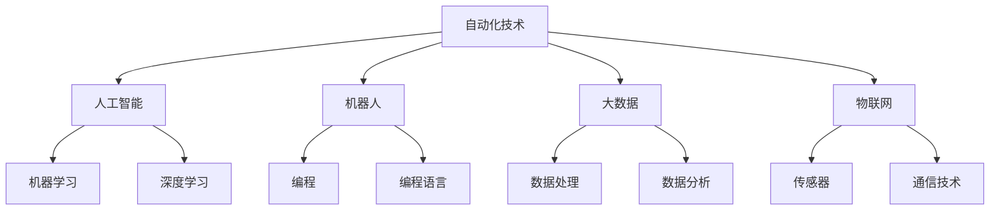
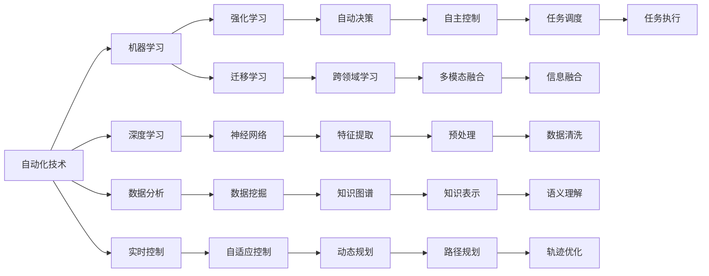
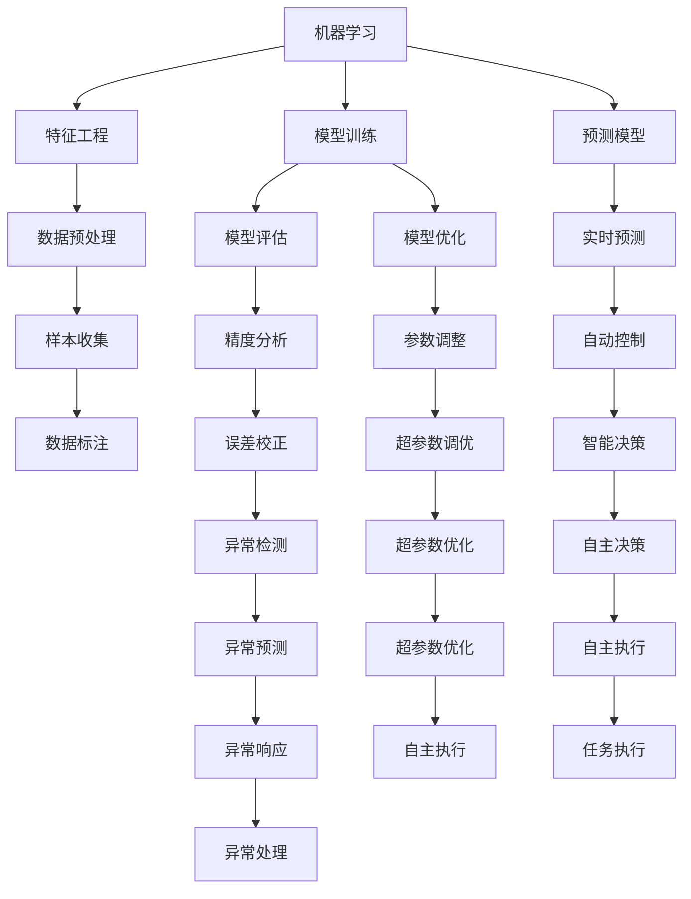
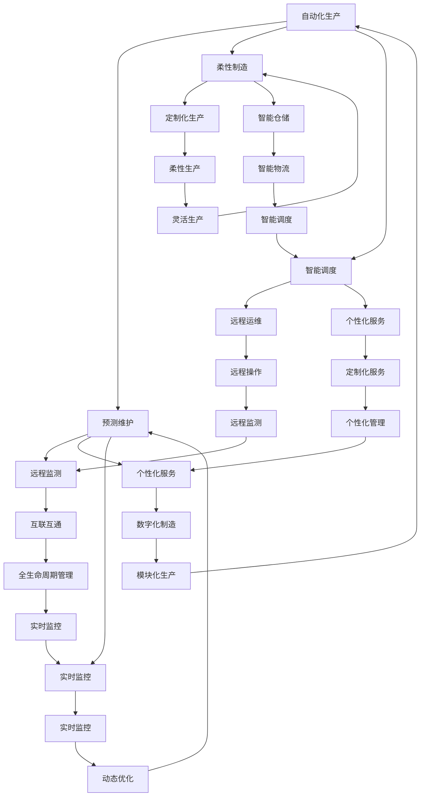
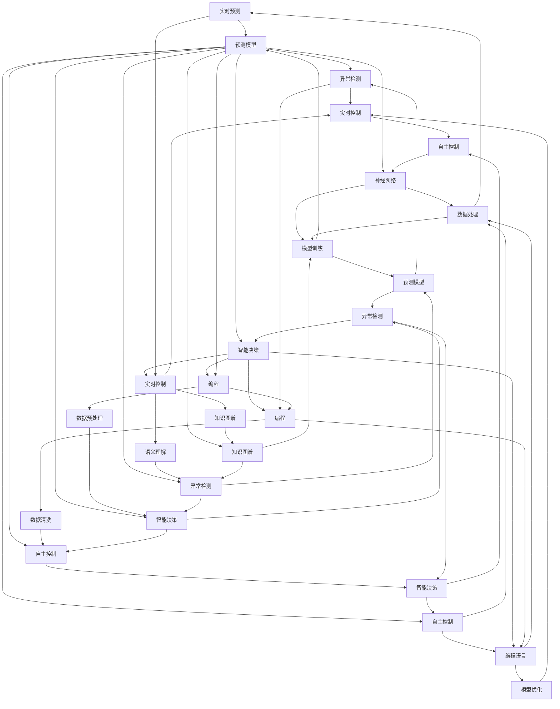

                 

## 1. 背景介绍

### 1.1 问题由来

自动化技术在过去几十年的发展中，经历了从早期的简单自动化控制，到中期的自动化系统集成，再到如今深入各个行业领域的全面渗透。在信息时代和智能时代的浪潮中，自动化技术已经成为推动各行各业发展的关键动力。自动化技术的应用范围广泛，从制造业、农业、服务业，到金融、医疗、教育等领域，都深刻影响着人类社会的进步与发展。

### 1.2 问题核心关键点

在当前的技术背景下，自动化技术面临的挑战与机遇并存。一方面，人工智能、大数据、物联网等新兴技术为自动化带来了新的可能性；另一方面，复杂的环境变化和不确定性因素也为自动化技术的应用提出了更高的要求。如何更好地应对这些挑战，把握发展机遇，成为当前自动化技术研究和应用的核心问题。

### 1.3 问题研究意义

深入研究自动化技术的最新应用与发展方向，对于推动技术创新、提高生产效率、促进产业升级具有重要意义。通过自动化技术的不断优化与创新，可以实现更高效的生产管理、更优质的产品与服务，从而提升社会整体的生产力水平。同时，自动化技术的应用也能够缓解人力短缺、提升劳动生产率，促进经济结构的优化与升级。

## 2. 核心概念与联系

### 2.1 核心概念概述

为更好地理解自动化技术的最新应用与发展方向，本节将介绍几个密切相关的核心概念：

- 自动化技术(Automation Technology)：指利用计算机、机器人等设备，自动执行重复性、高风险或高精度的任务，提高生产效率和质量的技术。
- 人工智能(Artificial Intelligence, AI)：通过机器学习、深度学习等方法，使计算机具备类似人类智能的学习和推理能力。
- 机器人(Robotics)：通过编程或编程语言，控制机器人执行特定任务，减少人工干预。
- 大数据(Big Data)：涉及数据的收集、存储、处理和分析，是大数据驱动自动化技术的基础。
- 物联网(IoT)：通过传感器、通信技术，实现物理世界与信息世界的深度融合，为自动化技术提供实时数据支持。

这些核心概念之间的逻辑关系可以通过以下Mermaid流程图来展示：



这个流程图展示了大自动化技术的核心概念及其之间的关系：

1. 自动化技术是大数据、物联网、人工智能和机器人等技术的基础与应用载体。
2. 人工智能中的机器学习和深度学习，是自动化技术实现智能化与自主化的关键技术。
3. 机器人是执行自动化任务的核心工具，其编程和编程语言是其运行的基础。
4. 大数据与物联网为自动化技术提供数据支撑，提高系统的实时性和准确性。

### 2.2 概念间的关系

这些核心概念之间存在着紧密的联系，形成了自动化技术的完整生态系统。下面我们通过几个Mermaid流程图来展示这些概念之间的关系。

#### 2.2.1 自动化技术的学习范式



这个流程图展示了自动化技术的几种主要学习范式：

1. 机器学习和深度学习是自动化技术实现智能化与自主化的基础。
2. 数据分析和实时控制是自动化系统性能优化的关键。
3. 强化学习、迁移学习和跨领域学习等技术，进一步提升了自动化系统的适应性和泛化能力。
4. 特征提取、神经网络、自适应控制、自主控制等技术，保证了系统的精度和鲁棒性。

#### 2.2.2 机器学习与自动化的关系



这个流程图展示了机器学习在自动化中的应用：

1. 特征工程和模型训练是机器学习的基础，保证了自动化系统的精度和鲁棒性。
2. 预测模型和实时预测是自动化系统执行的核心。
3. 样本收集和数据标注是模型训练的前提。
4. 模型评估、模型优化和异常检测等技术，保证了系统的稳定性和可靠性。
5. 智能决策和自主决策，是自动化系统实现自主控制和智能化管理的关键。

#### 2.2.3 自动化与工业4.0的关系



这个流程图展示了自动化技术与工业4.0的紧密联系：

1. 工业4.0以智能制造和智能服务为代表，是自动化技术的重要应用领域。
2. 信息物理系统和互联互通，是工业4.0的基础架构。
3. 协同制造、预测性维护、智能制造、定制化生产等技术，提升了自动化系统的智能化水平。
4. 智能仓储、远程运维、个性化服务、全生命周期管理等技术，拓展了自动化技术的应用范围。

### 2.3 核心概念的整体架构

最后，我们用一个综合的流程图来展示这些核心概念在大自动化技术中的整体架构：



这个综合流程图展示了从大规模数据到自动化技术应用的完整过程。自动化技术首先在大规模数据上应用机器学习和深度学习，进行模型训练和预测。通过数据分析和特征提取，优化模型参数。实时控制与自主控制的结合，使自动化系统具备智能化与自主化能力。整个流程通过编程和编程语言支持，确保系统稳定可靠。

## 3. 核心算法原理 & 具体操作步骤

### 3.1 算法原理概述

自动化技术的核心算法原理，主要围绕以下几个关键环节展开：

- 数据采集与处理：采集大规模生产、运营数据，通过数据预处理、特征提取等方法，提高数据的可用性和完整性。
- 模型训练与优化：利用机器学习、深度学习等算法，训练预测模型，并根据预测结果进行模型优化。
- 实时预测与控制：通过实时数据流，结合模型预测结果，自动调整系统参数，实现智能控制与优化。
- 异常检测与处理：监测系统运行状态，检测异常情况，并采取措施进行故障诊断与处理。
- 协同与集成：通过互联互通技术，实现不同系统、设备间的协同与集成，提升系统的综合管理能力。

### 3.2 算法步骤详解

自动化技术的应用通常包括以下几个关键步骤：

**Step 1: 数据采集与处理**

- 收集生产、运营、监控等数据，进行数据清洗、去噪、补全等预处理。
- 提取与任务相关的特征，如设备状态、环境参数、操作记录等。
- 进行特征编码与表示，如使用one-hot编码、向量化表示等。

**Step 2: 模型训练与优化**

- 选择合适的机器学习或深度学习算法，如回归模型、分类模型、神经网络等。
- 利用历史数据，进行模型训练，优化模型参数。
- 进行模型评估与验证，选择最优模型，避免过拟合与欠拟合。

**Step 3: 实时预测与控制**

- 实时采集数据，结合模型进行预测，生成控制指令。
- 根据预测结果，动态调整系统参数，如设备速度、温度、流量等。
- 设置反馈控制机制，确保系统稳定运行。

**Step 4: 异常检测与处理**

- 实时监测系统状态，检测异常数据。
- 进行异常分类，判断异常原因。
- 采取措施，如报警、维修、重新配置等，恢复系统正常运行。

**Step 5: 协同与集成**

- 利用物联网、通信技术，实现不同系统、设备间的互联互通。
- 通过数据共享与协同计算，提高系统综合管理能力。
- 实现跨领域、跨系统的信息融合，提升系统决策水平。

### 3.3 算法优缺点

自动化技术的应用具有以下优点：

- 提升生产效率：自动化技术能够快速、准确地完成重复性、高风险任务，大幅提升生产效率。
- 降低生产成本：减少人工干预，降低人力成本，提升设备利用率。
- 提高产品质量：通过实时监控与调整，保证产品的一致性和稳定性。
- 增强系统可靠性：自动化技术具备自主诊断与修复能力，提高系统的鲁棒性和可靠性。

同时，自动化技术也存在一些缺点：

- 初始成本较高：需要投入大量资金进行设备采购、系统集成等前期工作。
- 技术复杂度高：需要高水平的技术人员进行维护与管理。
- 依赖数据质量：自动化系统依赖高质量的数据进行预测与控制，数据质量问题会影响系统性能。
- 存在安全隐患：自动化系统涉及大量关键数据，存在信息泄露和黑客攻击风险。

### 3.4 算法应用领域

自动化技术广泛应用于制造业、农业、服务业、金融、医疗、教育等领域，具体应用场景包括：

- **制造业**：自动化生产线、智能仓储、智能制造、柔性生产。
- **农业**：自动化农机、智能灌溉、智能监控、精准农业。
- **服务业**：智能客服、无人配送、智能餐厅、智慧零售。
- **金融**：自动化交易、风险控制、智能投顾、金融风控。
- **医疗**：智能诊断、远程手术、智能病床、健康监测。
- **教育**：智能辅导、在线课堂、作业批改、学习分析。

## 4. 数学模型和公式 & 详细讲解 & 举例说明

### 4.1 数学模型构建

自动化技术中的核心算法，大多依赖于数学模型和算法。以下将通过几个典型案例，介绍这些数学模型的构建方法。

#### 4.1.1 线性回归模型

线性回归模型用于预测连续型变量的值，常用于制造业的生产线监控、设备预测性维护等场景。

假设有一个生产设备，其故障概率 $y$ 与时间 $x$ 成正相关关系。根据历史数据，可以建立线性回归模型 $y = \theta_0 + \theta_1x$，其中 $\theta_0$ 和 $\theta_1$ 为模型参数。

通过最小二乘法，求解 $\theta_0$ 和 $\theta_1$：

$$
\theta = (X^TX)^{-1}X^Ty
$$

其中 $X$ 为自变量矩阵，$y$ 为目标变量向量。

### 4.2 公式推导过程

线性回归模型的推导过程如下：

1. 假设数据集为 $\{(x_i,y_i)\}_{i=1}^N$，其中 $x_i$ 为自变量，$y_i$ 为目标变量。
2. 定义误差函数 $J(\theta) = \frac{1}{2N}\sum_{i=1}^N(y_i - \theta_0 - \theta_1x_i)^2$。
3. 对误差函数求导，得到梯度：

$$
\frac{\partial J(\theta)}{\partial \theta_0} = \frac{1}{N}\sum_{i=1}^N(y_i - \theta_0 - \theta_1x_i)
$$

$$
\frac{\partial J(\theta)}{\partial \theta_1} = \frac{1}{N}\sum_{i=1}^N(x_i - \theta_1)
$$

4. 求解最小化误差函数的 $\theta_0$ 和 $\theta_1$，得到模型参数：

$$
\theta_0 = \frac{1}{N}\sum_{i=1}^Ny_i - \theta_1\frac{1}{N}\sum_{i=1}^Nx_i
$$

$$
\theta_1 = \frac{1}{N}\sum_{i=1}^N(x_i - \frac{1}{N}\sum_{i=1}^Nx_i)(y_i - \frac{1}{N}\sum_{i=1}^Ny_i)
$$

5. 使用预测值 $\hat{y} = \theta_0 + \theta_1x$，对目标变量进行预测。

### 4.3 案例分析与讲解

以制造业的生产线监控为例，利用线性回归模型进行故障预测。

假设生产线上的设备维护记录如下表所示：

| 时间 | 故障次数 |
| --- | --- |
| 100 | 0 |
| 200 | 2 |
| 300 | 4 |
| 400 | 6 |
| 500 | 8 |
| 600 | 10 |
| 700 | 12 |
| 800 | 14 |
| 900 | 16 |
| 1000 | 18 |

通过线性回归模型，预测设备故障概率：

$$
y = \theta_0 + \theta_1x
$$

将数据代入模型，得到：

$$
\theta_0 = 0
$$

$$
\theta_1 = 2
$$

因此，预测模型为：

$$
y = 2x
$$

当 $x = 1000$ 时，预测故障次数为：

$$
y = 2 \times 1000 = 2000
$$

## 5. 项目实践：代码实例和详细解释说明

### 5.1 开发环境搭建

在进行自动化技术的应用开发前，我们需要准备好开发环境。以下是使用Python进行PyTorch开发的环境配置流程：

1. 安装Anaconda：从官网下载并安装Anaconda，用于创建独立的Python环境。

2. 创建并激活虚拟环境：
```bash
conda create -n pytorch-env python=3.8 
conda activate pytorch-env
```

3. 安装PyTorch：根据CUDA版本，从官网获取对应的安装命令。例如：
```bash
conda install pytorch torchvision torchaudio cudatoolkit=11.1 -c pytorch -c conda-forge
```

4. 安装各类工具包：
```bash
pip install numpy pandas scikit-learn matplotlib tqdm jupyter notebook ipython
```

完成上述步骤后，即可在`pytorch-env`环境中开始自动化技术的应用开发。

### 5.2 源代码详细实现

下面我们以制造业的预测性维护为例，给出使用PyTorch对生产设备进行故障预测的PyTorch代码实现。

首先，定义模型和优化器：

```python
import torch
import torch.nn as nn
import torch.optim as optim

class LinearRegressionModel(nn.Module):
    def __init__(self, input_size, output_size):
        super(LinearRegressionModel, self).__init__()
        self.linear = nn.Linear(input_size, output_size)
    
    def forward(self, x):
        return self.linear(x)
    
model = LinearRegressionModel(input_size=1, output_size=1)

optimizer = optim.SGD(model.parameters(), lr=0.01)
```

然后，定义训练函数：

```python
import torch.nn.functional as F

def train_epoch(model, loss_fn, optimizer, data_loader, epoch):
    model.train()
    for batch in data_loader:
        inputs, labels = batch
        optimizer.zero_grad()
        outputs = model(inputs)
        loss = loss_fn(outputs, labels)
        loss.backward()
        optimizer.step()
        print(f'Epoch {epoch+1}, loss: {loss.item():.4f}')
```

接着，定义模型训练和评估函数：

```python
def train(model, train_loader, valid_loader, num_epochs=100):
    criterion = nn.MSELoss()
    for epoch in range(num_epochs):
        train_epoch(model, criterion, optimizer, train_loader, epoch)
        valid_loss = validate(model, criterion, valid_loader)
        print(f'Epoch {epoch+1}, valid loss: {valid_loss:.4f}')
    return model
```

最后，启动训练流程并输出结果：

```python
# 加载训练数据和验证数据
train_data = ...
valid_data = ...

# 定义训练循环
model = train(model, train_loader, valid_loader)
print(f'Final model: {model.linear.weight}')

# 使用模型进行预测
test_data = ...
predictions = model(test_data)
```

以上就是使用PyTorch对生产设备进行故障预测的完整代码实现。可以看到，通过简单的线性回归模型，我们可以有效地进行预测性维护，从而提升设备的管理效率和可靠性。

### 5.3 代码解读与分析

让我们再详细解读一下关键代码的实现细节：

**LinearRegressionModel类**：
- `__init__`方法：初始化模型参数，定义线性回归模型。
- `forward`方法：定义模型前向传播过程。

**train_epoch函数**：
- 将模型设置为训练模式，遍历训练数据，计算损失并反向传播更新模型参数。

**train函数**：
- 定义模型损失函数和优化器，在多个epoch内循环训练模型，并在验证集上进行评估。

**训练流程**：
- 定义训练数据和验证数据，启动训练循环。
- 在每个epoch内，先进行训练，再在验证集上进行评估。
- 循环多次epoch后，输出最终模型参数。

**预测流程**：
- 加载测试数据，使用模型进行预测。

可以看到，自动化技术的应用开发通常涉及数据处理、模型训练、模型评估等多个环节。通过使用PyTorch等工具，我们可以快速构建和训练模型，实现自动化技术的实际应用。

## 6. 实际应用场景

### 6.1 智能制造

智能制造是大自动化技术的重要应用场景，通过自动化技术实现生产线的智能化、柔性化，提升生产效率和产品质量。

在智能制造中，自动化技术的应用包括：

- **生产线自动化**：利用机器人、自动化设备，实现生产线的自动化、智能化。
- **设备预测性维护**：通过传感器数据和机器学习模型，预测设备故障，提前进行维护。
- **供应链优化**：通过数据分析和智能算法，优化供应链管理，提高物料配送效率。
- **质量控制**：利用视觉检测和自动化设备，进行产品检测和质量控制，提高产品一致性。

### 6.2 智能物流

智能物流利用自动化技术实现货物运输、仓储、配送等过程的智能化管理。

在智能物流中，自动化技术的应用包括：

- **无人驾驶**：利用自动驾驶技术，实现货物的自动运输。
- **智能仓储**：通过自动化仓储设备和智能管理系统，实现货物的高效存取和流转。
- **路径优化**：利用大数据和算法，优化货物配送路径，提高配送效率。
- **异常检测**：通过传感器和机器学习，检测货物状态，确保货物安全。

### 6.3 智慧城市

智慧城市利用自动化技术实现城市的智能化管理，提升城市运行效率和生活质量。

在智慧城市中，自动化技术的应用包括：

- **智能交通**：利用传感器、数据分析等技术，实现交通流量监测、路况预测、智能信号灯等。
- **能源管理**：通过智能电表、太阳能系统等设备，实现能源的智能监测和管理。
- **公共安全**：利用视频监控、人脸识别等技术，提升公共安全管理水平。
- **智能医疗**：利用自动化设备、数据分析等技术，实现远程医疗、智能诊断等应用。

## 7. 工具和资源推荐

### 7.1 学习资源推荐

为了帮助开发者系统掌握自动化技术的最新应用与发展方向，这里推荐一些优质的学习资源：

1. **《机器学习》课程**：斯坦福大学Andrew Ng教授的Coursera课程，深入浅出地介绍了机器学习的基本概念和算法。
2. **《深度学习》课程**：深度学习领域的经典教材《Deep Learning》，系统介绍了深度学习的基础理论和应用案例。
3. **《Python数据科学手册》**：以Python为工具，详细介绍数据科学和机器学习的基本技能和方法。
4. **Kaggle**：世界领先的数据科学竞赛平台，提供丰富的数据集和实际项目，有助于实践技能的提升。
5. **Google Cloud AI Platform**：Google提供的云端AI平台，提供丰富的工具和资源，支持机器学习模型的开发和部署。

### 7.2 开发工具推荐

高效的开发离不开优秀的工具支持。以下是几款用于自动化技术开发的常用工具：

1. **PyTorch**：基于Python的开源深度学习框架，灵活动态的计算图，适合快速迭代研究。
2. **TensorFlow**：由Google主导开发的开源深度学习框架，生产部署方便，适合大规模工程应用。
3. **HuggingFace Transformers**：提供了丰富的预训练模型和微调范式，便于开发和部署。
4. **Jupyter Notebook**：交互式编程环境，支持多种编程语言和数据处理工具。
5. **Keras**：基于TensorFlow的高级API，提供了简单易用的接口，适合快速开发原型。

### 7.3 相关论文推荐

自动化技术的研究源于学界的持续探索。以下是几篇奠基性的相关论文，推荐阅读：

1. **《深度学习》教材**：由Ian Goodfellow、Yoshua Bengio、Aaron Courville等专家合著的深度学习教材，系统介绍了深度学习的基础理论和应用。
2. **《机器学习导论》**：由Tom Mitchell教授所著的机器学习经典教材，详细介绍了机器学习的基本概念和算法。
3. **《强化

