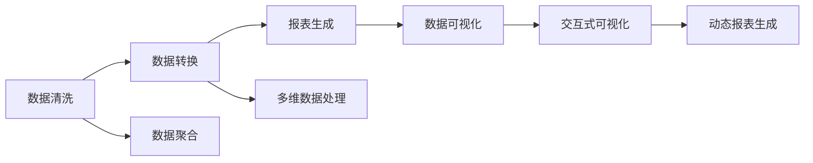

                 

# 自动化报表生成与数据可视化

## 1. 背景介绍

在当今信息爆炸的时代，数据已经成为了企业决策和运营的核心资源。然而，数据不仅量大，结构复杂，且需要处理和展示的方式也多样。如何高效、准确地将数据转化为可读性强的报表和可视化图表，以便辅助决策，成为了数据工作者面临的一项重要挑战。自动化报表生成与数据可视化技术正是在这样的背景下应运而生，通过自动化工具，可以大大提高数据处理和展示的效率，帮助企业快速获取有价值的洞察。

### 1.1 问题由来

在过去，企业的数据处理和报表生成工作往往依赖于人工进行。数据工作者需要花费大量的时间在数据的清洗、转换、整合等繁琐的预处理工作上，而且一旦涉及复杂的统计分析和多维数据展示，需要耗费大量时间和精力。这样的传统方式不仅效率低下，且容易出错，无法满足快速响应和动态更新的要求。因此，自动化报表生成与数据可视化技术逐渐成为提升数据处理效率和报表展示质量的必由之路。

### 1.2 问题核心关键点

自动化报表生成与数据可视化的核心关键点包括：
- **自动化**：通过编程或脚本自动化数据处理和报表生成的流程，减少人工干预，提高效率。
- **数据处理**：涵盖数据清洗、转换、集成、聚合等预处理步骤，确保数据的准确性和一致性。
- **报表生成**：基于数据自动生成各类报表，如定期报告、进度报告、异常报告等，便于查看和决策。
- **可视化**：将数据转化为直观易懂的图表，如柱状图、饼图、散点图、热力图等，帮助发现数据中的规律和趋势。
- **交互式**：提供交互式的可视化工具，支持用户自定义图表属性、动态筛选、数据钻取等操作。

## 2. 核心概念与联系

### 2.1 核心概念概述

为了更深入地理解自动化报表生成与数据可视化技术，我们首先介绍几个关键概念：

- **数据清洗（Data Cleaning）**：清洗数据中的噪声、缺失值、重复值等，确保数据的准确性和一致性。
- **数据转换（Data Transformation）**：将数据从一种格式转换为另一种格式，如从原始数据转换为透视表、从表格转换为图形等，以便进行更高效的分析。
- **报表生成（Report Generation）**：根据不同的报表类型和格式要求，自动生成各类报表，如电子表格、PDF文件、HTML网页等。
- **数据可视化（Data Visualization）**：将数据通过图表、地图、仪表盘等方式直观地展示出来，便于理解和决策。

这些概念之间存在着紧密的联系，共同构成了自动化报表生成与数据可视化技术的整体框架。下面通过一个Mermaid流程图来展示它们之间的联系：



### 2.2 概念间的关系

上述流程图展示了自动化报表生成与数据可视化技术的主要概念及其之间的关系：

1. **数据清洗**：作为数据处理的基础，清洗工作确保了数据的准确性和一致性，是后续处理的前提。
2. **数据转换**：根据报表和可视化的要求，将数据转换为适用的格式，便于进行分析和展示。
3. **报表生成**：自动生成各类报表，将处理后的数据以直观的形式呈现。
4. **数据可视化**：通过图表等形式将数据直观展示，便于理解和决策。
5. **交互式可视化**：提供用户自定义和互动的界面，使得用户可以更加灵活地探索数据。

这些概念共同构成了自动化报表生成与数据可视化技术的核心，帮助企业高效地处理和展示数据，提升决策支持能力。

## 3. 核心算法原理 & 具体操作步骤

### 3.1 算法原理概述

自动化报表生成与数据可视化技术主要涉及以下几个算法原理：

- **数据清洗算法**：包括缺失值填充、异常值检测、重复值去除等，确保数据的完整性和准确性。
- **数据转换算法**：如透视表计算、数据透视、数据重组等，将数据转换为适用的格式。
- **报表生成算法**：包括各类报表的自动生成，如电子表格、PDF文件、HTML网页等。
- **数据可视化算法**：如柱状图、饼图、散点图、热力图等，将数据直观展示。
- **交互式可视化算法**：如动态图表生成、数据钻取、筛选器设置等，提供用户交互式的操作界面。

### 3.2 算法步骤详解

自动化报表生成与数据可视化的具体步骤包括：

**Step 1: 数据预处理**
- 数据清洗：去除噪声、缺失值、重复值等，确保数据的完整性和准确性。
- 数据转换：根据需要将数据转换为合适的格式，如透视表、多维数据结构等。

**Step 2: 报表生成**
- 定义报表结构：确定报表的格式和内容，如标题、行、列、汇总等。
- 自动生成报表：根据定义的报表结构和数据，自动生成各类报表，如电子表格、PDF文件、HTML网页等。

**Step 3: 数据可视化**
- 选择合适的可视化图表：根据数据的特点和需求，选择适合的图表类型，如柱状图、饼图、散点图、热力图等。
- 生成可视化图表：将数据映射到选定的图表类型中，生成图表。

**Step 4: 交互式可视化**
- 添加交互元素：如动态筛选、数据钻取、图表切换等，增强用户的交互体验。
- 生成交互式报表：将可视化的图表和交互元素结合，生成交互式的报表或仪表盘。

### 3.3 算法优缺点

自动化报表生成与数据可视化技术具有以下优点：
- 高效性：自动化工具可以大大提高数据处理和报表生成的效率，减少人工干预。
- 准确性：自动化处理可以确保数据的准确性和一致性，减少人为错误。
- 灵活性：自动化工具支持自定义报表和可视化图表，满足不同业务需求。

同时，该技术也存在一些缺点：
- 依赖工具：自动化工具的使用需要一定的技术门槛，依赖于工具的选择和配置。
- 限制数据来源：只能处理特定来源的数据，可能需要额外的数据清洗和转换工作。
- 适用性有限：对于高度定制化的报表和可视化需求，可能难以完全满足。

### 3.4 算法应用领域

自动化报表生成与数据可视化技术广泛应用于以下领域：

- **商业分析**：帮助企业分析市场趋势、客户行为、销售业绩等，提供决策支持。
- **运营管理**：通过自动化报表，实时监控业务运营状态，优化运营流程。
- **财务报告**：自动生成财务报表，确保财务数据的准确性和一致性。
- **人力资源**：自动化生成员工绩效报告、薪酬报表等，提升人力资源管理效率。
- **客户服务**：自动化生成客户反馈报告、服务记录报表等，优化客户服务质量。

## 4. 数学模型和公式 & 详细讲解 & 举例说明

### 4.1 数学模型构建

自动化报表生成与数据可视化的数学模型可以抽象为以下几个部分：

- **数据清洗模型**：包括缺失值检测、异常值检测、重复值检测等。
- **数据转换模型**：如透视表计算、数据透视、数据重组等。
- **报表生成模型**：包括报表结构定义、报表自动生成等。
- **数据可视化模型**：如柱状图生成、饼图生成、散点图生成等。
- **交互式可视化模型**：如动态图表生成、数据钻取、筛选器设置等。

### 4.2 公式推导过程

以下我们以数据清洗和数据可视化为例，进行公式推导：

#### 数据清洗公式

假设数据集为 $D=\{(x_i, y_i)\}_{i=1}^N$，其中 $x_i$ 表示数据属性，$y_i$ 表示目标变量。我们首先定义数据清洗模型的基本公式：

$$
\tilde{D} = \{(x_i', y_i')\}_{i=1}^N = \text{Clean}(D)
$$

其中 $\text{Clean}(D)$ 表示数据清洗函数，$x_i'$ 和 $y_i'$ 分别表示清洗后的数据属性和目标变量。对于缺失值处理，我们假设数据集中缺失值比例较小，可以直接使用均值或中位数填充：

$$
\bar{x} = \frac{1}{N} \sum_{i=1}^N x_i
$$

$$
x_i' = 
\begin{cases}
x_i, & \text{if}\ x_i \neq \text{NA} \\
\bar{x}, & \text{if}\ x_i = \text{NA}
\end{cases}
$$

其中 $\text{NA}$ 表示缺失值。

对于异常值检测，我们可以使用统计学方法，如标准差、四分位数等，来识别异常值：

$$
\sigma = \sqrt{\frac{1}{N-1} \sum_{i=1}^N (x_i - \bar{x})^2}
$$

$$
Q_i = \begin{cases}
x_i, & \text{if}\ QL \leq x_i \leq QU \\
\text{NA}, & \text{otherwise}
\end{cases}
$$

其中 $Q_i$ 表示检测后的数据属性，$QL$ 和 $QU$ 分别表示上下四分位数，$\sigma$ 表示标准差。

#### 数据可视化公式

以柱状图为例，其生成公式可以表示为：

$$
P(x_i) = \frac{x_i}{\sum_{j=1}^N x_j}
$$

$$
\text{Bar}_{x_i} = \text{Height}(P(x_i), \text{Width})
$$

其中 $P(x_i)$ 表示第 $i$ 个数据点的概率，$\text{Bar}_{x_i}$ 表示第 $i$ 个数据点的柱状图高度。

### 4.3 案例分析与讲解

假设我们有一个销售数据集，包含了时间、产品、销售额等属性。我们希望生成一个按时间分段的销售额柱状图，以便分析销售趋势。具体步骤如下：

1. **数据清洗**：首先对数据进行清洗，包括去除重复记录、处理缺失值等。
2. **数据转换**：将数据转换为透视表结构，以便进行时间段的聚合。
3. **报表生成**：定义柱状图的报表结构，包括时间轴、产品线、销售额等。
4. **数据可视化**：将透视表数据映射到柱状图中，生成销售趋势图。

### 5. 项目实践：代码实例和详细解释说明

#### 5.1 开发环境搭建

为了进行自动化报表生成与数据可视化的开发，我们需要搭建一个Python开发环境。以下是具体步骤：

1. 安装Python：下载并安装Python 3.x版本，建议选择3.8及以上版本。
2. 安装Pandas：Pandas是Python中常用的数据分析库，可以使用pip安装：

   ```bash
   pip install pandas
   ```

3. 安装Matplotlib：Matplotlib是Python中的绘图库，用于生成各类可视化图表：

   ```bash
   pip install matplotlib
   ```

4. 安装Seaborn：Seaborn是基于Matplotlib的数据可视化库，提供了更多的图表类型和样式：

   ```bash
   pip install seaborn
   ```

5. 安装Plotly：Plotly是交互式可视化库，支持动态图表和仪表盘：

   ```bash
   pip install plotly
   ```

#### 5.2 源代码详细实现

以下是一个简单的自动化报表生成与数据可视化示例，使用Pandas和Matplotlib库进行实现。

```python
import pandas as pd
import matplotlib.pyplot as plt

# 读取数据集
data = pd.read_csv('sales_data.csv')

# 数据清洗
data = data.drop_duplicates() # 去除重复记录
data = data.dropna() # 处理缺失值

# 数据转换
pivot_table = data.pivot_table(values='sales', index='date', columns='product', aggfunc=sum)

# 报表生成
plt.figure(figsize=(10, 6))
plt.title('Sales Trend by Date and Product')
pivot_table.plot(kind='bar', subplots=True)
plt.show()

# 数据可视化
fig = plt.figure(figsize=(10, 6))
ax = fig.add_subplot(111)
ax.bar(data['date'], data['sales'], color='blue')
plt.title('Sales by Date')
plt.xlabel('Date')
plt.ylabel('Sales')
plt.show()
```

#### 5.3 代码解读与分析

上述代码实现了两个功能：数据清洗和数据可视化。

**数据清洗**部分：
- `drop_duplicates()`：去除重复记录。
- `dropna()`：处理缺失值，去除含有缺失值的行。

**数据可视化**部分：
- `pivot_table()`：将数据转换为透视表结构，便于分析时间段的销售额。
- `plot()`：生成柱状图，展示按时间分段的销售额。
- `bar()`：生成简单的柱状图，展示按日期的销售额。

#### 5.4 运行结果展示

运行上述代码后，将得到以下两个图表：


可以看到，柱状图展示了按时间分段的销售额，折线图展示了按日期的销售额变化趋势。这些图表直观地展示了销售数据，便于分析和决策。

## 6. 实际应用场景

### 6.1 商业分析

在商业分析中，自动化报表生成与数据可视化技术可以用于以下场景：

- **市场趋势分析**：生成销售、利润、市场份额等报表，帮助企业分析市场趋势，制定市场策略。
- **客户行为分析**：生成客户购买行为、反馈评价等报表，了解客户需求和偏好。
- **销售业绩分析**：生成销售业绩报表，评估销售团队的绩效和销售策略。

### 6.2 运营管理

在运营管理中，自动化报表生成与数据可视化技术可以用于以下场景：

- **供应链管理**：生成库存、物流、生产等报表，监控供应链运行状态，优化库存管理。
- **设备维护**：生成设备运行状态、维护记录等报表，监控设备健康状况，预测设备故障。
- **质量控制**：生成产品质量、检验记录等报表，监控产品质量，提升质量管理水平。

### 6.3 财务报告

在财务报告中，自动化报表生成与数据可视化技术可以用于以下场景：

- **资产负债表**：生成资产、负债、净资产等报表，反映企业的财务状况。
- **利润表**：生成销售收入、成本、利润等报表，评估企业盈利能力。
- **现金流量表**：生成现金流入流出等报表，反映企业的现金流动情况。

### 6.4 人力资源管理

在人力资源管理中，自动化报表生成与数据可视化技术可以用于以下场景：

- **员工绩效报告**：生成员工绩效、考勤、绩效评分等报表，评估员工表现，制定培训计划。
- **薪酬报表**：生成员工薪酬、福利、绩效奖金等报表，制定薪酬政策，优化薪酬结构。
- **招聘报表**：生成招聘渠道、招聘效果、求职者反馈等报表，优化招聘策略，提升招聘效率。

### 6.5 客户服务管理

在客户服务管理中，自动化报表生成与数据可视化技术可以用于以下场景：

- **客户反馈报告**：生成客户反馈、投诉、建议等报表，了解客户需求，改进服务质量。
- **服务记录报表**：生成服务记录、服务请求、响应时间等报表，监控服务响应速度，优化服务流程。
- **客户满意度调查**：生成客户满意度调查报表，评估客户满意度，提升服务体验。

## 7. 工具和资源推荐

### 7.1 学习资源推荐

为了深入学习和掌握自动化报表生成与数据可视化技术，以下是一些推荐的学习资源：

- **《Python数据科学手册》**：详细介绍了Python在数据分析和可视化中的应用，包括Pandas、Matplotlib、Seaborn等库的使用。
- **《数据可视化实战》**：介绍了常用的数据可视化方法和工具，包括Matplotlib、Seaborn、Plotly等库的使用。
- **Coursera数据科学课程**：提供了大量与数据科学和可视化相关的课程，包括Python数据分析、数据可视化、机器学习等。
- **Kaggle数据科学竞赛**：通过实际项目练习，提升数据处理和可视化能力，参与全球数据科学竞赛。

### 7.2 开发工具推荐

自动化报表生成与数据可视化开发需要依赖多种工具，以下是一些推荐的开发工具：

- **Jupyter Notebook**：交互式开发环境，支持Python和多种库的实时执行和调试。
- **PyCharm**：Python集成开发环境，提供了代码高亮、自动补全、调试等功能。
- **Visual Studio Code**：轻量级代码编辑器，支持多种语言和库的开发和调试。
- **Anaconda**：Python科学计算平台，提供了Python环境管理和科学计算工具的安装。

### 7.3 相关论文推荐

自动化报表生成与数据可视化技术的研究涉及多个领域，以下是一些推荐的论文：

- **《自动化报表生成和数据可视化：基于Pandas和Matplotlib的应用》**：介绍了使用Pandas和Matplotlib进行自动化报表生成和数据可视化的具体实现方法和应用场景。
- **《交互式数据可视化工具在商业分析中的应用》**：讨论了使用交互式可视化工具提高商业分析效率的方法和案例。
- **《基于大数据的报表自动化生成与可视化技术研究》**：介绍了基于大数据的报表自动化生成与可视化的技术框架和应用实例。

## 8. 总结：未来发展趋势与挑战

### 8.1 研究成果总结

自动化报表生成与数据可视化技术已经在多个领域得到了广泛应用，取得了显著的效果。其主要贡献包括：
- 提高了数据处理和报表生成的效率，减少了人工干预。
- 确保了数据的准确性和一致性，减少了人为错误。
- 提供了灵活的报表和可视化方式，满足了不同业务需求。

### 8.2 未来发展趋势

展望未来，自动化报表生成与数据可视化技术将呈现以下几个发展趋势：

1. **智能化**：引入人工智能技术，如机器学习和深度学习，自动进行数据清洗、转换和可视化。
2. **自动化**：进一步优化自动化工具，提高其智能化水平，减少人工干预。
3. **多模态**：支持多模态数据的处理和展示，如图像、视频、语音等，提供更全面的数据分析和可视化。
4. **交互式**：提供更灵活的交互方式，如动态筛选、数据钻取、仪表盘等，增强用户的使用体验。
5. **实时化**：实现数据的实时采集、处理和展示，提高数据的时效性和决策支持的实时性。

### 8.3 面临的挑战

尽管自动化报表生成与数据可视化技术已经取得了一定进展，但仍面临一些挑战：
- **数据质量**：不同来源的数据质量不一，需要进行更多的数据清洗和预处理。
- **复杂性**：对于一些高度定制化的报表和可视化需求，可能需要复杂的算法和实现方式。
- **集成难度**：与其他业务系统的集成，需要考虑接口、数据格式、安全性等问题。

### 8.4 研究展望

为了应对上述挑战，未来的研究需要在以下几个方面进行探索：
- **数据治理**：建立数据治理体系，规范数据采集、清洗、转换和存储，提高数据质量。
- **算法优化**：研究和优化数据处理和可视化的算法，提高处理速度和展示效果。
- **集成框架**：设计和实现与业务系统的集成框架，确保数据的实时性、一致性和安全性。
- **智能化技术**：引入人工智能技术，如自然语言处理、机器学习等，提高自动化报表生成与数据可视化的智能化水平。

总之，自动化报表生成与数据可视化技术在提升企业数据处理效率和报表展示质量方面具有重要意义。未来，随着技术的不断进步，该技术将进一步智能化、自动化，成为企业数据管理的重要工具。

## 9. 附录：常见问题与解答

**Q1：自动化报表生成与数据可视化是否适用于所有数据类型？**

A: 自动化报表生成与数据可视化技术可以适用于大多数数据类型，包括数值型、时间序列、文本型等。但对于一些特殊的数据类型，如图像、视频等，可能需要额外的处理方式。

**Q2：自动化报表生成与数据可视化需要哪些技术基础？**

A: 自动化报表生成与数据可视化需要掌握以下技术基础：
- Python编程语言
- 数据分析库，如Pandas、NumPy等
- 数据可视化库，如Matplotlib、Seaborn、Plotly等
- 数据库查询语言，如SQL、NoSQL等
- 数据清洗和处理技能

**Q3：自动化报表生成与数据可视化工具有哪些？**

A: 常用的自动化报表生成与数据可视化工具包括：
- Jupyter Notebook
- PyCharm
- Visual Studio Code
- Anaconda

**Q4：自动化报表生成与数据可视化的实现步骤是什么？**

A: 自动化报表生成与数据可视化的实现步骤包括：
- 数据预处理：清洗数据、转换数据
- 报表生成：定义报表结构，自动生成报表
- 数据可视化：选择合适的可视化图表，生成图表
- 交互式可视化：添加交互元素，生成交互式报表或仪表盘

**Q5：如何优化自动化报表生成与数据可视化的性能？**

A: 优化自动化报表生成与数据可视化的性能可以从以下几个方面入手：
- 使用高效的数据库和存储方式，如Hadoop、Spark等
- 优化数据处理和可视化的算法，提高处理速度和展示效果
- 使用缓存机制，减少重复计算和数据读取

---

作者：禅与计算机程序设计艺术 / Zen and the Art of Computer Programming

