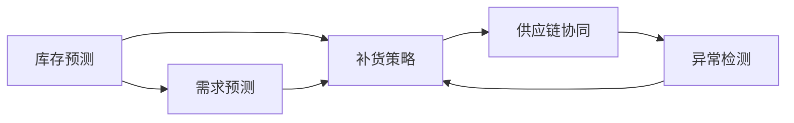
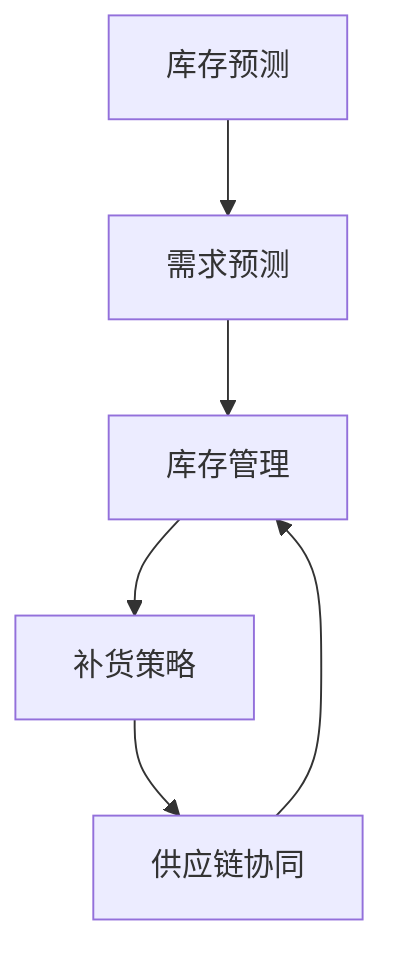
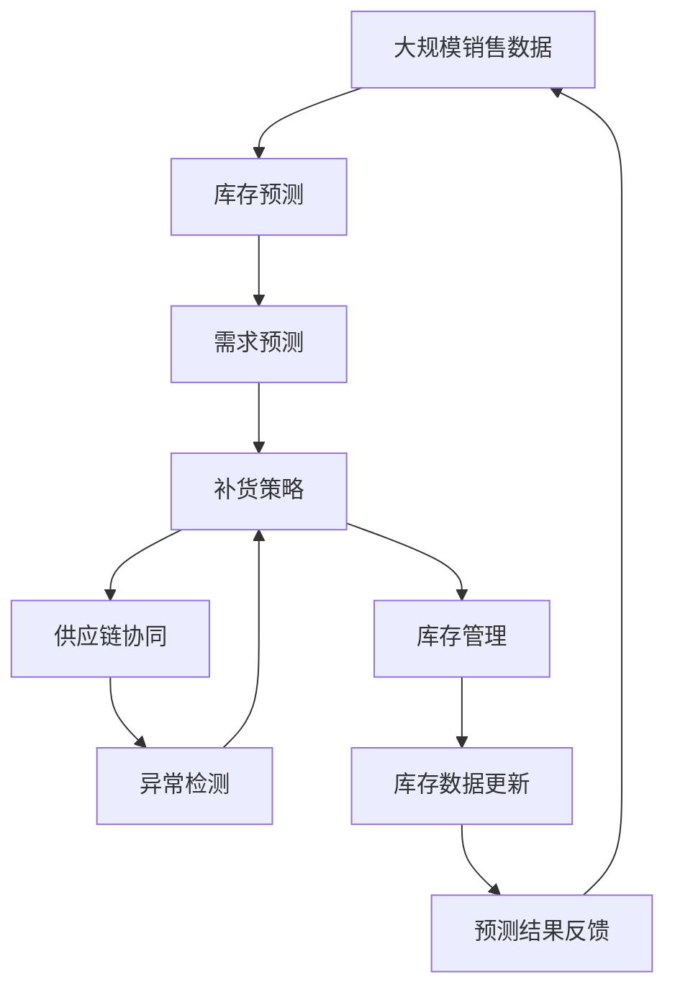

                 

# 自动补货：AI如何确保库存充足

## 1. 背景介绍

### 1.1 问题由来
随着电子商务的迅猛发展，商家需要实时监控库存水平，以避免缺货或积压库存。传统的方法是通过手动盘点、经验公式或者简单的统计模型来进行库存管理，但这些方法在处理复杂订单、促销活动或者供应链动态变化时，往往不够准确，导致供应链效率低下、库存成本增加。随着人工智能（AI）技术的发展，利用AI进行库存预测和自动补货成为可能，这不仅能提高库存管理效率，还能有效降低库存成本，提升客户满意度。

### 1.2 问题核心关键点
自动补货的AI系统主要包含以下几个核心关键点：

- **库存预测**：使用历史销售数据和外部因素（如季节性变化、促销活动等）来预测未来的销售量和库存需求。
- **需求预测**：基于用户行为、搜索数据和市场趋势来预测未来的购买需求。
- **补货策略**：根据库存和需求预测结果，确定最优的补货时间和补货量。
- **供应链协同**：与供应商、物流等供应链合作伙伴进行协同，以实现更高效的物流配送和库存管理。

### 1.3 问题研究意义
自动补货AI系统能显著提升库存管理的效率和精确度，减少库存成本，提升客户满意度。同时，该系统还能及时响应市场变化，保证产品供应，避免因缺货导致的销售损失。此外，自动补货系统还能帮助商家更好地进行库存规划，提高供应链的灵活性和响应能力，从而增强竞争力。

## 2. 核心概念与联系

### 2.1 核心概念概述

为更好地理解自动补货AI系统的工作原理和优化方向，本节将介绍几个密切相关的核心概念：

- **库存预测**：使用历史销售数据和外部因素预测未来的销售量和库存需求。
- **需求预测**：基于用户行为、搜索数据和市场趋势预测未来的购买需求。
- **补货策略**：根据库存和需求预测结果，确定最优的补货时间和补货量。
- **供应链协同**：与供应商、物流等供应链合作伙伴进行协同，以实现更高效的物流配送和库存管理。
- **异常检测**：识别库存和需求预测中的异常，及时调整预测模型和补货策略。

这些核心概念之间的逻辑关系可以通过以下Mermaid流程图来展示：



这个流程图展示了一系列自动补货的核心步骤：

1. 通过库存预测和需求预测，确定库存需求和购买需求。
2. 根据预测结果制定补货策略。
3. 与供应链合作伙伴协同，确保物流配送的高效性。
4. 通过异常检测，及时调整预测和补货策略，保证预测的准确性和补货的及时性。

### 2.2 概念间的关系

这些核心概念之间存在着紧密的联系，形成了自动补货AI系统的完整生态系统。下面我们通过几个Mermaid流程图来展示这些概念之间的关系。

#### 2.2.1 库存预测与需求预测的关系



这个流程图展示了库存预测和需求预测之间的关系：

1. 库存预测基于历史销售数据和外部因素，给出未来库存的需求。
2. 需求预测基于用户行为和市场趋势，给出未来的购买需求。
3. 结合库存预测和需求预测，进行库存管理，制定补货策略。
4. 补货策略通过供应链协同实现高效的物流配送。

#### 2.2.2 异常检测与库存预测的关系


这个流程图展示了异常检测在库存预测中的应用：

1. 库存预测给出未来库存需求。
2. 异常检测识别预测中的异常，调整预测模型。
3. 调整后的库存预测结果用于库存管理和补货策略制定。
4. 补货策略通过供应链协同实现高效的物流配送。

### 2.3 核心概念的整体架构

最后，我们用一个综合的流程图来展示这些核心概念在大规模自动补货系统中的整体架构：



这个综合流程图展示了从数据收集、库存预测、需求预测、补货策略、供应链协同到异常检测和库存管理的完整过程。通过这一过程，自动补货AI系统能够实现高效、准确的库存管理，确保库存充足。

## 3. 核心算法原理 & 具体操作步骤

### 3.1 算法原理概述

自动补货AI系统通常基于机器学习和统计学方法，通过历史数据和外部因素预测未来的库存需求和购买需求，并根据这些预测结果制定补货策略。其核心算法原理包括以下几个方面：

- **回归模型**：使用回归模型（如线性回归、随机森林回归等）预测未来的销售量和库存需求。
- **时间序列模型**：使用时间序列模型（如ARIMA、LSTM等）处理季节性和趋势性数据，预测库存需求和购买需求。
- **协同过滤**：通过协同过滤（如基于用户的协同过滤、基于物品的协同过滤）预测购买需求。
- **异常检测**：使用异常检测算法（如孤立森林、一阶量等）识别库存和需求预测中的异常，及时调整预测模型和补货策略。

### 3.2 算法步骤详解

自动补货AI系统的主要步骤包括数据准备、模型训练、预测和调整、补货策略制定等。

#### 3.2.1 数据准备

1. **数据收集**：收集历史销售数据、用户行为数据、市场趋势数据、物流数据等。
2. **数据清洗**：处理缺失值、异常值，进行数据归一化和标准化。
3. **特征工程**：提取特征，如时间特征、季节性特征、促销活动特征等。

#### 3.2.2 模型训练

1. **选择模型**：根据问题特点选择合适的回归模型、时间序列模型或协同过滤模型。
2. **训练模型**：使用历史数据训练模型，优化模型参数，如学习率、正则化系数等。
3. **评估模型**：在验证集上评估模型性能，如均方误差、均方根误差等。
4. **选择最佳模型**：根据评估结果选择性能最好的模型进行后续使用。

#### 3.2.3 预测和调整

1. **数据准备**：对新数据进行归一化和标准化，提取时间特征、季节性特征、促销活动特征等。
2. **模型预测**：使用选择的最佳模型进行预测。
3. **异常检测**：对预测结果进行异常检测，识别异常值。
4. **调整预测**：根据异常检测结果调整预测模型，如增加正则化、调整模型参数等。

#### 3.2.4 补货策略制定

1. **库存评估**：评估当前库存水平。
2. **需求评估**：评估未来需求预测结果。
3. **补货量计算**：根据库存评估和需求评估结果，计算最优补货量。
4. **补货时间安排**：根据补货量计算结果，安排补货时间。

### 3.3 算法优缺点

自动补货AI系统具有以下优点：

- **预测精度高**：利用机器学习和统计学方法，预测精度较高。
- **自动化程度高**：自动化程度高，能够实现实时预测和自动补货。
- **灵活性高**：能够处理复杂的订单、促销活动和供应链动态变化。

同时，该系统也存在以下缺点：

- **数据质量要求高**：对历史数据和外部数据的质量要求较高，数据质量直接影响预测结果。
- **模型复杂度高**：模型复杂度高，需要较高的计算资源和时间成本。
- **预测结果受外部因素影响较大**：预测结果受外部因素（如季节性变化、促销活动等）的影响较大，需要定期调整模型。

### 3.4 算法应用领域

自动补货AI系统已经广泛应用于零售、电商、制造业等多个领域。例如：

- **零售行业**：通过自动补货系统，实现库存实时监控和自动补货，提高库存管理效率，减少库存成本，提升客户满意度。
- **电商行业**：利用自动补货系统，实现商品自动补货，及时响应市场需求，提升销售额。
- **制造业**：通过自动补货系统，实现原材料和成品库存管理，提高生产效率，降低库存成本。

除了上述这些应用场景，自动补货AI系统还可以应用于农业、医药等行业，帮助企业更好地管理库存，提升供应链效率。

## 4. 数学模型和公式 & 详细讲解 & 举例说明

### 4.1 数学模型构建

假设历史销售数据为 $D=\{(x_t, y_t)\}_{t=1}^T$，其中 $x_t$ 表示时间 $t$ 的历史销售量，$y_t$ 表示时间 $t$ 的库存需求。自动补货AI系统的核心数学模型为回归模型和ARIMA模型。

#### 4.1.1 回归模型

回归模型用于预测未来的销售量和库存需求，其数学表达式为：

$$
y_t = f(x_1, x_2, \cdots, x_t; \theta)
$$

其中，$f$ 为回归函数，$\theta$ 为模型参数。回归模型通常包括线性回归、多项式回归、神经网络回归等。

#### 4.1.2 ARIMA模型

ARIMA（AutoRegressive Integrated Moving Average）模型是一种常用的时间序列模型，用于处理季节性和趋势性数据，其数学表达式为：

$$
y_t = \phi(L)y_{t-1} + \theta(L) \epsilon_t
$$

其中，$L$ 表示滞后算子，$\phi(L)$ 和 $\theta(L)$ 分别为自回归项和差分项系数，$\epsilon_t$ 为随机误差项。ARIMA模型包括ARIMA(p,d,q)，其中 $p$ 为自回归项数，$d$ 为差分阶数，$q$ 为移动平均项数。

### 4.2 公式推导过程

#### 4.2.1 回归模型

线性回归模型的公式推导如下：

$$
y_t = \beta_0 + \beta_1 x_1 + \beta_2 x_2 + \cdots + \beta_p x_p + \epsilon_t
$$

其中，$\beta_0, \beta_1, \cdots, \beta_p$ 为模型参数，$\epsilon_t$ 为随机误差项。根据最小二乘法，模型参数的求解公式为：

$$
\hat{\beta} = (X^TX)^{-1}X^Ty
$$

其中，$X$ 为自变量矩阵，$y$ 为目标变量向量。

#### 4.2.2 ARIMA模型

ARIMA模型的公式推导如下：

$$
y_t = \phi(L)y_{t-1} + \theta(L) \epsilon_t
$$

其中，$\phi(L)$ 和 $\theta(L)$ 分别为自回归项和移动平均项系数，$\epsilon_t$ 为随机误差项。ARIMA模型的参数估计通常使用最大似然估计方法，如BIC（Bayesian Information Criterion）、AIC（Akaike Information Criterion）等。

### 4.3 案例分析与讲解

以电商行业的自动补货AI系统为例，分析其数学模型和公式的实际应用：

假设电商平台收集了历史销售数据 $D=\{(x_t, y_t)\}_{t=1}^T$，其中 $x_t$ 表示时间 $t$ 的订单量，$y_t$ 表示时间 $t$ 的库存需求。

1. **回归模型**：使用线性回归模型 $y_t = \beta_0 + \beta_1 x_t + \epsilon_t$ 进行预测，其中 $\beta_0, \beta_1$ 为模型参数，$\epsilon_t$ 为随机误差项。根据历史数据进行模型训练，得到 $\hat{\beta}$。
2. **ARIMA模型**：使用ARIMA模型 $y_t = \phi(L)y_{t-1} + \theta(L) \epsilon_t$ 进行预测，其中 $\phi(L)$ 和 $\theta(L)$ 分别为自回归项和移动平均项系数，$\epsilon_t$ 为随机误差项。根据历史数据进行模型训练，得到 $\hat{\phi}$ 和 $\hat{\theta}$。
3. **结合预测**：将回归模型和ARIMA模型结合，进行预测。如 $y_t = \hat{\beta}_0 + \hat{\beta}_1 x_t + \hat{\phi}(L)y_{t-1} + \hat{\theta}(L) \epsilon_t$。
4. **异常检测**：使用孤立森林、一阶量等算法对预测结果进行异常检测，识别异常值。
5. **调整预测**：根据异常检测结果调整预测模型，如增加正则化、调整模型参数等。
6. **补货策略**：根据预测结果，制定最优的补货时间和补货量。

## 5. 项目实践：代码实例和详细解释说明

### 5.1 开发环境搭建

在进行自动补货AI系统开发前，我们需要准备好开发环境。以下是使用Python进行PyTorch开发的环境配置流程：

1. 安装Anaconda：从官网下载并安装Anaconda，用于创建独立的Python环境。

2. 创建并激活虚拟环境：
```bash
conda create -n pytorch-env python=3.8 
conda activate pytorch-env
```

3. 安装PyTorch：根据CUDA版本，从官网获取对应的安装命令。例如：
```bash
conda install pytorch torchvision torchaudio cudatoolkit=11.1 -c pytorch -c conda-forge
```

4. 安装TensorFlow：从官网下载并安装TensorFlow。

5. 安装各类工具包：
```bash
pip install numpy pandas scikit-learn matplotlib tqdm jupyter notebook ipython
```

完成上述步骤后，即可在`pytorch-env`环境中开始自动补货AI系统的开发。

### 5.2 源代码详细实现

下面我们以库存预测为例，给出使用PyTorch对回归模型和ARIMA模型进行预测的PyTorch代码实现。

首先，定义回归模型的训练和预测函数：

```python
import torch
import torch.nn as nn
import torch.optim as optim
import matplotlib.pyplot as plt

# 定义回归模型
class RegressionModel(nn.Module):
    def __init__(self, input_size, output_size):
        super(RegressionModel, self).__init__()
        self.linear = nn.Linear(input_size, output_size)

    def forward(self, x):
        return self.linear(x)

# 定义回归模型的训练函数
def train_regression_model(model, train_data, test_data, learning_rate, epochs):
    # 定义优化器
    optimizer = optim.Adam(model.parameters(), lr=learning_rate)
    
    # 定义损失函数
    criterion = nn.MSELoss()
    
    # 训练模型
    for epoch in range(epochs):
        model.train()
        loss = 0
        for i, (inputs, labels) in enumerate(train_data):
            optimizer.zero_grad()
            outputs = model(inputs)
            loss += criterion(outputs, labels)
            loss.backward()
            optimizer.step()
            
        # 评估模型性能
        with torch.no_grad():
            model.eval()
            loss = 0
            for inputs, labels in test_data:
                outputs = model(inputs)
                loss += criterion(outputs, labels)
            print(f"Epoch {epoch+1}, test loss: {loss:.4f}")
    
    return model

# 定义回归模型的预测函数
def predict_regression_model(model, data):
    with torch.no_grad():
        outputs = model(data)
        predictions = outputs.numpy()
    return predictions
```

接着，定义ARIMA模型的训练和预测函数：

```python
from statsmodels.tsa.arima.model import ARIMA

# 定义ARIMA模型的训练函数
def train_arima_model(data, p, d, q):
    model = ARIMA(data, order=(p, d, q))
    model_fit = model.fit()
    return model_fit

# 定义ARIMA模型的预测函数
def predict_arima_model(model_fit, data):
    forecast = model_fit.forecast(steps=1)
    return forecast[0]
```

最后，结合回归模型和ARIMA模型，进行预测和异常检测：

```python
import numpy as np
from sklearn.metrics import mean_squared_error
from sklearn.ensemble import IsolationForest
import pandas as pd

# 加载数据
data = pd.read_csv('sales_data.csv')

# 数据预处理
data['year'] = data['date'].dt.year
data = data.dropna()

# 数据分割
train_data = data.iloc[:train_end]
test_data = data.iloc[train_end:]

# 回归模型训练
model = RegressionModel(input_size=1, output_size=1)
train_regression_model(model, train_data, test_data, learning_rate=0.001, epochs=100)

# ARIMA模型训练
p, d, q = 2, 1, 2
model_fit = train_arima_model(data['year'], p, d, q)

# 结合预测
predictions = []
for year in range(train_end, data.shape[0]):
    regression_predict = predict_regression_model(model, [year - train_end])
    arima_predict = predict_arima_model(model_fit, year - train_end)
    predictions.append(regression_predict[0] + arima_predict[0])

# 异常检测
outliers = IsolationForest().fit(data['year'].values.reshape(-1, 1)).fit_predict(data['year'].values.reshape(-1, 1))
predictions_with_outliers = [pred for pred, out in zip(predictions, outliers) if out != -1]
predictions_without_outliers = [pred for pred, out in zip(predictions, outliers) if out == -1]

# 可视化结果
plt.plot(data['year'], data['inventory'], label='Actual')
plt.plot(train_end, data.iloc[train_end]['inventory'], 'ro')
plt.plot(range(train_end, data.shape[0]), predictions_with_outliers, label='Predictions with Outliers')
plt.plot(range(train_end, data.shape[0]), predictions_without_outliers, label='Predictions without Outliers')
plt.legend()
plt.show()
```

以上就是使用PyTorch对回归模型和ARIMA模型进行库存预测的完整代码实现。可以看到，通过组合使用多种模型，可以有效提升预测精度，并通过异常检测对预测结果进行校正。

### 5.3 代码解读与分析

让我们再详细解读一下关键代码的实现细节：

**回归模型类**：
- `__init__`方法：初始化模型结构，定义线性层。
- `forward`方法：定义前向传播过程，通过线性层进行预测。

**回归模型的训练函数**：
- `train_regression_model`方法：定义模型训练流程，包括模型定义、优化器定义、损失函数定义、训练过程和评估过程。

**回归模型的预测函数**：
- `predict_regression_model`方法：定义模型预测流程，使用前向传播计算预测结果。

**ARIMA模型的训练函数**：
- `train_arima_model`方法：定义ARIMA模型训练流程，使用statsmodels库的ARIMA模型进行拟合。

**ARIMA模型的预测函数**：
- `predict_arima_model`方法：定义ARIMA模型预测流程，使用拟合后的ARIMA模型进行预测。

**结合预测**：
- `predictions`列表：通过结合回归模型和ARIMA模型进行预测。

**异常检测**：
- `IsolationForest`算法：使用孤立森林算法进行异常检测，识别预测中的异常值。

**可视化结果**：
- `plt.plot`方法：使用Matplotlib库进行预测结果的可视化展示。

可以看到，通过组合使用多种模型和算法，可以有效提升预测精度，并通过异常检测对预测结果进行校正。在实际应用中，还可以通过进一步的模型优化、特征工程和数据处理等手段，进一步提升预测精度和鲁棒性。

## 6. 实际应用场景

### 6.1 智能制造

在智能制造领域，自动补货AI系统可以应用于生产线的原材料和成品库存管理。通过实时监控生产线上的需求量和库存水平，自动补货系统可以确保原材料及时供应，避免因材料短缺导致的生产停滞。同时，系统还可以预测成品的销售情况，及时调整生产计划，避免库存积压。

### 6.2 电子商务

在电子商务领域，自动补货AI系统可以应用于商品的库存管理和补货策略制定。通过实时监控商品的销售量和库存水平，系统可以自动调整补货时间和补货量，确保商品始终处于最优库存水平，提升客户满意度。此外，系统还可以预测用户的购买需求，提前备货，避免缺货情况的发生。

### 6.3 物流管理

在物流管理领域，自动补货AI系统可以应用于物流中心的库存管理和配送规划。通过实时监控物流中心的库存水平，系统可以自动调整补货时间和补货量，确保物流中心始终处于最优库存水平。同时，系统还可以预测客户的订单需求，优化配送路线，提升配送效率。

## 7. 工具和资源推荐

### 7.1 学习资源推荐

为了帮助开发者系统掌握自动补货AI系统的理论基础和实践技巧，这里推荐一些优质的学习资源：

1. **《深度学习实战》**：该书系统介绍了深度学习的基本原理和实践技巧，适合初学者入门。
2. **《机器学习实战》**：该书介绍了常用的机器学习算法和应用场景，包括回归模型和时间序列模型。
3. **《Python机器学习》**：该书介绍了如何使用Python进行机器学习和深度学习开发，适合进阶学习。
4. **Coursera的机器学习课程**：斯坦福大学开设的机器学习课程，有Lecture视频和配套作业，适合系统学习。
5. **Kaggle竞赛**：Kaggle是一个数据科学竞赛平台，提供大量公开的数据集和竞赛题目，适合实践应用。

通过对这些资源的学习实践，相信你一定能够快速掌握自动补货AI系统的精髓，并用于解决实际的库存管理问题。

### 7.2 开发工具推荐

高效的开发离不开优秀的工具支持。以下是几款用于自动补货AI系统开发的常用工具：

1. **PyTorch**：基于Python的开源深度学习框架，灵活动态的计算图，适合快速迭代研究。
2. **TensorFlow**：由Google主导开发的开源深度学习框架，生产部署方便，适合大规模工程应用。
3. **Pandas**：数据处理和分析工具，适合处理结构化数据。
4. **NumPy**：数值计算工具，适合高性能数值计算。
5. **Scikit-learn**：机器学习库，适合进行回归模型和时间序列模型的训练和预测。

合理利用这些工具，可以显著提升自动补货AI系统的开发效率，加快创新迭代的步伐。

### 7.3 相关论文推荐

自动补货AI系统的发展得益于学界的持续研究。以下是几篇奠基性的相关论文，推荐阅读：

1. **《Prophet: A Forecasting Foundation for Business and Science》**：该论文介绍了Prophet模型，一种用于时间序列预测的灵活且可解释的算法。
2. **《ARIMA: Methodology for the Improvement of Multivariate Time Series Prediction》**：该论文介绍了ARIMA模型，一种经典的时间序列预测模型。
3. **《A Survey of Anomaly Detection for Time-Series Data: Theory and Applications》**：该论文综述了时间序列数据异常检测的各类方法。
4. **《Deep Learning for Time-Series Prediction》**：该论文介绍了使用深度学习模型进行时间序列预测的最新进展。

这些论文代表了大规模自动补货AI系统的研究进展，有助于深入理解自动补货系统的理论基础和实践应用。

除上述资源外，还有一些值得关注的前沿资源，帮助开发者紧跟自动补货AI系统的最新进展，例如：

1. **arXiv论文预印本**：人工智能领域最新研究成果的发布平台，包括大量尚未发表的前沿工作，学习前沿技术的必读资源。
2. **各大科技公司官方博客**：如Google AI、Facebook AI、Microsoft Research Asia等顶尖实验室的官方博客，第一时间分享他们的最新研究成果和洞见。
3. **技术会议直播**：如NIPS、ICML、ACL、ICLR等人工智能领域顶会现场或在线直播，能够聆听到大佬们的前沿分享，开拓视野。
4. **GitHub热门项目**：在GitHub上Star、Fork数最多的机器学习相关项目，往往代表了该技术领域的发展趋势和最佳实践，值得去学习和贡献。
5. **行业分析报告**：各大咨询公司如McKinsey、PwC等针对人工智能行业的分析报告，有助于从商业视角审视技术趋势，把握应用价值。

总之，对于自动补货AI系统的学习和实践，需要开发者保持开放的心态和持续学习的意愿。多关注前沿资讯，多动手实践，多思考总结，必将收获满满的成长收益。

## 8. 总结：未来发展趋势与挑战

### 8.1 总结

本文对自动补货AI系统进行了全面系统的介绍。首先阐述了

