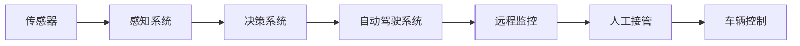

                 

## 1. 背景介绍

自动驾驶技术在近年来取得了显著进展，但要完全实现无人驾驶，仍需依赖人工接管系统。远程监控和人工接管是确保自动驾驶系统安全的重要组成部分。本文章将从背景介绍、核心概念、算法原理、项目实践、实际应用场景及未来展望等多个维度，深入探讨自动驾驶中的远程监控与人工接管设计。

## 2. 核心概念与联系

### 2.1 核心概念概述

**自动驾驶**：利用人工智能、传感器技术、计算机视觉等技术，实现汽车自动驾驶。自动驾驶系统需要实时感知环境，做出决策，控制车辆运行。

**远程监控**：通过高清摄像头、雷达、激光雷达等设备，实时获取车辆及周边环境信息，并通过网络传输到监控中心。监控中心通过数据分析，及时发现潜在风险，指导人工接管。

**人工接管**：在自动驾驶系统无法应对突发情况时，由司机或远程监控中心人员接管车辆控制权，确保行车安全。

### 2.2 核心概念原理和架构的 Mermaid 流程图



这个流程图展示了自动驾驶中远程监控与人工接管的整体架构：车辆通过传感器获取环境信息，感知系统进行数据处理，决策系统生成控制指令，自动驾驶系统执行指令。在无法应对的情况，远程监控中心及时介入，人工接管系统接管车辆控制权，保证行车安全。

### 2.3 核心概念间的联系

1. **感知系统与决策系统**：感知系统提供环境信息，决策系统利用信息生成控制指令。
2. **自动驾驶系统与远程监控**：自动驾驶系统执行决策，远程监控中心实时监控，发现问题后指导人工接管。
3. **人工接管与车辆控制**：人工接管系统接管车辆控制权，通过车辆控制系统实现实时操作。

## 3. 核心算法原理 & 具体操作步骤

### 3.1 算法原理概述

远程监控与人工接管设计主要包括两部分：感知与监控、决策与接管。

1. **感知与监控**：利用传感器实时采集车辆及周边环境信息，通过机器学习、深度学习等算法，进行数据分析，发现异常情况。
2. **决策与接管**：在感知系统发现异常时，决策系统进行判断，确定是否需要人工接管。若需要，则将信息传输到监控中心，由人工接管系统接管车辆控制。

### 3.2 算法步骤详解

**Step 1: 传感器数据采集与预处理**
- 安装高清摄像头、雷达、激光雷达等传感器，采集车辆及周边环境信息。
- 对数据进行滤波、校正、去噪等预处理，确保数据质量。

**Step 2: 数据传输与存储**
- 将传感器数据通过网络传输到监控中心，存储在数据库或云存储中。
- 设置数据传输速率、延迟、可靠性等指标，确保数据传输的稳定性。

**Step 3: 数据分析与异常检测**
- 利用机器学习、深度学习算法，对传感器数据进行数据分析，发现异常情况。
- 定义异常检测算法，如阈值法、聚类法、异常检测模型等，确保异常情况的有效识别。

**Step 4: 决策与接管控制**
- 在感知系统发现异常时，决策系统进行判断，确定是否需要人工接管。
- 若需要人工接管，则将信息传输到监控中心，由人工接管系统接管车辆控制。

**Step 5: 人工接管与车辆控制**
- 人工接管系统接收监控中心指令，接管车辆控制权。
- 通过车辆控制系统，如方向盘、油门、刹车等，实现实时操作。

### 3.3 算法优缺点

**优点**：
1. **提高安全性**：通过实时监控和人工接管，有效应对突发情况，提高行车安全性。
2. **降低人工成本**：部分接管工作由远程监控中心人员完成，降低司机工作压力。
3. **实时响应**：远程监控中心实时获取信息，快速做出响应，提高应急处理效率。

**缺点**：
1. **通信延迟**：数据传输需要一定时间，通信延迟可能影响系统响应速度。
2. **数据隐私**：传感器数据需要传输到监控中心，可能涉及数据隐私问题。
3. **系统复杂度**：传感器、监控中心、人工接管系统等多方面组成，系统复杂度较高。

### 3.4 算法应用领域

自动驾驶技术在交通、物流、城市管理等领域具有广泛应用。

1. **交通领域**：城市道路交通管理、高速公路自动驾驶、智能停车等。
2. **物流领域**：无人驾驶货车、配送机器人、智能物流园区等。
3. **城市管理**：智能交通监控、公共安全管理、应急响应等。

## 4. 数学模型和公式 & 详细讲解 & 举例说明

### 4.1 数学模型构建

设车辆在位置 $x$ 时的速度为 $v(x)$，传感器在位置 $x$ 时的数据为 $d(x)$，监控中心接收到的数据为 $r(x)$，异常检测算法为 $A(d)$，决策系统为 $D(d)$，人工接管系统为 $H(d)$，车辆控制系统为 $C(d)$。

**感知与监控**：
$$
r(x) = f(d(x))
$$

**异常检测**：
$$
A(d) = \left\{ 
\begin{aligned} 
&1, &\text{if } d(x) \text{ 异常}\\
&0, &\text{if } d(x) \text{ 正常}
\end{aligned}
\right.
$$

**决策与接管**：
$$
D(d) = \left\{ 
\begin{aligned} 
&1, &\text{if } A(d) = 1\\
&0, &\text{if } A(d) = 0
\end{aligned}
\right.
$$

**人工接管与车辆控制**：
$$
H(d) = \left\{ 
\begin{aligned} 
&1, &\text{if } D(d) = 1\\
&0, &\text{if } D(d) = 0
\end{aligned}
\right.
$$
$$
C(d) = \left\{ 
\begin{aligned} 
&\text{接收到 } H(d) = 1 \text{ 的指令}, &\text{执行对应操作} \\
&\text{未收到指令}, &\text{保持原状态}
\end{aligned}
\right.
$$

### 4.2 公式推导过程

以异常检测算法为例，推导其核心公式。

设异常检测算法 $A(d)$ 基于局部标准差 $SD$ 和阈值 $T$，则：
$$
A(d) = \left\{ 
\begin{aligned} 
&1, &\text{if } SD(d) > T\\
&0, &\text{if } SD(d) \leq T
\end{aligned}
\right.
$$

其中 $SD(d)$ 表示数据 $d$ 的局部标准差，计算公式为：
$$
SD(d) = \sqrt{\frac{1}{n}\sum_{i=1}^{n}(d_i - \bar{d})^2}
$$

### 4.3 案例分析与讲解

**案例：车辆突然偏离车道**

- **感知系统**：安装高清摄像头，实时监测车辆位置。传感器采集数据 $d(x)$。
- **异常检测**：利用SD(d)计算局部标准差，并与阈值T比较，确定是否异常。若异常，则 $A(d) = 1$，否则 $A(d) = 0$。
- **决策系统**：若 $A(d) = 1$，则 $D(d) = 1$，需人工接管。
- **人工接管**：监控中心收到指令，人工接管系统启动。
- **车辆控制**：人工接管系统通过方向盘、油门、刹车等控制车辆，保持车道。

## 5. 项目实践：代码实例和详细解释说明

### 5.1 开发环境搭建

**Step 1: 安装Python和相关库**
```bash
pip install opencv-python numpy pyserial portpicker
```

**Step 2: 安装Raspberry Pi和相关硬件**
- 安装Raspberry Pi操作系统。
- 安装摄像头、雷达、激光雷达等传感器。
- 连接传感器到Raspberry Pi。

### 5.2 源代码详细实现

**感知系统代码**
```python
import cv2

def get_sensor_data():
    cap = cv2.VideoCapture(0)
    while True:
        ret, frame = cap.read()
        if not ret:
            break
        # 数据处理和存储
```

**异常检测代码**
```python
def detect_anomaly(data):
    # 计算局部标准差
    std_dev = compute_std_dev(data)
    # 与阈值比较
    if std_dev > threshold:
        return 1
    else:
        return 0
```

**决策与接管代码**
```python
def make_decision(anomaly_score):
    if anomaly_score == 1:
        # 需要人工接管
        return 1
    else:
        # 不需要人工接管
        return 0
```

**人工接管与车辆控制代码**
```python
def control_vehicle(command):
    if command == 1:
        # 人工接管系统启动
        # 控制车辆
    else:
        # 保持原状态
```

### 5.3 代码解读与分析

**感知系统代码**：
- 使用OpenCV库，实时获取摄像头数据。
- 对数据进行预处理和存储。

**异常检测代码**：
- 计算局部标准差。
- 与阈值比较，判断是否异常。
- 返回异常检测结果。

**决策与接管代码**：
- 判断是否需要人工接管。
- 返回决策结果。

**人工接管与车辆控制代码**：
- 根据指令控制车辆。
- 实现人工接管功能。

### 5.4 运行结果展示

**示例：车辆突然偏离车道**

- 传感器采集数据，感知系统检测位置。
- 异常检测系统发现异常，决策系统发出指令。
- 人工接管系统启动，控制车辆保持车道。

## 6. 实际应用场景

### 6.1 智能交通管理

智能交通管理系统中，传感器实时采集车辆和行人信息，监控中心进行数据分析，发现异常情况。在检测到异常时，决策系统进行判断，人工接管系统接管车辆控制，确保交通顺畅。

### 6.2 无人驾驶货车

无人驾驶货车中，传感器实时监测车辆和道路情况，监控中心进行数据分析，发现异常情况。在检测到异常时，决策系统进行判断，人工接管系统接管车辆控制，确保安全行驶。

### 6.3 智能物流园区

智能物流园区中，传感器实时监测货物和运输车辆情况，监控中心进行数据分析，发现异常情况。在检测到异常时，决策系统进行判断，人工接管系统接管车辆控制，确保货物安全送达。

## 7. 工具和资源推荐

### 7.1 学习资源推荐

**书籍**：
- 《自动驾驶》，作者：郭曰阳，出版社：电子工业出版社。
- 《人工智能：一个现代方法》，作者：Stuart Russell, Peter Norvig，出版社：人民邮电出版社。

**在线课程**：
- Coursera上的《自动驾驶》课程，由MIT提供。
- Udacity上的《自动驾驶工程师纳米学位》课程。

**开源项目**：
- Apollo，百度开源的自动驾驶平台。
- Arlo，开源自动驾驶系统，支持多传感器融合和车辆控制。

### 7.2 开发工具推荐

**操作系统**：
- Ubuntu Server，适合服务器端开发。
- Raspberry Pi OS，适合嵌入式开发。

**传感器和硬件**：
- OpenCV，用于计算机视觉处理。
- PySerial，用于串口通信。
- PyUSB，用于USB通信。

**工具和库**：
- TensorFlow，用于深度学习模型开发。
- PyTorch，用于深度学习模型开发。
- OpenCV，用于计算机视觉处理。

### 7.3 相关论文推荐

**书籍**：
- 《自动驾驶》，作者：郭曰阳，出版社：电子工业出版社。
- 《人工智能：一个现代方法》，作者：Stuart Russell, Peter Norvig，出版社：人民邮电出版社。

**论文**：
- "Towards Autonomous Driving: A Survey", 作者：Wei, L.; Huang, G.，期刊：IEEE Transactions on Intelligent Transportation Systems。
- "A Survey of the Methods and Techniques for Anomaly Detection: An Extensive Literature Review", 作者：Meng, Z.；Luo, S.；Zhu, X.，期刊：IEEE Access。

## 8. 总结：未来发展趋势与挑战

### 8.1 研究成果总结

本文介绍了自动驾驶中的远程监控与人工接管设计，从感知系统、异常检测、决策系统、人工接管系统、车辆控制等多方面进行探讨。通过理论分析与实际案例，展示了远程监控与人工接管在大规模自动驾驶系统中的关键作用。

### 8.2 未来发展趋势

1. **多模态感知**：未来将结合多种传感器数据，提高环境感知能力。
2. **深度学习模型**：深度学习模型将在异常检测和决策系统中发挥更重要的作用。
3. **边缘计算**：边缘计算将提高数据处理和决策的实时性。
4. **AI伦理与安全**：将AI伦理与安全纳入设计，确保系统的透明性与安全性。

### 8.3 面临的挑战

1. **通信延迟**：传感器数据传输到监控中心需要一定时间，可能影响系统响应速度。
2. **数据隐私**：传感器数据需要传输到监控中心，涉及数据隐私问题。
3. **系统复杂度**：多传感器、多系统的组成，增加了系统的复杂度。

### 8.4 研究展望

未来需要在多模态感知、深度学习模型、边缘计算、AI伦理与安全等方面进行深入研究，以提高系统的实时性、准确性和安全性。

## 9. 附录：常见问题与解答

**Q1: 远程监控如何保证数据传输的实时性和稳定性？**

A: 使用边缘计算技术，在车辆端进行数据预处理和初步分析，减少数据传输量。同时，通过网络优化和传输协议改进，确保数据传输的实时性和稳定性。

**Q2: 如何确保人工接管系统的安全性？**

A: 设计多层次的安全机制，如身份验证、权限管理、数据加密等，确保人工接管系统的安全性。同时，建立应急响应机制，快速处理突发情况。

**Q3: 如何提高系统的鲁棒性？**

A: 在数据处理和算法设计中，引入鲁棒性分析，确保系统在不同环境下的稳定性和可靠性。同时，进行大量测试和模拟，验证系统的鲁棒性。

**Q4: 如何提高系统的可解释性？**

A: 引入可解释性技术，如可视化、解释模型等，增强系统决策的透明性和可解释性。同时，设计简单易懂的系统界面，方便用户理解和使用。

作者：禅与计算机程序设计艺术 / Zen and the Art of Computer Programming

