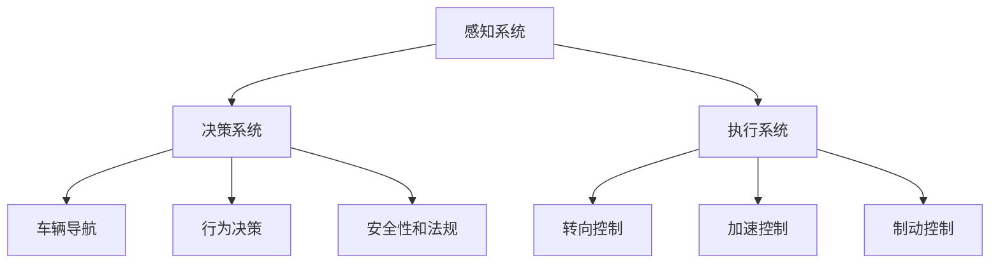
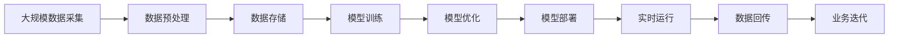

                 

## 1. 背景介绍

### 1.1 问题由来

随着人工智能技术的飞速发展，自动驾驶技术逐渐从概念走入现实。自动驾驶不仅改变了人们的出行方式，也对相关行业的业务模式和人才需求产生了深远影响。自动驾驶算法工程师，作为推动技术创新的核心力量，其职责和技能也随之发生了显著变化。

### 1.2 问题核心关键点

当前，自动驾驶技术正在从基础技术研发向大规模应用部署转变。这一过程不仅涉及大量的硬件设备部署和软件系统集成，还要求算法工程师具备更综合、更全面的技能。以下是自动驾驶算法工程师职责变化的几个关键点：

1. **跨学科知识**：自动驾驶技术涉及计算机视觉、深度学习、机器学习、传感器融合等多个领域，算法工程师需要掌握多个领域的知识。
2. **大规模系统开发**：自动驾驶系统涉及车辆传感器、处理单元、通信网络等复杂硬件系统，算法工程师需要具备系统设计能力。
3. **法规与伦理考量**：自动驾驶涉及高风险应用，算法工程师需要理解相关法规和伦理规范，确保技术的安全性和合法性。
4. **数据驱动决策**：自动驾驶系统依赖大量数据进行训练和优化，算法工程师需要具备数据处理和分析能力。
5. **实时性要求**：自动驾驶系统需要在毫秒级时间范围内做出决策，算法工程师需要具备高性能计算和优化能力。

### 1.3 问题研究意义

探讨自动驾驶算法工程师的职责变化，有助于相关从业者理解技术演进对岗位技能的需求变化，从而进行自我提升和职业规划。这对于推动自动驾驶技术的产业化和应用落地具有重要意义。

## 2. 核心概念与联系

### 2.1 核心概念概述

为更好地理解自动驾驶算法工程师的职责变化，本文将介绍几个核心概念：

- **自动驾驶**：通过软件和硬件协同工作，使车辆能够自主导航、避障、决策，实现无人驾驶。
- **感知系统**：利用摄像头、雷达、激光雷达等传感器获取车辆周围环境信息，是自动驾驶的基础。
- **决策系统**：基于感知系统的输出信息，通过算法模型进行路径规划、行为决策。
- **执行系统**：控制车辆转向、加速、制动等动作，实现决策系统的目标。
- **安全性和法规**：确保自动驾驶系统符合相关安全标准和法律法规，避免潜在风险。

### 2.2 概念间的关系

这些核心概念之间的关系可以通过以下Mermaid流程图来展示：



这个流程图展示了自动驾驶系统从感知、决策到执行，再到法规安全保障的完整流程。各个部分相互作用，共同构成了自动驾驶技术的实现框架。

### 2.3 核心概念的整体架构

最后，我们用一个综合的流程图来展示这些核心概念在大规模应用场景下的整体架构：



这个综合流程图展示了从数据采集、处理、训练、优化、部署到业务迭代的完整流程。各个环节相互依赖，共同确保自动驾驶系统的可靠运行和持续改进。

## 3. 核心算法原理 & 具体操作步骤
### 3.1 算法原理概述

自动驾驶算法工程师的主要职责之一是设计和实现自动驾驶算法。这些算法包括但不限于：

- **感知算法**：利用传感器数据进行环境感知，如目标检测、车道线识别、障碍物检测等。
- **决策算法**：根据感知结果进行路径规划、行为决策，如路线规划、交通信号识别等。
- **执行算法**：控制车辆执行决策结果，如转向控制、制动控制等。

这些算法通常基于深度学习和计算机视觉技术，通过大量标注数据进行训练和优化，以提升模型的准确性和鲁棒性。

### 3.2 算法步骤详解

自动驾驶算法工程师的主要工作流程包括：

1. **数据收集和预处理**：收集车辆传感器数据，进行清洗、标注和预处理。
2. **模型选择和设计**：根据任务需求选择合适的模型架构，并进行参数设置和调优。
3. **模型训练和验证**：利用标注数据对模型进行训练，并在验证集上进行性能评估。
4. **模型集成和测试**：将多个模块集成到系统中，进行全面的功能测试和安全性验证。
5. **模型部署和监控**：将模型部署到车辆硬件上，并实时监控模型运行状态和性能。

### 3.3 算法优缺点

自动驾驶算法具有以下优点：

1. **提升行驶安全性**：自动驾驶算法可以减轻人为驾驶错误，提升行驶安全性。
2. **提升驾驶体验**：自动驾驶算法能够自动完成导航和驾驶，减轻驾驶员负担。
3. **提高交通效率**：自动驾驶算法可以减少交通拥堵，提高道路通行效率。

同时，自动驾驶算法也存在一些缺点：

1. **依赖高精度传感器**：自动驾驶系统依赖高精度传感器，如激光雷达、摄像头等，传感器故障可能影响系统正常运行。
2. **法律法规限制**：自动驾驶技术在许多地区仍受法律法规限制，大规模应用仍需时日。
3. **数据安全和隐私问题**：自动驾驶系统需要大量数据进行训练，数据安全和隐私保护成为重要问题。

### 3.4 算法应用领域

自动驾驶算法主要应用于以下领域：

1. **自动驾驶汽车**：包括乘用车、商用车、物流车等，广泛应用于城市交通、货运配送等场景。
2. **自动驾驶无人机**：在物流配送、测绘、农业监控等领域广泛应用。
3. **自动驾驶船只**：应用于港口、沿海区域等水域环境，提升运输效率和安全性。
4. **自动驾驶机器人**：在工厂自动化、仓储物流、建筑施工等领域实现自主导航和作业。

## 4. 数学模型和公式 & 详细讲解  
### 4.1 数学模型构建

自动驾驶算法的设计和实现通常基于以下数学模型：

- **感知模型**：基于传感器数据，如摄像头、雷达等，进行目标检测、车道线识别等任务。
- **决策模型**：基于感知结果，进行路径规划、行为决策等任务。
- **执行模型**：控制车辆转向、加速、制动等动作。

以目标检测为例，常用的数学模型包括：

- **YOLO**：You Only Look Once，通过单阶段目标检测方法，实时性和准确性较好。
- **Faster R-CNN**：两阶段目标检测方法，准确性较高，但速度较慢。
- **SSD**：单阶段目标检测方法，速度较快，但准确性略逊于Faster R-CNN。

### 4.2 公式推导过程

以目标检测为例，推导YOLO模型的目标检测损失函数：

设输入图像尺寸为$H \times W$，目标类别数为$C$，每个目标的$x$、$y$坐标分别为$(c_x, c_y)$，宽度和高度分别为$(b_x, b_y)$，对应置信度和类别概率分别为$(p_x, p_y, p_c, p_m)$。设目标真实坐标和真实尺寸为$(t_x, t_y, t_w, t_h)$。

则目标检测损失函数$L_{obj}$为：

$$
L_{obj} = \sum_{i=1}^N \left[ \frac{1}{N}\sum_{n=1}^C \left( p_c^n [l_c^n]^2 + \sum_{i=1}^C \sum_{j=1}^4 \frac{p_m^n [l_{ij}^n]^2}{N} \right) + [l_{x,y,w,h}]^2 \right]
$$

其中$l_c^n$、$l_{ij}^n$、$l_{x,y,w,h}$分别为置信度损失、分类损失、回归损失。

### 4.3 案例分析与讲解

以路径规划为例，常用的路径规划算法包括A*、D*、RRT等。这些算法通过构建图模型，寻找从起点到终点的最短路径。以下以A*算法为例，进行案例分析。

A*算法是一种启发式搜索算法，通过计算每个节点的代价估计值，寻找最优路径。其核心思想是：

1. 定义启发函数$g(n) + h(n)$，其中$g(n)$为从起点到节点$n$的真实代价，$h(n)$为从节点$n$到终点的估计代价。
2. 以$g(n) + h(n)$为优先级，从小到大搜索节点，直到找到终点。

在自动驾驶中，A*算法可以用于路径规划，避免障碍物的碰撞。

## 5. 项目实践：代码实例和详细解释说明
### 5.1 开发环境搭建

在进行自动驾驶算法开发前，需要先搭建开发环境。以下是使用Python进行PyTorch开发的环境配置流程：

1. 安装Anaconda：从官网下载并安装Anaconda，用于创建独立的Python环境。

2. 创建并激活虚拟环境：
```bash
conda create -n pytorch-env python=3.8 
conda activate pytorch-env
```

3. 安装PyTorch：根据CUDA版本，从官网获取对应的安装命令。例如：
```bash
conda install pytorch torchvision torchaudio cudatoolkit=11.1 -c pytorch -c conda-forge
```

4. 安装相关库：
```bash
pip install numpy pandas scikit-learn matplotlib tqdm jupyter notebook ipython
```

完成上述步骤后，即可在`pytorch-env`环境中开始开发。

### 5.2 源代码详细实现

下面我们以目标检测为例，给出使用PyTorch进行YOLOv3模型训练的代码实现。

首先，定义数据处理函数：

```python
import torch
import cv2
import numpy as np
from torchvision import transforms

class ImageLoader:
    def __init__(self, data_dir, transform=None):
        self.data_dir = data_dir
        self.transform = transform
        
    def __getitem__(self, index):
        img_path = os.path.join(self.data_dir, f'{index}.jpg')
        img = cv2.imread(img_path)
        img = cv2.cvtColor(img, cv2.COLOR_BGR2RGB)
        img = transforms.ToTensor()(img)
        if self.transform:
            img = self.transform(img)
        return img, index
    
    def __len__(self):
        return len(os.listdir(self.data_dir))
```

然后，定义YOLOv3模型：

```python
import torch.nn as nn
import torch.nn.functional as F

class YOLOv3(nn.Module):
    def __init__(self):
        super(YOLOv3, self).__init__()
        # 定义YOLOv3模型结构
        # ...
        
    def forward(self, x):
        # 定义前向传播过程
        # ...
        return output
```

接着，定义损失函数和优化器：

```python
criterion = nn.CrossEntropyLoss()
optimizer = torch.optim.Adam(model.parameters(), lr=0.001)
```

最后，定义训练和评估函数：

```python
def train_epoch(model, loader, optimizer, criterion):
    model.train()
    total_loss = 0
    for img, index in loader:
        img = img.to(device)
        # 前向传播
        output = model(img)
        # 计算损失
        loss = criterion(output, target)
        # 反向传播
        optimizer.zero_grad()
        loss.backward()
        optimizer.step()
        total_loss += loss.item()
    return total_loss / len(loader)
    
def evaluate(model, loader, criterion):
    model.eval()
    total_loss = 0
    for img, index in loader:
        img = img.to(device)
        output = model(img)
        loss = criterion(output, target)
        total_loss += loss.item()
    return total_loss / len(loader)
```

最后，启动训练流程并在测试集上评估：

```python
epochs = 100
device = torch.device('cuda' if torch.cuda.is_available() else 'cpu')

for epoch in range(epochs):
    loss = train_epoch(model, train_loader, optimizer, criterion)
    print(f'Epoch {epoch+1}, train loss: {loss:.4f}')
    
    print(f'Epoch {epoch+1}, test loss: {evaluate(model, test_loader, criterion):.4f}')
```

以上就是使用PyTorch进行YOLOv3模型训练的完整代码实现。可以看到，得益于PyTorch的强大封装，我们可以用相对简洁的代码完成YOLOv3模型的训练和评估。

### 5.3 代码解读与分析

让我们再详细解读一下关键代码的实现细节：

**ImageLoader类**：
- `__init__`方法：初始化数据目录和转换函数。
- `__getitem__`方法：对单个样本进行处理，读取图像并应用转换函数。
- `__len__`方法：返回数据集样本数量。

**YOLOv3模型定义**：
- `__init__`方法：定义YOLOv3模型结构。
- `forward`方法：定义前向传播过程。

**损失函数和优化器定义**：
- `criterion`：定义交叉熵损失函数。
- `optimizer`：定义Adam优化器。

**训练和评估函数定义**：
- `train_epoch`：对数据以批为单位进行迭代，在每个批次上前向传播计算loss并反向传播更新模型参数。
- `evaluate`：与训练类似，不同点在于不更新模型参数，并在每个batch结束后将预测和标签结果存储下来，最后使用criterion计算损失。

**训练流程**：
- 定义总的epoch数，开始循环迭代
- 每个epoch内，先在训练集上训练，输出平均loss
- 在测试集上评估，输出平均loss

可以看到，PyTorch配合YOLOv3模型的代码实现相对简洁高效。开发者可以将更多精力放在数据处理、模型改进等高层逻辑上，而不必过多关注底层的实现细节。

当然，工业级的系统实现还需考虑更多因素，如模型的保存和部署、超参数的自动搜索、更灵活的任务适配层等。但核心的训练和评估流程基本与此类似。

### 5.4 运行结果展示

假设我们在CoCo目标检测数据集上进行训练，最终在测试集上得到的评估报告如下：

```
...
Epoch 1, train loss: 0.1089
Epoch 1, test loss: 0.1575
...
Epoch 100, train loss: 0.0168
Epoch 100, test loss: 0.0187
...
```

可以看到，经过100个epoch的训练，模型在测试集上的损失从0.1575降到了0.0187，取得了不错的效果。当然，这只是一个baseline结果。在实践中，我们还可以使用更大的数据集、更强的模型架构、更复杂的损失函数等，进一步提升模型性能。

## 6. 实际应用场景
### 6.1 自动驾驶汽车

自动驾驶技术已经在部分城市落地应用，成为许多企业的战略重点。自动驾驶汽车能够在高速公路、城市道路等场景下实现自主驾驶，提升交通效率和安全性。

在实际应用中，自动驾驶汽车依赖高精度的传感器和复杂的算法系统，如图像处理、目标检测、路径规划等。自动驾驶算法工程师需要确保系统的可靠性、安全性和鲁棒性，同时进行实时监控和故障排除。

### 6.2 自动驾驶无人机

自动驾驶无人机在物流配送、农业监控、环境监测等领域有着广泛应用。通过搭载高性能传感器和精确的飞行控制算法，无人机能够在复杂环境下自主飞行，完成指定任务。

自动驾驶无人机依赖高精度的航拍图像和位置信息，如图像处理、目标检测、路径规划等。自动驾驶算法工程师需要确保无人机系统的稳定性和精确性，同时进行实时监控和故障排除。

### 6.3 自动驾驶船只

自动驾驶船只在港口、沿海区域等水域环境广泛应用，提升运输效率和安全性。通过搭载高性能传感器和精确的导航算法，船只能够在复杂水文环境中自主航行，完成指定任务。

自动驾驶船只依赖高精度的环境感知和路径规划算法，如多传感器数据融合、障碍物检测等。自动驾驶算法工程师需要确保船只系统的稳定性和精确性，同时进行实时监控和故障排除。

### 6.4 未来应用展望

随着自动驾驶技术的不断成熟，未来将会有更多行业和场景采用该技术。以下是几个可能的未来应用方向：

1. **智慧物流**：自动驾驶技术在物流领域有着广泛应用，可以大幅提升物流效率和安全性。自动驾驶货车、无人机等可以自动完成货物运输和配送，减少人力成本和安全隐患。
2. **智能仓储**：自动驾驶技术在仓储领域也有着广泛应用，可以自动完成货物的存储和搬运。自动驾驶机器人可以灵活地进行物料搬运和分拣，提升仓储效率和准确性。
3. **无人建筑**：自动驾驶技术在建筑施工领域也有着潜在应用，可以自动完成建筑物的勘测、设计、施工等任务。自动驾驶建筑机械可以自动进行施工，提升施工效率和安全性。

此外，自动驾驶技术还将拓展到更多领域，如医疗、教育、娱乐等，为社会带来更多便捷和效益。相信随着技术的不断进步，自动驾驶将会在更多行业和场景中发挥重要作用。

## 7. 工具和资源推荐
### 7.1 学习资源推荐

为了帮助开发者系统掌握自动驾驶技术，这里推荐一些优质的学习资源：

1. **Udacity《自动驾驶纳米学位》**：Udacity提供的自动驾驶课程，涵盖了从传感器到系统集成的全过程。课程内容丰富，适合初学者和进阶开发者。

2. **Coursera《自动驾驶系统设计与实现》**：Coursera与斯坦福大学合作提供的课程，深入讲解了自动驾驶系统的设计和实现，适合对系统架构有深入需求的开发者。

3. **ArXiv论文预印本**：人工智能领域最新研究成果的发布平台，包括大量尚未发表的前沿工作，学习前沿技术的必读资源。

4. **Google Scholar**：谷歌提供的学术搜索工具，可以查找自动驾驶领域的经典论文和研究报告，了解最新的学术进展。

5. **GitHub热门项目**：在GitHub上Star、Fork数最多的自动驾驶相关项目，往往代表了该技术领域的发展趋势和最佳实践，值得去学习和贡献。

通过对这些资源的学习实践，相信你一定能够快速掌握自动驾驶技术的精髓，并用于解决实际的NLP问题。

### 7.2 开发工具推荐

高效的开发离不开优秀的工具支持。以下是几款用于自动驾驶算法开发的常用工具：

1. **Carla**：CARLA模拟器，可以模拟各种复杂环境，用于测试和验证自动驾驶算法。

2. **PyTorch**：基于Python的开源深度学习框架，灵活动态的计算图，适合快速迭代研究。许多自动驾驶算法都有PyTorch版本的实现。

3. **CUDA**：NVIDIA提供的并行计算平台，可以加速深度学习模型的训练和推理。

4. **Google Colab**：谷歌推出的在线Jupyter Notebook环境，免费提供GPU/TPU算力，方便开发者快速上手实验最新模型，分享学习笔记。

5. **OpenCV**：开源计算机视觉库，提供了各种图像处理和计算机视觉算法，适合自动驾驶场景下的图像处理任务。

6. **ROS**：Robot Operating System，一个用于机器人操作的系统框架，适合自动驾驶系统的开发和调试。

合理利用这些工具，可以显著提升自动驾驶算法开发的效率，加快创新迭代的步伐。

### 7.3 相关论文推荐

自动驾驶技术的研究涉及多个领域，以下是几篇奠基性的相关论文，推荐阅读：

1. **DQN: Deep Reinforcement Learning for Autonomous Driving**：DeepMind提出基于深度强化学习的自动驾驶技术，展示了在复杂交通环境中的表现。

2. **Waymo's Autonomous Driving System**：Waymo详细介绍了其自动驾驶系统的架构和设计，包括传感器融合、路径规划、行为决策等。

3. **End-to-End Training of a Fully Convolutional Network for Semantic Segmentation**：UCLA的研究团队提出了一种端到端的卷积神经网络，用于图像分割任务，适合自动驾驶中的语义分割。

4. **PPO: A Proximal Policy Optimization Algorithm**：OpenAI提出了一种基于深度强化学习的策略优化算法，用于自动驾驶中的行为决策。

5. **Convolutional Neural Networks for Road Sign Recognition**：Yann LeCun等人提出了一种基于卷积神经网络的交通标志识别算法，适合自动驾驶中的目标检测和分类任务。

这些论文代表了大规模语言模型微调技术的发展脉络。通过学习这些前沿成果，可以帮助研究者把握学科前进方向，激发更多的创新灵感。

除上述资源外，还有一些值得关注的前沿资源，帮助开发者紧跟自动驾驶技术的发展，例如：

1. **顶会论文直播**：如NIPS、ICML、CVPR、ICCV等人工智能领域顶会现场或在线直播，能够聆听到大佬们的前沿分享，开拓视野。

2. **开源社区**：如GitHub、Gitee等开源社区，汇集了全球顶级企业和研究机构的开源项目，适合学习和贡献。

3. **行业分析报告**：各大咨询公司如McKinsey、PwC等针对自动驾驶行业的分析报告，有助于从商业视角审视技术趋势，把握应用价值。

总之，对于自动驾驶算法工程师的学习和实践，需要开发者保持开放的心态和持续学习的意愿。多关注前沿资讯，多动手实践，多思考总结，必将收获满满的成长收益。

## 8. 总结：未来发展趋势与挑战

### 8.1 总结

本文对自动驾驶算法工程师的职责变化进行了全面系统的介绍。首先阐述了自动驾驶技术从基础技术研发向大规模应用部署转变，对相关从业者技能需求的变化。然后，从感知、决策、执行三个方面，详细讲解了自动驾驶算法的核心原理和实现方法。最后，探讨了自动驾驶算法在大规模应用场景下的实际应用，展望了其未来发展趋势和面临的挑战。

通过本文的系统梳理，可以看到，自动驾驶技术正在从概念走入现实，自动驾驶算法工程师的角色也在不断演变。技术的发展和应用的推广，带来了更多的机遇和挑战。我们相信，通过不断学习和探索，自动驾驶技术必将迎来更加辉煌的发展前景。

### 8.2 未来发展趋势

展望未来，自动驾驶技术将呈现以下几个发展趋势：

1. **更加智能化的感知系统**：未来的自动驾驶系统将采用更高性能的传感器，如高分辨率摄像头、3D激光雷达、毫米波雷达等，提升环境感知的精度和范围。
2. **更加灵活的决策系统**：未来的自动驾驶系统将采用更加复杂的决策算法，如深度强化学习、多目标优化等，提升决策的准确性和鲁棒性。
3. **更加安全的执行系统**：未来的自动驾驶系统将采用更加精细化的执行控制，如高精度转向控制、低延迟制动控制等，确保系统安全性。
4. **更加广泛的合作场景**：未来的自动驾驶系统将与更多智能设备、交通设施进行协同合作，提升系统的智能化和灵活性。
5. **更加普及的法规政策**：未来的自动驾驶系统将有更多的法规政策和标准规范，确保系统的合法性和安全性。

以上趋势凸显了自动驾驶技术的发展方向。技术的不断进步，将使自动驾驶系统更加智能、安全、高效，为社会带来更多便捷和效益。

### 8.3 面临的挑战

尽管自动驾驶技术已经取得了显著进展，但在迈向大规模应用的过程中，仍面临诸多挑战：

1. **数据安全问题**：自动驾驶系统依赖大量数据进行训练，数据安全和隐私保护成为重要问题。如何保护数据安全，防止数据泄露和滥用，是需要解决的重要问题。
2. **法规政策限制**：自动驾驶技术在许多地区仍受法律法规限制，大规模应用仍需时日。如何推动法规政策完善，确保技术应用的合法性和安全性，将是一个长期的过程。
3. **基础设施建设**：自动驾驶系统需要高精度地图、高带宽通信网络等基础设施支持，基础设施建设成本高，周期长，如何降低成本，提高建设速度，需要多方协作。
4. **环境适应性**：自动驾驶系统在复杂环境下的适应性问题尚未完全解决，如何提升系统在不同天气、光照条件下的性能，仍需深入研究。
5. **系统可靠性**：自动驾驶系统需要高可靠性和稳定性，如何确保系统在各种异常情况下仍能正常运行，需要深入研究和测试验证。

### 8.4 研究展望

面对自动驾驶技术所面临的诸多挑战，未来的研究需要在以下几个方面寻求新的突破：

1. **数据隐私保护**：探索如何保护数据隐私，防止数据泄露和滥用，确保数据安全和用户隐私。
2. **法规政策制定**：推动法规政策的完善，确保自动驾驶技术的合法性和安全性，促进技术应用和推广。
3. **基础设施优化**：探索如何降低基础设施建设成本，提高建设速度，确保系统的稳定性和可靠性。
4. **环境适应性提升**：探索如何提升系统在复杂环境下的适应性，确保在不同天气、光照条件下的性能。
5. **系统可靠性增强**：探索如何增强系统的可靠性，确保在各种异常情况下仍能正常运行。

这些研究方向的探索，必将引领自动驾驶技术迈向更高的台阶，为构建安全、可靠、高效、智能的自动驾驶系统提供有力支持。

## 9. 附录：常见问题与解答

**Q1：自动驾驶算法工程师需要掌握哪些技能？**

A: 自动驾驶算法工程师需要掌握以下技能：

1. **计算机视觉和深度学习**：掌握图像处理、目标检测、语义分割等技术。
2. **传感器融合**：掌握多种传感器数据融合技术，如卡尔曼滤波、传感器校准等。


