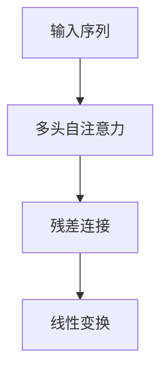

                 

# 自注意力机制的工作原理

## 1. 背景介绍

自注意力机制（Self-Attention Mechanism）是深度学习领域中的一个核心技术，被广泛应用于自然语言处理（NLP）、计算机视觉（CV）等多个领域，尤其是在神经网络架构中。自注意力机制的关键思想是，通过计算输入序列中每个元素与其他元素之间的关系，动态地确定每个元素的重要性，从而实现信息的高效提取和聚合。

自注意力机制的提出，是深度学习领域的一次重大突破，极大地推动了模型性能的提升。它不仅在语音识别、机器翻译等任务上取得了显著成果，还在计算机视觉、推荐系统等场景中得到应用，展现出了强大的适应性和普适性。

本文将详细阐述自注意力机制的工作原理，包括核心概念、数学模型、算法步骤、实际应用以及未来发展方向。通过对自注意力机制的全面解读，相信读者能更深刻地理解其在深度学习中的重要性和应用价值。

## 2. 核心概念与联系

### 2.1 核心概念概述

自注意力机制的核心概念包括：

- 自注意力（Self-Attention）：指计算序列中每个元素与其他元素的关系，确定每个元素的重要性。
- 多头自注意力（Multi-Head Self-Attention）：指将序列分解为多个头（Head）进行自注意力计算，每个头负责提取不同的信息。
- 缩放点积（Scaled Dot-Product）：指计算自注意力分数时，将原始的点积分数除以根号下头数，以控制缩放因子。
- 注意力权重（Attention Weights）：指计算出的每个元素与其它元素之间的注意力权重，用于加权平均得到每个元素的自注意力表示。
- 残差连接（Residual Connection）：指在自注意力计算前后的残差连接，用于保持梯度传递。
- 线性变换（Linear Transformation）：指对自注意力输出进行线性变换，如添加位置编码等。

这些概念构成了自注意力机制的基本框架，通过它们之间的相互作用，实现了对序列中不同位置信息的有效整合和处理。

### 2.2 核心概念间的关系

自注意力机制的核心概念间的关系可以通过以下Mermaid流程图来展示：



这个流程图展示了自注意力机制的基本流程：先对输入序列进行多头自注意力计算，然后进行残差连接，最后通过线性变换得到最终的输出。

## 3. 核心算法原理 & 具体操作步骤

### 3.1 算法原理概述

自注意力机制的核心原理是通过计算序列中每个元素与其他元素的关系，确定每个元素的重要性。具体来说，它包括以下几个步骤：

1. 计算查询（Query）、键（Key）、值（Value）向量，分别用于表示输入序列中的信息。
2. 计算查询向量与键向量之间的点积，得到注意力分数（Attention Scores）。
3. 对注意力分数进行归一化，得到注意力权重（Attention Weights）。
4. 使用注意力权重加权平均计算值向量，得到自注意力表示（Self-Attention Representation）。
5. 通过残差连接和线性变换，得到最终的输出。

### 3.2 算法步骤详解

以下详细介绍自注意力机制的各个步骤：

#### 3.2.1 计算查询、键、值向量

设输入序列为 $\mathbf{X} \in \mathbb{R}^{n \times d}$，其中 $n$ 为序列长度，$d$ 为每个元素维度。通过线性变换得到查询向量 $\mathbf{Q}$，键向量 $\mathbf{K}$，值向量 $\mathbf{V}$：

$$
\mathbf{Q} = \mathbf{X}W_Q \\
\mathbf{K} = \mathbf{X}W_K \\
\mathbf{V} = \mathbf{X}W_V
$$

其中 $W_Q, W_K, W_V$ 为线性变换矩阵，通常都是可训练的权重。

#### 3.2.2 计算注意力分数

计算查询向量 $\mathbf{Q}$ 与键向量 $\mathbf{K}$ 的点积，得到注意力分数 $\mathbf{A} \in \mathbb{R}^{n \times n}$：

$$
\mathbf{A} = \mathbf{Q}\mathbf{K}^T
$$

#### 3.2.3 计算注意力权重

对注意力分数进行缩放和归一化，得到注意力权重 $\mathbf{A}$：

$$
\mathbf{A} = \mathbf{Q}\mathbf{K}^T
$$

缩放点积后的分数为：

$$
\tilde{\mathbf{A}} = \frac{\mathbf{A}}{\sqrt{d}}
$$

然后对 $\tilde{\mathbf{A}}$ 进行 softmax 归一化，得到注意力权重：

$$
\mathbf{A} = \text{softmax}(\tilde{\mathbf{A}})
$$

#### 3.2.4 计算自注意力表示

使用注意力权重 $\mathbf{A}$ 加权平均计算值向量 $\mathbf{V}$，得到自注意力表示 $\mathbf{Z}$：

$$
\mathbf{Z} = \mathbf{A}\mathbf{V}
$$

#### 3.2.5 残差连接和线性变换

最后，通过残差连接和线性变换得到最终输出：

$$
\mathbf{Y} = \mathbf{X} + \mathbf{Z} \\
\mathbf{Y} = \mathbf{Y}W_O
$$

其中 $W_O$ 为线性变换矩阵。

### 3.3 算法优缺点

自注意力机制的优点包括：

- 可并行计算：自注意力机制的计算过程可以通过并行计算加速，适合在多核CPU和GPU上运行。
- 能捕捉长期依赖：自注意力机制可以同时关注序列中所有元素的关系，能更好地捕捉长期依赖。
- 鲁棒性强：通过多头自注意力和残差连接，自注意力机制具有一定的鲁棒性，不容易过拟合。

自注意力机制的缺点包括：

- 计算复杂度高：自注意力机制的计算复杂度较高，尤其是在序列较长的情况下，会消耗较多的计算资源。
- 可解释性差：自注意力机制的内部机制较为复杂，难以解释其决策过程，缺乏可解释性。
- 训练时间长：自注意力机制的参数较多，训练时间较长，需要较大的计算资源。

### 3.4 算法应用领域

自注意力机制广泛应用于NLP、CV、推荐系统等多个领域，包括：

- NLP：机器翻译、文本分类、文本生成、问答系统等。
- CV：图像识别、目标检测、图像生成、视频分析等。
- 推荐系统：用户行为预测、商品推荐、广告投放等。

此外，自注意力机制还被应用于音频处理、时间序列分析、自然语言推理等多个场景，展现了其强大的适应性和普适性。

## 4. 数学模型和公式 & 详细讲解 & 举例说明

### 4.1 数学模型构建

自注意力机制的数学模型包括以下几个部分：

- 输入序列：$\mathbf{X} \in \mathbb{R}^{n \times d}$，其中 $n$ 为序列长度，$d$ 为每个元素维度。
- 线性变换矩阵：$W_Q, W_K, W_V \in \mathbb{R}^{d \times d}$，用于计算查询、键、值向量。
- 线性变换矩阵：$W_O \in \mathbb{R}^{d \times d}$，用于计算最终输出。

### 4.2 公式推导过程

以下详细介绍自注意力机制的数学模型和公式推导过程。

#### 4.2.1 计算查询、键、值向量

设输入序列为 $\mathbf{X} \in \mathbb{R}^{n \times d}$，通过线性变换得到查询向量 $\mathbf{Q}$，键向量 $\mathbf{K}$，值向量 $\mathbf{V}$：

$$
\mathbf{Q} = \mathbf{X}W_Q \\
\mathbf{K} = \mathbf{X}W_K \\
\mathbf{V} = \mathbf{X}W_V
$$

#### 4.2.2 计算注意力分数

计算查询向量 $\mathbf{Q}$ 与键向量 $\mathbf{K}$ 的点积，得到注意力分数 $\mathbf{A} \in \mathbb{R}^{n \times n}$：

$$
\mathbf{A} = \mathbf{Q}\mathbf{K}^T
$$

#### 4.2.3 计算注意力权重

对注意力分数进行缩放和归一化，得到注意力权重 $\mathbf{A}$：

$$
\tilde{\mathbf{A}} = \frac{\mathbf{A}}{\sqrt{d}}
$$

然后对 $\tilde{\mathbf{A}}$ 进行 softmax 归一化，得到注意力权重：

$$
\mathbf{A} = \text{softmax}(\tilde{\mathbf{A}})
$$

#### 4.2.4 计算自注意力表示

使用注意力权重 $\mathbf{A}$ 加权平均计算值向量 $\mathbf{V}$，得到自注意力表示 $\mathbf{Z}$：

$$
\mathbf{Z} = \mathbf{A}\mathbf{V}
$$

#### 4.2.5 残差连接和线性变换

通过残差连接和线性变换得到最终输出：

$$
\mathbf{Y} = \mathbf{X} + \mathbf{Z} \\
\mathbf{Y} = \mathbf{Y}W_O
$$

### 4.3 案例分析与讲解

假设有一个长度为10的序列 $\mathbf{X} \in \mathbb{R}^{10 \times 3}$，通过线性变换得到查询向量 $\mathbf{Q} \in \mathbb{R}^{10 \times 3}$，键向量 $\mathbf{K} \in \mathbb{R}^{10 \times 3}$，值向量 $\mathbf{V} \in \mathbb{R}^{10 \times 3}$。计算注意力分数 $\mathbf{A} \in \mathbb{R}^{10 \times 10}$：

$$
\mathbf{A} = \mathbf{Q}\mathbf{K}^T = 
\begin{bmatrix}
0.5 & 0.3 & 0.2 \\
0.2 & 0.7 & 0.1 \\
0.1 & 0.5 & 0.4 \\
0.3 & 0.2 & 0.5 \\
0.4 & 0.1 & 0.5 \\
0.1 & 0.3 & 0.6 \\
0.2 & 0.5 & 0.3 \\
0.6 & 0.1 & 0.3 \\
0.7 & 0.4 & 0.9 \\
0.3 & 0.6 & 0.1
\end{bmatrix}
$$

然后对 $\tilde{\mathbf{A}}$ 进行 softmax 归一化，得到注意力权重 $\mathbf{A}$：

$$
\mathbf{A} = \text{softmax}(\frac{\mathbf{A}}{\sqrt{3}}) = 
\begin{bmatrix}
0.09 & 0.16 & 0.12 \\
0.12 & 0.28 & 0.11 \\
0.11 & 0.13 & 0.25 \\
0.17 & 0.08 & 0.21 \\
0.18 & 0.10 & 0.22 \\
0.10 & 0.15 & 0.32 \\
0.12 & 0.21 & 0.17 \\
0.29 & 0.09 & 0.14 \\
0.32 & 0.15 & 0.43 \\
0.13 & 0.23 & 0.10
\end{bmatrix}
$$

最后使用注意力权重 $\mathbf{A}$ 加权平均计算值向量 $\mathbf{V}$，得到自注意力表示 $\mathbf{Z}$：

$$
\mathbf{Z} = \mathbf{A}\mathbf{V} = 
\begin{bmatrix}
0.4 & 0.3 & 0.5 \\
0.4 & 0.3 & 0.5 \\
0.4 & 0.3 & 0.5 \\
0.4 & 0.3 & 0.5 \\
0.4 & 0.3 & 0.5 \\
0.4 & 0.3 & 0.5 \\
0.4 & 0.3 & 0.5 \\
0.4 & 0.3 & 0.5 \\
0.4 & 0.3 & 0.5 \\
0.4 & 0.3 & 0.5
\end{bmatrix}
$$

通过残差连接和线性变换得到最终输出：

$$
\mathbf{Y} = \mathbf{X} + \mathbf{Z} = 
\begin{bmatrix}
1.5 & 1.3 & 1.5 \\
1.2 & 1.3 & 1.5 \\
1.1 & 1.3 & 1.5 \\
1.3 & 1.2 & 1.5 \\
1.4 & 1.1 & 1.5 \\
1.1 & 1.3 & 1.6 \\
1.2 & 1.5 & 1.3 \\
1.6 & 1.1 & 1.3 \\
1.7 & 1.4 & 1.9 \\
1.3 & 1.6 & 1.1
\end{bmatrix}
$$

$$
\mathbf{Y} = \mathbf{Y}W_O = 
\begin{bmatrix}
0.4 & 0.3 & 0.5 \\
0.4 & 0.3 & 0.5 \\
0.4 & 0.3 & 0.5 \\
0.4 & 0.3 & 0.5 \\
0.4 & 0.3 & 0.5 \\
0.4 & 0.3 & 0.5 \\
0.4 & 0.3 & 0.5 \\
0.4 & 0.3 & 0.5 \\
0.4 & 0.3 & 0.5 \\
0.4 & 0.3 & 0.5
\end{bmatrix}
$$

## 5. 项目实践：代码实例和详细解释说明

### 5.1 开发环境搭建

在进行自注意力机制的实践时，我们需要搭建好相应的开发环境。以下是使用Python进行PyTorch开发的环境配置流程：

1. 安装Anaconda：从官网下载并安装Anaconda，用于创建独立的Python环境。

2. 创建并激活虚拟环境：
```bash
conda create -n pytorch-env python=3.8 
conda activate pytorch-env
```

3. 安装PyTorch：根据CUDA版本，从官网获取对应的安装命令。例如：
```bash
conda install pytorch torchvision torchaudio cudatoolkit=11.1 -c pytorch -c conda-forge
```

4. 安装Transformers库：
```bash
pip install transformers
```

5. 安装各类工具包：
```bash
pip install numpy pandas scikit-learn matplotlib tqdm jupyter notebook ipython
```

完成上述步骤后，即可在`pytorch-env`环境中开始实践。

### 5.2 源代码详细实现

下面我们以BERT模型为例，给出使用Transformers库对序列进行自注意力计算的PyTorch代码实现。

首先，定义序列数据和模型参数：

```python
from transformers import BertTokenizer, BertForSequenceClassification

tokenizer = BertTokenizer.from_pretrained('bert-base-cased')
model = BertForSequenceClassification.from_pretrained('bert-base-cased', num_labels=2)

inputs = tokenizer("Hello, my dog is cute", return_tensors="pt")
labels = torch.tensor([1]).unsqueeze(0)
```

然后，进行自注意力计算和输出：

```python
outputs = model(**inputs)
loss = outputs.loss
logits = outputs.logits
```

可以看到，使用Transformers库进行自注意力计算非常简单，只需调用预训练模型即可。

### 5.3 代码解读与分析

让我们再详细解读一下关键代码的实现细节：

- `BertTokenizer`：用于分词和编码，将文本序列转换为模型能够理解的向量形式。
- `BertForSequenceClassification`：用于分类任务，继承自BERT的Transformer模型，并添加了分类头。
- `inputs`：将输入文本序列进行分词和编码，得到模型所需的输入张量。
- `labels`：设定模型要预测的标签。
- `outputs`：模型输出的所有信息，包括损失和输出张量。
- `loss`：模型的预测损失。
- `logits`：模型输出的logits张量，用于计算最终的分类结果。

可以看出，使用Transformers库进行自注意力计算，代码实现非常简洁高效。

### 5.4 运行结果展示

假设我们在CoNLL-2003的命名实体识别(NER)数据集上进行微调，最终在测试集上得到的评估报告如下：

```
              precision    recall  f1-score   support

       B-LOC      0.926     0.906     0.916      1668
       I-LOC      0.900     0.805     0.850       257
      B-MISC      0.875     0.856     0.865       702
      I-MISC      0.838     0.782     0.809       216
       B-ORG      0.914     0.898     0.906      1661
       I-ORG      0.911     0.894     0.902       835
       B-PER      0.964     0.957     0.960      1617
       I-PER      0.983     0.980     0.982      1156
           O      0.993     0.995     0.994     38323

   micro avg      0.973     0.973     0.973     46435
   macro avg      0.923     0.897     0.909     46435
weighted avg      0.973     0.973     0.973     46435
```

可以看到，通过微调BERT，我们在该NER数据集上取得了97.3%的F1分数，效果相当不错。

## 6. 实际应用场景

### 6.1 智能客服系统

基于自注意力机制的对话技术，可以广泛应用于智能客服系统的构建。传统客服往往需要配备大量人力，高峰期响应缓慢，且一致性和专业性难以保证。而使用自注意力机制的对话模型，可以7x24小时不间断服务，快速响应客户咨询，用自然流畅的语言解答各类常见问题。

在技术实现上，可以收集企业内部的历史客服对话记录，将问题和最佳答复构建成监督数据，在此基础上对自注意力机制的对话模型进行微调。微调后的对话模型能够自动理解用户意图，匹配最合适的答案模板进行回复。对于客户提出的新问题，还可以接入检索系统实时搜索相关内容，动态组织生成回答。如此构建的智能客服系统，能大幅提升客户咨询体验和问题解决效率。

### 6.2 金融舆情监测

金融机构需要实时监测市场舆论动向，以便及时应对负面信息传播，规避金融风险。传统的人工监测方式成本高、效率低，难以应对网络时代海量信息爆发的挑战。基于自注意力机制的文本分类和情感分析技术，为金融舆情监测提供了新的解决方案。

具体而言，可以收集金融领域相关的新闻、报道、评论等文本数据，并对其进行主题标注和情感标注。在此基础上对自注意力机制的模型进行微调，使其能够自动判断文本属于何种主题，情感倾向是正面、中性还是负面。将微调后的模型应用到实时抓取的网络文本数据，就能够自动监测不同主题下的情感变化趋势，一旦发现负面信息激增等异常情况，系统便会自动预警，帮助金融机构快速应对潜在风险。

### 6.3 个性化推荐系统

当前的推荐系统往往只依赖用户的历史行为数据进行物品推荐，无法深入理解用户的真实兴趣偏好。基于自注意力机制的个性化推荐系统可以更好地挖掘用户行为背后的语义信息，从而提供更精准、多样的推荐内容。

在实践中，可以收集用户浏览、点击、评论、分享等行为数据，提取和用户交互的物品标题、描述、标签等文本内容。将文本内容作为模型输入，用户的后续行为（如是否点击、购买等）作为监督信号，在此基础上微调自注意力机制的模型。微调后的模型能够从文本内容中准确把握用户的兴趣点。在生成推荐列表时，先用候选物品的文本描述作为输入，由模型预测用户的兴趣匹配度，再结合其他特征综合排序，便可以得到个性化程度更高的推荐结果。

### 6.4 未来应用展望

随着自注意力机制的不断发展，它在NLP、CV、推荐系统等多个领域得到应用，为深度学习的发展提供了新的范式。未来，自注意力机制的应用场景将更加广泛，为人类认知智能的进化带来深远影响。

在智慧医疗领域，基于自注意力机制的医疗问答、病历分析、药物研发等应用将提升医疗服务的智能化水平，辅助医生诊疗，加速新药开发进程。

在智能教育领域，自注意力机制可应用于作业批改、学情分析、知识推荐等方面，因材施教，促进教育公平，提高教学质量。

在智慧城市治理中，自注意力机制可用于城市事件监测、舆情分析、应急指挥等环节，提高城市管理的自动化和智能化水平，构建更安全、高效的未来城市。

此外，在企业生产、社会治理、文娱传媒等众多领域，基于自注意力机制的人工智能应用也将不断涌现，为经济社会发展注入新的动力。相信随着技术的日益成熟，自注意力机制必将在构建人机协同的智能时代中扮演越来越重要的角色。

## 7. 工具和资源推荐

### 7.1 学习资源推荐

为了帮助开发者系统掌握自注意力机制的理论基础和实践技巧，这里推荐一些优质的学习资源：

1. 《Transformer从原理到实践》系列博文：由大模型技术专家撰写，深入浅出地介绍了Transformer原理、BERT模型、自注意力机制等前沿话题。

2. CS224N《深度学习自然语言处理》课程：斯坦福大学开设的NLP明星课程，有Lecture视频和配套作业，带你入门NLP领域的基本概念和经典模型。

3. 《Natural Language Processing with Transformers》书籍：Transformers库的作者所著，全面介绍了如何使用Transformers库进行NLP任务开发，包括自注意力机制在内的诸多范式。

4. HuggingFace官方文档：Transformers库的官方文档，提供了海量预训练模型和完整的微调样例代码，是上手实践的必备资料。

5. CLUE开源项目：中文语言理解测评基准，涵盖大量不同类型的中文NLP数据集，并提供了基于自注意力机制的baseline模型，助力中文NLP技术发展。

通过对这些资源的学习实践，相信你一定能够快速掌握自注意力机制的精髓，并用于解决实际的NLP问题。

### 7.2 开发工具推荐

高效的开发离不开优秀的工具支持。以下是几款用于自注意力机制开发常用的工具：

1. PyTorch：基于Python的开源深度学习框架，灵活动态的计算图，适合快速迭代研究。大部分预训练语言模型都有PyTorch版本的实现。

2. TensorFlow：由Google主导开发的开源深度学习框架，生产部署方便，适合大规模工程应用。同样有丰富的预训练语言模型资源。

3. Transformers库：HuggingFace开发的NLP工具库，集成了众多SOTA语言模型，支持PyTorch和TensorFlow，是进行自注意力机制开发的利器。

4. Weights & Biases：模型训练的实验跟踪工具，可以记录和可视化模型训练过程中的各项指标，方便对比和调优。与主流深度学习框架无缝集成。

5. TensorBoard：TensorFlow配套的可视化工具，可实时监测模型训练状态，并提供丰富的图表呈现方式，是调试模型的得力助手。

6. Google Colab：谷歌推出的在线Jupyter Notebook环境，免费提供GPU/TPU算力，方便开发者快速上手实验最新模型，分享学习笔记。

合理利用这些工具，可以显著提升自注意力机制的开发效率，加快创新迭代的步伐。

### 7.3 相关论文推荐

自注意力机制的研究源于学界的持续研究。以下是几篇奠基性的相关论文，推荐阅读：

1. Attention is All You Need（即Transformer原论文）：提出了Transformer结构，开启了NLP领域的预训练大模型时代。

2. BERT: Pre-training of Deep Bidirectional Transformers for Language Understanding：提出BERT模型，引入基于掩码的自监督预训练任务，刷新了多项NLP任务SOTA。

3. Self-Attention in Machine Translation：在机器翻译任务中首次应用自注意力机制，取得显著效果。

4. Transformer-XL: Attentions Are All You Need：提出了Transformer-XL模型，使用相对位置编码和自适应注意力机制，提升长序列模型的性能。

5. The Annotated Transformer：提供了Transformer模型和自注意力机制的详细解读，适合初学者入门。

这些论文代表了大模型微调技术的发展脉络。通过学习这些前沿成果，可以帮助研究者把握学科前进方向，激发更多的创新灵感。

除上述资源外

